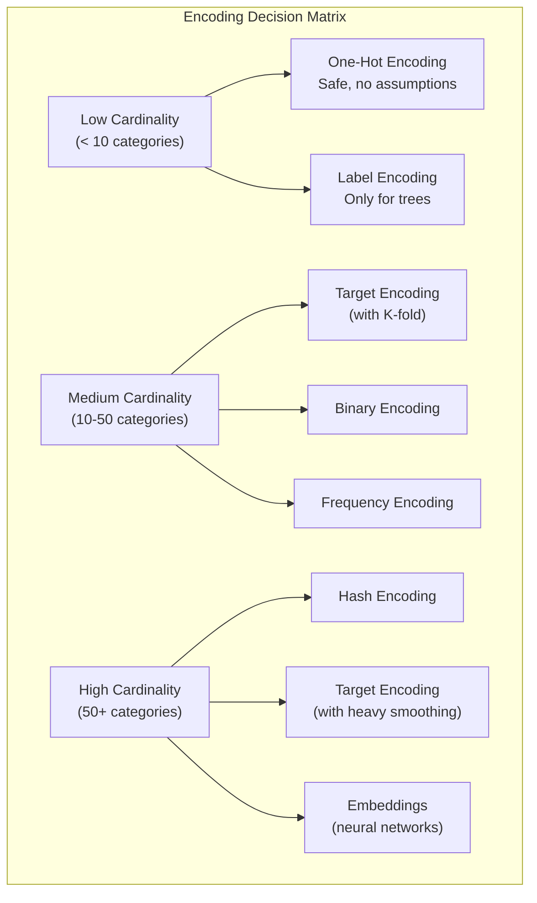

# Encoding Strategies for Categorical Variables

Machine learning models operate on numbers. Categorical variables need encoding. The choice of encoding can make or break your model — it determines what information the model can learn, how much memory it uses, and whether it overfits rare categories.

This page covers ten encoding methods, when each is appropriate, their pitfalls, and a benchmark comparison.

## The Dataset

We will generate a dataset with categorical variables of different cardinalities and structures.

```python
import numpy as np
import pandas as pd
import matplotlib.pyplot as plt
import seaborn as sns
from sklearn.model_selection import cross_val_score, train_test_split
from sklearn.linear_model import LogisticRegression
from sklearn.ensemble import GradientBoostingClassifier
from sklearn.metrics import roc_auc_score

np.random.seed(42)
n = 5000

# Low cardinality (5 categories)
colors = np.random.choice(["Red", "Blue", "Green", "Yellow", "Black"],
                           size=n, p=[0.30, 0.25, 0.20, 0.15, 0.10])

# Medium cardinality (20 categories)
cities = [f"City_{i:02d}" for i in range(20)]
city_probs = np.random.dirichlet(np.ones(20))
city = np.random.choice(cities, size=n, p=city_probs)

# High cardinality (500 categories)
zip_codes = [f"ZIP_{i:05d}" for i in range(500)]
zip_probs = np.random.dirichlet(np.ones(500) * 0.5)
zipcode = np.random.choice(zip_codes, size=n, p=zip_probs)

# Ordinal (4 ordered levels)
education = np.random.choice(["HS", "BS", "MS", "PhD"],
                              size=n, p=[0.30, 0.35, 0.25, 0.10])

# Numerical features
age = np.random.normal(35, 10, n)
income = np.random.lognormal(11, 0.5, n)

# Target (binary) — depends on features
logit = (
    0.3 * (np.array([{"Red": 0, "Blue": 1, "Green": -0.5, "Yellow": 0.5, "Black": -1}[c] for c in colors]))
    + 0.2 * np.array([{"HS": -1, "BS": 0, "MS": 0.5, "PhD": 1}[e] for e in education])
    + 0.001 * (age - 35)
    + 0.0001 * (income - 60000) / 10000
    + np.random.normal(0, 0.5, n)
)
target = (logit > np.median(logit)).astype(int)

df = pd.DataFrame({
    "color": colors, "city": city, "zipcode": zipcode,
    "education": education, "age": age, "income": income, "target": target,
})

print(f"Shape: {df.shape}")
print(f"Cardinalities: color={df['color'].nunique()}, city={df['city'].nunique()}, "
      f"zipcode={df['zipcode'].nunique()}, education={df['education'].nunique()}")
print(f"Target balance: {df['target'].mean():.3f}")
```

## 1. One-Hot Encoding (Dummy Variables)

Creates a binary column for each category. The gold standard for low-cardinality nominal variables.

```python
# One-hot encoding
ohe = pd.get_dummies(df["color"], prefix="color", dtype=int)
print("One-hot encoded 'color':")
print(ohe.head())
print(f"Shape: {ohe.shape}")

# Drop-first variant (avoids multicollinearity in linear models)
ohe_drop = pd.get_dummies(df["color"], prefix="color", drop_first=True, dtype=int)
print(f"\nDrop-first shape: {ohe_drop.shape}")
```

| Pros | Cons |
|------|------|
| No ordinality assumption | Explodes with high cardinality (500 categories → 500 columns) |
| Works with any model | Sparse matrix — wasteful for tree models |
| No target leakage | Unseen categories at prediction time cause errors |

::: warning Cardinality explosion
One-hot encoding a column with 10,000 categories creates 10,000 binary columns. For high cardinality, use target encoding, hashing, or embeddings instead.
:::

## 2. Label Encoding

Assigns an integer to each category. Fast and memory-efficient, but implies a false ordering.

```python
from sklearn.preprocessing import LabelEncoder

le = LabelEncoder()
df["color_label"] = le.fit_transform(df["color"])

print("Label encoded 'color':")
print(dict(zip(le.classes_, le.transform(le.classes_))))
print(f"\nThe model now thinks Black(0) < Blue(1) < Green(2) < Red(3) < Yellow(4)")
print("This ordering is MEANINGLESS for nominal variables.")
```

::: danger Never label-encode nominal variables for linear models
Label encoding assigns arbitrary integers. A linear model will interpret these as "Red (3) is 3x more than Blue (1)." This is nonsensical for nominal categories. Label encoding is only safe for tree-based models (which split on thresholds, not magnitudes).
:::

## 3. Ordinal Encoding

Like label encoding, but the integers reflect a meaningful order.

```python
from sklearn.preprocessing import OrdinalEncoder

edu_order = [["HS", "BS", "MS", "PhD"]]
oe = OrdinalEncoder(categories=edu_order)
df["education_ordinal"] = oe.fit_transform(df[["education"]])

print("Ordinal encoded 'education':")
for i, cat in enumerate(edu_order[0]):
    print(f"  {cat} → {i}")
print("\nThis ordering IS meaningful: HS < BS < MS < PhD")
```

## 4. Target Encoding (Mean Encoding)

Replaces each category with the mean of the target variable for that category. Powerful for high-cardinality features.

```python
def target_encode(df, col, target_col, smoothing=10):
    """Target encoding with smoothing to prevent overfitting on rare categories."""
    global_mean = df[target_col].mean()
    agg = df.groupby(col)[target_col].agg(["mean", "count"])

    # Smoothing: blend category mean with global mean
    # Weight = count / (count + smoothing)
    agg["weight"] = agg["count"] / (agg["count"] + smoothing)
    agg["smoothed_mean"] = agg["weight"] * agg["mean"] + (1 - agg["weight"]) * global_mean

    mapping = agg["smoothed_mean"].to_dict()
    return df[col].map(mapping), mapping

# Target encode city (medium cardinality)
df["city_target"], city_mapping = target_encode(df, "city", "target", smoothing=10)

print("Target encoding for 'city' (top 10):")
sorted_mapping = sorted(city_mapping.items(), key=lambda x: x[1], reverse=True)
for city_name, enc in sorted_mapping[:10]:
    count = (df["city"] == city_name).sum()
    print(f"  {city_name}: encoded={enc:.4f} (n={count})")
```

::: danger Target leakage in target encoding
Target encoding uses the target variable to create features. This leaks information if done on the full training set. Always use leave-one-out or k-fold target encoding to prevent overfitting.
:::

```python
def target_encode_kfold(df, col, target_col, n_folds=5, smoothing=10):
    """K-fold target encoding to prevent leakage."""
    from sklearn.model_selection import KFold

    global_mean = df[target_col].mean()
    encoded = pd.Series(np.nan, index=df.index)

    kf = KFold(n_splits=n_folds, shuffle=True, random_state=42)
    for train_idx, val_idx in kf.split(df):
        train = df.iloc[train_idx]
        agg = train.groupby(col)[target_col].agg(["mean", "count"])
        agg["weight"] = agg["count"] / (agg["count"] + smoothing)
        agg["smoothed"] = agg["weight"] * agg["mean"] + (1 - agg["weight"]) * global_mean
        mapping = agg["smoothed"].to_dict()
        encoded.iloc[val_idx] = df.iloc[val_idx][col].map(mapping)

    # Fill any unmapped with global mean
    encoded = encoded.fillna(global_mean)
    return encoded

df["city_target_kfold"] = target_encode_kfold(df, "city", "target")
```

## 5. Frequency Encoding

Replaces each category with its frequency (count or proportion). Captures category popularity without target leakage.

```python
# Frequency encoding
freq_map = df["zipcode"].value_counts(normalize=True).to_dict()
df["zipcode_freq"] = df["zipcode"].map(freq_map)

print("Frequency encoding for 'zipcode' (sample):")
sample = df[["zipcode", "zipcode_freq"]].drop_duplicates().sort_values("zipcode_freq", ascending=False)
print(sample.head(10).to_string(index=False))
print(f"\nUnique encoded values: {df['zipcode_freq'].nunique()}")
print("Note: Different categories with the same count get the same encoding.")
```

## 6. Binary Encoding

Converts the category index to binary representation. Balances between one-hot (too many columns) and label encoding (false ordering).

```python
def binary_encode(series):
    """Binary encoding: convert label index to binary digits."""
    le = LabelEncoder()
    integer_encoded = le.fit_transform(series)
    max_val = integer_encoded.max()
    n_bits = int(np.ceil(np.log2(max_val + 1)))

    binary_cols = {}
    for bit in range(n_bits):
        binary_cols[f"{series.name}_bit{bit}"] = (integer_encoded >> bit) & 1

    return pd.DataFrame(binary_cols)

binary_city = binary_encode(df["city"])
print(f"City: {df['city'].nunique()} categories → {binary_city.shape[1]} binary columns")
print(f"(One-hot would create {df['city'].nunique()} columns)")
print(binary_city.head())
```

## 7. Hash Encoding

Maps categories to a fixed number of columns using a hash function. Handles unseen categories naturally.

```python
def hash_encode(series, n_components=8):
    """Hash encoding using Python's built-in hash."""
    result = pd.DataFrame(0, index=series.index,
                           columns=[f"{series.name}_hash{i}" for i in range(n_components)])
    for idx, val in series.items():
        hash_val = hash(str(val))
        col_idx = hash_val % n_components
        result.iloc[idx, col_idx] = 1
    return result

hash_zip = hash_encode(df["zipcode"], n_components=16)
print(f"Zipcode: {df['zipcode'].nunique()} categories → {hash_zip.shape[1]} hash columns")
print(f"(One-hot: {df['zipcode'].nunique()} columns, Binary: {int(np.ceil(np.log2(500)))} columns)")
print("\nNote: Hash collisions are expected and accepted.")
```

## 8. Weight of Evidence (WOE)

Used primarily in credit scoring. Measures the predictive power of each category with respect to a binary target.

```python
def woe_encode(df, col, target_col):
    """Weight of Evidence encoding for binary classification."""
    eps = 1e-10  # avoid log(0)
    total_events = df[target_col].sum()
    total_non_events = len(df) - total_events

    agg = df.groupby(col)[target_col].agg(["sum", "count"])
    agg.columns = ["events", "total"]
    agg["non_events"] = agg["total"] - agg["events"]

    agg["pct_events"] = agg["events"] / total_events
    agg["pct_non_events"] = agg["non_events"] / total_non_events
    agg["woe"] = np.log((agg["pct_non_events"] + eps) / (agg["pct_events"] + eps))

    # Information Value (IV) — feature-level predictive power
    agg["iv_component"] = (agg["pct_non_events"] - agg["pct_events"]) * agg["woe"]
    iv = agg["iv_component"].sum()

    print(f"\nWOE Encoding: {col}")
    print(f"  Information Value (IV): {iv:.4f}", end="")
    if iv < 0.02:
        print(" (Not predictive)")
    elif iv < 0.1:
        print(" (Weak)")
    elif iv < 0.3:
        print(" (Medium)")
    elif iv < 0.5:
        print(" (Strong)")
    else:
        print(" (Suspicious — possible overfit)")

    print(agg[["events", "non_events", "woe", "iv_component"]].round(4).to_string())
    return df[col].map(agg["woe"].to_dict()), iv

df["color_woe"], iv_color = woe_encode(df, "color", "target")
df["education_woe"], iv_edu = woe_encode(df, "education", "target")
```

## 9. James-Stein Encoding

A Bayesian shrinkage estimator that pulls category means toward the global mean, with shrinkage inversely proportional to within-category variance.

```python
def james_stein_encode(df, col, target_col):
    """James-Stein shrinkage encoding."""
    global_mean = df[target_col].mean()
    global_var = df[target_col].var()

    agg = df.groupby(col)[target_col].agg(["mean", "var", "count"])

    # Shrinkage factor B = var_within / (var_within + var_between)
    # Categories with high variance or low count shrink more toward global mean
    agg["shrinkage"] = agg["var"] / (agg["var"] + global_var / agg["count"])
    agg["js_estimate"] = (1 - agg["shrinkage"]) * global_mean + agg["shrinkage"] * agg["mean"]

    mapping = agg["js_estimate"].to_dict()
    return df[col].map(mapping), mapping

df["city_js"], js_mapping = james_stein_encode(df, "city", "target")
print("James-Stein encoding for 'city' (sample):")
for k, v in sorted(js_mapping.items(), key=lambda x: x[1])[:5]:
    print(f"  {k}: {v:.4f}")
```

## 10. CatBoost Encoding

An ordered target encoding that processes data in a random permutation to prevent leakage, used internally by CatBoost.

```python
def catboost_encode(df, col, target_col, prior=None):
    """CatBoost-style ordered target encoding."""
    if prior is None:
        prior = df[target_col].mean()

    # Random permutation
    permuted = df.sample(frac=1, random_state=42).reset_index(drop=True)
    encoded = pd.Series(np.nan, index=permuted.index)

    # For each row, compute mean of PRECEDING rows with same category
    cumsum = {}
    cumcount = {}

    for idx in range(len(permuted)):
        cat = permuted.loc[idx, col]
        if cat not in cumsum:
            cumsum[cat] = 0
            cumcount[cat] = 0

        # Encoding uses only preceding observations
        encoded.iloc[idx] = (cumsum[cat] + prior) / (cumcount[cat] + 1)

        # Update running stats
        cumsum[cat] += permuted.loc[idx, target_col]
        cumcount[cat] += 1

    # Restore original order
    result = pd.Series(np.nan, index=df.index)
    result.iloc[permuted.index] = encoded.values
    return result

df["city_catboost"] = catboost_encode(df, "city", "target")
```

## Comparison: All Encodings at a Glance



## Benchmark: Model Performance by Encoding

```python
from sklearn.pipeline import Pipeline
from sklearn.preprocessing import StandardScaler

# Prepare different encoding strategies for 'city' column
X_base = df[["age", "income"]].copy()
y = df["target"]

encoding_results = {}

# 1. One-hot
X_ohe = pd.concat([X_base, pd.get_dummies(df["city"], prefix="city", dtype=int)], axis=1)

# 2. Label
X_label = X_base.copy()
X_label["city"] = LabelEncoder().fit_transform(df["city"])

# 3. Target (k-fold)
X_target = X_base.copy()
X_target["city"] = target_encode_kfold(df, "city", "target")

# 4. Frequency
X_freq = X_base.copy()
X_freq["city"] = df["city"].map(df["city"].value_counts(normalize=True))

# 5. WOE
X_woe = X_base.copy()
X_woe["city"], _ = woe_encode(df, "city", "target")

encodings = {
    "One-Hot": X_ohe,
    "Label": X_label,
    "Target (K-fold)": X_target,
    "Frequency": X_freq,
    "WOE": X_woe,
}

print(f"\n{'Encoding':<25s} {'LR AUC':>10s} {'GBM AUC':>10s} {'Columns':>10s}")
print("-" * 58)

for name, X in encodings.items():
    # Fill NaN
    X = X.fillna(X.median())

    # Logistic Regression
    lr = LogisticRegression(max_iter=1000)
    lr_scores = cross_val_score(lr, StandardScaler().fit_transform(X), y,
                                 cv=5, scoring="roc_auc")

    # Gradient Boosting
    gbm = GradientBoostingClassifier(n_estimators=100, max_depth=3, random_state=42)
    gbm_scores = cross_val_score(gbm, X, y, cv=5, scoring="roc_auc")

    print(f"{name:<25s} {lr_scores.mean():>10.4f} {gbm_scores.mean():>10.4f} {X.shape[1]:>10d}")
```

## Pitfall Summary

| Encoding | Biggest Pitfall | Mitigation |
|----------|----------------|------------|
| One-Hot | Memory explosion with high cardinality | Cap at 10-20 categories; group the rest |
| Label | Implies false order for nominal data | Only use with tree models |
| Ordinal | Wrong order destroys information | Verify order with domain knowledge |
| Target | Target leakage | K-fold or leave-one-out encoding |
| Frequency | Collisions (same count = same encoding) | Combine with other features |
| Binary | Splits category info across bits | Test against one-hot |
| Hash | Collisions lose category identity | Increase n_components; accept some loss |
| WOE | Overfits with rare categories | Merge rare categories first |
| James-Stein | Requires continuous target | Use CatBoost encoding for classification |
| CatBoost | Order-dependent results | Average over multiple random permutations |

## Key Takeaways

- One-hot encoding is the safe default for low-cardinality nominal variables. Use `drop_first=True` for linear models.
- Label encoding is only appropriate for tree-based models. Never use it with linear models or distance-based methods on nominal data.
- Target encoding is the most powerful for high cardinality, but requires K-fold to prevent leakage.
- Frequency encoding is leakage-free and works surprisingly well in practice.
- WOE encoding is standard in credit scoring and provides built-in feature importance via Information Value.
- For very high cardinality (1000+), consider hashing or learned embeddings.
- Always benchmark multiple encodings on your actual model. The best encoding depends on the model type, cardinality, and data distribution.
