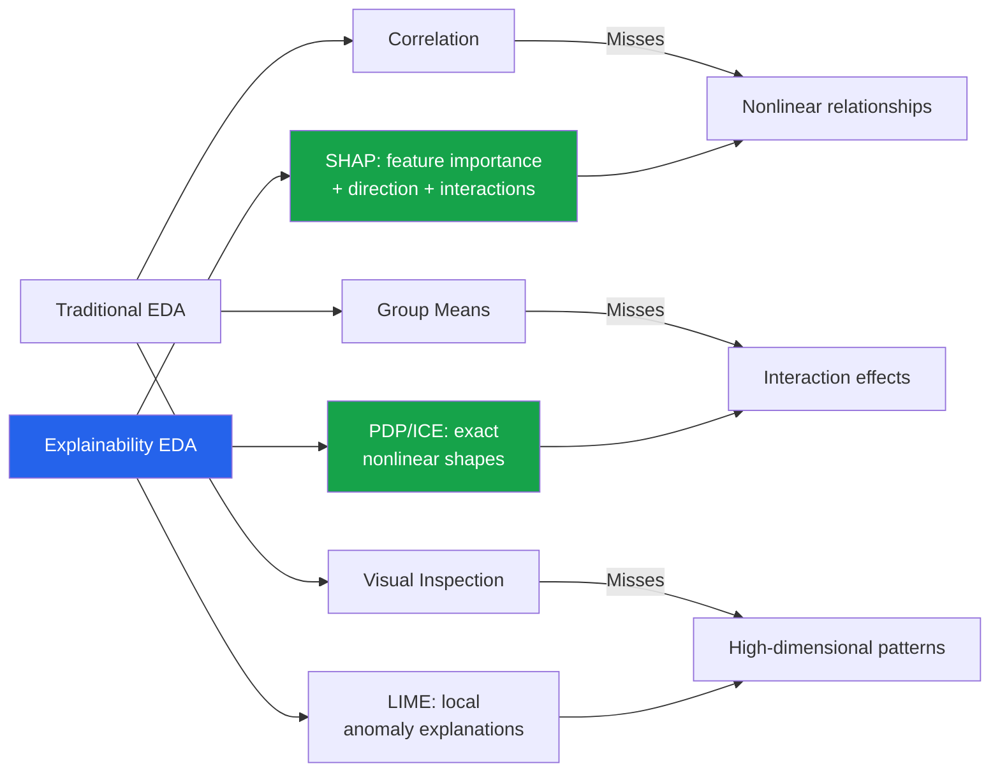

# Explainability as EDA

Model explainability tools (SHAP, LIME, PDP, ICE) are typically used to interpret ML models. However, they are also powerful EDA tools: they reveal nonlinear relationships, interaction effects, and feature importance patterns that basic correlation analysis misses.

---

## Why Use Explainability for EDA?



---

## Setup

```python
import numpy as np
import pandas as pd
import matplotlib.pyplot as plt
import seaborn as sns
from sklearn.ensemble import GradientBoostingRegressor, GradientBoostingClassifier
from sklearn.model_selection import train_test_split

sns.set_theme(style='whitegrid')
np.random.seed(42)

# Create a dataset with known nonlinear relationships
n = 5000
df = pd.DataFrame({
    'age':          np.random.normal(40, 12, n).clip(18, 80),
    'income':       np.random.lognormal(10.5, 0.7, n),
    'credit_score': np.random.normal(700, 60, n).clip(300, 850),
    'debt_ratio':   np.random.beta(2, 5, n),
    'n_accounts':   np.random.poisson(5, n),
    'tenure':       np.random.exponential(8, n).clip(0, 40),
    'is_employed':  np.random.choice([0, 1], n, p=[0.1, 0.9]),
})

# Create target with known relationships
target = (
    0.005 * (df['income'] - 50000) +           # linear
    -20 * (df['debt_ratio'] - 0.3) ** 2 +      # U-shaped
    0.05 * df['credit_score'] +                  # linear
    3 * df['is_employed'] * np.log(df['income']) +  # interaction
    np.where(df['age'] > 55, -5, 0) +           # threshold
    np.random.randn(n) * 5
)
df['approved'] = (target > np.median(target)).astype(int)

X = df.drop(columns=['approved'])
y = df['approved']

X_train, X_test, y_train, y_test = train_test_split(X, y, test_size=0.2, random_state=42)

# Train a model
model = GradientBoostingClassifier(n_estimators=200, max_depth=4, random_state=42)
model.fit(X_train, y_train)
print(f"Accuracy: {model.score(X_test, y_test):.4f}")
```

---

## SHAP (SHapley Additive exPlanations)

### Global Feature Importance

```python
import shap

# Compute SHAP values
explainer = shap.TreeExplainer(model)
shap_values = explainer.shap_values(X_test)

# If binary classification, shap_values may be a list [class_0, class_1]
if isinstance(shap_values, list):
    shap_vals = shap_values[1]  # positive class
else:
    shap_vals = shap_values

# Summary plot: feature importance with direction
fig, ax = plt.subplots(figsize=(10, 6))
shap.summary_plot(shap_vals, X_test, plot_type='bar', show=False)
plt.title('SHAP Feature Importance (Mean |SHAP|)')
plt.tight_layout()
plt.show()

# Beeswarm plot: feature value vs SHAP impact
shap.summary_plot(shap_vals, X_test, show=False)
plt.title('SHAP Beeswarm — Feature Impact Direction')
plt.tight_layout()
plt.show()
```

### SHAP Dependence Plots

```python
# Individual feature effects
fig, axes = plt.subplots(2, 3, figsize=(18, 10))
features = ['income', 'credit_score', 'debt_ratio', 'age', 'tenure', 'n_accounts']

for i, feat in enumerate(features):
    r, c = divmod(i, 3)
    ax = axes[r, c]

    # Manual dependence plot
    feat_idx = X_test.columns.get_loc(feat)
    ax.scatter(X_test[feat], shap_vals[:, feat_idx], alpha=0.3, s=10, color='steelblue')
    ax.set_xlabel(feat)
    ax.set_ylabel(f'SHAP value for {feat}')
    ax.axhline(y=0, color='red', linestyle='--', alpha=0.5)
    ax.set_title(f'{feat} — SHAP Dependence')

plt.tight_layout()
plt.show()
```

### SHAP Interaction Effects

```python
# Interaction detection
shap_interaction_values = explainer.shap_interaction_values(X_test.iloc[:500])
if isinstance(shap_interaction_values, list):
    shap_inter = shap_interaction_values[1]
else:
    shap_inter = shap_interaction_values

# Interaction matrix
interaction_matrix = np.abs(shap_inter).mean(axis=0)
np.fill_diagonal(interaction_matrix, 0)

fig, ax = plt.subplots(figsize=(10, 8))
sns.heatmap(
    pd.DataFrame(interaction_matrix, index=X_test.columns, columns=X_test.columns),
    annot=True, fmt='.3f', cmap='YlOrRd', ax=ax,
)
ax.set_title('SHAP Interaction Matrix (Mean |Interaction|)')
plt.tight_layout()
plt.show()

# Top interactions
print("Top SHAP Interactions:")
for i in range(len(X_test.columns)):
    for j in range(i+1, len(X_test.columns)):
        val = interaction_matrix[i, j]
        if val > 0.01:
            print(f"  {X_test.columns[i]} x {X_test.columns[j]}: {val:.4f}")
```

---

## Partial Dependence Plots (PDP)

```python
from sklearn.inspection import partial_dependence

def plot_pdp(model, X, features, feature_names=None):
    """Plot partial dependence for multiple features."""
    n_features = len(features)
    fig, axes = plt.subplots(1, n_features, figsize=(6 * n_features, 5))
    if n_features == 1:
        axes = [axes]

    for i, feat in enumerate(features):
        ax = axes[i]
        pdp_result = partial_dependence(model, X, features=[feat], kind='average')
        values = pdp_result['values'][0]
        avg_pred = pdp_result['average'][0]

        ax.plot(values, avg_pred, linewidth=2, color='steelblue')
        ax.set_xlabel(feat if feature_names is None else feature_names[i])
        ax.set_ylabel('Partial Dependence')
        ax.set_title(f'PDP: {feat}')
        ax.grid(True, alpha=0.3)

        # Add rug plot (data density)
        ax.plot(X[feat].values[:200], np.full(200, avg_pred.min()),
                '|', color='black', alpha=0.1, markersize=10)

    plt.tight_layout()
    plt.show()

plot_pdp(model, X_test, ['income', 'credit_score', 'debt_ratio', 'age'])
```

### 2D PDP (Interaction Visualization)

```python
from sklearn.inspection import PartialDependenceDisplay

fig, ax = plt.subplots(figsize=(10, 8))
PartialDependenceDisplay.from_estimator(
    model, X_test,
    features=[('income', 'is_employed')],
    kind='average',
    ax=ax,
)
ax.set_title('2D PDP: Income x Employment Interaction')
plt.tight_layout()
plt.show()
```

---

## ICE Plots (Individual Conditional Expectation)

ICE plots show the PDP for individual instances, revealing heterogeneity that the average PDP hides.

```python
def plot_ice(model, X, feature, n_samples=100):
    """Plot ICE curves with PDP overlay."""
    pdp_result = partial_dependence(model, X, features=[feature], kind='individual')
    values = pdp_result['values'][0]
    individual = pdp_result['individual'][0]  # shape: (n_samples, n_grid_points)

    fig, axes = plt.subplots(1, 2, figsize=(14, 5))

    # ICE curves
    sample_idx = np.random.choice(len(individual), min(n_samples, len(individual)), replace=False)
    for idx in sample_idx:
        axes[0].plot(values, individual[idx], alpha=0.1, color='steelblue', linewidth=0.5)

    # PDP overlay
    avg = individual.mean(axis=0)
    axes[0].plot(values, avg, color='red', linewidth=3, label='PDP (average)')
    axes[0].set_xlabel(feature)
    axes[0].set_ylabel('Predicted Probability')
    axes[0].set_title(f'ICE Plot: {feature}')
    axes[0].legend()

    # Centered ICE (c-ICE) — center each curve at the leftmost point
    centered = individual - individual[:, 0:1]
    for idx in sample_idx:
        axes[1].plot(values, centered[idx], alpha=0.1, color='steelblue', linewidth=0.5)
    axes[1].plot(values, centered.mean(axis=0), color='red', linewidth=3, label='c-PDP')
    axes[1].set_xlabel(feature)
    axes[1].set_ylabel('Centered Effect')
    axes[1].set_title(f'Centered ICE: {feature}')
    axes[1].legend()

    plt.tight_layout()
    plt.show()

    # Heterogeneity metric
    std_at_each_point = individual.std(axis=0)
    print(f"ICE heterogeneity for {feature}: "
          f"mean_std={std_at_each_point.mean():.4f}, max_std={std_at_each_point.max():.4f}")
    if std_at_each_point.max() > 2 * std_at_each_point.mean():
        print(f"  -> Likely INTERACTION: the effect of {feature} depends on other features")

plot_ice(model, X_test, 'income')
plot_ice(model, X_test, 'debt_ratio')
```

---

## LIME (Local Interpretable Model-Agnostic Explanations)

```python
import lime
import lime.lime_tabular

# Create LIME explainer
lime_explainer = lime.lime_tabular.LimeTabularExplainer(
    training_data=X_train.values,
    feature_names=X_train.columns.tolist(),
    class_names=['Rejected', 'Approved'],
    mode='classification',
    random_state=42,
)

def explain_instance(idx, X_test, model, explainer):
    """Explain a single prediction with LIME."""
    instance = X_test.iloc[idx]
    explanation = explainer.explain_instance(
        instance.values,
        model.predict_proba,
        num_features=len(X_test.columns),
    )

    print(f"\nInstance {idx}:")
    print(f"  Prediction: {'Approved' if model.predict(instance.values.reshape(1, -1))[0] else 'Rejected'}")
    print(f"  Probability: {model.predict_proba(instance.values.reshape(1, -1))[0]}")
    print(f"\n  Feature contributions:")
    for feat, weight in explanation.as_list():
        direction = "+" if weight > 0 else "-"
        print(f"    {direction} {feat}: {weight:+.4f}")

    # Plot
    fig = explanation.as_pyplot_figure()
    plt.title(f'LIME Explanation for Instance {idx}')
    plt.tight_layout()
    plt.show()

    return explanation

# Explain a few interesting instances
explain_instance(0, X_test, model, lime_explainer)
explain_instance(10, X_test, model, lime_explainer)
```

### Using LIME for Anomaly Investigation

```python
def investigate_anomalies(X_test, y_test, model, explainer, n_anomalies=5):
    """Use LIME to investigate the model's most confident wrong predictions."""
    probs = model.predict_proba(X_test)[:, 1]
    preds = (probs > 0.5).astype(int)
    wrong = preds != y_test.values

    # Most confident wrong predictions
    confidence = np.abs(probs - 0.5)
    confident_wrong = confidence.copy()
    confident_wrong[~wrong] = 0

    top_anomalies = np.argsort(confident_wrong)[-n_anomalies:][::-1]

    print("Most Confident Wrong Predictions:")
    print("=" * 50)
    for idx in top_anomalies:
        if confident_wrong[idx] == 0:
            continue
        print(f"\nInstance {idx}: predicted={preds[idx]}, actual={y_test.values[idx]}, "
              f"prob={probs[idx]:.3f}")
        exp = explainer.explain_instance(
            X_test.iloc[idx].values,
            model.predict_proba,
            num_features=5,
        )
        for feat, weight in exp.as_list()[:5]:
            print(f"  {feat}: {weight:+.4f}")

investigate_anomalies(X_test, y_test, model, lime_explainer)
```

---

## Model-Informed Feature Discovery

```python
def model_informed_features(model, X, feature_names, shap_values):
    """Use model insights to suggest new features."""
    print("MODEL-INFORMED FEATURE DISCOVERY")
    print("=" * 60)

    # 1. Top features for targeted exploration
    mean_shap = np.abs(shap_values).mean(axis=0)
    top_features = np.argsort(mean_shap)[::-1]

    print("\n1. Top features (explore further):")
    for i in top_features[:5]:
        print(f"   {feature_names[i]}: mean|SHAP|={mean_shap[i]:.4f}")

    # 2. Nonlinear features (SHAP dependence is non-monotonic)
    print("\n2. Features with nonlinear effects (consider binning/polynomial):")
    for i in range(len(feature_names)):
        feat_vals = X.iloc[:, i].values
        shap_col = shap_values[:, i]

        # Check if relationship is nonlinear: compare rank correlation to linear
        r_pearson = abs(np.corrcoef(feat_vals, shap_col)[0, 1])
        r_spearman = abs(pd.Series(feat_vals).corr(pd.Series(shap_col), method='spearman'))

        if r_spearman - r_pearson > 0.15:
            print(f"   {feature_names[i]}: Pearson={r_pearson:.3f}, Spearman={r_spearman:.3f} (nonlinear)")

    # 3. Interaction suggestions
    print("\n3. Suggested interaction features:")
    if hasattr(model, 'feature_importances_'):
        # Use SHAP interaction matrix
        interaction_importance = np.abs(shap_values).T @ np.abs(shap_values) / len(shap_values)
        np.fill_diagonal(interaction_importance, 0)

        pairs = []
        for i in range(len(feature_names)):
            for j in range(i+1, len(feature_names)):
                pairs.append((feature_names[i], feature_names[j], interaction_importance[i, j]))

        pairs.sort(key=lambda x: x[2], reverse=True)
        for f1, f2, imp in pairs[:5]:
            print(f"   {f1} x {f2}: interaction_score={imp:.4f}")

model_informed_features(model, X_test, X_test.columns.tolist(), shap_vals)
```

---

## Explainability Tools Comparison

| Tool | Scope | Speed | Model-Agnostic | Best For |
|------|-------|-------|----------------|----------|
| SHAP (Tree) | Global + Local | Fast | Tree models only | Feature importance + interactions |
| SHAP (Kernel) | Global + Local | Slow | Yes | Any model |
| PDP | Global | Fast | Yes | Average feature effects |
| ICE | Global + Local | Fast | Yes | Heterogeneous effects |
| LIME | Local | Medium | Yes | Individual explanations |
| Permutation Importance | Global | Medium | Yes | Simple importance ranking |

---

## Key Takeaways

- **SHAP** is the most informative single tool: it provides direction, magnitude, and interaction effects
- **PDP** shows the average effect of a feature; **ICE** reveals when that average is misleading due to interactions
- **LIME** is ideal for explaining individual predictions and investigating anomalies
- Use SHAP dependence plots to discover **nonlinear relationships** that Pearson correlation misses
- **SHAP interaction values** identify feature combinations worth engineering
- **Model-informed feature discovery** turns explainability output into actionable feature engineering hypotheses
- The pattern is: train a flexible model (GBM, RF), explain it, then use insights to improve the next iteration
- Explainability EDA is especially valuable when the domain is unfamiliar — the model discovers patterns you would not think to test
