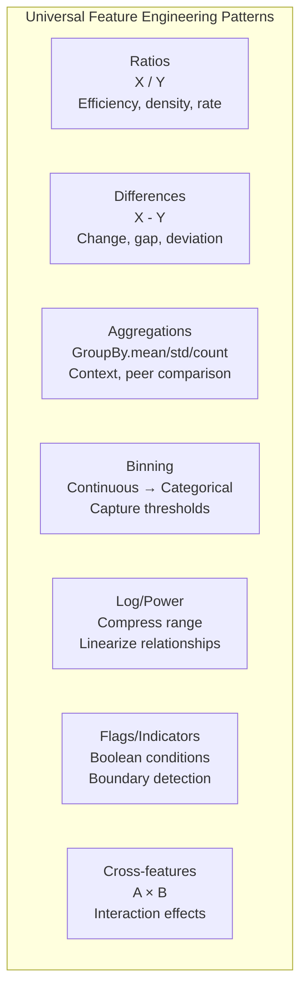

# Feature Creation

Raw features rarely capture the full signal in your data. The relationship between house price and square footage is not just linear — it depends on the neighborhood, the age of the house, and the ratio of bedrooms to bathrooms. Feature creation turns raw columns into features that actually represent these complex relationships.

This page covers polynomial features, interaction terms, ratio and difference features, aggregation features, domain-specific engineering, and automated feature generation.

## The Dataset

We will use a synthetic e-commerce dataset where feature engineering dramatically improves predictions.

```python
import numpy as np
import pandas as pd
import matplotlib.pyplot as plt
import seaborn as sns
from sklearn.model_selection import cross_val_score
from sklearn.linear_model import LinearRegression, Ridge
from sklearn.ensemble import GradientBoostingRegressor
from sklearn.preprocessing import StandardScaler, PolynomialFeatures
from sklearn.pipeline import Pipeline

np.random.seed(42)
n = 3000

# Raw features
price = np.random.lognormal(3, 0.8, n)
quantity = np.random.poisson(3, n) + 1
discount_pct = np.random.uniform(0, 0.5, n)
shipping_cost = np.random.uniform(2, 20, n)
customer_age_days = np.random.exponential(365, n)
n_previous_orders = np.random.poisson(5, n)
page_views = np.random.poisson(15, n)
time_on_site_min = np.random.exponential(10, n)
cart_items = np.random.poisson(4, n) + 1
is_weekend = np.random.binomial(1, 2/7, n)
category = np.random.choice(["Electronics", "Clothing", "Food", "Books", "Sports"], n)

# True relationship involves interactions and nonlinearities
actual_revenue = (
    price * quantity * (1 - discount_pct)
    + 0.5 * np.log1p(customer_age_days) * n_previous_orders
    - 0.3 * shipping_cost * quantity
    + 2.0 * np.sqrt(page_views * time_on_site_min)
    + np.random.normal(0, 10, n)
)
actual_revenue = np.clip(actual_revenue, 0, None)

df = pd.DataFrame({
    "price": price, "quantity": quantity, "discount_pct": discount_pct,
    "shipping_cost": shipping_cost, "customer_age_days": customer_age_days,
    "n_previous_orders": n_previous_orders, "page_views": page_views,
    "time_on_site_min": time_on_site_min, "cart_items": cart_items,
    "is_weekend": is_weekend, "category": category, "revenue": actual_revenue,
})

raw_features = ["price", "quantity", "discount_pct", "shipping_cost",
                "customer_age_days", "n_previous_orders", "page_views",
                "time_on_site_min", "cart_items", "is_weekend"]

print(f"Shape: {df.shape}")
print(df[raw_features + ["revenue"]].describe().round(2))
```

## Baseline: Raw Features Only

```python
X_raw = df[raw_features].copy()
y = df["revenue"]

# Evaluate baseline
baseline_lr = cross_val_score(LinearRegression(), X_raw, y, cv=5, scoring="r2").mean()
baseline_gbm = cross_val_score(
    GradientBoostingRegressor(n_estimators=100, random_state=42),
    X_raw, y, cv=5, scoring="r2"
).mean()

print(f"Baseline (raw features only):")
print(f"  Linear Regression R²: {baseline_lr:.4f}")
print(f"  GBM R²:               {baseline_gbm:.4f}")
```

## Polynomial Features

Polynomial features create powers and products of existing features, enabling linear models to capture nonlinear relationships.

```python
# Degree 2 polynomial features
poly = PolynomialFeatures(degree=2, interaction_only=False, include_bias=False)
X_poly_full = poly.fit_transform(X_raw)
poly_names = poly.get_feature_names_out(raw_features)
print(f"Raw features: {X_raw.shape[1]}")
print(f"Poly(2) features: {X_poly_full.shape[1]}")
print(f"Feature explosion: {X_poly_full.shape[1] / X_raw.shape[1]:.1f}x")

# Interaction-only (no squared terms)
poly_int = PolynomialFeatures(degree=2, interaction_only=True, include_bias=False)
X_poly_int = poly_int.fit_transform(X_raw)
print(f"Interaction-only features: {X_poly_int.shape[1]}")

# Evaluate
poly_lr = cross_val_score(
    Pipeline([("scaler", StandardScaler()), ("ridge", Ridge(alpha=1.0))]),
    X_poly_full, y, cv=5, scoring="r2"
).mean()
print(f"\nPoly(2) + Ridge R²: {poly_lr:.4f} (baseline LR: {baseline_lr:.4f})")
```

::: warning Polynomial explosion
With p features and degree d, you get C(p+d, d) - 1 features. 10 features at degree 3 gives 285 features. At degree 4, it gives 1000. Use ridge/lasso regularization or select only the most important polynomial terms.
:::

## Interaction Terms

Interaction terms capture how the effect of one variable depends on another. They are the most valuable engineered features.

```python
# Manual interaction features (domain-driven)
df_eng = df[raw_features].copy()

# Revenue-related interactions
df_eng["total_price"] = df["price"] * df["quantity"]
df_eng["discounted_price"] = df["price"] * (1 - df["discount_pct"])
df_eng["total_discounted"] = df["price"] * df["quantity"] * (1 - df["discount_pct"])
df_eng["shipping_per_item"] = df["shipping_cost"] / df["quantity"]

# Engagement interactions
df_eng["views_per_minute"] = df["page_views"] / (df["time_on_site_min"] + 1)
df_eng["engagement_score"] = df["page_views"] * df["time_on_site_min"]

# Customer value interactions
df_eng["order_rate"] = df["n_previous_orders"] / (df["customer_age_days"] / 30 + 1)

interaction_features = [c for c in df_eng.columns if c not in raw_features]
print(f"Created {len(interaction_features)} interaction features:")
for f in interaction_features:
    print(f"  {f}")

# Evaluate
int_lr = cross_val_score(LinearRegression(), df_eng, y, cv=5, scoring="r2").mean()
print(f"\nWith interactions LR R²: {int_lr:.4f} (baseline: {baseline_lr:.4f})")
```

### Finding Useful Interactions Automatically

```python
from itertools import combinations

def find_best_interactions(df, features, target, top_n=10):
    """Find feature interactions most correlated with the target."""
    results = []

    for f1, f2 in combinations(features, 2):
        # Multiplication interaction
        interaction = df[f1] * df[f2]
        corr = interaction.corr(target)
        results.append({
            "feature_1": f1, "feature_2": f2,
            "type": "multiply",
            "correlation": abs(corr),
            "signed_corr": corr,
        })

        # Ratio interaction (avoid division by zero)
        if (df[f2] != 0).all():
            ratio = df[f1] / (df[f2] + 1e-8)
            corr_ratio = ratio.corr(target)
            results.append({
                "feature_1": f1, "feature_2": f2,
                "type": "ratio",
                "correlation": abs(corr_ratio),
                "signed_corr": corr_ratio,
            })

    results_df = pd.DataFrame(results).sort_values("correlation", ascending=False)
    print(f"Top {top_n} interactions with target:")
    print(results_df.head(top_n).to_string(index=False))
    return results_df

best_ints = find_best_interactions(df, raw_features[:8], y, top_n=15)
```

## Ratio and Difference Features

Ratios and differences capture relative relationships that absolute values miss.

```python
# Ratio features
df_eng["price_to_shipping"] = df["price"] / (df["shipping_cost"] + 1)
df_eng["cart_to_views"] = df["cart_items"] / (df["page_views"] + 1)
df_eng["orders_per_year"] = df["n_previous_orders"] / (df["customer_age_days"] / 365 + 1)

# Difference features
df_eng["cart_minus_quantity"] = df["cart_items"] - df["quantity"]  # abandoned items
df_eng["views_minus_cart"] = df["page_views"] - df["cart_items"]  # browsing without adding

# Percentage features
df_eng["conversion_rate"] = df["quantity"] / (df["cart_items"] + 1)
df_eng["discount_dollar"] = df["price"] * df["discount_pct"]

print("Ratio and difference features:")
print(df_eng[["price_to_shipping", "cart_to_views", "orders_per_year",
              "cart_minus_quantity", "conversion_rate"]].describe().round(3))
```

## Aggregation Features

When your data has a group structure (customers, stores, time periods), aggregation features capture group-level behavior.

```python
# Aggregation by category
cat_aggs = df.groupby("category").agg({
    "price": ["mean", "std", "median"],
    "revenue": ["mean", "count"],
    "quantity": ["mean", "sum"],
}).reset_index()

# Flatten column names
cat_aggs.columns = ["category"] + [f"cat_{col[0]}_{col[1]}" for col in cat_aggs.columns[1:]]

print("Category-level aggregations:")
print(cat_aggs.round(2).to_string(index=False))

# Merge back as features (category-level stats for each row)
df_with_aggs = df.merge(cat_aggs, on="category", how="left")

# Deviation from category mean
df_with_aggs["price_vs_cat_mean"] = df_with_aggs["price"] - df_with_aggs["cat_price_mean"]
df_with_aggs["price_vs_cat_zscore"] = (
    (df_with_aggs["price"] - df_with_aggs["cat_price_mean"]) / (df_with_aggs["cat_price_std"] + 1e-8)
)

print(f"\nNew features from aggregation:")
agg_features = [c for c in df_with_aggs.columns if c.startswith("cat_") or c.startswith("price_vs")]
for f in agg_features:
    print(f"  {f}")
```

## Domain-Specific Feature Engineering

The most powerful features come from domain knowledge. Here are patterns that generalize across domains.

```python
# E-commerce domain features
df_domain = df.copy()

# RFM (Recency, Frequency, Monetary) — classic customer segmentation
df_domain["recency"] = df["customer_age_days"]  # or time since last purchase
df_domain["frequency"] = df["n_previous_orders"]
df_domain["monetary"] = df["price"] * df["quantity"]

# Customer lifetime value proxy
df_domain["clv_proxy"] = df_domain["monetary"] * df_domain["frequency"] / (df_domain["recency"] / 365 + 1)

# Behavioral features
df_domain["is_high_value"] = (df_domain["monetary"] > df_domain["monetary"].quantile(0.75)).astype(int)
df_domain["is_new_customer"] = (df["n_previous_orders"] < 2).astype(int)
df_domain["is_power_browser"] = (df["page_views"] > df["page_views"].quantile(0.90)).astype(int)

# Binned features (captures nonlinear thresholds)
df_domain["discount_bucket"] = pd.cut(df["discount_pct"],
                                        bins=[0, 0.1, 0.25, 0.5],
                                        labels=["Low", "Medium", "High"])

# Log transforms for skewed features
df_domain["log_price"] = np.log1p(df["price"])
df_domain["log_customer_age"] = np.log1p(df["customer_age_days"])

print("Domain-specific features created:")
domain_features = [c for c in df_domain.columns if c not in df.columns]
for f in domain_features:
    print(f"  {f}: nunique={df_domain[f].nunique()}, dtype={df_domain[f].dtype}")
```

### Domain Feature Patterns



## Automated Feature Generation with Featuretools

Featuretools automates feature engineering using deep feature synthesis — it defines entities, relationships, and then systematically generates features.

```python
# Featuretools requires entity sets
try:
    import featuretools as ft

    # Create entity set
    es = ft.EntitySet(id="ecommerce")

    # Add the main entity
    df_ft = df.copy()
    df_ft["order_id"] = range(len(df_ft))
    df_ft["customer_id"] = np.random.randint(0, 500, len(df_ft))

    es = es.add_dataframe(
        dataframe_name="orders",
        dataframe=df_ft,
        index="order_id",
        make_index=False,
    )

    # Deep feature synthesis
    feature_matrix, feature_defs = ft.dfs(
        entityset=es,
        target_dataframe_name="orders",
        max_depth=1,
        trans_primitives=["multiply_numeric", "divide_numeric", "add_numeric",
                          "subtract_numeric", "absolute"],
        agg_primitives=[],  # no aggregation without relationships
        n_jobs=1,
    )

    print(f"Featuretools generated {len(feature_defs)} features")
    print(f"Feature matrix shape: {feature_matrix.shape}")
    print(f"\nSample generated features:")
    for fd in feature_defs[:15]:
        print(f"  {fd}")

except ImportError:
    print("Featuretools not installed. Install with: pip install featuretools")
    print("\nManual equivalent for key features:")

    # Manual deep feature synthesis
    auto_features = pd.DataFrame()
    num_cols = df.select_dtypes(include=[np.number]).columns.drop("revenue")

    for c1, c2 in combinations(num_cols[:6], 2):
        auto_features[f"{c1}_x_{c2}"] = df[c1] * df[c2]
        if (df[c2] != 0).all():
            auto_features[f"{c1}_div_{c2}"] = df[c1] / (df[c2] + 1e-8)
        auto_features[f"{c1}_plus_{c2}"] = df[c1] + df[c2]

    print(f"Generated {auto_features.shape[1]} automated features")
    print(f"Sample: {auto_features.columns[:10].tolist()}")
```

## Feature Importance After Engineering

```python
from sklearn.ensemble import GradientBoostingRegressor

# Combine all engineered features
X_all = pd.concat([
    df[raw_features],
    df_eng[[c for c in df_eng.columns if c not in raw_features]],
], axis=1)

# Remove non-numeric
X_all = X_all.select_dtypes(include=[np.number])
X_all = X_all.fillna(0).replace([np.inf, -np.inf], 0)

# Train and get importances
gbm = GradientBoostingRegressor(n_estimators=200, max_depth=4, random_state=42)
gbm.fit(X_all, y)

importances = pd.Series(gbm.feature_importances_, index=X_all.columns)
top_features = importances.nlargest(20)

fig, ax = plt.subplots(figsize=(10, 8))
top_features.sort_values().plot(kind="barh", ax=ax, color="steelblue", edgecolor="black")
ax.set_title("Top 20 Features by GBM Importance\n(Raw + Engineered)", fontsize=14)
ax.set_xlabel("Importance")
plt.tight_layout()
plt.savefig("feature_importance.png", dpi=150, bbox_inches="tight")
plt.show()

# Compare raw vs engineered
raw_importance = importances[raw_features].sum()
eng_importance = importances.drop(raw_features, errors="ignore").sum()
print(f"\nTotal importance from raw features:        {raw_importance:.3f}")
print(f"Total importance from engineered features: {eng_importance:.3f}")
```

## Final Benchmark

```python
X_raw_only = df[raw_features]
X_with_eng = X_all

results = {}
for name, X in [("Raw Only", X_raw_only), ("With Engineering", X_with_eng)]:
    lr_score = cross_val_score(Ridge(alpha=1.0),
                                StandardScaler().fit_transform(X), y,
                                cv=5, scoring="r2").mean()
    gbm_score = cross_val_score(
        GradientBoostingRegressor(n_estimators=100, random_state=42),
        X, y, cv=5, scoring="r2"
    ).mean()
    results[name] = {"Ridge R²": lr_score, "GBM R²": gbm_score, "n_features": X.shape[1]}

results_df = pd.DataFrame(results).T
print("\nFinal Benchmark:")
print(results_df.round(4).to_string())
```

## Key Takeaways

- Domain-specific features nearly always outperform automated ones. Understand your data before automating.
- Interaction terms (A * B) are the single most valuable feature creation technique.
- Ratio features capture relative relationships that linear models cannot learn from raw features.
- Aggregation features add group context — how does this row compare to its peers?
- Polynomial features help linear models but are redundant for tree-based models.
- Featuretools automates the tedious parts but still needs human judgment to select useful results.
- Always benchmark raw vs. engineered features. More features is not always better — it can cause overfitting.
