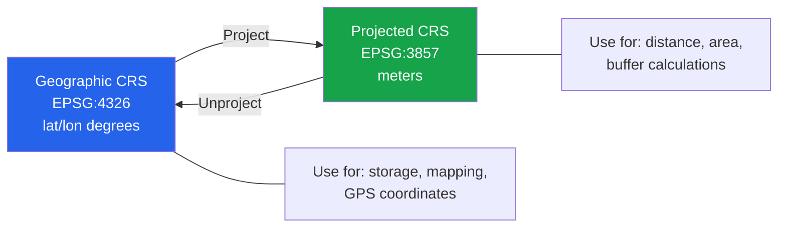
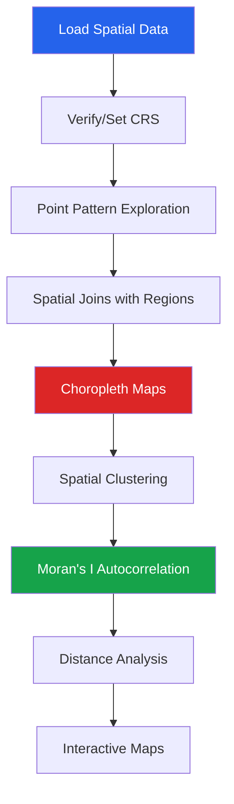

# Geospatial EDA

Geospatial data adds a spatial dimension to EDA. Patterns that are invisible in tabular summaries become obvious on a map: clusters, gradients, hotspots, and geographic outliers. This page covers the complete geospatial EDA toolkit.

---

## Coordinate Reference Systems (CRS)



```python
import geopandas as gpd
import pandas as pd
import numpy as np
import matplotlib.pyplot as plt
from shapely.geometry import Point, Polygon

# CRS basics
# EPSG:4326 — WGS84 (lat/lon, degrees) — used by GPS
# EPSG:3857 — Web Mercator (meters) — used by Google Maps
# EPSG:32633 — UTM Zone 33N (meters) — for Europe

# Loading and checking CRS
# world = gpd.read_file(gpd.datasets.get_path('naturalearth_lowres'))
# print(f"CRS: {world.crs}")
# world_meters = world.to_crs(epsg=3857)
```

---

## Creating GeoDataFrames

```python
np.random.seed(42)
n = 1000

# Simulate store locations
stores = pd.DataFrame({
    'store_id': range(n),
    'lat': np.random.uniform(40.5, 41.0, n),   # NYC area
    'lon': np.random.uniform(-74.2, -73.7, n),
    'revenue': np.random.lognormal(12, 1, n).round(0),
    'category': np.random.choice(['Restaurant', 'Retail', 'Service', 'Grocery'], n),
    'rating': np.random.uniform(1, 5, n).round(1),
    'employees': np.random.poisson(15, n),
})

# Convert to GeoDataFrame
gdf = gpd.GeoDataFrame(
    stores,
    geometry=gpd.points_from_xy(stores['lon'], stores['lat']),
    crs='EPSG:4326',
)

print(f"GeoDataFrame: {len(gdf)} features")
print(f"CRS: {gdf.crs}")
print(f"Bounds: {gdf.total_bounds}")
print(gdf.head())
```

---

## Haversine Distance

```python
def haversine_distance(lat1, lon1, lat2, lon2):
    """Compute Haversine distance in kilometers between two points."""
    R = 6371  # Earth radius in km

    lat1, lon1, lat2, lon2 = map(np.radians, [lat1, lon1, lat2, lon2])

    dlat = lat2 - lat1
    dlon = lon2 - lon1

    a = np.sin(dlat/2)**2 + np.cos(lat1) * np.cos(lat2) * np.sin(dlon/2)**2
    c = 2 * np.arcsin(np.sqrt(a))

    return R * c

# Distance matrix between first 10 stores
sample = stores.head(10)
dist_matrix = np.zeros((10, 10))
for i in range(10):
    for j in range(10):
        dist_matrix[i, j] = haversine_distance(
            sample.iloc[i]['lat'], sample.iloc[i]['lon'],
            sample.iloc[j]['lat'], sample.iloc[j]['lon']
        )

print("Distance matrix (km) — first 5 stores:")
print(np.round(dist_matrix[:5, :5], 2))

# Nearest neighbor for each store
gdf_projected = gdf.to_crs(epsg=3857)  # project to meters for spatial ops

def find_nearest(gdf, n_neighbors=3):
    """Find nearest neighbors for each point."""
    from scipy.spatial import cKDTree
    coords = np.array(list(zip(gdf.geometry.x, gdf.geometry.y)))
    tree = cKDTree(coords)
    distances, indices = tree.query(coords, k=n_neighbors + 1)
    # Skip self (first neighbor)
    return distances[:, 1:] / 1000, indices[:, 1:]  # Convert m to km

dists, idx = find_nearest(gdf_projected)
gdf['nearest_dist_km'] = dists[:, 0]  # distance to nearest neighbor
print(f"\nNearest neighbor stats:")
print(f"  Mean: {gdf['nearest_dist_km'].mean():.2f} km")
print(f"  Median: {gdf['nearest_dist_km'].median():.2f} km")
```

---

## Spatial Joins

```python
# Create hypothetical districts/zones
from shapely.geometry import box

# Grid-based zones
zones = []
lat_steps = np.linspace(40.5, 41.0, 6)
lon_steps = np.linspace(-74.2, -73.7, 6)

zone_id = 0
for i in range(len(lat_steps) - 1):
    for j in range(len(lon_steps) - 1):
        zones.append({
            'zone_id': zone_id,
            'zone_name': f'Zone_{zone_id:02d}',
            'geometry': box(lon_steps[j], lat_steps[i], lon_steps[j+1], lat_steps[i+1]),
        })
        zone_id += 1

zones_gdf = gpd.GeoDataFrame(zones, crs='EPSG:4326')

# Spatial join: assign each store to a zone
joined = gpd.sjoin(gdf, zones_gdf, how='left', predicate='within')
print(f"Stores with zone assignment: {joined['zone_id'].notna().sum()} / {len(joined)}")

# Aggregate by zone
zone_stats = joined.groupby('zone_id').agg(
    n_stores=('store_id', 'count'),
    total_revenue=('revenue', 'sum'),
    avg_rating=('rating', 'mean'),
    avg_employees=('employees', 'mean'),
).round(2)
print("\nZone statistics:")
print(zone_stats.head())

# Merge back for mapping
zones_with_stats = zones_gdf.merge(zone_stats, on='zone_id', how='left')
```

---

## Choropleth Maps

```python
fig, axes = plt.subplots(1, 3, figsize=(20, 6))

# Store count
zones_with_stats.plot(column='n_stores', cmap='YlOrRd', legend=True,
                       edgecolor='black', linewidth=0.5, ax=axes[0],
                       missing_kwds={'color': 'lightgray'})
axes[0].set_title('Store Density by Zone')

# Revenue
zones_with_stats.plot(column='total_revenue', cmap='Greens', legend=True,
                       edgecolor='black', linewidth=0.5, ax=axes[1],
                       missing_kwds={'color': 'lightgray'})
axes[1].set_title('Total Revenue by Zone')

# Average rating
zones_with_stats.plot(column='avg_rating', cmap='RdYlGn', legend=True,
                       edgecolor='black', linewidth=0.5, ax=axes[2],
                       missing_kwds={'color': 'lightgray'}, vmin=1, vmax=5)
axes[2].set_title('Average Rating by Zone')

for ax in axes:
    ax.set_xlabel('Longitude')
    ax.set_ylabel('Latitude')

plt.tight_layout()
plt.show()
```

---

## Point Pattern Analysis

```python
# KDE heatmap of store locations
fig, axes = plt.subplots(1, 2, figsize=(16, 6))

# Scatter with revenue as size
axes[0].scatter(gdf['lon'], gdf['lat'], s=gdf['revenue'] / 50000,
                alpha=0.4, c='steelblue', edgecolors='white', linewidth=0.3)
axes[0].set_title('Store Locations (size = revenue)')
axes[0].set_xlabel('Longitude')
axes[0].set_ylabel('Latitude')

# 2D histogram (heatmap)
h = axes[1].hist2d(gdf['lon'], gdf['lat'], bins=25, cmap='YlOrRd')
plt.colorbar(h[3], ax=axes[1], label='Store Count')
axes[1].set_title('Store Density Heatmap')
axes[1].set_xlabel('Longitude')
axes[1].set_ylabel('Latitude')

plt.tight_layout()
plt.show()
```

---

## Spatial Clustering

```python
from sklearn.cluster import DBSCAN
from sklearn.preprocessing import StandardScaler

# DBSCAN clustering on projected coordinates
coords = np.column_stack([gdf_projected.geometry.x, gdf_projected.geometry.y])
coords_scaled = StandardScaler().fit_transform(coords)

dbscan = DBSCAN(eps=0.3, min_samples=10)
gdf['cluster'] = dbscan.fit_predict(coords_scaled)

n_clusters = gdf['cluster'].nunique() - (1 if -1 in gdf['cluster'].values else 0)
n_noise = (gdf['cluster'] == -1).sum()
print(f"Clusters found: {n_clusters}")
print(f"Noise points: {n_noise}")

# Cluster statistics
cluster_stats = gdf[gdf['cluster'] >= 0].groupby('cluster').agg(
    n_stores=('store_id', 'count'),
    avg_revenue=('revenue', 'mean'),
    avg_rating=('rating', 'mean'),
    centroid_lat=('lat', 'mean'),
    centroid_lon=('lon', 'mean'),
).round(2)
print(f"\nCluster profiles:")
print(cluster_stats.head(10))

# Visualize clusters
fig, ax = plt.subplots(figsize=(10, 8))
noise = gdf[gdf['cluster'] == -1]
ax.scatter(noise['lon'], noise['lat'], s=5, c='gray', alpha=0.3, label='Noise')
for cluster_id in gdf[gdf['cluster'] >= 0]['cluster'].unique():
    subset = gdf[gdf['cluster'] == cluster_id]
    ax.scatter(subset['lon'], subset['lat'], s=15, alpha=0.6, label=f'Cluster {cluster_id}')
ax.set_title(f'DBSCAN Spatial Clusters ({n_clusters} clusters)')
ax.legend(fontsize=8, ncol=2)
plt.tight_layout()
plt.show()
```

---

## Spatial Autocorrelation (Moran's I)

Moran's I measures whether nearby locations have similar values (positive autocorrelation), dissimilar values (negative), or no pattern (random).

```python
from scipy.spatial.distance import pdist, squareform

def morans_i(values, coordinates, distance_threshold=None):
    """Compute Global Moran's I statistic."""
    n = len(values)
    values = np.array(values)
    z = values - values.mean()

    # Weight matrix (inverse distance)
    dist_matrix = squareform(pdist(coordinates))
    if distance_threshold is None:
        distance_threshold = np.percentile(dist_matrix[dist_matrix > 0], 25)

    W = np.where((dist_matrix > 0) & (dist_matrix < distance_threshold), 1, 0)
    W_sum = W.sum()

    if W_sum == 0:
        return 0, 1.0  # no neighbors

    # Moran's I formula
    numerator = n * np.sum(W * np.outer(z, z))
    denominator = W_sum * np.sum(z**2)
    I = numerator / denominator

    # Expected value under random
    E_I = -1 / (n - 1)

    # Variance (normality assumption)
    S0 = W_sum
    S1 = 0.5 * np.sum((W + W.T)**2)
    S2 = np.sum((W.sum(axis=1) + W.sum(axis=0))**2)
    D = np.sum(z**4) / (np.sum(z**2)**2 / n)

    A = n * ((n**2 - 3*n + 3) * S1 - n * S2 + 3 * S0**2)
    B = D * ((n**2 - n) * S1 - 2 * n * S2 + 6 * S0**2)
    C = (n - 1) * (n - 2) * (n - 3) * S0**2

    var_I = (A - B) / C - E_I**2

    z_score = (I - E_I) / np.sqrt(max(var_I, 1e-10))
    from scipy.stats import norm
    p_value = 2 * (1 - norm.cdf(abs(z_score)))

    return I, p_value

# Compute Moran's I for revenue
sample = gdf.sample(200, random_state=42)  # subsample for speed
coords = np.column_stack([sample['lon'].values, sample['lat'].values])
I, p = morans_i(sample['revenue'].values, coords)

print(f"Moran's I: {I:.4f}")
print(f"P-value: {p:.4f}")
if p < 0.05:
    if I > 0:
        print("Interpretation: Significant POSITIVE spatial autocorrelation (clustered)")
    else:
        print("Interpretation: Significant NEGATIVE spatial autocorrelation (dispersed)")
else:
    print("Interpretation: No significant spatial pattern (random)")
```

---

## Interactive Maps with Folium

```python
import folium
from folium.plugins import HeatMap, MarkerCluster

# Base map
m = folium.Map(location=[40.75, -73.95], zoom_start=11, tiles='CartoDB positron')

# Heatmap layer
heat_data = gdf[['lat', 'lon', 'revenue']].values.tolist()
HeatMap(heat_data, radius=15, max_zoom=13).add_to(m)

# Marker cluster for individual stores
marker_cluster = MarkerCluster().add_to(m)
for _, row in gdf.sample(200, random_state=42).iterrows():
    folium.CircleMarker(
        location=[row['lat'], row['lon']],
        radius=3,
        popup=f"Revenue: ${row['revenue']:,.0f}<br>Rating: {row['rating']}",
        color='steelblue',
        fill=True,
    ).add_to(marker_cluster)

# Save
m.save('store_map.html')
print("Map saved to store_map.html")
```

---

## Geospatial EDA Workflow



---

## Key Takeaways

- Always **check and set the CRS** before any spatial operation — EPSG:4326 for storage, projected CRS for distance/area
- **Haversine distance** is essential for any location-based analysis (nearest neighbor, radius queries)
- **Spatial joins** connect point data to administrative regions for aggregated analysis
- **Choropleth maps** reveal geographic patterns in aggregated metrics
- **DBSCAN** is the go-to algorithm for spatial clustering (handles irregular shapes, noise)
- **Moran's I** quantifies whether a spatial pattern is statistically significant
- Use **Folium** for interactive maps in notebooks and reports
- Always consider the **modifiable areal unit problem** (MAUP) — aggregation boundaries affect results
