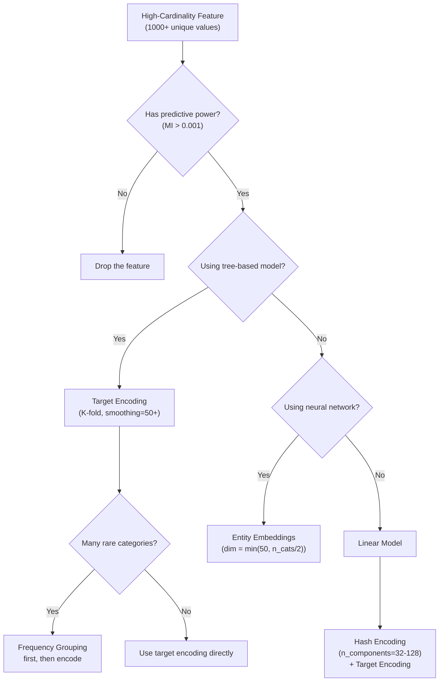

# High-Cardinality Categorical Features

A column with 10 categories is manageable. A column with 50,000 ZIP codes, 100,000 product IDs, or 1,000,000 user IDs is a different beast entirely. One-hot encoding is out of the question. Label encoding is meaningless. Even target encoding needs heavy regularization.

This page covers every strategy for handling categorical features with 1,000+ unique values — when each works, when each fails, and benchmarks on real-scale data.

## The Dataset

We will generate a dataset with genuinely high-cardinality features.

```python
import numpy as np
import pandas as pd
import matplotlib.pyplot as plt
import seaborn as sns
from sklearn.model_selection import cross_val_score, train_test_split
from sklearn.linear_model import LogisticRegression
from sklearn.ensemble import GradientBoostingClassifier
from sklearn.metrics import roc_auc_score
from sklearn.preprocessing import LabelEncoder
from collections import Counter

np.random.seed(42)
n = 50000

# High-cardinality features with power-law distributions
def generate_power_law_categorical(n_obs, n_categories, alpha=1.5):
    """Generate categorical values following a power-law distribution."""
    probs = np.arange(1, n_categories + 1, dtype=float) ** (-alpha)
    probs /= probs.sum()
    categories = [f"cat_{i:06d}" for i in range(n_categories)]
    return np.random.choice(categories, size=n_obs, p=probs), probs

# ZIP code: ~5000 unique values
zip_values, zip_probs = generate_power_law_categorical(n, 5000, alpha=1.2)

# Product ID: ~10000 unique values
product_values, product_probs = generate_power_law_categorical(n, 10000, alpha=1.3)

# User ID: ~20000 unique values
user_values, user_probs = generate_power_law_categorical(n, 20000, alpha=1.0)

# Numerical features
amount = np.random.lognormal(3, 1, n)
hour = np.random.choice(24, n)

# Target depends on some categories
zip_effect = {v: np.random.normal(0, 0.3) for v in np.unique(zip_values)}
product_effect = {v: np.random.normal(0, 0.2) for v in np.unique(product_values)}

logit = (
    np.array([zip_effect[z] for z in zip_values])
    + np.array([product_effect[p] for p in product_values])
    + 0.001 * amount
    + np.random.normal(0, 0.5, n)
)
target = (logit > np.median(logit)).astype(int)

df = pd.DataFrame({
    "zip_code": zip_values, "product_id": product_values,
    "user_id": user_values, "amount": amount,
    "hour": hour, "target": target,
})

print(f"Dataset shape: {df.shape}")
print(f"\nCardinalities:")
for col in ["zip_code", "product_id", "user_id"]:
    nunique = df[col].nunique()
    top_pct = df[col].value_counts().iloc[0] / n * 100
    single = (df[col].value_counts() == 1).sum()
    print(f"  {col:15s}: {nunique:>6,} unique | top={top_pct:.1f}% | singletons={single:,}")
```

## The Cardinality Problem Visualized

```python
fig, axes = plt.subplots(1, 3, figsize=(18, 5))

for ax, col in zip(axes, ["zip_code", "product_id", "user_id"]):
    vc = df[col].value_counts()
    ax.hist(vc.values, bins=50, color="steelblue", edgecolor="black", alpha=0.7)
    ax.set_xlabel("Frequency")
    ax.set_ylabel("Number of Categories")
    ax.set_title(f"{col}\n{vc.shape[0]:,} unique, "
                 f"{(vc == 1).sum():,} singletons ({(vc == 1).sum()/vc.shape[0]*100:.0f}%)",
                 fontsize=11)
    ax.set_yscale("log")

plt.suptitle("Category Frequency Distributions (Log Scale)", fontsize=16, fontweight="bold")
plt.tight_layout()
plt.savefig("high_cardinality_dist.png", dpi=150, bbox_inches="tight")
plt.show()
```

## Strategy 1: Frequency / Count Encoding

Replace each category with its frequency. No target leakage, handles unseen categories gracefully.

```python
def frequency_encode(train_series, test_series=None):
    """Encode categories by their frequency in training data."""
    freq_map = train_series.value_counts(normalize=True).to_dict()

    train_encoded = train_series.map(freq_map)
    if test_series is not None:
        # Unseen categories get 0 frequency
        test_encoded = test_series.map(freq_map).fillna(0)
        return train_encoded, test_encoded
    return train_encoded

# Apply
X_train_df, X_test_df, y_train, y_test = train_test_split(
    df, df["target"], test_size=0.2, random_state=42, stratify=df["target"]
)

for col in ["zip_code", "product_id", "user_id"]:
    train_enc, test_enc = frequency_encode(X_train_df[col], X_test_df[col])
    X_train_df = X_train_df.copy()
    X_test_df = X_test_df.copy()
    X_train_df[f"{col}_freq"] = train_enc
    X_test_df[f"{col}_freq"] = test_enc

print("Frequency-encoded features:")
print(X_train_df[[f"{c}_freq" for c in ["zip_code", "product_id", "user_id"]]].describe().round(6))
```

## Strategy 2: Frequency Grouping (Binning)

Group rare categories into buckets based on frequency.

```python
def frequency_group(train_series, test_series=None, n_bins=50, min_count=10):
    """Group categories by frequency into bins."""
    vc = train_series.value_counts()

    # Top N keep their identity
    top = vc[vc >= min_count]
    mapping = {}

    # Group the rest by frequency rank
    rank = 0
    for cat, count in top.items():
        mapping[cat] = f"group_{rank // (len(top) // n_bins + 1):03d}"
        rank += 1

    # All rare categories go to one group
    rare_cats = vc[vc < min_count].index
    for cat in rare_cats:
        mapping[cat] = "group_rare"

    train_grouped = train_series.map(mapping).fillna("group_rare")
    test_grouped = test_series.map(mapping).fillna("group_rare") if test_series is not None else None

    print(f"  {train_series.name}: {train_series.nunique():,} categories → {train_grouped.nunique()} groups")
    return train_grouped, test_grouped

for col in ["zip_code", "product_id", "user_id"]:
    train_g, test_g = frequency_group(X_train_df[col], X_test_df[col])
    X_train_df[f"{col}_group"] = train_g
    X_test_df[f"{col}_group"] = test_g
```

## Strategy 3: Target Encoding (with Smoothing)

Replace each category with the smoothed mean of the target. Heavy smoothing is critical for high cardinality to prevent overfitting.

```python
def target_encode_smooth(train_series, train_target, test_series=None, smoothing=50):
    """Target encoding with smoothing proportional to sample size."""
    global_mean = train_target.mean()
    agg = pd.DataFrame({"category": train_series, "target": train_target})
    stats_df = agg.groupby("category")["target"].agg(["mean", "count"])

    # Bayesian smoothing: weight = count / (count + smoothing)
    stats_df["weight"] = stats_df["count"] / (stats_df["count"] + smoothing)
    stats_df["encoded"] = stats_df["weight"] * stats_df["mean"] + (1 - stats_df["weight"]) * global_mean

    mapping = stats_df["encoded"].to_dict()

    train_encoded = train_series.map(mapping)
    if test_series is not None:
        test_encoded = test_series.map(mapping).fillna(global_mean)
        return train_encoded, test_encoded
    return train_encoded

# K-fold version for training data
from sklearn.model_selection import KFold

def target_encode_kfold(train_df, col, target_col, n_folds=5, smoothing=50):
    """K-fold target encoding to prevent leakage."""
    global_mean = train_df[target_col].mean()
    result = pd.Series(np.nan, index=train_df.index)

    kf = KFold(n_splits=n_folds, shuffle=True, random_state=42)
    for train_idx, val_idx in kf.split(train_df):
        fold_train = train_df.iloc[train_idx]
        agg = fold_train.groupby(col)[target_col].agg(["mean", "count"])
        agg["weight"] = agg["count"] / (agg["count"] + smoothing)
        agg["encoded"] = agg["weight"] * agg["mean"] + (1 - agg["weight"]) * global_mean
        mapping = agg["encoded"].to_dict()
        result.iloc[val_idx] = train_df.iloc[val_idx][col].map(mapping)

    result = result.fillna(global_mean)
    return result

for col in ["zip_code", "product_id"]:
    # K-fold for train
    X_train_df[f"{col}_target"] = target_encode_kfold(X_train_df, col, "target", smoothing=50)
    # Direct encoding for test (using all train data)
    _, test_enc = target_encode_smooth(X_train_df[col], y_train, X_test_df[col], smoothing=50)
    X_test_df[f"{col}_target"] = test_enc

print("Target-encoded features (train):")
print(X_train_df[[f"{c}_target" for c in ["zip_code", "product_id"]]].describe().round(4))
```

## Strategy 4: Hash Encoding

Hash categories to a fixed number of buckets. Handles any cardinality and unseen categories naturally.

```python
def hash_encode(series, n_components=64):
    """Hash encoding to fixed number of columns."""
    result = np.zeros((len(series), n_components))
    for i, val in enumerate(series):
        h = hash(str(val)) % n_components
        result[i, h] = 1
    return pd.DataFrame(result, index=series.index,
                         columns=[f"{series.name}_hash_{j}" for j in range(n_components)])

# Apply hash encoding
for col in ["zip_code", "product_id"]:
    train_hash = hash_encode(X_train_df[col], n_components=32)
    test_hash = hash_encode(X_test_df[col], n_components=32)

    n_collisions = len(X_train_df[col].unique()) - train_hash.sum(axis=0).astype(bool).sum()
    expected_collisions = len(X_train_df[col].unique()) - 32 * (1 - (1 - 1/32) ** X_train_df[col].nunique())
    print(f"{col}: {X_train_df[col].nunique():,} categories → 32 hash buckets")
    print(f"  Collision rate: {n_collisions/X_train_df[col].nunique()*100:.1f}%")
```

## Strategy 5: Embedding Approach (for Neural Networks)

```python
# Conceptual: how entity embeddings work in neural networks
# Each high-cardinality feature gets an embedding layer

embedding_config = {
    "zip_code": {"n_categories": 5000, "embedding_dim": 16},
    "product_id": {"n_categories": 10000, "embedding_dim": 32},
    "user_id": {"n_categories": 20000, "embedding_dim": 32},
}

print("Entity Embedding Architecture:")
print(f"{'Feature':>15s} {'Categories':>12s} {'Embed Dim':>10s} {'Parameters':>12s} {'vs One-Hot':>10s}")
print("-" * 65)
for feat, config in embedding_config.items():
    n_params = config["n_categories"] * config["embedding_dim"]
    print(f"{feat:>15s} {config['n_categories']:>12,} {config['embedding_dim']:>10d} "
          f"{n_params:>12,} {n_params/config['n_categories']:.1f}x")

# PyTorch example (conceptual)
print("""
# PyTorch Entity Embedding:
import torch.nn as nn

class EntityEmbeddingModel(nn.Module):
    def __init__(self):
        super().__init__()
        self.zip_embed = nn.Embedding(5000, 16)
        self.product_embed = nn.Embedding(10000, 32)
        self.fc = nn.Sequential(
            nn.Linear(16 + 32 + n_numeric_features, 128),
            nn.ReLU(),
            nn.Linear(128, 1),
            nn.Sigmoid()
        )

    def forward(self, zip_ids, product_ids, numeric_features):
        zip_emb = self.zip_embed(zip_ids)
        prod_emb = self.product_embed(product_ids)
        combined = torch.cat([zip_emb, prod_emb, numeric_features], dim=1)
        return self.fc(combined)
""")
```

## Strategy 6: When to Just Drop It

Sometimes a high-cardinality feature is not worth the complexity.

```python
def should_drop_feature(series, target, min_information_gain=0.001):
    """Evaluate if a high-cardinality feature carries useful signal."""
    n = len(series)
    nunique = series.nunique()
    singletons = (series.value_counts() == 1).sum()

    # Mutual information estimate
    from sklearn.feature_selection import mutual_info_classif
    le = LabelEncoder()
    encoded = le.fit_transform(series.astype(str))
    mi = mutual_info_classif(encoded.reshape(-1, 1), target, discrete_features=True)[0]

    print(f"\n--- Feature Assessment: {series.name} ---")
    print(f"  Unique values:     {nunique:,}")
    print(f"  Singletons:        {singletons:,} ({singletons/nunique*100:.1f}% of categories)")
    print(f"  Mutual information: {mi:.6f}")

    should_drop = False
    reasons = []

    if nunique > n * 0.5:
        reasons.append(f"Near-unique ({nunique/n*100:.1f}% of rows)")
        should_drop = True
    if singletons > nunique * 0.8:
        reasons.append(f"80%+ singletons — mostly noise")
        should_drop = True
    if mi < min_information_gain:
        reasons.append(f"MI below threshold ({mi:.6f} < {min_information_gain})")
        should_drop = True

    if should_drop:
        print(f"  RECOMMENDATION: DROP")
        for r in reasons:
            print(f"    - {r}")
    else:
        print(f"  RECOMMENDATION: KEEP (encode appropriately)")

    return should_drop

for col in ["zip_code", "product_id", "user_id"]:
    should_drop_feature(df[col], df["target"])
```

## Decision Tree



## Benchmark

```python
# Prepare feature sets
X_numeric = ["amount", "hour"]

feature_sets = {
    "Numeric only": X_train_df[X_numeric].values,
    "+ Frequency": np.column_stack([
        X_train_df[X_numeric].values,
        X_train_df[[f"{c}_freq" for c in ["zip_code", "product_id", "user_id"]]].values,
    ]),
    "+ Target encoded": np.column_stack([
        X_train_df[X_numeric].values,
        X_train_df[[f"{c}_target" for c in ["zip_code", "product_id"]]].fillna(0.5).values,
    ]),
}

test_feature_sets = {
    "Numeric only": X_test_df[X_numeric].values,
    "+ Frequency": np.column_stack([
        X_test_df[X_numeric].values,
        X_test_df[[f"{c}_freq" for c in ["zip_code", "product_id", "user_id"]]].fillna(0).values,
    ]),
    "+ Target encoded": np.column_stack([
        X_test_df[X_numeric].values,
        X_test_df[[f"{c}_target" for c in ["zip_code", "product_id"]]].fillna(0.5).values,
    ]),
}

print(f"{'Feature Set':<25s} {'LR AUC':>10s} {'GBM AUC':>10s} {'Dims':>6s}")
print("-" * 55)

for name in feature_sets:
    X_tr = feature_sets[name]
    X_te = test_feature_sets[name]

    # Clean
    X_tr = np.nan_to_num(X_tr, nan=0)
    X_te = np.nan_to_num(X_te, nan=0)

    lr = LogisticRegression(max_iter=1000)
    lr.fit(X_tr, y_train)
    lr_auc = roc_auc_score(y_test, lr.predict_proba(X_te)[:, 1])

    gbm = GradientBoostingClassifier(n_estimators=100, max_depth=4, random_state=42)
    gbm.fit(X_tr, y_train)
    gbm_auc = roc_auc_score(y_test, gbm.predict_proba(X_te)[:, 1])

    print(f"{name:<25s} {lr_auc:>10.4f} {gbm_auc:>10.4f} {X_tr.shape[1]:>6d}")
```

## Key Takeaways

- One-hot encoding is impossible for high-cardinality features (1000+ categories). Do not even try.
- Frequency encoding is the safest baseline: no target leakage, handles unseen categories, requires no hyperparameters.
- Target encoding is the most powerful but requires K-fold and heavy smoothing (smoothing >= 50 for 1000+ categories) to prevent overfitting.
- Hash encoding reduces any cardinality to a fixed number of columns. Accept some collision loss.
- Entity embeddings (neural networks) learn optimal representations but require significant training data.
- Frequency grouping as a preprocessing step (bin rare categories first, then encode) works well in practice.
- Some high-cardinality features are not worth encoding. If 80%+ of values are singletons and mutual information is near zero, drop it.
