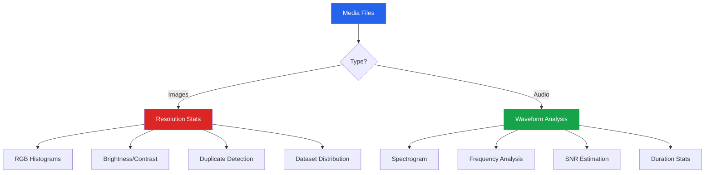

# Image & Audio EDA

Exploratory data analysis is not limited to tabular data. Images and audio files have their own set of distributions, statistics, and quality metrics. This page covers the essential techniques for understanding image and audio datasets.

---

## Image EDA

### Loading and Basic Statistics

```python
import numpy as np
import matplotlib.pyplot as plt
from PIL import Image
import os
from collections import Counter

def image_basic_stats(img_path):
    """Extract basic statistics from a single image."""
    img = Image.open(img_path)
    arr = np.array(img)

    stats = {
        'path': img_path,
        'format': img.format,
        'mode': img.mode,           # RGB, RGBA, L (grayscale), etc.
        'width': img.width,
        'height': img.height,
        'aspect_ratio': round(img.width / img.height, 3),
        'n_pixels': img.width * img.height,
        'file_size_kb': os.path.getsize(img_path) / 1024,
        'dtype': str(arr.dtype),
        'n_channels': arr.shape[2] if len(arr.shape) == 3 else 1,
    }

    if img.mode == 'RGB':
        for i, channel in enumerate(['R', 'G', 'B']):
            stats[f'{channel}_mean'] = arr[:, :, i].mean()
            stats[f'{channel}_std'] = arr[:, :, i].std()
            stats[f'{channel}_min'] = arr[:, :, i].min()
            stats[f'{channel}_max'] = arr[:, :, i].max()

        stats['brightness'] = (0.299 * arr[:,:,0] + 0.587 * arr[:,:,1] + 0.114 * arr[:,:,2]).mean()
        stats['contrast'] = arr.std()

    return stats
```

### RGB Channel Analysis

```python
def analyze_rgb_channels(img_path):
    """Analyze RGB channel distributions of an image."""
    img = Image.open(img_path).convert('RGB')
    arr = np.array(img)

    fig, axes = plt.subplots(2, 3, figsize=(18, 10))

    # Original image
    axes[0, 0].imshow(arr)
    axes[0, 0].set_title(f'Original ({arr.shape[1]}x{arr.shape[0]})')
    axes[0, 0].axis('off')

    # Histograms per channel
    colors = ['red', 'green', 'blue']
    channel_names = ['Red', 'Green', 'Blue']

    for i, (color, name) in enumerate(zip(colors, channel_names)):
        channel = arr[:, :, i].flatten()
        axes[0, 1].hist(channel, bins=256, alpha=0.5, color=color, label=name, density=True)

    axes[0, 1].set_title('RGB Histogram (overlaid)')
    axes[0, 1].set_xlabel('Pixel Value')
    axes[0, 1].set_ylabel('Density')
    axes[0, 1].legend()

    # Individual channels
    for i, (color, name) in enumerate(zip(colors, channel_names)):
        channel = arr[:, :, i]
        axes[0, 2].set_visible(False)

        # Channel image
        channel_img = np.zeros_like(arr)
        channel_img[:, :, i] = channel
        axes[1, i].imshow(channel_img)
        axes[1, i].set_title(f'{name} Channel (mean={channel.mean():.1f}, std={channel.std():.1f})')
        axes[1, i].axis('off')

    # Brightness histogram (luminance)
    brightness = 0.299 * arr[:,:,0] + 0.587 * arr[:,:,1] + 0.114 * arr[:,:,2]
    axes[0, 2].hist(brightness.flatten(), bins=100, edgecolor='white', color='gray', alpha=0.7)
    axes[0, 2].set_title(f'Brightness (mean={brightness.mean():.1f})')
    axes[0, 2].set_xlabel('Luminance')

    plt.tight_layout()
    plt.show()

    return {
        'brightness_mean': brightness.mean(),
        'brightness_std': brightness.std(),
        'r_mean': arr[:,:,0].mean(),
        'g_mean': arr[:,:,1].mean(),
        'b_mean': arr[:,:,2].mean(),
    }
```

### Dataset-Level Image EDA

```python
def image_dataset_eda(image_dir, max_images=1000):
    """Profile an entire image dataset."""
    stats_list = []
    extensions = {'.jpg', '.jpeg', '.png', '.bmp', '.tiff', '.webp'}

    for root, dirs, files in os.walk(image_dir):
        for f in files[:max_images]:
            if os.path.splitext(f)[1].lower() in extensions:
                path = os.path.join(root, f)
                try:
                    s = image_basic_stats(path)
                    stats_list.append(s)
                except Exception as e:
                    print(f"Error: {path}: {e}")

    if not stats_list:
        print("No images found.")
        return None

    import pandas as pd
    df = pd.DataFrame(stats_list)

    print(f"Image Dataset EDA ({len(df)} images)")
    print("=" * 50)
    print(f"\nResolutions:")
    print(f"  Width:  mean={df['width'].mean():.0f}, min={df['width'].min()}, max={df['width'].max()}")
    print(f"  Height: mean={df['height'].mean():.0f}, min={df['height'].min()}, max={df['height'].max()}")

    print(f"\nAspect ratios:")
    print(df['aspect_ratio'].describe())

    print(f"\nFormats: {df['format'].value_counts().to_dict()}")
    print(f"Modes: {df['mode'].value_counts().to_dict()}")

    if 'brightness' in df.columns:
        print(f"\nBrightness: mean={df['brightness'].mean():.1f}, std={df['brightness'].std():.1f}")

    print(f"\nFile sizes: mean={df['file_size_kb'].mean():.1f} KB, "
          f"total={df['file_size_kb'].sum()/1024:.1f} MB")

    # Visualization
    fig, axes = plt.subplots(2, 3, figsize=(18, 10))

    axes[0, 0].hist(df['width'], bins=30, edgecolor='white', color='steelblue', alpha=0.7)
    axes[0, 0].set_title('Width Distribution')

    axes[0, 1].hist(df['height'], bins=30, edgecolor='white', color='coral', alpha=0.7)
    axes[0, 1].set_title('Height Distribution')

    axes[0, 2].scatter(df['width'], df['height'], alpha=0.3, s=10)
    axes[0, 2].set_title('Width vs Height')
    axes[0, 2].set_xlabel('Width')
    axes[0, 2].set_ylabel('Height')

    axes[1, 0].hist(df['aspect_ratio'], bins=30, edgecolor='white', color='green', alpha=0.7)
    axes[1, 0].set_title('Aspect Ratio Distribution')

    axes[1, 1].hist(df['file_size_kb'], bins=30, edgecolor='white', color='purple', alpha=0.7)
    axes[1, 1].set_title('File Size (KB)')

    if 'brightness' in df.columns:
        axes[1, 2].hist(df['brightness'], bins=30, edgecolor='white', color='orange', alpha=0.7)
        axes[1, 2].set_title('Brightness Distribution')

    plt.tight_layout()
    plt.show()

    return df

# Usage: df_images = image_dataset_eda('/path/to/images/')
```

### Perceptual Hashing (Duplicate Detection)

```python
def dhash(image, hash_size=8):
    """Compute difference hash for near-duplicate detection."""
    img = image.convert('L').resize((hash_size + 1, hash_size), Image.LANCZOS)
    pixels = np.array(img)
    diff = pixels[:, 1:] > pixels[:, :-1]
    return sum(2**i for i, v in enumerate(diff.flatten()) if v)

def find_near_duplicates(image_paths, threshold=5):
    """Find near-duplicate images using perceptual hashing."""
    hashes = {}
    for path in image_paths:
        try:
            img = Image.open(path)
            h = dhash(img)
            hashes[path] = h
        except Exception:
            pass

    duplicates = []
    paths = list(hashes.keys())
    for i in range(len(paths)):
        for j in range(i + 1, len(paths)):
            # Hamming distance
            xor = hashes[paths[i]] ^ hashes[paths[j]]
            hamming = bin(xor).count('1')
            if hamming <= threshold:
                duplicates.append((paths[i], paths[j], hamming))

    return sorted(duplicates, key=lambda x: x[2])

# Usage:
# dups = find_near_duplicates(image_paths, threshold=5)
# for p1, p2, dist in dups[:10]:
#     print(f"Distance {dist}: {p1} <-> {p2}")
```

---

## Audio EDA

### Loading and Basic Statistics

```python
import wave
import struct

def load_wav(filepath):
    """Load a WAV file and return samples as numpy array."""
    with wave.open(filepath, 'r') as wav:
        n_channels = wav.getnchannels()
        sample_width = wav.getsampwidth()
        framerate = wav.getframerate()
        n_frames = wav.getnframes()
        raw_data = wav.readframes(n_frames)

    if sample_width == 2:
        fmt = f'<{n_frames * n_channels}h'
        samples = np.array(struct.unpack(fmt, raw_data), dtype=np.float64)
    elif sample_width == 4:
        fmt = f'<{n_frames * n_channels}i'
        samples = np.array(struct.unpack(fmt, raw_data), dtype=np.float64)
    else:
        samples = np.frombuffer(raw_data, dtype=np.uint8).astype(np.float64) - 128

    if n_channels > 1:
        samples = samples.reshape(-1, n_channels)

    return samples, framerate, n_channels

# Simulate audio for demonstration
def generate_test_audio(duration=3.0, sr=44100):
    """Generate test audio: combination of tones + noise."""
    t = np.linspace(0, duration, int(sr * duration), endpoint=False)
    # Two tones + noise
    signal = (0.5 * np.sin(2 * np.pi * 440 * t) +    # A4 = 440 Hz
              0.3 * np.sin(2 * np.pi * 880 * t) +     # A5 = 880 Hz
              0.05 * np.random.randn(len(t)))           # noise
    return signal, sr

samples, sr = generate_test_audio()
print(f"Duration: {len(samples)/sr:.2f}s")
print(f"Sample rate: {sr} Hz")
print(f"Samples: {len(samples):,}")
```

### Waveform Visualization

```python
def plot_waveform(samples, sr, title="Waveform"):
    """Plot audio waveform with time axis."""
    duration = len(samples) / sr
    t = np.linspace(0, duration, len(samples))

    fig, axes = plt.subplots(2, 1, figsize=(14, 8))

    # Full waveform
    axes[0].plot(t, samples, linewidth=0.3, color='steelblue')
    axes[0].set_title(f'{title} — Full')
    axes[0].set_xlabel('Time (s)')
    axes[0].set_ylabel('Amplitude')
    axes[0].grid(True, alpha=0.3)

    # Zoomed in (first 50ms)
    n_samples = int(0.05 * sr)
    axes[1].plot(t[:n_samples], samples[:n_samples], linewidth=1, color='steelblue')
    axes[1].set_title(f'{title} — First 50ms')
    axes[1].set_xlabel('Time (s)')
    axes[1].set_ylabel('Amplitude')
    axes[1].grid(True, alpha=0.3)

    plt.tight_layout()
    plt.show()

plot_waveform(samples, sr, "Test Audio")
```

### Spectrogram

```python
def plot_spectrogram(samples, sr, title="Spectrogram"):
    """Generate and display spectrogram."""
    fig, axes = plt.subplots(2, 1, figsize=(14, 10))

    # Time-domain
    t = np.linspace(0, len(samples)/sr, len(samples))
    axes[0].plot(t, samples, linewidth=0.3, color='steelblue')
    axes[0].set_title(f'{title} — Waveform')
    axes[0].set_xlabel('Time (s)')
    axes[0].set_ylabel('Amplitude')

    # Spectrogram
    spec_data, freqs, times, im = axes[1].specgram(
        samples, NFFT=2048, Fs=sr, noverlap=1024,
        cmap='magma', scale='dB'
    )
    axes[1].set_title(f'{title} — Spectrogram')
    axes[1].set_xlabel('Time (s)')
    axes[1].set_ylabel('Frequency (Hz)')
    axes[1].set_ylim(0, sr / 2)
    plt.colorbar(im, ax=axes[1], label='Power (dB)')

    plt.tight_layout()
    plt.show()

    return spec_data, freqs, times

spec, freqs, times = plot_spectrogram(samples, sr, "Test Audio")
```

### Audio Statistics

```python
def audio_statistics(samples, sr):
    """Compute comprehensive audio statistics."""
    duration = len(samples) / sr

    # Amplitude statistics
    stats = {
        'duration_s': duration,
        'sample_rate': sr,
        'n_samples': len(samples),
        'peak_amplitude': np.max(np.abs(samples)),
        'rms': np.sqrt(np.mean(samples**2)),
        'dynamic_range_db': 20 * np.log10(np.max(np.abs(samples)) / (np.sqrt(np.mean(samples**2)) + 1e-10)),
        'zero_crossing_rate': np.mean(np.diff(np.sign(samples)) != 0),
        'crest_factor': np.max(np.abs(samples)) / (np.sqrt(np.mean(samples**2)) + 1e-10),
    }

    # Spectral statistics (via FFT)
    n = len(samples)
    fft = np.fft.rfft(samples)
    magnitude = np.abs(fft) / n
    freqs = np.fft.rfftfreq(n, d=1/sr)

    # Spectral centroid (brightness)
    stats['spectral_centroid'] = np.sum(freqs * magnitude) / (np.sum(magnitude) + 1e-10)

    # Spectral bandwidth
    centroid = stats['spectral_centroid']
    stats['spectral_bandwidth'] = np.sqrt(
        np.sum(magnitude * (freqs - centroid)**2) / (np.sum(magnitude) + 1e-10)
    )

    # Dominant frequency
    stats['dominant_freq'] = freqs[np.argmax(magnitude[1:]) + 1]

    print(f"Audio Statistics:")
    for k, v in stats.items():
        print(f"  {k:<25} {v:.4f}" if isinstance(v, float) else f"  {k:<25} {v}")

    return stats

audio_stats = audio_statistics(samples, sr)
```

### Signal-to-Noise Ratio (SNR)

```python
def estimate_snr(samples, sr, noise_floor_pct=10):
    """Estimate Signal-to-Noise Ratio."""
    # Method 1: RMS-based (compare signal RMS to noise floor)
    amplitude = np.abs(samples)
    noise_threshold = np.percentile(amplitude, noise_floor_pct)
    noise = samples[amplitude < noise_threshold]
    signal = samples[amplitude >= noise_threshold]

    if len(noise) == 0 or np.std(noise) == 0:
        return float('inf')

    rms_signal = np.sqrt(np.mean(signal**2))
    rms_noise = np.sqrt(np.mean(noise**2))

    snr_db = 20 * np.log10(rms_signal / rms_noise)

    print(f"SNR Estimation:")
    print(f"  RMS signal: {rms_signal:.6f}")
    print(f"  RMS noise:  {rms_noise:.6f}")
    print(f"  SNR: {snr_db:.1f} dB")
    print(f"  Quality: {'Excellent' if snr_db > 30 else 'Good' if snr_db > 20 else 'Fair' if snr_db > 10 else 'Poor'}")

    return snr_db

snr = estimate_snr(samples, sr)
```

---

## Media EDA Workflow



---

## Key Takeaways

- **Image EDA**: RGB histograms reveal color distribution; brightness and contrast are key quality metrics
- **Perceptual hashing** (dHash) finds near-duplicate images efficiently across large datasets
- **Dataset-level stats** (resolution distribution, aspect ratios, file sizes) reveal data quality issues before training
- **Audio waveforms** show temporal structure; **spectrograms** reveal frequency content over time
- **Spectral centroid** measures perceived brightness of audio; **zero crossing rate** correlates with noisiness
- **SNR** is the fundamental quality metric for audio — below 10 dB indicates significant noise
- Always visualize a **random sample** of your media data — automated stats miss visual artifacts and corruption
