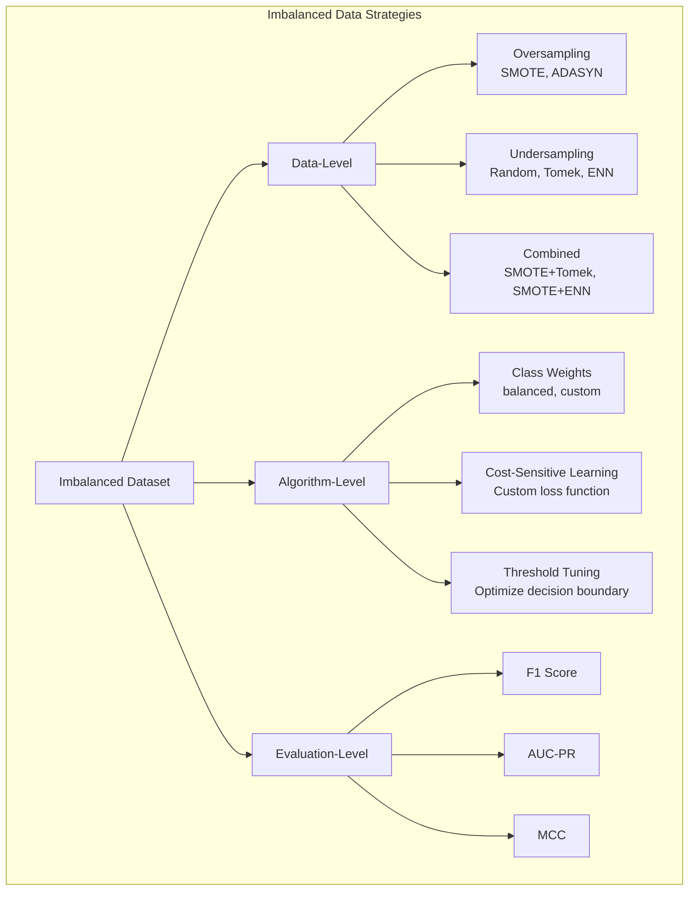

# Handling Imbalanced Data

When 98% of your data belongs to one class and 2% to another, a model that always predicts the majority class achieves 98% accuracy — and is completely useless. Imbalanced datasets are the norm in fraud detection, medical diagnosis, churn prediction, anomaly detection, and rare event forecasting.

This page covers the complete toolkit: resampling strategies, synthetic data generation, cost-sensitive learning, and the metrics that actually matter.

## The Dataset

We will generate a fraud detection dataset with a realistic 2% positive rate.

```python
import numpy as np
import pandas as pd
import matplotlib.pyplot as plt
import seaborn as sns
from sklearn.model_selection import cross_val_score, StratifiedKFold
from sklearn.linear_model import LogisticRegression
from sklearn.ensemble import RandomForestClassifier, GradientBoostingClassifier
from sklearn.metrics import (
    classification_report, confusion_matrix, roc_auc_score,
    average_precision_score, matthews_corrcoef, f1_score,
    precision_recall_curve, roc_curve
)
from sklearn.model_selection import train_test_split

np.random.seed(42)
n = 10000
fraud_rate = 0.02

# Features
amount = np.random.lognormal(3, 1.5, n)
hour = np.random.choice(24, n)
distance_from_home = np.random.exponential(20, n)
n_transactions_24h = np.random.poisson(5, n)
device_age_days = np.random.exponential(180, n)

# Fraud label (2% positive)
fraud_score = (
    0.3 * (amount > np.percentile(amount, 90)).astype(float)
    + 0.2 * ((hour >= 1) & (hour <= 5)).astype(float)
    + 0.2 * (distance_from_home > 50).astype(float)
    + 0.15 * (n_transactions_24h > 10).astype(float)
    + 0.15 * (device_age_days < 7).astype(float)
    + np.random.normal(0, 0.3, n)
)
threshold = np.percentile(fraud_score, 100 - fraud_rate * 100)
is_fraud = (fraud_score > threshold).astype(int)

df = pd.DataFrame({
    "amount": amount, "hour": hour, "distance_from_home": distance_from_home,
    "n_transactions_24h": n_transactions_24h, "device_age_days": device_age_days,
    "is_fraud": is_fraud,
})

feature_cols = ["amount", "hour", "distance_from_home", "n_transactions_24h", "device_age_days"]
X = df[feature_cols].values
y = df["is_fraud"].values

print(f"Dataset shape: {df.shape}")
print(f"Class distribution:")
print(f"  Legitimate: {(y == 0).sum():,} ({(y == 0).mean()*100:.1f}%)")
print(f"  Fraud:      {(y == 1).sum():,} ({(y == 1).mean()*100:.1f}%)")
print(f"  Imbalance ratio: {(y == 0).sum() / (y == 1).sum():.0f}:1")
```

## Why Accuracy Is Useless for Imbalanced Data

```python
X_train, X_test, y_train, y_test = train_test_split(X, y, test_size=0.3, random_state=42, stratify=y)

# "Model" that always predicts majority class
majority_pred = np.zeros_like(y_test)
print(f"Always-predict-0 accuracy: {(majority_pred == y_test).mean():.4f}")
print(f"Frauds detected: {(majority_pred[y_test == 1] == 1).sum()} / {(y_test == 1).sum()}")
print(f"\n98% accuracy, ZERO fraud detection. Completely useless.")
```

## Metrics That Matter

```python
def evaluate_model(y_true, y_pred, y_prob, name="Model"):
    """Comprehensive evaluation for imbalanced classification."""
    print(f"\n{'='*60}")
    print(f"  Evaluation: {name}")
    print(f"{'='*60}")

    # Confusion matrix
    cm = confusion_matrix(y_true, y_pred)
    tn, fp, fn, tp = cm.ravel()

    print(f"\n  Confusion Matrix:")
    print(f"           Pred=0    Pred=1")
    print(f"  True=0   {tn:>6d}    {fp:>6d}   (FPR = {fp/(fp+tn):.4f})")
    print(f"  True=1   {fn:>6d}    {tp:>6d}   (Recall = {tp/(tp+fn):.4f})")

    # Classification report
    print(f"\n{classification_report(y_true, y_pred, target_names=['Legitimate', 'Fraud'])}")

    # Key metrics for imbalanced data
    f1 = f1_score(y_true, y_pred)
    mcc = matthews_corrcoef(y_true, y_pred)
    auc_roc = roc_auc_score(y_true, y_prob)
    auc_pr = average_precision_score(y_true, y_prob)

    print(f"  Key Metrics:")
    print(f"    F1 Score (fraud):       {f1:.4f}")
    print(f"    MCC:                    {mcc:.4f}")
    print(f"    AUC-ROC:                {auc_roc:.4f}")
    print(f"    AUC-PR (most important): {auc_pr:.4f}")

    return {"f1": f1, "mcc": mcc, "auc_roc": auc_roc, "auc_pr": auc_pr}

# Baseline: no resampling, no class weights
lr = LogisticRegression(max_iter=1000)
lr.fit(X_train, y_train)
y_pred = lr.predict(X_test)
y_prob = lr.predict_proba(X_test)[:, 1]

baseline_metrics = evaluate_model(y_test, y_pred, y_prob, "Baseline LogReg")
```

### Metric Comparison

| Metric | Range | Imbalance-Aware | Best For |
|--------|-------|-----------------|----------|
| **Accuracy** | [0, 1] | No | Balanced datasets only |
| **F1 Score** | [0, 1] | Partially | Single-threshold evaluation of minority class |
| **MCC** | [-1, 1] | Yes | Overall quality, handles all imbalance levels |
| **AUC-ROC** | [0, 1] | Partially | Ranking quality across thresholds |
| **AUC-PR** | [0, 1] | Yes | Most informative for severe imbalance |

::: tip AUC-PR over AUC-ROC for imbalanced data
AUC-ROC can be misleadingly high even with terrible performance on the minority class (because it includes the vast number of true negatives). AUC-PR focuses entirely on precision and recall of the positive class, making it the gold standard for imbalanced problems.
:::

```python
# Plot ROC and PR curves
fig, axes = plt.subplots(1, 2, figsize=(14, 5))

# ROC curve
fpr, tpr, _ = roc_curve(y_test, y_prob)
axes[0].plot(fpr, tpr, color="steelblue", linewidth=2,
             label=f"AUC-ROC = {roc_auc_score(y_test, y_prob):.3f}")
axes[0].plot([0, 1], [0, 1], "k--", alpha=0.3)
axes[0].set_xlabel("False Positive Rate")
axes[0].set_ylabel("True Positive Rate")
axes[0].set_title("ROC Curve", fontsize=14)
axes[0].legend()

# PR curve
precision, recall, _ = precision_recall_curve(y_test, y_prob)
axes[1].plot(recall, precision, color="crimson", linewidth=2,
             label=f"AUC-PR = {average_precision_score(y_test, y_prob):.3f}")
axes[1].axhline(y_test.mean(), color="gray", linestyle="--", alpha=0.5, label="Random baseline")
axes[1].set_xlabel("Recall")
axes[1].set_ylabel("Precision")
axes[1].set_title("Precision-Recall Curve", fontsize=14)
axes[1].legend()

plt.suptitle("ROC vs Precision-Recall Curves", fontsize=16, fontweight="bold")
plt.tight_layout()
plt.savefig("roc_pr_curves.png", dpi=150, bbox_inches="tight")
plt.show()
```

## Resampling Strategies

### Random Oversampling and Undersampling

```python
from imblearn.over_sampling import RandomOverSampler, SMOTE, ADASYN
from imblearn.under_sampling import RandomUnderSampler, TomekLinks
from imblearn.combine import SMOTETomek
from imblearn.pipeline import Pipeline as ImbPipeline

# Random oversampling (duplicate minority samples)
ros = RandomOverSampler(random_state=42)
X_ros, y_ros = ros.fit_resample(X_train, y_train)
print(f"Random Oversampling: {len(y_train)} → {len(y_ros)} samples")
print(f"  Class 0: {(y_ros == 0).sum()}, Class 1: {(y_ros == 1).sum()}")

# Random undersampling (remove majority samples)
rus = RandomUnderSampler(random_state=42)
X_rus, y_rus = rus.fit_resample(X_train, y_train)
print(f"\nRandom Undersampling: {len(y_train)} → {len(y_rus)} samples")
print(f"  Class 0: {(y_rus == 0).sum()}, Class 1: {(y_rus == 1).sum()}")
```

### SMOTE (Synthetic Minority Oversampling TEchnique)

SMOTE creates synthetic samples by interpolating between existing minority class points and their nearest neighbors.

```python
smote = SMOTE(random_state=42, k_neighbors=5)
X_smote, y_smote = smote.fit_resample(X_train, y_train)
print(f"SMOTE: {len(y_train)} → {len(y_smote)} samples")
print(f"  Class 0: {(y_smote == 0).sum()}, Class 1: {(y_smote == 1).sum()}")

# Visualize SMOTE effect (2D projection)
from sklearn.decomposition import PCA
pca = PCA(n_components=2)

fig, axes = plt.subplots(1, 3, figsize=(18, 5))

for ax, (name, X_rs, y_rs) in zip(axes, [
    ("Original", X_train, y_train),
    ("SMOTE", X_smote, y_smote),
    ("Random Undersampling", X_rus, y_rus),
]):
    X_2d = pca.fit_transform(X_rs)
    ax.scatter(X_2d[y_rs == 0, 0], X_2d[y_rs == 0, 1],
               alpha=0.2, s=5, c="steelblue", label=f"Class 0 ({(y_rs==0).sum():,})")
    ax.scatter(X_2d[y_rs == 1, 0], X_2d[y_rs == 1, 1],
               alpha=0.5, s=20, c="red", label=f"Class 1 ({(y_rs==1).sum():,})")
    ax.set_title(f"{name}\n(n={len(y_rs):,})", fontsize=12)
    ax.legend(fontsize=8)

plt.suptitle("Resampling Strategies Visualized (PCA 2D)", fontsize=16, fontweight="bold")
plt.tight_layout()
plt.savefig("resampling_visual.png", dpi=150, bbox_inches="tight")
plt.show()
```

### ADASYN (Adaptive Synthetic Sampling)

ADASYN generates more synthetic samples for minority examples that are harder to classify (near the decision boundary).

```python
adasyn = ADASYN(random_state=42, n_neighbors=5)
X_ada, y_ada = adasyn.fit_resample(X_train, y_train)
print(f"ADASYN: {len(y_train)} → {len(y_ada)} samples")
```

### Tomek Links

Tomek links identify pairs of nearest neighbors from opposite classes and remove the majority class sample. This cleans the boundary between classes.

```python
tomek = TomekLinks()
X_tomek, y_tomek = tomek.fit_resample(X_train, y_train)
print(f"Tomek Links: {len(y_train)} → {len(y_tomek)} (removed {len(y_train) - len(y_tomek)} samples)")
```

### SMOTE + Tomek (Combination)

```python
smt = SMOTETomek(random_state=42)
X_smt, y_smt = smt.fit_resample(X_train, y_train)
print(f"SMOTE + Tomek: {len(y_train)} → {len(y_smt)} samples")
```

## Class Weights

Instead of resampling, tell the model to penalize misclassifying minority examples more heavily.

```python
# Class weight options
from sklearn.utils.class_weight import compute_class_weight

# Automatic class weights (inversely proportional to frequency)
classes = np.unique(y_train)
weights = compute_class_weight("balanced", classes=classes, y=y_train)
weight_dict = dict(zip(classes, weights))
print(f"Balanced class weights: {weight_dict}")

# Train with class weights
lr_weighted = LogisticRegression(max_iter=1000, class_weight="balanced")
lr_weighted.fit(X_train, y_train)
y_pred_w = lr_weighted.predict(X_test)
y_prob_w = lr_weighted.predict_proba(X_test)[:, 1]

weighted_metrics = evaluate_model(y_test, y_pred_w, y_prob_w, "LogReg + Balanced Weights")
```



## Full Benchmark

```python
strategies = {
    "Baseline (no resampling)": (X_train, y_train),
    "Random Oversampling": (X_ros, y_ros),
    "Random Undersampling": (X_rus, y_rus),
    "SMOTE": (X_smote, y_smote),
    "ADASYN": (X_ada, y_ada),
    "SMOTE + Tomek": (X_smt, y_smt),
}

results = []
for strategy_name, (X_s, y_s) in strategies.items():
    for model_name, model in [
        ("LogReg", LogisticRegression(max_iter=1000)),
        ("LogReg (weighted)", LogisticRegression(max_iter=1000, class_weight="balanced")),
        ("RF", RandomForestClassifier(n_estimators=100, random_state=42)),
        ("RF (weighted)", RandomForestClassifier(n_estimators=100, random_state=42, class_weight="balanced")),
    ]:
        model.fit(X_s, y_s)
        y_pred = model.predict(X_test)
        y_prob = model.predict_proba(X_test)[:, 1]

        results.append({
            "strategy": strategy_name,
            "model": model_name,
            "f1": f1_score(y_test, y_pred),
            "mcc": matthews_corrcoef(y_test, y_pred),
            "auc_roc": roc_auc_score(y_test, y_prob),
            "auc_pr": average_precision_score(y_test, y_prob),
            "recall": (y_pred[y_test == 1] == 1).mean(),
        })

results_df = pd.DataFrame(results)
print("\nFull Benchmark Results:")
print(results_df.sort_values("auc_pr", ascending=False).to_string(index=False))
```

## Threshold Tuning

The default classification threshold of 0.5 is almost never optimal for imbalanced data. Tuning the threshold can dramatically improve performance without changing the model.

```python
from sklearn.metrics import precision_recall_curve, f1_score

# Train a model
lr_threshold = LogisticRegression(max_iter=1000, class_weight="balanced")
lr_threshold.fit(X_train, y_train)
y_prob_threshold = lr_threshold.predict_proba(X_test)[:, 1]

# Find optimal threshold by maximizing F1
precisions, recalls, thresholds = precision_recall_curve(y_test, y_prob_threshold)
f1_scores = 2 * (precisions[:-1] * recalls[:-1]) / (precisions[:-1] + recalls[:-1] + 1e-10)
optimal_idx = np.argmax(f1_scores)
optimal_threshold = thresholds[optimal_idx]

print(f"Default threshold (0.5):")
y_pred_default = (y_prob_threshold >= 0.5).astype(int)
print(f"  F1 = {f1_score(y_test, y_pred_default):.4f}")
print(f"  Recall = {(y_pred_default[y_test == 1] == 1).mean():.4f}")

print(f"\nOptimal threshold ({optimal_threshold:.3f}):")
y_pred_optimal = (y_prob_threshold >= optimal_threshold).astype(int)
print(f"  F1 = {f1_score(y_test, y_pred_optimal):.4f}")
print(f"  Recall = {(y_pred_optimal[y_test == 1] == 1).mean():.4f}")

# Visualize threshold selection
fig, axes = plt.subplots(1, 2, figsize=(14, 5))

axes[0].plot(thresholds, f1_scores, color="steelblue", linewidth=2)
axes[0].axvline(optimal_threshold, color="crimson", linestyle="--",
                label=f"Optimal: {optimal_threshold:.3f}")
axes[0].axvline(0.5, color="gray", linestyle="--", alpha=0.5, label="Default: 0.5")
axes[0].set_xlabel("Threshold")
axes[0].set_ylabel("F1 Score")
axes[0].set_title("F1 Score vs Decision Threshold", fontsize=12)
axes[0].legend()

axes[1].plot(thresholds, precisions[:-1], label="Precision", color="steelblue", linewidth=2)
axes[1].plot(thresholds, recalls[:-1], label="Recall", color="crimson", linewidth=2)
axes[1].axvline(optimal_threshold, color="green", linestyle="--",
                label=f"Optimal: {optimal_threshold:.3f}")
axes[1].set_xlabel("Threshold")
axes[1].set_ylabel("Score")
axes[1].set_title("Precision-Recall Trade-off", fontsize=12)
axes[1].legend()

plt.suptitle("Threshold Tuning for Imbalanced Classification", fontsize=16, fontweight="bold")
plt.tight_layout()
plt.savefig("threshold_tuning.png", dpi=150, bbox_inches="tight")
plt.show()
```

## Cost-Sensitive Threshold Selection

In practice, the cost of a false negative (missing fraud) is very different from the cost of a false positive (blocking a legitimate transaction). Set the threshold based on business costs.

```python
def cost_sensitive_threshold(y_true, y_prob, cost_fn=100, cost_fp=1):
    """Find threshold that minimizes total cost.

    cost_fn: cost of a false negative (missed fraud)
    cost_fp: cost of a false positive (false alarm)
    """
    thresholds = np.linspace(0.01, 0.99, 200)
    costs = []

    for t in thresholds:
        y_pred = (y_prob >= t).astype(int)
        fn = ((y_true == 1) & (y_pred == 0)).sum()
        fp = ((y_true == 0) & (y_pred == 1)).sum()
        total_cost = cost_fn * fn + cost_fp * fp
        costs.append(total_cost)

    optimal_idx = np.argmin(costs)
    optimal_threshold = thresholds[optimal_idx]

    print(f"Cost-sensitive threshold (FN cost=${cost_fn}, FP cost=${cost_fp}):")
    print(f"  Optimal threshold: {optimal_threshold:.3f}")
    print(f"  Minimum total cost: ${costs[optimal_idx]:,.0f}")

    return optimal_threshold, costs

# Fraud costs $100 to miss, $1 to false alarm
threshold_cost, costs = cost_sensitive_threshold(y_test, y_prob_threshold,
                                                  cost_fn=100, cost_fp=1)
```

## Practical Checklist

1. **Never use accuracy** as your primary metric for imbalanced data.
2. **Start with class weights** — it is the simplest approach and often sufficient.
3. **Try SMOTE** if class weights are not enough. Use SMOTE + Tomek for cleaner boundaries.
4. **Always use stratified cross-validation** to preserve class proportions in each fold.
5. **Tune the decision threshold** — the default 0.5 is almost never optimal for imbalanced data.
6. **Consider business costs** when selecting thresholds — missing fraud is usually far more expensive than a false alarm.
7. **Report AUC-PR** as your primary metric. Supplement with F1, MCC, and precision/recall.

## Key Takeaways

- AUC-PR is the most informative metric for imbalanced datasets. AUC-ROC can be misleadingly high.
- MCC is the only metric that is high only when the model performs well on all four quadrants of the confusion matrix.
- Class weights are the easiest fix and should always be tried first. They require no data augmentation.
- SMOTE creates synthetic minority samples that are more diverse than random oversampling. Use k_neighbors >= 5.
- Random undersampling discards majority data — only viable when you have plenty of majority samples.
- SMOTE + Tomek combines oversampling with boundary cleaning for the best of both worlds.
- The optimal strategy depends on your imbalance ratio, dataset size, and model type. Always benchmark multiple approaches.
