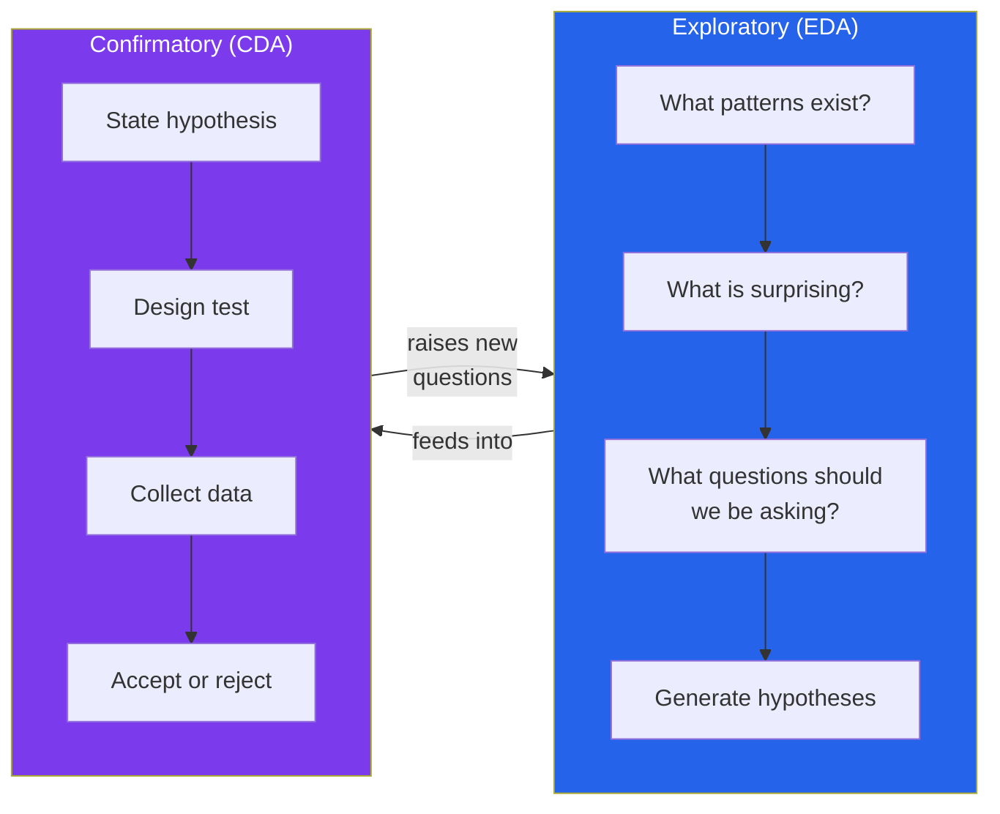
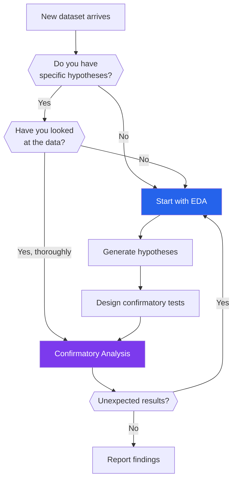
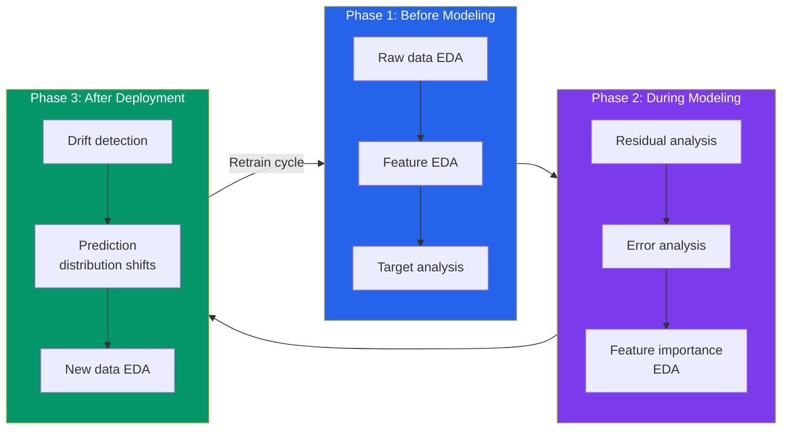
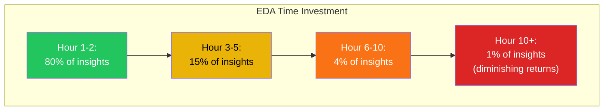
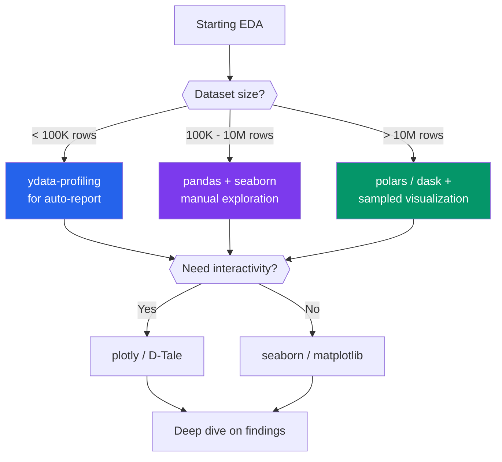

# Exploratory Data Analysis — Overview

Exploratory Data Analysis (EDA) is the practice of examining data before making assumptions about it. It was formalized by John Tukey in 1977, and its core insight has not aged a day: **you cannot model what you do not understand**. Every machine learning failure, every dashboard that misleads executives, every A/B test that produces garbage — somewhere upstream, someone skipped or botched EDA.

EDA is not a checklist. It is a mindset — a disciplined approach to letting the data tell you what it contains before you impose structure on it. This page covers the philosophy, the practical boundaries, the role of EDA in modern ML pipelines, and the mistakes that kill projects before they start.

---

## Tukey's Philosophy

John Tukey's 1977 book *Exploratory Data Analysis* did not just introduce box plots and stem-and-leaf displays. It introduced an entirely different way of thinking about data analysis.

### The Two Cultures of Data Analysis

Tukey drew a sharp line between **exploratory** and **confirmatory** analysis:



### Tukey's Core Principles

| Principle | What It Means | Modern Translation |
|-----------|---------------|-------------------|
| **Skepticism of models** | Do not assume your data fits any particular model | Do not `fit()` before you `plot()` |
| **Resistance** | Use statistics that resist outlier influence (median over mean) | Always check robust statistics alongside parametric ones |
| **Re-expression** | Transform data to reveal structure (log, sqrt, reciprocal) | Feature engineering starts in EDA |
| **Residuals** | After fitting, examine what the model missed | Residual analysis is EDA for models |
| **Visualization first** | A picture is worth a thousand p-values | Plot everything before computing anything |

```python
# tukey_philosophy.py — Demonstrate why visualization beats summary statistics
import pandas as pd
import numpy as np
import matplotlib.pyplot as plt

# Anscombe's Quartet: four datasets with IDENTICAL summary statistics
# but wildly different patterns
anscombe = {
    'x1': [10, 8, 13, 9, 11, 14, 6, 4, 12, 7, 5],
    'y1': [8.04, 6.95, 7.58, 8.81, 8.33, 9.96, 7.24, 4.26, 10.84, 4.82, 5.68],
    'x2': [10, 8, 13, 9, 11, 14, 6, 4, 12, 7, 5],
    'y2': [9.14, 8.14, 8.74, 8.77, 9.26, 8.10, 6.13, 3.10, 9.13, 7.26, 4.74],
    'x3': [10, 8, 13, 9, 11, 14, 6, 4, 12, 7, 5],
    'y3': [7.46, 6.77, 12.74, 7.11, 7.81, 8.84, 6.08, 5.39, 8.15, 6.42, 5.73],
    'x4': [8, 8, 8, 8, 8, 8, 8, 19, 8, 8, 8],
    'y4': [6.58, 5.76, 7.71, 8.84, 8.47, 7.04, 5.25, 12.50, 5.56, 7.91, 6.89],
}
df = pd.DataFrame(anscombe)

# All four have nearly identical statistics
for i in range(1, 5):
    x, y = f'x{i}', f'y{i}'
    print(f"Dataset {i}: mean_x={df[x].mean():.1f}, mean_y={df[y].mean():.2f}, "
          f"std_x={df[x].std():.2f}, std_y={df[y].std():.2f}, "
          f"corr={df[x].corr(df[y]):.3f}")

# Output:
# Dataset 1: mean_x=9.0, mean_y=7.50, std_x=3.32, std_y=2.03, corr=0.816
# Dataset 2: mean_x=9.0, mean_y=7.50, std_x=3.32, std_y=2.03, corr=0.816
# Dataset 3: mean_x=9.0, mean_y=7.50, std_x=3.32, std_y=2.03, corr=0.816
# Dataset 4: mean_x=9.0, mean_y=7.50, std_x=3.32, std_y=2.03, corr=0.816

# But plotting reveals COMPLETELY different patterns
fig, axes = plt.subplots(2, 2, figsize=(10, 8))
for idx, ax in enumerate(axes.flat):
    i = idx + 1
    ax.scatter(df[f'x{i}'], df[f'y{i}'], edgecolors='black', s=60)
    ax.set_title(f'Dataset {i}')
    ax.set_xlim(3, 20)
    ax.set_ylim(2, 14)

    # Same regression line for all
    m, b = np.polyfit(df[f'x{i}'], df[f'y{i}'], 1)
    x_line = np.linspace(3, 20, 100)
    ax.plot(x_line, m * x_line + b, 'r--', alpha=0.7)

plt.suptitle("Anscombe's Quartet — Same Stats, Different Data", fontsize=14)
plt.tight_layout()
plt.savefig("anscombes_quartet.png", dpi=150)
plt.show()
```

::: tip Tukey's Most Important Lesson
"The greatest value of a picture is when it forces us to notice what we never expected to see." If your EDA only confirms what you already believe, you are doing it wrong.
:::

---

## EDA vs Confirmatory Analysis

These are not competing methodologies — they are sequential phases.

### When Each Applies



### Side-by-Side Comparison

| Dimension | EDA | Confirmatory Analysis |
|-----------|-----|----------------------|
| **Goal** | Generate hypotheses | Test hypotheses |
| **Approach** | Open-ended, visual | Structured, statistical |
| **Tools** | Plots, summaries, cross-tabs | p-values, confidence intervals, power analysis |
| **Mindset** | "What do I see?" | "Is this effect real?" |
| **Risk of bias** | Seeing patterns that are not there | Missing patterns that are there |
| **Multiple comparisons** | Expected and encouraged | Must be corrected for |
| **Data splitting** | Use all available data | Requires train/test or holdout |
| **Output** | Insights, questions, feature ideas | Decisions, published results |

```python
# eda_vs_confirmatory.py — Why the order matters
import pandas as pd
import numpy as np
from scipy import stats

np.random.seed(42)

# Simulate A/B test data: 20 metrics tracked, only 1 truly different
n_users = 1000
n_metrics = 20

control = np.random.randn(n_users, n_metrics)
treatment = np.random.randn(n_users, n_metrics)
# Make metric 7 truly different
treatment[:, 7] += 0.15

# BAD: Skip EDA, test all 20 metrics, cherry-pick significant ones
print("=== BAD APPROACH: Test everything, report 'significant' results ===")
significant_without_correction = []
for i in range(n_metrics):
    t_stat, p_val = stats.ttest_ind(control[:, i], treatment[:, i])
    if p_val < 0.05:
        significant_without_correction.append((i, p_val))
        print(f"  Metric {i}: p={p_val:.4f} -- 'Significant!'")

print(f"\nFound {len(significant_without_correction)} 'significant' results")
print("But with 20 tests at alpha=0.05, expect ~1 false positive by chance!\n")

# GOOD: EDA first to understand distributions, then targeted test
print("=== GOOD APPROACH: EDA first, then targeted confirmatory test ===")
# Step 1: EDA — look at distributions of all metrics
print("Step 1 (EDA): Visual inspection of all 20 metric distributions")
print("  -> Metric 7 shows a visible shift in treatment group")
print("  -> All other metrics look identically distributed")

# Step 2: Hypothesis from EDA
print("Step 2: Formulate hypothesis — Metric 7 differs between groups")

# Step 3: Confirmatory test with proper correction
from statsmodels.stats.multitest import multipletests

p_values = [stats.ttest_ind(control[:, i], treatment[:, i])[1]
            for i in range(n_metrics)]
rejected, corrected_p, _, _ = multipletests(p_values, method='bonferroni')

print("Step 3: Bonferroni-corrected results:")
for i in range(n_metrics):
    if rejected[i]:
        print(f"  Metric {i}: corrected p={corrected_p[i]:.4f} — CONFIRMED")
```

::: warning The Garden of Forking Paths
If you run 20 statistical tests at alpha=0.05, you expect 1 false positive even when there is no real effect. EDA helps you focus on the right tests. Confirmatory analysis with proper multiple-comparison correction gives you trustworthy answers.
:::

---

## EDA in the ML Pipeline

EDA is not a one-time activity. It recurs at multiple stages:



### EDA at Each ML Stage

```python
# eda_in_ml_pipeline.py — EDA at every stage of a real ML project
import pandas as pd
import numpy as np
from sklearn.model_selection import train_test_split
from sklearn.ensemble import RandomForestClassifier
from sklearn.metrics import classification_report, confusion_matrix
import seaborn as sns
import matplotlib.pyplot as plt

# Load Titanic dataset
url = "https://raw.githubusercontent.com/datasciencedojo/datasets/master/titanic.csv"
df = pd.read_csv(url)

# ===== PHASE 1: Pre-modeling EDA =====
print("=" * 60)
print("PHASE 1: Pre-modeling EDA")
print("=" * 60)

# 1a. Shape and types
print(f"\nShape: {df.shape}")
print(f"\nColumn types:\n{df.dtypes}")

# 1b. Missing data — critical for deciding imputation strategy
print(f"\nMissing values:\n{df.isnull().sum()}")
print(f"\nMissing percentages:\n{(df.isnull().sum() / len(df) * 100).round(1)}")

# 1c. Target distribution — is it balanced?
print(f"\nTarget (Survived) distribution:\n{df['Survived'].value_counts(normalize=True)}")
# 61.6% died, 38.4% survived — moderate imbalance

# 1d. Feature-target relationships
print(f"\nSurvival rate by Sex:\n{df.groupby('Sex')['Survived'].mean()}")
print(f"\nSurvival rate by Pclass:\n{df.groupby('Pclass')['Survived'].mean()}")

# ===== PHASE 2: Feature engineering guided by EDA =====
print("\n" + "=" * 60)
print("PHASE 2: Feature Engineering from EDA Insights")
print("=" * 60)

# EDA revealed: Cabin is 77% missing — extract deck letter, rest is NaN
df['Deck'] = df['Cabin'].str[0]
print(f"\nDeck distribution:\n{df['Deck'].value_counts()}")

# EDA revealed: Name contains titles that correlate with survival
df['Title'] = df['Name'].str.extract(r' ([A-Za-z]+)\.', expand=False)
print(f"\nTitle survival rates:\n{df.groupby('Title')['Survived'].mean().sort_values()}")

# EDA revealed: Family size matters more than SibSp or Parch alone
df['FamilySize'] = df['SibSp'] + df['Parch'] + 1
print(f"\nSurvival by family size:\n{df.groupby('FamilySize')['Survived'].mean()}")

# ===== PHASE 3: Post-modeling EDA (error analysis) =====
print("\n" + "=" * 60)
print("PHASE 3: Post-modeling Error Analysis")
print("=" * 60)

# Prepare data for modeling
features = ['Pclass', 'Age', 'SibSp', 'Parch', 'Fare', 'FamilySize']
df_model = df[features + ['Survived', 'Sex']].copy()
df_model['Age'].fillna(df_model['Age'].median(), inplace=True)
df_model['Sex_encoded'] = (df_model['Sex'] == 'male').astype(int)
features.append('Sex_encoded')

X = df_model[features]
y = df_model['Survived']
X_train, X_test, y_train, y_test = train_test_split(X, y, test_size=0.2,
                                                      random_state=42)

model = RandomForestClassifier(n_estimators=100, random_state=42)
model.fit(X_train, y_train)
y_pred = model.predict(X_test)

print(f"\n{classification_report(y_test, y_pred)}")

# Error analysis — WHERE does the model fail?
errors = X_test.copy()
errors['actual'] = y_test.values
errors['predicted'] = y_pred
errors['correct'] = errors['actual'] == errors['predicted']

print("Error analysis by Pclass:")
print(errors.groupby('Pclass')['correct'].mean())

print("\nError analysis by Sex:")
print(errors.groupby('Sex_encoded')['correct'].mean())

# This IS EDA — on your model's errors, not just the raw data
false_negatives = errors[(errors['actual'] == 1) & (errors['predicted'] == 0)]
print(f"\nFalse negatives (predicted dead, actually survived): {len(false_negatives)}")
print(f"Mean age of false negatives: {false_negatives['Age'].mean():.1f}")
print(f"Mean fare of false negatives: {false_negatives['Fare'].mean():.1f}")
```

---

## When to Stop EDA

This is the question nobody teaches. EDA can become an infinite time sink.

### The Diminishing Returns Curve



### EDA Stopping Criteria Checklist

```python
# eda_stopping_criteria.py — A structured checklist for knowing when to stop
eda_checklist = {
    "Data Understanding": [
        "I know the shape, types, and memory footprint",
        "I know how each column was collected / generated",
        "I know the business meaning of every column",
        "I have identified the target variable (if supervised)",
    ],
    "Data Quality": [
        "I know the missing data pattern (MCAR / MAR / MNAR)",
        "I have a plan for each missing column",
        "I have identified and investigated outliers",
        "I know the duplicates situation",
        "I have validated date ranges and categorical levels",
    ],
    "Distributions": [
        "I have seen the distribution of every numeric column",
        "I know which columns are skewed and by how much",
        "I know the cardinality of every categorical column",
        "I have checked the target distribution (balanced?)",
    ],
    "Relationships": [
        "I have a correlation matrix for numeric features",
        "I have checked key bivariate relationships",
        "I know which features relate to the target",
        "I have investigated at least one surprising finding",
    ],
    "Readiness": [
        "I can explain the dataset to a stakeholder in 2 minutes",
        "I have a cleaning plan documented",
        "I have at least 3 feature engineering ideas from EDA",
        "I know what model families are appropriate",
    ],
}

total = sum(len(v) for v in eda_checklist.values())
print(f"EDA Completeness Checklist: {total} items\n")
for category, items in eda_checklist.items():
    print(f"\n{category} ({len(items)} items):")
    for item in items:
        print(f"  [ ] {item}")
```

::: tip The 80/20 Rule of EDA
Spend 80% of your EDA time on the first pass (profiling, distributions, missing data, target relationships). Spend 20% on deep dives into surprises. If you are past hour 5 on a moderately sized dataset and have not found anything new in the last hour — stop and start modeling. You can always come back.
:::

---

## Common Project-Killing Mistakes

These are not theoretical risks. They are the actual reasons data science projects fail.

### The 10 Most Dangerous EDA Mistakes

```python
# project_killing_mistakes.py — Demonstrations of each mistake

import pandas as pd
import numpy as np

np.random.seed(42)

# MISTAKE 1: Reporting means without checking distributions
print("=== MISTAKE 1: Means Without Distributions ===")
# Salary data: bimodal (junior + senior engineers)
juniors = np.random.normal(65000, 8000, 80)
seniors = np.random.normal(140000, 15000, 20)
salaries = np.concatenate([juniors, seniors])
print(f"Mean salary: ${np.mean(salaries):,.0f}")
print(f"Median salary: ${np.median(salaries):,.0f}")
print(f"The mean is MISLEADING — data is bimodal, not normal!")
print(f"No one actually earns ~${np.mean(salaries):,.0f}\n")

# MISTAKE 2: Ignoring data leakage
print("=== MISTAKE 2: Data Leakage ===")
# A feature that is derived FROM the target
df_leak = pd.DataFrame({
    'customer_id': range(1000),
    'purchase_amount': np.random.exponential(50, 1000),
    'is_premium': np.random.binomial(1, 0.3, 1000),
})
# "total_spent" is calculated AFTER the purchase — leaks the target
df_leak['total_spent'] = df_leak['purchase_amount'].cumsum()
corr = df_leak['purchase_amount'].corr(df_leak['total_spent'])
print(f"Correlation of purchase_amount with total_spent: {corr:.3f}")
print("This feature has PERFECT correlation because it CONTAINS the target!\n")

# MISTAKE 3: Survivorship bias
print("=== MISTAKE 3: Survivorship Bias ===")
print("Example: 'Successful startups all have ping-pong tables'")
print("Reality: You only analyzed companies that SURVIVED.")
print("Failed startups also had ping-pong tables.\n")

# MISTAKE 4: Simpson's Paradox
print("=== MISTAKE 4: Simpson's Paradox ===")
# Treatment appears worse overall, but better in EVERY subgroup
data = {
    'group': ['Easy'] * 4 + ['Hard'] * 4,
    'treatment': ['Drug', 'Drug', 'Placebo', 'Placebo',
                  'Drug', 'Drug', 'Placebo', 'Placebo'],
    'outcome': ['Recovered', 'Not Recovered', 'Recovered', 'Not Recovered',
                'Recovered', 'Not Recovered', 'Recovered', 'Not Recovered'],
    'count': [81, 9, 234, 36, 192, 48, 55, 45]
}
df_simpson = pd.DataFrame(data)
print("Easy cases — Drug recovery: 81/90 = 90%, Placebo: 234/270 = 87%")
print("Hard cases — Drug recovery: 192/240 = 80%, Placebo: 55/100 = 55%")
print("Drug is BETTER in both groups!")
print("Overall — Drug: 273/330 = 82.7%, Placebo: 289/370 = 78.1%")
print("But if group sizes differ, overall numbers can REVERSE the story.\n")

# MISTAKE 5: Not checking for duplicates
print("=== MISTAKE 5: Hidden Duplicates ===")
df_dupes = pd.DataFrame({
    'email': ['john@example.com', 'JOHN@example.com', 'john@Example.com',
              'john@example.com ', 'jane@example.com'],
    'revenue': [100, 150, 200, 120, 300]
})
print(f"Unique emails (case-sensitive): {df_dupes['email'].nunique()}")
print(f"Unique emails (normalized): "
      f"{df_dupes['email'].str.strip().str.lower().nunique()}")
print("John appears 4 times, inflating revenue by 3x!\n")
```

### Mistake Severity Matrix

| Mistake | Frequency | Impact | Detection Difficulty |
|---------|-----------|--------|---------------------|
| Means without distributions | Very Common | Medium | Easy — just plot it |
| Data leakage | Common | Critical | Hard — requires domain knowledge |
| Survivorship bias | Common | High | Hard — missing data is invisible |
| Simpson's paradox | Uncommon | Critical | Medium — check subgroups |
| Correlation as causation | Very Common | High | Medium — think about mechanisms |
| Cherry-picking results | Common | Critical | Hard — requires discipline |
| Ignoring missing data mechanism | Very Common | High | Medium — test MCAR/MAR/MNAR |
| Over-cleaning (removing too much) | Common | Medium | Medium — track data loss |
| Not documenting EDA decisions | Very Common | Medium | Easy — just write it down |
| Fitting models during EDA | Common | High | Easy — resist the urge |

::: danger The Single Biggest Mistake
The single biggest project-killing mistake is **not doing EDA at all**. Teams under deadline pressure jump straight to modeling, discover data issues weeks later, and waste more time than EDA would have taken. Budget EDA as 15-25% of total project time. It is not optional.
:::

---

## EDA Tools Landscape

```python
# eda_tools.py — Quick comparison of popular EDA libraries
import pandas as pd

tools = pd.DataFrame({
    'Tool': ['pandas', 'matplotlib', 'seaborn', 'plotly',
             'ydata-profiling', 'sweetviz', 'D-Tale',
             'missingno', 'scipy.stats', 'statsmodels'],
    'Category': ['Data manipulation', 'Static plots', 'Statistical plots',
                 'Interactive plots', 'Auto-profiling', 'Auto-profiling',
                 'Interactive EDA', 'Missing data viz', 'Statistical tests',
                 'Statistical models'],
    'Best_For': [
        'Everything — your daily driver',
        'Publication-quality static charts',
        'Statistical relationships, distributions',
        'Interactive dashboards, 3D plots',
        'First-pass automated profiling report',
        'Side-by-side dataset comparison',
        'GUI-based exploration (non-coders)',
        'Visualizing missing data patterns',
        'Distribution fitting, hypothesis tests',
        'Regression diagnostics, time-series'
    ],
    'Learning_Curve': ['Medium', 'High', 'Low', 'Medium',
                       'Very Low', 'Very Low', 'Very Low',
                       'Very Low', 'Medium', 'High'],
    'Install': [
        'pip install pandas',
        'pip install matplotlib',
        'pip install seaborn',
        'pip install plotly',
        'pip install ydata-profiling',
        'pip install sweetviz',
        'pip install dtale',
        'pip install missingno',
        'pip install scipy',
        'pip install statsmodels'
    ]
})

print(tools.to_string(index=False))
```

### When to Use What



---

## The EDA Mindset in Practice

```python
# eda_mindset.py — A real EDA session with the tips dataset
import pandas as pd
import seaborn as sns
import matplotlib.pyplot as plt
import numpy as np

# Load the tips dataset
tips = sns.load_dataset('tips')

# Step 1: LOOK before you compute
print("Step 1: First look")
print(f"Shape: {tips.shape}")
print(f"\nHead:\n{tips.head()}")
print(f"\nInfo:")
print(tips.info())

# Step 2: What surprises you?
print("\nStep 2: Descriptive statistics")
print(tips.describe())

# Key observation: total_bill ranges from $3.07 to $50.81
# Key observation: tip ranges from $1.00 to $10.00
# Key observation: size ranges from 1 to 6

# Step 3: Ask WHY, not just WHAT
print("\nStep 3: Asking 'why' questions")
print(f"Tip as percentage of bill:")
tips['tip_pct'] = tips['tip'] / tips['total_bill'] * 100
print(tips['tip_pct'].describe())
# Median tip is ~15.5% — close to the US 15-20% norm
# But range is 3.6% to 71% — huge variance!

# Step 4: Who are the extreme tippers?
print("\nStep 4: Investigating extremes")
print(f"\nLowest tippers (< 10%):")
low_tippers = tips[tips['tip_pct'] < 10]
print(low_tippers[['total_bill', 'tip', 'tip_pct', 'size', 'time']].head(10))

print(f"\nHighest tippers (> 30%):")
high_tippers = tips[tips['tip_pct'] > 30]
print(high_tippers[['total_bill', 'tip', 'tip_pct', 'size', 'time']].head(10))

# EDA INSIGHT: High tip percentages tend to be on SMALL bills
# A $1 tip on a $3 bill is 33% — generous percentage, but only $1
# This is an artifact of the percentage calculation, not generosity

# Step 5: Challenge your assumptions
print("\nStep 5: Do men or women tip better?")
print(tips.groupby('sex')[['tip', 'tip_pct']].mean())
# Men tip more in absolute dollars but similar percentage
# But is this because men have higher bills?
print(f"\nMean bill by sex:\n{tips.groupby('sex')['total_bill'].mean()}")
# Yes — men's bills average $20.74 vs women's $18.06
# The "men tip more" claim is confounded by bill size
```

::: warning The Trap of Premature Conclusions
Every "finding" in EDA is a hypothesis, not a conclusion. When you see a pattern, immediately ask: "What else could explain this?" The goal is to generate questions, not to answer them.
:::

---

## Summary

| Concept | Key Takeaway |
|---------|-------------|
| Tukey's philosophy | Explore before you confirm — let data suggest models |
| EDA vs CDA | EDA generates hypotheses; CDA tests them |
| EDA in ML | Occurs pre-modeling, during modeling (errors), and post-deployment (drift) |
| When to stop | When you can explain the dataset in 2 minutes and have a cleaning plan |
| Biggest mistake | Not doing EDA at all, followed by means without distributions |
| Tool choice | Start with ydata-profiling for small data, pandas+seaborn for everything else |

---

## What's Next

| Page | What You'll Learn |
|------|------------------|
| [Asking the Right Questions](/eda/asking-right-questions) | How to formulate questions before touching data |
| [EDA Workflow](/eda/eda-workflow) | The 10-step systematic EDA process |
| [Common Mistakes](/eda/common-mistakes) | 30+ mistakes that ruin analyses |
| [EDA for Different Domains](/eda/eda-for-different-domains) | How EDA changes for time-series, NLP, images, and more |
