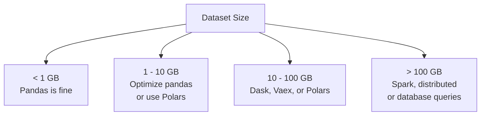
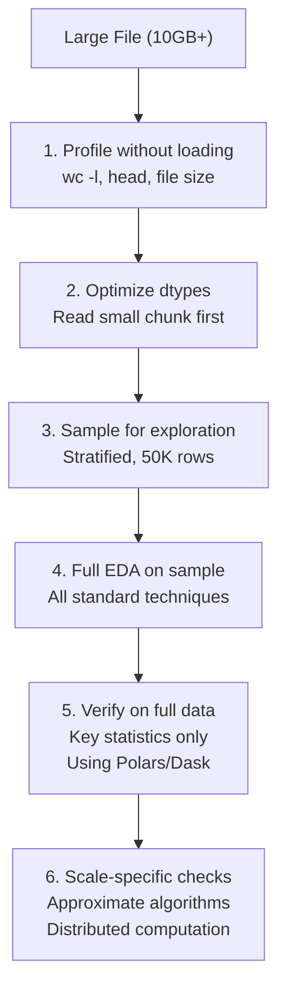

# EDA for Large Datasets

When your dataset has 100 million rows or occupies 50 GB, pandas loads it into memory and your laptop dies. You need tools designed for out-of-core computation: lazy evaluation, chunked processing, approximate statistics, and smart sampling. This page covers the practical toolkit.

## When Is Your Dataset "Large"?



## Memory Profiling: Know Your Baseline

Before optimizing, measure where memory goes.

```python
import numpy as np
import pandas as pd
import sys

# Generate a moderately large dataset for demonstration
np.random.seed(42)
n = 1_000_000

df = pd.DataFrame({
    "id": range(n),
    "user_id": np.random.randint(0, 100_000, n),
    "amount": np.random.lognormal(3, 1, n),
    "category": np.random.choice(["A", "B", "C", "D", "E"], n),
    "status": np.random.choice(["active", "inactive", "pending"], n),
    "timestamp": pd.date_range("2020-01-01", periods=n, freq="s"),
    "description": np.random.choice([
        "Product A purchase", "Service B subscription",
        "Refund processed", "Payment failed",
    ], n),
    "score": np.random.normal(50, 15, n),
    "flag": np.random.choice([True, False], n),
})

def memory_usage_report(df):
    """Detailed memory usage by column and dtype."""
    mem = df.memory_usage(deep=True)
    total_mb = mem.sum() / 1024**2

    print(f"Total memory: {total_mb:.1f} MB ({total_mb/1024:.2f} GB)")
    print(f"Rows: {len(df):,}")
    print(f"Columns: {len(df.columns)}")
    print(f"Bytes per row: {mem.sum() / len(df):.0f}")

    print(f"\nPer-column memory:")
    print(f"{'Column':>20s} {'Dtype':>15s} {'Memory (MB)':>12s} {'% of Total':>10s}")
    print("-" * 60)
    for col in df.columns:
        col_mem = mem[col] / 1024**2
        pct = col_mem / total_mb * 100
        print(f"{col:>20s} {str(df[col].dtype):>15s} {col_mem:>12.2f} {pct:>10.1f}%")

    return total_mb

original_mem = memory_usage_report(df)
```

## Optimization 1: Downcast Dtypes

The single biggest memory win with zero information loss.

```python
def optimize_dtypes(df):
    """Downcast all columns to minimum viable dtype."""
    optimized = df.copy()

    for col in optimized.columns:
        col_type = optimized[col].dtype

        # Integers
        if col_type in ["int64", "int32"]:
            c_min, c_max = optimized[col].min(), optimized[col].max()
            if c_min >= 0:
                if c_max <= 255:
                    optimized[col] = optimized[col].astype("uint8")
                elif c_max <= 65535:
                    optimized[col] = optimized[col].astype("uint16")
                elif c_max <= 4294967295:
                    optimized[col] = optimized[col].astype("uint32")
            else:
                if c_min >= -128 and c_max <= 127:
                    optimized[col] = optimized[col].astype("int8")
                elif c_min >= -32768 and c_max <= 32767:
                    optimized[col] = optimized[col].astype("int16")
                elif c_min >= -2147483648 and c_max <= 2147483647:
                    optimized[col] = optimized[col].astype("int32")

        # Floats
        elif col_type == "float64":
            optimized[col] = pd.to_numeric(optimized[col], downcast="float")

        # Object/string → category (if cardinality is low relative to rows)
        elif col_type == "object":
            nunique = optimized[col].nunique()
            if nunique / len(optimized) < 0.5:
                optimized[col] = optimized[col].astype("category")

        # Boolean
        elif col_type == "bool":
            optimized[col] = optimized[col].astype("bool")  # already optimal

    return optimized

df_opt = optimize_dtypes(df)
optimized_mem = memory_usage_report(df_opt)
print(f"\nSavings: {original_mem:.1f} MB → {optimized_mem:.1f} MB "
      f"({(1 - optimized_mem/original_mem)*100:.0f}% reduction)")
```

## Optimization 2: Chunked Reading

When the full file does not fit in memory, process it in chunks.

```python
# Write sample data to CSV for demonstration
df.to_csv("/tmp/large_dataset.csv", index=False)

# Chunked reading for statistics
def chunked_describe(filepath, chunksize=100_000):
    """Compute statistics by processing file in chunks."""
    n_rows = 0
    sums = {}
    sum_sq = {}
    mins = {}
    maxs = {}
    counts = {}

    for chunk in pd.read_csv(filepath, chunksize=chunksize):
        n_rows += len(chunk)
        numeric_cols = chunk.select_dtypes(include=[np.number]).columns

        for col in numeric_cols:
            values = chunk[col].dropna()
            if col not in sums:
                sums[col] = 0
                sum_sq[col] = 0
                mins[col] = float("inf")
                maxs[col] = float("-inf")
                counts[col] = 0

            sums[col] += values.sum()
            sum_sq[col] += (values ** 2).sum()
            mins[col] = min(mins[col], values.min())
            maxs[col] = max(maxs[col], values.max())
            counts[col] += len(values)

    # Compute final statistics
    results = {}
    for col in sums:
        mean = sums[col] / counts[col]
        var = sum_sq[col] / counts[col] - mean ** 2
        results[col] = {
            "count": counts[col],
            "mean": mean,
            "std": np.sqrt(var),
            "min": mins[col],
            "max": maxs[col],
        }

    print(f"Processed {n_rows:,} rows in chunks of {chunksize:,}")
    return pd.DataFrame(results).T

stats = chunked_describe("/tmp/large_dataset.csv")
print(stats.round(2))
```

## Polars: The Fast Alternative

Polars is a DataFrame library written in Rust with lazy evaluation and multi-threaded execution.

```python
try:
    import polars as pl

    # Read with Polars (much faster than pandas)
    df_pl = pl.read_csv("/tmp/large_dataset.csv")
    print(f"Polars DataFrame: {df_pl.shape}")
    print(f"Memory: {df_pl.estimated_size('mb'):.1f} MB")

    # Lazy evaluation: build query plan, execute at the end
    result = (
        df_pl.lazy()
        .filter(pl.col("amount") > 10)
        .group_by("category")
        .agg([
            pl.col("amount").mean().alias("avg_amount"),
            pl.col("amount").std().alias("std_amount"),
            pl.col("score").mean().alias("avg_score"),
            pl.count().alias("n_rows"),
        ])
        .sort("avg_amount", descending=True)
        .collect()
    )
    print("\nPolars lazy aggregation:")
    print(result)

    # Describe with Polars
    print("\nPolars describe:")
    print(df_pl.describe())

    # Polars vs Pandas speed comparison
    import time

    # Pandas
    start = time.time()
    _ = df.groupby("category")["amount"].agg(["mean", "std", "count"])
    pandas_time = time.time() - start

    # Polars
    start = time.time()
    _ = df_pl.group_by("category").agg([
        pl.col("amount").mean(),
        pl.col("amount").std(),
        pl.col("amount").count(),
    ])
    polars_time = time.time() - start

    print(f"\nGroupby speed: Pandas={pandas_time:.3f}s, Polars={polars_time:.3f}s "
          f"({pandas_time/polars_time:.1f}x faster)")

except ImportError:
    print("Polars not installed. Install with: pip install polars")
```

## Dask: Parallel Pandas

Dask extends pandas to handle datasets larger than memory by partitioning them.

```python
try:
    import dask.dataframe as dd

    # Read with Dask (lazy — no memory used until compute())
    ddf = dd.read_csv("/tmp/large_dataset.csv")
    print(f"Dask DataFrame: {ddf.npartitions} partitions")

    # Lazy operations (no computation yet)
    result = (
        ddf[ddf["amount"] > 10]
        .groupby("category")["amount"]
        .agg(["mean", "std", "count"])
    )

    # Compute triggers execution
    print("\nDask result (computed):")
    print(result.compute())

    # Describe
    print("\nDask describe:")
    print(ddf.describe().compute().round(2))

except ImportError:
    print("Dask not installed. Install with: pip install dask[dataframe]")
```

## Smart Sampling Strategies

When EDA on the full dataset is too slow, sample intelligently.

```python
def smart_sample(df, n_sample=50000, strategy="stratified",
                 strat_col=None, random_state=42):
    """Sample a large DataFrame for EDA."""
    np.random.seed(random_state)

    if strategy == "random":
        return df.sample(n=min(n_sample, len(df)), random_state=random_state)

    elif strategy == "stratified" and strat_col is not None:
        # Proportional stratified sampling
        frac = n_sample / len(df)
        return df.groupby(strat_col, group_keys=False).apply(
            lambda x: x.sample(max(1, int(len(x) * frac)), random_state=random_state)
        )

    elif strategy == "systematic":
        # Every k-th row
        k = max(1, len(df) // n_sample)
        return df.iloc[::k]

    elif strategy == "reservoir":
        # Reservoir sampling (equal probability for all rows)
        reservoir = df.iloc[:n_sample].copy()
        for i in range(n_sample, len(df)):
            j = np.random.randint(0, i + 1)
            if j < n_sample:
                reservoir.iloc[j] = df.iloc[i]
        return reservoir

    return df.sample(n=min(n_sample, len(df)), random_state=random_state)

# Compare sampling strategies
for strategy in ["random", "stratified", "systematic"]:
    sample = smart_sample(df, n_sample=10000, strategy=strategy, strat_col="category")
    print(f"\n{strategy.upper()} sampling (n={len(sample):,}):")
    print(f"  Category distribution: {dict(sample['category'].value_counts(normalize=True).round(3))}")
    print(f"  Amount mean: {sample['amount'].mean():.2f} (full: {df['amount'].mean():.2f})")
    print(f"  Amount std:  {sample['amount'].std():.2f} (full: {df['amount'].std():.2f})")
```

### How Large Should Your Sample Be?

```python
from scipy.stats import norm

def required_sample_size(margin_of_error=0.01, confidence=0.95, proportion=0.5):
    """Compute required sample size for estimating a proportion."""
    z = norm.ppf(1 - (1 - confidence) / 2)
    n = (z ** 2 * proportion * (1 - proportion)) / margin_of_error ** 2
    return int(np.ceil(n))

print("Required sample size for various precisions:")
print(f"{'Margin of Error':>18s} {'95% CI':>10s} {'99% CI':>10s}")
for moe in [0.05, 0.02, 0.01, 0.005, 0.001]:
    n_95 = required_sample_size(moe, 0.95)
    n_99 = required_sample_size(moe, 0.99)
    print(f"{moe:>18.3f} {n_95:>10,} {n_99:>10,}")

print("\nFor most EDA purposes, 10,000-50,000 rows is sufficient.")
print("For rare events (< 1%), you need the rare events to be present: use stratified sampling.")
```

## Approximate Algorithms

When exact computation is too slow, use probabilistic approximations.

```python
# 1. Approximate quantiles (t-digest or greenwald-khanna)
# Using numpy's approximation
data = np.random.lognormal(10, 1, 10_000_000)

import time

# Exact quantiles
start = time.time()
exact_q = np.quantile(data, [0.25, 0.50, 0.75, 0.95, 0.99])
exact_time = time.time() - start

# Approximate via random sample
sample = np.random.choice(data, size=50000, replace=False)
start = time.time()
approx_q = np.quantile(sample, [0.25, 0.50, 0.75, 0.95, 0.99])
approx_time = time.time() - start

print("Exact vs Approximate Quantiles (n=10M):")
print(f"{'Quantile':>10s} {'Exact':>15s} {'Approx (50K)':>15s} {'Error %':>10s}")
for q, e, a in zip([0.25, 0.50, 0.75, 0.95, 0.99], exact_q, approx_q):
    print(f"{q:>10.2f} {e:>15.2f} {a:>15.2f} {abs(e-a)/e*100:>10.2f}%")
print(f"\nExact time: {exact_time:.3f}s, Approx time: {approx_time:.3f}s "
      f"({exact_time/approx_time:.0f}x faster)")

# 2. Approximate unique counts (HyperLogLog)
def hyperloglog_count(values, p=14):
    """Approximate unique count using HyperLogLog."""
    m = 2 ** p
    registers = np.zeros(m)

    for val in values:
        h = hash(str(val))
        j = h & (m - 1)  # first p bits → register index
        w = h >> p         # remaining bits
        # Count leading zeros
        rho = 1
        while w & 1 == 0 and rho < 64:
            rho += 1
            w >>= 1
        registers[j] = max(registers[j], rho)

    alpha = 0.7213 / (1 + 1.079 / m)
    estimate = alpha * m ** 2 / np.sum(2.0 ** (-registers))

    return int(estimate)

test_data = [f"item_{i}" for i in range(100_000)] * 5 + [f"item_{i}" for i in range(50_000)]
exact_unique = len(set(test_data))
hll_unique = hyperloglog_count(test_data)
print(f"\nHyperLogLog unique count:")
print(f"  Exact:   {exact_unique:,}")
print(f"  HLL:     {hll_unique:,}")
print(f"  Error:   {abs(hll_unique - exact_unique)/exact_unique*100:.2f}%")
```

## EDA Pipeline for Large Data



## Library Comparison

| Feature | Pandas | Polars | Dask | Vaex |
|---------|--------|--------|------|------|
| **Max data size** | RAM | RAM | Disk | Disk |
| **Speed** | Baseline | 5-50x faster | 2-10x faster | 5-20x faster |
| **Lazy evaluation** | No | Yes | Yes | Yes |
| **API familiarity** | — | Different | Pandas-like | Different |
| **GPU support** | No | No | cuDF integration | No |
| **Best for** | Small data, prototyping | Medium data, speed | Large data, distributed | Out-of-core EDA |

## Key Takeaways

- Dtype optimization can reduce memory by 50-80% with zero information loss. Do this before anything else.
- Polars is the fastest single-machine DataFrame library. Use it when data fits in RAM but pandas is too slow.
- Dask extends pandas for data larger than RAM. It requires thinking in terms of partitions and lazy computation.
- Stratified sampling preserves distribution properties and gives accurate EDA results with 10,000-50,000 rows.
- Approximate algorithms (quantile sketches, HyperLogLog) trade small accuracy for massive speed gains.
- Profile your data before loading: file size, row count, dtypes. This prevents out-of-memory crashes.
- For truly massive data (100GB+), push computation to the database. SQL aggregates are faster than loading data into Python.
