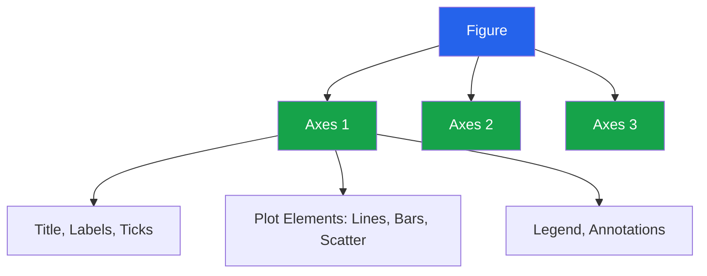

# Matplotlib for EDA

Matplotlib is the foundational plotting library in Python. While higher-level libraries like Seaborn and Plotly provide convenience, understanding Matplotlib gives you complete control over every pixel of your visualizations.

---

## The Figure-Axes Model



### Object-Oriented API (Always Use This)

```python
import matplotlib.pyplot as plt
import matplotlib.ticker as mticker
import numpy as np
import pandas as pd

# PREFERRED: Object-oriented API
fig, ax = plt.subplots(figsize=(10, 6))
ax.plot([1, 2, 3, 4], [10, 20, 25, 30])
ax.set_title('Sales Trend')
ax.set_xlabel('Quarter')
ax.set_ylabel('Revenue ($K)')
plt.tight_layout()
plt.savefig('trend.png', dpi=150, bbox_inches='tight')
plt.show()

# AVOID: pyplot state machine (plt.plot, plt.title, etc.)
# It works for quick plots but breaks down with complex layouts
```

---

## Essential Chart Types for EDA

### Line Chart — Trends Over Time

```python
np.random.seed(42)
dates = pd.date_range('2024-01-01', periods=365, freq='D')
values = np.cumsum(np.random.randn(365) * 2 + 0.5) + 100
ma_30 = pd.Series(values).rolling(30).mean()

fig, ax = plt.subplots(figsize=(12, 5))
ax.plot(dates, values, alpha=0.4, linewidth=0.8, label='Daily', color='steelblue')
ax.plot(dates, ma_30, linewidth=2, label='30-day MA', color='darkblue')
ax.fill_between(dates, values, ma_30, alpha=0.1, color='steelblue')
ax.set_title('Daily Values with 30-Day Moving Average', fontsize=14, fontweight='bold')
ax.set_xlabel('Date')
ax.set_ylabel('Value')
ax.legend(loc='upper left')
ax.grid(True, alpha=0.3)
fig.autofmt_xdate()
plt.tight_layout()
plt.show()
```

### Histogram — Distribution Shape

```python
np.random.seed(42)
data_normal = np.random.normal(50, 10, 5000)
data_skewed = np.random.lognormal(3.5, 0.5, 5000)

fig, axes = plt.subplots(1, 2, figsize=(14, 5))

# Normal distribution
axes[0].hist(data_normal, bins=50, edgecolor='white', color='steelblue', alpha=0.7)
axes[0].axvline(np.mean(data_normal), color='red', linestyle='--', label=f'Mean: {np.mean(data_normal):.1f}')
axes[0].axvline(np.median(data_normal), color='green', linestyle='--', label=f'Median: {np.median(data_normal):.1f}')
axes[0].set_title('Normal Distribution')
axes[0].legend()

# Skewed distribution
axes[1].hist(data_skewed, bins=50, edgecolor='white', color='coral', alpha=0.7)
axes[1].axvline(np.mean(data_skewed), color='red', linestyle='--', label=f'Mean: {np.mean(data_skewed):.1f}')
axes[1].axvline(np.median(data_skewed), color='green', linestyle='--', label=f'Median: {np.median(data_skewed):.1f}')
axes[1].set_title('Right-Skewed Distribution')
axes[1].legend()

for ax in axes:
    ax.set_xlabel('Value')
    ax.set_ylabel('Frequency')
    ax.grid(axis='y', alpha=0.3)

plt.tight_layout()
plt.show()
```

### Bar Chart — Categorical Comparison

```python
categories = ['Widget', 'Gadget', 'Doohickey', 'Thingamajig', 'Whatchamacallit']
values_a = [45, 38, 52, 28, 35]
values_b = [40, 42, 48, 32, 30]

x = np.arange(len(categories))
width = 0.35

fig, ax = plt.subplots(figsize=(10, 6))
bars1 = ax.bar(x - width/2, values_a, width, label='2024', color='steelblue')
bars2 = ax.bar(x + width/2, values_b, width, label='2025', color='coral')

# Add value labels on bars
for bar in bars1:
    ax.text(bar.get_x() + bar.get_width()/2., bar.get_height() + 0.5,
            f'{bar.get_height()}', ha='center', va='bottom', fontsize=9)
for bar in bars2:
    ax.text(bar.get_x() + bar.get_width()/2., bar.get_height() + 0.5,
            f'{bar.get_height()}', ha='center', va='bottom', fontsize=9)

ax.set_xlabel('Product')
ax.set_ylabel('Units Sold (K)')
ax.set_title('Product Sales Comparison: 2024 vs 2025')
ax.set_xticks(x)
ax.set_xticklabels(categories, rotation=15)
ax.legend()
ax.grid(axis='y', alpha=0.3)
plt.tight_layout()
plt.show()
```

### Horizontal Bar — Ranked Categories

```python
# Horizontal bars are better for many categories or long labels
departments = ['Engineering', 'Marketing', 'Sales', 'Support', 'Finance',
               'Legal', 'HR', 'Operations', 'R&D', 'Executive']
headcount = [120, 45, 80, 60, 25, 15, 20, 55, 90, 10]

# Sort for readability
sorted_idx = np.argsort(headcount)
departments = [departments[i] for i in sorted_idx]
headcount = [headcount[i] for i in sorted_idx]

fig, ax = plt.subplots(figsize=(10, 6))
colors = ['#dc2626' if h > 70 else '#2563eb' for h in headcount]
bars = ax.barh(departments, headcount, color=colors, edgecolor='white')

for bar, val in zip(bars, headcount):
    ax.text(val + 1, bar.get_y() + bar.get_height()/2,
            str(val), va='center', fontsize=10)

ax.set_xlabel('Headcount')
ax.set_title('Department Headcount (Red = Over 70)')
ax.spines['top'].set_visible(False)
ax.spines['right'].set_visible(False)
plt.tight_layout()
plt.show()
```

### Scatter Plot — Bivariate Relationships

```python
np.random.seed(42)
n = 500
x = np.random.randn(n)
y = 0.7 * x + np.random.randn(n) * 0.5
sizes = np.random.uniform(20, 200, n)
colors = np.random.randn(n)

fig, ax = plt.subplots(figsize=(10, 8))
scatter = ax.scatter(x, y, c=colors, s=sizes, alpha=0.6,
                     cmap='RdYlBu', edgecolors='white', linewidth=0.5)

# Regression line
z = np.polyfit(x, y, 1)
p = np.poly1d(z)
x_line = np.linspace(x.min(), x.max(), 100)
ax.plot(x_line, p(x_line), '--', color='black', linewidth=2, label=f'y = {z[0]:.2f}x + {z[1]:.2f}')

# Colorbar
cbar = plt.colorbar(scatter, ax=ax)
cbar.set_label('Color Variable')

# Correlation annotation
r = np.corrcoef(x, y)[0, 1]
ax.annotate(f'r = {r:.3f}', xy=(0.05, 0.95), xycoords='axes fraction',
            fontsize=14, fontweight='bold',
            bbox=dict(boxstyle='round', facecolor='wheat', alpha=0.8))

ax.set_xlabel('Variable X')
ax.set_ylabel('Variable Y')
ax.set_title('Scatter Plot with Regression Line')
ax.legend()
ax.grid(True, alpha=0.3)
plt.tight_layout()
plt.show()
```

### Box Plot — Distribution Comparison

```python
np.random.seed(42)
data = {
    'A': np.random.normal(50, 10, 200),
    'B': np.random.normal(55, 15, 200),
    'C': np.random.normal(45, 8, 200),
    'D': np.random.lognormal(3.8, 0.3, 200),
}

fig, axes = plt.subplots(1, 2, figsize=(14, 6))

# Standard box plot
bp1 = axes[0].boxplot(data.values(), labels=data.keys(), patch_artist=True,
                       boxprops=dict(facecolor='steelblue', alpha=0.7),
                       medianprops=dict(color='red', linewidth=2))
axes[0].set_title('Box Plot')
axes[0].set_ylabel('Value')
axes[0].grid(axis='y', alpha=0.3)

# Violin plot (shows full distribution)
parts = axes[1].violinplot(list(data.values()), showmeans=True, showmedians=True)
for pc in parts['bodies']:
    pc.set_facecolor('steelblue')
    pc.set_alpha(0.7)
axes[1].set_xticks([1, 2, 3, 4])
axes[1].set_xticklabels(data.keys())
axes[1].set_title('Violin Plot')
axes[1].set_ylabel('Value')
axes[1].grid(axis='y', alpha=0.3)

plt.tight_layout()
plt.show()
```

### Heatmap — Correlation Matrix

```python
np.random.seed(42)
n = 1000
df = pd.DataFrame({
    'Revenue':  np.random.lognormal(10, 1, n),
    'Units':    np.random.poisson(20, n),
    'Price':    np.random.uniform(10, 100, n),
    'Discount': np.random.beta(2, 5, n),
    'Rating':   np.random.uniform(1, 5, n),
    'Returns':  np.random.poisson(2, n),
})

corr = df.corr()

fig, ax = plt.subplots(figsize=(8, 7))
im = ax.imshow(corr, cmap='RdBu_r', vmin=-1, vmax=1)

# Add text annotations
for i in range(len(corr)):
    for j in range(len(corr)):
        color = 'white' if abs(corr.iloc[i, j]) > 0.5 else 'black'
        ax.text(j, i, f'{corr.iloc[i, j]:.2f}', ha='center', va='center',
                color=color, fontsize=11)

ax.set_xticks(range(len(corr.columns)))
ax.set_yticks(range(len(corr.columns)))
ax.set_xticklabels(corr.columns, rotation=45, ha='right')
ax.set_yticklabels(corr.columns)
ax.set_title('Correlation Matrix', fontsize=14, fontweight='bold', pad=20)
plt.colorbar(im, ax=ax, label='Pearson r', shrink=0.8)
plt.tight_layout()
plt.show()
```

### Pie / Donut Chart — Composition

```python
labels = ['Widget', 'Gadget', 'Doohickey', 'Other']
sizes = [35, 28, 22, 15]
colors = ['#2563eb', '#16a34a', '#dc2626', '#f59e0b']
explode = (0.05, 0, 0, 0)

fig, axes = plt.subplots(1, 2, figsize=(14, 6))

# Pie chart
axes[0].pie(sizes, explode=explode, labels=labels, colors=colors,
            autopct='%1.1f%%', shadow=False, startangle=90,
            textprops={'fontsize': 11})
axes[0].set_title('Revenue by Product (Pie)')

# Donut chart
wedges, texts, autotexts = axes[1].pie(
    sizes, labels=labels, colors=colors, autopct='%1.1f%%',
    startangle=90, pctdistance=0.75, textprops={'fontsize': 11}
)
centre_circle = plt.Circle((0, 0), 0.50, fc='white')
axes[1].add_artist(centre_circle)
axes[1].set_title('Revenue by Product (Donut)')

plt.tight_layout()
plt.show()
```

---

## Subplots and Complex Layouts

### Grid of Subplots

```python
np.random.seed(42)
features = ['Revenue', 'Units', 'Price', 'Discount', 'Rating', 'Returns']
data_dict = {
    'Revenue':  np.random.lognormal(4, 1, 2000),
    'Units':    np.random.poisson(20, 2000),
    'Price':    np.random.uniform(10, 100, 2000),
    'Discount': np.random.beta(2, 5, 2000),
    'Rating':   np.clip(np.random.normal(3.5, 0.8, 2000), 1, 5),
    'Returns':  np.random.poisson(2, 2000),
}

fig, axes = plt.subplots(2, 3, figsize=(16, 10))
axes = axes.flatten()

for i, (name, values) in enumerate(data_dict.items()):
    ax = axes[i]
    ax.hist(values, bins=40, edgecolor='white', alpha=0.7, color='steelblue')
    ax.axvline(np.mean(values), color='red', linestyle='--', linewidth=1.5,
               label=f'Mean: {np.mean(values):.2f}')
    ax.axvline(np.median(values), color='green', linestyle='--', linewidth=1.5,
               label=f'Median: {np.median(values):.2f}')
    ax.set_title(name, fontsize=12, fontweight='bold')
    ax.legend(fontsize=8)
    ax.grid(axis='y', alpha=0.3)

fig.suptitle('Feature Distributions', fontsize=16, fontweight='bold', y=1.02)
plt.tight_layout()
plt.show()
```

### GridSpec for Uneven Layouts

```python
from matplotlib.gridspec import GridSpec

np.random.seed(42)
x = np.random.randn(1000)
y = 0.5 * x + np.random.randn(1000) * 0.3

fig = plt.figure(figsize=(10, 8))
gs = GridSpec(3, 3, figure=fig, hspace=0.05, wspace=0.05)

# Main scatter plot
ax_main = fig.add_subplot(gs[1:, :2])
ax_main.scatter(x, y, alpha=0.3, s=10, color='steelblue')
ax_main.set_xlabel('X')
ax_main.set_ylabel('Y')

# Top histogram (X distribution)
ax_top = fig.add_subplot(gs[0, :2], sharex=ax_main)
ax_top.hist(x, bins=50, edgecolor='white', color='steelblue', alpha=0.7)
ax_top.tick_params(labelbottom=False)
ax_top.set_ylabel('Count')

# Right histogram (Y distribution)
ax_right = fig.add_subplot(gs[1:, 2], sharey=ax_main)
ax_right.hist(y, bins=50, orientation='horizontal', edgecolor='white', color='steelblue', alpha=0.7)
ax_right.tick_params(labelleft=False)
ax_right.set_xlabel('Count')

fig.suptitle('Joint Distribution Plot', fontsize=14, fontweight='bold')
plt.show()
```

---

## Customization

### Style and Theme

```python
# Available styles
print(plt.style.available)

# Set a clean style for EDA
plt.style.use('seaborn-v0_8-whitegrid')

# Custom rcParams
plt.rcParams.update({
    'figure.figsize': (10, 6),
    'figure.dpi': 100,
    'font.size': 11,
    'font.family': 'sans-serif',
    'axes.titlesize': 14,
    'axes.titleweight': 'bold',
    'axes.labelsize': 12,
    'axes.spines.top': False,
    'axes.spines.right': False,
    'lines.linewidth': 1.5,
    'legend.fontsize': 10,
    'legend.framealpha': 0.9,
})
```

### Annotations and Text

```python
np.random.seed(42)
x = np.arange(12)
y = np.random.randint(50, 150, 12)
months = ['Jan', 'Feb', 'Mar', 'Apr', 'May', 'Jun',
          'Jul', 'Aug', 'Sep', 'Oct', 'Nov', 'Dec']

fig, ax = plt.subplots(figsize=(12, 6))
ax.plot(x, y, 'o-', color='steelblue', markersize=8, linewidth=2)

# Annotate peak
peak_idx = np.argmax(y)
ax.annotate(
    f'Peak: {y[peak_idx]}',
    xy=(x[peak_idx], y[peak_idx]),
    xytext=(x[peak_idx] + 1, y[peak_idx] + 15),
    fontsize=12, fontweight='bold', color='darkred',
    arrowprops=dict(arrowstyle='->', color='darkred', linewidth=2),
    bbox=dict(boxstyle='round,pad=0.3', facecolor='yellow', alpha=0.8),
)

# Annotate trough
trough_idx = np.argmin(y)
ax.annotate(
    f'Trough: {y[trough_idx]}',
    xy=(x[trough_idx], y[trough_idx]),
    xytext=(x[trough_idx] - 2, y[trough_idx] - 20),
    fontsize=12, fontweight='bold', color='green',
    arrowprops=dict(arrowstyle='->', color='green', linewidth=2),
)

# Shaded region
ax.axvspan(5, 8, alpha=0.1, color='red', label='Summer months')

ax.set_xticks(x)
ax.set_xticklabels(months)
ax.set_title('Monthly Sales with Annotations')
ax.legend()
plt.tight_layout()
plt.show()
```

### Formatting Axes

```python
fig, ax = plt.subplots(figsize=(10, 6))
values = np.random.lognormal(12, 1, 100)
ax.bar(range(len(values)), sorted(values, reverse=True), color='steelblue')

# Format y-axis as currency
ax.yaxis.set_major_formatter(mticker.FuncFormatter(lambda x, p: f'${x/1e6:.1f}M'))

# Format x-axis
ax.set_xlabel('Customer Rank')
ax.set_ylabel('Revenue')
ax.set_title('Revenue by Customer (Pareto)')

# Add percentage on secondary axis
ax2 = ax.twinx()
cumsum = np.cumsum(sorted(values, reverse=True))
cumsum_pct = cumsum / cumsum[-1] * 100
ax2.plot(range(len(values)), cumsum_pct, 'r-', linewidth=2, label='Cumulative %')
ax2.set_ylabel('Cumulative %')
ax2.yaxis.set_major_formatter(mticker.PercentFormatter())
ax2.legend(loc='center right')

plt.tight_layout()
plt.show()
```

---

## Saving Figures

```python
fig, ax = plt.subplots(figsize=(10, 6))
ax.plot(np.random.randn(100).cumsum())
ax.set_title('Sample Plot')

# PNG — raster, good for web
fig.savefig('plot.png', dpi=150, bbox_inches='tight',
            facecolor='white', transparent=False)

# SVG — vector, good for papers/presentations
fig.savefig('plot.svg', bbox_inches='tight')

# PDF — vector, good for LaTeX/papers
fig.savefig('plot.pdf', bbox_inches='tight')

# High-res for print
fig.savefig('plot_print.png', dpi=300, bbox_inches='tight')

plt.close(fig)  # free memory
```

---

## EDA Visualization Template

```python
def eda_plot_suite(df, numeric_cols=None, categorical_cols=None, figsize=(16, 20)):
    """Generate a comprehensive EDA visualization suite."""

    if numeric_cols is None:
        numeric_cols = df.select_dtypes(include='number').columns.tolist()
    if categorical_cols is None:
        categorical_cols = df.select_dtypes(include=['object', 'category']).columns.tolist()

    n_num = len(numeric_cols)
    n_cat = len(categorical_cols)
    n_rows = n_num + n_cat + 1  # +1 for correlation matrix

    fig, axes = plt.subplots(n_rows, 2, figsize=(figsize[0], 4 * n_rows))
    if n_rows == 1:
        axes = axes.reshape(1, -1)

    row = 0

    # Numeric: histogram + boxplot
    for col in numeric_cols:
        data = df[col].dropna()

        # Histogram
        axes[row, 0].hist(data, bins=40, edgecolor='white', color='steelblue', alpha=0.7)
        axes[row, 0].axvline(data.mean(), color='red', linestyle='--', label=f'Mean: {data.mean():.2f}')
        axes[row, 0].axvline(data.median(), color='green', linestyle='--', label=f'Median: {data.median():.2f}')
        axes[row, 0].set_title(f'{col} — Distribution')
        axes[row, 0].legend(fontsize=8)

        # Box plot
        axes[row, 1].boxplot(data, vert=False, patch_artist=True,
                             boxprops=dict(facecolor='steelblue', alpha=0.5))
        axes[row, 1].set_title(f'{col} — Box Plot')
        axes[row, 1].set_xlabel(col)

        row += 1

    # Categorical: bar chart + value counts
    for col in categorical_cols:
        vc = df[col].value_counts().head(10)

        axes[row, 0].barh(vc.index.astype(str), vc.values, color='steelblue')
        axes[row, 0].set_title(f'{col} — Top 10 Values')
        axes[row, 0].invert_yaxis()

        # Percentage
        vc_pct = df[col].value_counts(normalize=True).head(10) * 100
        axes[row, 1].barh(vc_pct.index.astype(str), vc_pct.values, color='coral')
        axes[row, 1].set_title(f'{col} — Percentage')
        axes[row, 1].set_xlabel('%')
        axes[row, 1].invert_yaxis()

        row += 1

    # Correlation matrix
    if len(numeric_cols) >= 2:
        corr = df[numeric_cols].corr()
        im = axes[row, 0].imshow(corr, cmap='RdBu_r', vmin=-1, vmax=1)
        axes[row, 0].set_xticks(range(len(numeric_cols)))
        axes[row, 0].set_yticks(range(len(numeric_cols)))
        axes[row, 0].set_xticklabels(numeric_cols, rotation=45, ha='right', fontsize=8)
        axes[row, 0].set_yticklabels(numeric_cols, fontsize=8)
        axes[row, 0].set_title('Correlation Matrix')
        plt.colorbar(im, ax=axes[row, 0], shrink=0.8)

        axes[row, 1].axis('off')

    fig.suptitle('EDA Visualization Suite', fontsize=16, fontweight='bold', y=1.01)
    plt.tight_layout()
    plt.show()

# Usage:
# eda_plot_suite(df, numeric_cols=['revenue', 'units'], categorical_cols=['product', 'region'])
```

---

## Key Takeaways

- Always use the **object-oriented API** (`fig, ax = plt.subplots()`) instead of the pyplot state machine
- **Histograms** reveal distribution shape; **box plots** reveal outliers; **scatter plots** reveal relationships
- Use **`GridSpec`** for complex multi-panel layouts with unequal subplot sizes
- **Annotate** peaks, troughs, and anomalies to make EDA plots self-explanatory
- Save as **PNG** (web), **SVG/PDF** (print), always with `bbox_inches='tight'`
- Build reusable **template functions** that generate standard EDA visualizations for any DataFrame
- Close figures with `plt.close(fig)` when generating many plots to avoid memory leaks
