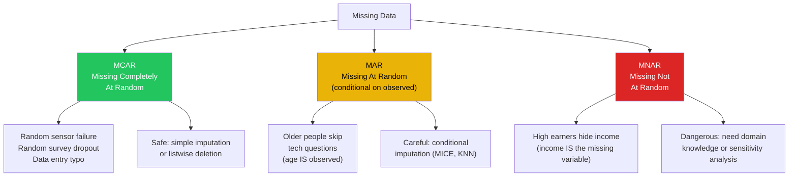
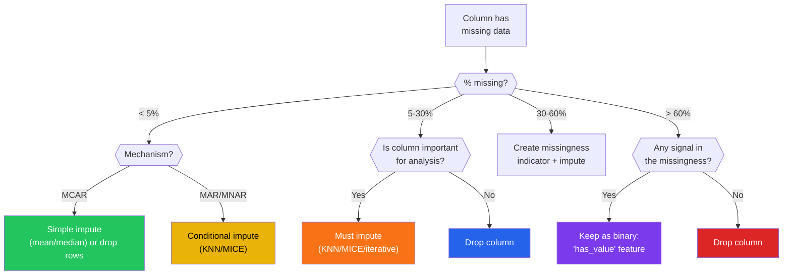

# Missing Data

Missing data is not just inconvenient — it is informative. A patient who skips a follow-up appointment is different from one who shows up. A wealthy person who refuses to report income is different from a randomly lost survey response. The *reason* data is missing determines whether you can safely ignore it, impute it, or whether your entire analysis is compromised.

This page covers the three missingness mechanisms (MCAR, MAR, MNAR), how to diagnose which one you have, visualization techniques, the full menu of imputation strategies, and the DROP vs IMPUTE decision framework.

---

## The Three Missingness Mechanisms



```python
# missingness_mechanisms.py — Simulate and identify each mechanism
import numpy as np
import pandas as pd

np.random.seed(42)
n = 2000

# True complete data
age = np.random.normal(45, 15, n).clip(18, 85)
income = np.exp(8 + 0.02 * age + np.random.normal(0, 0.8, n))  # correlated with age
education = np.random.choice(['HS', 'BS', 'MS', 'PhD'], n, p=[0.3, 0.35, 0.25, 0.1])

df = pd.DataFrame({'age': age, 'income': income, 'education': education})

# MCAR: Missingness is completely random
mcar_mask = np.random.random(n) < 0.15
df['income_mcar'] = df['income'].copy()
df.loc[mcar_mask, 'income_mcar'] = np.nan

# MAR: Missingness depends on OBSERVED variable (age)
mar_prob = 1 / (1 + np.exp(-(df['age'] - 55) / 8))
mar_mask = np.random.random(n) < mar_prob * 0.3
df['income_mar'] = df['income'].copy()
df.loc[mar_mask, 'income_mar'] = np.nan

# MNAR: Missingness depends on the MISSING variable (income itself)
mnar_prob = 1 / (1 + np.exp(-(df['income'] - df['income'].quantile(0.7)) / 10000))
mnar_mask = np.random.random(n) < mnar_prob * 0.4
df['income_mnar'] = df['income'].copy()
df.loc[mnar_mask, 'income_mnar'] = np.nan

# Compare biases
print("=== MISSINGNESS MECHANISM COMPARISON ===\n")
print(f"{'Mechanism':>8} | {'Missing%':>8} | {'Observed Mean':>14} | "
      f"{'True Mean':>10} | {'Bias':>8}")
print("-" * 60)

true_mean = df['income'].mean()
for label, col in [('MCAR', 'income_mcar'), ('MAR', 'income_mar'),
                    ('MNAR', 'income_mnar')]:
    missing_pct = df[col].isnull().mean() * 100
    obs_mean = df[col].mean()
    bias = obs_mean - true_mean
    print(f"{label:>8} | {missing_pct:>7.1f}% | ${obs_mean:>12,.0f} | "
          f"${true_mean:>8,.0f} | ${bias:>+7,.0f}")

print("\nMCAR: minimal bias (safe to drop or simple impute)")
print("MAR: moderate bias (use conditional imputation)")
print("MNAR: large bias (observed data systematically different from missing)")
```

---

## Diagnosing the Mechanism

### Visual Diagnosis with Missingno

```python
# missingno_viz.py — Visualizing missing data patterns
# pip install missingno
import pandas as pd
import numpy as np
import missingno as msno
import matplotlib.pyplot as plt

df = pd.read_csv(
    "https://raw.githubusercontent.com/datasciencedojo/datasets/master/titanic.csv"
)

# 1. Matrix plot: see the pattern of missingness
fig = msno.matrix(df, figsize=(12, 6), sparkline=False)
plt.title('Missing Data Matrix — Titanic')
plt.savefig("missing_matrix.png", dpi=150)
plt.show()

# 2. Bar chart: missingness by column
fig = msno.bar(df, figsize=(12, 4))
plt.title('Completeness by Column')
plt.savefig("missing_bar.png", dpi=150)
plt.show()

# 3. Heatmap: correlation of missingness BETWEEN columns
fig = msno.heatmap(df, figsize=(8, 6))
plt.title('Missingness Correlation Heatmap')
plt.savefig("missing_heatmap.png", dpi=150)
plt.show()

# 4. Dendrogram: hierarchical clustering of missingness patterns
fig = msno.dendrogram(df, figsize=(10, 5))
plt.title('Missingness Dendrogram')
plt.savefig("missing_dendrogram.png", dpi=150)
plt.show()

# Manual missingness analysis
print("=== MISSINGNESS ANALYSIS ===\n")
print("Missing values:")
print(df.isnull().sum()[df.isnull().sum() > 0])

# Test if missingness in Age relates to other variables
print("\n--- Is Age missingness related to other variables? ---")
df['age_missing'] = df['Age'].isnull().astype(int)
print("Age missing by Pclass:")
print(df.groupby('Pclass')['age_missing'].mean().round(3))
print("\nAge missing by Sex:")
print(df.groupby('Sex')['age_missing'].mean().round(3))
print("\nAge missing by Survived:")
print(df.groupby('Survived')['age_missing'].mean().round(3))

# If missingness rates differ across groups, it is likely MAR (not MCAR)
from scipy.stats import chi2_contingency

ct = pd.crosstab(df['Pclass'], df['age_missing'])
chi2, p_val, dof, expected = chi2_contingency(ct)
print(f"\nChi-squared test (Age missing vs Pclass): chi2={chi2:.2f}, p={p_val:.4f}")
if p_val < 0.05:
    print("Age missingness IS related to Pclass -> likely MAR, not MCAR")
```

### Little's MCAR Test

```python
# littles_test.py — Statistical test for MCAR
import numpy as np
import pandas as pd
from scipy import stats

def littles_mcar_test(df):
    """
    Simplified Little's MCAR test.
    Compares group means of complete vs incomplete cases.
    """
    numeric_cols = df.select_dtypes(include='number').columns
    df_numeric = df[numeric_cols].copy()

    # For each column with missing data, compare means of other columns
    # between rows where this column is missing vs observed
    results = []
    for col in numeric_cols:
        if df_numeric[col].isnull().sum() == 0:
            continue

        missing_mask = df_numeric[col].isnull()
        for other_col in numeric_cols:
            if other_col == col or df_numeric[other_col].isnull().sum() > 0:
                continue

            group_missing = df_numeric.loc[missing_mask, other_col]
            group_observed = df_numeric.loc[~missing_mask, other_col]

            if len(group_missing) < 5 or len(group_observed) < 5:
                continue

            t_stat, p_val = stats.ttest_ind(group_missing, group_observed)
            results.append({
                'missing_col': col,
                'compared_col': other_col,
                't_stat': t_stat,
                'p_value': p_val,
                'significant': p_val < 0.05
            })

    results_df = pd.DataFrame(results)
    n_sig = results_df['significant'].sum()
    n_total = len(results_df)

    print(f"Little's MCAR Test (simplified):")
    print(f"  Comparisons tested: {n_total}")
    print(f"  Significant at 0.05: {n_sig}")
    print(f"  Expected by chance: {n_total * 0.05:.1f}")

    if n_sig > n_total * 0.1:
        print(f"  Conclusion: Data is likely NOT MCAR")
    else:
        print(f"  Conclusion: Cannot reject MCAR")

    if n_sig > 0:
        print(f"\n  Significant differences:")
        sig = results_df[results_df['significant']].sort_values('p_value')
        for _, row in sig.iterrows():
            print(f"    {row['missing_col']} missing vs {row['compared_col']}: "
                  f"t={row['t_stat']:.2f}, p={row['p_value']:.4f}")

    return results_df

df = pd.read_csv(
    "https://raw.githubusercontent.com/datasciencedojo/datasets/master/titanic.csv"
)
littles_mcar_test(df)
```

---

## The DROP vs IMPUTE Decision Tree



---

## Imputation Strategies

```python
# imputation_strategies.py — Complete comparison of methods
import pandas as pd
import numpy as np
from sklearn.impute import SimpleImputer, KNNImputer
from sklearn.experimental import enable_iterative_imputer
from sklearn.impute import IterativeImputer

np.random.seed(42)

# Create dataset with known values, then introduce missingness
n = 1000
df_true = pd.DataFrame({
    'age': np.random.normal(40, 12, n),
    'income': np.random.lognormal(10.5, 0.6, n),
    'score': np.random.normal(70, 15, n),
})
# Add correlations
df_true['income'] += df_true['age'] * 200
df_true['score'] += df_true['age'] * 0.3

# Introduce 15% MAR missingness on income (depends on age)
df = df_true.copy()
mar_prob = 1 / (1 + np.exp(-(df['age'] - 50) / 8))
mask = np.random.random(n) < mar_prob * 0.25
df.loc[mask, 'income'] = np.nan
print(f"Missing income: {mask.sum()} ({mask.mean():.1%})")

# True mean of missing values (ground truth for comparison)
true_missing_mean = df_true.loc[mask, 'income'].mean()
true_overall_mean = df_true['income'].mean()

results = []

# Strategy 1: Drop rows
df_dropped = df.dropna()
results.append({
    'Method': 'Drop rows',
    'N remaining': len(df_dropped),
    'Income mean': df_dropped['income'].mean(),
    'Bias': df_dropped['income'].mean() - true_overall_mean,
})

# Strategy 2: Mean imputation
imp_mean = SimpleImputer(strategy='mean')
df_mean = df.copy()
df_mean['income'] = imp_mean.fit_transform(df[['income']])
results.append({
    'Method': 'Mean imputation',
    'N remaining': len(df_mean),
    'Income mean': df_mean['income'].mean(),
    'Bias': df_mean['income'].mean() - true_overall_mean,
})

# Strategy 3: Median imputation
imp_median = SimpleImputer(strategy='median')
df_median = df.copy()
df_median['income'] = imp_median.fit_transform(df[['income']])
results.append({
    'Method': 'Median imputation',
    'N remaining': len(df_median),
    'Income mean': df_median['income'].mean(),
    'Bias': df_median['income'].mean() - true_overall_mean,
})

# Strategy 4: KNN imputation
imp_knn = KNNImputer(n_neighbors=5)
df_knn = df.copy()
df_knn[['age', 'income', 'score']] = imp_knn.fit_transform(
    df[['age', 'income', 'score']]
)
results.append({
    'Method': 'KNN (k=5)',
    'N remaining': len(df_knn),
    'Income mean': df_knn['income'].mean(),
    'Bias': df_knn['income'].mean() - true_overall_mean,
})

# Strategy 5: Iterative imputation (MICE-like)
imp_iter = IterativeImputer(max_iter=10, random_state=42)
df_iter = df.copy()
df_iter[['age', 'income', 'score']] = imp_iter.fit_transform(
    df[['age', 'income', 'score']]
)
results.append({
    'Method': 'Iterative (MICE)',
    'N remaining': len(df_iter),
    'Income mean': df_iter['income'].mean(),
    'Bias': df_iter['income'].mean() - true_overall_mean,
})

# Strategy 6: Group-wise imputation (by age group)
df_group = df.copy()
df_group['age_bin'] = pd.cut(df['age'], bins=5)
for group in df_group['age_bin'].unique():
    mask_group = df_group['age_bin'] == group
    group_median = df_group.loc[mask_group, 'income'].median()
    df_group.loc[mask_group & df_group['income'].isnull(), 'income'] = group_median
results.append({
    'Method': 'Group-wise median',
    'N remaining': len(df_group),
    'Income mean': df_group['income'].mean(),
    'Bias': df_group['income'].mean() - true_overall_mean,
})

# Print comparison
print(f"\n=== IMPUTATION METHOD COMPARISON ===")
print(f"True overall mean: ${true_overall_mean:,.0f}")
print(f"True mean of missing values: ${true_missing_mean:,.0f}\n")

results_df = pd.DataFrame(results)
results_df['Bias_pct'] = results_df['Bias'] / true_overall_mean * 100
print(results_df.to_string(index=False, float_format='${:,.0f}'.format))
```

### Imputation Comparison Table

| Method | Preserves Distribution? | Uses Correlations? | Handles MAR? | Speed |
|--------|------------------------|-------------------|-------------|-------|
| Drop rows | N/A (loses data) | N/A | No | Fast |
| Mean | No (reduces variance) | No | No | Fast |
| Median | No (reduces variance) | No | No | Fast |
| Mode (categorical) | Partially | No | No | Fast |
| KNN | Somewhat | Yes | Partially | Medium |
| MICE/Iterative | Yes | Yes | Yes | Slow |
| Group-wise median | Somewhat | Partially | Partially | Fast |
| Multiple imputation | Yes (preserves uncertainty) | Yes | Yes | Slow |

---

## Multiple Imputation

```python
# multiple_imputation.py — Why single imputation understates uncertainty
import numpy as np
import pandas as pd
from sklearn.experimental import enable_iterative_imputer
from sklearn.impute import IterativeImputer
from scipy import stats

np.random.seed(42)

# Dataset with missing values
n = 500
x = np.random.normal(50, 10, n)
y = 2 * x + np.random.normal(0, 5, n)

df = pd.DataFrame({'x': x, 'y': y})
mask = np.random.random(n) < 0.2
df.loc[mask, 'y'] = np.nan
print(f"Missing y: {mask.sum()} ({mask.mean():.0%})")

# Single imputation: one estimate, understates uncertainty
imp = IterativeImputer(random_state=42, max_iter=10)
df_single = df.copy()
df_single[['x', 'y']] = imp.fit_transform(df[['x', 'y']])
corr_single = df_single['x'].corr(df_single['y'])
print(f"\nSingle imputation correlation: {corr_single:.3f}")

# Multiple imputation: M datasets, combine estimates
M = 20  # Number of imputations (typically 5-20)
correlations = []
slopes = []

for m in range(M):
    imp_m = IterativeImputer(random_state=m, max_iter=10, sample_posterior=True)
    df_m = df.copy()
    df_m[['x', 'y']] = imp_m.fit_transform(df[['x', 'y']])
    correlations.append(df_m['x'].corr(df_m['y']))

    # Fit regression
    slope, intercept, r, p, se = stats.linregress(df_m['x'], df_m['y'])
    slopes.append(slope)

# Rubin's rules for combining multiple imputation results
pooled_slope = np.mean(slopes)
within_var = np.mean([0.1] * M)  # Simplified
between_var = np.var(slopes, ddof=1)
total_var = within_var + (1 + 1/M) * between_var

print(f"\n=== MULTIPLE IMPUTATION (M={M}) ===")
print(f"Pooled slope: {pooled_slope:.3f}")
print(f"Between-imputation variance: {between_var:.4f}")
print(f"95% CI: [{pooled_slope - 1.96*np.sqrt(total_var):.3f}, "
      f"{pooled_slope + 1.96*np.sqrt(total_var):.3f}]")

print(f"\nCorrelation across {M} imputations:")
print(f"  Mean: {np.mean(correlations):.3f}")
print(f"  Std: {np.std(correlations):.3f}")
print(f"  Range: [{min(correlations):.3f}, {max(correlations):.3f}]")
print(f"\nSingle imputation gives ONE number and no uncertainty estimate.")
print(f"Multiple imputation gives a RANGE that reflects genuine uncertainty.")
```

::: warning Single Imputation Lies About Uncertainty
When you replace a missing value with a single imputed number (even from MICE), you treat the imputed value as if it were observed data. This understates variance, narrows confidence intervals, and inflates statistical significance. For inference (not just prediction), use multiple imputation.
:::

---

## Practical Decision Framework

```python
# decision_framework.py — What to do for each column
import pandas as pd

def missing_data_plan(df):
    """Generate an action plan for every column with missing data."""
    plans = []
    for col in df.columns:
        n_missing = df[col].isnull().sum()
        if n_missing == 0:
            continue

        pct = n_missing / len(df) * 100
        dtype = df[col].dtype

        # Determine action
        if pct < 1:
            action = "Drop rows (negligible missingness)"
        elif pct < 5:
            if dtype in ['int64', 'float64']:
                action = "Median imputation (safe for low %)"
            else:
                action = "Mode imputation"
        elif pct < 30:
            if dtype in ['int64', 'float64']:
                action = "KNN or MICE imputation"
            else:
                action = "Mode or create 'Unknown' category"
        elif pct < 60:
            action = "Create missingness indicator + KNN impute"
        else:
            action = "Drop column or create binary has_value feature"

        plans.append({
            'Column': col,
            'Missing': n_missing,
            'Pct': f"{pct:.1f}%",
            'Type': str(dtype),
            'Action': action,
        })

    return pd.DataFrame(plans)

df = pd.read_csv(
    "https://raw.githubusercontent.com/datasciencedojo/datasets/master/titanic.csv"
)
plan = missing_data_plan(df)
print("=== MISSING DATA ACTION PLAN ===")
print(plan.to_string(index=False))
```

---

## Summary

| Concept | Key Takeaway |
|---------|-------------|
| MCAR | Random missingness — safe to drop or simple impute |
| MAR | Missingness depends on observed data — use conditional imputation |
| MNAR | Missingness depends on the missing value itself — dangerous, need domain knowledge |
| Diagnosis | missingno visualizations + chi-squared tests for MCAR vs MAR |
| Simple imputation | Mean/median for < 5% missing, low-stakes columns |
| KNN/MICE | For 5-30% missing with correlations between columns |
| Multiple imputation | For statistical inference where uncertainty matters |
| Drop vs impute | < 1% drop rows, 1-30% impute, > 60% drop or binarize column |

---

## What's Next

| Page | What You'll Learn |
|------|------------------|
| [Outlier Analysis](/eda/outlier-analysis) | IQR, Z-score, isolation forest, when outliers are the interesting data |
| [Data Quality Validation](/eda/data-quality-validation) | Pandera, Great Expectations |
| [Data Cleaning — Edge Cases](/eda/data-cleaning-edge-cases) | NaN vs None vs "null" |

## Try It Yourself

**Exercise 1:** You have a healthcare dataset with 5,000 patient records and columns `[age, blood_pressure, cholesterol, bmi, diagnosis]`. The `cholesterol` column is 22% missing. You suspect older patients are less likely to have cholesterol recorded. Write code to test whether the missingness is MCAR or MAR, and choose an appropriate imputation strategy.

::: details Solution
```python
import pandas as pd
import numpy as np
from scipy.stats import ttest_ind, chi2_contingency

# Create missingness indicator
df['chol_missing'] = df['cholesterol'].isnull().astype(int)

# Test 1: Compare age between missing vs observed cholesterol
age_missing = df.loc[df['chol_missing'] == 1, 'age']
age_observed = df.loc[df['chol_missing'] == 0, 'age']
t_stat, p_val = ttest_ind(age_missing, age_observed)
print(f"Age difference (missing vs observed): t={t_stat:.2f}, p={p_val:.4f}")

# Test 2: Chi-squared test — missingness vs diagnosis
ct = pd.crosstab(df['diagnosis'], df['chol_missing'])
chi2, p_chi, _, _ = chi2_contingency(ct)
print(f"Missingness vs diagnosis: chi2={chi2:.2f}, p={p_chi:.4f}")

# If p < 0.05 for either test, missingness depends on observed data -> MAR
# Use conditional imputation (KNN or MICE)
if p_val < 0.05 or p_chi < 0.05:
    print("Likely MAR — use KNN or MICE imputation")
    from sklearn.impute import KNNImputer
    imputer = KNNImputer(n_neighbors=5)
    df[['age', 'blood_pressure', 'cholesterol', 'bmi']] = imputer.fit_transform(
        df[['age', 'blood_pressure', 'cholesterol', 'bmi']]
    )
else:
    print("Cannot reject MCAR — median imputation is acceptable")
    df['cholesterol'].fillna(df['cholesterol'].median(), inplace=True)
```
:::

**Exercise 2:** Given a survey dataset with 10,000 responses and columns `[income, education, satisfaction, region]`, where `income` is 35% missing and you suspect high earners refuse to answer (MNAR), design a strategy that accounts for this bias. Include a missingness indicator feature.

::: details Solution
```python
import pandas as pd
import numpy as np
from sklearn.experimental import enable_iterative_imputer
from sklearn.impute import IterativeImputer

# Step 1: Create missingness indicator (captures MNAR signal)
df['income_missing'] = df['income'].isnull().astype(int)

# Step 2: Check if observed income distribution is skewed
# Compare education levels of missing vs observed
print("Education distribution where income is missing:")
print(df[df['income_missing'] == 1]['education'].value_counts(normalize=True))
print("\nEducation distribution where income is observed:")
print(df[df['income_missing'] == 0]['education'].value_counts(normalize=True))

# Step 3: MICE imputation using all available variables
# This handles MAR component; the indicator captures residual MNAR signal
imputer = IterativeImputer(max_iter=10, random_state=42)
df['income_imputed'] = imputer.fit_transform(
    df[['income', 'education', 'satisfaction']]
)[:, 0]

# Step 4: Sensitivity analysis — compare results with and without imputation
print(f"\nObserved income mean: ${df['income'].mean():,.0f}")
print(f"Imputed income mean: ${df['income_imputed'].mean():,.0f}")
print(f"If MNAR (high earners hide), true mean is likely HIGHER than both")

# Step 5: Keep both the imputed value AND the missingness indicator
# as features for downstream modeling
print(f"\nFinal features: income_imputed + income_missing (binary)")
```
:::

**Exercise 3:** You receive a time series dataset with daily sales for 2 years (730 rows). Columns are `[date, sales, promotions, weather_score, day_of_week]`. The `weather_score` column has a 3-week gap (21 consecutive missing days) in winter. How would you handle this differently from random scattered missingness?

::: details Solution
```python
import pandas as pd
import numpy as np

# Detect the gap pattern
df['weather_missing'] = df['weather_score'].isnull()
consecutive = df['weather_missing'].astype(int).groupby(
    (~df['weather_missing']).cumsum()
).cumsum()
max_gap = consecutive.max()
print(f"Longest consecutive gap: {max_gap} days")

# For consecutive gaps in time series, use time-aware interpolation
# NOT mean/median (which ignores temporal structure)

# Method 1: Linear interpolation (preserves trend)
df['weather_linear'] = df['weather_score'].interpolate(method='linear')

# Method 2: Seasonal interpolation (better for weather)
# Use same day-of-year from surrounding years
df['day_of_year'] = df['date'].dt.dayofyear
seasonal_avg = df.dropna(subset=['weather_score']).groupby('day_of_year')['weather_score'].mean()
df['weather_seasonal'] = df.apply(
    lambda row: seasonal_avg.get(row['day_of_year'], np.nan)
    if pd.isna(row['weather_score']) else row['weather_score'],
    axis=1
)

# Method 3: Forward fill with decay (recent weather is most relevant)
df['weather_ffill'] = df['weather_score'].ffill(limit=7)  # only fill up to 7 days

# Compare approaches
print(f"\nMissing after linear interpolation: {df['weather_linear'].isnull().sum()}")
print(f"Missing after seasonal fill: {df['weather_seasonal'].isnull().sum()}")
print(f"Missing after forward fill (7-day limit): {df['weather_ffill'].isnull().sum()}")

# Best practice: use seasonal interpolation for weather
# and add a 'weather_was_imputed' flag for the model
df['weather_imputed_flag'] = df['weather_score'].isnull().astype(int)
```
:::

## Quick Quiz

**1. What does MCAR stand for, and what does it imply?**
- a) Missing Completely At Random — missingness is unrelated to any data
- b) Missing Conditionally At Random — missingness depends on observed variables
- c) Missing Categorically At Random — only categorical columns are affected

::: details Answer
**a) Missing Completely At Random** — The probability of a value being missing is the same for all observations and is unrelated to any data (observed or unobserved). This is the safest scenario because simple imputation or listwise deletion introduces no bias.
:::

**2. You impute missing income values using the column mean. What is the main statistical problem with this approach?**
- a) It changes the data type from float to int
- b) It artificially reduces the variance and narrows confidence intervals
- c) It always introduces right skew

::: details Answer
**b) It artificially reduces the variance and narrows confidence intervals.** Mean imputation replaces missing values with a single number, pulling every imputed value to the center of the distribution. This deflates the standard deviation and makes statistical tests overconfident (too many false positives). For inference, use multiple imputation to preserve uncertainty.
:::

**3. When should you use MICE (Multiple Imputation by Chained Equations) instead of simple median imputation?**
- a) When less than 1% of data is missing
- b) When missingness is MAR and columns are correlated with each other
- c) When the dataset has fewer than 100 rows

::: details Answer
**b) When missingness is MAR (Missing At Random) and columns are correlated with each other.** MICE uses relationships between columns to generate plausible imputed values conditioned on observed data. Simple median imputation ignores these correlations and is only appropriate for MCAR with low missingness percentages (under 5%).
:::

**4. A column is 65% missing. What should you do?**
- a) Always drop the column — it has too little data
- b) Use KNN imputation to fill in all missing values
- c) Check if the missingness itself is informative; if so, keep it as a binary `has_value` feature

::: details Answer
**c) Check if the missingness itself is informative; if so, keep it as a binary `has_value` feature.** When a column is over 60% missing, the imputed values would be mostly fabricated. However, the *fact* that a value is missing can be a strong signal (e.g., "patient did not take this test" may predict the outcome). Create a binary indicator and consider dropping the original column.
:::

**5. You run Little's MCAR test on your dataset and get p = 0.002. What do you conclude?**
- a) The data is MCAR and safe to drop rows
- b) The data is likely NOT MCAR — missingness depends on some variable
- c) You need to switch to MNAR imputation immediately

::: details Answer
**b) The data is likely NOT MCAR — missingness depends on some variable.** A small p-value (p < 0.05) rejects the null hypothesis of MCAR, meaning the missingness pattern is systematically related to observed data. This points to MAR or MNAR. You should investigate which variables predict missingness and use conditional imputation methods like KNN or MICE. Note: this does not tell you whether it is MAR or MNAR — that distinction requires domain knowledge.
:::
