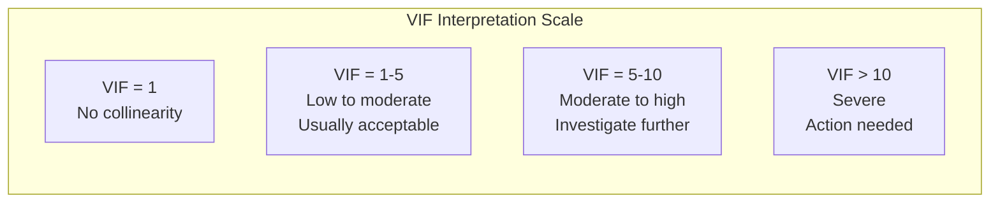
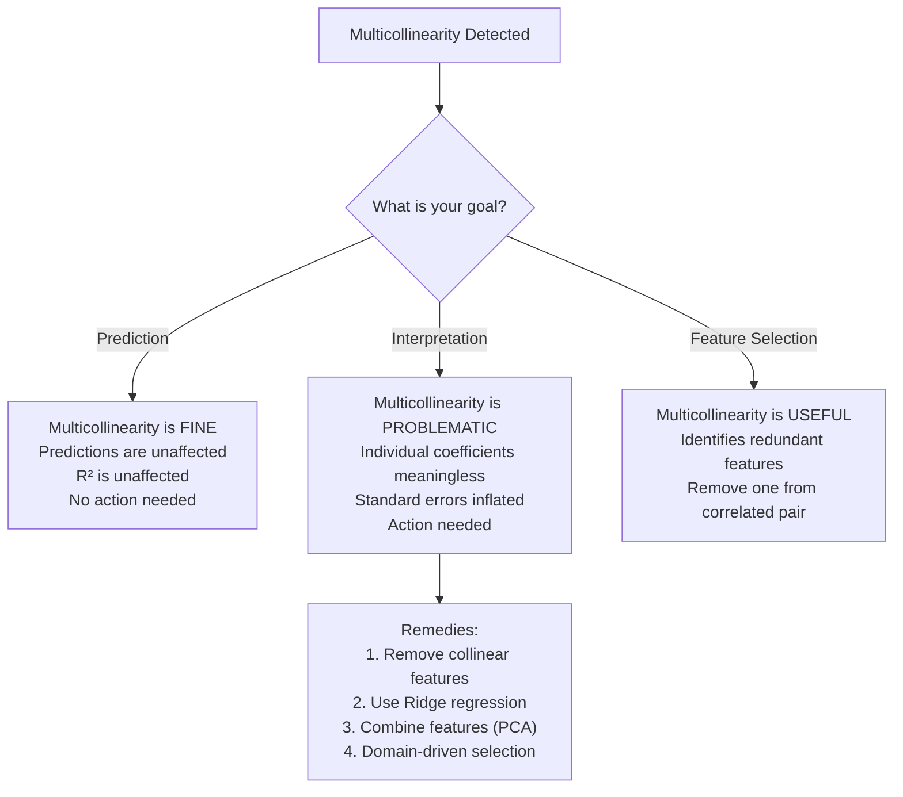

# Multicollinearity

Multicollinearity occurs when two or more predictor variables are highly correlated with each other. It does not affect prediction accuracy, but it destroys the interpretability of individual coefficients — a coefficient that should be positive flips negative, standard errors explode, and small data changes cause wild coefficient swings.

Understanding when multicollinearity matters — and when it does not — is one of the most important distinctions in applied statistics.

## The Dataset

We will generate a dataset with known multicollinearity to demonstrate detection and remediation.

```python
import numpy as np
import pandas as pd
import matplotlib.pyplot as plt
import seaborn as sns
from sklearn.linear_model import LinearRegression, Ridge, Lasso
from sklearn.preprocessing import StandardScaler
from sklearn.model_selection import cross_val_score
from scipy import stats

np.random.seed(42)
n = 1000

# Independent predictors
x1 = np.random.normal(50, 10, n)  # square footage
x2 = np.random.normal(3, 1, n)    # bedrooms

# Collinear predictors (derived from x1 with noise)
x3 = 0.95 * x1 + np.random.normal(0, 3, n)  # living area ≈ sq ft (r ≈ 0.95)
x4 = 0.80 * x1 + 0.60 * x2 + np.random.normal(0, 5, n)  # rooms ≈ combination

# Moderately correlated
x5 = 0.50 * x1 + np.random.normal(0, 8, n)  # lot size (r ≈ 0.5)

# Independent predictor
x6 = np.random.normal(20, 5, n)  # age of house

# True relationship
y = 2.0 * x1 + 5.0 * x2 + 1.0 * x6 + np.random.normal(0, 10, n)
# Note: x3, x4, x5 are NOT in the true model — they are just collinear with x1

df = pd.DataFrame({
    "sq_ft": x1, "bedrooms": x2, "living_area": x3,
    "total_rooms": x4, "lot_size": x5, "house_age": x6, "price": y,
})

feature_cols = ["sq_ft", "bedrooms", "living_area", "total_rooms", "lot_size", "house_age"]
X = df[feature_cols].values
y_vals = df["price"].values

print(df.describe().round(2))
```

## Detecting Multicollinearity

### 1. Correlation Matrix

The simplest check: pairwise correlations between all predictors.

```python
corr = df[feature_cols].corr()

fig, ax = plt.subplots(figsize=(10, 8))
mask = np.triu(np.ones_like(corr, dtype=bool), k=1)
sns.heatmap(corr, mask=mask, annot=True, fmt=".3f", cmap="RdBu_r",
            center=0, vmin=-1, vmax=1, square=True, ax=ax, linewidths=0.5)
ax.set_title("Feature Correlation Matrix", fontsize=14)
plt.tight_layout()
plt.savefig("multicollinearity_corr.png", dpi=150, bbox_inches="tight")
plt.show()

# Flag high correlations
print("\nHighly correlated pairs (|r| > 0.7):")
for i in range(len(corr)):
    for j in range(i + 1, len(corr)):
        r = corr.iloc[i, j]
        if abs(r) > 0.7:
            print(f"  {corr.index[i]:15s} ↔ {corr.columns[j]:15s}  r = {r:+.4f}")
```

::: warning Pairwise correlation misses multicollinearity
A variable can be perfectly predicted by a combination of other variables while having only moderate pairwise correlations with each. Example: x3 = x1 + x2, but corr(x3, x1) and corr(x3, x2) might each be only 0.7. VIF catches this; correlation matrices do not.
:::

### 2. Variance Inflation Factor (VIF)

VIF measures how much the variance of a regression coefficient is inflated due to collinearity. It regresses each feature against all others.

```python
from statsmodels.stats.outliers_influence import variance_inflation_factor

def compute_vif(df, feature_cols):
    """Compute VIF for each feature."""
    X_vif = df[feature_cols].values
    vif_data = pd.DataFrame()
    vif_data["feature"] = feature_cols
    vif_data["VIF"] = [variance_inflation_factor(X_vif, i) for i in range(X_vif.shape[1])]
    vif_data["tolerance"] = 1 / vif_data["VIF"]
    vif_data = vif_data.sort_values("VIF", ascending=False)

    print("Variance Inflation Factors:")
    print(vif_data.to_string(index=False))

    print("\nInterpretation:")
    for _, row in vif_data.iterrows():
        vif = row["VIF"]
        if vif > 10:
            print(f"  {row['feature']:15s}: VIF={vif:.1f} — SEVERE multicollinearity")
        elif vif > 5:
            print(f"  {row['feature']:15s}: VIF={vif:.1f} — Moderate multicollinearity")
        elif vif > 2.5:
            print(f"  {row['feature']:15s}: VIF={vif:.1f} — Mild (usually acceptable)")
        else:
            print(f"  {row['feature']:15s}: VIF={vif:.1f} — No concern")

    return vif_data

vif_results = compute_vif(df, feature_cols)
```

### VIF Interpretation



| VIF | Tolerance (1/VIF) | Interpretation |
|-----|-------------------|----------------|
| 1.0 | 1.00 | No collinearity |
| 2.5 | 0.40 | Mild — usually fine |
| 5.0 | 0.20 | Moderate — check coefficient stability |
| 10.0 | 0.10 | High — coefficients unreliable |
| 50+ | <0.02 | Severe — almost perfect linear dependence |

### 3. Condition Number

The condition number of the feature matrix measures overall multicollinearity (not per-feature). A high condition number means the matrix is near-singular.

```python
from numpy.linalg import cond

X_scaled = StandardScaler().fit_transform(df[feature_cols])
cn = cond(X_scaled)

print(f"Condition number: {cn:.1f}")
if cn < 30:
    print("  → No serious multicollinearity")
elif cn < 100:
    print("  → Moderate multicollinearity")
else:
    print("  → Severe multicollinearity — matrix is near-singular")
```

### 4. Eigenvalue Analysis

Small eigenvalues of the correlation matrix indicate near-linear dependence among features.

```python
from numpy.linalg import eigvals

eigenvalues = eigvals(corr.values)
eigenvalues = np.sort(eigenvalues)[::-1]

print("Eigenvalues of correlation matrix:")
for i, ev in enumerate(eigenvalues):
    ratio = eigenvalues[0] / ev if ev > 0 else float("inf")
    flag = " ← Near-zero (collinearity)" if ev < 0.1 else ""
    print(f"  λ{i+1} = {ev:.4f}  (condition index: {np.sqrt(ratio):.1f}){flag}")

fig, ax = plt.subplots(figsize=(8, 5))
ax.bar(range(1, len(eigenvalues) + 1), eigenvalues, color="steelblue", edgecolor="black")
ax.axhline(0.1, color="red", linestyle="--", label="Near-zero threshold")
ax.set_xlabel("Component")
ax.set_ylabel("Eigenvalue")
ax.set_title("Eigenvalues of Correlation Matrix", fontsize=14)
ax.legend()
plt.tight_layout()
plt.savefig("eigenvalues.png", dpi=150, bbox_inches="tight")
plt.show()
```

## The Real Impact: Coefficient Instability

```python
# Show how multicollinearity makes coefficients unstable
from sklearn.utils import resample

n_bootstraps = 200
coef_samples = []

for i in range(n_bootstraps):
    X_boot, y_boot = resample(X, y_vals, random_state=i)
    lr = LinearRegression()
    lr.fit(X_boot, y_boot)
    coef_samples.append(lr.coef_)

coef_df = pd.DataFrame(coef_samples, columns=feature_cols)

fig, ax = plt.subplots(figsize=(12, 6))
coef_df.boxplot(ax=ax, vert=True)
ax.axhline(0, color="gray", linewidth=0.5)
ax.set_title("Coefficient Instability from Bootstrapping\n(Multicollinear features have wide boxes)", fontsize=14)
ax.set_ylabel("Coefficient Value")
plt.tight_layout()
plt.savefig("coefficient_instability.png", dpi=150, bbox_inches="tight")
plt.show()

print("Coefficient statistics across 200 bootstrap samples:")
print(coef_df.describe().round(3))
print(f"\nTrue coefficients: sq_ft=2.0, bedrooms=5.0, house_age=1.0, others=0.0")
print(f"Note: sq_ft and living_area swap magnitude because they are collinear")
```

## When Multicollinearity Matters (and When It Doesn't)



## Remedies

### Remedy 1: Drop Collinear Features (Iterative VIF)

```python
def iterative_vif_elimination(df, feature_cols, vif_threshold=5.0):
    """Iteratively remove the feature with highest VIF until all are below threshold."""
    remaining = list(feature_cols)
    dropped = []

    while True:
        X_vif = df[remaining].values
        vifs = [variance_inflation_factor(X_vif, i) for i in range(X_vif.shape[1])]
        max_vif = max(vifs)

        if max_vif <= vif_threshold:
            break

        max_idx = vifs.index(max_vif)
        dropped_feature = remaining.pop(max_idx)
        dropped.append((dropped_feature, max_vif))
        print(f"  Dropped {dropped_feature} (VIF = {max_vif:.1f})")

    print(f"\nRemaining features ({len(remaining)}):")
    final_vifs = [variance_inflation_factor(df[remaining].values, i) for i in range(len(remaining))]
    for feat, vif in zip(remaining, final_vifs):
        print(f"  {feat:15s}: VIF = {vif:.2f}")

    return remaining, dropped

remaining, dropped = iterative_vif_elimination(df, feature_cols, vif_threshold=5.0)
```

### Remedy 2: Ridge Regression (Regularization)

Ridge adds a penalty that shrinks coefficients, stabilizing them under multicollinearity.

```python
from sklearn.linear_model import Ridge, RidgeCV

# Compare OLS vs Ridge
ols = LinearRegression()
ols.fit(X, y_vals)

alphas = [0.01, 0.1, 1.0, 10.0, 100.0]
ridge_cv = RidgeCV(alphas=alphas, cv=5)
ridge_cv.fit(X, y_vals)

print(f"Best Ridge alpha: {ridge_cv.alpha_}")
print(f"\n{'Feature':>15s}  {'OLS':>10s}  {'Ridge':>10s}  {'True':>8s}")
print("-" * 48)
true_coefs = [2.0, 5.0, 0.0, 0.0, 0.0, 1.0]
for feat, ols_c, ridge_c, true_c in zip(feature_cols, ols.coef_, ridge_cv.coef_, true_coefs):
    print(f"{feat:>15s}  {ols_c:>10.3f}  {ridge_c:>10.3f}  {true_c:>8.1f}")

# Prediction comparison
ols_r2 = cross_val_score(LinearRegression(), X, y_vals, cv=5, scoring="r2").mean()
ridge_r2 = cross_val_score(Ridge(alpha=ridge_cv.alpha_), X, y_vals, cv=5, scoring="r2").mean()
print(f"\nOLS R²:   {ols_r2:.4f}")
print(f"Ridge R²: {ridge_r2:.4f}")
print(f"Note: Similar R² but Ridge has MUCH more stable coefficients")
```

### Remedy 3: PCA (Combine Collinear Features)

```python
from sklearn.decomposition import PCA

pca = PCA()
X_pca = pca.fit_transform(StandardScaler().fit_transform(X))

print("PCA component explained variance:")
for i, (var, cumvar) in enumerate(zip(pca.explained_variance_ratio_,
                                       np.cumsum(pca.explained_variance_ratio_))):
    print(f"  PC{i+1}: {var:.3f} (cumulative: {cumvar:.3f})")

# Keep components explaining 95% variance
n_components = np.argmax(np.cumsum(pca.explained_variance_ratio_) >= 0.95) + 1
print(f"\nKeeping {n_components} components (from {len(feature_cols)} features)")

X_pca_reduced = X_pca[:, :n_components]
pca_r2 = cross_val_score(LinearRegression(), X_pca_reduced, y_vals, cv=5, scoring="r2").mean()
print(f"PCA ({n_components} components) R²: {pca_r2:.4f}")
```

### Remedy 4: Domain-Driven Feature Selection

```python
# Use domain knowledge to pick the best feature from each correlated group
# Group 1: sq_ft, living_area → keep sq_ft (more interpretable)
# Group 2: total_rooms → has info from both sq_ft and bedrooms, drop it
# Group 3: lot_size → moderate correlation with sq_ft, keep if meaningful

domain_features = ["sq_ft", "bedrooms", "lot_size", "house_age"]
domain_r2 = cross_val_score(LinearRegression(),
                              df[domain_features].values, y_vals,
                              cv=5, scoring="r2").mean()
print(f"Domain-selected features ({domain_features}): R² = {domain_r2:.4f}")

# Check VIF of selected features
compute_vif(df, domain_features)
```

## Comprehensive Detection Report

```python
def multicollinearity_report(df, feature_cols):
    """Generate a complete multicollinearity diagnostic report."""
    print(f"\n{'='*70}")
    print(f"  MULTICOLLINEARITY DIAGNOSTIC REPORT")
    print(f"  Features: {len(feature_cols)}")
    print(f"{'='*70}")

    # 1. Correlation matrix
    corr = df[feature_cols].corr()
    high_corr = []
    for i in range(len(corr)):
        for j in range(i + 1, len(corr)):
            r = corr.iloc[i, j]
            if abs(r) > 0.7:
                high_corr.append((corr.index[i], corr.columns[j], r))

    print(f"\n1. High pairwise correlations (|r| > 0.7): {len(high_corr)}")
    for f1, f2, r in sorted(high_corr, key=lambda x: abs(x[2]), reverse=True):
        print(f"   {f1} ↔ {f2}: r = {r:+.4f}")

    # 2. VIF
    X_vif = df[feature_cols].values
    vifs = [variance_inflation_factor(X_vif, i) for i in range(X_vif.shape[1])]
    vif_df = pd.DataFrame({"feature": feature_cols, "VIF": vifs}).sort_values("VIF", ascending=False)

    print(f"\n2. Variance Inflation Factors:")
    severe = 0
    for _, row in vif_df.iterrows():
        flag = "!!!" if row["VIF"] > 10 else "!" if row["VIF"] > 5 else ""
        print(f"   {row['feature']:15s}: {row['VIF']:>8.2f}  {flag}")
        if row["VIF"] > 10:
            severe += 1

    # 3. Condition number
    X_scaled = StandardScaler().fit_transform(df[feature_cols])
    cn = np.linalg.cond(X_scaled)
    print(f"\n3. Condition number: {cn:.1f}", end="")
    if cn > 100:
        print(" (SEVERE)")
    elif cn > 30:
        print(" (Moderate)")
    else:
        print(" (OK)")

    # 4. Recommendation
    print(f"\n4. RECOMMENDATION:")
    if severe > 0:
        print(f"   {severe} features have severe multicollinearity (VIF > 10).")
        print(f"   If goal is INTERPRETATION: remove collinear features or use Ridge.")
        print(f"   If goal is PREDICTION: no action needed.")
    else:
        print(f"   No severe multicollinearity detected. All VIFs < 10.")

multicollinearity_report(df, feature_cols)
```

## Key Takeaways

- Multicollinearity inflates coefficient standard errors and makes individual coefficients uninterpretable. It does NOT affect overall prediction accuracy.
- VIF is the best single diagnostic. VIF > 10 indicates a serious problem; VIF > 5 warrants investigation.
- Pairwise correlations miss multicollinearity from linear combinations. Always use VIF alongside correlation matrices.
- If your goal is prediction, you can often ignore multicollinearity entirely. If your goal is interpretation, you must address it.
- Ridge regression is the easiest fix: it stabilizes coefficients without dropping features.
- Iterative VIF elimination systematically removes the most collinear feature until all VIFs are below a threshold.
- PCA eliminates multicollinearity by construction but sacrifices interpretability.
- Domain knowledge should guide which feature to keep from a correlated group — statistical criteria alone are insufficient.
