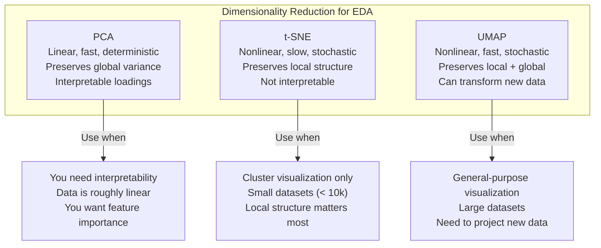
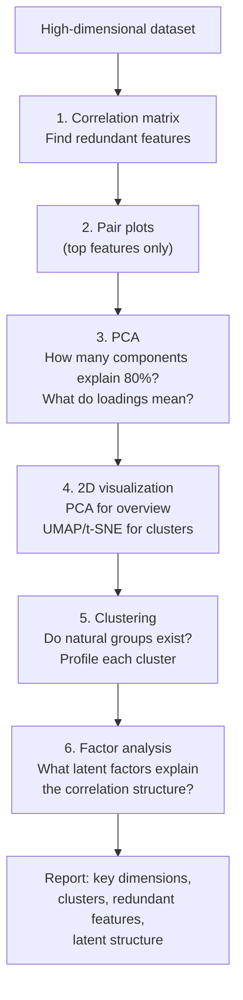

# Multivariate Analysis

Real datasets have dozens to thousands of features. You cannot scatter-plot every pair. You need tools that reveal structure in high-dimensional space: which features move together, whether natural clusters exist, and how to reduce dimensions for visualization without losing the story.

This page covers correlation matrices, pair plots, PCA, t-SNE, UMAP, clustering as exploration, and factor analysis — with real code and real data.

## The Dataset

We will use a synthetic but realistic customer behavior dataset with 12 numerical features and known latent structure.

```python
import numpy as np
import pandas as pd
import matplotlib.pyplot as plt
import seaborn as sns
from scipy import stats
from sklearn.preprocessing import StandardScaler
from sklearn.decomposition import PCA
from sklearn.manifold import TSNE
from sklearn.cluster import KMeans, DBSCAN

np.random.seed(42)
n = 2000

# Latent segments: 4 customer types
segments = np.random.choice(["Power User", "Casual", "Bargain Hunter", "New User"],
                             size=n, p=[0.20, 0.35, 0.25, 0.20])

# Generate features that depend on segment
data = {}
segment_params = {
    "Power User":     {"sessions": (50, 15), "duration": (25, 8), "pages": (40, 12),
                       "purchases": (8, 3), "spend": (200, 60), "reviews": (5, 2),
                       "referrals": (3, 1.5), "support_tickets": (1, 0.8),
                       "days_since_last": (2, 1), "cart_abandons": (2, 1),
                       "wishlist_items": (15, 5), "account_age_days": (800, 200)},
    "Casual":         {"sessions": (10, 5), "duration": (8, 4), "pages": (12, 6),
                       "purchases": (2, 1), "spend": (50, 25), "reviews": (0.5, 0.5),
                       "referrals": (0.3, 0.3), "support_tickets": (0.5, 0.5),
                       "days_since_last": (15, 10), "cart_abandons": (3, 2),
                       "wishlist_items": (3, 2), "account_age_days": (400, 200)},
    "Bargain Hunter": {"sessions": (30, 10), "duration": (15, 5), "pages": (35, 10),
                       "purchases": (5, 2), "spend": (80, 30), "reviews": (2, 1.5),
                       "referrals": (1, 1), "support_tickets": (3, 2),
                       "days_since_last": (5, 3), "cart_abandons": (8, 3),
                       "wishlist_items": (25, 8), "account_age_days": (500, 200)},
    "New User":       {"sessions": (3, 2), "duration": (5, 3), "pages": (5, 3),
                       "purchases": (0.5, 0.5), "spend": (20, 15), "reviews": (0.1, 0.2),
                       "referrals": (0.1, 0.1), "support_tickets": (0.3, 0.3),
                       "days_since_last": (3, 2), "cart_abandons": (1, 1),
                       "wishlist_items": (1, 1), "account_age_days": (30, 20)},
}

for feature in segment_params["Power User"].keys():
    values = np.zeros(n)
    for i, seg in enumerate(segments):
        mean, std = segment_params[seg][feature]
        values[i] = np.random.normal(mean, std)
    data[feature] = np.clip(values, 0, None)

df = pd.DataFrame(data)
df["segment"] = segments  # We will use this as ground truth, not a feature

feature_cols = [c for c in df.columns if c != "segment"]
print(f"Shape: {df.shape}")
print(f"Features: {len(feature_cols)}")
print(df[feature_cols].describe().round(2))
```

## Correlation Matrices

With 12 features, there are 66 pairwise correlations. A correlation matrix shows them all at once.

```python
# Compute correlation matrix
corr = df[feature_cols].corr()

fig, axes = plt.subplots(1, 2, figsize=(20, 8))

# Full heatmap
mask = np.triu(np.ones_like(corr, dtype=bool), k=1)
sns.heatmap(corr, mask=mask, annot=True, fmt=".2f", cmap="RdBu_r",
            center=0, vmin=-1, vmax=1, square=True, ax=axes[0],
            linewidths=0.5, cbar_kws={"shrink": 0.8})
axes[0].set_title("Pearson Correlation Matrix", fontsize=14)

# Clustered heatmap (reorder by similarity)
from scipy.cluster.hierarchy import linkage, dendrogram
from scipy.spatial.distance import squareform

# Convert correlation to distance
dist = 1 - np.abs(corr.values)
np.fill_diagonal(dist, 0)
condensed = squareform(dist)
link = linkage(condensed, method="ward")
dendro = dendrogram(link, no_plot=True)
reorder = dendro["leaves"]

corr_reordered = corr.iloc[reorder, reorder]
mask_reordered = np.triu(np.ones_like(corr_reordered, dtype=bool), k=1)
sns.heatmap(corr_reordered, mask=mask_reordered, annot=True, fmt=".2f",
            cmap="RdBu_r", center=0, vmin=-1, vmax=1, square=True,
            ax=axes[1], linewidths=0.5, cbar_kws={"shrink": 0.8})
axes[1].set_title("Clustered Correlation Matrix", fontsize=14)

plt.tight_layout()
plt.savefig("correlation_matrix.png", dpi=150, bbox_inches="tight")
plt.show()

# Identify strong correlations
strong = []
for i in range(len(corr)):
    for j in range(i + 1, len(corr)):
        r = corr.iloc[i, j]
        if abs(r) > 0.6:
            strong.append((corr.index[i], corr.columns[j], r))

strong.sort(key=lambda x: abs(x[2]), reverse=True)
print("\nStrongly correlated pairs (|r| > 0.6):")
for f1, f2, r in strong:
    print(f"  {f1:25s} ↔ {f2:25s}  r = {r:+.3f}")
```

## Pair Plots (Scatterplot Matrix)

Pair plots show every pairwise scatter plot. With many features, subset to the most important ones.

```python
# Pair plot of top 5 most variable features + segment coloring
top_features = df[feature_cols].std().nlargest(5).index.tolist()

g = sns.pairplot(df[top_features + ["segment"]], hue="segment",
                  plot_kws={"alpha": 0.3, "s": 10},
                  diag_kind="kde", palette="Set2",
                  height=2.5, aspect=1)
g.fig.suptitle("Pair Plot (Top 5 Features by Variance)", y=1.02, fontsize=16)
plt.tight_layout()
plt.savefig("pairplot.png", dpi=150, bbox_inches="tight")
plt.show()
```

## PCA (Principal Component Analysis)

PCA finds the directions of maximum variance and projects your data onto them. It is the workhorse of linear dimensionality reduction.

```python
# Standardize first (PCA is scale-sensitive)
scaler = StandardScaler()
X_scaled = scaler.fit_transform(df[feature_cols])

# Fit PCA
pca = PCA()
X_pca = pca.fit_transform(X_scaled)

# Explained variance
fig, axes = plt.subplots(1, 2, figsize=(16, 6))

# Scree plot
axes[0].bar(range(1, len(feature_cols) + 1), pca.explained_variance_ratio_ * 100,
            color="steelblue", edgecolor="black")
axes[0].plot(range(1, len(feature_cols) + 1),
             np.cumsum(pca.explained_variance_ratio_) * 100,
             "ro-", linewidth=2, label="Cumulative")
axes[0].axhline(80, color="gray", linestyle="--", alpha=0.5, label="80% threshold")
axes[0].set_xlabel("Principal Component")
axes[0].set_ylabel("Variance Explained (%)")
axes[0].set_title("Scree Plot", fontsize=14)
axes[0].legend()

# How many components for 80% variance?
cumvar = np.cumsum(pca.explained_variance_ratio_)
n_80 = np.argmax(cumvar >= 0.80) + 1
print(f"Components for 80% variance: {n_80}")
print(f"Components for 90% variance: {np.argmax(cumvar >= 0.90) + 1}")
print(f"Components for 95% variance: {np.argmax(cumvar >= 0.95) + 1}")

# 2D projection colored by segment
colors = {"Power User": "#e74c3c", "Casual": "#3498db",
          "Bargain Hunter": "#2ecc71", "New User": "#f39c12"}
for seg in df["segment"].unique():
    mask = df["segment"] == seg
    axes[1].scatter(X_pca[mask, 0], X_pca[mask, 1], alpha=0.4, s=15,
                    c=colors[seg], label=seg)
axes[1].set_xlabel(f"PC1 ({pca.explained_variance_ratio_[0]*100:.1f}%)")
axes[1].set_ylabel(f"PC2 ({pca.explained_variance_ratio_[1]*100:.1f}%)")
axes[1].set_title("PCA Projection (First 2 Components)", fontsize=14)
axes[1].legend()

plt.tight_layout()
plt.savefig("pca.png", dpi=150, bbox_inches="tight")
plt.show()
```

### PCA Loadings: What Each Component Means

```python
loadings = pd.DataFrame(
    pca.components_[:4].T,
    columns=[f"PC{i+1}" for i in range(4)],
    index=feature_cols,
)

fig, axes = plt.subplots(1, 4, figsize=(20, 5))
for i in range(4):
    col = f"PC{i+1}"
    sorted_loadings = loadings[col].sort_values()
    colors = ["#e74c3c" if v < 0 else "#2ecc71" for v in sorted_loadings]
    axes[i].barh(sorted_loadings.index, sorted_loadings.values, color=colors, edgecolor="black")
    axes[i].set_title(f"PC{i+1} Loadings ({pca.explained_variance_ratio_[i]*100:.1f}%)", fontsize=11)
    axes[i].axvline(0, color="black", linewidth=0.5)

plt.suptitle("PCA Component Loadings — What Drives Each Component", fontsize=16, fontweight="bold")
plt.tight_layout()
plt.savefig("pca_loadings.png", dpi=150, bbox_inches="tight")
plt.show()

print("\nTop loadings per component:")
for i in range(4):
    col = f"PC{i+1}"
    top = loadings[col].abs().nlargest(3)
    features_str = ", ".join([f"{idx} ({loadings.loc[idx, col]:+.3f})" for idx in top.index])
    print(f"  {col}: {features_str}")
```

## t-SNE: Nonlinear Dimensionality Reduction

t-SNE excels at revealing clusters and local structure that PCA misses, but it has important caveats.

```python
# t-SNE with different perplexity values
fig, axes = plt.subplots(1, 3, figsize=(18, 5))
perplexities = [5, 30, 100]

for ax, perp in zip(axes, perplexities):
    tsne = TSNE(n_components=2, perplexity=perp, random_state=42,
                n_iter=1000, learning_rate="auto", init="pca")
    X_tsne = tsne.fit_transform(X_scaled)

    for seg in df["segment"].unique():
        mask = df["segment"] == seg
        ax.scatter(X_tsne[mask, 0], X_tsne[mask, 1], alpha=0.4, s=10,
                   c=colors[seg], label=seg)
    ax.set_title(f"t-SNE (perplexity={perp})", fontsize=12)
    ax.legend(fontsize=8, markerscale=2)
    ax.set_xticks([])
    ax.set_yticks([])

plt.suptitle("t-SNE: Perplexity Controls Neighborhood Size", fontsize=16, fontweight="bold")
plt.tight_layout()
plt.savefig("tsne.png", dpi=150, bbox_inches="tight")
plt.show()
```

::: danger t-SNE caveats
1. **Distances between clusters are meaningless.** Two far-apart clusters in t-SNE may actually be close in the original space.
2. **Cluster sizes are meaningless.** t-SNE can expand dense clusters and compress sparse ones.
3. **Perplexity changes everything.** Always try multiple values (5, 30, 50, 100).
4. **Not deterministic** unless you set a random seed. Different runs give different layouts.
5. **Cannot project new points.** t-SNE has no `transform()` method — it must be refit from scratch.
:::

## UMAP: The Modern Alternative

UMAP preserves both local and global structure better than t-SNE, runs faster, and supports projecting new points.

```python
try:
    from umap import UMAP as UMAPReducer

    fig, axes = plt.subplots(1, 3, figsize=(18, 5))
    n_neighbors_list = [5, 15, 50]

    for ax, nn in zip(axes, n_neighbors_list):
        reducer = UMAPReducer(n_components=2, n_neighbors=nn, min_dist=0.1, random_state=42)
        X_umap = reducer.fit_transform(X_scaled)

        for seg in df["segment"].unique():
            mask = df["segment"] == seg
            ax.scatter(X_umap[mask, 0], X_umap[mask, 1], alpha=0.4, s=10,
                       c=colors[seg], label=seg)
        ax.set_title(f"UMAP (n_neighbors={nn})", fontsize=12)
        ax.legend(fontsize=8, markerscale=2)

    plt.suptitle("UMAP: n_neighbors Controls Local vs Global Balance", fontsize=16, fontweight="bold")
    plt.tight_layout()
    plt.savefig("umap.png", dpi=150, bbox_inches="tight")
    plt.show()

except ImportError:
    print("UMAP not installed. Install with: pip install umap-learn")
```

### Dimensionality Reduction Comparison



## Clustering as Exploration

Clustering during EDA is not about finding the "right" clusters — it is about discovering structure you did not know existed.

```python
from sklearn.metrics import silhouette_score, calinski_harabasz_score

# Method 1: K-Means with elbow and silhouette
k_range = range(2, 10)
inertias = []
silhouettes = []
ch_scores = []

for k in k_range:
    km = KMeans(n_clusters=k, random_state=42, n_init=10)
    labels = km.fit_predict(X_scaled)
    inertias.append(km.inertia_)
    silhouettes.append(silhouette_score(X_scaled, labels))
    ch_scores.append(calinski_harabasz_score(X_scaled, labels))

fig, axes = plt.subplots(1, 3, figsize=(18, 5))

axes[0].plot(k_range, inertias, "bo-", linewidth=2)
axes[0].set_xlabel("Number of Clusters (k)")
axes[0].set_ylabel("Inertia (Within-cluster SS)")
axes[0].set_title("Elbow Method", fontsize=12)

axes[1].plot(k_range, silhouettes, "ro-", linewidth=2)
axes[1].set_xlabel("Number of Clusters (k)")
axes[1].set_ylabel("Silhouette Score")
axes[1].set_title("Silhouette Score", fontsize=12)

axes[2].plot(k_range, ch_scores, "go-", linewidth=2)
axes[2].set_xlabel("Number of Clusters (k)")
axes[2].set_ylabel("Calinski-Harabasz Score")
axes[2].set_title("Calinski-Harabasz Score", fontsize=12)

plt.suptitle("Cluster Selection Metrics", fontsize=16, fontweight="bold")
plt.tight_layout()
plt.savefig("cluster_selection.png", dpi=150, bbox_inches="tight")
plt.show()

# Fit with best k and profile clusters
best_k = 4
km = KMeans(n_clusters=best_k, random_state=42, n_init=10)
df["cluster"] = km.fit_predict(X_scaled)

# Cluster profiles
cluster_profiles = df.groupby("cluster")[feature_cols].mean()
print("\nCluster Profiles (means):")
print(cluster_profiles.round(1).to_string())

# Compare with ground truth segments
confusion = pd.crosstab(df["segment"], df["cluster"])
print("\nClusters vs True Segments:")
print(confusion)
```

## Factor Analysis

Factor analysis assumes observed variables are caused by fewer latent factors. Unlike PCA (which finds directions of variance), factor analysis explicitly models this causal structure.

```python
from sklearn.decomposition import FactorAnalysis

# Determine number of factors (parallel analysis)
n_factors_range = range(1, 8)
fa_scores = []

for nf in n_factors_range:
    fa = FactorAnalysis(n_components=nf, random_state=42)
    fa.fit(X_scaled)
    ll = fa.score(X_scaled)
    fa_scores.append(ll)

fig, ax = plt.subplots(figsize=(10, 5))
ax.plot(n_factors_range, fa_scores, "bo-", linewidth=2)
ax.set_xlabel("Number of Factors")
ax.set_ylabel("Log-Likelihood")
ax.set_title("Factor Analysis: Choosing Number of Factors", fontsize=14)
plt.tight_layout()
plt.savefig("factor_analysis_selection.png", dpi=150, bbox_inches="tight")
plt.show()

# Fit with 4 factors
fa = FactorAnalysis(n_components=4, random_state=42)
fa.fit(X_scaled)

# Factor loadings
loadings_fa = pd.DataFrame(
    fa.components_.T,
    columns=[f"Factor{i+1}" for i in range(4)],
    index=feature_cols,
)

print("\nFactor Loadings:")
print(loadings_fa.round(3).to_string())

# Visualize loadings
fig, ax = plt.subplots(figsize=(12, 8))
sns.heatmap(loadings_fa, annot=True, fmt=".2f", cmap="RdBu_r",
            center=0, ax=ax, linewidths=0.5)
ax.set_title("Factor Loadings", fontsize=14)
plt.tight_layout()
plt.savefig("factor_loadings.png", dpi=150, bbox_inches="tight")
plt.show()
```

## EDA Pipeline for Multivariate Data



## Key Takeaways

- Start with the correlation matrix, but cluster it hierarchically to reveal groups of related features.
- Pair plots only work for 5-7 features. Select features by variance, importance, or domain knowledge.
- PCA is your default dimensionality reduction. The scree plot tells you intrinsic dimensionality; loadings tell you what each component means.
- Use t-SNE or UMAP for cluster visualization, but never interpret distances or cluster sizes literally.
- UMAP is generally preferred over t-SNE: it is faster, preserves more global structure, and supports transforming new points.
- Clustering during EDA is exploratory. Use silhouette scores and cluster profiles to validate, but do not over-interpret.
- Factor analysis is complementary to PCA. Use it when you believe latent factors cause the observed correlations.

## Try It Yourself

**Exercise 1:** You have a dataset with 20 numerical features and 5,000 samples. Build a correlation matrix, identify pairs with |r| > 0.8, and create a clustered heatmap that groups correlated features together. Recommend which features could be dropped due to redundancy.

::: details Solution
```python
import numpy as np
import pandas as pd
import seaborn as sns
import matplotlib.pyplot as plt
from scipy.cluster.hierarchy import linkage, dendrogram
from scipy.spatial.distance import squareform

# Correlation matrix
corr = df[feature_cols].corr()

# Find strongly correlated pairs
strong_pairs = []
for i in range(len(corr)):
    for j in range(i + 1, len(corr)):
        r = corr.iloc[i, j]
        if abs(r) > 0.8:
            strong_pairs.append((corr.index[i], corr.columns[j], r))

strong_pairs.sort(key=lambda x: abs(x[2]), reverse=True)
print("Strongly correlated pairs (|r| > 0.8):")
for f1, f2, r in strong_pairs:
    print(f"  {f1} <-> {f2}: r={r:+.3f}")

# Clustered heatmap
dist = 1 - np.abs(corr.values)
np.fill_diagonal(dist, 0)
condensed = squareform(dist)
link = linkage(condensed, method='ward')
dendro = dendrogram(link, no_plot=True)
reorder = dendro['leaves']

corr_reordered = corr.iloc[reorder, reorder]
fig, ax = plt.subplots(figsize=(12, 10))
mask = np.triu(np.ones_like(corr_reordered, dtype=bool), k=1)
sns.heatmap(corr_reordered, mask=mask, annot=True, fmt='.2f',
            cmap='RdBu_r', center=0, ax=ax, linewidths=0.5)
ax.set_title('Clustered Correlation Matrix')
plt.tight_layout()
plt.show()

# Redundancy recommendation
print("\nRedundancy recommendations:")
for f1, f2, r in strong_pairs:
    print(f"  Drop one of: {f1} or {f2} (r={r:+.3f})")
    print(f"    Keep the one with higher variance or domain importance")
```
:::

**Exercise 2:** Perform PCA on a dataset with 15 features. Determine how many components explain 90% of variance, visualize the first two components colored by a known label, and interpret the loadings of the first component to explain what it represents.

::: details Solution
```python
import numpy as np
import pandas as pd
import matplotlib.pyplot as plt
from sklearn.preprocessing import StandardScaler
from sklearn.decomposition import PCA

# Standardize (PCA is scale-sensitive)
scaler = StandardScaler()
X_scaled = scaler.fit_transform(df[feature_cols])

# Fit PCA
pca = PCA()
X_pca = pca.fit_transform(X_scaled)

# Variance explained
cumvar = np.cumsum(pca.explained_variance_ratio_)
n_90 = np.argmax(cumvar >= 0.90) + 1
print(f"Components for 90% variance: {n_90} (out of {len(feature_cols)})")

# Scree plot
fig, axes = plt.subplots(1, 2, figsize=(16, 6))
axes[0].bar(range(1, len(feature_cols) + 1), pca.explained_variance_ratio_ * 100,
            color='steelblue', edgecolor='black')
axes[0].plot(range(1, len(feature_cols) + 1), cumvar * 100, 'ro-')
axes[0].axhline(90, color='gray', linestyle='--', label='90%')
axes[0].set_xlabel('Component')
axes[0].set_ylabel('Variance Explained (%)')
axes[0].set_title('Scree Plot')
axes[0].legend()

# 2D projection colored by label
for label in df['category'].unique():
    mask = df['category'] == label
    axes[1].scatter(X_pca[mask, 0], X_pca[mask, 1], alpha=0.4, s=15, label=label)
axes[1].set_xlabel(f'PC1 ({pca.explained_variance_ratio_[0]*100:.1f}%)')
axes[1].set_ylabel(f'PC2 ({pca.explained_variance_ratio_[1]*100:.1f}%)')
axes[1].set_title('PCA 2D Projection')
axes[1].legend()
plt.tight_layout()
plt.show()

# Interpret PC1 loadings
loadings_pc1 = pd.Series(pca.components_[0], index=feature_cols)
print(f"\nPC1 loadings (top contributors):")
for feat in loadings_pc1.abs().nlargest(5).index:
    print(f"  {feat}: {loadings_pc1[feat]:+.3f}")
print(f"\nPC1 represents: [interpret based on which features load highest]")
```
:::

**Exercise 3:** Use K-Means clustering (k=2 to 8) on a standardized dataset to find the optimal number of clusters. Use the silhouette score to choose k, then profile each cluster by computing the mean of each feature. Visualize the clusters using the first 2 PCA components.

::: details Solution
```python
import numpy as np
import pandas as pd
import matplotlib.pyplot as plt
from sklearn.preprocessing import StandardScaler
from sklearn.cluster import KMeans
from sklearn.metrics import silhouette_score
from sklearn.decomposition import PCA

X_scaled = StandardScaler().fit_transform(df[feature_cols])

# Find optimal k using silhouette score
k_range = range(2, 9)
silhouettes = []
for k in k_range:
    km = KMeans(n_clusters=k, random_state=42, n_init=10)
    labels = km.fit_predict(X_scaled)
    sil = silhouette_score(X_scaled, labels)
    silhouettes.append(sil)
    print(f"k={k}: silhouette={sil:.4f}")

best_k = list(k_range)[np.argmax(silhouettes)]
print(f"\nBest k = {best_k} (silhouette = {max(silhouettes):.4f})")

# Fit with best k
km = KMeans(n_clusters=best_k, random_state=42, n_init=10)
df['cluster'] = km.fit_predict(X_scaled)

# Profile clusters
print(f"\nCluster profiles (means):")
profiles = df.groupby('cluster')[feature_cols].mean()
print(profiles.round(2).to_string())

# Visualize on PCA
pca = PCA(n_components=2)
X_2d = pca.fit_transform(X_scaled)

fig, ax = plt.subplots(figsize=(10, 7))
for c in range(best_k):
    mask = df['cluster'] == c
    ax.scatter(X_2d[mask, 0], X_2d[mask, 1], alpha=0.4, s=15, label=f'Cluster {c}')
ax.set_xlabel(f'PC1 ({pca.explained_variance_ratio_[0]*100:.1f}%)')
ax.set_ylabel(f'PC2 ({pca.explained_variance_ratio_[1]*100:.1f}%)')
ax.set_title(f'K-Means Clusters (k={best_k}) on PCA')
ax.legend()
plt.tight_layout()
plt.show()
```
:::

## Quick Quiz

**1. Why must you standardize features before running PCA?**
- a) PCA requires all values to be positive
- b) PCA maximizes variance; without scaling, high-magnitude features dominate the components
- c) Standardization makes the data normally distributed

::: details Answer
**b) PCA maximizes variance; without scaling, high-magnitude features dominate the components.** A salary column ranging from 30,000-300,000 has far more variance than an age column ranging from 18-70. Without standardization, PCA would assign almost all importance to salary simply because of its larger scale, not because it carries more information.
:::

**2. What is the most important limitation of t-SNE that does NOT apply to UMAP?**
- a) t-SNE requires GPU acceleration
- b) t-SNE cannot project new, unseen data points (no `transform()` method)
- c) t-SNE only works with numerical data

::: details Answer
**b) t-SNE cannot project new, unseen data points (no `transform()` method).** t-SNE must refit from scratch when new data arrives, making it impractical for production pipelines. UMAP, by contrast, has a `transform()` method that can project new points using the learned embedding. UMAP is also faster and preserves more global structure.
:::

**3. A scree plot shows that the first 3 components explain 85% of variance in a 20-feature dataset. What does this tell you?**
- a) You should drop 17 features
- b) The data has approximately 3 intrinsic dimensions; most features are redundant or correlated
- c) The first 3 features are the most important

::: details Answer
**b) The data has approximately 3 intrinsic dimensions; most features are redundant or correlated.** The scree plot reveals that 20 features can be compressed to 3 components with only 15% information loss. This means most features share information (are correlated). Note: PCA components are not individual features -- they are linear combinations of all features.
:::

**4. In a clustered correlation heatmap, you see a block of 5 features that are all correlated with r > 0.7 with each other. What should you consider?**
- a) These features are all incorrect and should be removed
- b) They likely measure the same underlying construct; keep one or create a composite (PCA component)
- c) They should all be included as-is for maximum model accuracy

::: details Answer
**b) They likely measure the same underlying construct; keep one or create a composite (PCA component).** A block of highly correlated features indicates they are measuring the same latent variable. Including all of them adds noise, multicollinearity, and computational cost without adding much information. Keep the most interpretable one, or use PCA to create a single composite feature from the group.
:::

**5. K-Means gives you 4 clusters with silhouette score 0.65 and 6 clusters with silhouette score 0.42. Which should you choose?**
- a) 6 clusters, because more clusters always give better results
- b) 4 clusters, because the higher silhouette score indicates better-separated, more cohesive clusters
- c) The average of the two: 5 clusters

::: details Answer
**b) 4 clusters, because the higher silhouette score indicates better-separated, more cohesive clusters.** The silhouette score measures how similar points are to their own cluster compared to neighboring clusters (range: -1 to 1). A score of 0.65 means clusters are well-defined, while 0.42 indicates substantial overlap. More clusters is not always better -- it can split natural groups into meaningless fragments.
:::
