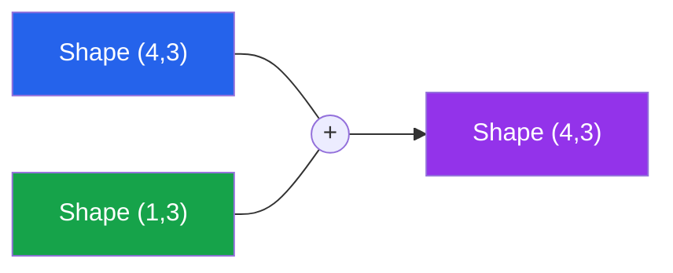
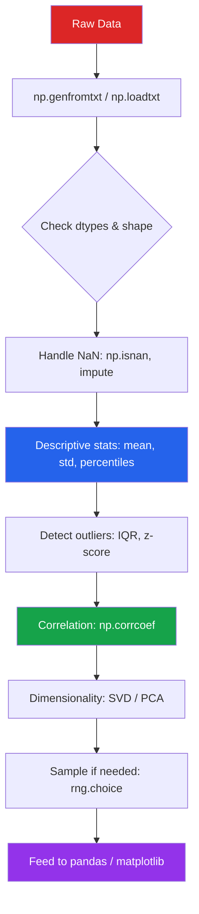

# NumPy for EDA

NumPy is the foundation of the entire Python data science stack. Every pandas DataFrame, every Matplotlib plot, and every scikit-learn model relies on NumPy arrays under the hood. Mastering NumPy means writing EDA code that is 10-100x faster than pure Python loops.

---

## Array Fundamentals

### Creating Arrays

```python
import numpy as np

# From Python lists
a = np.array([1, 2, 3, 4, 5])
b = np.array([[1, 2, 3], [4, 5, 6]])  # 2D

# Convenience constructors
zeros = np.zeros((3, 4))               # 3x4 matrix of 0.0
ones  = np.ones((2, 3), dtype=np.int32)
empty = np.empty((5, 5))               # uninitialized (fast)
full  = np.full((3, 3), fill_value=7)

# Ranges
seq      = np.arange(0, 10, 0.5)       # start, stop, step
linspace = np.linspace(0, 1, 50)        # 50 evenly spaced points
logspace = np.logspace(1, 6, 6)         # 10^1 to 10^6

# Identity and diagonal
eye  = np.eye(4)                        # 4x4 identity matrix
diag = np.diag([1, 2, 3, 4])           # diagonal matrix
```

### Array Properties

```python
data = np.random.randn(1000, 5)

print(f"Shape:      {data.shape}")       # (1000, 5)
print(f"Dimensions: {data.ndim}")        # 2
print(f"Size:       {data.size}")        # 5000
print(f"Dtype:      {data.dtype}")       # float64
print(f"Item size:  {data.itemsize}")    # 8 bytes per element
print(f"Total bytes:{data.nbytes}")      # 40000
print(f"Strides:    {data.strides}")     # (40, 8)
```

### Data Types for EDA

| Dtype | Bytes | Use Case |
|-------|-------|----------|
| `np.float64` | 8 | Default for continuous data |
| `np.float32` | 4 | Large datasets, GPU prep |
| `np.int64` | 8 | Counts, IDs |
| `np.int32` | 4 | Categorical codes |
| `np.bool_` | 1 | Masks and filters |
| `np.datetime64` | 8 | Time series |
| `np.object_` | varies | Mixed types (avoid) |

```python
# Downcasting to save memory — critical for large EDA datasets
raw = np.random.rand(10_000_000).astype(np.float64)
print(f"float64: {raw.nbytes / 1e6:.1f} MB")  # 80.0 MB

small = raw.astype(np.float32)
print(f"float32: {small.nbytes / 1e6:.1f} MB")  # 40.0 MB
```

---

## Indexing and Slicing

### Basic Indexing

```python
arr = np.arange(20).reshape(4, 5)
# array([[ 0,  1,  2,  3,  4],
#        [ 5,  6,  7,  8,  9],
#        [10, 11, 12, 13, 14],
#        [15, 16, 17, 18, 19]])

arr[0, 0]        # 0  — single element
arr[1]           # array([5, 6, 7, 8, 9]) — entire row
arr[:, 2]        # array([2, 7, 12, 17])  — entire column
arr[1:3, 2:4]    # array([[7, 8], [12, 13]]) — submatrix
arr[::2, ::2]    # every other row and column
```

### Boolean Indexing (Critical for EDA Filtering)

```python
np.random.seed(42)
ages = np.random.randint(18, 80, size=1000)
incomes = np.random.lognormal(10.5, 0.8, size=1000)

# Filter: high earners over 40
mask = (ages > 40) & (incomes > 50_000)
high_earners = incomes[mask]
print(f"Count: {mask.sum()}, Mean income: ${high_earners.mean():,.0f}")

# Replace outliers (winsorize)
p1, p99 = np.percentile(incomes, [1, 99])
clipped = np.clip(incomes, p1, p99)

# Flag missing-like values
data = np.array([1.0, np.nan, 3.0, np.inf, -np.inf, 5.0])
valid_mask = np.isfinite(data)
clean = data[valid_mask]
```

### Fancy Indexing

```python
arr = np.arange(10) * 10  # [0, 10, 20, ..., 90]

# Select specific indices
indices = [1, 3, 5, 7]
arr[indices]  # array([10, 30, 50, 70])

# 2D fancy indexing
matrix = np.arange(12).reshape(3, 4)
rows = [0, 1, 2]
cols = [3, 2, 1]
matrix[rows, cols]  # array([3, 6, 9]) — diagonal-like selection

# np.take and np.put for safer indexing
top_5_idx = np.argsort(incomes)[-5:]   # indices of top 5 incomes
top_5 = np.take(incomes, top_5_idx)
```

---

## Broadcasting

Broadcasting allows NumPy to perform operations on arrays with different shapes without copying data.



### Broadcasting Rules

1. If arrays have different `ndim`, prepend 1s to the smaller shape
2. Dimensions of size 1 are stretched to match the other array
3. If dimensions differ and neither is 1, raise an error

```python
# Z-score normalization via broadcasting
# data shape: (1000, 5), mean shape: (5,), std shape: (5,)
data = np.random.randn(1000, 5) * [10, 20, 5, 100, 1] + [50, 100, 25, 500, 5]

means = data.mean(axis=0)     # shape (5,)
stds  = data.std(axis=0)      # shape (5,)
z_scores = (data - means) / stds  # broadcasting: (1000,5) - (5,) / (5,)

# Column-wise min-max scaling
mins = data.min(axis=0)
maxs = data.max(axis=0)
scaled = (data - mins) / (maxs - mins)  # all values in [0, 1]

# Row-wise operations: percentage of row total
row_totals = data.sum(axis=1, keepdims=True)  # shape (1000, 1)
pct_of_row = data / row_totals               # (1000,5) / (1000,1)
```

### Common Broadcasting Patterns for EDA

```python
# Distance matrix between all pairs of 1D points
points = np.array([1.0, 3.0, 5.0, 7.0, 9.0])
dist_matrix = np.abs(points[:, None] - points[None, :])
# Shape: (5,1) - (1,5) -> (5,5)

# Outer product for cross-tabulation weights
group_a = np.array([0.2, 0.3, 0.5])
group_b = np.array([0.4, 0.6])
joint = group_a[:, None] * group_b[None, :]  # (3, 2) joint probability

# Centering: subtract group means
# Simulating group-wise centering (like pandas groupby().transform)
groups = np.array([0, 0, 1, 1, 2, 2, 0, 1, 2, 0])
values = np.random.randn(10)
group_means = np.array([values[groups == g].mean() for g in range(3)])
centered = values - group_means[groups]
```

---

## Vectorized Operations

### Why Vectorization Matters

```python
import time

n = 1_000_000
a = np.random.rand(n)
b = np.random.rand(n)

# Pure Python loop
start = time.perf_counter()
result_loop = [a[i] + b[i] for i in range(n)]
loop_time = time.perf_counter() - start

# NumPy vectorized
start = time.perf_counter()
result_vec = a + b
vec_time = time.perf_counter() - start

print(f"Python loop: {loop_time:.3f}s")   # ~0.150s
print(f"NumPy vec:   {vec_time:.4f}s")     # ~0.002s
print(f"Speedup:     {loop_time/vec_time:.0f}x")  # ~75x
```

### Universal Functions (ufuncs)

```python
data = np.random.lognormal(10, 1, size=10000)

# Math ufuncs
log_data   = np.log(data)
log10_data = np.log10(data)
sqrt_data  = np.sqrt(data)
exp_data   = np.exp(np.clip(log_data, -10, 10))

# Comparison ufuncs (return boolean arrays)
above_median = np.greater(data, np.median(data))
is_outlier   = np.abs(data - data.mean()) > 3 * data.std()

# Aggregation ufuncs
print(f"Sum:    {np.sum(data):.2f}")
print(f"Mean:   {np.mean(data):.2f}")
print(f"Std:    {np.std(data, ddof=1):.2f}")  # sample std
print(f"Median: {np.median(data):.2f}")
print(f"Min:    {np.min(data):.2f}")
print(f"Max:    {np.max(data):.2f}")

# Cumulative operations — great for running totals in EDA
cumsum  = np.cumsum(data)
cumprod = np.cumprod(1 + np.random.randn(100) * 0.01)  # cumulative returns
cummax  = np.maximum.accumulate(data)  # running maximum
```

### np.where — Vectorized If-Else

```python
ages = np.random.randint(0, 100, size=10000)

# Categorize into age groups
categories = np.where(
    ages < 18, 'minor',
    np.where(ages < 65, 'adult', 'senior')
)

# Flag anomalies
readings = np.random.randn(10000) * 10 + 100
flags = np.where(
    np.abs(readings - readings.mean()) > 2 * readings.std(),
    'anomaly',
    'normal'
)
anomaly_rate = (flags == 'anomaly').mean()
print(f"Anomaly rate: {anomaly_rate:.1%}")
```

### np.select — Multiple Conditions

```python
scores = np.random.randint(0, 101, size=5000)

conditions = [
    scores >= 90,
    scores >= 80,
    scores >= 70,
    scores >= 60,
]
choices = ['A', 'B', 'C', 'D']
grades = np.select(conditions, choices, default='F')

unique, counts = np.unique(grades, return_counts=True)
for grade, count in zip(unique, counts):
    print(f"  {grade}: {count} ({count/len(grades):.1%})")
```

---

## Descriptive Statistics for EDA

```python
np.random.seed(42)
# Simulated EDA dataset: 5000 observations, 8 numeric features
dataset = np.column_stack([
    np.random.normal(50, 10, 5000),       # feature_0: normal
    np.random.lognormal(3, 0.5, 5000),    # feature_1: right-skewed
    np.random.uniform(0, 100, 5000),      # feature_2: uniform
    np.random.exponential(10, 5000),      # feature_3: exponential
    np.random.binomial(20, 0.3, 5000),    # feature_4: discrete
    np.random.beta(2, 5, 5000) * 100,     # feature_5: beta-shaped
    np.random.poisson(5, 5000),           # feature_6: count data
    np.random.standard_t(5, 5000) * 10 + 100,  # feature_7: heavy tails
])

def eda_summary(data, feature_names=None):
    """Complete EDA summary statistics using pure NumPy."""
    n_obs, n_feat = data.shape
    if feature_names is None:
        feature_names = [f"feat_{i}" for i in range(n_feat)]

    print(f"Dataset: {n_obs} observations x {n_feat} features\n")
    print(f"{'Feature':<12} {'Mean':>10} {'Std':>10} {'Min':>10} "
          f"{'Q1':>10} {'Median':>10} {'Q3':>10} {'Max':>10} "
          f"{'Skew':>8} {'Kurt':>8} {'NaN%':>6}")
    print("-" * 118)

    for i in range(n_feat):
        col = data[:, i]
        valid = col[~np.isnan(col)]
        n = len(valid)
        mean = np.mean(valid)
        std  = np.std(valid, ddof=1)
        q1, median, q3 = np.percentile(valid, [25, 50, 75])

        # Skewness (Fisher)
        skew = (np.sum((valid - mean) ** 3) / n) / (std ** 3)
        # Kurtosis (excess)
        kurt = (np.sum((valid - mean) ** 4) / n) / (std ** 4) - 3

        nan_pct = np.isnan(col).mean() * 100

        print(f"{feature_names[i]:<12} {mean:>10.2f} {std:>10.2f} "
              f"{np.min(valid):>10.2f} {q1:>10.2f} {median:>10.2f} "
              f"{q3:>10.2f} {np.max(valid):>10.2f} "
              f"{skew:>8.2f} {kurt:>8.2f} {nan_pct:>5.1f}%")

names = [f"feat_{i}" for i in range(8)]
eda_summary(dataset, names)
```

### Correlation Matrix

```python
def correlation_matrix(data, feature_names=None):
    """Compute and display Pearson correlation matrix."""
    n_feat = data.shape[1]
    if feature_names is None:
        feature_names = [f"f{i}" for i in range(n_feat)]

    # NumPy correlation (handles NaN with masked arrays)
    corr = np.corrcoef(data, rowvar=False)

    # Find strongest correlations (excluding diagonal)
    pairs = []
    for i in range(n_feat):
        for j in range(i + 1, n_feat):
            pairs.append((feature_names[i], feature_names[j], corr[i, j]))

    pairs.sort(key=lambda x: abs(x[2]), reverse=True)

    print("Top correlations:")
    for f1, f2, r in pairs[:10]:
        bar = "+" * int(abs(r) * 20) if r > 0 else "-" * int(abs(r) * 20)
        print(f"  {f1} x {f2}: {r:+.3f} |{bar}|")

    return corr

corr = correlation_matrix(dataset, names)
```

### Percentile Analysis

```python
def percentile_analysis(data, feature_name="value"):
    """Detailed percentile breakdown for outlier detection."""
    percentiles = [1, 5, 10, 25, 50, 75, 90, 95, 99]
    values = np.percentile(data, percentiles)

    print(f"\nPercentile analysis for '{feature_name}':")
    for p, v in zip(percentiles, values):
        print(f"  P{p:>2}: {v:>10.2f}")

    iqr = values[5] - values[3]  # Q3 - Q1
    lower_fence = values[3] - 1.5 * iqr
    upper_fence = values[5] + 1.5 * iqr

    n_below = (data < lower_fence).sum()
    n_above = (data > upper_fence).sum()

    print(f"\n  IQR: {iqr:.2f}")
    print(f"  Lower fence: {lower_fence:.2f} ({n_below} outliers below)")
    print(f"  Upper fence: {upper_fence:.2f} ({n_above} outliers above)")
    print(f"  Total outliers: {n_below + n_above} ({(n_below + n_above)/len(data):.1%})")

percentile_analysis(dataset[:, 1], "feat_1_lognormal")
```

---

## Handling Missing Data

```python
# Inject missing values
data_with_nan = dataset.copy()
np.random.seed(0)
nan_mask = np.random.rand(*data_with_nan.shape) < 0.05  # 5% missing
data_with_nan[nan_mask] = np.nan

# Count missing per column
missing_counts = np.isnan(data_with_nan).sum(axis=0)
missing_pct    = np.isnan(data_with_nan).mean(axis=0) * 100

print("Missing data report:")
for i, (cnt, pct) in enumerate(zip(missing_counts, missing_pct)):
    print(f"  feat_{i}: {cnt:>4} missing ({pct:.1f}%)")

# Imputation strategies
def impute_column(col, strategy='median'):
    """Impute missing values in a 1D array."""
    result = col.copy()
    mask = np.isnan(result)
    valid = result[~mask]

    if strategy == 'mean':
        fill = np.mean(valid)
    elif strategy == 'median':
        fill = np.median(valid)
    elif strategy == 'zero':
        fill = 0.0
    else:
        raise ValueError(f"Unknown strategy: {strategy}")

    result[mask] = fill
    return result

# Apply median imputation
imputed = np.column_stack([
    impute_column(data_with_nan[:, i], 'median')
    for i in range(data_with_nan.shape[1])
])

# Verify no NaN remains
assert not np.any(np.isnan(imputed))
```

---

## Linear Algebra for EDA

### Covariance and PCA (Manual)

```python
# Center the data
centered = dataset - dataset.mean(axis=0)

# Covariance matrix
cov_matrix = (centered.T @ centered) / (len(centered) - 1)
# Equivalent: np.cov(dataset, rowvar=False)

# Eigendecomposition for PCA
eigenvalues, eigenvectors = np.linalg.eigh(cov_matrix)

# Sort by decreasing eigenvalue
idx = np.argsort(eigenvalues)[::-1]
eigenvalues  = eigenvalues[idx]
eigenvectors = eigenvectors[:, idx]

# Explained variance ratio
explained_var = eigenvalues / eigenvalues.sum()
cumulative_var = np.cumsum(explained_var)

print("PCA — Explained Variance:")
for i, (ev, cum) in enumerate(zip(explained_var, cumulative_var)):
    bar = "#" * int(ev * 50)
    print(f"  PC{i+1}: {ev:.3f} (cumulative: {cum:.3f}) {bar}")

# Project to 2D
pc2 = centered @ eigenvectors[:, :2]
print(f"\n2D projection shape: {pc2.shape}")
```

### Matrix Operations for Data Analysis

```python
# Solving linear systems (e.g., linear regression via normal equation)
# y = Xb + e  =>  b = (X^T X)^(-1) X^T y
X = np.column_stack([np.ones(5000), dataset[:, 0], dataset[:, 2]])
y = 3 + 2 * dataset[:, 0] - 0.5 * dataset[:, 2] + np.random.randn(5000) * 5

# Normal equation
beta = np.linalg.solve(X.T @ X, X.T @ y)
print(f"Intercept: {beta[0]:.3f}, Coef1: {beta[1]:.3f}, Coef2: {beta[2]:.3f}")

# Residuals
y_hat = X @ beta
residuals = y - y_hat
print(f"RMSE: {np.sqrt(np.mean(residuals**2)):.3f}")
print(f"R-squared: {1 - np.var(residuals)/np.var(y):.4f}")

# Condition number — detect multicollinearity
cond = np.linalg.cond(X)
print(f"Condition number: {cond:.1f}")
if cond > 30:
    print("  WARNING: Possible multicollinearity")
```

### SVD for Dimensionality Insights

```python
# Truncated SVD
U, s, Vt = np.linalg.svd(centered, full_matrices=False)

# Singular values reveal data dimensionality
print("Singular values (top 8):")
for i, sv in enumerate(s[:8]):
    pct = (sv ** 2) / (s ** 2).sum() * 100
    print(f"  SV{i+1}: {sv:>10.2f} ({pct:>5.1f}%)")

# Effective rank (number of significant dimensions)
threshold = 0.01 * s[0]  # 1% of largest singular value
effective_rank = (s > threshold).sum()
print(f"\nEffective rank: {effective_rank} / {len(s)}")
```

---

## Random Sampling for EDA

### Reproducible Sampling

```python
# Modern NumPy random API (preferred over np.random.seed)
rng = np.random.default_rng(seed=42)

# Random subsample for large dataset exploration
n_total = 1_000_000
large_data = rng.standard_normal((n_total, 10))

# Simple random sample
sample_idx = rng.choice(n_total, size=10_000, replace=False)
sample = large_data[sample_idx]

# Stratified-like sampling with NumPy
labels = rng.integers(0, 5, size=n_total)  # 5 classes
stratified_idx = []
for cls in range(5):
    cls_idx = np.where(labels == cls)[0]
    chosen = rng.choice(cls_idx, size=min(2000, len(cls_idx)), replace=False)
    stratified_idx.extend(chosen)

stratified_sample = large_data[stratified_idx]
print(f"Stratified sample: {len(stratified_sample)} rows")
```

### Bootstrap Confidence Intervals

```python
def bootstrap_ci(data, statistic_fn=np.mean, n_boot=10000, ci=0.95, seed=42):
    """Compute bootstrap confidence interval for any statistic."""
    rng = np.random.default_rng(seed)
    n = len(data)
    boot_stats = np.empty(n_boot)

    for i in range(n_boot):
        boot_sample = data[rng.integers(0, n, size=n)]
        boot_stats[i] = statistic_fn(boot_sample)

    alpha = (1 - ci) / 2
    lower = np.percentile(boot_stats, alpha * 100)
    upper = np.percentile(boot_stats, (1 - alpha) * 100)

    return {
        'estimate': statistic_fn(data),
        'ci_lower': lower,
        'ci_upper': upper,
        'std_error': boot_stats.std(),
    }

sample = dataset[:, 1]  # lognormal feature
result = bootstrap_ci(sample, np.median)
print(f"Median: {result['estimate']:.2f}")
print(f"95% CI: [{result['ci_lower']:.2f}, {result['ci_upper']:.2f}]")
print(f"SE: {result['std_error']:.2f}")
```

### Permutation Tests

```python
def permutation_test(group_a, group_b, n_perm=10000, seed=42):
    """Two-sample permutation test for difference in means."""
    rng = np.random.default_rng(seed)
    observed_diff = group_a.mean() - group_b.mean()

    combined = np.concatenate([group_a, group_b])
    n_a = len(group_a)
    perm_diffs = np.empty(n_perm)

    for i in range(n_perm):
        rng.shuffle(combined)
        perm_diffs[i] = combined[:n_a].mean() - combined[n_a:].mean()

    p_value = (np.abs(perm_diffs) >= np.abs(observed_diff)).mean()
    return observed_diff, p_value

group_a = np.random.normal(50, 10, 200)
group_b = np.random.normal(52, 10, 200)
diff, p = permutation_test(group_a, group_b)
print(f"Mean difference: {diff:.3f}, p-value: {p:.4f}")
```

---

## Performance Optimization

### Vectorization vs Loops

```python
import time

def benchmark(name, fn, *args, n_runs=5):
    times = []
    for _ in range(n_runs):
        start = time.perf_counter()
        result = fn(*args)
        times.append(time.perf_counter() - start)
    avg = np.mean(times)
    print(f"  {name:<30} {avg*1000:>8.2f} ms")
    return result

n = 1_000_000
data = np.random.randn(n)

print("Benchmarks (1M elements):")

# Sum
benchmark("Python sum(list)",
          lambda d: sum(d.tolist()), data)
benchmark("np.sum",
          lambda d: np.sum(d), data)

# Standard deviation
benchmark("Manual loop std",
          lambda d: (sum((x - sum(d.tolist())/len(d))**2
                         for x in d.tolist()) / len(d))**0.5, data[:10000])
benchmark("np.std",
          lambda d: np.std(d), data)

# Conditional count
benchmark("List comprehension count",
          lambda d: sum(1 for x in d.tolist() if x > 0), data)
benchmark("np.sum(mask)",
          lambda d: np.sum(d > 0), data)
```

### Memory-Efficient Patterns

```python
# In-place operations save memory
large = np.random.randn(10_000_000)

# BAD: creates a temporary array (doubles memory)
# result = large * 2 + 1

# GOOD: in-place operations
np.multiply(large, 2, out=large)
np.add(large, 1, out=large)

# Chunked processing for very large data
def chunked_mean(data, chunk_size=100_000):
    """Compute mean without loading entire array into cache."""
    total = 0.0
    count = 0
    for start in range(0, len(data), chunk_size):
        chunk = data[start:start + chunk_size]
        total += chunk.sum()
        count += len(chunk)
    return total / count

# Views vs copies
arr = np.arange(100)
view = arr[10:20]      # VIEW — shares memory, no copy
copy = arr[10:20].copy()  # COPY — independent memory

view[0] = 999
print(arr[10])  # 999 — changed via view!
```

### Structured Arrays for Tabular Data

```python
# When you need tabular data but pandas is too heavy
dt = np.dtype([
    ('id', np.int32),
    ('name', 'U50'),
    ('age', np.int8),
    ('salary', np.float32),
    ('active', np.bool_),
])

employees = np.array([
    (1, 'Alice',   32, 85000.0, True),
    (2, 'Bob',     45, 92000.0, True),
    (3, 'Charlie', 28, 67000.0, False),
    (4, 'Diana',   38, 105000.0, True),
    (5, 'Eve',     52, 88000.0, True),
], dtype=dt)

# Column access
print(f"Mean salary: ${employees['salary'].mean():,.0f}")
active = employees[employees['active']]
print(f"Active employees: {len(active)}")
```

---

## NumPy + EDA Workflow



### Complete EDA Pipeline with NumPy

```python
def numpy_eda_pipeline(filepath, delimiter=',', skip_header=1):
    """End-to-end EDA pipeline using pure NumPy."""

    # 1. Load data
    data = np.genfromtxt(filepath, delimiter=delimiter,
                          skip_header=skip_header,
                          filling_values=np.nan)
    print(f"Loaded: {data.shape[0]} rows x {data.shape[1]} columns")

    # 2. Missing data report
    nan_pct = np.isnan(data).mean(axis=0) * 100
    print("\nMissing %:", np.round(nan_pct, 1))

    # 3. Basic statistics
    print("\nDescriptive Statistics:")
    for i in range(data.shape[1]):
        col = data[:, i]
        valid = col[np.isfinite(col)]
        if len(valid) == 0:
            continue
        print(f"  Col {i}: mean={np.mean(valid):.2f}, "
              f"std={np.std(valid):.2f}, "
              f"median={np.median(valid):.2f}, "
              f"range=[{np.min(valid):.2f}, {np.max(valid):.2f}]")

    # 4. Outlier detection (IQR method)
    print("\nOutliers (IQR method):")
    for i in range(data.shape[1]):
        col = data[:, i]
        valid = col[np.isfinite(col)]
        q1, q3 = np.percentile(valid, [25, 75])
        iqr = q3 - q1
        n_outliers = ((valid < q1 - 1.5 * iqr) |
                      (valid > q3 + 1.5 * iqr)).sum()
        print(f"  Col {i}: {n_outliers} outliers ({n_outliers/len(valid):.1%})")

    # 5. Correlation
    clean_data = data[~np.any(np.isnan(data), axis=1)]
    if len(clean_data) > 10:
        corr = np.corrcoef(clean_data, rowvar=False)
        print(f"\nCorrelation matrix shape: {corr.shape}")
        # Find top correlations
        n = corr.shape[0]
        for i in range(n):
            for j in range(i+1, n):
                if abs(corr[i, j]) > 0.5:
                    print(f"  Col{i} x Col{j}: r={corr[i,j]:+.3f}")

    return data

# Usage:
# data = numpy_eda_pipeline('sales_data.csv')
```

---

## Quick Reference Table

| Operation | NumPy | Notes |
|-----------|-------|-------|
| Mean | `np.mean(a)` or `a.mean()` | axis=0 for column-wise |
| Median | `np.median(a)` | No `.median()` method |
| Std dev | `np.std(a, ddof=1)` | ddof=1 for sample std |
| Percentile | `np.percentile(a, [25, 50, 75])` | Returns array |
| Correlation | `np.corrcoef(a, rowvar=False)` | Returns full matrix |
| Sort | `np.sort(a)` / `np.argsort(a)` | argsort for indices |
| Unique | `np.unique(a, return_counts=True)` | Value counts |
| Histogram | `np.histogram(a, bins=50)` | Returns counts, edges |
| NaN check | `np.isnan(a)` / `np.isfinite(a)` | Boolean mask |
| Clip | `np.clip(a, lo, hi)` | Winsorize outliers |
| Binning | `np.digitize(a, bins)` | Assign bin indices |
| Sampling | `rng.choice(a, size, replace)` | Use default_rng |

---

## Key Takeaways

- NumPy arrays are **homogeneous, contiguous memory blocks** — that is why they are fast
- **Broadcasting** eliminates the need for explicit loops when operating on differently-shaped arrays
- Always use **vectorized operations** instead of Python loops for 10-100x speedups
- Use `np.random.default_rng(seed)` for **reproducible** random sampling
- **Boolean indexing** is the NumPy equivalent of SQL WHERE clauses
- For EDA on tabular data, NumPy provides the computation engine while pandas provides the API
- Monitor **memory** with `.nbytes` and downcast dtypes on large datasets
