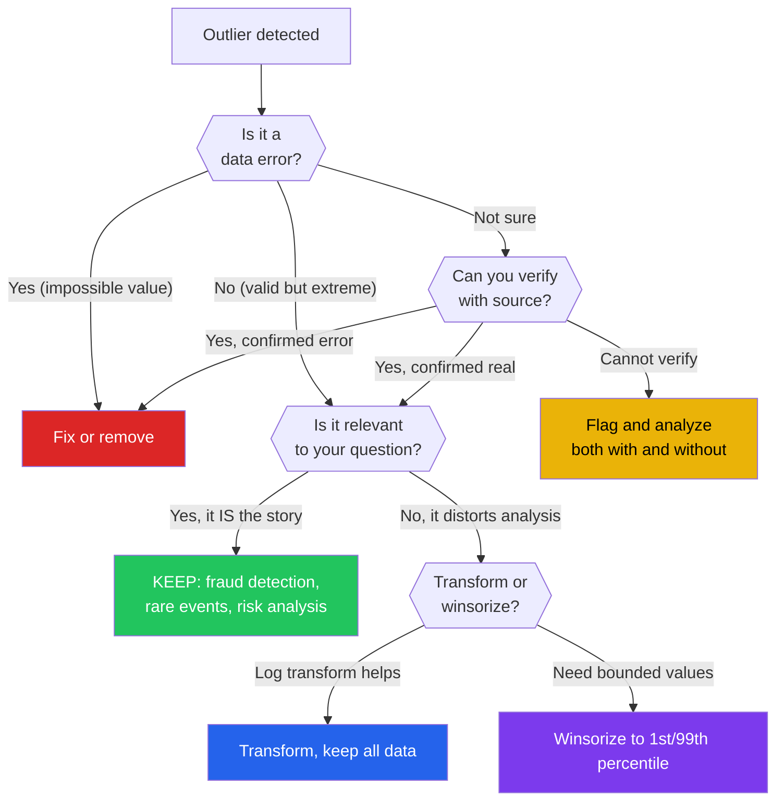

# Outlier Analysis

An outlier is a data point that differs significantly from the rest. But "differs significantly" is not a mathematical fact — it is a judgment call that depends on your domain, your distribution, and your goals. A $500 restaurant bill is an outlier at a fast-food chain but normal at a Michelin-starred restaurant. A 3-sigma event in a normal distribution is rare; in financial returns, it happens every month.

This page covers the full spectrum of outlier detection methods (from simple IQR to isolation forests), how to choose between them, and the critical question most analysts get wrong: **should you remove the outlier, or is the outlier the most important data point you have?**

---

## The Outlier Decision Framework



---

## Method 1: IQR (Interquartile Range)

The most common and simplest method. Distribution-free and robust.

```python
# iqr_method.py — IQR-based outlier detection
import numpy as np
import pandas as pd
import seaborn as sns
import matplotlib.pyplot as plt

tips = sns.load_dataset('tips')

def iqr_outliers(series, multiplier=1.5):
    """Detect outliers using the IQR method."""
    q1, q3 = series.quantile([0.25, 0.75])
    iqr = q3 - q1
    lower = q1 - multiplier * iqr
    upper = q3 + multiplier * iqr
    mask = (series < lower) | (series > upper)
    return mask, lower, upper

print("=== IQR OUTLIER DETECTION ===\n")
for col in ['total_bill', 'tip']:
    mask, lower, upper = iqr_outliers(tips[col])
    outliers = tips[mask]
    print(f"{col}:")
    print(f"  Q1={tips[col].quantile(0.25):.2f}, Q3={tips[col].quantile(0.75):.2f}")
    print(f"  IQR={tips[col].quantile(0.75) - tips[col].quantile(0.25):.2f}")
    print(f"  Bounds: [{lower:.2f}, {upper:.2f}]")
    print(f"  Outliers: {mask.sum()} ({mask.mean():.1%})")
    if mask.sum() > 0:
        print(f"  Outlier values: {sorted(tips.loc[mask, col].values)}")
    print()

# Visualize
fig, axes = plt.subplots(1, 2, figsize=(12, 5))
for idx, col in enumerate(['total_bill', 'tip']):
    mask, lower, upper = iqr_outliers(tips[col])
    colors = mask.map({True: 'red', False: 'steelblue'})
    axes[idx].scatter(range(len(tips)), tips[col], c=colors, alpha=0.5, s=20)
    axes[idx].axhline(upper, color='red', linestyle='--', label=f'Upper: {upper:.1f}')
    axes[idx].axhline(lower, color='red', linestyle='--', label=f'Lower: {lower:.1f}')
    axes[idx].set_title(f'{col} — IQR Outliers (red)')
    axes[idx].legend()

plt.tight_layout()
plt.savefig("iqr_outliers.png", dpi=150)
plt.show()
```

::: tip IQR Multiplier Selection
The standard 1.5x IQR catches ~0.7% of normal data as "outliers." Use 3.0x for "extreme outliers" (catches ~0.0002% of normal data). For skewed distributions, IQR is more appropriate than Z-score because it does not assume normality.
:::

---

## Method 2: Z-Score

Assumes approximate normality. Best for bell-shaped data.

```python
# zscore_method.py — Z-score outlier detection
import numpy as np
import pandas as pd
from scipy import stats

np.random.seed(42)

# Normal-ish data with some outliers
data = np.concatenate([
    np.random.normal(100, 15, 970),
    np.array([5, 10, 200, 210, 250])  # Intentional outliers
])
np.random.shuffle(data)

z_scores = np.abs(stats.zscore(data))

print("=== Z-SCORE OUTLIER DETECTION ===\n")
for threshold in [2.0, 2.5, 3.0]:
    outlier_mask = z_scores > threshold
    print(f"Threshold {threshold}: {outlier_mask.sum()} outliers "
          f"({outlier_mask.mean():.1%})")
    if outlier_mask.sum() > 0 and outlier_mask.sum() <= 10:
        print(f"  Values: {sorted(data[outlier_mask])}")

# Modified Z-score (uses median — more robust)
def modified_zscore(data):
    """MAD-based Z-score, robust to outliers themselves."""
    median = np.median(data)
    mad = np.median(np.abs(data - median))
    # 0.6745 is the 75th percentile of the standard normal
    modified_z = 0.6745 * (data - median) / mad
    return modified_z

mz = np.abs(modified_zscore(data))
print(f"\n--- Modified Z-Score (MAD-based) ---")
for threshold in [2.0, 2.5, 3.5]:
    outlier_mask = mz > threshold
    print(f"Threshold {threshold}: {outlier_mask.sum()} outliers "
          f"({outlier_mask.mean():.1%})")
    if 0 < outlier_mask.sum() <= 10:
        print(f"  Values: {sorted(data[outlier_mask])}")

print(f"\nWhy modified Z-score?")
print(f"Regular Z-score uses mean and std, which are THEMSELVES affected by outliers.")
print(f"A single massive outlier inflates the std, making ALL outliers look less extreme.")
print(f"Modified Z uses median and MAD, which are robust to outliers.")
```

---

## Method 3: Mahalanobis Distance

Detects **multivariate** outliers — points that are extreme in the *combination* of features even if not extreme in any single feature.

```python
# mahalanobis_method.py — Multivariate outlier detection
import numpy as np
import pandas as pd
from scipy.spatial.distance import mahalanobis
from scipy import stats

np.random.seed(42)

# Create correlated features
n = 500
mean = [50, 100]
cov = [[100, 80], [80, 150]]  # Positive correlation
X = np.random.multivariate_normal(mean, cov, n)

# Add multivariate outliers (normal in EACH dimension, outlier in COMBINATION)
outlier_points = np.array([
    [70, 70],   # High x, LOW y (unusual given positive correlation)
    [30, 130],  # Low x, HIGH y (unusual given positive correlation)
    [80, 80],   # Both moderately high but wrong correlation direction
])
X = np.vstack([X, outlier_points])

df = pd.DataFrame(X, columns=['feature_1', 'feature_2'])

# Compute Mahalanobis distance for each point
cov_matrix = np.cov(X.T)
cov_inv = np.linalg.inv(cov_matrix)
center = X.mean(axis=0)

distances = np.array([
    mahalanobis(point, center, cov_inv) for point in X
])
df['mahal_dist'] = distances

# Mahalanobis follows chi-squared distribution with p degrees of freedom
p = 2  # Number of features
threshold = np.sqrt(stats.chi2.ppf(0.975, df=p))  # 97.5th percentile

outlier_mask = distances > threshold
print(f"=== MAHALANOBIS DISTANCE ===")
print(f"Threshold (97.5th chi2): {threshold:.2f}")
print(f"Outliers detected: {outlier_mask.sum()}")
print(f"\nOutlier points:")
print(df[outlier_mask][['feature_1', 'feature_2', 'mahal_dist']].round(2))

# Show that univariate methods miss these
print(f"\n--- Univariate Z-score comparison ---")
for col in ['feature_1', 'feature_2']:
    z = np.abs(stats.zscore(df[col]))
    uni_outliers = z > 2.5
    print(f"{col}: {uni_outliers.sum()} univariate outliers")

print(f"Mahalanobis found {outlier_mask.sum()} multivariate outliers that")
print(f"univariate methods might miss (outlier in COMBINATION, not individually)")
```

---

## Method 4: Isolation Forest

Machine learning approach. Works well for high-dimensional data and mixed distributions.

```python
# isolation_forest.py — ML-based anomaly detection
import numpy as np
import pandas as pd
from sklearn.ensemble import IsolationForest
import matplotlib.pyplot as plt

np.random.seed(42)

# Create dataset with clusters and outliers
n_normal = 900
n_outliers = 100

# Two normal clusters
cluster1 = np.random.normal([30, 30], [5, 5], (n_normal // 2, 2))
cluster2 = np.random.normal([70, 70], [5, 5], (n_normal // 2, 2))
normal_data = np.vstack([cluster1, cluster2])

# Scattered outliers
outlier_data = np.random.uniform(0, 100, (n_outliers, 2))

X = np.vstack([normal_data, outlier_data])
true_labels = np.concatenate([np.ones(n_normal), -np.ones(n_outliers)])

# Fit Isolation Forest
iso_forest = IsolationForest(
    n_estimators=100,
    contamination=0.1,  # Expected proportion of outliers
    random_state=42
)
predictions = iso_forest.fit_predict(X)
scores = iso_forest.decision_function(X)

print("=== ISOLATION FOREST ===")
print(f"Total points: {len(X)}")
print(f"Predicted outliers (anomaly=-1): {(predictions == -1).sum()}")
print(f"Predicted normal (normal=1): {(predictions == 1).sum()}")

# Accuracy of detection
from sklearn.metrics import classification_report
print(f"\nDetection Performance:")
print(classification_report(true_labels, predictions, target_names=['Outlier', 'Normal']))

# How it works
print("\n--- How Isolation Forest Works ---")
print("1. Randomly select a feature")
print("2. Randomly select a split point between min and max")
print("3. Repeat until point is isolated")
print("4. Outliers require FEWER splits to isolate")
print("5. Average path length across trees = anomaly score")

# Visualize
fig, axes = plt.subplots(1, 2, figsize=(14, 6))

# True labels
colors_true = np.where(true_labels == 1, 'steelblue', 'red')
axes[0].scatter(X[:, 0], X[:, 1], c=colors_true, alpha=0.5, s=20)
axes[0].set_title('True Labels (red = outlier)')

# Predicted labels
colors_pred = np.where(predictions == 1, 'steelblue', 'red')
axes[1].scatter(X[:, 0], X[:, 1], c=colors_pred, alpha=0.5, s=20)
axes[1].set_title('Isolation Forest Predictions (red = outlier)')

plt.tight_layout()
plt.savefig("isolation_forest.png", dpi=150)
plt.show()
```

---

## Method 5: LOF (Local Outlier Factor)

Detects outliers relative to their local neighborhood density.

```python
# lof_method.py — Density-based outlier detection
import numpy as np
from sklearn.neighbors import LocalOutlierFactor
import matplotlib.pyplot as plt

np.random.seed(42)

# Dense cluster + sparse cluster + scattered points
dense = np.random.normal([20, 20], [2, 2], (300, 2))
sparse = np.random.normal([60, 60], [8, 8], (200, 2))
outliers = np.random.uniform(0, 80, (20, 2))

X = np.vstack([dense, sparse, outliers])
true_outlier = np.concatenate([np.ones(500), -np.ones(20)])

# LOF detects points that are in low-density regions relative to neighbors
lof = LocalOutlierFactor(n_neighbors=20, contamination=0.05)
predictions = lof.fit_predict(X)
scores = lof.negative_outlier_factor_

print("=== LOCAL OUTLIER FACTOR ===")
print(f"Points detected as outliers: {(predictions == -1).sum()}")
print(f"\nLOF scores (more negative = more outlier-like):")
print(f"  Normal range: [{scores[predictions==1].min():.2f}, {scores[predictions==1].max():.2f}]")
print(f"  Outlier range: [{scores[predictions==-1].min():.2f}, {scores[predictions==-1].max():.2f}]")

print(f"\n--- How LOF Works ---")
print("1. For each point, find k nearest neighbors")
print("2. Compute local density (based on reachability distance)")
print("3. Compare each point's density to its neighbors' density")
print("4. LOF ≈ 1: same density as neighbors (normal)")
print("5. LOF >> 1: much lower density than neighbors (outlier)")
print("Advantage: detects outliers in datasets with varying density")
```

---

## Method 6: DBSCAN for Outliers

Clustering-based: points that do not belong to any cluster are outliers.

```python
# dbscan_outliers.py — Clustering-based outlier detection
import numpy as np
from sklearn.cluster import DBSCAN
from sklearn.preprocessing import StandardScaler

np.random.seed(42)

# Three clusters of different sizes + noise
cluster1 = np.random.normal([10, 10], [1.5, 1.5], (100, 2))
cluster2 = np.random.normal([25, 10], [2, 2], (150, 2))
cluster3 = np.random.normal([15, 25], [1, 1], (80, 2))
noise = np.random.uniform(0, 35, (20, 2))

X = np.vstack([cluster1, cluster2, cluster3, noise])

# Scale features (DBSCAN is distance-based)
X_scaled = StandardScaler().fit_transform(X)

# DBSCAN: points not assigned to any cluster are label=-1
db = DBSCAN(eps=0.5, min_samples=5)
labels = db.fit_predict(X_scaled)

n_clusters = len(set(labels)) - (1 if -1 in labels else 0)
n_noise = (labels == -1).sum()

print("=== DBSCAN OUTLIER DETECTION ===")
print(f"Clusters found: {n_clusters}")
print(f"Noise points (outliers): {n_noise} ({n_noise/len(X):.1%})")
print(f"\nCluster sizes:")
for label in sorted(set(labels)):
    count = (labels == label).sum()
    name = f"Cluster {label}" if label >= 0 else "Noise/Outliers"
    print(f"  {name}: {count} points")
```

---

## Winsorization: Bounding Instead of Removing

```python
# winsorization.py — Capping outliers instead of removing them
import numpy as np
import pandas as pd
from scipy.stats import mstats

np.random.seed(42)

# Right-skewed data with outliers
data = np.concatenate([
    np.random.lognormal(3, 0.8, 980),
    np.array([500, 600, 800, 1000, 1500] * 4)  # outliers
])
np.random.shuffle(data)

print("=== WINSORIZATION ===")
print(f"Original: mean={data.mean():.1f}, median={np.median(data):.1f}, "
      f"max={data.max():.1f}")

# Method 1: Percentile capping (most common)
lower, upper = np.percentile(data, [1, 99])
data_capped = np.clip(data, lower, upper)
print(f"\n1% / 99% cap: mean={data_capped.mean():.1f}, "
      f"median={np.median(data_capped):.1f}, max={data_capped.max():.1f}")

# Method 2: Scipy winsorize
data_winsorized = mstats.winsorize(data, limits=[0.01, 0.01])
print(f"Winsorized (1%): mean={data_winsorized.mean():.1f}, "
      f"median={np.median(data_winsorized):.1f}, max={data_winsorized.max():.1f}")

# Method 3: IQR-based capping
q1, q3 = np.percentile(data, [25, 75])
iqr = q3 - q1
lower_iqr = q1 - 1.5 * iqr
upper_iqr = q3 + 1.5 * iqr
data_iqr = np.clip(data, lower_iqr, upper_iqr)
print(f"IQR cap: mean={data_iqr.mean():.1f}, "
      f"median={np.median(data_iqr):.1f}, max={data_iqr.max():.1f}")

print(f"\n--- When to Winsorize vs Remove ---")
print("Winsorize when: you want to REDUCE influence without LOSING data")
print("Remove when: values are clearly data errors (negative age, future dates)")
print("Keep when: outliers ARE the interesting data (fraud, rare events)")
```

---

## When Outliers ARE the Interesting Data

```python
# outliers_are_interesting.py — Domains where outliers are the signal
import numpy as np
import pandas as pd

print("=== WHEN OUTLIERS ARE THE STORY ===\n")

domains = [
    {
        "domain": "Fraud Detection",
        "example": "Credit card transaction 10x the normal amount",
        "action": "These ARE what you are looking for. Never remove.",
        "model": "Isolation Forest, autoencoder, one-class SVM",
    },
    {
        "domain": "Cybersecurity",
        "example": "Server with 100x normal network traffic at 3 AM",
        "action": "Outlier = potential breach. Alert immediately.",
        "model": "Time-series anomaly detection, DBSCAN on logs",
    },
    {
        "domain": "Manufacturing Quality",
        "example": "Widget dimensions outside tolerance band",
        "action": "Outlier = defective product. Root cause analysis needed.",
        "model": "Control charts (Shewhart), CUSUM",
    },
    {
        "domain": "Scientific Discovery",
        "example": "Unexpected reaction in drug trial",
        "action": "Outlier = possible new mechanism. Investigate thoroughly.",
        "model": "Domain expertise, replication studies",
    },
    {
        "domain": "Finance — Tail Risk",
        "example": "Market drops 10% in one day",
        "action": "Outlier = the event that bankrupts underprepared firms.",
        "model": "Extreme Value Theory, VaR, Expected Shortfall",
    },
    {
        "domain": "Recommendation Systems",
        "example": "User with radically different taste profile",
        "action": "Outlier = niche market opportunity or bot account.",
        "model": "Cluster analysis, cosine distance from centroid",
    },
]

for d in domains:
    print(f"Domain: {d['domain']}")
    print(f"  Example: {d['example']}")
    print(f"  Action: {d['action']}")
    print(f"  Method: {d['model']}\n")
```

::: danger Never Blindly Remove Outliers
Removing an outlier because it makes your model perform better is p-hacking by another name. You must have a reason BEFORE looking at the data (e.g., "values above 200 are known sensor errors"). If the outlier is real data, removing it biases your results toward the convenient middle.
:::

---

## Method Comparison

| Method | Univariate? | Assumptions | Interpretable? | Best For |
|--------|-------------|-------------|---------------|----------|
| IQR | Yes | None (non-parametric) | Very | Any skewed univariate data |
| Z-score | Yes | Normality | Very | Bell-shaped data |
| Modified Z | Yes | None | Very | Robust alternative to Z-score |
| Mahalanobis | Multivariate | Multivariate normal | Medium | Correlated features |
| Isolation Forest | Multivariate | None | Low | High-dimensional, mixed distributions |
| LOF | Multivariate | None | Medium | Varying density clusters |
| DBSCAN | Multivariate | None | Medium | Cluster-based detection |

---

## Summary

| Concept | Key Takeaway |
|---------|-------------|
| First question | Is the outlier a data error or a real extreme value? |
| IQR | Non-parametric, robust, works on any distribution |
| Z-score | Only for normally distributed data; use modified Z for robustness |
| Mahalanobis | Catches multivariate outliers that univariate methods miss |
| Isolation Forest | Best for high-dimensional data with no distribution assumptions |
| Winsorization | Cap extreme values instead of removing them |
| Outliers as signal | In fraud, security, and quality control — outliers ARE the data |

---

## What's Next

| Page | What You'll Learn |
|------|------------------|
| [Data Cleaning — Text](/eda/data-cleaning-text) | String standardization, regex, fuzzy matching |
| [Data Quality Validation](/eda/data-quality-validation) | Automated constraint checking |
| [Missing Data](/eda/missing-data) | When outliers are actually missing data in disguise |

## Try It Yourself

**Exercise 1:** Given a dataset of 1,000 customer transactions with columns `[amount, category, timestamp, customer_id]`, how would you check for outliers in the `amount` column using both IQR and Modified Z-score? Compare the results.

::: details Solution
```python
import pandas as pd
import numpy as np

# IQR method
Q1 = df['amount'].quantile(0.25)
Q3 = df['amount'].quantile(0.75)
IQR = Q3 - Q1
lower = Q1 - 1.5 * IQR
upper = Q3 + 1.5 * IQR
iqr_outliers = df[(df['amount'] < lower) | (df['amount'] > upper)]
print(f"IQR method: Found {len(iqr_outliers)} outliers ({len(iqr_outliers)/len(df)*100:.1f}%)")
print(f"  Bounds: [{lower:.2f}, {upper:.2f}]")

# Modified Z-score (MAD-based)
median = df['amount'].median()
mad = np.median(np.abs(df['amount'] - median))
modified_z = 0.6745 * (df['amount'] - median) / mad
mz_outliers = df[np.abs(modified_z) > 3.5]
print(f"\nModified Z-score: Found {len(mz_outliers)} outliers ({len(mz_outliers)/len(df)*100:.1f}%)")

# Compare
iqr_set = set(iqr_outliers.index)
mz_set = set(mz_outliers.index)
print(f"\nOverlap: {len(iqr_set & mz_set)} outliers detected by both methods")
print(f"IQR only: {len(iqr_set - mz_set)}, Modified Z only: {len(mz_set - iqr_set)}")
```
:::

**Exercise 2:** You have a 2D dataset with features `[height_cm, weight_kg]` for 500 people. The two features are positively correlated. A person with height=175 and weight=55 is not an outlier in either dimension alone but is unusual for the combination. Write code using Mahalanobis distance to detect such multivariate outliers.

::: details Solution
```python
import numpy as np
import pandas as pd
from scipy.spatial.distance import mahalanobis
from scipy import stats

X = df[['height_cm', 'weight_kg']].values

# Compute Mahalanobis distance for each point
cov_matrix = np.cov(X.T)
cov_inv = np.linalg.inv(cov_matrix)
center = X.mean(axis=0)

distances = np.array([
    mahalanobis(point, center, cov_inv) for point in X
])

# Threshold: chi-squared distribution with p=2 degrees of freedom
threshold = np.sqrt(stats.chi2.ppf(0.975, df=2))
outlier_mask = distances > threshold

print(f"Mahalanobis threshold (97.5%): {threshold:.2f}")
print(f"Multivariate outliers: {outlier_mask.sum()}")

# Show that univariate methods miss these
for col in ['height_cm', 'weight_kg']:
    z = np.abs(stats.zscore(df[col]))
    print(f"  {col} univariate outliers (|z|>2.5): {(z > 2.5).sum()}")

# Check the specific person
person = np.array([175, 55])
person_dist = mahalanobis(person, center, cov_inv)
print(f"\nPerson (175cm, 55kg) Mahalanobis distance: {person_dist:.2f}")
print(f"Is multivariate outlier: {person_dist > threshold}")
```
:::

**Exercise 3:** A manufacturing quality dataset has 10,000 sensor readings with columns `[temperature, pressure, vibration, output_quality]`. You need to detect anomalous sensor readings using Isolation Forest, then decide whether to remove, winsorize, or keep the outliers. Write the detection code and explain your decision framework.

::: details Solution
```python
import numpy as np
import pandas as pd
from sklearn.ensemble import IsolationForest

features = ['temperature', 'pressure', 'vibration']
X = df[features].values

# Fit Isolation Forest
iso = IsolationForest(
    n_estimators=200,
    contamination=0.05,   # expect ~5% anomalies
    random_state=42
)
df['anomaly'] = iso.fit_predict(X)       # 1 = normal, -1 = anomaly
df['anomaly_score'] = iso.decision_function(X)  # lower = more anomalous

n_anomalies = (df['anomaly'] == -1).sum()
print(f"Anomalies detected: {n_anomalies} ({n_anomalies/len(df)*100:.1f}%)")

# Decision framework:
# 1. Check if anomalies correlate with poor output quality
anomaly_quality = df.groupby('anomaly')['output_quality'].mean()
print(f"\nMean quality — Normal: {anomaly_quality[1]:.2f}, Anomaly: {anomaly_quality[-1]:.2f}")

# 2. If anomalies predict bad quality -> they ARE the signal (KEEP)
# 3. If anomalies are random sensor glitches -> REMOVE or WINSORIZE
# 4. If anomalies are extreme but real -> WINSORIZE to reduce influence

if anomaly_quality[-1] < anomaly_quality[1] * 0.8:
    print("Decision: KEEP — anomalies predict quality problems (they are the signal)")
else:
    print("Decision: WINSORIZE — cap extreme values to 1st/99th percentile")
    for col in features:
        lower, upper = df[col].quantile([0.01, 0.99])
        df[col] = df[col].clip(lower, upper)
```
:::

## Quick Quiz

**1. Why is the IQR method preferred over Z-score for skewed distributions?**
- a) IQR is faster to compute
- b) IQR does not assume normality and uses median-based statistics
- c) IQR always detects more outliers

::: details Answer
**b) IQR does not assume normality and uses median-based statistics.** Z-score assumes the data is approximately normal and uses mean and standard deviation, both of which are themselves distorted by outliers. IQR uses quartiles (Q1, Q3), which are robust to extreme values and make no distributional assumptions.
:::

**2. What does Isolation Forest use to determine if a point is an outlier?**
- a) The distance to the nearest cluster center
- b) The average number of random splits needed to isolate the point
- c) The Z-score of each feature

::: details Answer
**b) The average number of random splits needed to isolate the point.** Isolation Forest builds random trees by selecting random features and random split points. Outliers, being rare and different, require fewer splits to isolate. The anomaly score is based on the average path length across all trees -- shorter paths indicate outliers.
:::

**3. You find a customer with a $50,000 single transaction in an e-commerce dataset where the median is $45. What should you do FIRST?**
- a) Remove it immediately — it is clearly an outlier
- b) Winsorize it to the 99th percentile
- c) Verify whether it is a data error or a legitimate transaction

::: details Answer
**c) Verify whether it is a data error or a legitimate transaction.** The first step is always to determine if the outlier is real. A $50,000 transaction could be a bulk order, a B2B purchase, or a data entry error (e.g., cents stored as dollars). Removing a real data point biases your analysis; keeping a data error corrupts it. Check the source before deciding.
:::

**4. What is the key advantage of Mahalanobis distance over computing Z-scores for each feature independently?**
- a) It is computationally cheaper
- b) It detects points that are outliers in the combination of features, even if normal in each feature alone
- c) It works without any data

::: details Answer
**b) It detects points that are outliers in the combination of features, even if normal in each feature alone.** Mahalanobis distance accounts for correlations between features. A person who is 190cm tall and weighs 50kg might have normal values in each dimension separately, but the combination is extremely unusual given the positive correlation between height and weight. Univariate Z-scores miss this entirely.
:::

**5. When should you NOT remove outliers?**
- a) When they are caused by sensor malfunction
- b) When they represent the phenomenon you are trying to detect (e.g., fraud)
- c) When they are data entry errors with impossible values

::: details Answer
**b) When they represent the phenomenon you are trying to detect (e.g., fraud).** In fraud detection, cybersecurity, manufacturing quality control, and scientific discovery, outliers ARE the signal. Removing them defeats the purpose of the analysis. Only remove outliers when they are confirmed data errors or when they distort an analysis where they are irrelevant to the research question.
:::
