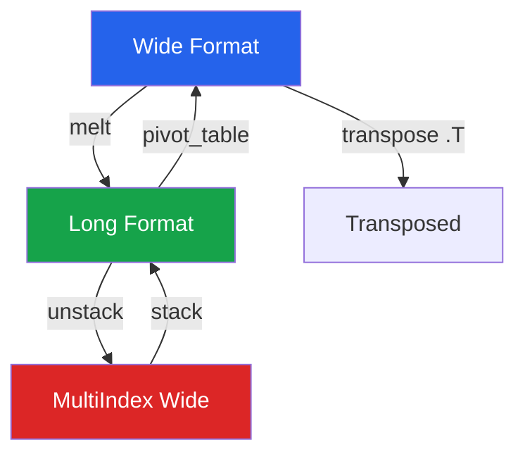

# Pandas Advanced

Once you have the fundamentals, these advanced techniques let you tackle complex EDA tasks with elegant, high-performance code.

---

## MultiIndex (Hierarchical Indexing)

### Creating MultiIndex

```python
import pandas as pd
import numpy as np

np.random.seed(42)

# From groupby
sales = pd.DataFrame({
    'region':  np.random.choice(['North', 'South', 'East', 'West'], 10000),
    'product': np.random.choice(['Widget', 'Gadget', 'Doohickey'], 10000),
    'quarter': np.random.choice(['Q1', 'Q2', 'Q3', 'Q4'], 10000),
    'revenue': np.random.lognormal(4, 1, 10000).round(2),
    'units':   np.random.randint(1, 50, 10000),
})

# GroupBy automatically creates MultiIndex
grouped = sales.groupby(['region', 'product', 'quarter']).agg(
    total_revenue=('revenue', 'sum'),
    total_units=('units', 'sum'),
    avg_price=('revenue', 'mean'),
    n_orders=('revenue', 'count'),
)
print(grouped.head(12))
print(f"\nIndex levels: {grouped.index.names}")
print(f"Index nlevels: {grouped.index.nlevels}")
```

### Selecting with MultiIndex

```python
# xs: cross-section selection
north_data = grouped.xs('North', level='region')
q1_data = grouped.xs('Q1', level='quarter')
north_widget = grouped.xs(('North', 'Widget'), level=('region', 'product'))

# loc with tuples
specific = grouped.loc[('North', 'Widget', 'Q1')]
range_select = grouped.loc['North':'South']  # slice on first level

# IndexSlice for complex slicing
idx = pd.IndexSlice
north_south = grouped.loc[idx['North':'South', :, :], :]
q1_q2 = grouped.loc[idx[:, :, ['Q1', 'Q2']], :]

# Reset to flat DataFrame (common in EDA)
flat = grouped.reset_index()
print(flat.head())
```

### Stacking and Unstacking

```python
# Unstack: move index level to columns
by_region_product = sales.groupby(['region', 'product'])['revenue'].sum()
wide = by_region_product.unstack(level='product')
print(wide)

# Stack: move columns to index
long = wide.stack()
print(long.head())

# Useful for heatmap preparation
heatmap_data = (
    sales
    .groupby(['region', 'quarter'])['revenue']
    .mean()
    .unstack('quarter')
    .round(2)
)
print(heatmap_data)
```

---

## Pivot and Melt

### pivot_table: Spreadsheet-Style Summary

```python
# Simple pivot table
pivot = pd.pivot_table(
    sales,
    values='revenue',
    index='region',
    columns='product',
    aggfunc='mean',
    margins=True,         # add row/column totals
    margins_name='Total',
)
print(pivot.round(2))

# Multiple aggregations
multi_pivot = pd.pivot_table(
    sales,
    values=['revenue', 'units'],
    index=['region'],
    columns=['quarter'],
    aggfunc={
        'revenue': ['sum', 'mean'],
        'units': 'sum',
    },
)
print(multi_pivot.round(2))

# Pivot with fill value for missing combinations
filled_pivot = pd.pivot_table(
    sales,
    values='revenue',
    index='product',
    columns='quarter',
    aggfunc='count',
    fill_value=0,
)
print(filled_pivot)
```

### melt: Wide to Long

```python
# Create a wide dataset (common from spreadsheets/surveys)
wide_df = pd.DataFrame({
    'student':    ['Alice', 'Bob', 'Charlie'],
    'math_q1':    [85, 92, 78],
    'math_q2':    [88, 90, 82],
    'science_q1': [92, 85, 90],
    'science_q2': [95, 88, 93],
})

# Melt to long format
long_df = pd.melt(
    wide_df,
    id_vars=['student'],
    value_vars=['math_q1', 'math_q2', 'science_q1', 'science_q2'],
    var_name='exam',
    value_name='score',
)

# Further parse the melted column
long_df[['subject', 'quarter']] = long_df['exam'].str.split('_', expand=True)
long_df = long_df.drop(columns='exam')
print(long_df)

# Real-world example: survey responses
survey = pd.DataFrame({
    'respondent': [1, 2, 3, 4, 5],
    'q1_satisfaction': [4, 5, 3, 4, 2],
    'q2_likelihood':   [3, 5, 4, 3, 1],
    'q3_recommend':    [4, 4, 3, 5, 2],
    'q4_value':        [5, 5, 4, 4, 3],
})

melted_survey = survey.melt(
    id_vars='respondent',
    var_name='question',
    value_name='rating',
)
print(melted_survey.groupby('question')['rating'].describe().round(2))
```

---

## Window Functions

### Rolling Windows

```python
# Time series data
dates = pd.date_range('2024-01-01', periods=365, freq='D')
np.random.seed(42)
ts = pd.DataFrame({
    'date': dates,
    'value': np.cumsum(np.random.randn(365) * 2 + 0.1) + 100,
    'volume': np.random.poisson(1000, 365),
})
ts = ts.set_index('date')

# Rolling mean and standard deviation
ts['ma_7']   = ts['value'].rolling(window=7).mean()
ts['ma_30']  = ts['value'].rolling(window=30).mean()
ts['std_30'] = ts['value'].rolling(window=30).std()

# Bollinger Bands
ts['upper_band'] = ts['ma_30'] + 2 * ts['std_30']
ts['lower_band'] = ts['ma_30'] - 2 * ts['std_30']

# Rolling correlation between two series
ts['rolling_corr'] = ts['value'].rolling(30).corr(ts['volume'])

# Custom rolling function
ts['rolling_range'] = ts['value'].rolling(7).apply(
    lambda x: x.max() - x.min(), raw=True
)

print(ts.tail(10).round(2))
```

### Expanding Windows

```python
# Expanding (cumulative) operations
ts['cummax']     = ts['value'].expanding().max()
ts['cummin']     = ts['value'].expanding().min()
ts['cummean']    = ts['value'].expanding().mean()
ts['drawdown']   = ts['value'] / ts['cummax'] - 1  # drawdown from peak

# Year-to-date aggregation
ts['ytd_volume'] = ts.groupby(ts.index.year)['volume'].cumsum()
```

### Exponentially Weighted Windows

```python
# EWM for smoothing (more weight on recent observations)
ts['ewm_12'] = ts['value'].ewm(span=12).mean()
ts['ewm_26'] = ts['value'].ewm(span=26).mean()

# MACD (Moving Average Convergence Divergence)
ts['macd'] = ts['ewm_12'] - ts['ewm_26']
ts['signal'] = ts['macd'].ewm(span=9).mean()
```

### GroupBy + Window Functions

```python
# Rolling stats within groups
sales_ts = pd.DataFrame({
    'date': np.tile(pd.date_range('2024-01-01', periods=365, freq='D'), 3),
    'product': np.repeat(['Widget', 'Gadget', 'Doohickey'], 365),
    'revenue': np.random.lognormal(4, 0.5, 365 * 3).round(2),
})

# Sort and set index
sales_ts = sales_ts.sort_values(['product', 'date'])

# Rolling 7-day average per product
sales_ts['ma_7'] = (
    sales_ts
    .groupby('product')['revenue']
    .transform(lambda x: x.rolling(7).mean())
)

# Percent change within group
sales_ts['pct_change'] = (
    sales_ts
    .groupby('product')['revenue']
    .transform(lambda x: x.pct_change())
)

print(sales_ts.groupby('product').tail(3))
```

---

## Method Chaining

### Clean, Readable EDA Pipelines

```python
# BAD: intermediate variables everywhere
# df1 = df.dropna()
# df2 = df1[df1['total'] > 0]
# df3 = df2.assign(log_total=np.log(df2['total']))
# df4 = df3.groupby('region').agg(...)

# GOOD: method chaining
result = (
    sales
    .dropna(subset=['revenue', 'region'])
    .query('revenue > 0 and units > 0')
    .assign(
        log_revenue=lambda d: np.log(d['revenue']),
        revenue_per_unit=lambda d: d['revenue'] / d['units'],
        is_high_value=lambda d: d['revenue'] > d['revenue'].quantile(0.75),
    )
    .groupby(['region', 'product'])
    .agg(
        total_rev=('revenue', 'sum'),
        avg_rev=('revenue', 'mean'),
        high_value_pct=('is_high_value', 'mean'),
        n_orders=('revenue', 'count'),
    )
    .sort_values('total_rev', ascending=False)
    .round(2)
)
print(result)
```

### pipe: Custom Functions in Chains

```python
def add_percentile_rank(df, col, new_col=None):
    """Add percentile rank column."""
    if new_col is None:
        new_col = f'{col}_pctile'
    df = df.copy()
    df[new_col] = df[col].rank(pct=True)
    return df

def flag_outliers(df, col, method='iqr', threshold=1.5):
    """Flag outliers using IQR method."""
    df = df.copy()
    q1, q3 = df[col].quantile([0.25, 0.75])
    iqr = q3 - q1
    df[f'{col}_outlier'] = (
        (df[col] < q1 - threshold * iqr) |
        (df[col] > q3 + threshold * iqr)
    )
    return df

def log_transform(df, col):
    """Apply log1p transform."""
    df = df.copy()
    df[f'{col}_log'] = np.log1p(df[col])
    return df

# Chain with pipe
analysis = (
    sales
    .pipe(flag_outliers, 'revenue')
    .query('revenue_outlier == False')
    .pipe(add_percentile_rank, 'revenue')
    .pipe(log_transform, 'revenue')
)
print(analysis[['revenue', 'revenue_pctile', 'revenue_log', 'revenue_outlier']].head())
```

---

## Categorical Data Optimization

```python
# Convert to categorical for memory savings and speed
df = sales.copy()

print(f"Before: {df.memory_usage(deep=True).sum() / 1024:.1f} KB")

# Convert string columns to category
for col in ['region', 'product', 'quarter']:
    df[col] = df[col].astype('category')

print(f"After:  {df.memory_usage(deep=True).sum() / 1024:.1f} KB")

# Ordered categories (useful for sorting)
df['quarter'] = pd.Categorical(
    df['quarter'],
    categories=['Q1', 'Q2', 'Q3', 'Q4'],
    ordered=True,
)

# Now sorting respects the order
print(df.sort_values('quarter').head())

# Category-aware groupby is faster
result = df.groupby('quarter', observed=True)['revenue'].mean()
print(result)
```

---

## Performance Optimization

### Memory Reduction

```python
def reduce_memory(df, verbose=True):
    """Downcast DataFrame columns to minimize memory usage."""
    start_mem = df.memory_usage(deep=True).sum() / 1024**2

    for col in df.columns:
        col_type = df[col].dtype

        if col_type == 'object':
            n_unique = df[col].nunique()
            n_total = len(df)
            if n_unique / n_total < 0.5:  # less than 50% unique
                df[col] = df[col].astype('category')

        elif col_type in ['int64', 'int32']:
            c_min, c_max = df[col].min(), df[col].max()
            if c_min >= np.iinfo(np.int8).min and c_max <= np.iinfo(np.int8).max:
                df[col] = df[col].astype(np.int8)
            elif c_min >= np.iinfo(np.int16).min and c_max <= np.iinfo(np.int16).max:
                df[col] = df[col].astype(np.int16)
            elif c_min >= np.iinfo(np.int32).min and c_max <= np.iinfo(np.int32).max:
                df[col] = df[col].astype(np.int32)

        elif col_type in ['float64']:
            c_min, c_max = df[col].min(), df[col].max()
            if c_min >= np.finfo(np.float32).min and c_max <= np.finfo(np.float32).max:
                df[col] = df[col].astype(np.float32)

    end_mem = df.memory_usage(deep=True).sum() / 1024**2
    if verbose:
        print(f"Memory: {start_mem:.2f} MB -> {end_mem:.2f} MB "
              f"({100 * (start_mem - end_mem) / start_mem:.1f}% reduction)")
    return df

# Apply
sales_optimized = reduce_memory(sales.copy())
```

### Vectorization Over Apply

```python
import time

n = 500_000
df = pd.DataFrame({
    'a': np.random.randn(n),
    'b': np.random.randn(n),
    'c': np.random.choice(['x', 'y', 'z'], n),
})

# SLOW: apply row by row
start = time.perf_counter()
df['d_slow'] = df.apply(lambda row: row['a'] * 2 + row['b'] if row['c'] == 'x' else row['a'] - row['b'], axis=1)
apply_time = time.perf_counter() - start

# FAST: vectorized with np.where
start = time.perf_counter()
df['d_fast'] = np.where(df['c'] == 'x', df['a'] * 2 + df['b'], df['a'] - df['b'])
vec_time = time.perf_counter() - start

print(f"apply:      {apply_time:.3f}s")
print(f"vectorized: {vec_time:.4f}s")
print(f"Speedup:    {apply_time/vec_time:.0f}x")
```

### eval and query for Large DataFrames

```python
n = 2_000_000
big = pd.DataFrame({
    'a': np.random.randn(n),
    'b': np.random.randn(n),
    'c': np.random.randn(n),
})

# eval: computed column without temporary arrays
big['d'] = big.eval('a * b + c / 2')

# query: filtering without temporary boolean arrays
result = big.query('a > 0 and b < 0 and d > 1')
print(f"Filtered: {len(result):,} / {n:,} rows")
```

---

## Advanced Aggregation Patterns

### Named Aggregation with Multiple Functions

```python
agg_result = sales.groupby('region').agg(
    rev_sum=('revenue', 'sum'),
    rev_mean=('revenue', 'mean'),
    rev_p50=('revenue', 'median'),
    rev_p95=('revenue', lambda x: x.quantile(0.95)),
    rev_cv=('revenue', lambda x: x.std() / x.mean()),
    units_total=('units', 'sum'),
    orders=('revenue', 'count'),
    products=('product', 'nunique'),
).round(2)

# Add computed columns
agg_result['rev_per_unit'] = (agg_result['rev_sum'] / agg_result['units_total']).round(2)
agg_result['avg_units_per_order'] = (agg_result['units_total'] / agg_result['orders']).round(1)
print(agg_result)
```

### Crosstab with Heatmap Data

```python
# Revenue heatmap: product x quarter
heatmap = pd.crosstab(
    sales['product'],
    sales['quarter'],
    values=sales['revenue'],
    aggfunc='sum',
).round(0)

# Normalize by row (product's revenue distribution across quarters)
heatmap_pct = heatmap.div(heatmap.sum(axis=1), axis=0).round(3)
print(heatmap_pct)

# Chi-squared test for independence
from scipy import stats
chi2, p, dof, expected = stats.chi2_contingency(
    pd.crosstab(sales['product'], sales['region'])
)
print(f"\nChi-squared: {chi2:.2f}, p-value: {p:.4f}")
print(f"Product and Region are {'dependent' if p < 0.05 else 'independent'} (alpha=0.05)")
```

---

## Reshaping Patterns



### Explode: Unnest Lists

```python
# Data with list columns (common from JSON/API responses)
orders = pd.DataFrame({
    'order_id': [1, 2, 3],
    'items': [['Widget', 'Gadget'], ['Doohickey'], ['Widget', 'Widget', 'Gadget']],
    'total': [150, 30, 200],
})

exploded = orders.explode('items').reset_index(drop=True)
print(exploded)
# Now each row is one item — can group/count per item
print(exploded['items'].value_counts())
```

### Dummy Variables for EDA

```python
# One-hot encoding for correlation analysis
dummies = pd.get_dummies(sales[['product', 'region', 'revenue']], drop_first=True)
correlation_with_dummies = dummies.corr()['revenue'].sort_values(ascending=False)
print(correlation_with_dummies.round(3))
```

---

## Duplicate Detection

```python
# Check for duplicates
n_dupes = sales.duplicated().sum()
print(f"Exact duplicate rows: {n_dupes}")

# Duplicates on subset of columns
n_dupes_subset = sales.duplicated(subset=['region', 'product', 'quarter'], keep=False).sum()
print(f"Duplicate region-product-quarter combos: {n_dupes_subset}")

# Show duplicate groups
dupes = sales[sales.duplicated(subset=['region', 'product', 'quarter'], keep=False)]
dupe_groups = dupes.groupby(['region', 'product', 'quarter']).size()
print(f"Groups with duplicates: {len(dupe_groups)}")

# Keep first/last/drop all
deduped = sales.drop_duplicates(subset=['region', 'product', 'quarter'], keep='first')
print(f"After dedup: {len(deduped)} rows (was {len(sales)})")
```

---

## Practical EDA Techniques

### Distribution Comparison Across Groups

```python
def compare_distributions(df, numeric_col, group_col):
    """Compare distribution of a numeric column across groups."""
    groups = df.groupby(group_col)[numeric_col]

    stats = groups.agg(['count', 'mean', 'std', 'median', 'skew'])
    stats['cv'] = stats['std'] / stats['mean']
    stats['iqr'] = groups.quantile(0.75) - groups.quantile(0.25)

    print(f"\nDistribution of '{numeric_col}' by '{group_col}':")
    print(stats.round(3))

    # Pairwise comparison
    group_names = df[group_col].unique()
    print(f"\nPairwise mean differences:")
    for i, g1 in enumerate(group_names):
        for g2 in group_names[i+1:]:
            d1 = df[df[group_col] == g1][numeric_col]
            d2 = df[df[group_col] == g2][numeric_col]
            diff = d1.mean() - d2.mean()
            pooled_std = np.sqrt((d1.std()**2 + d2.std()**2) / 2)
            cohens_d = diff / pooled_std if pooled_std > 0 else 0
            print(f"  {g1} vs {g2}: diff={diff:.2f}, Cohen's d={cohens_d:.3f}")

compare_distributions(sales, 'revenue', 'region')
```

### Automated Column Profiling

```python
def profile_column(series):
    """Generate a complete profile of a single column."""
    profile = {
        'dtype': str(series.dtype),
        'count': len(series),
        'missing': series.isna().sum(),
        'missing_pct': f"{series.isna().mean():.1%}",
        'unique': series.nunique(),
        'unique_pct': f"{series.nunique() / len(series):.1%}",
    }

    if series.dtype in ['int64', 'float64', 'int32', 'float32']:
        valid = series.dropna()
        profile.update({
            'mean': valid.mean(),
            'std': valid.std(),
            'min': valid.min(),
            'q25': valid.quantile(0.25),
            'median': valid.median(),
            'q75': valid.quantile(0.75),
            'max': valid.max(),
            'skew': valid.skew(),
            'kurtosis': valid.kurtosis(),
            'zeros': (valid == 0).sum(),
            'negatives': (valid < 0).sum(),
        })
    elif series.dtype == 'object':
        profile.update({
            'top_value': series.mode().iloc[0] if not series.mode().empty else None,
            'top_freq': series.value_counts().iloc[0] if len(series.value_counts()) > 0 else 0,
            'avg_length': series.dropna().str.len().mean() if series.dropna().str.len().notna().any() else None,
        })

    return profile

# Profile all columns
for col in sales.columns:
    p = profile_column(sales[col])
    print(f"\n--- {col} ---")
    for k, v in p.items():
        if isinstance(v, float):
            print(f"  {k:<15} {v:>12.3f}")
        else:
            print(f"  {k:<15} {str(v):>12}")
```

---

## Key Takeaways

- **MultiIndex** enables hierarchical aggregation; use `.xs()` and `pd.IndexSlice` for selection
- **pivot_table** reshapes long data to wide; **melt** reverses it — these are inverse operations
- **Window functions** (rolling, expanding, ewm) are essential for time series EDA
- **Method chaining** with `.assign()`, `.query()`, `.pipe()` produces clean, auditable pipelines
- **Categorical dtype** reduces memory by 80%+ on low-cardinality string columns
- **Vectorize everything**: `np.where` is 50-200x faster than `apply(axis=1)`
- Use `pd.eval()` and `pd.query()` for memory-efficient operations on large DataFrames
- Always **validate after reshaping**: check shape, nulls, and row counts to catch silent data loss
