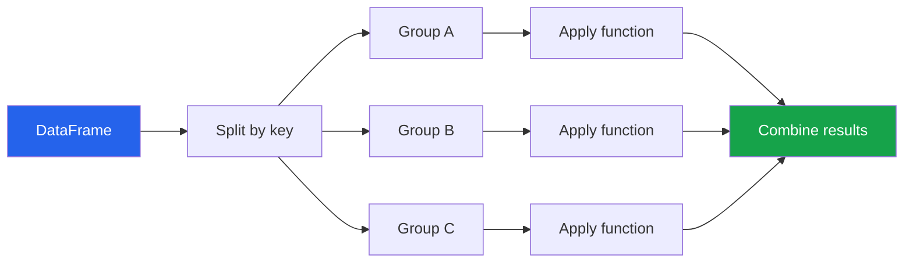

# Pandas Fundamentals

Pandas is the primary tool for tabular data manipulation in Python. If NumPy provides the engine, pandas provides the steering wheel, dashboard, and GPS for navigating your data.

---

## Core Data Structures

### Series

A Series is a one-dimensional labeled array — think of it as a column in a spreadsheet.

```python
import pandas as pd
import numpy as np

# Creating Series
s1 = pd.Series([10, 20, 30, 40], index=['a', 'b', 'c', 'd'])
s2 = pd.Series({'x': 100, 'y': 200, 'z': 300})
s3 = pd.Series(np.random.randn(1000), name='random_values')

# Series properties
print(f"Name:   {s3.name}")
print(f"Dtype:  {s3.dtype}")       # float64
print(f"Shape:  {s3.shape}")       # (1000,)
print(f"Index:  {s3.index[:5]}")   # RangeIndex(start=0, stop=5)
print(f"Values: {s3.values[:5]}")  # numpy array

# Series operations are vectorized
prices = pd.Series([19.99, 29.99, 49.99, 9.99])
discounted = prices * 0.8
tax_included = prices * 1.08
```

### DataFrame

A DataFrame is a two-dimensional labeled data structure — the workhorse of EDA.

```python
# Creating DataFrames
df = pd.DataFrame({
    'name':    ['Alice', 'Bob', 'Charlie', 'Diana', 'Eve'],
    'age':     [32, 45, 28, 38, 52],
    'salary':  [85000, 92000, 67000, 105000, 88000],
    'dept':    ['Engineering', 'Marketing', 'Engineering', 'Management', 'Marketing'],
    'active':  [True, True, False, True, True],
})

# From NumPy array
arr = np.random.randn(100, 4)
df_from_np = pd.DataFrame(arr, columns=['A', 'B', 'C', 'D'])

# DataFrame properties
print(f"Shape:    {df.shape}")       # (5, 5)
print(f"Columns:  {df.columns.tolist()}")
print(f"Dtypes:\n{df.dtypes}")
print(f"Memory:   {df.memory_usage(deep=True).sum() / 1024:.1f} KB")
```

---

## Reading Data

### CSV Files

```python
# Basic CSV reading
df = pd.read_csv('sales_data.csv')

# With options for real-world messy data
df = pd.read_csv(
    'sales_data.csv',
    sep=',',                          # delimiter
    header=0,                         # row number for header
    index_col='id',                   # column to use as index
    usecols=['id', 'date', 'amount', 'category'],  # subset of columns
    dtype={'category': 'category', 'amount': 'float32'},  # explicit types
    parse_dates=['date'],             # parse as datetime
    na_values=['N/A', 'missing', ''], # treat as NaN
    nrows=10000,                      # read only first N rows
    low_memory=False,                 # avoid mixed-type warnings
    encoding='utf-8',                 # encoding
)

# Reading large files in chunks
chunks = pd.read_csv('huge_file.csv', chunksize=100_000)
result = pd.DataFrame()
for chunk in chunks:
    filtered = chunk[chunk['status'] == 'active']
    result = pd.concat([result, filtered], ignore_index=True)
```

### Other Formats

```python
# Excel
df = pd.read_excel('report.xlsx', sheet_name='Sales', engine='openpyxl')

# JSON
df = pd.read_json('api_response.json', orient='records')

# Parquet (fast, columnar, preserves dtypes)
df = pd.read_parquet('data.parquet', columns=['col1', 'col2'])

# SQL
import sqlite3
conn = sqlite3.connect('database.db')
df = pd.read_sql('SELECT * FROM users WHERE active = 1', conn)

# Clipboard (quick paste from spreadsheet)
# df = pd.read_clipboard()

# From dict of lists, list of dicts, records
records = [
    {'name': 'Alice', 'score': 95},
    {'name': 'Bob', 'score': 87},
]
df = pd.DataFrame.from_records(records)
```

---

## First Look at Data

```python
# Simulated e-commerce dataset
np.random.seed(42)
n = 5000
ecom = pd.DataFrame({
    'order_id':    range(1, n + 1),
    'customer_id': np.random.randint(100, 500, n),
    'product':     np.random.choice(['Widget', 'Gadget', 'Doohickey', 'Thingamajig'], n),
    'quantity':    np.random.randint(1, 10, n),
    'unit_price':  np.round(np.random.lognormal(3, 0.5, n), 2),
    'order_date':  pd.date_range('2024-01-01', periods=n, freq='h'),
    'region':      np.random.choice(['North', 'South', 'East', 'West'], n, p=[0.3, 0.2, 0.25, 0.25]),
    'discount':    np.random.choice([0.0, 0.05, 0.10, 0.15, 0.20], n),
})
ecom['total'] = ecom['quantity'] * ecom['unit_price'] * (1 - ecom['discount'])

# EDA first look
print(ecom.head())
print(ecom.tail())
print(ecom.info())
print(ecom.describe())
print(ecom.describe(include='object'))  # categorical columns

# Shape and memory
print(f"\nRows: {ecom.shape[0]:,}, Columns: {ecom.shape[1]}")
print(f"Memory: {ecom.memory_usage(deep=True).sum() / 1024**2:.2f} MB")

# Unique values per column
for col in ecom.columns:
    print(f"  {col:<15} nunique={ecom[col].nunique():<6} dtype={ecom[col].dtype}")
```

---

## Selection and Indexing

### Column Selection

```python
# Single column (returns Series)
prices = ecom['unit_price']

# Multiple columns (returns DataFrame)
subset = ecom[['product', 'quantity', 'total']]

# Attribute access (only for valid Python identifiers)
names = ecom.product  # same as ecom['product']

# Select by dtype
numeric_cols = ecom.select_dtypes(include='number')
categorical_cols = ecom.select_dtypes(include=['object', 'category'])
```

### Row Selection

```python
# By position — .iloc
first_row  = ecom.iloc[0]           # Series
first_five = ecom.iloc[:5]          # DataFrame
specific   = ecom.iloc[[0, 10, 20]] # specific rows
cell       = ecom.iloc[0, 3]        # single cell

# By label — .loc (when index has meaningful labels)
ecom_indexed = ecom.set_index('order_id')
order_42 = ecom_indexed.loc[42]
range_orders = ecom_indexed.loc[10:20]  # inclusive on both ends!
cols_subset = ecom_indexed.loc[10:20, ['product', 'total']]
```

### Boolean Filtering

```python
# Single condition
expensive = ecom[ecom['total'] > 500]

# Multiple conditions (use & | ~ with parentheses)
high_value_north = ecom[
    (ecom['total'] > 200) &
    (ecom['region'] == 'North') &
    (ecom['discount'] == 0)
]

# isin for multiple value matching
widgets_gadgets = ecom[ecom['product'].isin(['Widget', 'Gadget'])]

# String methods
# ecom[ecom['product'].str.contains('Widget', case=False)]

# between
mid_range = ecom[ecom['unit_price'].between(20, 50)]

# query() method — cleaner syntax
result = ecom.query('total > 200 and region == "North" and discount == 0')

# nlargest / nsmallest
top_10 = ecom.nlargest(10, 'total')
bottom_5 = ecom.nsmallest(5, 'unit_price')
```

---

## Adding and Modifying Columns

```python
# Simple assignment
ecom['revenue'] = ecom['quantity'] * ecom['unit_price']
ecom['discount_amount'] = ecom['revenue'] - ecom['total']

# Conditional column with np.where
ecom['value_tier'] = np.where(ecom['total'] > 200, 'high', 'low')

# Multiple conditions with np.select
conditions = [
    ecom['total'] >= 500,
    ecom['total'] >= 200,
    ecom['total'] >= 50,
]
choices = ['premium', 'high', 'medium']
ecom['value_segment'] = np.select(conditions, choices, default='low')

# .assign() for chained operations (returns new DataFrame)
result = (
    ecom
    .assign(
        margin=lambda d: d['total'] / d['revenue'],
        month=lambda d: d['order_date'].dt.month,
        weekday=lambda d: d['order_date'].dt.day_name(),
    )
)

# apply for complex row-wise logic (slower — use vectorized when possible)
def categorize_order(row):
    if row['quantity'] >= 5 and row['total'] >= 200:
        return 'bulk_high_value'
    elif row['quantity'] >= 5:
        return 'bulk_low_value'
    elif row['total'] >= 200:
        return 'single_high_value'
    return 'single_low_value'

ecom['order_type'] = ecom.apply(categorize_order, axis=1)

# map for Series transformations
region_codes = {'North': 'N', 'South': 'S', 'East': 'E', 'West': 'W'}
ecom['region_code'] = ecom['region'].map(region_codes)
```

---

## Sorting and Ranking

```python
# Sort by single column
sorted_by_total = ecom.sort_values('total', ascending=False)

# Sort by multiple columns
sorted_multi = ecom.sort_values(
    ['region', 'total'],
    ascending=[True, False]
)

# Ranking
ecom['total_rank'] = ecom['total'].rank(ascending=False, method='dense')

# Rank within groups
ecom['rank_in_region'] = ecom.groupby('region')['total'].rank(
    ascending=False, method='dense'
)

# Top N per group
top_3_per_region = (
    ecom
    .sort_values('total', ascending=False)
    .groupby('region')
    .head(3)
)
```

---

## GroupBy: Split-Apply-Combine



### Basic Aggregations

```python
# Single aggregation
region_totals = ecom.groupby('region')['total'].sum()

# Multiple aggregations
region_stats = ecom.groupby('region')['total'].agg(['mean', 'median', 'std', 'count'])

# Named aggregations (pandas 0.25+)
summary = ecom.groupby('region').agg(
    n_orders=('order_id', 'count'),
    total_revenue=('total', 'sum'),
    avg_order=('total', 'mean'),
    median_order=('total', 'median'),
    avg_quantity=('quantity', 'mean'),
    n_customers=('customer_id', 'nunique'),
)
print(summary)

# Multiple group keys
product_region = ecom.groupby(['product', 'region']).agg(
    revenue=('total', 'sum'),
    orders=('order_id', 'count'),
).reset_index()
```

### Transform: Group-Wise Computation Returning Same Shape

```python
# Z-score within each region
ecom['total_zscore'] = ecom.groupby('region')['total'].transform(
    lambda x: (x - x.mean()) / x.std()
)

# Percent of group total
ecom['pct_of_region'] = ecom.groupby('region')['total'].transform(
    lambda x: x / x.sum()
)

# Flag: above group median
ecom['above_region_median'] = ecom.groupby('region')['total'].transform(
    lambda x: x > x.median()
)
```

### Filter: Keep/Drop Entire Groups

```python
# Keep only regions with > 1000 orders
large_regions = ecom.groupby('region').filter(lambda g: len(g) > 1000)

# Keep only products where avg order > 100
popular = ecom.groupby('product').filter(lambda g: g['total'].mean() > 100)
```

### Custom Aggregation

```python
def eda_summary_fn(group):
    """Custom aggregation returning multiple statistics."""
    return pd.Series({
        'count':      len(group),
        'total_rev':  group['total'].sum(),
        'mean':       group['total'].mean(),
        'median':     group['total'].median(),
        'std':        group['total'].std(),
        'cv':         group['total'].std() / group['total'].mean(),  # coefficient of variation
        'skew':       group['total'].skew(),
        'q25':        group['total'].quantile(0.25),
        'q75':        group['total'].quantile(0.75),
        'pct_high':   (group['total'] > 200).mean(),
    })

group_eda = ecom.groupby('product').apply(eda_summary_fn)
print(group_eda.round(2))
```

---

## Merge and Join

### Merge Types

```python
# Simulated dimension tables
customers = pd.DataFrame({
    'customer_id': range(100, 500),
    'name': [f'Customer_{i}' for i in range(100, 500)],
    'signup_date': pd.date_range('2020-01-01', periods=400, freq='3D'),
    'tier': np.random.choice(['Bronze', 'Silver', 'Gold', 'Platinum'], 400),
})

products = pd.DataFrame({
    'product': ['Widget', 'Gadget', 'Doohickey', 'Thingamajig'],
    'category': ['Tools', 'Electronics', 'Tools', 'Accessories'],
    'cost': [5.0, 12.0, 3.0, 8.0],
})

# Inner join (only matching rows)
enriched = ecom.merge(customers, on='customer_id', how='inner')

# Left join (keep all orders, NaN for unmatched customers)
enriched = ecom.merge(customers, on='customer_id', how='left')

# Multiple key merge
enriched = enriched.merge(products, on='product', how='left')

# Verify merge quality
print(f"Before merge: {len(ecom)} rows")
print(f"After merge:  {len(enriched)} rows")
print(f"Unmatched:    {enriched['name'].isna().sum()} rows")
```

### Join Validation

```python
# Validate merge cardinality — catch unexpected duplicates
try:
    result = ecom.merge(
        products,
        on='product',
        how='left',
        validate='m:1',  # many-to-one: each order matches 1 product
    )
    print("Merge validated: many-to-one")
except pd.errors.MergeError as e:
    print(f"Merge validation failed: {e}")

# indicator parameter shows merge result
check = ecom.merge(customers, on='customer_id', how='outer', indicator=True)
print(check['_merge'].value_counts())
# both          4850
# left_only      150
# right_only      50
```

### Concat: Stacking DataFrames

```python
# Vertical stacking (same columns)
q1 = ecom[ecom['order_date'].dt.quarter == 1]
q2 = ecom[ecom['order_date'].dt.quarter == 2]
first_half = pd.concat([q1, q2], ignore_index=True)

# Horizontal stacking (same index)
stats = ecom.groupby('region')['total'].agg(['mean', 'std'])
counts = ecom.groupby('region')['order_id'].count()
combined = pd.concat([stats, counts], axis=1)
```

---

## Missing Data

```python
# Inject missing data for demonstration
ecom_missing = ecom.copy()
np.random.seed(0)
mask = np.random.rand(len(ecom_missing)) < 0.05
ecom_missing.loc[mask, 'unit_price'] = np.nan
mask2 = np.random.rand(len(ecom_missing)) < 0.03
ecom_missing.loc[mask2, 'region'] = np.nan

# Detection
print(ecom_missing.isna().sum())
print(f"\nTotal missing cells: {ecom_missing.isna().sum().sum()}")
print(f"Rows with any missing: {ecom_missing.isna().any(axis=1).sum()}")
print(f"Complete rows: {ecom_missing.dropna().shape[0]}")

# Missing percentage
missing_pct = (ecom_missing.isna().mean() * 100).round(2)
print("\nMissing %:")
print(missing_pct[missing_pct > 0])

# Fill strategies
ecom_filled = ecom_missing.copy()
ecom_filled['unit_price'] = ecom_filled['unit_price'].fillna(
    ecom_filled['unit_price'].median()
)
ecom_filled['region'] = ecom_filled['region'].fillna('Unknown')

# Forward fill (time series)
# ecom_filled['price'] = ecom_filled['price'].ffill()

# Group-wise fill
ecom_filled['unit_price'] = ecom_missing.groupby('product')['unit_price'].transform(
    lambda x: x.fillna(x.median())
)

# Drop rows with any/all missing
clean = ecom_missing.dropna(subset=['unit_price', 'region'])
print(f"After drop: {len(clean)} rows")
```

---

## String Operations

```python
names = pd.Series(['  Alice Smith  ', 'BOB jones', 'charlie BROWN', None, 'diana_prince'])

# Cleaning
cleaned = (
    names
    .str.strip()
    .str.lower()
    .str.replace('_', ' ')
    .str.title()
)
print(cleaned)

# Extraction
emails = pd.Series(['alice@company.com', 'bob@gmail.com', 'charlie@company.com'])
domains = emails.str.extract(r'@(\w+\.\w+)')

# Contains / pattern matching
has_company = emails.str.contains('company', case=False)

# Split
full_names = pd.Series(['Alice Smith', 'Bob Jones', 'Charlie Brown'])
split = full_names.str.split(' ', expand=True)
split.columns = ['first', 'last']
```

---

## Datetime Operations

```python
# Datetime column operations
ecom['order_date'] = pd.to_datetime(ecom['order_date'])

# Extract components
ecom['year']    = ecom['order_date'].dt.year
ecom['month']   = ecom['order_date'].dt.month
ecom['weekday'] = ecom['order_date'].dt.day_name()
ecom['hour']    = ecom['order_date'].dt.hour
ecom['is_weekend'] = ecom['order_date'].dt.dayofweek >= 5

# Resample (time series aggregation)
daily_revenue = (
    ecom
    .set_index('order_date')
    .resample('D')['total']
    .sum()
)

weekly_stats = (
    ecom
    .set_index('order_date')
    .resample('W')
    .agg({
        'total': ['sum', 'mean', 'count'],
        'customer_id': 'nunique',
    })
)

# Time differences
ecom_sorted = ecom.sort_values(['customer_id', 'order_date'])
ecom_sorted['days_since_last'] = (
    ecom_sorted.groupby('customer_id')['order_date']
    .diff()
    .dt.total_seconds() / 86400
)
```

---

## Value Counts and Crosstabs

```python
# Value counts — the single most useful EDA function
print(ecom['product'].value_counts())
print(ecom['product'].value_counts(normalize=True).round(3))

# Binned value counts for continuous
print(pd.cut(ecom['total'], bins=5).value_counts().sort_index())

# Crosstab
ct = pd.crosstab(
    ecom['product'],
    ecom['region'],
    values=ecom['total'],
    aggfunc='mean',
    margins=True,
)
print(ct.round(2))

# Crosstab with percentages
ct_pct = pd.crosstab(ecom['product'], ecom['region'], normalize='index')
print(ct_pct.round(3))
```

---

## Practical EDA Template

```python
def pandas_eda(df, target=None):
    """Comprehensive EDA summary for any DataFrame."""

    print("=" * 60)
    print("DATASET OVERVIEW")
    print("=" * 60)
    print(f"Shape: {df.shape[0]:,} rows x {df.shape[1]} columns")
    print(f"Memory: {df.memory_usage(deep=True).sum() / 1024**2:.2f} MB")
    print(f"Duplicated rows: {df.duplicated().sum()}")

    # Dtypes breakdown
    print(f"\nColumn types:")
    for dtype, count in df.dtypes.value_counts().items():
        print(f"  {dtype}: {count}")

    # Missing data
    print(f"\n{'='*60}")
    print("MISSING DATA")
    print("=" * 60)
    missing = df.isna().sum()
    if missing.sum() == 0:
        print("No missing values")
    else:
        missing_df = pd.DataFrame({
            'count': missing[missing > 0],
            'pct': (missing[missing > 0] / len(df) * 100).round(2),
        }).sort_values('pct', ascending=False)
        print(missing_df)

    # Numeric columns
    numeric = df.select_dtypes(include='number')
    if len(numeric.columns) > 0:
        print(f"\n{'='*60}")
        print("NUMERIC SUMMARY")
        print("=" * 60)
        print(numeric.describe().round(2).T)

        # Skewness
        skew = numeric.skew().sort_values(key=abs, ascending=False)
        print(f"\nSkewness (|skew| > 1 may need transform):")
        for col, s in skew.items():
            flag = " <<<" if abs(s) > 1 else ""
            print(f"  {col:<25} {s:>8.2f}{flag}")

    # Categorical columns
    categorical = df.select_dtypes(include=['object', 'category'])
    if len(categorical.columns) > 0:
        print(f"\n{'='*60}")
        print("CATEGORICAL SUMMARY")
        print("=" * 60)
        for col in categorical.columns:
            n_unique = df[col].nunique()
            top = df[col].value_counts().head(5)
            print(f"\n{col} ({n_unique} unique):")
            for val, cnt in top.items():
                print(f"  {val:<30} {cnt:>6} ({cnt/len(df):>6.1%})")

    # Target analysis
    if target and target in df.columns:
        print(f"\n{'='*60}")
        print(f"TARGET: {target}")
        print("=" * 60)
        if df[target].dtype in ['object', 'category']:
            print(df[target].value_counts())
            print(f"Balance ratio: {df[target].value_counts().min() / df[target].value_counts().max():.2f}")
        else:
            print(df[target].describe())

    return df

# Usage:
# pandas_eda(ecom, target='value_segment')
```

---

## Key Takeaways

- **`pd.read_csv`** with explicit `dtype`, `parse_dates`, and `usecols` prevents 90% of data loading issues
- **`.info()`**, **`.describe()`**, and **`.value_counts()`** are the EDA trifecta for first-look analysis
- Use **`.loc`** for label-based and **`.iloc`** for position-based selection — never mix them
- **GroupBy** follows the split-apply-combine pattern; use `.agg()` with named aggregations for clean output
- **Validate merges** with `validate='m:1'` and `indicator=True` to catch data quality issues early
- Always check **missing data** before any analysis — `df.isna().sum()` should be your first call
- **Method chaining** with `.assign()`, `.query()`, and `.pipe()` produces readable, reproducible EDA code
