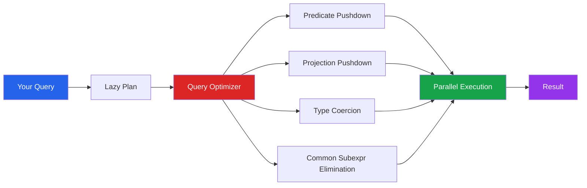

# Polars for EDA

Polars is a DataFrame library written in Rust that delivers 5-50x speed improvements over pandas for most EDA tasks. It uses Apache Arrow columnar format, lazy evaluation with query optimization, and true multi-threaded execution. If you work with datasets larger than a few hundred MB, Polars can dramatically reduce your iteration cycle.

---

## Why Polars for EDA?



| Feature | pandas | Polars |
|---------|--------|--------|
| Backend | NumPy (single-threaded) | Arrow (multi-threaded Rust) |
| Evaluation | Eager only | Eager + Lazy |
| Strings | Python objects (slow) | Arrow UTF-8 (fast) |
| Memory | Copy-heavy | Zero-copy where possible |
| Null handling | NaN (float only) | Native null for all types |
| Index | Row index | No index (by design) |
| Expression API | Method chaining | Expression DSL |

---

## Basics: Reading Data and First Look

```python
import polars as pl
import numpy as np
import time

# Reading data (parallel by default)
# df = pl.read_csv('data.csv')
# df = pl.read_parquet('data.parquet')

# Create sample data
np.random.seed(42)
n = 500_000

df = pl.DataFrame({
    'order_id':    range(1, n + 1),
    'customer_id': np.random.randint(1000, 50000, n),
    'product':     np.random.choice(['Widget', 'Gadget', 'Doohickey', 'Thingamajig'], n),
    'category':    np.random.choice(['Electronics', 'Clothing', 'Food', 'Books'], n),
    'quantity':    np.random.randint(1, 20, n),
    'unit_price':  np.round(np.random.lognormal(3, 0.8, n), 2),
    'region':      np.random.choice(['North', 'South', 'East', 'West'], n),
    'order_date':  pl.Series(np.random.choice(
                       pl.date_range(pl.date(2023, 1, 1), pl.date(2024, 12, 31), eager=True),
                       n
                   )),
})

# Add computed columns
df = df.with_columns(
    (pl.col('quantity') * pl.col('unit_price')).alias('total'),
    pl.col('order_date').dt.month().alias('month'),
    pl.col('order_date').dt.year().alias('year'),
)

# First look
print(df.shape)
print(df.head())
print(df.describe())
print(df.schema)
print(f"Memory: {df.estimated_size() / 1024**2:.1f} MB")
```

---

## Expression System

Polars expressions are the core of the library. They describe transformations without immediately executing them, allowing the optimizer to rewrite your logic.

### Column Selection and Transformation

```python
# Select and rename
result = df.select(
    pl.col('order_id'),
    pl.col('product'),
    pl.col('total').alias('order_total'),
    (pl.col('total') / pl.col('quantity')).alias('effective_price'),
)

# Select by dtype
numeric = df.select(pl.col(pl.Float64, pl.Int64, pl.Int32))

# Select with regex
# price_cols = df.select(pl.col('^.*price.*$'))

# Multiple transformations
result = df.with_columns(
    pl.col('total').log().alias('log_total'),
    pl.col('unit_price').rank().alias('price_rank'),
    pl.col('quantity').cast(pl.Float64).alias('qty_float'),
    pl.when(pl.col('total') > 500)
      .then(pl.lit('high'))
      .when(pl.col('total') > 100)
      .then(pl.lit('medium'))
      .otherwise(pl.lit('low'))
      .alias('value_tier'),
)
print(result.head())
```

### Filtering

```python
# Simple filter
high_value = df.filter(pl.col('total') > 500)

# Multiple conditions
result = df.filter(
    (pl.col('total') > 200) &
    (pl.col('region') == 'North') &
    (pl.col('product').is_in(['Widget', 'Gadget']))
)

# String filtering
# df.filter(pl.col('product').str.contains('Wid'))

# Between
mid_range = df.filter(pl.col('unit_price').is_between(20, 50))

# Null handling
# df.filter(pl.col('unit_price').is_not_null())

print(f"Original: {df.shape[0]:,}, Filtered: {result.shape[0]:,}")
```

---

## Aggregation and GroupBy

```python
# Basic group-by
summary = (
    df.group_by('region')
    .agg(
        pl.col('total').sum().alias('total_revenue'),
        pl.col('total').mean().alias('avg_order'),
        pl.col('total').median().alias('median_order'),
        pl.col('total').std().alias('std_order'),
        pl.col('total').quantile(0.95).alias('p95_order'),
        pl.col('order_id').count().alias('n_orders'),
        pl.col('customer_id').n_unique().alias('n_customers'),
    )
    .sort('total_revenue', descending=True)
)
print(summary)

# Multi-key group-by
product_region = (
    df.group_by(['product', 'region'])
    .agg(
        pl.col('total').sum().alias('revenue'),
        pl.col('total').mean().alias('avg_order'),
        pl.len().alias('orders'),
    )
    .sort(['product', 'revenue'], descending=[False, True])
)
print(product_region)

# Multiple aggregation expressions
monthly = (
    df.group_by(['year', 'month'])
    .agg(
        pl.col('total').sum().alias('revenue'),
        pl.col('order_id').count().alias('orders'),
        (pl.col('total').sum() / pl.col('order_id').count()).alias('aov'),
        pl.col('customer_id').n_unique().alias('customers'),
    )
    .sort(['year', 'month'])
)
print(monthly)
```

---

## Window Functions (over)

Polars window functions use the `.over()` expression to compute group-level values without collapsing rows — equivalent to pandas `groupby().transform()`.

```python
# Add group-level stats as columns
enriched = df.with_columns(
    # Mean total per region
    pl.col('total').mean().over('region').alias('region_avg'),
    # Rank within region
    pl.col('total').rank(descending=True).over('region').alias('rank_in_region'),
    # Percent of region total
    (pl.col('total') / pl.col('total').sum().over('region')).alias('pct_of_region'),
    # Z-score within region
    ((pl.col('total') - pl.col('total').mean().over('region')) /
     pl.col('total').std().over('region')).alias('total_zscore'),
    # Running total within customer
    pl.col('total').cum_sum().over('customer_id').alias('customer_cumtotal'),
)

print(enriched.select(['order_id', 'region', 'total', 'region_avg',
                        'rank_in_region', 'pct_of_region', 'total_zscore']).head(10))
```

### Rolling Windows

```python
# Sort by date first for rolling operations
daily = (
    df.group_by('order_date')
    .agg(pl.col('total').sum().alias('daily_revenue'))
    .sort('order_date')
)

daily_with_ma = daily.with_columns(
    pl.col('daily_revenue').rolling_mean(window_size=7).alias('ma_7'),
    pl.col('daily_revenue').rolling_mean(window_size=30).alias('ma_30'),
    pl.col('daily_revenue').rolling_std(window_size=30).alias('std_30'),
    pl.col('daily_revenue').pct_change().alias('daily_change'),
)
print(daily_with_ma.tail(10))
```

---

## Lazy Evaluation

Lazy evaluation is Polars' killer feature. Instead of computing immediately, operations build a logical plan that the optimizer rewrites before execution.

```python
# Lazy mode: build a plan, execute once
lazy_result = (
    df.lazy()
    .filter(pl.col('total') > 100)
    .with_columns(
        (pl.col('total').log()).alias('log_total'),
        pl.col('order_date').dt.month().alias('month'),
    )
    .group_by(['region', 'month'])
    .agg(
        pl.col('total').sum().alias('revenue'),
        pl.col('log_total').mean().alias('avg_log_total'),
        pl.len().alias('orders'),
    )
    .sort(['region', 'month'])
)

# Inspect the query plan
print(lazy_result.explain())

# Execute
result = lazy_result.collect()
print(result.head())
```

### Scan (Lazy File Reading)

```python
# Lazy reading — only reads columns/rows actually needed
# This is vastly more efficient for large files
#
# lazy_df = pl.scan_csv('huge_file.csv')
# lazy_df = pl.scan_parquet('huge_file.parquet')
#
# result = (
#     lazy_df
#     .filter(pl.col('status') == 'active')
#     .select(['id', 'revenue', 'region'])
#     .group_by('region')
#     .agg(pl.col('revenue').sum())
#     .collect()
# )
# Only the needed columns are read from disk!
```

---

## Descriptive Statistics

```python
def polars_eda_summary(df: pl.DataFrame):
    """Comprehensive EDA summary using Polars."""

    print("=" * 60)
    print("DATASET OVERVIEW")
    print("=" * 60)
    print(f"Shape: {df.shape[0]:,} rows x {df.shape[1]} columns")
    print(f"Memory: {df.estimated_size() / 1024**2:.2f} MB")
    print(f"Schema: {df.schema}")

    # Null report
    null_counts = df.null_count()
    print(f"\nNull counts:\n{null_counts}")

    # Numeric summary
    numeric_cols = [col for col, dtype in zip(df.columns, df.dtypes)
                    if dtype in [pl.Float64, pl.Float32, pl.Int64, pl.Int32, pl.Int16, pl.Int8]]

    if numeric_cols:
        stats = df.select(numeric_cols).describe()
        print(f"\nNumeric summary:\n{stats}")

        # Skewness and kurtosis
        skew_kurt = df.select(
            [pl.col(c).skew().alias(f'{c}_skew') for c in numeric_cols] +
            [pl.col(c).kurtosis().alias(f'{c}_kurt') for c in numeric_cols]
        )
        print(f"\nSkewness & Kurtosis:\n{skew_kurt}")

    # Categorical summary
    str_cols = [col for col, dtype in zip(df.columns, df.dtypes)
                if dtype == pl.Utf8 or dtype == pl.Categorical]

    for col in str_cols:
        vc = df.group_by(col).len().sort('len', descending=True).head(10)
        print(f"\n{col} (n_unique={df[col].n_unique()}):\n{vc}")

polars_eda_summary(df)
```

---

## Pivot and Melt

```python
# Pivot (wide format)
pivot = (
    df.group_by(['region', 'product'])
    .agg(pl.col('total').sum().alias('revenue'))
    .pivot(on='product', index='region', values='revenue')
    .sort('region')
)
print("Pivot table:")
print(pivot)

# Melt (long format)
wide_df = pl.DataFrame({
    'name':    ['Alice', 'Bob', 'Charlie'],
    'math_q1': [85, 92, 78],
    'math_q2': [88, 90, 82],
    'sci_q1':  [92, 85, 90],
})

long_df = wide_df.unpivot(
    index='name',
    on=['math_q1', 'math_q2', 'sci_q1'],
    variable_name='exam',
    value_name='score',
)
print("\nMelted:")
print(long_df)
```

---

## Join Operations

```python
# Create dimension tables
customers = pl.DataFrame({
    'customer_id': range(1000, 50000),
    'segment': np.random.choice(['Premium', 'Standard', 'Basic'], 49000),
    'signup_year': np.random.randint(2018, 2025, 49000),
})

# Inner join
enriched = df.join(customers, on='customer_id', how='inner')

# Left join
enriched = df.join(customers, on='customer_id', how='left')

# Check join quality
print(f"Before: {df.shape[0]:,} rows")
print(f"After:  {enriched.shape[0]:,} rows")
null_pct = enriched.select(pl.col('segment').is_null().mean()).item()
print(f"Unmatched: {null_pct:.1%}")

# Segment analysis after join
segment_stats = (
    enriched
    .group_by('segment')
    .agg(
        pl.col('total').sum().alias('revenue'),
        pl.col('total').mean().alias('avg_order'),
        pl.len().alias('orders'),
        pl.col('customer_id').n_unique().alias('customers'),
    )
    .sort('revenue', descending=True)
)
print(segment_stats)
```

---

## Performance Comparison: Polars vs pandas

```python
import pandas as pd

# Generate large dataset
np.random.seed(42)
n_rows = 5_000_000
data = {
    'id': range(n_rows),
    'group': np.random.choice([f'G{i}' for i in range(100)], n_rows),
    'value': np.random.randn(n_rows),
    'category': np.random.choice(['A', 'B', 'C', 'D'], n_rows),
}

pdf = pd.DataFrame(data)
pldf = pl.DataFrame(data)

benchmarks = {}

# Benchmark 1: GroupBy Aggregation
start = time.perf_counter()
_ = pdf.groupby('group')['value'].agg(['mean', 'std', 'count'])
benchmarks['pandas_groupby'] = time.perf_counter() - start

start = time.perf_counter()
_ = pldf.group_by('group').agg(
    pl.col('value').mean().alias('mean'),
    pl.col('value').std().alias('std'),
    pl.len().alias('count'),
)
benchmarks['polars_groupby'] = time.perf_counter() - start

# Benchmark 2: Filter + Transform
start = time.perf_counter()
_ = pdf[pdf['value'] > 0].assign(doubled=lambda d: d['value'] * 2)
benchmarks['pandas_filter'] = time.perf_counter() - start

start = time.perf_counter()
_ = pldf.filter(pl.col('value') > 0).with_columns((pl.col('value') * 2).alias('doubled'))
benchmarks['polars_filter'] = time.perf_counter() - start

# Benchmark 3: Sort
start = time.perf_counter()
_ = pdf.sort_values('value')
benchmarks['pandas_sort'] = time.perf_counter() - start

start = time.perf_counter()
_ = pldf.sort('value')
benchmarks['polars_sort'] = time.perf_counter() - start

# Benchmark 4: Window function
start = time.perf_counter()
pdf['group_mean'] = pdf.groupby('group')['value'].transform('mean')
benchmarks['pandas_window'] = time.perf_counter() - start

start = time.perf_counter()
_ = pldf.with_columns(pl.col('value').mean().over('group').alias('group_mean'))
benchmarks['polars_window'] = time.perf_counter() - start

# Report
print(f"\nBenchmarks ({n_rows:,} rows)")
print("=" * 50)
operations = ['groupby', 'filter', 'sort', 'window']
for op in operations:
    pd_time = benchmarks[f'pandas_{op}']
    pl_time = benchmarks[f'polars_{op}']
    speedup = pd_time / pl_time
    print(f"  {op:<12} pandas: {pd_time:.3f}s | polars: {pl_time:.3f}s | {speedup:.1f}x faster")
```

---

## Converting Between pandas and Polars

```python
# pandas -> Polars
pdf = pd.DataFrame({'a': [1, 2, 3], 'b': ['x', 'y', 'z']})
pldf = pl.from_pandas(pdf)

# Polars -> pandas
pdf_back = pldf.to_pandas()

# Use Polars for heavy computation, pandas for plotting
import matplotlib.pyplot as plt

result = (
    df.lazy()
    .group_by(['year', 'month', 'region'])
    .agg(pl.col('total').sum().alias('revenue'))
    .sort(['year', 'month'])
    .collect()
)

# Convert to pandas for Matplotlib/Seaborn
result_pd = result.to_pandas()
# Now plot with pandas .plot() or seaborn
```

---

## Complete Polars EDA Pipeline

```python
def polars_eda_pipeline(filepath: str, target: str = None):
    """End-to-end EDA pipeline using Polars lazy evaluation."""

    # 1. Lazy scan (only reads what is needed)
    # lf = pl.scan_csv(filepath)
    # For demonstration, use our existing DataFrame
    lf = df.lazy()

    # 2. Profile numeric columns
    numeric_profile = (
        lf.select(pl.col(pl.Float64, pl.Int64, pl.Int32))
        .collect()
        .describe()
    )
    print("Numeric Profile:")
    print(numeric_profile)

    # 3. Missing data report
    null_report = (
        lf.select([
            pl.col(c).null_count().alias(f'{c}')
            for c in lf.columns
        ])
        .collect()
    )
    print(f"\nNull counts:\n{null_report}")

    # 4. Outlier detection (IQR method)
    print("\nOutlier Report:")
    numeric_cols = [c for c, d in lf.schema.items()
                    if d in [pl.Float64, pl.Int64, pl.Int32]]
    for col in numeric_cols[:5]:
        stats_result = (
            lf.select(
                pl.col(col).quantile(0.25).alias('q1'),
                pl.col(col).quantile(0.75).alias('q3'),
            )
            .collect()
        )
        q1 = stats_result['q1'][0]
        q3 = stats_result['q3'][0]
        iqr = q3 - q1
        n_outliers = (
            lf.filter(
                (pl.col(col) < q1 - 1.5 * iqr) |
                (pl.col(col) > q3 + 1.5 * iqr)
            )
            .select(pl.len())
            .collect()
            .item()
        )
        total = lf.select(pl.len()).collect().item()
        print(f"  {col}: {n_outliers} outliers ({n_outliers/total:.1%})")

    # 5. Correlation matrix
    if len(numeric_cols) >= 2:
        corr_df = lf.select(numeric_cols[:8]).collect().to_pandas()
        corr = corr_df.corr()
        print(f"\nTop Correlations:")
        for i in range(len(corr)):
            for j in range(i+1, len(corr)):
                r = corr.iloc[i, j]
                if abs(r) > 0.3:
                    print(f"  {corr.columns[i]} x {corr.columns[j]}: {r:+.3f}")

    return lf.collect()

# Usage:
# result = polars_eda_pipeline('data.csv', target='churned')
```

---

## Key Takeaways

- Polars delivers **5-50x speedups** over pandas through Rust backend and multi-threaded execution
- **Lazy evaluation** with `.lazy()` enables query optimization: predicate pushdown, projection pushdown, and more
- The **expression API** (`pl.col()`, `.over()`, `.when().then()`) is more composable than pandas method chaining
- **Window functions** via `.over()` replace pandas `groupby().transform()` with cleaner syntax and better performance
- Use **`scan_csv` / `scan_parquet`** for lazy file reads that only load required columns and rows
- Convert to **pandas for plotting** since Matplotlib/Seaborn do not natively support Polars yet
- Polars has **no index** by design — this eliminates an entire class of alignment bugs
- For datasets under 100MB, pandas is perfectly fine; for larger datasets, Polars is a significant upgrade
