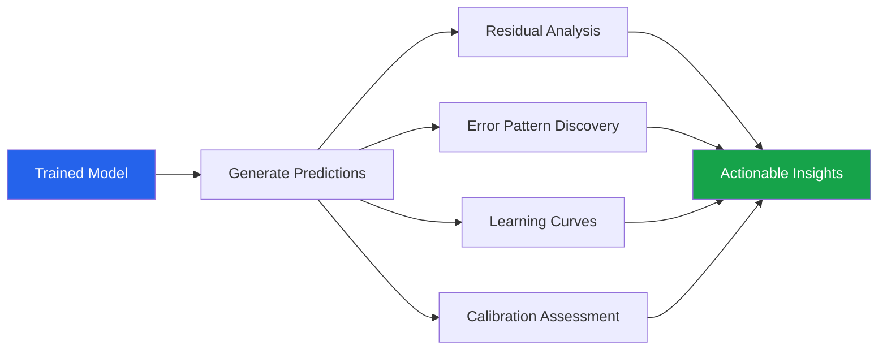
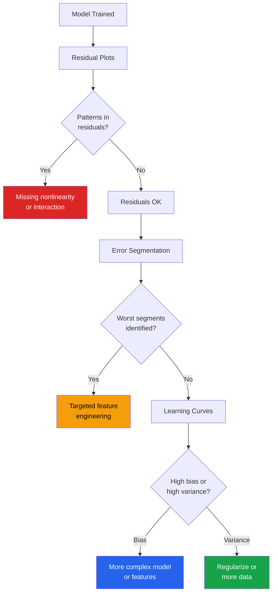

# Post-Modeling EDA

EDA does not end when the model is trained. Post-modeling EDA analyzes residuals, prediction errors, and model behavior to identify systematic failures, data quality issues, and opportunities for improvement.

---

## Workflow



---

## Setup: Simulated Regression Problem

```python
import numpy as np
import pandas as pd
import matplotlib.pyplot as plt
import seaborn as sns
from scipy import stats
from sklearn.model_selection import train_test_split, learning_curve
from sklearn.ensemble import RandomForestRegressor, RandomForestClassifier
from sklearn.linear_model import LinearRegression, LogisticRegression
from sklearn.metrics import (mean_squared_error, mean_absolute_error, r2_score,
                              accuracy_score, roc_curve, auc, calibration_curve)

sns.set_theme(style='whitegrid')
np.random.seed(42)

# Regression dataset
n = 5000
X = pd.DataFrame({
    'feature_1': np.random.normal(0, 1, n),
    'feature_2': np.random.normal(0, 1, n),
    'feature_3': np.random.exponential(2, n),
    'feature_4': np.random.uniform(-1, 1, n),
    'feature_5': np.random.normal(0, 1, n),
    'category': np.random.choice(['A', 'B', 'C'], n),
})

# True relationship: nonlinear with heteroscedasticity
y_true = (3 * X['feature_1'] + 2 * X['feature_2']**2 -
          0.5 * X['feature_3'] + X['feature_1'] * X['feature_4'] +
          np.where(X['category'] == 'A', 5, np.where(X['category'] == 'B', 0, -3)))
noise = np.random.normal(0, 1 + 0.5 * np.abs(X['feature_3']), n)  # heteroscedastic
y = y_true + noise

# Encode category and split
X_encoded = pd.get_dummies(X, columns=['category'], drop_first=True)
X_train, X_test, y_train, y_test = train_test_split(X_encoded, y, test_size=0.2, random_state=42)

# Train models
model_lr = LinearRegression().fit(X_train, y_train)
model_rf = RandomForestRegressor(n_estimators=100, random_state=42).fit(X_train, y_train)

y_pred_lr = model_lr.predict(X_test)
y_pred_rf = model_rf.predict(X_test)

print(f"Linear Regression: R2={r2_score(y_test, y_pred_lr):.4f}, RMSE={np.sqrt(mean_squared_error(y_test, y_pred_lr)):.4f}")
print(f"Random Forest:     R2={r2_score(y_test, y_pred_rf):.4f}, RMSE={np.sqrt(mean_squared_error(y_test, y_pred_rf)):.4f}")
```

---

## Residual Analysis (Regression)

```python
def residual_analysis(y_true, y_pred, model_name="Model", X_test=None):
    """Comprehensive residual analysis for regression models."""
    residuals = y_true - y_pred
    std_residuals = (residuals - residuals.mean()) / residuals.std()

    fig, axes = plt.subplots(2, 3, figsize=(18, 10))

    # 1. Residuals vs Predicted
    axes[0, 0].scatter(y_pred, residuals, alpha=0.3, s=10, color='steelblue')
    axes[0, 0].axhline(y=0, color='red', linestyle='--')
    axes[0, 0].set_xlabel('Predicted')
    axes[0, 0].set_ylabel('Residual')
    axes[0, 0].set_title('Residuals vs Predicted')

    # 2. Actual vs Predicted
    axes[0, 1].scatter(y_true, y_pred, alpha=0.3, s=10, color='steelblue')
    lims = [min(y_true.min(), y_pred.min()), max(y_true.max(), y_pred.max())]
    axes[0, 1].plot(lims, lims, 'r--', linewidth=2)
    axes[0, 1].set_xlabel('Actual')
    axes[0, 1].set_ylabel('Predicted')
    axes[0, 1].set_title(f'Actual vs Predicted (R2={r2_score(y_true, y_pred):.3f})')

    # 3. Residual distribution
    axes[0, 2].hist(residuals, bins=50, edgecolor='white', alpha=0.7, color='steelblue', density=True)
    x_range = np.linspace(residuals.min(), residuals.max(), 100)
    axes[0, 2].plot(x_range, stats.norm.pdf(x_range, residuals.mean(), residuals.std()),
                     'r-', linewidth=2, label='Normal')
    axes[0, 2].set_title(f'Residual Distribution (skew={residuals.skew():.2f})')
    axes[0, 2].legend()

    # 4. QQ plot
    stats.probplot(residuals, dist='norm', plot=axes[1, 0])
    axes[1, 0].set_title('QQ Plot of Residuals')

    # 5. Scale-Location (sqrt |standardized residuals| vs predicted)
    axes[1, 1].scatter(y_pred, np.sqrt(np.abs(std_residuals)), alpha=0.3, s=10, color='steelblue')
    axes[1, 1].set_xlabel('Predicted')
    axes[1, 1].set_ylabel('sqrt(|Standardized Residual|)')
    axes[1, 1].set_title('Scale-Location (check heteroscedasticity)')

    # 6. Residuals vs order (check independence)
    axes[1, 2].plot(range(len(residuals)), residuals.values, alpha=0.5, linewidth=0.5)
    axes[1, 2].axhline(y=0, color='red', linestyle='--')
    axes[1, 2].set_xlabel('Observation Order')
    axes[1, 2].set_ylabel('Residual')
    axes[1, 2].set_title('Residuals vs Order (check autocorrelation)')

    fig.suptitle(f'{model_name} — Residual Analysis', fontsize=14, fontweight='bold')
    plt.tight_layout()
    plt.show()

    # Statistical tests on residuals
    print(f"\n{model_name} Residual Statistics:")
    print(f"  Mean:     {residuals.mean():.4f} (should be ~0)")
    print(f"  Std:      {residuals.std():.4f}")
    print(f"  Skewness: {residuals.skew():.4f}")
    print(f"  Kurtosis: {residuals.kurtosis():.4f}")
    _, p_norm = stats.shapiro(residuals.values[:5000])
    print(f"  Normality (Shapiro p): {p_norm:.4f} {'(normal)' if p_norm > 0.05 else '(non-normal)'}")

    # Durbin-Watson (autocorrelation)
    diffs = np.diff(residuals.values)
    dw = np.sum(diffs**2) / np.sum(residuals.values**2)
    print(f"  Durbin-Watson: {dw:.4f} (2.0 = no autocorrelation)")

residual_analysis(y_test, y_pred_lr, "Linear Regression")
residual_analysis(y_test, y_pred_rf, "Random Forest")
```

---

## Error Pattern Discovery

```python
def error_by_feature(X_test, y_test, y_pred, feature_name):
    """Analyze prediction errors by a specific feature."""
    residuals = y_test - y_pred
    abs_errors = np.abs(residuals)

    fig, axes = plt.subplots(1, 3, figsize=(18, 5))

    # Residuals vs feature
    axes[0].scatter(X_test[feature_name], residuals, alpha=0.3, s=10)
    axes[0].axhline(y=0, color='red', linestyle='--')
    axes[0].set_xlabel(feature_name)
    axes[0].set_ylabel('Residual')
    axes[0].set_title(f'Residuals vs {feature_name}')

    # Absolute error vs feature
    axes[1].scatter(X_test[feature_name], abs_errors, alpha=0.3, s=10, color='coral')
    axes[1].set_xlabel(feature_name)
    axes[1].set_ylabel('|Error|')
    axes[1].set_title(f'Absolute Error vs {feature_name}')

    # Binned error analysis
    bins = pd.qcut(X_test[feature_name], q=10, duplicates='drop')
    binned = pd.DataFrame({'bin': bins, 'abs_error': abs_errors, 'residual': residuals})
    bin_stats = binned.groupby('bin').agg(
        mean_error=('abs_error', 'mean'),
        n=('abs_error', 'count'),
    ).reset_index()
    axes[2].bar(range(len(bin_stats)), bin_stats['mean_error'], color='steelblue')
    axes[2].set_title(f'Mean |Error| by {feature_name} Decile')
    axes[2].set_xlabel('Decile')
    axes[2].set_ylabel('Mean Absolute Error')

    plt.tight_layout()
    plt.show()

# Analyze errors by each feature
for feat in ['feature_1', 'feature_2', 'feature_3']:
    error_by_feature(X_test, y_test, y_pred_rf, feat)
```

### Error Segmentation

```python
def error_segmentation(X_test, y_test, y_pred, threshold_pct=90):
    """Find data segments where the model performs worst."""
    errors = np.abs(y_test - y_pred)
    threshold = np.percentile(errors, threshold_pct)
    high_error_mask = errors > threshold

    print(f"High-Error Segment Analysis (top {100-threshold_pct}% errors)")
    print(f"Threshold: |error| > {threshold:.2f}")
    print(f"High-error count: {high_error_mask.sum()} / {len(errors)}")
    print("=" * 50)

    X_good = X_test[~high_error_mask]
    X_bad = X_test[high_error_mask]

    for col in X_test.columns:
        if X_test[col].dtype in ['float64', 'int64', 'float32']:
            good_mean = X_good[col].mean()
            bad_mean = X_bad[col].mean()
            _, p = stats.mannwhitneyu(X_good[col], X_bad[col], alternative='two-sided')
            if p < 0.05:
                print(f"  {col:<25} good_mean={good_mean:.3f} bad_mean={bad_mean:.3f} p={p:.4f} ***")

error_segmentation(X_test, y_test, y_pred_rf)
```

---

## Learning Curves

```python
def plot_learning_curves(model, X, y, title="Learning Curves"):
    """Plot learning curves to diagnose bias vs variance."""
    train_sizes, train_scores, val_scores = learning_curve(
        model, X, y,
        train_sizes=np.linspace(0.1, 1.0, 10),
        cv=5, scoring='neg_mean_squared_error',
        n_jobs=-1, random_state=42,
    )

    train_rmse = np.sqrt(-train_scores)
    val_rmse = np.sqrt(-val_scores)

    fig, axes = plt.subplots(1, 2, figsize=(14, 5))

    # RMSE
    axes[0].plot(train_sizes, train_rmse.mean(axis=1), 'o-', label='Train', color='steelblue')
    axes[0].fill_between(train_sizes, train_rmse.mean(axis=1) - train_rmse.std(axis=1),
                          train_rmse.mean(axis=1) + train_rmse.std(axis=1), alpha=0.1, color='steelblue')
    axes[0].plot(train_sizes, val_rmse.mean(axis=1), 'o-', label='Validation', color='coral')
    axes[0].fill_between(train_sizes, val_rmse.mean(axis=1) - val_rmse.std(axis=1),
                          val_rmse.mean(axis=1) + val_rmse.std(axis=1), alpha=0.1, color='coral')
    axes[0].set_xlabel('Training Set Size')
    axes[0].set_ylabel('RMSE')
    axes[0].set_title(f'{title} — RMSE')
    axes[0].legend()
    axes[0].grid(True, alpha=0.3)

    # Gap analysis
    gap = val_rmse.mean(axis=1) - train_rmse.mean(axis=1)
    axes[1].plot(train_sizes, gap, 'o-', color='purple')
    axes[1].set_xlabel('Training Set Size')
    axes[1].set_ylabel('Validation - Train RMSE')
    axes[1].set_title('Generalization Gap')
    axes[1].grid(True, alpha=0.3)

    plt.tight_layout()
    plt.show()

    # Diagnosis
    final_gap = gap[-1]
    final_val = val_rmse.mean(axis=1)[-1]
    if final_gap > 0.5 * final_val:
        print("Diagnosis: HIGH VARIANCE (overfitting) — try regularization, more data, simpler model")
    elif final_val > 2 * train_rmse.mean(axis=1)[-1]:
        print("Diagnosis: HIGH VARIANCE — model too complex for data size")
    else:
        print("Diagnosis: Good fit — train and validation converging")

plot_learning_curves(RandomForestRegressor(n_estimators=50, random_state=42),
                      X_encoded, y, "Random Forest")
```

---

## Calibration Plots (Classification)

```python
# Classification setup
y_class = (y > y.median()).astype(int)
X_train_c, X_test_c, y_train_c, y_test_c = train_test_split(X_encoded, y_class, test_size=0.2, random_state=42)

model_lr_c = LogisticRegression(max_iter=1000).fit(X_train_c, y_train_c)
model_rf_c = RandomForestClassifier(n_estimators=100, random_state=42).fit(X_train_c, y_train_c)

prob_lr = model_lr_c.predict_proba(X_test_c)[:, 1]
prob_rf = model_rf_c.predict_proba(X_test_c)[:, 1]

def calibration_analysis(y_true, y_prob, model_name="Model"):
    """Assess probability calibration."""
    fig, axes = plt.subplots(1, 3, figsize=(18, 5))

    # Calibration curve
    fraction_pos, mean_predicted = calibration_curve(y_true, y_prob, n_bins=10)
    axes[0].plot(mean_predicted, fraction_pos, 'o-', label=model_name, color='steelblue')
    axes[0].plot([0, 1], [0, 1], 'r--', label='Perfect calibration')
    axes[0].set_xlabel('Mean Predicted Probability')
    axes[0].set_ylabel('Fraction of Positives')
    axes[0].set_title('Calibration Curve')
    axes[0].legend()

    # Probability distribution
    axes[1].hist(y_prob[y_true == 0], bins=30, alpha=0.5, label='Negative', color='blue', density=True)
    axes[1].hist(y_prob[y_true == 1], bins=30, alpha=0.5, label='Positive', color='red', density=True)
    axes[1].set_xlabel('Predicted Probability')
    axes[1].set_ylabel('Density')
    axes[1].set_title('Probability Distribution by Class')
    axes[1].legend()

    # ROC curve
    fpr, tpr, _ = roc_curve(y_true, y_prob)
    roc_auc = auc(fpr, tpr)
    axes[2].plot(fpr, tpr, label=f'{model_name} (AUC={roc_auc:.3f})', color='steelblue')
    axes[2].plot([0, 1], [0, 1], 'r--')
    axes[2].set_xlabel('False Positive Rate')
    axes[2].set_ylabel('True Positive Rate')
    axes[2].set_title('ROC Curve')
    axes[2].legend()

    fig.suptitle(f'{model_name} — Calibration Analysis', fontweight='bold')
    plt.tight_layout()
    plt.show()

    # Brier score (lower is better)
    brier = np.mean((y_prob - y_true) ** 2)
    print(f"\n{model_name} Calibration Metrics:")
    print(f"  Brier Score: {brier:.4f} (lower = better)")
    print(f"  AUC: {roc_auc:.4f}")

calibration_analysis(y_test_c, prob_lr, "Logistic Regression")
calibration_analysis(y_test_c, prob_rf, "Random Forest")
```

---

## Post-Modeling EDA Checklist



---

## Feature Importance vs SHAP Comparison

```python
def compare_importance_methods(model, X_test, y_test):
    """Compare built-in feature importance with permutation importance."""
    from sklearn.inspection import permutation_importance

    # Built-in (split-based) importance
    if hasattr(model, 'feature_importances_'):
        builtin = pd.Series(model.feature_importances_, index=X_test.columns)
        builtin = builtin.sort_values(ascending=False)
        print("Built-in Feature Importance:")
        for feat, imp in builtin.head(10).items():
            print(f"  {feat:<25} {imp:.4f}")

    # Permutation importance (model-agnostic)
    perm_result = permutation_importance(model, X_test, y_test,
                                          n_repeats=10, random_state=42)
    perm_imp = pd.Series(perm_result.importances_mean, index=X_test.columns)
    perm_imp = perm_imp.sort_values(ascending=False)

    print("\nPermutation Importance:")
    for feat, imp in perm_imp.head(10).items():
        std = perm_result.importances_std[X_test.columns.get_loc(feat)]
        print(f"  {feat:<25} {imp:.4f} (+/- {std:.4f})")

    # Rank comparison
    if hasattr(model, 'feature_importances_'):
        builtin_rank = builtin.rank(ascending=False)
        perm_rank = perm_imp.rank(ascending=False)
        rank_diff = (builtin_rank - perm_rank).abs()
        disagreements = rank_diff[rank_diff > 3]
        if len(disagreements) > 0:
            print("\nRank disagreements (>3 positions apart):")
            for feat, diff in disagreements.items():
                print(f"  {feat}: builtin_rank={builtin_rank[feat]:.0f}, "
                      f"perm_rank={perm_rank[feat]:.0f}")

compare_importance_methods(model_rf, X_test, y_test)
```

---

## Key Takeaways

- **Residual analysis** is the most important post-modeling EDA: patterns in residuals = model shortcomings
- **Residuals vs predicted** should show random scatter — any pattern indicates missing nonlinearity or heteroscedasticity
- **QQ plots of residuals** reveal non-normality, which affects confidence intervals and hypothesis tests
- **Error segmentation** identifies specific data subsets where the model fails — these drive targeted improvements
- **Learning curves** diagnose high bias (underfitting) vs high variance (overfitting) definitively
- **Calibration plots** are essential for classification — a model can have good AUC but terrible probability estimates
- Post-modeling EDA often sends you back to **feature engineering** with specific, data-driven hypotheses
