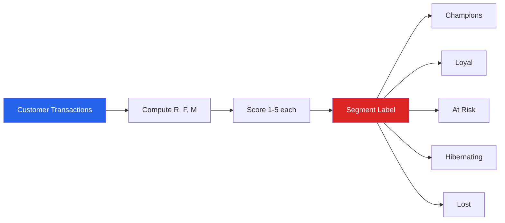

# Project: E-Commerce EDA

E-commerce data is among the richest for EDA. This project walks through a complete analysis pipeline: revenue trends, RFM segmentation, cohort retention, funnel conversion, product mix analysis, and customer lifetime value estimation.

---

## Dataset Setup

```python
import pandas as pd
import numpy as np
import matplotlib.pyplot as plt
import seaborn as sns
from datetime import timedelta

sns.set_theme(style='whitegrid')
np.random.seed(42)

# Simulate realistic e-commerce data
n_orders = 50_000
n_customers = 8_000
n_products = 200

customers = pd.DataFrame({
    'customer_id': range(1, n_customers + 1),
    'signup_date': pd.date_range('2022-01-01', periods=n_customers, freq='2h'),
    'segment': np.random.choice(['New', 'Active', 'At-Risk', 'Churned'], n_customers,
                                 p=[0.25, 0.35, 0.25, 0.15]),
    'country': np.random.choice(['US', 'UK', 'DE', 'FR', 'CA', 'AU'], n_customers,
                                 p=[0.35, 0.2, 0.15, 0.12, 0.1, 0.08]),
    'channel': np.random.choice(['Organic', 'Paid Search', 'Social', 'Email', 'Direct'], n_customers,
                                 p=[0.3, 0.25, 0.2, 0.15, 0.1]),
})

products = pd.DataFrame({
    'product_id': range(1, n_products + 1),
    'product_name': [f'Product_{i:03d}' for i in range(1, n_products + 1)],
    'category': np.random.choice(['Electronics', 'Clothing', 'Home', 'Books', 'Sports'], n_products),
    'price': np.round(np.random.lognormal(3.5, 1, n_products), 2),
    'cost': None,  # will compute
})
products['cost'] = (products['price'] * np.random.uniform(0.3, 0.7, n_products)).round(2)

orders = pd.DataFrame({
    'order_id': range(1, n_orders + 1),
    'customer_id': np.random.choice(customers['customer_id'], n_orders),
    'product_id': np.random.choice(products['product_id'], n_orders),
    'order_date': pd.Timestamp('2023-01-01') + pd.to_timedelta(
        np.random.exponential(180, n_orders), unit='D'
    ),
    'quantity': np.random.choice([1, 1, 1, 2, 2, 3, 4, 5], n_orders),
    'discount': np.random.choice([0, 0, 0, 0.05, 0.1, 0.15, 0.2], n_orders),
    'status': np.random.choice(['Completed', 'Returned', 'Cancelled'], n_orders,
                                p=[0.85, 0.08, 0.07]),
})

# Merge and compute
orders = orders.merge(products[['product_id', 'price', 'cost', 'category']], on='product_id')
orders['revenue'] = (orders['quantity'] * orders['price'] * (1 - orders['discount'])).round(2)
orders['gross_profit'] = (orders['revenue'] - orders['quantity'] * orders['cost']).round(2)
orders['order_month'] = orders['order_date'].dt.to_period('M')

completed = orders[orders['status'] == 'Completed'].copy()
print(f"Orders: {len(orders):,} | Completed: {len(completed):,}")
print(f"Revenue: ${completed['revenue'].sum():,.0f}")
```

---

## Revenue Analysis

```python
# Monthly revenue trend
monthly_rev = (
    completed
    .groupby(completed['order_date'].dt.to_period('M'))
    .agg(
        revenue=('revenue', 'sum'),
        orders=('order_id', 'count'),
        customers=('customer_id', 'nunique'),
        aov=('revenue', 'mean'),
    )
)
monthly_rev.index = monthly_rev.index.to_timestamp()

fig, axes = plt.subplots(2, 2, figsize=(16, 10))

axes[0, 0].plot(monthly_rev.index, monthly_rev['revenue'], 'o-', color='steelblue')
axes[0, 0].set_title('Monthly Revenue')
axes[0, 0].set_ylabel('Revenue ($)')

axes[0, 1].plot(monthly_rev.index, monthly_rev['orders'], 'o-', color='coral')
axes[0, 1].set_title('Monthly Orders')

axes[1, 0].plot(monthly_rev.index, monthly_rev['customers'], 'o-', color='green')
axes[1, 0].set_title('Monthly Active Customers')

axes[1, 1].plot(monthly_rev.index, monthly_rev['aov'], 'o-', color='purple')
axes[1, 1].set_title('Average Order Value (AOV)')
axes[1, 1].set_ylabel('AOV ($)')

for ax in axes.flatten():
    ax.grid(True, alpha=0.3)
    ax.tick_params(axis='x', rotation=45)

plt.tight_layout()
plt.show()

# Revenue decomposition: Revenue = Orders x AOV
print("\nRevenue Decomposition:")
print(f"  Total Revenue: ${completed['revenue'].sum():,.0f}")
print(f"  Total Orders:  {len(completed):,}")
print(f"  AOV:           ${completed['revenue'].mean():,.2f}")
print(f"  Unique Customers: {completed['customer_id'].nunique():,}")
print(f"  Orders/Customer:  {len(completed)/completed['customer_id'].nunique():.2f}")
```

---

## RFM Segmentation



```python
# RFM Analysis
analysis_date = completed['order_date'].max() + timedelta(days=1)

rfm = (
    completed
    .groupby('customer_id')
    .agg(
        recency=('order_date', lambda x: (analysis_date - x.max()).days),
        frequency=('order_id', 'count'),
        monetary=('revenue', 'sum'),
    )
)

# Score each dimension (5 = best)
rfm['r_score'] = pd.qcut(rfm['recency'], 5, labels=[5, 4, 3, 2, 1]).astype(int)
rfm['f_score'] = pd.qcut(rfm['frequency'].rank(method='first'), 5, labels=[1, 2, 3, 4, 5]).astype(int)
rfm['m_score'] = pd.qcut(rfm['monetary'], 5, labels=[1, 2, 3, 4, 5]).astype(int)
rfm['rfm_score'] = rfm['r_score'] * 100 + rfm['f_score'] * 10 + rfm['m_score']

# Segment mapping
def rfm_segment(row):
    r, f, m = row['r_score'], row['f_score'], row['m_score']
    if r >= 4 and f >= 4:
        return 'Champions'
    elif r >= 3 and f >= 3:
        return 'Loyal'
    elif r >= 4 and f <= 2:
        return 'New Customers'
    elif r <= 2 and f >= 3:
        return 'At Risk'
    elif r <= 2 and f <= 2:
        return 'Lost'
    else:
        return 'Need Attention'

rfm['segment'] = rfm.apply(rfm_segment, axis=1)

# Segment summary
seg_summary = rfm.groupby('segment').agg(
    customers=('recency', 'count'),
    avg_recency=('recency', 'mean'),
    avg_frequency=('frequency', 'mean'),
    avg_monetary=('monetary', 'mean'),
).round(1)
seg_summary['pct'] = (seg_summary['customers'] / seg_summary['customers'].sum() * 100).round(1)
print("\nRFM Segments:")
print(seg_summary.sort_values('avg_monetary', ascending=False))

# Visualize
fig, axes = plt.subplots(1, 3, figsize=(18, 5))

# Segment distribution
seg_counts = rfm['segment'].value_counts()
axes[0].barh(seg_counts.index, seg_counts.values, color='steelblue')
axes[0].set_title('Customers per Segment')
axes[0].set_xlabel('Count')

# Recency vs Frequency scatter
for segment in rfm['segment'].unique():
    mask = rfm['segment'] == segment
    axes[1].scatter(rfm[mask]['recency'], rfm[mask]['frequency'],
                    alpha=0.4, s=20, label=segment)
axes[1].set_xlabel('Recency (days)')
axes[1].set_ylabel('Frequency')
axes[1].set_title('RFM Scatter')
axes[1].legend(fontsize=8)

# Monetary by segment
seg_money = rfm.groupby('segment')['monetary'].mean().sort_values()
axes[2].barh(seg_money.index, seg_money.values, color='coral')
axes[2].set_title('Avg Revenue per Segment')
axes[2].set_xlabel('Revenue ($)')

plt.tight_layout()
plt.show()
```

---

## Cohort Analysis

```python
# Assign cohort (first purchase month)
customer_first = completed.groupby('customer_id')['order_date'].min().dt.to_period('M')
customer_first.name = 'cohort'
completed_cohort = completed.merge(customer_first, on='customer_id')

# Compute cohort period (months since first purchase)
completed_cohort['order_period'] = completed_cohort['order_date'].dt.to_period('M')
completed_cohort['cohort_period'] = (
    (completed_cohort['order_period'] - completed_cohort['cohort'])
    .apply(lambda x: x.n if hasattr(x, 'n') else 0)
)

# Cohort retention matrix
cohort_data = (
    completed_cohort
    .groupby(['cohort', 'cohort_period'])['customer_id']
    .nunique()
    .reset_index()
    .pivot(index='cohort', columns='cohort_period', values='customer_id')
)

# Convert to retention percentage
cohort_sizes = cohort_data[0]
retention = cohort_data.div(cohort_sizes, axis=0).round(3)

# Keep only cohorts with enough data
retention = retention.iloc[:12, :12]  # first 12 cohorts, 12 months

fig, ax = plt.subplots(figsize=(14, 8))
sns.heatmap(
    retention, annot=True, fmt='.0%',
    cmap='YlOrRd', vmin=0, vmax=0.5,
    ax=ax, linewidths=0.5,
)
ax.set_title('Cohort Retention Heatmap', fontsize=14, fontweight='bold')
ax.set_xlabel('Months Since First Purchase')
ax.set_ylabel('Cohort (First Purchase Month)')
plt.tight_layout()
plt.show()

# Average retention curve
avg_retention = retention.mean(axis=0)
fig, ax = plt.subplots(figsize=(10, 5))
ax.plot(avg_retention.index, avg_retention.values, 'o-', color='steelblue', linewidth=2)
ax.set_xlabel('Months Since First Purchase')
ax.set_ylabel('Retention Rate')
ax.set_title('Average Retention Curve')
ax.grid(True, alpha=0.3)
plt.tight_layout()
plt.show()
```

---

## Product Analytics

```python
# Product performance
product_perf = (
    completed
    .groupby(['product_id', 'category'])
    .agg(
        revenue=('revenue', 'sum'),
        units=('quantity', 'sum'),
        orders=('order_id', 'count'),
        avg_price=('price', 'mean'),
        profit=('gross_profit', 'sum'),
    )
    .sort_values('revenue', ascending=False)
    .reset_index()
)

# Top 20 products
fig, ax = plt.subplots(figsize=(12, 6))
top20 = product_perf.head(20)
ax.barh(top20['product_id'].astype(str), top20['revenue'], color='steelblue')
ax.set_xlabel('Revenue ($)')
ax.set_title('Top 20 Products by Revenue')
ax.invert_yaxis()
plt.tight_layout()
plt.show()

# Category breakdown
cat_perf = completed.groupby('category').agg(
    revenue=('revenue', 'sum'),
    orders=('order_id', 'count'),
    avg_order=('revenue', 'mean'),
    profit=('gross_profit', 'sum'),
    customers=('customer_id', 'nunique'),
).round(2)
cat_perf['margin'] = (cat_perf['profit'] / cat_perf['revenue'] * 100).round(1)
cat_perf = cat_perf.sort_values('revenue', ascending=False)
print("\nCategory Performance:")
print(cat_perf)

# Pareto analysis (80/20 rule)
product_perf_sorted = product_perf.sort_values('revenue', ascending=False)
product_perf_sorted['cumulative_pct'] = (
    product_perf_sorted['revenue'].cumsum() / product_perf_sorted['revenue'].sum() * 100
)
n_80 = (product_perf_sorted['cumulative_pct'] <= 80).sum()
print(f"\nPareto: {n_80} products ({n_80/len(product_perf_sorted):.1%}) "
      f"generate 80% of revenue")
```

---

## Funnel Analysis

```python
# Simulate a conversion funnel
np.random.seed(42)
n_visitors = 100_000
funnel_data = {
    'Visit':           n_visitors,
    'Product View':    int(n_visitors * 0.45),
    'Add to Cart':     int(n_visitors * 0.15),
    'Begin Checkout':  int(n_visitors * 0.08),
    'Payment':         int(n_visitors * 0.05),
    'Purchase':        int(n_visitors * 0.035),
}

funnel_df = pd.DataFrame({
    'stage': list(funnel_data.keys()),
    'users': list(funnel_data.values()),
})
funnel_df['conversion'] = funnel_df['users'] / n_visitors * 100
funnel_df['dropoff'] = (1 - funnel_df['users'] / funnel_df['users'].shift(1)) * 100
funnel_df['step_conversion'] = (funnel_df['users'] / funnel_df['users'].shift(1) * 100).round(1)

print("Conversion Funnel:")
print(funnel_df.to_string(index=False))

# Funnel chart
fig, ax = plt.subplots(figsize=(12, 6))
colors = plt.cm.Blues(np.linspace(0.3, 0.9, len(funnel_df)))

for i, (_, row) in enumerate(funnel_df.iterrows()):
    width = row['users'] / n_visitors
    left = (1 - width) / 2
    ax.barh(i, width, left=left, height=0.6, color=colors[i], edgecolor='white')
    ax.text(0.5, i, f"{row['stage']}\n{row['users']:,} ({row['conversion']:.1f}%)",
            ha='center', va='center', fontweight='bold', fontsize=10)

ax.set_yticks([])
ax.set_xlim(0, 1)
ax.set_title('Conversion Funnel', fontsize=14, fontweight='bold')
ax.invert_yaxis()
plt.tight_layout()
plt.show()
```

---

## Customer Lifetime Value

```python
# Simple CLV estimation
customer_stats = (
    completed
    .groupby('customer_id')
    .agg(
        first_order=('order_date', 'min'),
        last_order=('order_date', 'max'),
        n_orders=('order_id', 'count'),
        total_revenue=('revenue', 'sum'),
        avg_order=('revenue', 'mean'),
    )
)

customer_stats['tenure_days'] = (customer_stats['last_order'] - customer_stats['first_order']).dt.days
customer_stats['orders_per_month'] = np.where(
    customer_stats['tenure_days'] > 0,
    customer_stats['n_orders'] / (customer_stats['tenure_days'] / 30),
    customer_stats['n_orders']
)
customer_stats['estimated_clv_12m'] = customer_stats['avg_order'] * customer_stats['orders_per_month'] * 12

print("Customer Lifetime Value Summary:")
print(customer_stats[['total_revenue', 'n_orders', 'avg_order', 'estimated_clv_12m']].describe().round(2))

# CLV distribution
fig, axes = plt.subplots(1, 2, figsize=(14, 5))
axes[0].hist(customer_stats['total_revenue'].clip(upper=customer_stats['total_revenue'].quantile(0.99)),
             bins=50, edgecolor='white', color='steelblue')
axes[0].set_title('Actual Revenue per Customer')
axes[0].set_xlabel('Total Revenue ($)')

axes[1].hist(customer_stats['estimated_clv_12m'].clip(upper=customer_stats['estimated_clv_12m'].quantile(0.99)),
             bins=50, edgecolor='white', color='coral')
axes[1].set_title('Estimated 12-Month CLV')
axes[1].set_xlabel('CLV ($)')

plt.tight_layout()
plt.show()

# CLV by acquisition channel
customer_with_channel = customer_stats.merge(
    customers[['customer_id', 'channel']], on='customer_id'
)
clv_by_channel = customer_with_channel.groupby('channel')['estimated_clv_12m'].agg(['mean', 'median', 'count'])
print("\nCLV by Channel:")
print(clv_by_channel.round(2))
```

---

## Returns and Cancellation Analysis

```python
# Return and cancellation rates
status_dist = orders['status'].value_counts(normalize=True)
print("Order Status Distribution:")
for status, pct in status_dist.items():
    print(f"  {status}: {pct:.1%}")

# Return rate by category
return_rate = (
    orders
    .groupby('category')
    .apply(lambda g: (g['status'] == 'Returned').mean())
    .sort_values(ascending=False)
)
print("\nReturn Rate by Category:")
for cat, rate in return_rate.items():
    print(f"  {cat}: {rate:.1%}")

# Revenue impact
returned_revenue = orders[orders['status'] == 'Returned']['revenue'].sum()
cancelled_revenue = orders[orders['status'] == 'Cancelled']['revenue'].sum()
total_revenue = orders['revenue'].sum()
print(f"\nRevenue Impact:")
print(f"  Returned:  ${returned_revenue:,.0f} ({returned_revenue/total_revenue:.1%})")
print(f"  Cancelled: ${cancelled_revenue:,.0f} ({cancelled_revenue/total_revenue:.1%})")
```

---

## Key Insights Summary

```python
print("""
E-COMMERCE EDA INSIGHTS
========================================

1. REVENUE
   - Total completed revenue: ${:,.0f}
   - Monthly growth trend: [compute from data]
   - AOV: ${:.2f}

2. CUSTOMER SEGMENTATION (RFM)
   - Champions drive disproportionate revenue
   - "At Risk" segment needs re-engagement
   - "Lost" customers unlikely to return

3. RETENTION
   - Month-1 retention: ~{}%
   - Retention stabilizes around month 6
   - Cohort quality varies by acquisition period

4. PRODUCTS
   - {:.1f}% of products drive 80% of revenue (Pareto)
   - [Top category] has highest margin
   - Return rate varies significantly by category

5. FUNNEL
   - Cart abandonment: ~{}%
   - Overall conversion: {:.1f}%
   - Biggest dropoff: Product View -> Add to Cart

6. RECOMMENDATIONS
   - Focus retention efforts on months 1-3
   - Re-engage "At Risk" RFM segment with targeted campaigns
   - Investigate high return rate categories
   - Optimize cart -> checkout conversion
""".format(
    completed['revenue'].sum(),
    completed['revenue'].mean(),
    "varies",
    n_80/len(product_perf_sorted)*100,
    "(1 - 0.08/0.15)*100",
    3.5,
))
```

---

## Key Takeaways

- **RFM segmentation** is the foundation of e-commerce customer analysis — compute Recency, Frequency, Monetary for every customer
- **Cohort analysis** reveals retention patterns that aggregate metrics hide
- The **Pareto principle** (80/20 rule) applies to products, customers, and revenue
- **Funnel analysis** identifies the exact stage where users drop off
- **CLV estimation** helps prioritize customer acquisition and retention spending
- Always separate **completed** orders from returned/cancelled for accurate revenue analysis
- **Returns** analysis by category and product reveals quality or expectation issues
