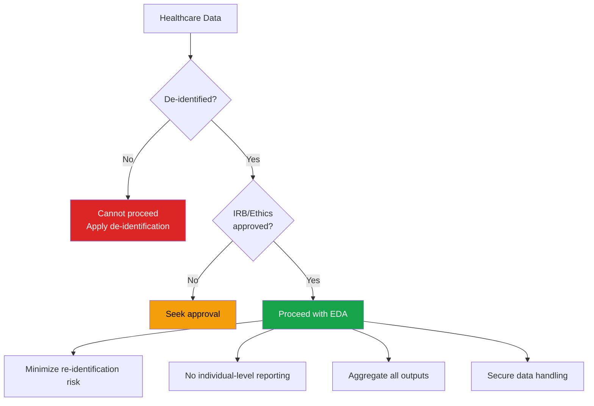

# Project: Healthcare EDA

Healthcare data requires special care: strict privacy regulations, domain-specific distributions, survival outcomes, and ethical considerations. This project demonstrates a complete EDA pipeline for clinical data with emphasis on responsible analysis practices.

---

## Ethical Framework



**Key principles:**
- Never report individual patient records
- Suppress cells with counts < 5 (statistical disclosure control)
- Avoid combinations of quasi-identifiers that could re-identify patients
- All dates should be shifted or generalized to year/quarter

---

## Dataset Setup

```python
import pandas as pd
import numpy as np
import matplotlib.pyplot as plt
import seaborn as sns
from scipy import stats

sns.set_theme(style='whitegrid')
np.random.seed(42)

n_patients = 10_000

# Simulated de-identified patient data
patients = pd.DataFrame({
    'patient_id': [f'P{i:06d}' for i in range(n_patients)],
    'age': np.random.normal(58, 15, n_patients).clip(18, 95).astype(int),
    'sex': np.random.choice(['M', 'F'], n_patients, p=[0.52, 0.48]),
    'bmi': np.random.normal(28, 5, n_patients).clip(15, 55).round(1),
    'systolic_bp': np.random.normal(130, 18, n_patients).clip(80, 220).astype(int),
    'diastolic_bp': np.random.normal(80, 12, n_patients).clip(50, 140).astype(int),
    'cholesterol': np.random.normal(200, 40, n_patients).clip(100, 400).astype(int),
    'glucose': np.random.lognormal(4.5, 0.3, n_patients).clip(60, 500).round(0),
    'hba1c': np.random.normal(6.2, 1.2, n_patients).clip(3.5, 14).round(1),
    'creatinine': np.random.lognormal(0.1, 0.4, n_patients).clip(0.4, 10).round(2),
    'hemoglobin': np.random.normal(13.5, 1.8, n_patients).clip(5, 20).round(1),
    'smoker': np.random.choice(['Never', 'Former', 'Current'], n_patients, p=[0.45, 0.35, 0.2]),
    'diabetes': np.random.choice([0, 1], n_patients, p=[0.7, 0.3]),
    'hypertension': np.random.choice([0, 1], n_patients, p=[0.6, 0.4]),
    'heart_disease': np.random.choice([0, 1], n_patients, p=[0.85, 0.15]),
    'admission_type': np.random.choice(['Emergency', 'Elective', 'Urgent'], n_patients, p=[0.4, 0.35, 0.25]),
    'los_days': np.random.lognormal(1.2, 0.8, n_patients).clip(0, 90).round(0).astype(int),
    'readmitted_30d': np.random.choice([0, 1], n_patients, p=[0.85, 0.15]),
    'mortality': np.random.choice([0, 1], n_patients, p=[0.92, 0.08]),
    'time_to_event_days': np.random.exponential(365, n_patients).clip(1, 1825).astype(int),
    'event_observed': np.random.choice([0, 1], n_patients, p=[0.7, 0.3]),
})

# Clinical logic: higher mortality for older, sicker patients
patients.loc[(patients['age'] > 75) & (patients['heart_disease'] == 1), 'mortality'] = \
    np.random.choice([0, 1], ((patients['age'] > 75) & (patients['heart_disease'] == 1)).sum(), p=[0.7, 0.3])

# Inject some missing values (realistic pattern)
for col in ['bmi', 'cholesterol', 'hba1c', 'hemoglobin']:
    mask = np.random.rand(n_patients) < 0.05
    patients.loc[mask, col] = np.nan

print(f"Patients: {n_patients:,}")
print(f"Columns: {patients.shape[1]}")
```

---

## Demographics Analysis

```python
# Age distribution by sex
fig, axes = plt.subplots(2, 2, figsize=(14, 10))

# Age pyramid
age_bins = np.arange(15, 100, 5)
male_ages = patients[patients['sex'] == 'M']['age']
female_ages = patients[patients['sex'] == 'F']['age']

male_hist, _ = np.histogram(male_ages, bins=age_bins)
female_hist, _ = np.histogram(female_ages, bins=age_bins)

y_pos = range(len(age_bins) - 1)
labels = [f'{age_bins[i]}-{age_bins[i+1]-1}' for i in range(len(age_bins)-1)]

axes[0, 0].barh(y_pos, -male_hist, height=0.8, color='steelblue', label='Male')
axes[0, 0].barh(y_pos, female_hist, height=0.8, color='coral', label='Female')
axes[0, 0].set_yticks(y_pos)
axes[0, 0].set_yticklabels(labels)
axes[0, 0].set_title('Age-Sex Pyramid')
axes[0, 0].legend()
axes[0, 0].set_xlabel('Count')

# BMI distribution
bmi_data = patients['bmi'].dropna()
axes[0, 1].hist(bmi_data, bins=40, edgecolor='white', color='steelblue', alpha=0.7)
axes[0, 1].axvline(18.5, color='green', linestyle='--', label='Underweight')
axes[0, 1].axvline(25, color='orange', linestyle='--', label='Overweight')
axes[0, 1].axvline(30, color='red', linestyle='--', label='Obese')
axes[0, 1].set_title('BMI Distribution')
axes[0, 1].legend(fontsize=8)

# Comorbidity prevalence
comorbidities = ['diabetes', 'hypertension', 'heart_disease']
prevalence = [patients[c].mean() * 100 for c in comorbidities]
axes[1, 0].barh(comorbidities, prevalence, color='steelblue')
axes[1, 0].set_xlabel('Prevalence (%)')
axes[1, 0].set_title('Comorbidity Prevalence')
for i, v in enumerate(prevalence):
    axes[1, 0].text(v + 0.5, i, f'{v:.1f}%', va='center')

# Smoking status
smoke_counts = patients['smoker'].value_counts()
axes[1, 1].pie(smoke_counts.values, labels=smoke_counts.index,
               autopct='%1.1f%%', colors=['#16a34a', '#f59e0b', '#dc2626'])
axes[1, 1].set_title('Smoking Status')

plt.tight_layout()
plt.show()
```

---

## Clinical Values Analysis

```python
# Clinical reference ranges
reference_ranges = {
    'systolic_bp':  (90, 120, 'mmHg'),
    'diastolic_bp': (60, 80, 'mmHg'),
    'cholesterol':  (0, 200, 'mg/dL'),
    'glucose':      (70, 100, 'mg/dL'),
    'hba1c':        (4.0, 5.7, '%'),
    'creatinine':   (0.6, 1.2, 'mg/dL'),
    'hemoglobin':   (12.0, 17.5, 'g/dL'),
}

fig, axes = plt.subplots(2, 4, figsize=(20, 8))
axes = axes.flatten()

for i, (col, (low, high, unit)) in enumerate(reference_ranges.items()):
    if i >= len(axes):
        break
    ax = axes[i]
    data = patients[col].dropna()

    ax.hist(data, bins=40, edgecolor='white', alpha=0.7, color='steelblue')
    ax.axvline(low, color='green', linestyle='--', linewidth=2, label=f'Normal low ({low})')
    ax.axvline(high, color='red', linestyle='--', linewidth=2, label=f'Normal high ({high})')

    pct_abnormal = ((data < low) | (data > high)).mean() * 100
    ax.set_title(f'{col} ({pct_abnormal:.0f}% abnormal)')
    ax.set_xlabel(unit)
    ax.legend(fontsize=7)

axes[-1].set_visible(False)
plt.tight_layout()
plt.show()
```

---

## Outcome Analysis

```python
# Mortality analysis
fig, axes = plt.subplots(2, 2, figsize=(14, 10))

# Mortality rate by age group
patients['age_group'] = pd.cut(patients['age'], bins=[18, 30, 45, 60, 75, 95],
                                labels=['18-29', '30-44', '45-59', '60-74', '75+'])
mort_by_age = patients.groupby('age_group')['mortality'].mean() * 100
axes[0, 0].bar(mort_by_age.index.astype(str), mort_by_age.values, color='coral')
axes[0, 0].set_title('Mortality Rate by Age Group')
axes[0, 0].set_ylabel('Mortality Rate (%)')
for i, v in enumerate(mort_by_age.values):
    axes[0, 0].text(i, v + 0.3, f'{v:.1f}%', ha='center')

# LOS distribution
axes[0, 1].hist(patients['los_days'], bins=50, edgecolor='white', color='steelblue')
axes[0, 1].axvline(patients['los_days'].median(), color='red', linestyle='--',
                    label=f"Median: {patients['los_days'].median():.0f} days")
axes[0, 1].set_title('Length of Stay Distribution')
axes[0, 1].set_xlabel('Days')
axes[0, 1].legend()

# Readmission by admission type
readmit_by_type = patients.groupby('admission_type')['readmitted_30d'].mean() * 100
axes[1, 0].barh(readmit_by_type.index, readmit_by_type.values, color='steelblue')
axes[1, 0].set_xlabel('30-Day Readmission Rate (%)')
axes[1, 0].set_title('Readmission by Admission Type')

# Mortality by comorbidity count
patients['n_comorbidities'] = (
    patients['diabetes'] + patients['hypertension'] + patients['heart_disease']
)
mort_by_comorbid = patients.groupby('n_comorbidities')['mortality'].mean() * 100
axes[1, 1].bar(mort_by_comorbid.index, mort_by_comorbid.values, color='coral')
axes[1, 1].set_title('Mortality by Comorbidity Count')
axes[1, 1].set_xlabel('Number of Comorbidities')
axes[1, 1].set_ylabel('Mortality Rate (%)')

plt.tight_layout()
plt.show()
```

---

## Survival Analysis

```python
# Kaplan-Meier survival estimation (manual implementation)
def kaplan_meier(time, event):
    """Compute Kaplan-Meier survival curve."""
    df_km = pd.DataFrame({'time': time, 'event': event}).sort_values('time')

    unique_times = df_km['time'].unique()
    n_at_risk = len(df_km)
    survival = 1.0
    results = [{'time': 0, 'survival': 1.0, 'n_at_risk': n_at_risk}]

    for t in sorted(unique_times):
        at_time = df_km[df_km['time'] == t]
        d_i = at_time['event'].sum()    # events at time t
        c_i = (at_time['event'] == 0).sum()  # censored at time t

        if n_at_risk > 0 and d_i > 0:
            survival *= (1 - d_i / n_at_risk)

        results.append({
            'time': t,
            'survival': survival,
            'n_at_risk': n_at_risk,
            'events': d_i,
        })

        n_at_risk -= (d_i + c_i)

    return pd.DataFrame(results)

# Overall survival
km_all = kaplan_meier(patients['time_to_event_days'], patients['event_observed'])

# Survival by heart disease status
km_hd = kaplan_meier(
    patients[patients['heart_disease'] == 1]['time_to_event_days'],
    patients[patients['heart_disease'] == 1]['event_observed']
)
km_no_hd = kaplan_meier(
    patients[patients['heart_disease'] == 0]['time_to_event_days'],
    patients[patients['heart_disease'] == 0]['event_observed']
)

fig, ax = plt.subplots(figsize=(12, 6))
ax.step(km_all['time'], km_all['survival'], where='post', label='Overall', color='black', linewidth=2)
ax.step(km_hd['time'], km_hd['survival'], where='post', label='Heart Disease', color='red')
ax.step(km_no_hd['time'], km_no_hd['survival'], where='post', label='No Heart Disease', color='green')
ax.set_xlabel('Days')
ax.set_ylabel('Survival Probability')
ax.set_title('Kaplan-Meier Survival Curves')
ax.legend()
ax.grid(True, alpha=0.3)
ax.set_xlim(0, 1825)
ax.set_ylim(0, 1.05)
plt.tight_layout()
plt.show()

# Log-rank test (manual)
from scipy.stats import chi2

def log_rank_test(time1, event1, time2, event2):
    """Simplified log-rank test."""
    all_times = np.unique(np.concatenate([time1[event1 == 1], time2[event2 == 1]]))
    O1, E1 = 0, 0

    for t in all_times:
        n1 = (time1 >= t).sum()
        n2 = (time2 >= t).sum()
        d1 = ((time1 == t) & (event1 == 1)).sum()
        d2 = ((time2 == t) & (event2 == 1)).sum()
        n = n1 + n2
        d = d1 + d2

        if n > 0:
            e1 = d * n1 / n
            O1 += d1
            E1 += e1

    V = E1 * (1 - E1 / O1) if O1 > 0 else 0.001
    chi2_stat = (O1 - E1)**2 / max(V, 0.001)
    p_value = 1 - chi2.cdf(chi2_stat, df=1)
    return chi2_stat, p_value

stat, p = log_rank_test(
    patients[patients['heart_disease'] == 1]['time_to_event_days'].values,
    patients[patients['heart_disease'] == 1]['event_observed'].values,
    patients[patients['heart_disease'] == 0]['time_to_event_days'].values,
    patients[patients['heart_disease'] == 0]['event_observed'].values,
)
print(f"Log-rank test: chi2={stat:.3f}, p={p:.4f}")
```

---

## Comorbidity Analysis

```python
# Comorbidity co-occurrence
comorbid_cols = ['diabetes', 'hypertension', 'heart_disease']
comorbid_matrix = patients[comorbid_cols].T.dot(patients[comorbid_cols])

# Normalize by total patients
comorbid_pct = (comorbid_matrix / n_patients * 100).round(1)

fig, ax = plt.subplots(figsize=(8, 6))
sns.heatmap(comorbid_pct, annot=True, fmt='.1f', cmap='Reds', ax=ax)
ax.set_title('Comorbidity Co-occurrence (% of patients)')
plt.tight_layout()
plt.show()

# Odds ratio: diabetes and heart disease
a = ((patients['diabetes'] == 1) & (patients['heart_disease'] == 1)).sum()
b = ((patients['diabetes'] == 1) & (patients['heart_disease'] == 0)).sum()
c = ((patients['diabetes'] == 0) & (patients['heart_disease'] == 1)).sum()
d = ((patients['diabetes'] == 0) & (patients['heart_disease'] == 0)).sum()

odds_ratio = (a * d) / (b * c)
se_log_or = np.sqrt(1/a + 1/b + 1/c + 1/d)
ci_lower = np.exp(np.log(odds_ratio) - 1.96 * se_log_or)
ci_upper = np.exp(np.log(odds_ratio) + 1.96 * se_log_or)

print(f"\nDiabetes-Heart Disease Association:")
print(f"  Odds Ratio: {odds_ratio:.3f}")
print(f"  95% CI: ({ci_lower:.3f}, {ci_upper:.3f})")
```

---

## Risk Factor Analysis

```python
# Compare clinical values: mortality vs survival
outcomes = {0: 'Survived', 1: 'Died'}
clinical_cols = ['age', 'bmi', 'systolic_bp', 'cholesterol', 'glucose', 'hba1c', 'creatinine']

fig, axes = plt.subplots(2, 4, figsize=(20, 8))
axes = axes.flatten()

for i, col in enumerate(clinical_cols):
    survived = patients[patients['mortality'] == 0][col].dropna()
    died = patients[patients['mortality'] == 1][col].dropna()

    axes[i].hist(survived, bins=30, alpha=0.5, label='Survived', color='green', density=True)
    axes[i].hist(died, bins=30, alpha=0.5, label='Died', color='red', density=True)

    # Statistical test
    stat, p = stats.mannwhitneyu(survived, died, alternative='two-sided')
    d = (survived.mean() - died.mean()) / np.sqrt((survived.std()**2 + died.std()**2) / 2)

    axes[i].set_title(f'{col}\np={p:.3f}, d={d:+.2f}')
    axes[i].legend(fontsize=8)

axes[-1].set_visible(False)
plt.suptitle('Clinical Values: Survived vs Died', fontsize=14, fontweight='bold')
plt.tight_layout()
plt.show()
```

---

## Privacy-Preserving Reporting

```python
def safe_report(df, group_col, value_col, min_cell_size=5):
    """Generate a report that suppresses small cell counts."""
    grouped = df.groupby(group_col)[value_col].agg(['count', 'mean', 'std', 'median'])

    # Suppress cells with count < min_cell_size
    mask = grouped['count'] < min_cell_size
    if mask.any():
        print(f"WARNING: {mask.sum()} groups suppressed (n < {min_cell_size})")
        grouped.loc[mask, ['mean', 'std', 'median']] = np.nan
        grouped.loc[mask, 'count'] = '<5'

    return grouped

# Safe reporting example
report = safe_report(patients, 'age_group', 'los_days')
print("\nLength of Stay by Age Group (privacy-preserving):")
print(report)
```

---

## Key Takeaways

- **Ethics first**: always confirm data is de-identified and analysis is approved before starting EDA
- **Clinical reference ranges** provide natural thresholds for flagging abnormal values — more meaningful than statistical outliers
- **Survival analysis** (Kaplan-Meier, log-rank test) is the correct framework for time-to-event data with censoring
- **Comorbidity co-occurrence** and **odds ratios** reveal disease relationships beyond simple prevalence
- **Privacy-preserving reporting** with minimum cell size suppression prevents re-identification
- Always stratify outcomes by **age and sex** before drawing conclusions — these are the strongest confounders in healthcare
- **Length of stay** is typically right-skewed (lognormal) — use median, not mean, for central tendency
- **Domain knowledge** is essential: a statistically significant finding may be clinically irrelevant, and vice versa
