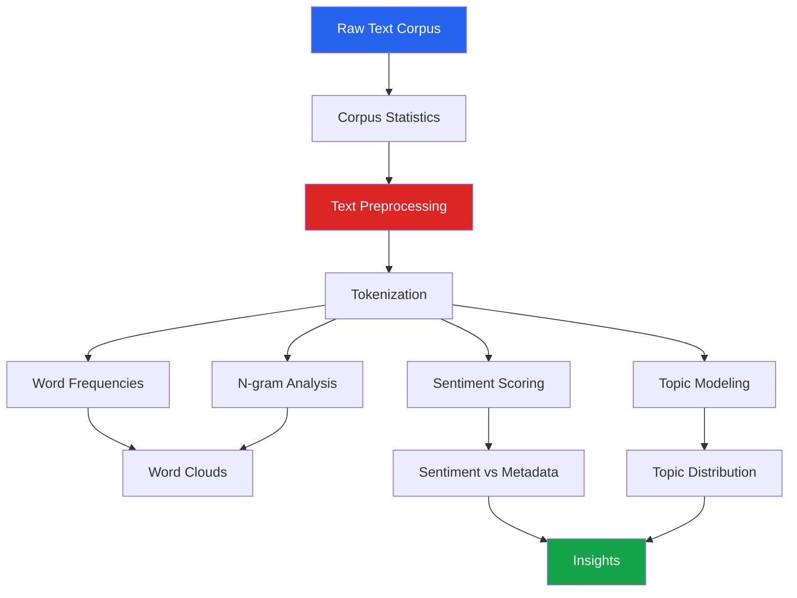

# Project: Text/NLP EDA

Text data requires fundamentally different EDA techniques than numeric data. This project walks through a complete text analysis pipeline: corpus statistics, word frequencies, n-gram analysis, sentiment scoring, topic modeling, and visualization.

---

## Dataset Setup

```python
import pandas as pd
import numpy as np
import matplotlib.pyplot as plt
import seaborn as sns
from collections import Counter
import re
import string

sns.set_theme(style='whitegrid')
np.random.seed(42)

# Simulated product reviews dataset
reviews_data = [
    "This product is absolutely amazing! Best purchase I've ever made.",
    "Terrible quality. Broke after just two days of use.",
    "Decent product for the price. Nothing special but gets the job done.",
    "Five stars! The customer service was incredibly helpful and responsive.",
    "Waste of money. The description was completely misleading.",
    "Love it! Perfect size and great build quality. Highly recommend.",
    "Arrived damaged. Packaging was inadequate for shipping.",
    "Exactly what I needed. Works perfectly with my existing setup.",
    "Disappointed. Much smaller than expected from the photos.",
    "Outstanding value. Can not believe how good this is for the price.",
]

# Generate more realistic data by sampling and augmenting
np.random.seed(42)
n_reviews = 5000

# Vocabulary pools for generating reviews
positive_phrases = [
    "excellent quality", "highly recommend", "best purchase", "amazing product",
    "works perfectly", "great value", "love this", "exceeded expectations",
    "fast shipping", "easy to use", "well made", "fantastic", "superb",
    "outstanding", "perfect for my needs", "very happy", "solid construction",
]
negative_phrases = [
    "terrible quality", "waste of money", "broke quickly", "very disappointed",
    "misleading description", "poor packaging", "does not work", "cheaply made",
    "horrible experience", "arrived damaged", "would not recommend", "fell apart",
    "complete junk", "customer service unhelpful", "returned immediately",
]
neutral_phrases = [
    "decent product", "nothing special", "average quality", "works as expected",
    "acceptable for price", "could be better", "met expectations", "fair enough",
    "standard quality", "does the job", "no complaints", "reasonable",
]

categories = ['Electronics', 'Clothing', 'Home & Garden', 'Books', 'Sports']
sentiments = np.random.choice(['positive', 'neutral', 'negative'], n_reviews, p=[0.45, 0.3, 0.25])

def generate_review(sentiment):
    if sentiment == 'positive':
        phrases = np.random.choice(positive_phrases, np.random.randint(2, 5))
        rating = np.random.choice([4, 5], p=[0.3, 0.7])
    elif sentiment == 'negative':
        phrases = np.random.choice(negative_phrases, np.random.randint(2, 5))
        rating = np.random.choice([1, 2], p=[0.6, 0.4])
    else:
        phrases = np.random.choice(neutral_phrases, np.random.randint(2, 4))
        rating = np.random.choice([3, 4], p=[0.6, 0.4])
    return '. '.join(phrases) + '.', rating

reviews_list = [generate_review(s) for s in sentiments]
df = pd.DataFrame({
    'review_id': range(n_reviews),
    'text': [r[0] for r in reviews_list],
    'rating': [r[1] for r in reviews_list],
    'category': np.random.choice(categories, n_reviews),
    'date': pd.date_range('2023-01-01', periods=n_reviews, freq='2h'),
    'helpful_votes': np.random.poisson(3, n_reviews),
    'verified': np.random.choice([True, False], n_reviews, p=[0.7, 0.3]),
})

print(f"Reviews: {len(df):,}")
print(f"Columns: {df.columns.tolist()}")
print(f"Avg review length: {df['text'].str.len().mean():.0f} chars")
```

---

## Step 1: Corpus Statistics

```python
# Basic text statistics
df['char_count'] = df['text'].str.len()
df['word_count'] = df['text'].str.split().str.len()
df['sentence_count'] = df['text'].str.count(r'[.!?]+')
df['avg_word_length'] = df['text'].apply(
    lambda x: np.mean([len(w) for w in x.split()]) if x else 0
)
df['exclamation_count'] = df['text'].str.count('!')
df['question_count'] = df['text'].str.count(r'\?')
df['upper_ratio'] = df['text'].apply(
    lambda x: sum(1 for c in x if c.isupper()) / max(len(x), 1)
)

# Summary
text_stats = df[['char_count', 'word_count', 'sentence_count',
                  'avg_word_length', 'exclamation_count']].describe().round(2)
print("Corpus Statistics:")
print(text_stats)

fig, axes = plt.subplots(2, 3, figsize=(18, 10))

# Word count distribution
axes[0, 0].hist(df['word_count'], bins=30, edgecolor='white', color='steelblue')
axes[0, 0].set_title('Words per Review')
axes[0, 0].set_xlabel('Word Count')

# Character count
axes[0, 1].hist(df['char_count'], bins=30, edgecolor='white', color='coral')
axes[0, 1].set_title('Characters per Review')

# Word count by rating
for rating in sorted(df['rating'].unique()):
    subset = df[df['rating'] == rating]['word_count']
    axes[0, 2].hist(subset, bins=20, alpha=0.5, label=f'{rating} stars')
axes[0, 2].set_title('Word Count by Rating')
axes[0, 2].legend()

# Avg word length distribution
axes[1, 0].hist(df['avg_word_length'], bins=30, edgecolor='white', color='green')
axes[1, 0].set_title('Average Word Length')

# Rating distribution
rating_counts = df['rating'].value_counts().sort_index()
axes[1, 1].bar(rating_counts.index, rating_counts.values, color='steelblue')
axes[1, 1].set_title('Rating Distribution')
axes[1, 1].set_xlabel('Stars')

# Reviews over time
df.set_index('date').resample('W')['review_id'].count().plot(ax=axes[1, 2])
axes[1, 2].set_title('Reviews per Week')

plt.tight_layout()
plt.show()
```

---

## Step 2: Text Preprocessing

```python
def preprocess_text(text):
    """Clean and normalize text for analysis."""
    text = text.lower()
    text = re.sub(r'http\S+|www\S+', '', text)    # remove URLs
    text = re.sub(r'<[^>]+>', '', text)             # remove HTML
    text = re.sub(r'[^\w\s]', ' ', text)            # remove punctuation
    text = re.sub(r'\d+', '', text)                  # remove numbers
    text = re.sub(r'\s+', ' ', text).strip()         # normalize whitespace
    return text

# Stop words (basic set)
STOP_WORDS = set([
    'the', 'a', 'an', 'is', 'it', 'in', 'to', 'of', 'and', 'for',
    'was', 'with', 'on', 'that', 'this', 'are', 'be', 'has', 'have',
    'had', 'not', 'but', 'or', 'as', 'at', 'by', 'from', 'were',
    'which', 'there', 'been', 'their', 'its', 'my', 'i', 'me', 'we',
    'you', 'he', 'she', 'they', 'them', 'our', 'your', 'will',
    'would', 'could', 'should', 'very', 'so', 'just', 'than', 'more',
    'can', 'do', 'does', 'did', 'am', 'what', 'when', 'where', 'how',
    'all', 'each', 'every', 'both', 'few', 'some', 'no', 'about',
])

def tokenize(text, remove_stopwords=True):
    """Tokenize and optionally remove stop words."""
    tokens = text.split()
    if remove_stopwords:
        tokens = [t for t in tokens if t not in STOP_WORDS and len(t) > 2]
    return tokens

df['clean_text'] = df['text'].apply(preprocess_text)
df['tokens'] = df['clean_text'].apply(tokenize)
df['n_tokens'] = df['tokens'].str.len()

print(f"Sample preprocessing:")
print(f"  Original:  {df['text'].iloc[0][:80]}...")
print(f"  Cleaned:   {df['clean_text'].iloc[0][:80]}...")
print(f"  Tokens:    {df['tokens'].iloc[0][:10]}...")
```

---

## Step 3: Word Frequency Analysis

```python
# Global word frequencies
all_tokens = [token for tokens in df['tokens'] for token in tokens]
word_freq = Counter(all_tokens)

# Top 30 words
top_30 = word_freq.most_common(30)

fig, ax = plt.subplots(figsize=(14, 6))
words, counts = zip(*top_30)
ax.barh(range(len(words)), counts, color='steelblue')
ax.set_yticks(range(len(words)))
ax.set_yticklabels(words)
ax.invert_yaxis()
ax.set_xlabel('Frequency')
ax.set_title('Top 30 Most Common Words')
plt.tight_layout()
plt.show()

# Zipf's law check
rank = np.arange(1, len(word_freq) + 1)
frequencies = sorted(word_freq.values(), reverse=True)

fig, ax = plt.subplots(figsize=(10, 6))
ax.loglog(rank, frequencies, 'b.', alpha=0.5, markersize=3)
ax.set_xlabel('Rank (log)')
ax.set_ylabel('Frequency (log)')
ax.set_title("Zipf's Law: Word Frequency vs Rank")
ax.grid(True, alpha=0.3)
plt.tight_layout()
plt.show()

print(f"\nVocabulary size: {len(word_freq):,}")
print(f"Total tokens: {len(all_tokens):,}")
print(f"Hapax legomena (appear once): {sum(1 for c in word_freq.values() if c == 1):,}")
```

---

## Step 4: N-gram Analysis

```python
from itertools import islice

def get_ngrams(tokens, n):
    """Generate n-grams from token list."""
    return [' '.join(tokens[i:i+n]) for i in range(len(tokens) - n + 1)]

# Bigrams
all_bigrams = []
for tokens in df['tokens']:
    all_bigrams.extend(get_ngrams(tokens, 2))
bigram_freq = Counter(all_bigrams)

# Trigrams
all_trigrams = []
for tokens in df['tokens']:
    all_trigrams.extend(get_ngrams(tokens, 3))
trigram_freq = Counter(all_trigrams)

fig, axes = plt.subplots(1, 2, figsize=(16, 6))

# Top bigrams
top_bigrams = bigram_freq.most_common(20)
words_b, counts_b = zip(*top_bigrams)
axes[0].barh(range(len(words_b)), counts_b, color='steelblue')
axes[0].set_yticks(range(len(words_b)))
axes[0].set_yticklabels(words_b)
axes[0].invert_yaxis()
axes[0].set_title('Top 20 Bigrams')

# Top trigrams
top_trigrams = trigram_freq.most_common(15)
words_t, counts_t = zip(*top_trigrams)
axes[1].barh(range(len(words_t)), counts_t, color='coral')
axes[1].set_yticks(range(len(words_t)))
axes[1].set_yticklabels(words_t)
axes[1].invert_yaxis()
axes[1].set_title('Top 15 Trigrams')

plt.tight_layout()
plt.show()
```

---

## Step 5: Sentiment Analysis

```python
# Simple lexicon-based sentiment (no external dependencies)
POSITIVE_WORDS = set([
    'good', 'great', 'excellent', 'amazing', 'love', 'best', 'perfect',
    'fantastic', 'wonderful', 'outstanding', 'superb', 'recommend',
    'happy', 'satisfied', 'quality', 'solid', 'impressed', 'exceeded',
    'brilliant', 'comfortable', 'beautiful', 'easy', 'fast', 'reliable',
])

NEGATIVE_WORDS = set([
    'bad', 'terrible', 'horrible', 'worst', 'hate', 'awful', 'poor',
    'disappointed', 'waste', 'broken', 'cheap', 'useless', 'junk',
    'defective', 'misleading', 'unhelpful', 'frustrating', 'returned',
    'damaged', 'failed', 'ugly', 'slow', 'unreliable', 'flimsy',
])

def simple_sentiment(tokens):
    """Compute sentiment score from token list."""
    pos = sum(1 for t in tokens if t in POSITIVE_WORDS)
    neg = sum(1 for t in tokens if t in NEGATIVE_WORDS)
    total = pos + neg
    if total == 0:
        return 0.0
    return (pos - neg) / total

df['sentiment_score'] = df['tokens'].apply(simple_sentiment)
df['sentiment_label'] = pd.cut(df['sentiment_score'],
                                bins=[-1.01, -0.1, 0.1, 1.01],
                                labels=['Negative', 'Neutral', 'Positive'])

# Sentiment distribution
fig, axes = plt.subplots(1, 3, figsize=(18, 5))

# Score distribution
axes[0].hist(df['sentiment_score'], bins=30, edgecolor='white', color='steelblue')
axes[0].set_title('Sentiment Score Distribution')
axes[0].set_xlabel('Score')

# Label counts
label_counts = df['sentiment_label'].value_counts()
axes[1].bar(label_counts.index, label_counts.values,
            color=['#dc2626', '#f59e0b', '#16a34a'])
axes[1].set_title('Sentiment Distribution')

# Sentiment vs rating
sentiment_by_rating = df.groupby('rating')['sentiment_score'].mean()
axes[2].bar(sentiment_by_rating.index, sentiment_by_rating.values, color='steelblue')
axes[2].set_title('Avg Sentiment by Rating')
axes[2].set_xlabel('Star Rating')
axes[2].set_ylabel('Avg Sentiment Score')

plt.tight_layout()
plt.show()

# Sentiment-rating correlation
r, p = stats.pearsonr(df['rating'], df['sentiment_score'])
print(f"Correlation between rating and sentiment: r={r:.3f}, p={p:.4f}")
```

---

## Step 6: Word Frequency by Sentiment

```python
# Words most associated with positive vs negative reviews
positive_tokens = [t for _, row in df[df['sentiment_label'] == 'Positive'].iterrows()
                   for t in row['tokens']]
negative_tokens = [t for _, row in df[df['sentiment_label'] == 'Negative'].iterrows()
                   for t in row['tokens']]

pos_freq = Counter(positive_tokens)
neg_freq = Counter(negative_tokens)

# Words that differentiate positive from negative
def differential_words(freq_a, freq_b, top_n=20):
    """Find words most associated with group A vs group B."""
    all_words = set(freq_a.keys()) | set(freq_b.keys())
    total_a = sum(freq_a.values())
    total_b = sum(freq_b.values())

    diffs = []
    for word in all_words:
        rate_a = freq_a.get(word, 0) / total_a
        rate_b = freq_b.get(word, 0) / total_b
        if freq_a.get(word, 0) + freq_b.get(word, 0) >= 10:  # min frequency
            diffs.append({
                'word': word,
                'positive_rate': rate_a,
                'negative_rate': rate_b,
                'diff': rate_a - rate_b,
            })

    diff_df = pd.DataFrame(diffs).sort_values('diff', ascending=False)
    return diff_df

diff = differential_words(pos_freq, neg_freq)

fig, ax = plt.subplots(figsize=(12, 8))
top = diff.head(15)
bottom = diff.tail(15)
combined = pd.concat([top, bottom])

colors = ['#16a34a' if d > 0 else '#dc2626' for d in combined['diff']]
ax.barh(combined['word'], combined['diff'] * 10000, color=colors)
ax.set_xlabel('Differential Rate (x10000)')
ax.set_title('Words Most Associated with Positive (green) vs Negative (red)')
ax.axvline(0, color='black', linewidth=0.5)
plt.tight_layout()
plt.show()
```

---

## Step 7: Topic Modeling (Simple LDA-like)

```python
from sklearn.feature_extraction.text import CountVectorizer
from sklearn.decomposition import LatentDirichletAllocation

# Create document-term matrix
vectorizer = CountVectorizer(
    max_features=1000,
    min_df=5,
    max_df=0.8,
    stop_words='english',
)
dtm = vectorizer.fit_transform(df['clean_text'])
feature_names = vectorizer.get_feature_names_out()

print(f"Document-Term Matrix: {dtm.shape}")

# Fit LDA
n_topics = 5
lda = LatentDirichletAllocation(
    n_components=n_topics,
    random_state=42,
    max_iter=20,
    learning_method='online',
)
doc_topics = lda.fit_transform(dtm)

# Display topics
print("\nDiscovered Topics:")
print("=" * 50)
for topic_idx, topic in enumerate(lda.components_):
    top_words = [feature_names[i] for i in topic.argsort()[-10:][::-1]]
    print(f"  Topic {topic_idx + 1}: {', '.join(top_words)}")

# Assign dominant topic to each document
df['dominant_topic'] = doc_topics.argmax(axis=1)
df['topic_confidence'] = doc_topics.max(axis=1)

# Topic distribution
fig, axes = plt.subplots(1, 2, figsize=(14, 5))

topic_counts = df['dominant_topic'].value_counts().sort_index()
axes[0].bar(topic_counts.index, topic_counts.values, color='steelblue')
axes[0].set_title('Document Count by Topic')
axes[0].set_xlabel('Topic')

# Topic vs rating
topic_rating = df.groupby('dominant_topic')['rating'].mean()
axes[1].bar(topic_rating.index, topic_rating.values, color='coral')
axes[1].set_title('Average Rating by Topic')
axes[1].set_xlabel('Topic')
axes[1].set_ylabel('Average Rating')

plt.tight_layout()
plt.show()
```

---

## Step 8: Word Cloud

```python
from wordcloud import WordCloud

def plot_wordcloud(text_data, title, ax, colormap='Blues'):
    """Generate and plot a word cloud."""
    wc = WordCloud(
        width=800, height=400,
        background_color='white',
        max_words=100,
        colormap=colormap,
        collocations=False,
    ).generate(text_data)

    ax.imshow(wc, interpolation='bilinear')
    ax.set_title(title, fontsize=14, fontweight='bold')
    ax.axis('off')

fig, axes = plt.subplots(1, 3, figsize=(20, 5))

# All reviews
all_text = ' '.join(df['clean_text'])
plot_wordcloud(all_text, 'All Reviews', axes[0])

# Positive reviews
pos_text = ' '.join(df[df['sentiment_label'] == 'Positive']['clean_text'])
plot_wordcloud(pos_text, 'Positive Reviews', axes[1], 'Greens')

# Negative reviews
neg_text = ' '.join(df[df['sentiment_label'] == 'Negative']['clean_text'])
plot_wordcloud(neg_text, 'Negative Reviews', axes[2], 'Reds')

plt.tight_layout()
plt.show()
```

---

## Step 9: Category-Level Text Analysis

```python
# Words unique to each category
category_words = {}
for cat in df['category'].unique():
    cat_tokens = [t for _, row in df[df['category'] == cat].iterrows() for t in row['tokens']]
    category_words[cat] = Counter(cat_tokens)

# TF-IDF-like importance per category
print("\nDistinctive Words by Category:")
print("=" * 50)
for cat, freq in category_words.items():
    total_cat = sum(freq.values())
    total_all = sum(sum(f.values()) for f in category_words.values())

    scored = []
    for word, count in freq.items():
        if count >= 5:
            tf = count / total_cat
            df_count = sum(1 for f in category_words.values() if word in f)
            idf = np.log(len(category_words) / df_count)
            scored.append((word, tf * idf))

    scored.sort(key=lambda x: x[1], reverse=True)
    top_words = [w for w, s in scored[:8]]
    print(f"  {cat}: {', '.join(top_words)}")
```

---

## Text EDA Workflow



---

## Key Takeaways

- **Corpus statistics** (word counts, character counts, vocabulary size) provide the first picture of text data
- **Zipf's law** should hold for natural language — deviations indicate unusual text sources
- **N-grams** capture multi-word phrases that single-word frequencies miss
- **Lexicon-based sentiment** is fast and interpretable; model-based (VADER, transformers) is more accurate
- **Differential word frequency** (positive vs negative) reveals the actual vocabulary that distinguishes sentiments
- **Topic modeling** (LDA) discovers latent themes without manual labeling
- **Word clouds** are effective for presentations but not for rigorous analysis — always back them with frequency tables
- **Preprocessing choices** (stemming, stop words, n-gram range) significantly affect downstream analysis
