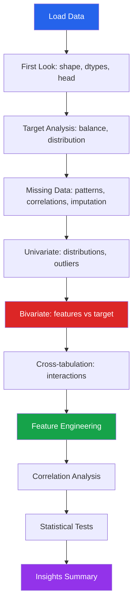

# Project: Titanic EDA

The Titanic dataset is the quintessential EDA exercise. This walkthrough covers every step from raw data to actionable insights, demonstrating a systematic EDA methodology that transfers to any classification dataset.

---

## Dataset Overview

```python
import pandas as pd
import numpy as np
import matplotlib.pyplot as plt
import seaborn as sns
from scipy import stats

sns.set_theme(style='whitegrid', palette='muted')

# Load dataset (from seaborn built-in or Kaggle)
df = sns.load_dataset('titanic')

print(f"Shape: {df.shape}")
print(f"\nColumn types:\n{df.dtypes}")
print(f"\nFirst 5 rows:")
df.head()
```

---

## Step 1: First Look

```python
def first_look(df):
    """Comprehensive first look at the dataset."""
    print("=" * 60)
    print("DATASET OVERVIEW")
    print("=" * 60)
    print(f"Rows: {df.shape[0]:,}")
    print(f"Columns: {df.shape[1]}")
    print(f"Duplicates: {df.duplicated().sum()}")
    print(f"Memory: {df.memory_usage(deep=True).sum() / 1024:.1f} KB")

    print(f"\n{'Column':<15} {'Type':<12} {'Non-Null':<10} {'Null%':<8} {'Unique':<8}")
    print("-" * 55)
    for col in df.columns:
        dtype = str(df[col].dtype)
        non_null = df[col].notna().sum()
        null_pct = f"{df[col].isna().mean()*100:.1f}%"
        unique = df[col].nunique()
        print(f"{col:<15} {dtype:<12} {non_null:<10} {null_pct:<8} {unique:<8}")

first_look(df)
```

---

## Step 2: Target Variable Analysis

```python
fig, axes = plt.subplots(1, 3, figsize=(15, 4))

# Survival counts
survived_counts = df['survived'].value_counts()
axes[0].bar(['Died', 'Survived'], survived_counts.values,
            color=['#dc2626', '#16a34a'])
for i, v in enumerate(survived_counts.values):
    axes[0].text(i, v + 5, str(v), ha='center', fontweight='bold')
axes[0].set_title('Survival Counts')
axes[0].set_ylabel('Count')

# Survival rate
survival_rate = df['survived'].mean()
axes[1].pie([survival_rate, 1 - survival_rate],
            labels=['Survived', 'Died'],
            colors=['#16a34a', '#dc2626'],
            autopct='%1.1f%%', startangle=90,
            textprops={'fontsize': 12})
axes[1].set_title(f'Survival Rate: {survival_rate:.1%}')

# By class
class_survival = df.groupby('class')['survived'].mean()
axes[2].barh(class_survival.index, class_survival.values, color='steelblue')
for i, v in enumerate(class_survival.values):
    axes[2].text(v + 0.01, i, f'{v:.1%}', va='center')
axes[2].set_title('Survival Rate by Class')
axes[2].set_xlabel('Survival Rate')

plt.tight_layout()
plt.show()

print(f"\nTarget balance: {survived_counts[0]}/{survived_counts[1]} "
      f"(ratio: {survived_counts[0]/survived_counts[1]:.2f}:1)")
```

---

## Step 3: Missing Data

```python
# Missing data analysis
missing = df.isna().sum()
missing_pct = (df.isna().mean() * 100).round(1)
missing_df = pd.DataFrame({'count': missing, 'pct': missing_pct})
missing_df = missing_df[missing_df['count'] > 0].sort_values('pct', ascending=False)

print("Missing Data:")
print(missing_df)
print(f"\nTotal missing cells: {df.isna().sum().sum()} / {df.size} ({df.isna().sum().sum()/df.size:.1%})")

# Visualize missing patterns
fig, axes = plt.subplots(1, 2, figsize=(14, 5))

# Bar chart
axes[0].barh(missing_df.index, missing_df['pct'], color='coral')
axes[0].set_xlabel('Missing %')
axes[0].set_title('Missing Data by Column')
for i, (idx, row) in enumerate(missing_df.iterrows()):
    axes[0].text(row['pct'] + 0.5, i, f"{row['pct']}%", va='center')

# Does missingness correlate with survival?
missing_cols = missing_df.index.tolist()
for col in ['age', 'deck']:
    if col in df.columns:
        survival_with = df[df[col].notna()]['survived'].mean()
        survival_without = df[df[col].isna()]['survived'].mean()
        print(f"\n{col} — survival when present: {survival_with:.1%}, when missing: {survival_without:.1%}")

# Missing age pattern
axes[1].hist(df[df['age'].notna()]['age'], bins=30, alpha=0.7, label='Age present', color='steelblue')
axes[1].set_title('Age Distribution (non-missing)')
axes[1].set_xlabel('Age')
axes[1].legend()

plt.tight_layout()
plt.show()
```

### Imputation Strategy

```python
# Age: impute by class and sex median (better than global median)
age_medians = df.groupby(['pclass', 'sex'])['age'].median()
print("Age medians by class and sex:")
print(age_medians)

df['age_imputed'] = df.apply(
    lambda row: age_medians.get((row['pclass'], row['sex']), df['age'].median())
    if pd.isna(row['age']) else row['age'],
    axis=1
)

# Embarked: fill with mode (only 2 missing)
df['embarked'] = df['embarked'].fillna(df['embarked'].mode()[0])

# Deck: too many missing (77%) — create has_deck feature instead
if 'deck' in df.columns:
    df['has_deck'] = df['deck'].notna().astype(int)

print(f"\nAfter imputation — remaining missing: {df[['age_imputed', 'embarked']].isna().sum().sum()}")
```

---

## Step 4: Univariate Analysis

```python
# Numeric distributions
numeric_cols = ['age_imputed', 'fare', 'sibsp', 'parch']
fig, axes = plt.subplots(2, 2, figsize=(14, 10))
axes = axes.flatten()

for i, col in enumerate(numeric_cols):
    data = df[col].dropna()
    axes[i].hist(data, bins=40, edgecolor='white', alpha=0.7, color='steelblue')
    axes[i].axvline(data.mean(), color='red', linestyle='--', label=f'Mean: {data.mean():.1f}')
    axes[i].axvline(data.median(), color='green', linestyle='--', label=f'Median: {data.median():.1f}')
    axes[i].set_title(f'{col} (skew={data.skew():.2f})')
    axes[i].legend(fontsize=9)

plt.tight_layout()
plt.show()

# Categorical distributions
cat_cols = ['sex', 'class', 'embarked', 'who', 'alone']
fig, axes = plt.subplots(1, 5, figsize=(20, 4))

for i, col in enumerate(cat_cols):
    vc = df[col].value_counts()
    axes[i].bar(vc.index.astype(str), vc.values, color='steelblue')
    axes[i].set_title(col)
    axes[i].tick_params(axis='x', rotation=45)

plt.tight_layout()
plt.show()
```

---

## Step 5: Bivariate Analysis — Survival Factors

```python
fig, axes = plt.subplots(2, 3, figsize=(18, 10))

# 1. Sex
survival_by_sex = df.groupby('sex')['survived'].mean()
axes[0, 0].bar(survival_by_sex.index, survival_by_sex.values, color=['steelblue', 'coral'])
for i, v in enumerate(survival_by_sex.values):
    axes[0, 0].text(i, v + 0.02, f'{v:.1%}', ha='center', fontweight='bold')
axes[0, 0].set_title('Survival by Sex')
axes[0, 0].set_ylabel('Survival Rate')

# 2. Class
survival_by_class = df.groupby('pclass')['survived'].mean()
axes[0, 1].bar(survival_by_class.index.astype(str), survival_by_class.values, color='steelblue')
for i, v in enumerate(survival_by_class.values):
    axes[0, 1].text(i, v + 0.02, f'{v:.1%}', ha='center', fontweight='bold')
axes[0, 1].set_title('Survival by Class')

# 3. Age (histogram by survival)
df[df['survived'] == 0]['age_imputed'].hist(bins=30, alpha=0.5, ax=axes[0, 2], label='Died', color='#dc2626')
df[df['survived'] == 1]['age_imputed'].hist(bins=30, alpha=0.5, ax=axes[0, 2], label='Survived', color='#16a34a')
axes[0, 2].set_title('Age Distribution by Survival')
axes[0, 2].legend()

# 4. Fare (log scale)
df[df['survived'] == 0]['fare'].hist(bins=30, alpha=0.5, ax=axes[1, 0], label='Died', color='#dc2626')
df[df['survived'] == 1]['fare'].hist(bins=30, alpha=0.5, ax=axes[1, 0], label='Survived', color='#16a34a')
axes[1, 0].set_title('Fare Distribution by Survival')
axes[1, 0].legend()

# 5. Embarkation
survival_by_embarked = df.groupby('embarked')['survived'].mean()
axes[1, 1].bar(survival_by_embarked.index, survival_by_embarked.values, color='steelblue')
for i, v in enumerate(survival_by_embarked.values):
    axes[1, 1].text(i, v + 0.02, f'{v:.1%}', ha='center', fontweight='bold')
axes[1, 1].set_title('Survival by Embarkation')

# 6. Family size
df['family_size'] = df['sibsp'] + df['parch'] + 1
survival_by_family = df.groupby('family_size')['survived'].mean()
axes[1, 2].bar(survival_by_family.index, survival_by_family.values, color='steelblue')
axes[1, 2].set_title('Survival by Family Size')
axes[1, 2].set_xlabel('Family Size')

plt.tight_layout()
plt.show()
```

---

## Step 6: Cross-Tabulation Analysis

```python
# Sex x Class survival
cross_tab = pd.crosstab(
    [df['sex'], df['class']],
    df['survived'],
    margins=True,
    normalize='index',
).round(3)
print("Survival rate by Sex and Class:")
print(cross_tab)

# Heatmap of survival rates
pivot_survival = df.pivot_table(
    values='survived', index='sex', columns='class', aggfunc='mean'
)

fig, ax = plt.subplots(figsize=(8, 4))
sns.heatmap(pivot_survival, annot=True, fmt='.1%', cmap='RdYlGn',
            vmin=0, vmax=1, ax=ax)
ax.set_title('Survival Rate: Sex x Class')
plt.tight_layout()
plt.show()

# Chi-squared test: is survival independent of sex?
contingency = pd.crosstab(df['sex'], df['survived'])
chi2, p, dof, expected = stats.chi2_contingency(contingency)
print(f"\nChi-squared test (sex vs survived): X2={chi2:.2f}, p={p:.2e}")
print(f"Conclusion: Sex and survival are {'dependent' if p < 0.05 else 'independent'}")
```

---

## Step 7: Feature Engineering

```python
# Age groups
df['age_group'] = pd.cut(
    df['age_imputed'],
    bins=[0, 5, 12, 18, 35, 50, 65, 100],
    labels=['Infant', 'Child', 'Teen', 'Young Adult', 'Adult', 'Middle Age', 'Senior']
)

# Fare bins
df['fare_bin'] = pd.qcut(df['fare'].fillna(df['fare'].median()), q=5,
                          labels=['Very Low', 'Low', 'Medium', 'High', 'Very High'])

# Family categories
df['family_cat'] = np.where(
    df['family_size'] == 1, 'Alone',
    np.where(df['family_size'] <= 3, 'Small', 'Large')
)

# Is child
df['is_child'] = (df['age_imputed'] < 16).astype(int)

# Title extraction (from name if available)
# df['title'] = df['name'].str.extract(r' ([A-Za-z]+)\.')[0]

# Analyze engineered features
fig, axes = plt.subplots(1, 3, figsize=(18, 5))

# Age group survival
age_surv = df.groupby('age_group')['survived'].mean()
axes[0].bar(age_surv.index.astype(str), age_surv.values, color='steelblue')
axes[0].set_title('Survival by Age Group')
axes[0].tick_params(axis='x', rotation=45)

# Fare bin survival
fare_surv = df.groupby('fare_bin')['survived'].mean()
axes[1].bar(fare_surv.index.astype(str), fare_surv.values, color='steelblue')
axes[1].set_title('Survival by Fare Bin')
axes[1].tick_params(axis='x', rotation=45)

# Family category survival
fam_surv = df.groupby('family_cat')['survived'].mean()
axes[2].bar(fam_surv.index, fam_surv.values, color='steelblue')
axes[2].set_title('Survival by Family Category')

for ax in axes:
    ax.set_ylabel('Survival Rate')

plt.tight_layout()
plt.show()
```

---

## Step 8: Correlation Analysis

```python
# Correlation with target
numeric = df.select_dtypes(include='number')
corr_with_survival = numeric.corr()['survived'].sort_values(ascending=False)

print("Correlation with Survival:")
for feat, r in corr_with_survival.items():
    if feat != 'survived':
        bar = "#" * int(abs(r) * 40)
        sign = "+" if r > 0 else "-"
        print(f"  {feat:<20} {r:+.3f} {sign}{bar}")

# Full correlation heatmap
fig, ax = plt.subplots(figsize=(10, 8))
mask = np.triu(np.ones_like(numeric.corr(), dtype=bool))
sns.heatmap(numeric.corr(), mask=mask, annot=True, fmt='.2f',
            cmap='RdBu_r', center=0, square=True, ax=ax)
ax.set_title('Correlation Matrix')
plt.tight_layout()
plt.show()
```

---

## Step 9: Statistical Tests

```python
# Gender effect
male_survival = df[df['sex'] == 'male']['survived']
female_survival = df[df['sex'] == 'female']['survived']
stat, p = stats.mannwhitneyu(male_survival, female_survival)
print(f"Male vs Female survival: U={stat:.0f}, p={p:.2e}")

# Age effect
survived_ages = df[df['survived'] == 1]['age_imputed']
died_ages = df[df['survived'] == 0]['age_imputed']
stat, p = stats.mannwhitneyu(survived_ages, died_ages)
cohens_d = (survived_ages.mean() - died_ages.mean()) / np.sqrt(
    (survived_ages.std()**2 + died_ages.std()**2) / 2
)
print(f"Age (survived vs died): U={stat:.0f}, p={p:.4f}, Cohen's d={cohens_d:.3f}")

# Fare effect
survived_fares = df[df['survived'] == 1]['fare'].dropna()
died_fares = df[df['survived'] == 0]['fare'].dropna()
stat, p = stats.mannwhitneyu(survived_fares, died_fares)
print(f"Fare (survived vs died): U={stat:.0f}, p={p:.2e}")

# Class independence
contingency = pd.crosstab(df['pclass'], df['survived'])
chi2, p, dof, expected = stats.chi2_contingency(contingency)
cramers_v = np.sqrt(chi2 / (contingency.sum().sum() * (min(contingency.shape) - 1)))
print(f"\nClass vs Survived: X2={chi2:.2f}, p={p:.2e}, Cramer's V={cramers_v:.3f}")
```

---

## Step 10: Key Insights Summary

```python
insights = """
TITANIC EDA — KEY INSIGHTS
========================================

1. SURVIVAL RATE: 38.4% survived (342/891)

2. STRONGEST PREDICTORS:
   - Sex: Women had 74.2% survival vs 18.9% for men
   - Class: 1st=62.9%, 2nd=47.3%, 3rd=24.2%
   - Fare: Higher fare strongly associated with survival
   - Age: Children (<16) had higher survival (59%)

3. INTERACTION EFFECTS:
   - 1st-class women: 96.8% survival
   - 3rd-class men: 13.5% survival
   - "Women and children first" is clearly visible

4. MISSING DATA:
   - Age: 19.9% missing — imputed by class/sex median
   - Deck: 77.2% missing — used has_deck binary feature
   - Embarked: 0.2% missing — filled with mode

5. FEATURE ENGINEERING:
   - family_size = sibsp + parch + 1
   - Optimal family size for survival: 2-4 members
   - Solo travelers and large families had lower survival

6. DISTRIBUTIONS:
   - Fare is heavily right-skewed (log transform recommended)
   - Age is roughly normal (slight right skew)
   - Most passengers were in 3rd class

7. RECOMMENDATIONS FOR MODELING:
   - Sex, Pclass, Fare, Age are must-have features
   - Consider interaction: sex x class
   - Log-transform fare before modeling
   - Encode family_size or family_cat
"""
print(insights)
```

---

## EDA Process Diagram



---

## Key Takeaways

- Follow a **systematic process**: overview, target, missing, univariate, bivariate, engineering, statistics, insights
- **Missing data analysis** is not just counting nulls — check if missingness correlates with the target
- **Cross-tabulation** reveals interaction effects that univariate analysis misses (sex x class is the key interaction here)
- **Feature engineering** during EDA (family_size, age_group) is not just for modeling — it reveals patterns
- **Statistical tests** confirm what visualizations suggest; report effect sizes alongside p-values
- Always end with a **written insights summary** — this is the deliverable from EDA, not the code
