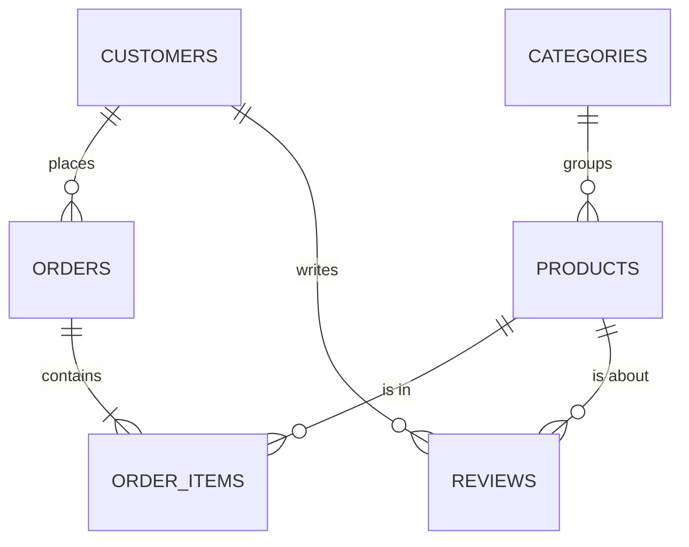
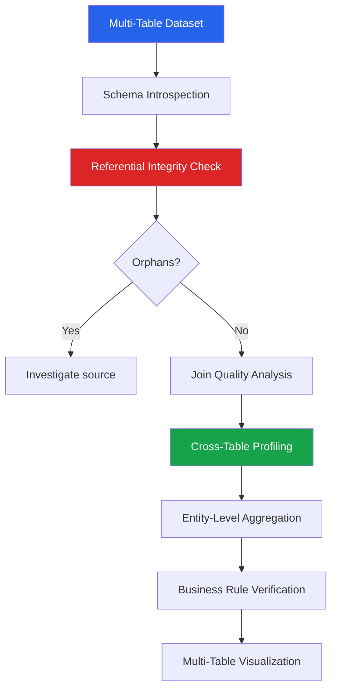

# Relational Data EDA

Real-world data rarely lives in a single table. Databases have normalized schemas with foreign keys, junction tables, and hierarchical relationships. EDA on relational data requires understanding the schema structure, verifying referential integrity, and profiling data across table boundaries.

---

## Schema Introspection



```python
import pandas as pd
import numpy as np
import matplotlib.pyplot as plt
import seaborn as sns

sns.set_theme(style='whitegrid')
np.random.seed(42)

# Simulated relational database
n_customers = 5000
n_products = 200
n_orders = 20000
n_order_items = 50000
n_reviews = 8000

# Tables
customers = pd.DataFrame({
    'customer_id': range(1, n_customers + 1),
    'name': [f'Customer_{i}' for i in range(1, n_customers + 1)],
    'email': [f'user{i}@email.com' for i in range(1, n_customers + 1)],
    'signup_date': pd.date_range('2020-01-01', periods=n_customers, freq='3h'),
    'country': np.random.choice(['US', 'UK', 'DE', 'FR', 'CA'], n_customers, p=[0.4, 0.2, 0.15, 0.15, 0.1]),
    'tier': np.random.choice(['Bronze', 'Silver', 'Gold', 'Platinum'], n_customers, p=[0.4, 0.3, 0.2, 0.1]),
})

categories = pd.DataFrame({
    'category_id': range(1, 11),
    'category_name': ['Electronics', 'Clothing', 'Home', 'Books', 'Sports',
                       'Toys', 'Beauty', 'Food', 'Auto', 'Garden'],
})

products = pd.DataFrame({
    'product_id': range(1, n_products + 1),
    'product_name': [f'Product_{i:03d}' for i in range(1, n_products + 1)],
    'category_id': np.random.randint(1, 11, n_products),
    'price': np.round(np.random.lognormal(3.5, 1, n_products), 2),
    'created_date': pd.date_range('2019-01-01', periods=n_products, freq='3D'),
})

orders = pd.DataFrame({
    'order_id': range(1, n_orders + 1),
    'customer_id': np.random.choice(customers['customer_id'], n_orders),
    'order_date': pd.Timestamp('2023-01-01') + pd.to_timedelta(
        np.random.exponential(200, n_orders), unit='D'),
    'status': np.random.choice(['completed', 'returned', 'cancelled'], n_orders, p=[0.85, 0.08, 0.07]),
})

order_items = pd.DataFrame({
    'item_id': range(1, n_order_items + 1),
    'order_id': np.random.choice(orders['order_id'], n_order_items),
    'product_id': np.random.choice(products['product_id'], n_order_items),
    'quantity': np.random.randint(1, 5, n_order_items),
    'unit_price': np.round(np.random.lognormal(3.5, 1, n_order_items), 2),
})

reviews = pd.DataFrame({
    'review_id': range(1, n_reviews + 1),
    'customer_id': np.random.choice(customers['customer_id'], n_reviews),
    'product_id': np.random.choice(products['product_id'], n_reviews),
    'rating': np.random.choice([1, 2, 3, 4, 5], n_reviews, p=[0.05, 0.1, 0.2, 0.35, 0.3]),
    'review_date': pd.Timestamp('2023-01-01') + pd.to_timedelta(
        np.random.exponential(200, n_reviews), unit='D'),
})

# Inject some orphan records (integrity issues)
orphan_orders = pd.DataFrame({
    'order_id': range(n_orders + 1, n_orders + 51),
    'customer_id': range(n_customers + 100, n_customers + 150),  # non-existent customers
    'order_date': pd.Timestamp('2024-06-01'),
    'status': 'completed',
})
orders = pd.concat([orders, orphan_orders], ignore_index=True)

# Schema registry
tables = {
    'customers': customers,
    'categories': categories,
    'products': products,
    'orders': orders,
    'order_items': order_items,
    'reviews': reviews,
}
```

### Automated Schema Profiling

```python
def schema_overview(tables):
    """Generate overview of all tables in a relational schema."""
    print("SCHEMA OVERVIEW")
    print("=" * 70)

    total_rows = 0
    total_cols = 0
    total_memory = 0

    for name, df in tables.items():
        rows = len(df)
        cols = len(df.columns)
        mem = df.memory_usage(deep=True).sum() / 1024**2
        total_rows += rows
        total_cols += cols
        total_memory += mem

        print(f"\n  {name}")
        print(f"    Rows: {rows:,} | Columns: {cols} | Memory: {mem:.2f} MB")
        print(f"    Columns: {', '.join(df.columns)}")
        print(f"    Dtypes: {dict(df.dtypes.value_counts())}")

        # Potential primary key
        for col in df.columns:
            if df[col].nunique() == len(df) and not df[col].isna().any():
                print(f"    Likely PK: {col}")
                break

        # Missing data
        missing = df.isna().sum()
        if missing.sum() > 0:
            missing_cols = missing[missing > 0]
            print(f"    Missing: {dict(missing_cols)}")

    print(f"\n  TOTAL: {len(tables)} tables, {total_rows:,} rows, "
          f"{total_cols} columns, {total_memory:.2f} MB")

schema_overview(tables)
```

---

## Referential Integrity Checks

```python
def check_referential_integrity(parent_df, child_df, parent_key, child_key,
                                  parent_name, child_name):
    """Check foreign key integrity between two tables."""
    parent_values = set(parent_df[parent_key])
    child_values = set(child_df[child_key].dropna())

    orphans = child_values - parent_values       # in child but not parent
    unused = parent_values - child_values         # in parent but never referenced

    n_orphan_rows = child_df[~child_df[child_key].isin(parent_values)].shape[0]

    result = {
        'relationship': f'{child_name}.{child_key} -> {parent_name}.{parent_key}',
        'parent_count': len(parent_values),
        'child_distinct': len(child_values),
        'orphan_values': len(orphans),
        'orphan_rows': n_orphan_rows,
        'unused_parent': len(unused),
        'coverage': len(child_values & parent_values) / max(len(child_values), 1) * 100,
    }

    status = "OK" if len(orphans) == 0 else "INTEGRITY VIOLATION"
    print(f"\n  [{status}] {result['relationship']}")
    print(f"    Parent values: {result['parent_count']:,}")
    print(f"    Child distinct FK values: {result['child_distinct']:,}")
    print(f"    Orphan FK values: {result['orphan_values']}")
    print(f"    Orphan rows: {result['orphan_rows']:,}")
    print(f"    Unused parent keys: {result['unused_parent']:,}")
    print(f"    FK coverage: {result['coverage']:.1f}%")

    return result

print("REFERENTIAL INTEGRITY CHECK")
print("=" * 60)

# Check all foreign key relationships
integrity_results = []
integrity_results.append(
    check_referential_integrity(customers, orders, 'customer_id', 'customer_id', 'customers', 'orders'))
integrity_results.append(
    check_referential_integrity(orders, order_items, 'order_id', 'order_id', 'orders', 'order_items'))
integrity_results.append(
    check_referential_integrity(products, order_items, 'product_id', 'product_id', 'products', 'order_items'))
integrity_results.append(
    check_referential_integrity(customers, reviews, 'customer_id', 'customer_id', 'customers', 'reviews'))
integrity_results.append(
    check_referential_integrity(products, reviews, 'product_id', 'product_id', 'products', 'reviews'))
integrity_results.append(
    check_referential_integrity(categories, products, 'category_id', 'category_id', 'categories', 'products'))
```

---

## Join Quality Analysis

```python
def analyze_join(left, right, on, how='left', left_name='left', right_name='right'):
    """Analyze the quality and impact of a join operation."""
    print(f"\nJOIN ANALYSIS: {left_name} {how.upper()} JOIN {right_name} ON {on}")
    print("=" * 60)

    # Pre-join stats
    print(f"  Before join:")
    print(f"    {left_name}: {len(left):,} rows")
    print(f"    {right_name}: {len(right):,} rows")

    # Check cardinality
    left_unique = left[on].nunique()
    right_unique = right[on].nunique()
    left_dupes = left[on].duplicated().any()
    right_dupes = right[on].duplicated().any()

    if not left_dupes and not right_dupes:
        cardinality = "1:1"
    elif not left_dupes and right_dupes:
        cardinality = "1:M"
    elif left_dupes and not right_dupes:
        cardinality = "M:1"
    else:
        cardinality = "M:M (DANGER)"

    print(f"\n  Cardinality: {cardinality}")
    print(f"    {left_name}.{on}: {left_unique:,} unique values {'(has dupes)' if left_dupes else '(all unique)'}")
    print(f"    {right_name}.{on}: {right_unique:,} unique values {'(has dupes)' if right_dupes else '(all unique)'}")

    # Perform join with indicator
    result = left.merge(right, on=on, how='outer', indicator=True, suffixes=('_left', '_right'))
    merge_counts = result['_merge'].value_counts()

    print(f"\n  After outer join: {len(result):,} rows")
    print(f"    both:       {merge_counts.get('both', 0):,}")
    print(f"    left_only:  {merge_counts.get('left_only', 0):,}")
    print(f"    right_only: {merge_counts.get('right_only', 0):,}")

    # Fan-out check
    actual_result = left.merge(right, on=on, how=how)
    fanout_ratio = len(actual_result) / len(left)
    if fanout_ratio > 1.05:
        print(f"\n  WARNING: Join caused {fanout_ratio:.2f}x fan-out ({len(actual_result):,} rows)")
        print(f"  This means right table has multiple matches per left row.")
    else:
        print(f"\n  Fan-out ratio: {fanout_ratio:.4f} (OK)")

    return actual_result

# Analyze key joins
orders_with_customers = analyze_join(orders, customers, 'customer_id',
                                      'left', 'orders', 'customers')
```

---

## Cross-Table Profiling

```python
def cross_table_profile(tables, relationships):
    """Profile metrics across related tables."""
    print("\nCROSS-TABLE PROFILING")
    print("=" * 60)

    # Customer-level aggregation across all tables
    customer_orders = orders.groupby('customer_id').agg(
        n_orders=('order_id', 'count'),
        first_order=('order_date', 'min'),
        last_order=('order_date', 'max'),
    )

    customer_items = (
        order_items
        .merge(orders[['order_id', 'customer_id']], on='order_id')
        .groupby('customer_id')
        .agg(
            n_items=('item_id', 'count'),
            total_spend=('unit_price', lambda x: (x * order_items.loc[x.index, 'quantity']).sum()),
            n_products=('product_id', 'nunique'),
        )
    )

    customer_reviews_agg = reviews.groupby('customer_id').agg(
        n_reviews=('review_id', 'count'),
        avg_rating=('rating', 'mean'),
    )

    # Combine
    customer_profile = (
        customers
        .merge(customer_orders, on='customer_id', how='left')
        .merge(customer_items, on='customer_id', how='left')
        .merge(customer_reviews_agg, on='customer_id', how='left')
    )

    # Fill NaN for customers with no activity
    customer_profile['n_orders'] = customer_profile['n_orders'].fillna(0).astype(int)
    customer_profile['n_items'] = customer_profile['n_items'].fillna(0).astype(int)
    customer_profile['n_reviews'] = customer_profile['n_reviews'].fillna(0).astype(int)

    # Analysis
    print(f"\n  Customer Activity Tiers:")
    active = customer_profile['n_orders'] > 0
    print(f"    Active customers: {active.sum():,} ({active.mean():.1%})")
    print(f"    Inactive:         {(~active).sum():,} ({(~active).mean():.1%})")

    print(f"\n  Active Customer Statistics:")
    active_customers = customer_profile[active]
    stats_cols = ['n_orders', 'n_items', 'n_reviews', 'avg_rating']
    for col in stats_cols:
        if col in active_customers.columns:
            print(f"    {col}: mean={active_customers[col].mean():.2f}, "
                  f"median={active_customers[col].median():.2f}")

    # Cross-table correlation
    print(f"\n  Cross-Table Correlations (active customers):")
    corr_cols = ['n_orders', 'n_items', 'n_reviews']
    corr = active_customers[corr_cols].corr()
    for i in range(len(corr_cols)):
        for j in range(i+1, len(corr_cols)):
            r = corr.iloc[i, j]
            print(f"    {corr_cols[i]} x {corr_cols[j]}: r={r:.3f}")

    return customer_profile

customer_profile = cross_table_profile(tables, None)
```

---

## Entity Relationship Verification

```python
def verify_business_rules(tables):
    """Verify business rules across related tables."""
    print("\nBUSINESS RULE VERIFICATION")
    print("=" * 60)

    rules_passed = 0
    rules_total = 0

    # Rule 1: Every order item belongs to an existing order
    rules_total += 1
    orphan_items = order_items[~order_items['order_id'].isin(orders['order_id'])]
    if len(orphan_items) == 0:
        print("  [PASS] All order items reference valid orders")
        rules_passed += 1
    else:
        print(f"  [FAIL] {len(orphan_items)} order items reference non-existent orders")

    # Rule 2: Order dates are after customer signup dates
    rules_total += 1
    merged = orders.merge(customers[['customer_id', 'signup_date']], on='customer_id', how='inner')
    violations = merged[merged['order_date'] < merged['signup_date']]
    if len(violations) == 0:
        print("  [PASS] All orders are after customer signup date")
        rules_passed += 1
    else:
        print(f"  [FAIL] {len(violations)} orders placed before customer signup")

    # Rule 3: Review dates are after the customer's first order
    rules_total += 1
    first_orders = orders.groupby('customer_id')['order_date'].min().reset_index()
    first_orders.columns = ['customer_id', 'first_order_date']
    review_check = reviews.merge(first_orders, on='customer_id', how='inner')
    bad_reviews = review_check[review_check['review_date'] < review_check['first_order_date']]
    if len(bad_reviews) == 0:
        print("  [PASS] All reviews are after first order")
        rules_passed += 1
    else:
        print(f"  [FAIL] {len(bad_reviews)} reviews before first order")

    # Rule 4: Product prices are positive
    rules_total += 1
    neg_prices = products[products['price'] <= 0]
    if len(neg_prices) == 0:
        print("  [PASS] All product prices are positive")
        rules_passed += 1
    else:
        print(f"  [FAIL] {len(neg_prices)} products with non-positive price")

    # Rule 5: No duplicate (customer, product) in reviews (at most one review per product)
    rules_total += 1
    dupe_reviews = reviews.duplicated(subset=['customer_id', 'product_id'], keep=False).sum()
    if dupe_reviews == 0:
        print("  [PASS] No duplicate customer-product reviews")
        rules_passed += 1
    else:
        print(f"  [WARN] {dupe_reviews} duplicate customer-product review pairs")

    print(f"\n  RESULT: {rules_passed}/{rules_total} rules passed")

verify_business_rules(tables)
```

---

## Multi-Table Visualization

```python
# Cross-table analysis: category performance dashboard
cat_orders = (
    order_items
    .merge(products[['product_id', 'category_id']], on='product_id')
    .merge(categories, on='category_id')
    .merge(orders[['order_id', 'order_date', 'status']], on='order_id')
)
cat_orders['revenue'] = cat_orders['quantity'] * cat_orders['unit_price']

cat_summary = (
    cat_orders[cat_orders['status'] == 'completed']
    .groupby('category_name')
    .agg(
        total_revenue=('revenue', 'sum'),
        n_orders=('order_id', 'nunique'),
        n_products=('product_id', 'nunique'),
        avg_quantity=('quantity', 'mean'),
    )
    .sort_values('total_revenue', ascending=False)
    .round(2)
)

cat_reviews = (
    reviews
    .merge(products[['product_id', 'category_id']], on='product_id')
    .merge(categories, on='category_id')
    .groupby('category_name')
    .agg(avg_rating=('rating', 'mean'), n_reviews=('review_id', 'count'))
    .round(2)
)

cat_full = cat_summary.merge(cat_reviews, on='category_name', how='left')

fig, axes = plt.subplots(2, 2, figsize=(14, 10))

# Revenue by category
cat_full_sorted = cat_full.sort_values('total_revenue')
axes[0, 0].barh(cat_full_sorted.index, cat_full_sorted['total_revenue'], color='steelblue')
axes[0, 0].set_title('Revenue by Category')
axes[0, 0].set_xlabel('Revenue ($)')

# Rating by category
axes[0, 1].barh(cat_full_sorted.index, cat_full_sorted['avg_rating'], color='coral')
axes[0, 1].set_title('Avg Rating by Category')
axes[0, 1].set_xlim(0, 5)

# Revenue vs Rating scatter
axes[1, 0].scatter(cat_full['avg_rating'], cat_full['total_revenue'],
                    s=cat_full['n_products'] * 5, alpha=0.7, color='steelblue')
for idx, row in cat_full.iterrows():
    axes[1, 0].annotate(idx, (row['avg_rating'], row['total_revenue']), fontsize=8)
axes[1, 0].set_xlabel('Avg Rating')
axes[1, 0].set_ylabel('Total Revenue')
axes[1, 0].set_title('Revenue vs Rating (size = n_products)')

# Products per category
axes[1, 1].barh(cat_full_sorted.index, cat_full_sorted['n_products'], color='green')
axes[1, 1].set_title('Products per Category')
axes[1, 1].set_xlabel('Count')

plt.tight_layout()
plt.show()
```

---

## Relational EDA Workflow



---

## Key Takeaways

- **Schema introspection** is the first step — understand tables, relationships, and cardinality before any analysis
- **Referential integrity** checks catch orphan records and data quality issues that corrupt join-based analysis
- **Join quality analysis** prevents silent row multiplication (M:M joins) and data loss (failed matches)
- **Cross-table profiling** creates entity-level views (e.g., customer 360) by aggregating across related tables
- **Business rules** encoded as assertions catch temporal inconsistencies, logical violations, and data entry errors
- Always check **cardinality** before joining: 1:1, 1:M, and M:1 are safe; M:M requires careful handling
- **Fan-out detection** (result has more rows than the left table) is the most common join bug in EDA
- Build **entity profiles** (customer profile, product profile) by aggregating all related tables — these become the foundation for downstream analysis
