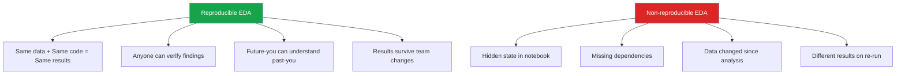

# Reproducibility in EDA

An analysis that cannot be reproduced is an analysis that cannot be trusted. This page covers every aspect of making EDA reproducible: notebook discipline, data versioning, environment management, random seeds, and automated reporting.

---

## Why Reproducibility Matters



---

## Jupyter Notebook Best Practices

### Notebook Structure Template

```python
# Cell 1: Header and metadata
"""
# EDA: Customer Churn Analysis
- Author: [Name]
- Date: 2026-03-24
- Data: customer_data_v3.parquet
- Goal: Identify key churn predictors
- Status: Draft / Review / Final
"""

# Cell 2: Imports and configuration
import pandas as pd
import numpy as np
import matplotlib.pyplot as plt
import seaborn as sns
from scipy import stats
import warnings

# Configuration
RANDOM_SEED = 42
DATA_PATH = '../data/raw/customer_data_v3.parquet'
OUTPUT_DIR = '../reports/figures/'
SAMPLE_SIZE = None  # Set to int for sampling, None for full data

np.random.seed(RANDOM_SEED)
sns.set_theme(style='whitegrid', palette='muted')
plt.rcParams['figure.dpi'] = 100
plt.rcParams['savefig.dpi'] = 150
warnings.filterwarnings('ignore', category=FutureWarning)

print(f"pandas: {pd.__version__}")
print(f"numpy: {np.__version__}")
print(f"Random seed: {RANDOM_SEED}")

# Cell 3: Data loading
df = pd.read_parquet(DATA_PATH)
if SAMPLE_SIZE:
    df = df.sample(SAMPLE_SIZE, random_state=RANDOM_SEED)
print(f"Loaded: {df.shape[0]:,} rows x {df.shape[1]} columns")

# Cell 4+: Analysis sections (one concern per cell)
```

### Notebook Hygiene Rules

```python
# 1. ALWAYS restart kernel and run all before committing
# Kernel -> Restart & Run All

# 2. Number cells sequentially (no out-of-order execution)
# Each cell should depend only on cells above it

# 3. No hidden state: every variable is created in the visible flow
# BAD:  Run cell 5, modify cell 3, run cell 5 again (hidden dependency)
# GOOD: Restart and run all — same result every time

# 4. One concept per cell with a markdown header above it
# This makes the notebook readable like a document

# 5. Clean up exploratory dead ends
# Delete cells that explore paths you abandoned
# Move useful functions to a .py file

# 6. Use assertions to validate assumptions
assert df['customer_id'].nunique() == len(df), "Duplicate customer IDs!"
assert df['age'].between(0, 120).all(), "Invalid ages found!"
assert df.isna().mean().max() < 0.5, "Column with >50% missing!"
```

### Cell Execution Order Protection

```python
# Add this to your first code cell to detect out-of-order execution
_execution_order = []

def checkpoint(name):
    """Track cell execution order."""
    _execution_order.append(name)
    expected = ['imports', 'load_data', 'clean', 'analyze', 'visualize']
    for i, step in enumerate(_execution_order):
        if i < len(expected) and step != expected[i]:
            print(f"WARNING: Expected '{expected[i]}' but got '{step}' at step {i+1}")
            break

# Usage in each section:
checkpoint('imports')
# ... import code ...

checkpoint('load_data')
# ... loading code ...
```

---

## Random Seeds and Determinism

```python
import random
import os

def set_all_seeds(seed=42):
    """Set all random seeds for full reproducibility."""
    random.seed(seed)
    np.random.seed(seed)
    os.environ['PYTHONHASHSEED'] = str(seed)

    # If using sklearn
    # from sklearn.utils import check_random_state
    # rng = check_random_state(seed)

    # If using PyTorch
    # import torch
    # torch.manual_seed(seed)
    # torch.cuda.manual_seed_all(seed)

    print(f"All random seeds set to {seed}")

set_all_seeds(42)

# BETTER: use explicit RNG objects instead of global seed
rng = np.random.default_rng(42)
sample = rng.choice(100, size=10)  # reproducible sampling

# Pass random_state to every sklearn function
from sklearn.model_selection import train_test_split
# X_train, X_test = train_test_split(X, y, random_state=42)
```

---

## Environment Management

### requirements.txt

```text
# requirements.txt — pin exact versions
pandas==2.2.1
numpy==1.26.4
matplotlib==3.8.3
seaborn==0.13.2
scipy==1.12.0
scikit-learn==1.4.1
plotly==5.19.0
jupyter==1.0.0
ipykernel==6.29.3
```

### pyproject.toml (Modern Approach)

```toml
# pyproject.toml
[project]
name = "churn-eda"
version = "0.1.0"
requires-python = ">=3.11"
dependencies = [
    "pandas>=2.2,<2.3",
    "numpy>=1.26,<1.27",
    "matplotlib>=3.8,<3.9",
    "seaborn>=0.13,<0.14",
    "scipy>=1.12,<1.13",
]

[project.optional-dependencies]
dev = ["jupyter", "black", "ruff"]
```

### Environment Setup Script

```bash
#!/bin/bash
# setup_env.sh

# Create virtual environment
python -m venv .venv
source .venv/bin/activate  # Linux/Mac
# .venv\Scripts\activate   # Windows

# Install dependencies
pip install -r requirements.txt

# Register Jupyter kernel
python -m ipykernel install --user --name=churn-eda --display-name="Churn EDA"

echo "Environment ready. Use kernel 'Churn EDA' in Jupyter."
```

### Record Environment at Analysis Time

```python
def record_environment():
    """Record the exact environment used for this analysis."""
    import sys
    import platform

    env_info = {
        'python': sys.version,
        'platform': platform.platform(),
        'packages': {},
    }

    for pkg_name in ['pandas', 'numpy', 'matplotlib', 'seaborn', 'scipy', 'sklearn']:
        try:
            pkg = __import__(pkg_name)
            env_info['packages'][pkg_name] = pkg.__version__
        except ImportError:
            env_info['packages'][pkg_name] = 'not installed'

    print("Environment Record:")
    print(f"  Python: {env_info['python']}")
    print(f"  Platform: {env_info['platform']}")
    for pkg, ver in env_info['packages'].items():
        print(f"  {pkg}: {ver}")

    return env_info

env = record_environment()
```

---

## Data Versioning with DVC

```bash
# Install DVC
pip install dvc dvc-s3  # or dvc-gs for Google Cloud

# Initialize DVC in your project
dvc init

# Track a data file
dvc add data/raw/customer_data.parquet

# This creates:
# data/raw/customer_data.parquet.dvc  (metadata, tracked by Git)
# data/raw/.gitignore                 (ignores the actual data file)

# Commit the metadata
git add data/raw/customer_data.parquet.dvc data/raw/.gitignore
git commit -m "Track customer data v1 with DVC"

# Push data to remote storage
dvc remote add -d storage s3://my-bucket/dvc-store
dvc push

# When someone clones the repo:
dvc pull  # downloads the exact data version
```

### DVC Pipeline for Reproducible EDA

```yaml
# dvc.yaml
stages:
  prepare:
    cmd: python scripts/prepare_data.py
    deps:
      - data/raw/customer_data.parquet
      - scripts/prepare_data.py
    outs:
      - data/processed/clean_data.parquet

  eda_report:
    cmd: jupyter nbconvert --execute --to html notebooks/eda.ipynb --output-dir=reports/
    deps:
      - data/processed/clean_data.parquet
      - notebooks/eda.ipynb
    outs:
      - reports/eda.html
    plots:
      - reports/figures/
```

```bash
# Run the full pipeline
dvc repro

# Check pipeline status
dvc status

# Compare with previous run
dvc diff
```

---

## Notebook Conversion and Reporting

### nbconvert: Notebook to Report

```bash
# Convert to HTML report
jupyter nbconvert --to html --no-input notebooks/eda.ipynb
# --no-input hides code cells (show only output)

# Convert to PDF (requires LaTeX)
jupyter nbconvert --to pdf notebooks/eda.ipynb

# Convert to Python script
jupyter nbconvert --to script notebooks/eda.ipynb

# Execute and convert in one step
jupyter nbconvert --execute --to html notebooks/eda.ipynb \
    --ExecutePreprocessor.timeout=600
```

### Papermill: Parameterized Notebooks

```python
# Run notebook with different parameters
import papermill as pm

pm.execute_notebook(
    'template_eda.ipynb',
    'output/eda_region_north.ipynb',
    parameters={
        'REGION': 'North',
        'DATA_PATH': 'data/north_region.parquet',
        'SAMPLE_SIZE': 10000,
    }
)

# Run for all regions
for region in ['North', 'South', 'East', 'West']:
    pm.execute_notebook(
        'template_eda.ipynb',
        f'output/eda_region_{region.lower()}.ipynb',
        parameters={'REGION': region},
    )
```

---

## Project Structure

```
project/
  data/
    raw/                    # Original, immutable data
      customer_data.parquet
      customer_data.parquet.dvc
    processed/              # Cleaned data
      clean_data.parquet
    external/               # Third-party data
  notebooks/
    01_initial_eda.ipynb
    02_deep_dive_churn.ipynb
    03_feature_engineering.ipynb
  scripts/
    prepare_data.py         # Data cleaning script
    utils.py                # Shared utility functions
  reports/
    figures/
    eda_report.html
  tests/
    test_data_quality.py
  environment.yml           # or requirements.txt
  dvc.yaml                  # DVC pipeline
  .gitignore
  README.md
```

### Data Quality Tests

```python
# tests/test_data_quality.py
import pandas as pd
import numpy as np
import pytest

DATA_PATH = 'data/processed/clean_data.parquet'

@pytest.fixture
def df():
    return pd.read_parquet(DATA_PATH)

def test_no_duplicates(df):
    assert df.duplicated().sum() == 0, "Duplicate rows found"

def test_no_null_in_key_columns(df):
    key_cols = ['customer_id', 'age', 'income']
    for col in key_cols:
        assert df[col].isna().sum() == 0, f"Nulls in {col}"

def test_value_ranges(df):
    assert df['age'].between(0, 120).all(), "Invalid ages"
    assert (df['income'] >= 0).all(), "Negative incomes"

def test_row_count(df):
    assert len(df) > 1000, f"Too few rows: {len(df)}"
    assert len(df) < 10_000_000, f"Unexpectedly many rows: {len(df)}"

def test_column_types(df):
    assert df['customer_id'].dtype == 'int64'
    assert df['age'].dtype in ['int64', 'float64']
```

---

## Reproducibility Checklist

| Item | Tool/Method |
|------|------------|
| Fixed random seeds | `np.random.seed(42)`, `random_state=42` |
| Pinned package versions | `requirements.txt` with exact versions |
| Data versioning | DVC, Git LFS, or data checksums |
| Notebook runs top-to-bottom | Restart & Run All before commit |
| Environment documentation | `record_environment()` function |
| Automated reports | nbconvert, Papermill |
| Data quality tests | pytest assertions |
| Project structure | Standard directory layout |
| Code review | Shared utility functions in `.py` files |
| Documentation | Markdown cells explaining each step |

---

## Key Takeaways

- **Restart & Run All** is the minimum bar for notebook reproducibility — if it fails, it is not reproducible
- Pin **exact package versions** in requirements.txt — a minor version bump can change results
- Use **DVC** to version data alongside code — Git alone cannot handle large data files
- Set **random seeds everywhere**: numpy, random, sklearn, and any library that uses randomness
- **nbconvert** with `--no-input` creates stakeholder-ready reports from analysis notebooks
- **Papermill** enables parameterized notebooks — run the same analysis across segments, time periods, or datasets
- Keep **raw data immutable** — never overwrite source data; create processed versions in separate directories
- Write **data quality tests** that run automatically and catch drift or corruption early
