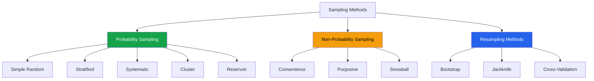

# Sampling Strategies for EDA

Sampling is essential when datasets are too large for interactive exploration, when you need confidence intervals, or when you must design data collection. This page covers every major sampling strategy with Python implementations and guidance on when to use each.

---

## Sampling Methods Overview



---

## Simple Random Sampling

Every element has an equal probability of selection.

```python
import pandas as pd
import numpy as np
from scipy import stats

np.random.seed(42)

# Population
N = 1_000_000
population = pd.DataFrame({
    'id': range(N),
    'value': np.random.lognormal(4, 1, N),
    'group': np.random.choice(['A', 'B', 'C', 'D'], N, p=[0.4, 0.3, 0.2, 0.1]),
    'region': np.random.choice(['North', 'South', 'East', 'West'], N),
})

# Simple random sample (without replacement)
n = 1000
sample_srs = population.sample(n=n, random_state=42)

# With replacement (useful for bootstrap)
sample_wr = population.sample(n=n, replace=True, random_state=42)

# Validate representativeness
print("Simple Random Sampling Validation:")
print(f"  Population mean: {population['value'].mean():.2f}")
print(f"  Sample mean:     {sample_srs['value'].mean():.2f}")
print(f"  Standard error:  {population['value'].std() / np.sqrt(n):.2f}")

# Group proportions check
pop_props = population['group'].value_counts(normalize=True)
samp_props = sample_srs['group'].value_counts(normalize=True)
print(f"\nGroup proportions (population vs sample):")
for g in pop_props.index:
    print(f"  {g}: {pop_props[g]:.3f} vs {samp_props.get(g, 0):.3f}")
```

---

## Stratified Sampling

Ensures proportional (or equal) representation of subgroups.

```python
def stratified_sample(df, strata_col, n_per_stratum=None, frac=None, random_state=42):
    """Stratified sampling: proportional or equal allocation."""
    rng = np.random.RandomState(random_state)

    if frac is not None:
        # Proportional stratification
        sample = df.groupby(strata_col, group_keys=False).apply(
            lambda x: x.sample(frac=frac, random_state=rng)
        )
    elif n_per_stratum is not None:
        # Equal allocation per stratum
        sample = df.groupby(strata_col, group_keys=False).apply(
            lambda x: x.sample(n=min(n_per_stratum, len(x)), random_state=rng)
        )
    else:
        raise ValueError("Provide either n_per_stratum or frac")

    return sample.reset_index(drop=True)

# Proportional stratification (preserves group ratios)
sample_prop = stratified_sample(population, 'group', frac=0.001)
print(f"Proportional stratified sample: {len(sample_prop)} rows")
print(sample_prop['group'].value_counts(normalize=True).round(3))

# Equal allocation (same n per group — good for rare classes)
sample_equal = stratified_sample(population, 'group', n_per_stratum=250)
print(f"\nEqual allocation sample: {len(sample_equal)} rows")
print(sample_equal['group'].value_counts())

# Multi-level stratification
def multi_stratified_sample(df, strata_cols, frac=0.001, random_state=42):
    """Stratified sampling on multiple columns."""
    return df.groupby(strata_cols, group_keys=False).apply(
        lambda x: x.sample(frac=frac, random_state=random_state) if len(x) > 0 else x
    ).reset_index(drop=True)

sample_multi = multi_stratified_sample(population, ['group', 'region'], frac=0.001)
print(f"\nMulti-level stratified: {len(sample_multi)} rows")
```

---

## Systematic Sampling

Select every k-th element after a random start.

```python
def systematic_sample(df, n, random_state=42):
    """Systematic sampling: every k-th element."""
    rng = np.random.RandomState(random_state)
    k = len(df) // n
    start = rng.randint(0, k)
    indices = range(start, len(df), k)
    return df.iloc[list(indices)[:n]]

sample_sys = systematic_sample(population, 1000)
print(f"Systematic sample: {len(sample_sys)} rows")
print(f"Mean: {sample_sys['value'].mean():.2f} (pop: {population['value'].mean():.2f})")

# Warning: systematic sampling can be biased if data has periodic patterns
# Always check for periodicity first!
```

---

## Cluster Sampling

Select entire clusters, then analyze all elements within selected clusters.

```python
def cluster_sample(df, cluster_col, n_clusters, random_state=42):
    """Select n random clusters, return all elements within."""
    rng = np.random.RandomState(random_state)
    all_clusters = df[cluster_col].unique()
    selected = rng.choice(all_clusters, size=min(n_clusters, len(all_clusters)), replace=False)
    return df[df[cluster_col].isin(selected)]

# Add cluster structure
population['city'] = np.random.choice([f'City_{i:03d}' for i in range(200)], N)

# Select 20 cities, analyze all records in them
sample_cluster = cluster_sample(population, 'city', n_clusters=20)
print(f"Cluster sample: {len(sample_cluster)} rows from 20 cities")
print(f"Mean: {sample_cluster['value'].mean():.2f} (pop: {population['value'].mean():.2f})")
print(f"Cities selected: {sample_cluster['city'].nunique()}")

# Two-stage cluster sampling
def two_stage_cluster_sample(df, cluster_col, n_clusters, n_per_cluster, random_state=42):
    """Select clusters, then sample within each cluster."""
    rng = np.random.RandomState(random_state)
    clusters = rng.choice(df[cluster_col].unique(), n_clusters, replace=False)
    result = df[df[cluster_col].isin(clusters)].groupby(cluster_col, group_keys=False).apply(
        lambda x: x.sample(n=min(n_per_cluster, len(x)), random_state=rng)
    )
    return result.reset_index(drop=True)

sample_2stage = two_stage_cluster_sample(population, 'city', n_clusters=30, n_per_cluster=50)
print(f"\nTwo-stage cluster: {len(sample_2stage)} rows")
```

---

## Reservoir Sampling

Sample from a stream of unknown size (single pass, constant memory).

```python
def reservoir_sample(stream, k, random_state=42):
    """Reservoir sampling: sample k items from a stream of unknown size."""
    rng = np.random.RandomState(random_state)
    reservoir = []

    for i, item in enumerate(stream):
        if i < k:
            reservoir.append(item)
        else:
            j = rng.randint(0, i + 1)
            if j < k:
                reservoir[j] = item

    return reservoir

# Simulate streaming data
stream = iter(range(1_000_000))
sample_reservoir = reservoir_sample(stream, k=1000)
print(f"Reservoir sample: {len(sample_reservoir)} items")
print(f"Mean: {np.mean(sample_reservoir):.0f} (expected: 500000)")
print(f"Std:  {np.std(sample_reservoir):.0f}")

# Practical use: sampling from large files
def sample_large_csv(filepath, k, random_state=42):
    """Reservoir sample from a CSV file that doesn't fit in memory."""
    import csv
    rng = np.random.RandomState(random_state)
    reservoir = []

    with open(filepath, 'r') as f:
        reader = csv.DictReader(f)
        for i, row in enumerate(reader):
            if i < k:
                reservoir.append(row)
            else:
                j = rng.randint(0, i + 1)
                if j < k:
                    reservoir[j] = row

    return pd.DataFrame(reservoir)
```

---

## Bootstrap Resampling

```python
def bootstrap_statistic(data, statistic_fn, n_boot=10000, ci=0.95, random_state=42):
    """Bootstrap any statistic with confidence interval."""
    rng = np.random.RandomState(random_state)
    n = len(data)
    boot_stats = np.zeros(n_boot)

    for i in range(n_boot):
        boot_sample = data[rng.randint(0, n, size=n)]
        boot_stats[i] = statistic_fn(boot_sample)

    alpha = (1 - ci) / 2
    return {
        'estimate': statistic_fn(data),
        'se': boot_stats.std(),
        'ci_lower': np.percentile(boot_stats, alpha * 100),
        'ci_upper': np.percentile(boot_stats, (1 - alpha) * 100),
        'boot_distribution': boot_stats,
    }

# Bootstrap the mean
sample = population['value'].sample(500, random_state=42).values
result = bootstrap_statistic(sample, np.mean)
print(f"Mean: {result['estimate']:.2f}")
print(f"95% CI: [{result['ci_lower']:.2f}, {result['ci_upper']:.2f}]")
print(f"SE: {result['se']:.2f}")

# Bootstrap the median
result_median = bootstrap_statistic(sample, np.median)
print(f"\nMedian: {result_median['estimate']:.2f}")
print(f"95% CI: [{result_median['ci_lower']:.2f}, {result_median['ci_upper']:.2f}]")

# Bootstrap the difference in means between two groups
def bootstrap_diff_means(group_a, group_b, n_boot=10000, random_state=42):
    """Bootstrap confidence interval for difference in means."""
    rng = np.random.RandomState(random_state)
    diffs = np.zeros(n_boot)

    for i in range(n_boot):
        boot_a = group_a[rng.randint(0, len(group_a), len(group_a))]
        boot_b = group_b[rng.randint(0, len(group_b), len(group_b))]
        diffs[i] = boot_a.mean() - boot_b.mean()

    observed_diff = group_a.mean() - group_b.mean()
    ci_lower, ci_upper = np.percentile(diffs, [2.5, 97.5])
    p_value = 2 * min(np.mean(diffs >= 0), np.mean(diffs <= 0))

    return {
        'diff': observed_diff,
        'ci_lower': ci_lower,
        'ci_upper': ci_upper,
        'p_value': p_value,
    }

a = population[population['group'] == 'A']['value'].sample(200, random_state=1).values
b = population[population['group'] == 'B']['value'].sample(200, random_state=2).values
diff_result = bootstrap_diff_means(a, b)
print(f"\nDifference in means: {diff_result['diff']:.2f}")
print(f"95% CI: [{diff_result['ci_lower']:.2f}, {diff_result['ci_upper']:.2f}]")
print(f"P-value: {diff_result['p_value']:.4f}")
```

---

## Power Analysis

```python
def power_analysis_two_sample(effect_size, alpha=0.05, power=0.80):
    """Compute required sample size per group for two-sample t-test."""
    from scipy.stats import norm

    z_alpha = norm.ppf(1 - alpha / 2)
    z_beta = norm.ppf(power)

    n = ((z_alpha + z_beta) ** 2 * 2) / (effect_size ** 2)
    return int(np.ceil(n))

# Sample size for different effect sizes
print("Required Sample Size per Group (two-sample t-test, alpha=0.05, power=0.80):")
print(f"{'Effect Size (d)':<20} {'n per group':>15}")
print("-" * 37)
for d in [0.1, 0.2, 0.3, 0.5, 0.8, 1.0]:
    n = power_analysis_two_sample(d)
    print(f"{d:<20} {n:>15,}")

# Power curve
effect_sizes = np.linspace(0.1, 1.5, 50)
sample_sizes = [50, 100, 200, 500, 1000]

import matplotlib.pyplot as plt

fig, ax = plt.subplots(figsize=(12, 6))
for n in sample_sizes:
    powers = []
    for d in effect_sizes:
        from scipy.stats import norm
        z_alpha = norm.ppf(1 - 0.05/2)
        z_power = d * np.sqrt(n/2) - z_alpha
        power = norm.cdf(z_power)
        powers.append(power)
    ax.plot(effect_sizes, powers, label=f'n={n}', linewidth=2)

ax.axhline(y=0.8, color='red', linestyle='--', alpha=0.5, label='80% power')
ax.set_xlabel("Effect Size (Cohen's d)")
ax.set_ylabel('Power')
ax.set_title('Power Curves for Two-Sample t-test')
ax.legend()
ax.grid(True, alpha=0.3)
plt.tight_layout()
plt.show()
```

### Power for Proportions

```python
def power_analysis_proportions(p1, p2, alpha=0.05, power=0.80):
    """Sample size for comparing two proportions."""
    from scipy.stats import norm

    z_alpha = norm.ppf(1 - alpha / 2)
    z_beta = norm.ppf(power)

    p_bar = (p1 + p2) / 2
    n = ((z_alpha * np.sqrt(2 * p_bar * (1 - p_bar)) +
          z_beta * np.sqrt(p1 * (1 - p1) + p2 * (1 - p2))) ** 2) / (p1 - p2) ** 2
    return int(np.ceil(n))

# A/B test sample size
p_control = 0.10  # 10% conversion
p_treatment = 0.12  # 12% conversion (2pp lift)
n = power_analysis_proportions(p_control, p_treatment)
print(f"\nA/B Test Sample Size:")
print(f"  Control conversion: {p_control:.1%}")
print(f"  Expected lift: {p_treatment - p_control:.1%}")
print(f"  Required per group: {n:,}")
print(f"  Total required: {2*n:,}")
```

---

## Sampling Decision Guide

| Situation | Best Method | Why |
|-----------|-------------|-----|
| Large homogeneous dataset | Simple random | No structure to preserve |
| Imbalanced classes | Stratified | Ensures minority representation |
| Geographic data | Cluster | Cost-effective for field work |
| Streaming data | Reservoir | Single pass, constant memory |
| Confidence intervals | Bootstrap | Works for any statistic |
| Periodic data (avoid) | Systematic | Can amplify periodicity |
| Very rare events | Stratified (oversampled) | Enough rare cases to analyze |
| Time series | Temporal block | Preserves autocorrelation |

---

## Sampling Validation

```python
def validate_sample(population, sample, key_cols=None, cat_cols=None):
    """Validate that a sample is representative of the population."""
    print("SAMPLE VALIDATION REPORT")
    print("=" * 60)
    print(f"Population: {len(population):,} | Sample: {len(sample):,} ({len(sample)/len(population):.2%})")

    numeric = population.select_dtypes(include='number').columns

    # Numeric: compare means with confidence intervals
    print(f"\nNumeric columns (KS test):")
    for col in numeric[:10]:
        pop_mean = population[col].mean()
        samp_mean = sample[col].mean()
        ks_stat, ks_p = stats.ks_2samp(population[col].dropna(), sample[col].dropna())
        status = "OK" if ks_p > 0.05 else "MISMATCH"
        print(f"  {col:<20} pop={pop_mean:.2f} samp={samp_mean:.2f} KS_p={ks_p:.4f} [{status}]")

    # Categorical: compare proportions
    if cat_cols:
        print(f"\nCategorical columns (Chi-squared):")
        for col in cat_cols:
            pop_dist = population[col].value_counts(normalize=True)
            samp_dist = sample[col].value_counts(normalize=True)

            # Align
            all_cats = pop_dist.index.union(samp_dist.index)
            observed = np.array([samp_dist.get(c, 0) * len(sample) for c in all_cats])
            expected = np.array([pop_dist.get(c, 0) * len(sample) for c in all_cats])
            expected = np.maximum(expected, 1)  # avoid zero

            chi2, p = stats.chisquare(observed, expected)
            status = "OK" if p > 0.05 else "MISMATCH"
            print(f"  {col:<20} chi2={chi2:.2f} p={p:.4f} [{status}]")

validate_sample(population, sample_srs, cat_cols=['group', 'region'])
```

---

## Key Takeaways

- **Simple random sampling** works for homogeneous datasets; use stratified when groups must be represented
- **Stratified sampling** is essential for imbalanced datasets and when subgroup analysis matters
- **Cluster sampling** is cost-effective when data collection is expensive (e.g., geographic surveys)
- **Reservoir sampling** handles streaming data and files too large for memory
- **Bootstrap** provides confidence intervals for any statistic without distributional assumptions
- **Power analysis** should be done BEFORE collecting data to determine the required sample size
- Always **validate** your sample against the population using KS tests and chi-squared tests
- For **time series**, never use random sampling -- use temporal blocks to preserve autocorrelation structure

## Try It Yourself

**Exercise 1:** You have a dataset of 10 million rows that is too large for interactive EDA. It has columns `[user_id, purchase_amount, product_category, region, timestamp]`. The `product_category` column is imbalanced (Electronics: 45%, Books: 3%). Write code to take a stratified sample of 10,000 rows that preserves category proportions, then validate the sample against the population.

::: details Solution
```python
import pandas as pd
import numpy as np
from scipy import stats

# Stratified sample preserving product_category proportions
sample = df.groupby('product_category', group_keys=False).apply(
    lambda x: x.sample(frac=10000/len(df), random_state=42)
).reset_index(drop=True)

# Adjust if total is not exactly 10,000
if len(sample) > 10000:
    sample = sample.sample(10000, random_state=42)
print(f"Sample size: {len(sample)}")

# Validate: category proportions
print("\nCategory Proportions (Population vs Sample):")
pop_props = df['product_category'].value_counts(normalize=True)
samp_props = sample['product_category'].value_counts(normalize=True)
for cat in pop_props.index:
    pop_pct = pop_props.get(cat, 0) * 100
    samp_pct = samp_props.get(cat, 0) * 100
    print(f"  {cat:20s}: pop={pop_pct:.1f}%  sample={samp_pct:.1f}%")

# Validate: numeric distributions (KS test)
print("\nDistribution Validation (KS test):")
for col in ['purchase_amount']:
    ks_stat, ks_p = stats.ks_2samp(df[col].dropna(), sample[col].dropna())
    status = "OK" if ks_p > 0.05 else "MISMATCH"
    print(f"  {col}: KS={ks_stat:.4f}, p={ks_p:.4f} [{status}]")

# Validate: region proportions (chi-squared)
pop_region = df['region'].value_counts(normalize=True)
samp_region = sample['region'].value_counts(normalize=True)
observed = np.array([samp_region.get(r, 0) * len(sample) for r in pop_region.index])
expected = np.array([pop_region.get(r, 0) * len(sample) for r in pop_region.index])
chi2, p = stats.chisquare(observed, expected)
print(f"  region: chi2={chi2:.2f}, p={p:.4f} [{'OK' if p > 0.05 else 'MISMATCH'}]")
```
:::

**Exercise 2:** Compute a 95% bootstrap confidence interval for the median purchase amount from a sample of 500 transactions. Use 10,000 bootstrap iterations. Then compute the bootstrap CI for the difference in median purchase amount between two regions.

::: details Solution
```python
import numpy as np

def bootstrap_ci(data, statistic_fn, n_boot=10000, ci=0.95, random_state=42):
    """Bootstrap confidence interval for any statistic."""
    rng = np.random.RandomState(random_state)
    n = len(data)
    boot_stats = np.array([
        statistic_fn(data[rng.randint(0, n, size=n)])
        for _ in range(n_boot)
    ])
    alpha = (1 - ci) / 2
    return {
        'estimate': statistic_fn(data),
        'ci_lower': np.percentile(boot_stats, alpha * 100),
        'ci_upper': np.percentile(boot_stats, (1 - alpha) * 100),
        'se': boot_stats.std(),
    }

# CI for median purchase amount
sample_amounts = df['purchase_amount'].sample(500, random_state=42).values
result = bootstrap_ci(sample_amounts, np.median)
print(f"Median purchase amount: ${result['estimate']:.2f}")
print(f"95% CI: [${result['ci_lower']:.2f}, ${result['ci_upper']:.2f}]")
print(f"SE: ${result['se']:.2f}")

# CI for difference in medians between two regions
region_a = df[df['region'] == 'North']['purchase_amount'].sample(250, random_state=1).values
region_b = df[df['region'] == 'South']['purchase_amount'].sample(250, random_state=2).values

rng = np.random.RandomState(42)
n_boot = 10000
diffs = np.zeros(n_boot)
for i in range(n_boot):
    boot_a = region_a[rng.randint(0, len(region_a), len(region_a))]
    boot_b = region_b[rng.randint(0, len(region_b), len(region_b))]
    diffs[i] = np.median(boot_a) - np.median(boot_b)

observed_diff = np.median(region_a) - np.median(region_b)
ci_lower, ci_upper = np.percentile(diffs, [2.5, 97.5])

print(f"\nMedian difference (North - South): ${observed_diff:.2f}")
print(f"95% CI: [${ci_lower:.2f}, ${ci_upper:.2f}]")
print(f"Significant: {'Yes' if ci_lower > 0 or ci_upper < 0 else 'No (CI includes 0)'}")
```
:::

**Exercise 3:** You are planning an A/B test for a website where the current conversion rate is 8%. You want to detect a minimum 1.5 percentage point improvement (to 9.5%) with 80% power at alpha=0.05. Calculate the required sample size per group. Then create a power curve showing how power changes with sample size for different effect sizes.

::: details Solution
```python
import numpy as np
import matplotlib.pyplot as plt
from scipy.stats import norm

def sample_size_proportions(p1, p2, alpha=0.05, power=0.80):
    """Required sample size per group for comparing two proportions."""
    z_alpha = norm.ppf(1 - alpha / 2)
    z_beta = norm.ppf(power)
    p_bar = (p1 + p2) / 2
    n = ((z_alpha * np.sqrt(2 * p_bar * (1 - p_bar)) +
          z_beta * np.sqrt(p1 * (1 - p1) + p2 * (1 - p2))) ** 2) / (p1 - p2) ** 2
    return int(np.ceil(n))

p_control = 0.08
p_treatment = 0.095
n_required = sample_size_proportions(p_control, p_treatment)
print(f"Control conversion: {p_control:.1%}")
print(f"Expected treatment: {p_treatment:.1%}")
print(f"Minimum detectable effect: {p_treatment - p_control:.1%}")
print(f"Required per group: {n_required:,}")
print(f"Total required: {2 * n_required:,}")

# Power curve
fig, ax = plt.subplots(figsize=(12, 6))
sample_sizes = np.arange(500, 30000, 500)
effects = [0.01, 0.015, 0.02, 0.03, 0.05]

for delta in effects:
    p2 = p_control + delta
    powers = []
    for n in sample_sizes:
        z_alpha = norm.ppf(1 - 0.05 / 2)
        se = np.sqrt(p_control * (1 - p_control) / n + p2 * (1 - p2) / n)
        z_power = abs(p2 - p_control) / se - z_alpha
        powers.append(norm.cdf(z_power))
    ax.plot(sample_sizes, powers, linewidth=2, label=f'delta={delta:.1%}')

ax.axhline(0.8, color='red', linestyle='--', alpha=0.5, label='80% power')
ax.set_xlabel('Sample Size per Group')
ax.set_ylabel('Power')
ax.set_title('Power Curves for A/B Test (Conversion Rate)')
ax.legend()
ax.grid(True, alpha=0.3)
plt.tight_layout()
plt.show()
```
:::

## Quick Quiz

**1. When is stratified sampling essential instead of simple random sampling?**
- a) When the dataset is too large to process
- b) When subgroups are imbalanced and you need to ensure minority groups are represented in the sample
- c) When all groups are equally sized

::: details Answer
**b) When subgroups are imbalanced and you need to ensure minority groups are represented in the sample.** If a category makes up only 2% of data, a random sample of 1,000 would include only ~20 rows from that category -- too few for meaningful analysis. Stratified sampling guarantees proportional (or equal) representation of all subgroups, making it essential for imbalanced datasets.
:::

**2. What is reservoir sampling used for?**
- a) Sampling from water quality datasets
- b) Taking a random sample from a data stream of unknown size in a single pass with constant memory
- c) Oversampling the minority class

::: details Answer
**b) Taking a random sample from a data stream of unknown size in a single pass with constant memory.** Reservoir sampling maintains a sample of size k. For each new element, it has a decreasing probability of replacing an existing sample element. After processing the entire stream, each element has an equal probability of being in the sample. This is crucial for streaming data and files too large to fit in memory.
:::

**3. A bootstrap confidence interval for the mean is [42.3, 48.7]. What does this mean?**
- a) The population mean is exactly 45.5
- b) If you repeated the sampling process many times, 95% of such intervals would contain the true population mean
- c) 95% of the data falls between 42.3 and 48.7

::: details Answer
**b) If you repeated the sampling process many times, 95% of such intervals would contain the true population mean.** The bootstrap CI estimates the range within which the true population parameter likely falls. It does NOT mean 95% of data points are in this range (that would be a prediction interval), and it does NOT pinpoint the exact population mean.
:::

**4. You need to detect a "small" effect size (Cohen's d = 0.2) with 80% power. Approximately how many samples per group do you need?**
- a) About 30
- b) About 400
- c) About 4,000

::: details Answer
**b) About 400.** For a two-sample t-test with d=0.2, alpha=0.05, and power=0.80, the required sample size is approximately 394 per group. This is why small effects require large studies. For comparison: d=0.5 (medium) needs ~64 per group, and d=0.8 (large) needs ~26 per group.
:::

**5. Why should you NEVER use random sampling for time series data during EDA?**
- a) Random sampling is too slow for time series
- b) It breaks the temporal ordering, destroying autocorrelation structure and potentially mixing future data with past data
- c) Time series data is always too small to sample

::: details Answer
**b) It breaks the temporal ordering, destroying autocorrelation structure and potentially mixing future data with past data.** Time series values depend on their neighbors in time. Random sampling breaks this dependency, making trend analysis, seasonality detection, and lag feature computation impossible. Use temporal block sampling (contiguous time windows) to preserve the time structure.
:::
