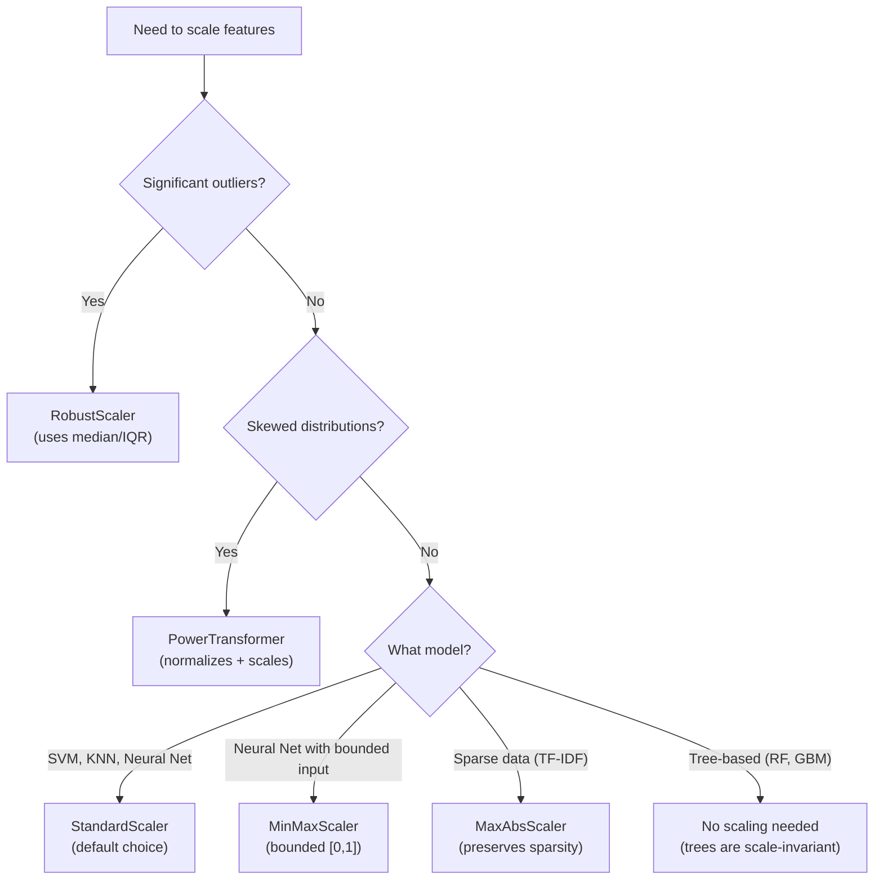

# Scaling & Normalization

Different features measured on different scales wreak havoc on distance-based algorithms, gradient descent, and regularized models. A salary column ranging from 30,000 to 300,000 will dominate a feature measured from 0 to 1 — not because it is more important, but because it is numerically larger.

Scaling fixes this. But there are six major approaches, and choosing the wrong one can introduce bias or destroy signal.

## The Dataset

We will generate features with deliberately different scales, distributions, and outlier patterns.

```python
import numpy as np
import pandas as pd
import matplotlib.pyplot as plt
import seaborn as sns
from sklearn.preprocessing import (
    StandardScaler, MinMaxScaler, RobustScaler, MaxAbsScaler,
    PowerTransformer, QuantileTransformer
)
from sklearn.model_selection import cross_val_score
from sklearn.linear_model import LogisticRegression
from sklearn.neighbors import KNeighborsClassifier
from sklearn.ensemble import GradientBoostingClassifier
from sklearn.svm import SVC
from sklearn.pipeline import Pipeline

np.random.seed(42)
n = 2000

# Features with wildly different scales and distributions
salary = np.random.lognormal(11, 0.5, n)           # 20K-500K
age = np.random.normal(38, 10, n).clip(18, 70)     # 18-70
satisfaction = np.random.beta(5, 2, n) * 100        # 0-100 (left-skewed)
login_count = np.random.poisson(50, n)              # 0-100+ (count)
tenure_days = np.random.exponential(500, n)         # 0-3000+ (right-skewed)
binary_flag = np.random.binomial(1, 0.3, n)         # 0 or 1

# Add outliers to salary
outlier_idx = np.random.choice(n, 20, replace=False)
salary[outlier_idx] = salary[outlier_idx] * 5

# Target
target = (
    0.3 * (salary > np.median(salary)).astype(int)
    + 0.2 * (age > 35).astype(int)
    + 0.2 * (satisfaction > 60).astype(int)
    + 0.15 * (login_count > 40).astype(int)
    + 0.15 * (tenure_days > 400).astype(int)
    + np.random.normal(0, 0.2, n)
)
target = (target > np.median(target)).astype(int)

df = pd.DataFrame({
    "salary": salary, "age": age, "satisfaction": satisfaction,
    "login_count": login_count, "tenure_days": tenure_days,
    "binary_flag": binary_flag, "target": target,
})

feature_cols = ["salary", "age", "satisfaction", "login_count", "tenure_days", "binary_flag"]
X = df[feature_cols].values
y = df["target"].values

print("Feature ranges BEFORE scaling:")
print(df[feature_cols].describe().round(1))
print(f"\nRange ratios:")
for col in feature_cols:
    r = df[col].max() - df[col].min()
    print(f"  {col:20s}: range = {r:>12,.1f}")
```

## The Six Major Scalers

### 1. StandardScaler (Z-Score Normalization)

Subtracts mean, divides by standard deviation. Centers at 0, most values between -3 and +3.

```python
scaler = StandardScaler()
X_standard = scaler.fit_transform(X)

print("StandardScaler: X_scaled = (X - mean) / std")
print(f"  Mean after:  {X_standard.mean(axis=0).round(6)}")
print(f"  Std after:   {X_standard.std(axis=0).round(6)}")
print(f"  Min after:   {X_standard.min(axis=0).round(2)}")
print(f"  Max after:   {X_standard.max(axis=0).round(2)}")
```

**When to use**: Default choice for most algorithms. Required for SVM, neural networks, PCA, and regularized linear models.

**Caution**: Sensitive to outliers. A single extreme value inflates the standard deviation, compressing all other values.

### 2. MinMaxScaler

Scales to a fixed range, typically [0, 1].

```python
scaler = MinMaxScaler(feature_range=(0, 1))
X_minmax = scaler.fit_transform(X)

print("MinMaxScaler: X_scaled = (X - min) / (max - min)")
print(f"  Min after: {X_minmax.min(axis=0).round(6)}")
print(f"  Max after: {X_minmax.max(axis=0).round(6)}")
```

**When to use**: When you need bounded values (neural network inputs, image pixel normalization). When the algorithm is sensitive to magnitude (KNN, K-Means).

**Caution**: Extremely sensitive to outliers. One extreme value compresses the entire range.

### 3. RobustScaler

Uses median and IQR instead of mean and standard deviation. Robust to outliers.

```python
scaler = RobustScaler()
X_robust = scaler.fit_transform(X)

print("RobustScaler: X_scaled = (X - median) / IQR")
print(f"  Median after: {np.median(X_robust, axis=0).round(6)}")
```

**When to use**: When your data has outliers that you want to keep but not let dominate scaling.

### 4. MaxAbsScaler

Divides by the maximum absolute value. Preserves sparsity (zeros stay zero).

```python
scaler = MaxAbsScaler()
X_maxabs = scaler.fit_transform(X)

print("MaxAbsScaler: X_scaled = X / max(|X|)")
print(f"  Max absolute after: {np.abs(X_maxabs).max(axis=0).round(6)}")
```

**When to use**: Sparse data (text TF-IDF matrices). When you need to preserve zero entries.

### 5. PowerTransformer (Yeo-Johnson)

Makes data more Gaussian-like using a power transform, then standardizes. Handles skew and standardizes in one step.

```python
scaler = PowerTransformer(method="yeo-johnson")
X_power = scaler.fit_transform(X)

print("PowerTransformer (Yeo-Johnson): makes data ~Gaussian, then standardizes")
print(f"  Skewness before: {pd.DataFrame(X, columns=feature_cols).skew().round(2).to_dict()}")
print(f"  Skewness after:  {pd.DataFrame(X_power, columns=feature_cols).skew().round(2).to_dict()}")
```

**When to use**: When features are skewed and you need normality. Combines transformation and scaling.

### 6. QuantileTransformer

Maps to a uniform or normal distribution by matching quantiles. The most aggressive normalizer.

```python
scaler = QuantileTransformer(output_distribution="normal", random_state=42)
X_quantile = scaler.fit_transform(X)

print("QuantileTransformer: forces data to target distribution via quantile matching")
print(f"  Skewness after: {pd.DataFrame(X_quantile, columns=feature_cols).skew().round(3).to_dict()}")
```

**When to use**: When nothing else normalizes the distribution sufficiently. Last resort.

**Caution**: Destroys the original distribution shape. Can hide real outliers.

## Visual Comparison

```python
scalers = {
    "Original": X,
    "StandardScaler": X_standard,
    "MinMaxScaler": X_minmax,
    "RobustScaler": X_robust,
    "MaxAbsScaler": X_maxabs,
    "PowerTransformer": X_power,
    "QuantileTransformer": X_quantile,
}

# Compare distribution of 'salary' (most problematic feature)
fig, axes = plt.subplots(2, 4, figsize=(20, 8))
axes = axes.flatten()

for i, (name, X_scaled) in enumerate(scalers.items()):
    if i < len(axes):
        ax = axes[i]
        salary_scaled = X_scaled[:, 0]  # salary is first column
        ax.hist(salary_scaled, bins=50, density=True, alpha=0.7, color="steelblue", edgecolor="black")
        ax.set_title(f"{name}\nskew={pd.Series(salary_scaled).skew():.2f}", fontsize=10)
        if name != "Original":
            q1, q99 = np.percentile(salary_scaled, [1, 99])
            ax.set_xlim(q1 - 0.5*(q99-q1), q99 + 0.5*(q99-q1))

axes[-1].set_visible(False)
plt.suptitle("Salary Distribution After Each Scaler", fontsize=16, fontweight="bold")
plt.tight_layout()
plt.savefig("scaler_comparison.png", dpi=150, bbox_inches="tight")
plt.show()
```

## Effect of Outliers on Each Scaler

```python
# Demonstrate outlier sensitivity
np.random.seed(42)
clean_data = np.random.normal(50, 10, 100)
data_with_outlier = np.append(clean_data, [500])  # One extreme outlier

fig, axes = plt.subplots(2, 3, figsize=(18, 10))

for ax, (name, ScalerClass) in zip(axes.flatten(), [
    ("StandardScaler", StandardScaler),
    ("MinMaxScaler", MinMaxScaler),
    ("RobustScaler", RobustScaler),
    ("MaxAbsScaler", MaxAbsScaler),
    ("PowerTransformer", PowerTransformer),
    ("QuantileTransformer", lambda: QuantileTransformer(output_distribution="normal")),
]):
    scaler_obj = ScalerClass() if not callable(ScalerClass) else ScalerClass()

    # Scale clean data
    clean_scaled = scaler_obj.fit_transform(clean_data.reshape(-1, 1)).flatten()

    # Scale data with outlier
    scaler_obj2 = type(scaler_obj)() if not isinstance(scaler_obj, QuantileTransformer) else QuantileTransformer(output_distribution="normal")
    dirty_scaled = scaler_obj2.fit_transform(data_with_outlier.reshape(-1, 1)).flatten()

    ax.hist(clean_scaled, bins=30, alpha=0.5, color="steelblue", label="Clean", density=True)
    ax.hist(dirty_scaled[:-1], bins=30, alpha=0.5, color="coral", label="With outlier", density=True)
    ax.axvline(dirty_scaled[-1], color="red", linewidth=2, linestyle="--", label=f"Outlier: {dirty_scaled[-1]:.1f}")
    ax.set_title(name, fontsize=12)
    ax.legend(fontsize=8)

plt.suptitle("How Outliers Affect Different Scalers", fontsize=16, fontweight="bold")
plt.tight_layout()
plt.savefig("outlier_effect.png", dpi=150, bbox_inches="tight")
plt.show()
```

## Scaler Comparison Table

| Scaler | Formula | Centers at | Preserves Zeros | Outlier Robust | Output Range |
|--------|---------|-----------|----------------|----------------|-------------|
| **StandardScaler** | (x - mean) / std | 0 | No | No | Unbounded |
| **MinMaxScaler** | (x - min) / (max - min) | — | Yes (if 0 in range) | No | [0, 1] |
| **RobustScaler** | (x - median) / IQR | 0 | No | Yes | Unbounded |
| **MaxAbsScaler** | x / max(abs(x)) | — | Yes | No | [-1, 1] |
| **PowerTransformer** | Yeo-Johnson + standardize | 0 | No | Moderate | Unbounded |
| **QuantileTransformer** | Quantile mapping | 0 | No | Yes | Depends on target |

## Decision Flow



## Model Performance Benchmark

```python
scalers_dict = {
    "No scaling": None,
    "StandardScaler": StandardScaler(),
    "MinMaxScaler": MinMaxScaler(),
    "RobustScaler": RobustScaler(),
    "PowerTransformer": PowerTransformer(method="yeo-johnson"),
    "QuantileTransformer": QuantileTransformer(output_distribution="normal", random_state=42),
}

models = {
    "Logistic Regression": LogisticRegression(max_iter=1000),
    "KNN (k=5)": KNeighborsClassifier(n_neighbors=5),
    "SVM (RBF)": SVC(kernel="rbf"),
    "GBM": GradientBoostingClassifier(n_estimators=50, random_state=42),
}

results = []
for scaler_name, scaler in scalers_dict.items():
    for model_name, model in models.items():
        if scaler is not None:
            X_scaled = scaler.fit_transform(X)
        else:
            X_scaled = X.copy()

        scores = cross_val_score(model, X_scaled, y, cv=5, scoring="accuracy")
        results.append({
            "scaler": scaler_name,
            "model": model_name,
            "accuracy": scores.mean(),
            "std": scores.std(),
        })

results_df = pd.DataFrame(results)
pivot = results_df.pivot_table(values="accuracy", index="scaler", columns="model")
print("\nAccuracy by Scaler x Model:")
print(pivot.round(4).to_string())

# Heatmap
fig, ax = plt.subplots(figsize=(12, 6))
sns.heatmap(pivot, annot=True, fmt=".4f", cmap="YlGn", ax=ax,
            linewidths=0.5, cbar_kws={"label": "Accuracy"})
ax.set_title("Model Accuracy by Scaling Method", fontsize=14)
plt.tight_layout()
plt.savefig("scaling_benchmark.png", dpi=150, bbox_inches="tight")
plt.show()
```

## Common Mistakes

### Mistake 1: Fitting scaler on test data

```python
from sklearn.model_selection import train_test_split

X_train, X_test, y_train, y_test = train_test_split(X, y, test_size=0.2, random_state=42)

# WRONG: fit on full data (leaks test statistics into training)
# scaler = StandardScaler()
# X_all_scaled = scaler.fit_transform(X)  # BAD!

# RIGHT: fit on train, transform both
scaler = StandardScaler()
X_train_scaled = scaler.fit_transform(X_train)   # fit + transform on train
X_test_scaled = scaler.transform(X_test)          # transform only on test

print("Train mean:", X_train_scaled.mean(axis=0).round(4))
print("Test mean: ", X_test_scaled.mean(axis=0).round(4))  # NOT exactly 0, and that's correct
```

### Mistake 2: Scaling the target variable in regression

```python
# In regression, you usually should NOT scale y
# Exception: when y has extreme range and you want numerical stability
# If you do scale y, remember to INVERSE TRANSFORM predictions

# scaler_y = StandardScaler()
# y_train_scaled = scaler_y.fit_transform(y_train.reshape(-1, 1))
# ... train model ...
# predictions = scaler_y.inverse_transform(model.predict(X_test_scaled).reshape(-1, 1))
```

### Mistake 3: Scaling binary/one-hot features

```python
# Binary and one-hot features are already on a [0, 1] scale
# Scaling them can actually HURT by distorting their natural interpretation
# Best practice: scale continuous features only, leave binary features alone
print("Binary 'flag' column — already 0/1, no scaling needed")
print(f"  Mean: {df['binary_flag'].mean():.3f}")
print(f"  If StandardScaled: mean becomes 0, values become ~±1.5")
print(f"  This makes 'flag=1' mean something like 1.53, which is misleading")
```

## Selective Scaling Pipeline

In practice, you often need to scale continuous features while leaving binary and categorical features untouched.

```python
from sklearn.compose import ColumnTransformer
from sklearn.pipeline import Pipeline

# Identify column types
continuous_cols = ["salary", "age", "satisfaction", "login_count", "tenure_days"]
binary_cols = ["binary_flag"]

# Build a column transformer that scales selectively
preprocessor = ColumnTransformer(
    transformers=[
        ("scale", RobustScaler(), continuous_cols),
        ("passthrough", "passthrough", binary_cols),
    ],
    remainder="drop",
)

# Use in a pipeline
pipeline = Pipeline([
    ("preprocess", preprocessor),
    ("model", LogisticRegression(max_iter=1000)),
])

# Evaluate
scores = cross_val_score(pipeline, df[continuous_cols + binary_cols], y, cv=5, scoring="accuracy")
print(f"Pipeline with selective scaling: {scores.mean():.4f} (+/- {scores.std():.4f})")
```

## Scaling for Different Data Types

```python
# Special case: scaling sparse matrices (TF-IDF)
from sklearn.preprocessing import MaxAbsScaler
from scipy.sparse import random as sparse_random

# Simulate a TF-IDF matrix (sparse)
sparse_matrix = sparse_random(1000, 5000, density=0.01, format="csr", random_state=42)

# MaxAbsScaler preserves sparsity
mas = MaxAbsScaler()
scaled_sparse = mas.fit_transform(sparse_matrix)
print(f"Original sparsity: {1 - sparse_matrix.nnz / (sparse_matrix.shape[0] * sparse_matrix.shape[1]):.4%}")
print(f"After MaxAbsScaler: {1 - scaled_sparse.nnz / (scaled_sparse.shape[0] * scaled_sparse.shape[1]):.4%}")
print("Sparsity preserved!")

# StandardScaler DESTROYS sparsity (subtracting mean makes zeros non-zero)
from sklearn.preprocessing import StandardScaler
ss = StandardScaler(with_mean=False)  # with_mean=False preserves sparsity
scaled_no_center = ss.fit_transform(sparse_matrix)
print(f"\nStandardScaler (no centering): sparsity preserved")
print(f"StandardScaler (with centering): would convert to dense — memory explosion!")
```

## Key Takeaways

- StandardScaler is the safe default for most ML algorithms. Use it unless you have a specific reason not to.
- RobustScaler is strictly better when outliers are present. It uses median/IQR, which outliers barely affect.
- MinMaxScaler is needed when your model requires bounded inputs (some neural networks, image data).
- PowerTransformer handles skew and scaling simultaneously. Best for skewed features going into linear models.
- Tree-based models (Random Forest, GBM, XGBoost) do not need scaling. Save yourself the complexity.
- Always fit the scaler on training data only. Applying fit_transform to the full dataset before splitting leaks test information.
- Do not scale binary, one-hot, or ordinal features. They are already on meaningful scales.

## Try It Yourself

**Exercise 1:** You have a dataset with 5 features: `salary` (30K-500K, right-skewed with outliers), `age` (18-70, roughly normal), `satisfaction_score` (0-100, left-skewed), `login_count` (0-200, Poisson), and `is_premium` (0 or 1, binary). Build a preprocessing pipeline that applies the right scaler to each feature type. Do NOT scale the binary feature.

::: details Solution
```python
import pandas as pd
import numpy as np
from sklearn.compose import ColumnTransformer
from sklearn.preprocessing import RobustScaler, StandardScaler, PowerTransformer
from sklearn.pipeline import Pipeline
from sklearn.linear_model import LogisticRegression
from sklearn.model_selection import cross_val_score

# Feature classification
skewed_with_outliers = ['salary']       # RobustScaler (outliers) + PowerTransformer (skew)
roughly_normal = ['age', 'login_count'] # StandardScaler
skewed_no_outliers = ['satisfaction_score']  # PowerTransformer
binary = ['is_premium']                 # No scaling needed

preprocessor = ColumnTransformer(
    transformers=[
        ('robust', RobustScaler(), skewed_with_outliers),
        ('standard', StandardScaler(), roughly_normal),
        ('power', PowerTransformer(method='yeo-johnson'), skewed_no_outliers),
        ('passthrough', 'passthrough', binary),
    ]
)

pipeline = Pipeline([
    ('preprocess', preprocessor),
    ('model', LogisticRegression(max_iter=1000)),
])

all_cols = skewed_with_outliers + roughly_normal + skewed_no_outliers + binary
scores = cross_val_score(pipeline, df[all_cols], y, cv=5, scoring='accuracy')
print(f"Pipeline accuracy: {scores.mean():.4f} (+/- {scores.std():.4f})")

# Verify scaling
pipeline.fit(df[all_cols], y)
transformed = pipeline.named_steps['preprocess'].transform(df[all_cols])
print(f"\nTransformed shape: {transformed.shape}")
print(f"Binary column (last) still 0/1: min={transformed[:, -1].min()}, max={transformed[:, -1].max()}")
```
:::

**Exercise 2:** Demonstrate the data leakage mistake with scaling. Split a dataset into train/test, then show the WRONG way (fit_transform on all data before split) and the RIGHT way (fit on train only, transform both). Compare the test set statistics to show how leakage manifests.

::: details Solution
```python
import numpy as np
import pandas as pd
from sklearn.preprocessing import StandardScaler
from sklearn.model_selection import train_test_split

X = df[['salary', 'age', 'satisfaction']].values
y = df['target'].values

X_train, X_test, y_train, y_test = train_test_split(X, y, test_size=0.2, random_state=42)

# WRONG: fit on ALL data (leaks test statistics into training)
scaler_wrong = StandardScaler()
X_all_scaled = scaler_wrong.fit_transform(X)
X_train_wrong = X_all_scaled[:len(X_train)]
X_test_wrong = X_all_scaled[len(X_train):]

# RIGHT: fit on train ONLY
scaler_right = StandardScaler()
X_train_right = scaler_right.fit_transform(X_train)
X_test_right = scaler_right.transform(X_test)

# Compare test set statistics
print("WRONG (leakage) — test set stats:")
print(f"  Mean: {X_test_wrong.mean(axis=0).round(4)}")
print(f"  Std:  {X_test_wrong.std(axis=0).round(4)}")

print("\nRIGHT (no leakage) — test set stats:")
print(f"  Mean: {X_test_right.mean(axis=0).round(4)}")
print(f"  Std:  {X_test_right.std(axis=0).round(4)}")

print("\nNotice: The WRONG test set has near-zero means (it was part of the fit).")
print("The RIGHT test set has non-zero means (it was only transformed).")
print("This means the wrong approach used test data to compute the mean/std,")
print("giving the model illegal knowledge about the test distribution.")
```
:::

**Exercise 3:** A KNN model performs poorly on raw data where `salary` ranges from 30K-300K and `age` ranges from 18-70. Show that salary dominates distance calculations. Apply StandardScaler, MinMaxScaler, and RobustScaler separately, then compare KNN accuracy with each. Explain why scaling matters for distance-based models.

::: details Solution
```python
import numpy as np
from sklearn.neighbors import KNeighborsClassifier
from sklearn.preprocessing import StandardScaler, MinMaxScaler, RobustScaler
from sklearn.model_selection import cross_val_score
from sklearn.pipeline import Pipeline

# Show that salary dominates distance
point_a = np.array([50000, 30])
point_b = np.array([50000, 60])
point_c = np.array([100000, 30])

dist_age = np.linalg.norm(point_a - point_b)    # same salary, different age
dist_salary = np.linalg.norm(point_a - point_c)  # same age, different salary

print("Distance calculations (raw features):")
print(f"  Age difference (30 vs 60, same salary):    {dist_age:.0f}")
print(f"  Salary difference (50K vs 100K, same age): {dist_salary:.0f}")
print(f"  Salary dominates by {dist_salary/dist_age:.0f}x!")
print(f"  KNN effectively IGNORES age differences\n")

# Compare scalers
X = df[['salary', 'age']].values
y = df['target'].values

scalers = {
    'No Scaling': None,
    'StandardScaler': StandardScaler(),
    'MinMaxScaler': MinMaxScaler(),
    'RobustScaler': RobustScaler(),
}

for name, scaler in scalers.items():
    if scaler:
        pipeline = Pipeline([('scaler', scaler), ('knn', KNeighborsClassifier(n_neighbors=5))])
    else:
        pipeline = KNeighborsClassifier(n_neighbors=5)
    scores = cross_val_score(pipeline, X, y, cv=5, scoring='accuracy')
    print(f"{name:20s}: accuracy = {scores.mean():.4f} (+/- {scores.std():.4f})")

print("\nScaling matters because KNN uses Euclidean distance.")
print("Without scaling, features with larger ranges dominate the distance metric.")
```
:::

## Quick Quiz

**1. Why does RobustScaler use median and IQR instead of mean and standard deviation?**
- a) It is computationally faster
- b) Median and IQR are not affected by outliers, so extreme values do not distort the scaling
- c) It produces values between 0 and 1

::: details Answer
**b) Median and IQR are not affected by outliers, so extreme values do not distort the scaling.** A single extreme outlier (e.g., salary = $10M) can inflate the mean and standard deviation, compressing all normal values into a tiny range when using StandardScaler. RobustScaler uses the median (robust center) and IQR (robust spread), which barely change regardless of outliers.
:::

**2. Which models do NOT need feature scaling?**
- a) Logistic Regression and SVM
- b) Decision trees, Random Forest, and Gradient Boosting
- c) KNN and Neural Networks

::: details Answer
**b) Decision trees, Random Forest, and Gradient Boosting.** Tree-based models split data based on threshold comparisons (is x > 42?). These comparisons are invariant to scaling -- whether salary is in dollars or millions of dollars, the optimal split point adjusts accordingly. Scaling adds unnecessary preprocessing complexity with zero benefit.
:::

**3. What is the critical mistake in this code: `scaler = StandardScaler(); X_scaled = scaler.fit_transform(X); X_train, X_test = train_test_split(X_scaled)`?**
- a) StandardScaler is the wrong scaler choice
- b) The scaler is fitted on all data including the test set, leaking test statistics into training
- c) train_test_split should be called with stratify=y

::: details Answer
**b) The scaler is fitted on all data including the test set, leaking test statistics into training.** The correct order is: (1) split into train/test first, (2) fit the scaler on the training set only, (3) transform both train and test using the training set's parameters. Fitting on all data means the training set "knows" about the test set's mean and variance.
:::

**4. You have a sparse TF-IDF matrix with 10,000 features. Which scaler should you use?**
- a) StandardScaler with default settings
- b) MaxAbsScaler, because it preserves sparsity (zeros remain zeros)
- c) MinMaxScaler with range [0, 1]

::: details Answer
**b) MaxAbsScaler, because it preserves sparsity (zeros remain zeros).** StandardScaler subtracts the mean, which converts every zero to a non-zero value, destroying the sparse matrix structure and potentially causing memory explosion. MaxAbsScaler divides by the maximum absolute value without centering, so zeros stay as zeros and sparsity is preserved.
:::

**5. Should you scale binary (0/1) features before feeding them to a logistic regression?**
- a) Yes, always scale all features uniformly
- b) No, binary features are already on a meaningful [0, 1] scale and scaling distorts their interpretation
- c) Only if there are more than 2 binary features

::: details Answer
**b) No, binary features are already on a meaningful [0, 1] scale and scaling distorts their interpretation.** Standardizing a binary column with 30% ones gives values like -0.65 and 1.53, which obscure the natural 0/1 meaning. Binary features have bounded variance by definition. Best practice: use a ColumnTransformer to scale continuous features while passing binary features through unchanged.
:::
