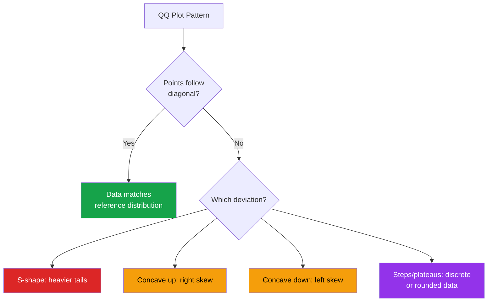
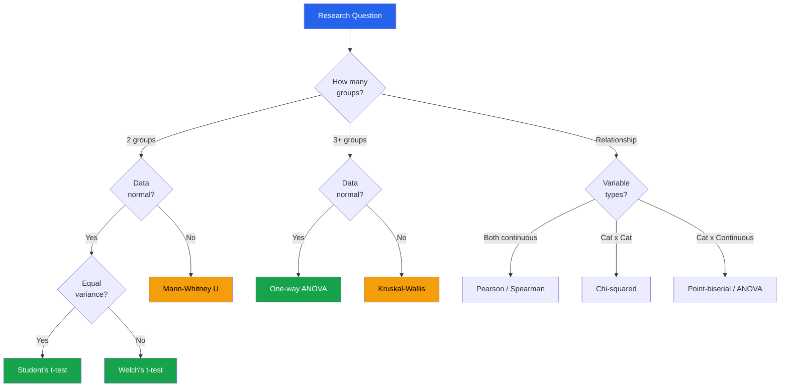

# SciPy Statistics for EDA

SciPy's `stats` module provides the statistical backbone for rigorous EDA: distribution fitting, hypothesis testing, normality checks, and goodness-of-fit assessments. This page covers everything you need to move from "this looks normal" to "this is statistically confirmed to be normal."

---

## Probability Distributions

### Common Distributions for EDA

```python
import numpy as np
import pandas as pd
import matplotlib.pyplot as plt
from scipy import stats

np.random.seed(42)

# Key distributions and when you encounter them in EDA
distributions = {
    'Normal':      stats.norm(loc=50, scale=10),
    'Log-Normal':  stats.lognorm(s=0.5, loc=0, scale=np.exp(4)),
    'Exponential': stats.expon(scale=10),
    'Gamma':       stats.gamma(a=2, scale=5),
    'Beta':        stats.beta(a=2, b=5),
    'Poisson':     stats.poisson(mu=5),
    'Uniform':     stats.uniform(loc=0, scale=100),
    'Weibull':     stats.weibull_min(c=1.5, scale=10),
}

fig, axes = plt.subplots(2, 4, figsize=(20, 8))
axes = axes.flatten()

for i, (name, dist) in enumerate(distributions.items()):
    ax = axes[i]
    if hasattr(dist, 'pdf'):  # continuous
        x = np.linspace(dist.ppf(0.001), dist.ppf(0.999), 200)
        ax.plot(x, dist.pdf(x), 'b-', linewidth=2)
        ax.fill_between(x, dist.pdf(x), alpha=0.2)
    else:  # discrete
        x = np.arange(dist.ppf(0.001), dist.ppf(0.999))
        ax.bar(x, dist.pmf(x), color='steelblue', alpha=0.7)
    ax.set_title(name, fontweight='bold')
    ax.set_ylabel('Density')

plt.tight_layout()
plt.show()
```

### Distribution Properties

```python
dist = stats.norm(loc=100, scale=15)

print(f"Mean:     {dist.mean():.2f}")
print(f"Median:   {dist.median():.2f}")
print(f"Variance: {dist.var():.2f}")
print(f"Std dev:  {dist.std():.2f}")
print(f"Skewness: {dist.stats(moments='s')[0]:.4f}")
print(f"Kurtosis: {dist.stats(moments='k')[0]:.4f}")

# Percentiles / quantiles
print(f"\nPercentiles:")
for p in [1, 5, 25, 50, 75, 95, 99]:
    print(f"  P{p}: {dist.ppf(p/100):.2f}")

# Probability calculations
print(f"\nP(X > 120): {1 - dist.cdf(120):.4f}")
print(f"P(80 < X < 120): {dist.cdf(120) - dist.cdf(80):.4f}")
print(f"P(X < 70): {dist.cdf(70):.4f}")

# Generate random samples
samples = dist.rvs(size=10000)
```

---

## Distribution Fitting

### Fitting Data to Known Distributions

```python
# Generate synthetic right-skewed data (common in EDA: prices, incomes)
data = np.random.lognormal(mean=3, sigma=0.8, size=5000)

# Fit multiple distributions
candidates = {
    'norm':       stats.norm,
    'lognorm':    stats.lognorm,
    'gamma':      stats.gamma,
    'expon':      stats.expon,
    'weibull_min': stats.weibull_min,
}

fit_results = {}
for name, dist_class in candidates.items():
    try:
        params = dist_class.fit(data)
        # KS test for goodness of fit
        ks_stat, ks_p = stats.kstest(data, dist_class.cdf, args=params)
        # Log-likelihood
        ll = np.sum(dist_class.logpdf(data, *params))
        # AIC (lower is better)
        k = len(params)
        aic = 2 * k - 2 * ll

        fit_results[name] = {
            'params': params,
            'ks_stat': ks_stat,
            'ks_p': ks_p,
            'log_likelihood': ll,
            'aic': aic,
        }
    except Exception as e:
        print(f"  {name}: fit failed ({e})")

# Rank by AIC
ranked = sorted(fit_results.items(), key=lambda x: x[1]['aic'])
print("Distribution Fit Rankings (by AIC):")
print(f"{'Distribution':<15} {'AIC':>12} {'KS Stat':>10} {'KS p-value':>12}")
print("-" * 52)
for name, r in ranked:
    print(f"{name:<15} {r['aic']:>12.1f} {r['ks_stat']:>10.4f} {r['ks_p']:>12.4f}")
```

### Visualizing Fitted Distributions

```python
best_name, best_result = ranked[0]

fig, axes = plt.subplots(1, 3, figsize=(18, 5))

# Histogram + fitted PDF
x = np.linspace(data.min(), np.percentile(data, 99), 200)
axes[0].hist(data, bins=60, density=True, alpha=0.5, edgecolor='white', label='Data')
for name, r in ranked[:3]:
    dist_class = candidates[name]
    pdf = dist_class.pdf(x, *r['params'])
    axes[0].plot(x, pdf, linewidth=2, label=f'{name} (AIC={r["aic"]:.0f})')
axes[0].set_title('Data vs Fitted Distributions')
axes[0].legend(fontsize=9)
axes[0].set_xlabel('Value')
axes[0].set_ylabel('Density')

# CDF comparison
axes[1].hist(data, bins=60, density=True, cumulative=True, alpha=0.3, label='Empirical CDF')
for name, r in ranked[:3]:
    dist_class = candidates[name]
    cdf = dist_class.cdf(x, *r['params'])
    axes[1].plot(x, cdf, linewidth=2, label=name)
axes[1].set_title('CDF Comparison')
axes[1].legend(fontsize=9)

# PP-plot for best fit
dist_class = candidates[best_name]
theoretical_cdf = dist_class.cdf(np.sort(data), *best_result['params'])
empirical_cdf = np.arange(1, len(data) + 1) / len(data)
axes[2].scatter(theoretical_cdf, empirical_cdf, alpha=0.1, s=5)
axes[2].plot([0, 1], [0, 1], 'r--', linewidth=2)
axes[2].set_title(f'PP-Plot ({best_name})')
axes[2].set_xlabel('Theoretical CDF')
axes[2].set_ylabel('Empirical CDF')
axes[2].set_aspect('equal')

plt.tight_layout()
plt.show()
```

---

## QQ Plots (Quantile-Quantile)

### Normality Assessment

```python
def qq_plot_analysis(data, title="QQ Plot"):
    """Create QQ plot with interpretation guide."""
    fig, axes = plt.subplots(1, 3, figsize=(18, 5))

    # Standard QQ plot
    stats.probplot(data, dist='norm', plot=axes[0])
    axes[0].set_title(f'{title} — Normal QQ')
    axes[0].get_lines()[0].set_markersize(3)
    axes[0].get_lines()[0].set_alpha(0.5)

    # Log-transformed QQ (for skewed data)
    positive_data = data[data > 0]
    stats.probplot(np.log(positive_data), dist='norm', plot=axes[1])
    axes[1].set_title(f'{title} — Log-Normal QQ')
    axes[1].get_lines()[0].set_markersize(3)

    # Distribution of residuals from QQ line
    osm, osr = stats.probplot(data, dist='norm')[:2]
    slope, intercept = np.polyfit(osm[0], osm[1], 1)
    residuals = osm[1] - (slope * osm[0] + intercept)
    axes[2].hist(residuals, bins=40, edgecolor='white', alpha=0.7)
    axes[2].set_title('QQ Residuals (should be ~0)')
    axes[2].axvline(0, color='red', linestyle='--')

    plt.tight_layout()
    plt.show()

# Test with different distributions
normal_data = np.random.normal(100, 15, 2000)
skewed_data = np.random.lognormal(4, 0.8, 2000)
heavy_tails = np.random.standard_t(3, 2000) * 10 + 100

qq_plot_analysis(normal_data, "Normal Data")
qq_plot_analysis(skewed_data, "Skewed Data")
qq_plot_analysis(heavy_tails, "Heavy-Tailed Data")
```

### QQ Plot Interpretation Guide



---

## Normality Tests

### Comprehensive Normality Testing

```python
def test_normality(data, name="data", alpha=0.05):
    """Run multiple normality tests and report results."""
    data = data[~np.isnan(data)]

    print(f"\nNormality Tests for '{name}' (n={len(data)}, alpha={alpha})")
    print("=" * 65)

    results = {}

    # 1. Shapiro-Wilk (best for n < 5000)
    if len(data) <= 5000:
        stat, p = stats.shapiro(data)
        results['Shapiro-Wilk'] = (stat, p)
        verdict = "NORMAL" if p > alpha else "NOT normal"
        print(f"  Shapiro-Wilk:    W={stat:.4f}, p={p:.4f} --> {verdict}")
    else:
        sample = np.random.choice(data, 5000, replace=False)
        stat, p = stats.shapiro(sample)
        results['Shapiro-Wilk (sample)'] = (stat, p)
        print(f"  Shapiro-Wilk*:   W={stat:.4f}, p={p:.4f} (sampled 5000)")

    # 2. D'Agostino-Pearson (good for n > 20)
    if len(data) >= 20:
        stat, p = stats.normaltest(data)
        results["D'Agostino-Pearson"] = (stat, p)
        verdict = "NORMAL" if p > alpha else "NOT normal"
        print(f"  D'Agostino-Pearson: K2={stat:.4f}, p={p:.4f} --> {verdict}")

    # 3. Anderson-Darling
    result = stats.anderson(data, dist='norm')
    ad_stat = result.statistic
    # Use 5% significance level
    idx = list(result.significance_level).index(5.0)
    critical = result.critical_values[idx]
    is_normal = ad_stat < critical
    results['Anderson-Darling'] = (ad_stat, critical)
    verdict = "NORMAL" if is_normal else "NOT normal"
    print(f"  Anderson-Darling: A2={ad_stat:.4f}, critical(5%)={critical:.4f} --> {verdict}")

    # 4. Kolmogorov-Smirnov
    stat, p = stats.kstest(data, 'norm', args=(data.mean(), data.std()))
    results['KS test'] = (stat, p)
    verdict = "NORMAL" if p > alpha else "NOT normal"
    print(f"  Kolmogorov-Smirnov: D={stat:.4f}, p={p:.4f} --> {verdict}")

    # 5. Jarque-Bera
    stat, p = stats.jarque_bera(data)
    results['Jarque-Bera'] = (stat, p)
    verdict = "NORMAL" if p > alpha else "NOT normal"
    print(f"  Jarque-Bera:     JB={stat:.4f}, p={p:.4f} --> {verdict}")

    # Summary stats
    print(f"\n  Descriptive: mean={data.mean():.2f}, std={data.std():.2f}")
    print(f"  Skewness: {stats.skew(data):.4f}")
    print(f"  Kurtosis (excess): {stats.kurtosis(data):.4f}")

    return results

# Test
normal_data = np.random.normal(100, 15, 1000)
test_normality(normal_data, "Normal Sample")

skewed_data = np.random.lognormal(4, 0.8, 1000)
test_normality(skewed_data, "Log-Normal Sample")
```

---

## Statistical Tests for EDA

### Comparing Two Groups

```python
def compare_two_groups(group_a, group_b, name_a="A", name_b="B", alpha=0.05):
    """Comprehensive two-sample comparison."""
    print(f"\nComparing {name_a} (n={len(group_a)}) vs {name_b} (n={len(group_b)})")
    print("=" * 60)

    # Descriptive
    print(f"  {name_a}: mean={group_a.mean():.3f}, std={group_a.std():.3f}, median={np.median(group_a):.3f}")
    print(f"  {name_b}: mean={group_b.mean():.3f}, std={group_b.std():.3f}, median={np.median(group_b):.3f}")

    # Check normality
    _, p_norm_a = stats.shapiro(group_a[:5000])
    _, p_norm_b = stats.shapiro(group_b[:5000])
    both_normal = p_norm_a > alpha and p_norm_b > alpha

    # Check equal variance
    _, p_levene = stats.levene(group_a, group_b)
    equal_var = p_levene > alpha

    print(f"\n  Normality: {name_a} p={p_norm_a:.4f}, {name_b} p={p_norm_b:.4f}")
    print(f"  Equal variance (Levene): p={p_levene:.4f} {'(equal)' if equal_var else '(unequal)'}")

    # Parametric tests
    print(f"\n  Parametric Tests:")
    if equal_var:
        stat, p = stats.ttest_ind(group_a, group_b)
        print(f"    Student's t-test: t={stat:.4f}, p={p:.4f}")
    stat, p = stats.ttest_ind(group_a, group_b, equal_var=False)
    print(f"    Welch's t-test:   t={stat:.4f}, p={p:.4f}")

    # Non-parametric tests
    print(f"\n  Non-Parametric Tests:")
    stat, p = stats.mannwhitneyu(group_a, group_b, alternative='two-sided')
    print(f"    Mann-Whitney U:   U={stat:.1f}, p={p:.4f}")

    stat, p = stats.ks_2samp(group_a, group_b)
    print(f"    KS 2-sample:      D={stat:.4f}, p={p:.4f}")

    # Effect size (Cohen's d)
    pooled_std = np.sqrt((group_a.std()**2 + group_b.std()**2) / 2)
    d = (group_a.mean() - group_b.mean()) / pooled_std
    magnitude = "negligible" if abs(d) < 0.2 else "small" if abs(d) < 0.5 else "medium" if abs(d) < 0.8 else "large"
    print(f"\n  Effect Size: Cohen's d = {d:.4f} ({magnitude})")

# Example
group_a = np.random.normal(50, 10, 500)
group_b = np.random.normal(52, 12, 500)
compare_two_groups(group_a, group_b, "Control", "Treatment")
```

### Comparing Multiple Groups

```python
def compare_multiple_groups(groups, group_names, alpha=0.05):
    """ANOVA / Kruskal-Wallis for k-group comparison."""
    print(f"\nComparing {len(groups)} groups")
    print("=" * 60)

    for name, g in zip(group_names, groups):
        print(f"  {name}: n={len(g)}, mean={g.mean():.3f}, std={g.std():.3f}")

    # Check normality for all groups
    all_normal = all(stats.shapiro(g[:5000])[1] > alpha for g in groups)

    if all_normal:
        # One-way ANOVA
        stat, p = stats.f_oneway(*groups)
        print(f"\n  One-way ANOVA: F={stat:.4f}, p={p:.6f}")
    else:
        print(f"\n  Non-normal data detected.")

    # Kruskal-Wallis (non-parametric alternative)
    stat, p = stats.kruskal(*groups)
    print(f"  Kruskal-Wallis: H={stat:.4f}, p={p:.6f}")

    # Effect size (eta-squared for ANOVA)
    all_data = np.concatenate(groups)
    grand_mean = all_data.mean()
    ss_between = sum(len(g) * (g.mean() - grand_mean)**2 for g in groups)
    ss_total = np.sum((all_data - grand_mean)**2)
    eta_sq = ss_between / ss_total
    print(f"  Eta-squared: {eta_sq:.4f}")

    if p < alpha:
        print(f"\n  Post-hoc pairwise comparisons (Mann-Whitney with Bonferroni):")
        n_tests = len(groups) * (len(groups) - 1) // 2
        adjusted_alpha = alpha / n_tests
        for i in range(len(groups)):
            for j in range(i + 1, len(groups)):
                stat, p_val = stats.mannwhitneyu(groups[i], groups[j])
                sig = "***" if p_val < adjusted_alpha else ""
                print(f"    {group_names[i]} vs {group_names[j]}: "
                      f"U={stat:.1f}, p={p_val:.4f} {sig}")

groups = [
    np.random.normal(50, 10, 300),
    np.random.normal(52, 10, 300),
    np.random.normal(55, 12, 300),
    np.random.normal(48, 9, 300),
]
compare_multiple_groups(groups, ['North', 'South', 'East', 'West'])
```

---

## Correlation Tests

```python
def correlation_analysis(x, y, name_x="X", name_y="Y"):
    """Comprehensive correlation analysis."""
    print(f"\nCorrelation: {name_x} vs {name_y} (n={len(x)})")
    print("=" * 55)

    # Pearson (linear, assumes normality)
    r, p = stats.pearsonr(x, y)
    print(f"  Pearson r:    {r:+.4f}, p={p:.4f}")

    # Spearman (monotonic, rank-based)
    rho, p = stats.spearmanr(x, y)
    print(f"  Spearman rho: {rho:+.4f}, p={p:.4f}")

    # Kendall (ordinal, robust)
    tau, p = stats.kendalltau(x, y)
    print(f"  Kendall tau:  {tau:+.4f}, p={p:.4f}")

    # Point-biserial (if one variable is binary)
    # rpb, p = stats.pointbiserialr(binary, continuous)

    print(f"\n  Interpretation:")
    mag = abs(r)
    if mag < 0.1:
        print(f"    Negligible linear relationship")
    elif mag < 0.3:
        print(f"    Weak linear relationship")
    elif mag < 0.5:
        print(f"    Moderate linear relationship")
    elif mag < 0.7:
        print(f"    Strong linear relationship")
    else:
        print(f"    Very strong linear relationship")

    if abs(rho - r) > 0.1:
        print(f"    Spearman differs from Pearson: possible nonlinear relationship")

x = np.random.randn(500)
y = x**2 + np.random.randn(500) * 0.5  # nonlinear relationship
correlation_analysis(x, y, "X", "X-squared+noise")
```

---

## Goodness-of-Fit Tests

### Kolmogorov-Smirnov Test

```python
def ks_test_suite(data, name="data"):
    """Test data against multiple reference distributions."""
    print(f"\nKS Goodness-of-Fit Tests for '{name}' (n={len(data)})")
    print("=" * 60)

    tests = [
        ('Normal', 'norm', (data.mean(), data.std())),
        ('Exponential', 'expon', (data.min(), data.std())),
        ('Uniform', 'uniform', (data.min(), data.max() - data.min())),
    ]

    # Also fit and test lognormal (positive data only)
    if np.all(data > 0):
        params = stats.lognorm.fit(data)
        tests.append(('Log-Normal (fitted)', 'lognorm', params))

    for name_dist, dist_name, params in tests:
        stat, p = stats.kstest(data, dist_name, args=params)
        verdict = "PASS" if p > 0.05 else "FAIL"
        print(f"  {name_dist:<25} D={stat:.4f}, p={p:.4f} [{verdict}]")

# Test
income_data = np.random.lognormal(10, 0.8, 2000)
ks_test_suite(income_data, "Income")
```

### Chi-Squared Goodness-of-Fit

```python
# Test if observed frequencies match expected
observed = np.array([48, 35, 42, 30, 45])
expected_probs = np.array([0.2, 0.2, 0.2, 0.2, 0.2])  # uniform
expected = expected_probs * observed.sum()

stat, p = stats.chisquare(observed, f_exp=expected)
print(f"Chi-squared test: X2={stat:.4f}, p={p:.4f}")
print(f"Uniform distribution: {'plausible' if p > 0.05 else 'rejected'}")

# Chi-squared test of independence (contingency table)
contingency = np.array([
    [50, 30, 20],  # Group A
    [35, 45, 20],  # Group B
    [40, 25, 35],  # Group C
])
chi2, p, dof, expected = stats.chi2_contingency(contingency)
print(f"\nIndependence test: X2={chi2:.4f}, p={p:.4f}, dof={dof}")
print(f"Groups and categories are {'dependent' if p < 0.05 else 'independent'}")

# Cramers V (effect size for chi-squared)
n = contingency.sum()
min_dim = min(contingency.shape) - 1
cramers_v = np.sqrt(chi2 / (n * min_dim))
print(f"Cramer's V: {cramers_v:.4f}")
```

---

## Statistical Test Decision Guide



---

## Automated Statistical Report

```python
def statistical_eda_report(df, numeric_cols=None, categorical_cols=None, target=None):
    """Generate a comprehensive statistical EDA report."""
    if numeric_cols is None:
        numeric_cols = df.select_dtypes(include='number').columns.tolist()
    if categorical_cols is None:
        categorical_cols = df.select_dtypes(include=['object', 'category']).columns.tolist()

    print("=" * 70)
    print("STATISTICAL EDA REPORT")
    print("=" * 70)

    # 1. Normality tests for all numeric columns
    print("\n[1] NORMALITY TESTS")
    print("-" * 50)
    for col in numeric_cols:
        data = df[col].dropna().values
        if len(data) < 20:
            continue
        sample = data[:5000]
        _, p_shapiro = stats.shapiro(sample)
        skew = stats.skew(data)
        kurt = stats.kurtosis(data)
        is_normal = p_shapiro > 0.05
        print(f"  {col:<25} Shapiro p={p_shapiro:.4f} "
              f"skew={skew:+.2f} kurt={kurt:+.2f} "
              f"{'[NORMAL]' if is_normal else '[NOT NORMAL]'}")

    # 2. Correlation significance
    if len(numeric_cols) >= 2:
        print(f"\n[2] SIGNIFICANT CORRELATIONS (p < 0.05)")
        print("-" * 50)
        for i in range(len(numeric_cols)):
            for j in range(i + 1, len(numeric_cols)):
                x = df[numeric_cols[i]].dropna()
                y = df[numeric_cols[j]].dropna()
                common = x.index.intersection(y.index)
                r, p = stats.pearsonr(x[common], y[common])
                if p < 0.05:
                    print(f"  {numeric_cols[i]:>20} x {numeric_cols[j]:<20} "
                          f"r={r:+.3f} p={p:.4f}")

    # 3. Group comparisons (if target is categorical)
    if target and target in categorical_cols:
        print(f"\n[3] GROUP COMPARISONS (target: {target})")
        print("-" * 50)
        groups = df[target].unique()
        for col in numeric_cols:
            group_data = [df[df[target] == g][col].dropna().values for g in groups]
            if len(group_data) == 2:
                stat, p = stats.mannwhitneyu(group_data[0], group_data[1])
                print(f"  {col:<25} Mann-Whitney p={p:.4f} "
                      f"{'***' if p < 0.001 else '**' if p < 0.01 else '*' if p < 0.05 else ''}")
            else:
                stat, p = stats.kruskal(*[g for g in group_data if len(g) > 0])
                print(f"  {col:<25} Kruskal-Wallis p={p:.4f} "
                      f"{'***' if p < 0.001 else '**' if p < 0.01 else '*' if p < 0.05 else ''}")

    # 4. Categorical independence
    if len(categorical_cols) >= 2:
        print(f"\n[4] CATEGORICAL INDEPENDENCE (Chi-squared)")
        print("-" * 50)
        for i in range(len(categorical_cols)):
            for j in range(i + 1, len(categorical_cols)):
                ct = pd.crosstab(df[categorical_cols[i]], df[categorical_cols[j]])
                chi2, p, dof, _ = stats.chi2_contingency(ct)
                n = ct.sum().sum()
                cramers = np.sqrt(chi2 / (n * (min(ct.shape) - 1)))
                if p < 0.05:
                    print(f"  {categorical_cols[i]:>20} x {categorical_cols[j]:<20} "
                          f"X2={chi2:.1f} p={p:.4f} V={cramers:.3f}")

# Usage with sample data
np.random.seed(42)
report_df = pd.DataFrame({
    'revenue':    np.random.lognormal(4, 1, 1000),
    'age':        np.random.normal(40, 12, 1000),
    'score':      np.random.normal(700, 60, 1000),
    'tenure':     np.random.exponential(5, 1000),
    'segment':    np.random.choice(['A', 'B', 'C'], 1000),
    'region':     np.random.choice(['N', 'S', 'E', 'W'], 1000),
})

statistical_eda_report(report_df, target='segment')
```

---

## Key Takeaways

- **QQ plots** are the visual gold standard for assessing distributional fit — always plot before testing
- Use **Shapiro-Wilk** for n < 5000, **Anderson-Darling** for larger samples
- Choose the **right test** based on normality, sample size, and number of groups (see decision flowchart)
- **Effect sizes** (Cohen's d, eta-squared, Cramer's V) matter more than p-values for practical significance
- Fit candidate distributions with **AIC** ranking, not just KS p-values
- With large samples (n > 10000), nearly everything will be "statistically significant" — focus on effect size
- Always report **confidence intervals** alongside point estimates and p-values
