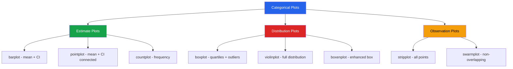

# Seaborn for EDA

Seaborn builds on Matplotlib and integrates with pandas to provide a high-level, statistically-aware plotting API. It excels at revealing relationships and distributions in your data with minimal code.

---

## Setup and Themes

```python
import seaborn as sns
import matplotlib.pyplot as plt
import pandas as pd
import numpy as np

# Set global theme
sns.set_theme(style='whitegrid', palette='muted', font_scale=1.1)

# Available styles: darkgrid, whitegrid, dark, white, ticks
# Available palettes: deep, muted, pastel, bright, dark, colorblind

# Custom palette
custom_palette = ['#2563eb', '#dc2626', '#16a34a', '#f59e0b', '#9333ea']
sns.set_palette(custom_palette)

# Context presets: paper, notebook, talk, poster
sns.set_context('notebook', rc={'lines.linewidth': 2})
```

### Simulated Dataset

```python
np.random.seed(42)
n = 2000

df = pd.DataFrame({
    'age':        np.random.normal(40, 12, n).clip(18, 80).astype(int),
    'income':     np.random.lognormal(10.5, 0.8, n).round(0),
    'spending':   np.random.lognormal(7, 1.2, n).round(2),
    'credit_score': np.random.normal(700, 60, n).clip(300, 850).astype(int),
    'tenure':     np.random.exponential(5, n).clip(0, 30).round(1),
    'n_products': np.random.poisson(3, n).clip(1, 10),
    'region':     np.random.choice(['North', 'South', 'East', 'West'], n, p=[0.3, 0.2, 0.25, 0.25]),
    'segment':    np.random.choice(['Premium', 'Standard', 'Basic'], n, p=[0.15, 0.5, 0.35]),
    'churned':    np.random.choice([0, 1], n, p=[0.8, 0.2]),
})
df['log_income'] = np.log(df['income'])
df['log_spending'] = np.log(df['spending'])
```

---

## Relational Plots

### scatterplot

```python
fig, axes = plt.subplots(1, 2, figsize=(16, 6))

# Basic scatter with hue, size, and style
sns.scatterplot(
    data=df, x='income', y='spending', hue='segment',
    size='n_products', sizes=(20, 200), alpha=0.6,
    ax=axes[0]
)
axes[0].set_title('Income vs Spending by Segment')
axes[0].set_xscale('log')
axes[0].set_yscale('log')

# Scatter with regression line
sns.regplot(
    data=df, x='age', y='credit_score',
    scatter_kws={'alpha': 0.2, 's': 10},
    line_kws={'color': 'red', 'linewidth': 2},
    ax=axes[1]
)
axes[1].set_title('Age vs Credit Score with Regression')

plt.tight_layout()
plt.show()
```

### lineplot

```python
# Time series with confidence intervals
dates = pd.date_range('2024-01-01', periods=365, freq='D')
ts_data = pd.DataFrame({
    'date': np.tile(dates, 3),
    'region': np.repeat(['North', 'South', 'East'], 365),
    'sales': np.concatenate([
        np.cumsum(np.random.randn(365) * 5 + 2) + 500,
        np.cumsum(np.random.randn(365) * 4 + 1.5) + 400,
        np.cumsum(np.random.randn(365) * 6 + 3) + 600,
    ]).round(2)
})

fig, ax = plt.subplots(figsize=(14, 6))
sns.lineplot(data=ts_data, x='date', y='sales', hue='region', ax=ax)
ax.set_title('Regional Sales Trends')
ax.legend(title='Region')
fig.autofmt_xdate()
plt.tight_layout()
plt.show()
```

---

## Distribution Plots

### histplot

```python
fig, axes = plt.subplots(2, 2, figsize=(14, 10))

# Simple histogram
sns.histplot(data=df, x='income', bins=50, ax=axes[0, 0])
axes[0, 0].set_title('Income Distribution')

# With KDE overlay
sns.histplot(data=df, x='income', bins=50, kde=True, ax=axes[0, 1])
axes[0, 1].set_title('Income with KDE')

# By category
sns.histplot(data=df, x='credit_score', hue='segment', bins=40,
             alpha=0.5, ax=axes[1, 0])
axes[1, 0].set_title('Credit Score by Segment')

# Cumulative distribution
sns.histplot(data=df, x='tenure', cumulative=True, stat='probability',
             element='step', ax=axes[1, 1])
axes[1, 1].set_title('Tenure CDF')

plt.tight_layout()
plt.show()
```

### kdeplot

```python
fig, axes = plt.subplots(1, 3, figsize=(18, 5))

# 1D KDE comparison
sns.kdeplot(data=df, x='income', hue='segment', fill=True, alpha=0.3,
            common_norm=False, ax=axes[0])
axes[0].set_title('Income Distribution by Segment')
axes[0].set_xscale('log')

# 2D KDE (contour)
sns.kdeplot(data=df, x='age', y='credit_score', fill=True,
            cmap='Blues', levels=10, thresh=0.05, ax=axes[1])
axes[1].set_title('Age vs Credit Score Density')

# Multiple overlapping KDEs
for segment in df['segment'].unique():
    subset = df[df['segment'] == segment]
    sns.kdeplot(data=subset, x='tenure', label=segment, ax=axes[2])
axes[2].set_title('Tenure by Segment')
axes[2].legend()

plt.tight_layout()
plt.show()
```

### ecdfplot — Empirical CDF

```python
fig, ax = plt.subplots(figsize=(10, 6))
sns.ecdfplot(data=df, x='income', hue='segment', ax=ax)
ax.set_title('Income ECDF by Segment')
ax.set_xscale('log')

# Annotate median lines
for segment in df['segment'].unique():
    median = df[df['segment'] == segment]['income'].median()
    ax.axvline(median, linestyle='--', alpha=0.5)

plt.tight_layout()
plt.show()
```

---

## Categorical Plots

### catplot Family Overview



### barplot and countplot

```python
fig, axes = plt.subplots(1, 3, figsize=(18, 5))

# Count plot
sns.countplot(data=df, x='segment', order=['Basic', 'Standard', 'Premium'],
              hue='segment', ax=axes[0])
axes[0].set_title('Customer Segment Counts')

# Bar plot (mean with confidence interval)
sns.barplot(data=df, x='segment', y='income', hue='segment',
            order=['Basic', 'Standard', 'Premium'],
            estimator='mean', errorbar='ci', ax=axes[1])
axes[1].set_title('Mean Income by Segment (95% CI)')

# Grouped bar plot
sns.barplot(data=df, x='region', y='spending', hue='segment',
            estimator='median', errorbar=None, ax=axes[2])
axes[2].set_title('Median Spending by Region & Segment')

plt.tight_layout()
plt.show()
```

### boxplot and violinplot

```python
fig, axes = plt.subplots(1, 3, figsize=(18, 6))

# Box plot by category
sns.boxplot(data=df, x='segment', y='income',
            order=['Basic', 'Standard', 'Premium'],
            showfliers=True, flierprops={'marker': 'o', 'markersize': 3},
            ax=axes[0])
axes[0].set_title('Income by Segment')
axes[0].set_yscale('log')

# Violin plot
sns.violinplot(data=df, x='segment', y='credit_score',
               order=['Basic', 'Standard', 'Premium'],
               inner='quartile', cut=0, ax=axes[1])
axes[1].set_title('Credit Score Distribution')

# Split violin (compare two groups)
sns.violinplot(data=df, x='segment', y='tenure',
               hue='churned', split=True,
               order=['Basic', 'Standard', 'Premium'],
               inner='quart', ax=axes[2])
axes[2].set_title('Tenure by Segment & Churn')
axes[2].legend(title='Churned')

plt.tight_layout()
plt.show()
```

### stripplot and swarmplot

```python
fig, axes = plt.subplots(1, 2, figsize=(14, 6))

# Strip plot (jittered scatter for categories)
sns.stripplot(data=df.sample(500), x='segment', y='n_products',
              hue='churned', dodge=True, jitter=0.3, alpha=0.5,
              order=['Basic', 'Standard', 'Premium'], ax=axes[0])
axes[0].set_title('Products per Customer (Strip)')

# Swarm plot (non-overlapping — use small samples)
sample = df.sample(200, random_state=42)
sns.swarmplot(data=sample, x='segment', y='n_products',
              hue='churned', dodge=True, size=4,
              order=['Basic', 'Standard', 'Premium'], ax=axes[1])
axes[1].set_title('Products per Customer (Swarm)')

plt.tight_layout()
plt.show()
```

### Box + Strip Overlay

```python
fig, ax = plt.subplots(figsize=(10, 6))

# Combine box plot with strip plot for full picture
sns.boxplot(data=df, x='region', y='spending', showfliers=False,
            boxprops={'facecolor': 'lightblue', 'alpha': 0.5}, ax=ax)
sns.stripplot(data=df.sample(500), x='region', y='spending',
              color='darkblue', alpha=0.3, size=3, jitter=0.2, ax=ax)

ax.set_title('Spending by Region (Box + Strip)')
ax.set_yscale('log')
plt.tight_layout()
plt.show()
```

---

## Matrix Plots

### Heatmap

```python
# Correlation heatmap
numeric_cols = ['age', 'income', 'spending', 'credit_score', 'tenure', 'n_products']
corr = df[numeric_cols].corr()

fig, ax = plt.subplots(figsize=(10, 8))
mask = np.triu(np.ones_like(corr, dtype=bool))  # upper triangle mask
sns.heatmap(
    corr,
    mask=mask,
    annot=True,
    fmt='.2f',
    cmap='RdBu_r',
    center=0,
    vmin=-1,
    vmax=1,
    square=True,
    linewidths=0.5,
    cbar_kws={'shrink': 0.8, 'label': 'Pearson r'},
    ax=ax,
)
ax.set_title('Correlation Matrix (Lower Triangle)', fontsize=14, fontweight='bold')
plt.tight_layout()
plt.show()
```

### clustermap — Hierarchically Clustered Heatmap

```python
# Cluster map with dendrogram
pivot_data = df.groupby(['region', 'segment'])['spending'].mean().unstack()

g = sns.clustermap(
    pivot_data,
    annot=True,
    fmt='.0f',
    cmap='YlOrRd',
    standard_scale=1,  # standardize columns
    figsize=(8, 6),
    linewidths=0.5,
)
g.fig.suptitle('Clustered Spending Heatmap', y=1.02)
plt.show()
```

---

## Multi-Panel Plots with FacetGrid

### FacetGrid — Faceted Distributions

```python
# Distribution per segment and region
g = sns.FacetGrid(df, col='region', row='segment', height=3, aspect=1.3)
g.map_dataframe(sns.histplot, x='income', bins=30, kde=True)
g.set_titles('{row_name} | {col_name}')
g.set_axis_labels('Income', 'Count')
g.fig.suptitle('Income Distribution by Segment & Region', y=1.02, fontsize=14)
plt.tight_layout()
plt.show()
```

### catplot — Figure-Level Categorical

```python
# Figure-level function creates its own figure
g = sns.catplot(
    data=df, x='region', y='income', hue='segment',
    col='churned', kind='box',
    height=5, aspect=1.2,
    order=['North', 'South', 'East', 'West'],
    hue_order=['Basic', 'Standard', 'Premium'],
)
g.set_titles('Churned = {col_name}')
g.set_axis_labels('Region', 'Income')
g.fig.suptitle('Income by Region, Segment, and Churn Status', y=1.02)
plt.show()
```

### relplot — Figure-Level Relational

```python
g = sns.relplot(
    data=df, x='age', y='spending', hue='segment',
    col='region', col_wrap=2,
    kind='scatter', alpha=0.4, s=20,
    height=4, aspect=1.3,
)
g.set_titles('{col_name}')
g.set_axis_labels('Age', 'Spending')
g.fig.suptitle('Age vs Spending by Region', y=1.02)
plt.show()
```

---

## Pair Plots — All Pairwise Relationships

```python
# Subset for performance
cols = ['age', 'log_income', 'log_spending', 'credit_score', 'tenure']

g = sns.pairplot(
    df[cols + ['segment']].sample(500, random_state=42),
    hue='segment',
    diag_kind='kde',
    plot_kws={'alpha': 0.4, 's': 20},
    diag_kws={'fill': True, 'alpha': 0.5},
    corner=True,  # lower triangle only
)
g.fig.suptitle('Pairwise Relationships', y=1.02, fontsize=14)
plt.show()
```

### Custom PairGrid

```python
g = sns.PairGrid(
    df[cols + ['churned']].sample(300, random_state=42),
    hue='churned',
    diag_sharey=False,
)
g.map_upper(sns.scatterplot, alpha=0.3, s=15)
g.map_lower(sns.kdeplot, fill=True, alpha=0.3)
g.map_diag(sns.histplot, kde=True, alpha=0.5)
g.add_legend()
g.fig.suptitle('Churned vs Non-Churned Feature Relationships', y=1.02)
plt.show()
```

---

## Joint Plots — Bivariate with Marginals

```python
# Scatter + histograms
g = sns.jointplot(
    data=df, x='age', y='credit_score',
    kind='scatter', alpha=0.3, s=10,
    marginal_kws={'bins': 40},
    height=8,
)
g.fig.suptitle('Age vs Credit Score', y=1.02)

# KDE joint plot
g2 = sns.jointplot(
    data=df, x='log_income', y='log_spending',
    kind='kde', fill=True, cmap='Blues',
    height=8,
)
g2.fig.suptitle('Income vs Spending (Log Scale)', y=1.02)

# Hex bin (large datasets)
g3 = sns.jointplot(
    data=df, x='age', y='income',
    kind='hex', gridsize=25, cmap='YlOrRd',
    height=8,
)
g3.fig.suptitle('Age vs Income (Hex Bins)', y=1.02)
plt.show()
```

---

## Complete EDA Visualization Function

```python
def seaborn_eda_suite(df, target=None, sample_size=1000):
    """Generate a comprehensive EDA visualization suite using Seaborn."""

    numeric = df.select_dtypes(include='number').columns.tolist()
    categorical = df.select_dtypes(include=['object', 'category']).columns.tolist()

    if target and target in numeric:
        numeric.remove(target)

    sample = df.sample(min(sample_size, len(df)), random_state=42)

    # 1. Distribution grid
    n_cols = min(3, len(numeric))
    n_rows = (len(numeric) + n_cols - 1) // n_cols
    fig, axes = plt.subplots(n_rows, n_cols, figsize=(6 * n_cols, 4 * n_rows))
    axes = np.atleast_2d(axes)
    for i, col in enumerate(numeric):
        r, c = divmod(i, n_cols)
        sns.histplot(data=df, x=col, kde=True, ax=axes[r, c])
        axes[r, c].set_title(f'{col} (skew={df[col].skew():.2f})')
    # Hide unused
    for j in range(len(numeric), n_rows * n_cols):
        r, c = divmod(j, n_cols)
        axes[r, c].set_visible(False)
    fig.suptitle('Numeric Distributions', fontsize=14, fontweight='bold', y=1.01)
    plt.tight_layout()
    plt.show()

    # 2. Correlation heatmap
    if len(numeric) >= 2:
        corr = df[numeric].corr()
        fig, ax = plt.subplots(figsize=(max(8, len(numeric)), max(6, len(numeric) * 0.8)))
        mask = np.triu(np.ones_like(corr, dtype=bool))
        sns.heatmap(corr, mask=mask, annot=True, fmt='.2f', cmap='RdBu_r',
                    center=0, square=True, ax=ax)
        ax.set_title('Correlation Matrix')
        plt.tight_layout()
        plt.show()

    # 3. Categorical distributions
    for col in categorical[:5]:
        fig, ax = plt.subplots(figsize=(10, max(4, df[col].nunique() * 0.4)))
        order = df[col].value_counts().index[:15]
        sns.countplot(data=df, y=col, order=order, hue=col, ax=ax)
        ax.set_title(f'{col} Distribution (n_unique={df[col].nunique()})')
        plt.tight_layout()
        plt.show()

    # 4. Target analysis
    if target and target in df.columns:
        for col in numeric[:6]:
            fig, ax = plt.subplots(figsize=(10, 5))
            if df[target].nunique() <= 10:
                sns.boxplot(data=df, x=target, y=col, ax=ax)
            else:
                sns.scatterplot(data=sample, x=col, y=target, alpha=0.3, ax=ax)
            ax.set_title(f'{col} vs {target}')
            plt.tight_layout()
            plt.show()

# Usage:
# seaborn_eda_suite(df, target='churned')
```

---

## Key Takeaways

- Seaborn provides **figure-level** (`catplot`, `relplot`, `displot`) and **axes-level** (`boxplot`, `scatterplot`, `histplot`) functions
- Use **`hue`**, **`style`**, and **`size`** parameters to encode up to 5 dimensions in a single plot
- **FacetGrid** creates small multiples that reveal group-level patterns invisible in aggregate views
- **`pairplot`** is the fastest way to scan all bivariate relationships — use `corner=True` and sampling for large datasets
- **Heatmaps** with `mask=np.triu(...)` show the correlation matrix without redundancy
- **Split violins** and **grouped box plots** are the best tools for comparing distributions across categories
- Set **`sns.set_theme()`** once at the top of your notebook for consistent, publication-ready styling
