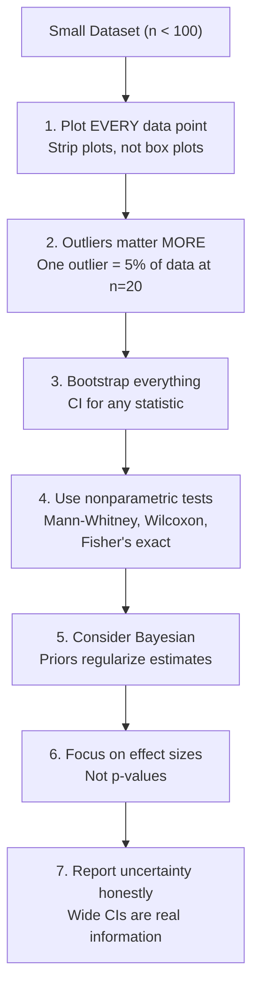

# EDA for Small Datasets

Fewer than 100 observations. Maybe 30. Maybe 15. You are working with rare diseases, expensive experiments, startup metrics, or A/B tests that ended early. Every tool you learned in statistics class was designed for large samples. Here, those tools break.

Standard errors are too small. Confidence intervals are too narrow. P-values lie. Normality tests have no power. Correlations are wildly unstable. The Central Limit Theorem does not apply.

This page covers what actually works with small data: bootstrapping, exact nonparametric tests, Bayesian methods, and practical strategies to extract maximum signal from minimal data.

## The Dataset

We will work with a genuinely small clinical trial dataset.

```python
import numpy as np
import pandas as pd
import matplotlib.pyplot as plt
import seaborn as sns
from scipy import stats

np.random.seed(42)

# Small clinical trial: 20 patients per group
n_per_group = 20

# Treatment group: genuine positive effect (mean improvement = 5)
treatment = np.random.normal(loc=8, scale=4, size=n_per_group)
control = np.random.normal(loc=5, scale=4, size=n_per_group)

# One outlier in treatment (extreme responder)
treatment[0] = 25

df = pd.DataFrame({
    "group": ["Treatment"] * n_per_group + ["Control"] * n_per_group,
    "improvement": np.concatenate([treatment, control]),
})

print(f"Total observations: {len(df)}")
print(f"Per group: {n_per_group}")
print(df.groupby("group")["improvement"].describe().round(2))
```

## The Small-Sample Problem: Why Everything Is Unreliable

```python
# Demonstration: correlation is wildly unstable at small n
np.random.seed(42)

true_r = 0.3  # moderate positive correlation
sample_sizes = [10, 20, 50, 100, 500, 1000]
n_simulations = 1000

fig, axes = plt.subplots(2, 3, figsize=(18, 10))

for ax, n in zip(axes.flat, sample_sizes):
    estimated_rs = []
    for _ in range(n_simulations):
        x = np.random.normal(0, 1, n)
        y = true_r * x + np.sqrt(1 - true_r**2) * np.random.normal(0, 1, n)
        estimated_rs.append(np.corrcoef(x, y)[0, 1])

    ax.hist(estimated_rs, bins=40, density=True, color="steelblue", edgecolor="black", alpha=0.7)
    ax.axvline(true_r, color="crimson", linewidth=2, linestyle="--", label=f"True r={true_r}")
    ax.axvline(np.mean(estimated_rs), color="orange", linewidth=2, label=f"Mean={np.mean(estimated_rs):.3f}")
    ax.set_title(f"n = {n}\nStd of estimates: {np.std(estimated_rs):.3f}", fontsize=12)
    ax.set_xlim(-1, 1)
    ax.legend(fontsize=8)

plt.suptitle(f"Correlation Estimates at Different Sample Sizes (True r = {true_r})",
             fontsize=16, fontweight="bold")
plt.tight_layout()
plt.savefig("small_sample_instability.png", dpi=150, bbox_inches="tight")
plt.show()

print("Standard deviation of r estimates:")
for n in sample_sizes:
    se = 1 / np.sqrt(n - 3)  # approximate standard error of r
    print(f"  n={n:>5d}: SE ≈ {se:.3f} → 95% CI width ≈ ±{1.96*se:.3f}")
```

## Bootstrapping: The Universal Small-Sample Tool

Bootstrapping resamples your data with replacement to estimate the sampling distribution of any statistic. It requires no distributional assumptions.

```python
def bootstrap_statistic(data, statistic_func, n_bootstrap=10000, ci_level=0.95):
    """Bootstrap a statistic with confidence interval."""
    n = len(data)
    bootstrap_stats = np.zeros(n_bootstrap)

    for i in range(n_bootstrap):
        resample = np.random.choice(data, size=n, replace=True)
        bootstrap_stats[i] = statistic_func(resample)

    # Confidence interval (percentile method)
    alpha = (1 - ci_level) / 2
    ci_low = np.percentile(bootstrap_stats, alpha * 100)
    ci_high = np.percentile(bootstrap_stats, (1 - alpha) * 100)

    # Bias-corrected estimate
    observed = statistic_func(data)
    bias = np.mean(bootstrap_stats) - observed

    return {
        "observed": observed,
        "bootstrap_mean": np.mean(bootstrap_stats),
        "bootstrap_se": np.std(bootstrap_stats),
        "ci_low": ci_low,
        "ci_high": ci_high,
        "bias": bias,
        "distribution": bootstrap_stats,
    }

# Bootstrap the mean improvement for each group
for group in ["Treatment", "Control"]:
    data = df[df["group"] == group]["improvement"].values
    result = bootstrap_statistic(data, np.mean, n_bootstrap=10000)
    print(f"\n{group} group mean:")
    print(f"  Observed:       {result['observed']:.3f}")
    print(f"  Bootstrap mean: {result['bootstrap_mean']:.3f}")
    print(f"  Bootstrap SE:   {result['bootstrap_se']:.3f}")
    print(f"  95% CI:         [{result['ci_low']:.3f}, {result['ci_high']:.3f}]")
    print(f"  Bias:           {result['bias']:.4f}")
```

### Bootstrap for Any Statistic

```python
# Bootstrap works for ANY statistic — not just the mean
treatment_data = df[df["group"] == "Treatment"]["improvement"].values

statistics = {
    "Mean": np.mean,
    "Median": np.median,
    "Std Dev": np.std,
    "IQR": lambda x: np.percentile(x, 75) - np.percentile(x, 25),
    "Skewness": lambda x: pd.Series(x).skew(),
    "90th Percentile": lambda x: np.percentile(x, 90),
    "Trimmed Mean (10%)": lambda x: stats.trim_mean(x, 0.1),
}

fig, axes = plt.subplots(2, 4, figsize=(20, 8))
axes = axes.flatten()

for i, (name, func) in enumerate(statistics.items()):
    if i >= len(axes):
        break
    result = bootstrap_statistic(treatment_data, func)
    ax = axes[i]
    ax.hist(result["distribution"], bins=50, density=True, color="steelblue",
            edgecolor="black", alpha=0.7)
    ax.axvline(result["observed"], color="crimson", linewidth=2, linestyle="--")
    ax.axvline(result["ci_low"], color="orange", linewidth=1.5, linestyle=":")
    ax.axvline(result["ci_high"], color="orange", linewidth=1.5, linestyle=":")
    ax.set_title(f"{name}\n{result['observed']:.2f} [{result['ci_low']:.2f}, {result['ci_high']:.2f}]",
                 fontsize=10)

axes[-1].set_visible(False)
plt.suptitle("Bootstrap Distributions for Various Statistics (n=20)", fontsize=16, fontweight="bold")
plt.tight_layout()
plt.savefig("bootstrap_statistics.png", dpi=150, bbox_inches="tight")
plt.show()
```

### Bootstrap Hypothesis Testing

```python
def bootstrap_two_sample_test(group_a, group_b, n_bootstrap=10000, statistic="mean"):
    """Permutation-based two-sample test using bootstrap."""
    if statistic == "mean":
        func = np.mean
    elif statistic == "median":
        func = np.median

    observed_diff = func(group_a) - func(group_b)

    # Under null hypothesis: combine and reshuffle
    combined = np.concatenate([group_a, group_b])
    n_a = len(group_a)
    null_diffs = np.zeros(n_bootstrap)

    for i in range(n_bootstrap):
        perm = np.random.permutation(combined)
        null_diffs[i] = func(perm[:n_a]) - func(perm[n_a:])

    # Two-sided p-value
    p_value = np.mean(np.abs(null_diffs) >= np.abs(observed_diff))

    # Effect size bootstrap CI
    boot_diffs = np.zeros(n_bootstrap)
    for i in range(n_bootstrap):
        boot_a = np.random.choice(group_a, size=len(group_a), replace=True)
        boot_b = np.random.choice(group_b, size=len(group_b), replace=True)
        boot_diffs[i] = func(boot_a) - func(boot_b)

    ci_low = np.percentile(boot_diffs, 2.5)
    ci_high = np.percentile(boot_diffs, 97.5)

    print(f"\nBootstrap Two-Sample Test ({statistic}):")
    print(f"  Observed difference: {observed_diff:.3f}")
    print(f"  95% CI:             [{ci_low:.3f}, {ci_high:.3f}]")
    print(f"  Permutation p-value: {p_value:.4f}")

    return observed_diff, p_value, ci_low, ci_high

treatment_data = df[df["group"] == "Treatment"]["improvement"].values
control_data = df[df["group"] == "Control"]["improvement"].values

bootstrap_two_sample_test(treatment_data, control_data, statistic="mean")
bootstrap_two_sample_test(treatment_data, control_data, statistic="median")
```

## Distribution-Free (Nonparametric) Tests

With small samples, you cannot verify normality. Use tests that make no distributional assumptions.

```python
def nonparametric_comparison(group_a, group_b, name_a="A", name_b="B"):
    """Complete nonparametric two-sample comparison."""
    print(f"\n{'='*60}")
    print(f"  Nonparametric Tests: {name_a} vs {name_b}")
    print(f"  n_a = {len(group_a)}, n_b = {len(group_b)}")
    print(f"{'='*60}")

    # 1. Mann-Whitney U (rank-based, no normality needed)
    u_stat, p_mw = stats.mannwhitneyu(group_a, group_b, alternative="two-sided")
    # Rank-biserial effect size
    n_a, n_b = len(group_a), len(group_b)
    r_rb = 1 - (2 * u_stat) / (n_a * n_b)

    print(f"\n  Mann-Whitney U:")
    print(f"    U = {u_stat:.1f}, p = {p_mw:.4f}")
    print(f"    Rank-biserial r = {r_rb:+.3f}")

    # 2. Wilcoxon signed-rank (if paired)
    if len(group_a) == len(group_b):
        try:
            w_stat, p_wilcox = stats.wilcoxon(group_a, group_b)
            print(f"\n  Wilcoxon Signed-Rank (if paired):")
            print(f"    W = {w_stat:.1f}, p = {p_wilcox:.4f}")
        except ValueError:
            pass

    # 3. Kolmogorov-Smirnov (tests full distribution difference)
    ks_stat, p_ks = stats.ks_2samp(group_a, group_b)
    print(f"\n  Kolmogorov-Smirnov:")
    print(f"    D = {ks_stat:.4f}, p = {p_ks:.4f}")

    # 4. Brunner-Munzel (does not assume equal shape)
    bm_stat, p_bm = stats.brunnermunzel(group_a, group_b)
    print(f"\n  Brunner-Munzel:")
    print(f"    W = {bm_stat:.3f}, p = {p_bm:.4f}")

    # 5. Exact Fisher test for proportions (if applicable)
    # Convert to binary for demonstration
    median_all = np.median(np.concatenate([group_a, group_b]))
    table = np.array([
        [(group_a > median_all).sum(), (group_a <= median_all).sum()],
        [(group_b > median_all).sum(), (group_b <= median_all).sum()],
    ])
    or_fisher, p_fisher = stats.fisher_exact(table)
    print(f"\n  Fisher's Exact Test (above/below median):")
    print(f"    OR = {or_fisher:.3f}, p = {p_fisher:.4f}")

    # Comparison with parametric test
    t_stat, p_t = stats.ttest_ind(group_a, group_b, equal_var=False)
    print(f"\n  For comparison — Welch's t-test:")
    print(f"    t = {t_stat:.3f}, p = {p_t:.4f}")
    print(f"    (May be unreliable with n={len(group_a)})")

nonparametric_comparison(treatment_data, control_data, "Treatment", "Control")
```

## Bayesian Approach

Bayesian methods provide full posterior distributions, not just point estimates. They are naturally well-calibrated for small samples because the prior regularizes the estimate.

```python
def bayesian_comparison(group_a, group_b, name_a="Treatment", name_b="Control",
                         prior_mean=0, prior_std=10, n_samples=10000):
    """Simple Bayesian comparison using conjugate normal-normal model."""
    # Posterior for each group mean (assuming known variance for simplicity)
    for name, data in [(name_a, group_a), (name_b, group_b)]:
        n = len(data)
        data_mean = np.mean(data)
        data_var = np.var(data)

        # Posterior with normal prior
        prior_precision = 1 / prior_std**2
        data_precision = n / data_var
        posterior_precision = prior_precision + data_precision
        posterior_mean = (prior_precision * prior_mean + data_precision * data_mean) / posterior_precision
        posterior_std = np.sqrt(1 / posterior_precision)

        # Draw posterior samples
        posterior_samples = np.random.normal(posterior_mean, posterior_std, n_samples)

        print(f"\n{name} group posterior:")
        print(f"  Prior:     N({prior_mean}, {prior_std}²)")
        print(f"  Data:      mean={data_mean:.2f}, n={n}")
        print(f"  Posterior: N({posterior_mean:.3f}, {posterior_std:.3f}²)")
        print(f"  95% HDI:   [{np.percentile(posterior_samples, 2.5):.3f}, "
              f"{np.percentile(posterior_samples, 97.5):.3f}]")

    # Posterior of the difference
    post_a = np.random.normal(
        (1/prior_std**2 * prior_mean + len(group_a)/np.var(group_a) * np.mean(group_a)) /
        (1/prior_std**2 + len(group_a)/np.var(group_a)),
        np.sqrt(1 / (1/prior_std**2 + len(group_a)/np.var(group_a))),
        n_samples,
    )
    post_b = np.random.normal(
        (1/prior_std**2 * prior_mean + len(group_b)/np.var(group_b) * np.mean(group_b)) /
        (1/prior_std**2 + len(group_b)/np.var(group_b)),
        np.sqrt(1 / (1/prior_std**2 + len(group_b)/np.var(group_b))),
        n_samples,
    )

    diff_samples = post_a - post_b

    print(f"\nDifference ({name_a} - {name_b}) posterior:")
    print(f"  Mean:  {np.mean(diff_samples):.3f}")
    print(f"  95% HDI: [{np.percentile(diff_samples, 2.5):.3f}, "
          f"{np.percentile(diff_samples, 97.5):.3f}]")
    print(f"  P(Treatment > Control): {(diff_samples > 0).mean():.4f}")

    # Visualization
    fig, axes = plt.subplots(1, 3, figsize=(18, 5))

    axes[0].hist(post_a, bins=50, density=True, alpha=0.5, color="crimson", label=name_a)
    axes[0].hist(post_b, bins=50, density=True, alpha=0.5, color="steelblue", label=name_b)
    axes[0].set_title("Posterior Distributions of Group Means", fontsize=12)
    axes[0].legend()

    axes[1].hist(diff_samples, bins=50, density=True, color="green", alpha=0.7)
    axes[1].axvline(0, color="black", linewidth=2, linestyle="--")
    axes[1].fill_between(
        np.linspace(0, np.max(diff_samples), 100),
        0, 0.3,  # approximate density height
        alpha=0.1, color="green",
    )
    axes[1].set_title(f"Posterior Difference\nP(Diff > 0) = {(diff_samples > 0).mean():.3f}", fontsize=12)

    # ROPE (Region of Practical Equivalence)
    rope = (-1, 1)
    in_rope = ((diff_samples > rope[0]) & (diff_samples < rope[1])).mean()
    axes[2].hist(diff_samples, bins=50, density=True, color="green", alpha=0.7)
    axes[2].axvspan(rope[0], rope[1], alpha=0.2, color="yellow", label=f"ROPE {rope}")
    axes[2].set_title(f"ROPE Analysis\nP(in ROPE) = {in_rope:.3f}", fontsize=12)
    axes[2].legend()

    plt.suptitle("Bayesian Comparison", fontsize=16, fontweight="bold")
    plt.tight_layout()
    plt.savefig("bayesian_comparison.png", dpi=150, bbox_inches="tight")
    plt.show()

bayesian_comparison(treatment_data, control_data)
```

## Data Augmentation Strategies

When you truly cannot collect more data, these techniques can help.

```python
# 1. Noise injection (for regression/prediction)
def augment_with_noise(data, n_augmented, noise_level=0.1):
    """Generate augmented samples by adding noise to existing ones."""
    augmented = []
    for _ in range(n_augmented):
        idx = np.random.randint(0, len(data))
        noise = np.random.normal(0, noise_level * np.std(data))
        augmented.append(data[idx] + noise)
    return np.array(augmented)

augmented = augment_with_noise(treatment_data, 100, noise_level=0.15)
print(f"Original: n={len(treatment_data)}, mean={treatment_data.mean():.2f}, std={treatment_data.std():.2f}")
print(f"Augmented: n={len(augmented)}, mean={augmented.mean():.2f}, std={augmented.std():.2f}")

# 2. SMOTE for classification (see imbalanced-data page)

# 3. Mixup augmentation
def mixup_augment(data_a, data_b, alpha=0.2, n_augmented=50):
    """Mixup: create convex combinations of pairs."""
    augmented = []
    for _ in range(n_augmented):
        i = np.random.randint(len(data_a))
        j = np.random.randint(len(data_b))
        lam = np.random.beta(alpha, alpha)
        augmented.append(lam * data_a[i] + (1 - lam) * data_b[j])
    return np.array(augmented)
```

## Small-Sample EDA Checklist



## Rules of Thumb for Small Samples

| Sample Size | What Works | What Fails |
|-------------|-----------|------------|
| n < 10 | Fisher's exact, bootstrap, Bayesian, plots of all points | All parametric tests, correlation, regression |
| n = 10-30 | Nonparametric tests, bootstrap CI, simple regression | Multi-variable regression, ANOVA with many groups, normality tests |
| n = 30-50 | t-test (with caution), one-way ANOVA, correlation with bootstrap CI | Multiple regression with > 5 predictors |
| n = 50-100 | Most standard methods with bootstrap validation | Complex models, cross-validation with many folds |

## Key Takeaways

- At small n, every observation matters. A single outlier changes the mean by 5-10%. Always plot every point.
- Bootstrap is the universal tool for small samples. It provides CIs for any statistic without distributional assumptions.
- Nonparametric tests (Mann-Whitney, Fisher's exact) are more reliable than parametric tests at small n.
- Bayesian methods naturally handle small samples because the prior provides regularization. They give the probability that one treatment is better, not just "reject/fail to reject."
- P-values are unreliable at small n. A non-significant result does NOT mean no effect — it means you could not detect it. Focus on effect sizes and confidence intervals.
- Data augmentation (noise injection, mixup) can help for prediction tasks but does not create new information about population parameters.
- Report your uncertainty honestly. A wide confidence interval is honest. A narrow interval from a small sample is a lie.
