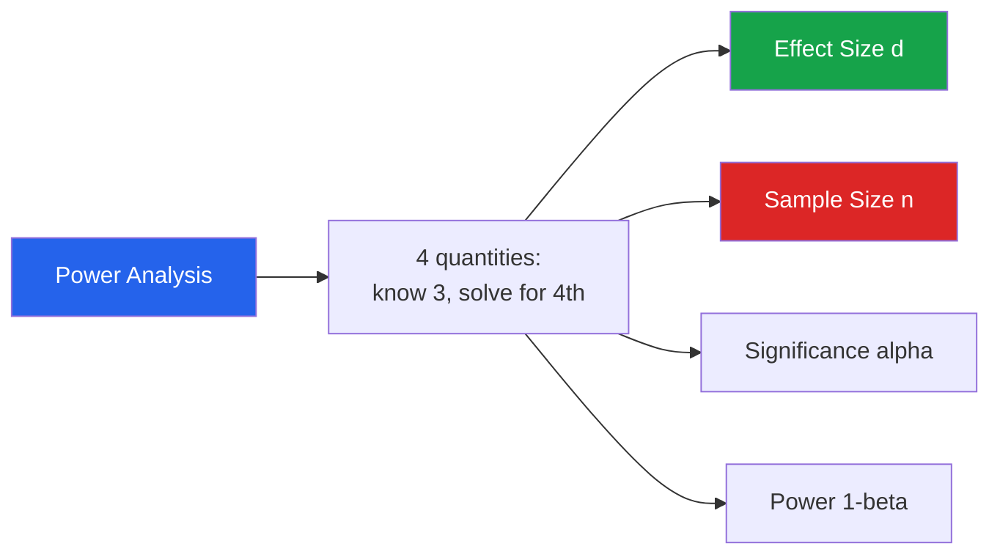
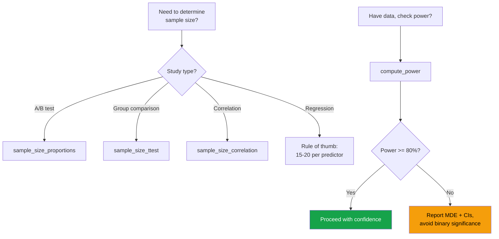

# Statistical Power & Sample Size

Statistical power determines whether your analysis can detect real effects. An underpowered EDA might miss important patterns; an overpowered one might flag trivially small effects as "significant." Understanding power is essential for trustworthy conclusions.

---

## Power Analysis Fundamentals



| Quantity | Typical Value | Description |
|----------|--------------|-------------|
| Effect size (d) | Determined by domain | How big is the difference/relationship? |
| Sample size (n) | Solve for this | How many observations do you need? |
| Significance (alpha) | 0.05 | Probability of false positive |
| Power (1-beta) | 0.80 | Probability of detecting a real effect |

---

## Effect Size Measures

```python
import numpy as np
import pandas as pd
import matplotlib.pyplot as plt
from scipy import stats

np.random.seed(42)

def cohens_d(group_a, group_b):
    """Compute Cohen's d effect size for two groups."""
    na, nb = len(group_a), len(group_b)
    pooled_std = np.sqrt(((na - 1) * group_a.std()**2 + (nb - 1) * group_b.std()**2) / (na + nb - 2))
    return (group_a.mean() - group_b.mean()) / pooled_std

def cohens_h(p1, p2):
    """Effect size for comparing two proportions."""
    return 2 * (np.arcsin(np.sqrt(p1)) - np.arcsin(np.sqrt(p2)))

def eta_squared(groups):
    """Effect size for ANOVA (proportion of variance explained)."""
    all_data = np.concatenate(groups)
    grand_mean = all_data.mean()
    ss_between = sum(len(g) * (g.mean() - grand_mean)**2 for g in groups)
    ss_total = np.sum((all_data - grand_mean)**2)
    return ss_between / ss_total

# Demonstrate effect sizes
np.random.seed(42)
small = np.random.normal(50, 10, 200)
medium = np.random.normal(55, 10, 200)
large = np.random.normal(60, 10, 200)

print("Cohen's d Interpretation:")
print(f"  Small  (d=0.2):  {cohens_d(small, np.random.normal(52, 10, 200)):.3f}")
print(f"  Medium (d=0.5):  {cohens_d(small, medium):.3f}")
print(f"  Large  (d=0.8):  {cohens_d(small, large):.3f}")

# Visualize effect sizes
fig, axes = plt.subplots(1, 3, figsize=(18, 5))
for i, (label, effect, other) in enumerate([
    ('Small (d=0.2)', np.random.normal(50, 10, 1000), np.random.normal(52, 10, 1000)),
    ('Medium (d=0.5)', np.random.normal(50, 10, 1000), np.random.normal(55, 10, 1000)),
    ('Large (d=0.8)', np.random.normal(50, 10, 1000), np.random.normal(58, 10, 1000)),
]):
    axes[i].hist(effect, bins=40, alpha=0.5, label='Group A', color='steelblue', density=True)
    axes[i].hist(other, bins=40, alpha=0.5, label='Group B', color='coral', density=True)
    d = cohens_d(np.array(effect), np.array(other))
    axes[i].set_title(f'{label}\nActual d = {abs(d):.2f}')
    axes[i].legend()

plt.tight_layout()
plt.show()
```

### Effect Size Reference Table

| Effect Size | Measure | Small | Medium | Large |
|-------------|---------|-------|--------|-------|
| Mean difference | Cohen's d | 0.2 | 0.5 | 0.8 |
| Correlation | r | 0.1 | 0.3 | 0.5 |
| ANOVA | Eta-squared | 0.01 | 0.06 | 0.14 |
| Proportions | Cohen's h | 0.2 | 0.5 | 0.8 |
| Chi-squared | Cramer's V | 0.1 | 0.3 | 0.5 |
| Regression | f-squared | 0.02 | 0.15 | 0.35 |

---

## Sample Size Calculations

### Two-Sample t-test

```python
def sample_size_ttest(effect_size, alpha=0.05, power=0.80, ratio=1.0):
    """Required sample size per group for two-sample t-test.
    ratio: n2/n1 ratio (1.0 = equal groups)
    """
    from scipy.stats import norm

    z_alpha = norm.ppf(1 - alpha / 2)
    z_beta = norm.ppf(power)

    n1 = ((z_alpha + z_beta)**2 * (1 + 1/ratio)) / effect_size**2
    n2 = ratio * n1

    return int(np.ceil(n1)), int(np.ceil(n2))

# Sample size table
print("Sample Size per Group (two-sample t-test, alpha=0.05)")
print(f"{'Effect Size':<15} {'Power=0.80':>12} {'Power=0.90':>12} {'Power=0.95':>12}")
print("-" * 53)
for d in [0.1, 0.2, 0.3, 0.5, 0.8, 1.0, 1.5]:
    n80 = sample_size_ttest(d, power=0.80)[0]
    n90 = sample_size_ttest(d, power=0.90)[0]
    n95 = sample_size_ttest(d, power=0.95)[0]
    print(f"d = {d:<11} {n80:>12,} {n90:>12,} {n95:>12,}")
```

### Comparing Proportions (A/B Test)

```python
def sample_size_proportions(p1, p2, alpha=0.05, power=0.80):
    """Sample size per group for comparing two proportions."""
    from scipy.stats import norm

    z_alpha = norm.ppf(1 - alpha / 2)
    z_beta = norm.ppf(power)

    p_bar = (p1 + p2) / 2
    n = ((z_alpha * np.sqrt(2 * p_bar * (1 - p_bar)) +
          z_beta * np.sqrt(p1 * (1-p1) + p2 * (1-p2)))**2) / (p1 - p2)**2

    return int(np.ceil(n))

# A/B test scenarios
print("\nA/B Test Sample Sizes (alpha=0.05, power=0.80):")
print(f"{'Baseline':>10} {'Target':>10} {'Lift':>10} {'n/group':>12} {'Total':>12}")
print("-" * 58)
for p1, p2 in [(0.05, 0.06), (0.05, 0.07), (0.10, 0.12),
                (0.10, 0.13), (0.20, 0.24), (0.20, 0.25)]:
    n = sample_size_proportions(p1, p2)
    lift = (p2 - p1) / p1 * 100
    print(f"{p1:>10.1%} {p2:>10.1%} {lift:>9.0f}% {n:>12,} {2*n:>12,}")
```

### Correlation

```python
def sample_size_correlation(r, alpha=0.05, power=0.80):
    """Sample size needed to detect a given correlation."""
    from scipy.stats import norm

    z_alpha = norm.ppf(1 - alpha / 2)
    z_beta = norm.ppf(power)

    # Fisher z transform
    z_r = 0.5 * np.log((1 + r) / (1 - r))
    n = ((z_alpha + z_beta) / z_r)**2 + 3

    return int(np.ceil(n))

print("\nSample Size to Detect Correlation (alpha=0.05, power=0.80):")
for r in [0.05, 0.10, 0.15, 0.20, 0.30, 0.50]:
    n = sample_size_correlation(r)
    print(f"  r = {r}: n = {n:,}")
```

---

## Power Curves

```python
def compute_power(effect_size, n, alpha=0.05):
    """Compute power for a two-sample t-test."""
    from scipy.stats import norm
    z_alpha = norm.ppf(1 - alpha / 2)
    z_power = effect_size * np.sqrt(n / 2) - z_alpha
    return norm.cdf(z_power)

# Power curves for different sample sizes
fig, axes = plt.subplots(1, 2, figsize=(14, 5))

# Power vs effect size
effect_sizes = np.linspace(0.05, 1.5, 100)
for n in [30, 50, 100, 200, 500, 1000]:
    powers = [compute_power(d, n) for d in effect_sizes]
    axes[0].plot(effect_sizes, powers, label=f'n={n}', linewidth=2)
axes[0].axhline(y=0.80, color='red', linestyle='--', alpha=0.5, label='80% power')
axes[0].set_xlabel("Effect Size (Cohen's d)")
axes[0].set_ylabel('Power')
axes[0].set_title('Power vs Effect Size')
axes[0].legend(fontsize=8)
axes[0].grid(True, alpha=0.3)

# Power vs sample size
sample_sizes = np.arange(10, 500, 5)
for d in [0.2, 0.3, 0.5, 0.8]:
    powers = [compute_power(d, n) for n in sample_sizes]
    axes[1].plot(sample_sizes, powers, label=f'd={d}', linewidth=2)
axes[1].axhline(y=0.80, color='red', linestyle='--', alpha=0.5, label='80% power')
axes[1].set_xlabel('Sample Size per Group')
axes[1].set_ylabel('Power')
axes[1].set_title('Power vs Sample Size')
axes[1].legend()
axes[1].grid(True, alpha=0.3)

plt.tight_layout()
plt.show()
```

---

## Minimum Detectable Effect (MDE)

```python
def minimum_detectable_effect(n, alpha=0.05, power=0.80):
    """Given a sample size, what is the smallest effect you can detect?"""
    from scipy.stats import norm

    z_alpha = norm.ppf(1 - alpha / 2)
    z_beta = norm.ppf(power)

    mde = (z_alpha + z_beta) * np.sqrt(2 / n)
    return mde

# What can your current data detect?
print("Minimum Detectable Effect Size (alpha=0.05, power=0.80):")
print(f"{'n per group':>15} {'MDE (d)':>10} {'Interpretation':>20}")
print("-" * 50)
for n in [20, 50, 100, 200, 500, 1000, 5000, 10000]:
    mde = minimum_detectable_effect(n)
    interp = 'very large' if mde > 0.8 else 'large' if mde > 0.5 else 'medium' if mde > 0.2 else 'small'
    print(f"{n:>15,} {mde:>10.3f} {interp:>20}")
```

---

## When Your Data is Too Small

```python
def too_small_data_strategies(n, effect_size_needed):
    """Recommendations when sample size is insufficient."""
    actual_power = compute_power(effect_size_needed, n)
    n_needed = sample_size_ttest(effect_size_needed)[0]

    print(f"INSUFFICIENT SAMPLE SIZE ANALYSIS")
    print(f"{'='*50}")
    print(f"Current n per group: {n}")
    print(f"Target effect size: d={effect_size_needed}")
    print(f"Current power: {actual_power:.1%}")
    print(f"Needed n per group: {n_needed:,}")
    print(f"Shortfall: {max(0, n_needed - n):,} additional per group")

    strategies = []

    if actual_power < 0.50:
        strategies.append("CRITICAL: Power < 50%. Results are essentially a coin flip.")
    elif actual_power < 0.80:
        strategies.append(f"UNDERPOWERED: Power = {actual_power:.0%}. High risk of false negatives.")

    strategies.extend([
        "",
        "STRATEGIES:",
        "1. Collect more data (if possible)",
        f"   Need {n_needed - n:,} more per group for 80% power",
        "",
        "2. Accept larger effect sizes only",
        f"   Current MDE: d={minimum_detectable_effect(n):.3f}",
        "",
        "3. Reduce alpha (accept more false positives)",
        f"   At alpha=0.10: power={compute_power(effect_size_needed, n, 0.10):.1%}",
        "",
        "4. Use one-sided test (if justified)",
        f"   One-sided power: {compute_power(effect_size_needed, n, 0.10):.1%}",
        "",
        "5. Use Bayesian methods (credible intervals instead of p-values)",
        "",
        "6. Pool data across time periods or related subgroups",
        "",
        "7. Report confidence intervals instead of binary significance",
        "   Wide CIs honestly communicate uncertainty",
    ])

    for s in strategies:
        print(f"  {s}")

too_small_data_strategies(n=50, effect_size_needed=0.3)
```

---

## Statistical vs Practical Significance

```python
def significance_analysis(group_a, group_b, practical_threshold=None):
    """Distinguish statistical from practical significance."""
    n_a, n_b = len(group_a), len(group_b)

    # Statistical significance
    stat, p = stats.mannwhitneyu(group_a, group_b)
    d = cohens_d(group_a, group_b)

    # Confidence interval for the difference
    diff = group_a.mean() - group_b.mean()
    se = np.sqrt(group_a.var()/n_a + group_b.var()/n_b)
    ci_lower = diff - 1.96 * se
    ci_upper = diff + 1.96 * se

    print("SIGNIFICANCE ANALYSIS")
    print("=" * 50)
    print(f"Group A: n={n_a}, mean={group_a.mean():.3f}")
    print(f"Group B: n={n_b}, mean={group_b.mean():.3f}")
    print(f"Difference: {diff:.3f} (95% CI: [{ci_lower:.3f}, {ci_upper:.3f}])")
    print(f"Cohen's d: {d:.3f}")
    print(f"p-value: {p:.6f}")

    # Classification
    stat_sig = p < 0.05
    if practical_threshold:
        prac_sig = abs(diff) > practical_threshold
        print(f"\nPractical threshold: {practical_threshold}")
        print(f"Statistical significance: {'Yes' if stat_sig else 'No'}")
        print(f"Practical significance:   {'Yes' if prac_sig else 'No'}")

        if stat_sig and prac_sig:
            print("VERDICT: Real and meaningful difference")
        elif stat_sig and not prac_sig:
            print("VERDICT: Statistically significant but too small to matter")
            print("  (common with large samples)")
        elif not stat_sig and prac_sig:
            print("VERDICT: Possibly meaningful but not yet confirmed")
            print("  (may need more data)")
        else:
            print("VERDICT: No evidence of meaningful difference")

# Large sample: statistically significant but trivially small
big_a = np.random.normal(100.0, 10, 50000)
big_b = np.random.normal(100.3, 10, 50000)
significance_analysis(big_a, big_b, practical_threshold=2.0)

print("\n")

# Small sample: practically significant but not statistically
small_a = np.random.normal(100, 10, 20)
small_b = np.random.normal(108, 10, 20)
significance_analysis(small_a, small_b, practical_threshold=2.0)
```

---

## Power Analysis Decision Guide



---

## Key Takeaways

- **Always compute power** before interpreting "not significant" as "no effect" — the study may be underpowered
- With **large samples**, everything is significant — focus on **effect size** and **practical significance**
- With **small samples**, nothing is significant — report **confidence intervals** and **effect sizes** instead
- The **minimum detectable effect** (MDE) tells you the smallest effect your data can reliably find
- For A/B tests, small lifts (e.g., 1pp on a 5% baseline) require **tens of thousands of observations per group**
- **Statistical significance** (p < 0.05) does not mean **practical significance** (the effect matters in the real world)
- When data is too small: use Bayesian methods, report CIs, pool data, or accept that you can only detect large effects
- Power analysis should be done **before** collecting data, not after finding non-significant results
