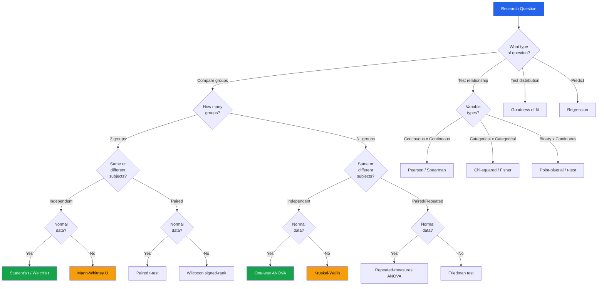
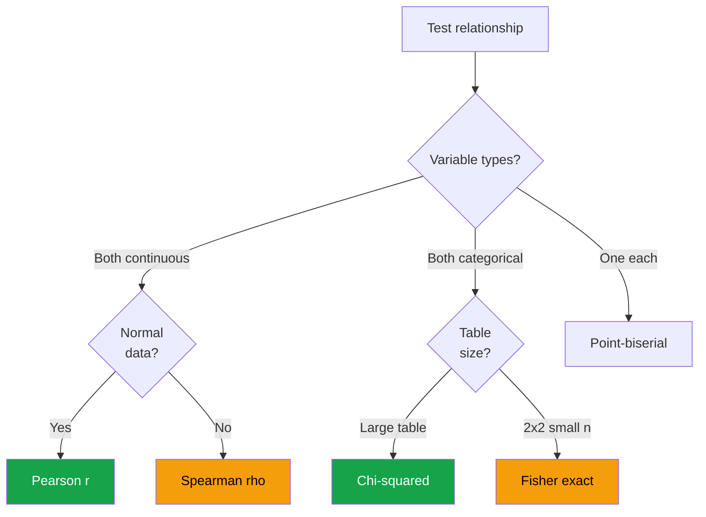

# Statistical Test Selector

Choosing the wrong statistical test invalidates your conclusions. This page provides complete decision flowcharts based on your data type, sample size, distributional assumptions, and research question. Every test includes a Python code snippet.

---

## Master Decision Flowchart



---

## Comparing Two Independent Groups

### Decision: Normal or Not Normal?

```python
from scipy import stats
import numpy as np

def choose_two_group_test(group_a, group_b, alpha=0.05, paired=False):
    """Automatically choose and run the correct two-group test."""
    results = {}

    if paired:
        # Check normality of differences
        diffs = group_a - group_b
        _, p_norm = stats.shapiro(diffs[:5000])
        results['normality_p'] = p_norm

        if p_norm > alpha:
            # Parametric: paired t-test
            stat, p = stats.ttest_rel(group_a, group_b)
            results['test'] = 'Paired t-test'
            results['statistic'] = stat
            results['p_value'] = p
        else:
            # Non-parametric: Wilcoxon signed-rank
            stat, p = stats.wilcoxon(group_a, group_b)
            results['test'] = 'Wilcoxon signed-rank'
            results['statistic'] = stat
            results['p_value'] = p
    else:
        # Check normality of each group
        _, p_norm_a = stats.shapiro(group_a[:5000])
        _, p_norm_b = stats.shapiro(group_b[:5000])
        both_normal = p_norm_a > alpha and p_norm_b > alpha
        results['normality_a'] = p_norm_a
        results['normality_b'] = p_norm_b

        if both_normal:
            # Check equal variance
            _, p_levene = stats.levene(group_a, group_b)
            results['levene_p'] = p_levene

            if p_levene > alpha:
                stat, p = stats.ttest_ind(group_a, group_b)
                results['test'] = "Student's t-test (equal var)"
            else:
                stat, p = stats.ttest_ind(group_a, group_b, equal_var=False)
                results['test'] = "Welch's t-test (unequal var)"
            results['statistic'] = stat
            results['p_value'] = p
        else:
            stat, p = stats.mannwhitneyu(group_a, group_b, alternative='two-sided')
            results['test'] = 'Mann-Whitney U'
            results['statistic'] = stat
            results['p_value'] = p

    # Effect size (Cohen's d)
    pooled_std = np.sqrt((group_a.std()**2 + group_b.std()**2) / 2)
    results['cohens_d'] = (group_a.mean() - group_b.mean()) / pooled_std

    return results

# Example
a = np.random.normal(50, 10, 200)
b = np.random.normal(53, 12, 200)
result = choose_two_group_test(a, b)
print("Two-group comparison:")
for k, v in result.items():
    print(f"  {k}: {v:.4f}" if isinstance(v, float) else f"  {k}: {v}")
```

### All Two-Group Tests

| Test | Parametric | Requirements | Python |
|------|-----------|-------------|--------|
| Student's t-test | Yes | Normal, equal variance | `stats.ttest_ind(a, b)` |
| Welch's t-test | Yes | Normal, unequal variance OK | `stats.ttest_ind(a, b, equal_var=False)` |
| Mann-Whitney U | No | Any distribution | `stats.mannwhitneyu(a, b)` |
| Paired t-test | Yes | Normal differences | `stats.ttest_rel(a, b)` |
| Wilcoxon signed-rank | No | Paired data | `stats.wilcoxon(a, b)` |
| Kolmogorov-Smirnov 2-sample | No | Compare full distributions | `stats.ks_2samp(a, b)` |
| Permutation test | No | Any, exact p-values | `stats.permutation_test(...)` |

---

## Comparing Three or More Groups

```python
def choose_multi_group_test(groups, group_names=None, alpha=0.05):
    """Choose and run the correct multi-group test."""
    if group_names is None:
        group_names = [f'Group_{i}' for i in range(len(groups))]

    results = {}

    # Check normality for all groups
    normality = [stats.shapiro(g[:5000])[1] for g in groups]
    all_normal = all(p > alpha for p in normality)
    results['all_normal'] = all_normal

    if all_normal:
        # Check equal variance
        _, p_levene = stats.levene(*groups)
        results['levene_p'] = p_levene

        # One-way ANOVA
        stat, p = stats.f_oneway(*groups)
        results['test'] = 'One-way ANOVA'
        results['statistic'] = stat
        results['p_value'] = p
    else:
        # Kruskal-Wallis
        stat, p = stats.kruskal(*groups)
        results['test'] = 'Kruskal-Wallis H'
        results['statistic'] = stat
        results['p_value'] = p

    # Effect size: eta-squared
    all_data = np.concatenate(groups)
    grand_mean = all_data.mean()
    ss_between = sum(len(g) * (g.mean() - grand_mean)**2 for g in groups)
    ss_total = np.sum((all_data - grand_mean)**2)
    results['eta_squared'] = ss_between / ss_total

    # Post-hoc if significant
    if p < alpha:
        results['post_hoc'] = {}
        n_comparisons = len(groups) * (len(groups) - 1) // 2
        bonferroni_alpha = alpha / n_comparisons

        for i in range(len(groups)):
            for j in range(i + 1, len(groups)):
                if all_normal:
                    _, pval = stats.ttest_ind(groups[i], groups[j])
                else:
                    _, pval = stats.mannwhitneyu(groups[i], groups[j])
                sig = pval < bonferroni_alpha
                results['post_hoc'][f'{group_names[i]} vs {group_names[j]}'] = {
                    'p': pval, 'significant': sig
                }

    return results

# Example
groups = [np.random.normal(m, 10, 200) for m in [48, 50, 55, 52]]
result = choose_multi_group_test(groups, ['North', 'South', 'East', 'West'])
print(f"Test: {result['test']}")
print(f"p-value: {result['p_value']:.4f}")
print(f"Eta-squared: {result['eta_squared']:.4f}")
if 'post_hoc' in result:
    print("Post-hoc:")
    for pair, res in result['post_hoc'].items():
        print(f"  {pair}: p={res['p']:.4f} {'*' if res['significant'] else ''}")
```

### Multi-Group Test Reference

| Test | Parametric | Groups | Python |
|------|-----------|--------|--------|
| One-way ANOVA | Yes | 3+ independent | `stats.f_oneway(*groups)` |
| Kruskal-Wallis H | No | 3+ independent | `stats.kruskal(*groups)` |
| Repeated-measures ANOVA | Yes | 3+ paired | `statsmodels` |
| Friedman | No | 3+ paired | `stats.friedmanchisquare(*groups)` |
| Tukey HSD (post-hoc) | Yes | Pairwise after ANOVA | `stats.tukey_hsd(*groups)` |
| Dunn's test (post-hoc) | No | Pairwise after Kruskal | `scikit_posthocs` |

---

## Correlation and Association Tests



```python
def choose_correlation_test(x, y, alpha=0.05):
    """Choose the right correlation test based on data types."""
    results = {}

    x_type = 'continuous' if np.issubdtype(np.array(x).dtype, np.number) else 'categorical'
    y_type = 'continuous' if np.issubdtype(np.array(y).dtype, np.number) else 'categorical'

    if x_type == 'continuous' and y_type == 'continuous':
        # Check normality
        _, px = stats.shapiro(np.array(x)[:5000])
        _, py = stats.shapiro(np.array(y)[:5000])

        # Pearson (always compute)
        r_p, p_p = stats.pearsonr(x, y)
        results['pearson_r'] = r_p
        results['pearson_p'] = p_p

        # Spearman
        r_s, p_s = stats.spearmanr(x, y)
        results['spearman_rho'] = r_s
        results['spearman_p'] = p_s

        # Kendall
        r_k, p_k = stats.kendalltau(x, y)
        results['kendall_tau'] = r_k
        results['kendall_p'] = p_k

        if px > alpha and py > alpha:
            results['recommended'] = 'Pearson r'
        else:
            results['recommended'] = 'Spearman rho (non-normal data)'

        # Check for nonlinearity
        if abs(r_s - r_p) > 0.1:
            results['note'] = 'Spearman differs from Pearson: possible nonlinear relationship'

    elif x_type == 'categorical' and y_type == 'categorical':
        contingency = pd.crosstab(pd.Series(x), pd.Series(y))
        chi2, p, dof, expected = stats.chi2_contingency(contingency)

        # Check if Fisher exact is needed (any expected < 5)
        if (expected < 5).any():
            results['recommended'] = "Fisher's exact test (expected counts < 5)"
            if contingency.shape == (2, 2):
                odds, p_fisher = stats.fisher_exact(contingency)
                results['fisher_p'] = p_fisher
                results['odds_ratio'] = odds
        else:
            results['recommended'] = 'Chi-squared test'

        results['chi2'] = chi2
        results['chi2_p'] = p
        results['dof'] = dof

        # Cramer's V effect size
        n = contingency.sum().sum()
        min_dim = min(contingency.shape) - 1
        results['cramers_v'] = np.sqrt(chi2 / (n * min_dim))

    return results

# Continuous x continuous
x = np.random.randn(500)
y = 0.6 * x + np.random.randn(500) * 0.4
result = choose_correlation_test(x, y)
print("Correlation test:")
for k, v in result.items():
    print(f"  {k}: {v:.4f}" if isinstance(v, float) else f"  {k}: {v}")
```

---

## Normality Tests

| Test | Best for | Python |
|------|----------|--------|
| Shapiro-Wilk | n < 5000 | `stats.shapiro(data)` |
| D'Agostino-Pearson | n > 20 | `stats.normaltest(data)` |
| Anderson-Darling | General purpose | `stats.anderson(data)` |
| Jarque-Bera | Focus on skew+kurtosis | `stats.jarque_bera(data)` |
| Lilliefors (KS) | Normal with estimated params | `statsmodels.stats.diagnostic` |

```python
def test_normality_comprehensive(data, name="data"):
    """Run all normality tests and provide recommendation."""
    data = np.array(data)
    data = data[~np.isnan(data)]
    n = len(data)

    print(f"\nNormality tests for '{name}' (n={n})")
    print("-" * 50)

    tests = {}

    # Shapiro-Wilk
    if n <= 5000:
        stat, p = stats.shapiro(data)
        tests['Shapiro-Wilk'] = p
        print(f"  Shapiro-Wilk:      p={p:.4f} {'OK' if p > 0.05 else 'REJECT'}")

    # D'Agostino-Pearson
    if n >= 20:
        stat, p = stats.normaltest(data)
        tests["D'Agostino"] = p
        print(f"  D'Agostino-Pearson: p={p:.4f} {'OK' if p > 0.05 else 'REJECT'}")

    # Jarque-Bera
    stat, p = stats.jarque_bera(data)
    tests['Jarque-Bera'] = p
    print(f"  Jarque-Bera:       p={p:.4f} {'OK' if p > 0.05 else 'REJECT'}")

    # Descriptive
    skew = stats.skew(data)
    kurt = stats.kurtosis(data)
    print(f"\n  Skewness: {skew:.3f} ({'symmetric' if abs(skew) < 0.5 else 'skewed'})")
    print(f"  Kurtosis: {kurt:.3f} ({'normal' if abs(kurt) < 1 else 'heavy/light tails'})")

    # Recommendation
    n_reject = sum(1 for p in tests.values() if p < 0.05)
    if n_reject == 0:
        print(f"\n  VERDICT: Normal distribution plausible -> use parametric tests")
    elif n_reject < len(tests):
        print(f"\n  VERDICT: Mixed results -> use non-parametric to be safe")
    else:
        print(f"\n  VERDICT: NOT normal -> use non-parametric tests")

    return tests
```

---

## Goodness-of-Fit Tests

```python
def goodness_of_fit_suite(data, name="data"):
    """Test data against multiple distributions."""
    data = np.array(data)
    data = data[~np.isnan(data)]

    print(f"\nGoodness-of-fit tests for '{name}' (n={len(data)})")
    print("=" * 60)

    candidates = [
        ('Normal', 'norm'),
        ('Log-Normal', 'lognorm'),
        ('Exponential', 'expon'),
        ('Gamma', 'gamma'),
        ('Weibull', 'weibull_min'),
    ]

    results = []
    for name_dist, scipy_name in candidates:
        try:
            dist = getattr(stats, scipy_name)
            params = dist.fit(data)
            ks_stat, ks_p = stats.kstest(data, scipy_name, args=params)
            ll = np.sum(dist.logpdf(data, *params))
            aic = 2 * len(params) - 2 * ll

            results.append({
                'distribution': name_dist,
                'ks_stat': ks_stat,
                'ks_p': ks_p,
                'aic': aic,
                'params': params,
            })
        except Exception:
            pass

    results.sort(key=lambda x: x['aic'])

    print(f"{'Distribution':<15} {'KS stat':>10} {'KS p':>10} {'AIC':>14}")
    print("-" * 52)
    for r in results:
        fit = 'PASS' if r['ks_p'] > 0.05 else 'FAIL'
        print(f"{r['distribution']:<15} {r['ks_stat']:>10.4f} {r['ks_p']:>10.4f} {r['aic']:>14.1f} [{fit}]")

    best = results[0]
    print(f"\nBest fit: {best['distribution']} (AIC={best['aic']:.1f})")
    return results
```

---

## Sample Size Guidelines

| Test | Minimum n | Recommended n |
|------|-----------|--------------|
| t-test | 20 per group | 30+ per group |
| Mann-Whitney U | 10 per group | 20+ per group |
| ANOVA | 20 per group | 30+ per group |
| Kruskal-Wallis | 5 per group | 15+ per group |
| Chi-squared | Expected count >= 5 per cell | 10+ per cell |
| Fisher exact | Any (designed for small n) | Use when expected < 5 |
| Pearson r | 30 | 50+ |
| Shapiro-Wilk | 3 | 20+ (upper limit 5000) |

---

## Effect Size Interpretation

| Measure | Small | Medium | Large |
|---------|-------|--------|-------|
| Cohen's d | 0.2 | 0.5 | 0.8 |
| Pearson r | 0.1 | 0.3 | 0.5 |
| Eta-squared | 0.01 | 0.06 | 0.14 |
| Cramer's V | 0.1 | 0.3 | 0.5 |
| Odds ratio | 1.5 | 2.5 | 4.0 |

---

## Key Takeaways

- **Always check assumptions** before running a test: normality, equal variance, independence
- When in doubt, **use non-parametric** — they lose little power if data is actually normal
- **Effect size matters more than p-value** for practical decisions, especially with large samples
- The **Bonferroni correction** (`alpha / n_comparisons`) prevents false positives in multiple comparisons
- **Sample size** determines which tests are valid — never use chi-squared with expected counts < 5
- Pearson vs Spearman: if both are similar, the relationship is likely linear; if they differ, check for nonlinearity
- **Report all three**: test name, p-value, and effect size with confidence interval
