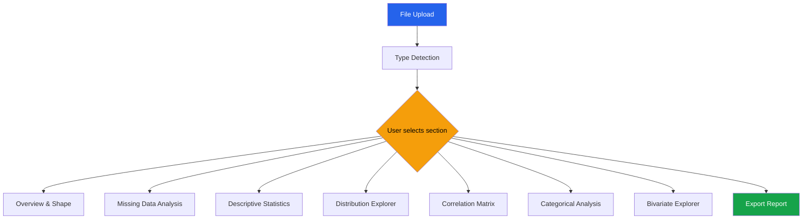

# Streamlit EDA App

This page contains a complete, working Streamlit EDA application. Copy the code below into `eda_app.py` and run with `streamlit run eda_app.py`. It provides a full interactive pipeline: upload data, inspect types, view statistics, analyze missing data, explore distributions, examine correlations, and export results.

---

## Application Architecture



---

## Complete Application Code

```python
"""
Streamlit EDA App — Complete Interactive Explorer
Run: streamlit run eda_app.py
"""

import streamlit as st
import pandas as pd
import numpy as np
import plotly.express as px
import plotly.graph_objects as go
from plotly.subplots import make_subplots
from scipy import stats
from io import BytesIO

# ─────────────────────────────────────────────
# Page Configuration
# ─────────────────────────────────────────────
st.set_page_config(
    page_title="Interactive EDA Tool",
    page_icon="🔬",
    layout="wide",
    initial_sidebar_state="expanded",
)

# Custom CSS
st.markdown("""
<style>
    .stMetric { background-color: #f8fafc; padding: 10px; border-radius: 8px; }
    .stTabs [data-baseweb="tab-list"] { gap: 8px; }
    .stTabs [data-baseweb="tab"] {
        padding: 8px 16px;
        border-radius: 4px;
    }
</style>
""", unsafe_allow_html=True)


# ─────────────────────────────────────────────
# Caching
# ─────────────────────────────────────────────
@st.cache_data
def load_csv(file):
    return pd.read_csv(file)

@st.cache_data
def load_excel(file):
    return pd.read_excel(file, engine='openpyxl')

@st.cache_data
def compute_profile(df):
    """Pre-compute expensive statistics."""
    numeric = df.select_dtypes(include='number')
    profile = {
        'describe': df.describe(include='all').round(3),
        'dtypes': df.dtypes.astype(str).to_dict(),
        'missing': df.isna().sum().to_dict(),
        'missing_pct': (df.isna().mean() * 100).round(2).to_dict(),
        'nunique': df.nunique().to_dict(),
        'skewness': numeric.skew().round(3).to_dict() if len(numeric.columns) > 0 else {},
        'kurtosis': numeric.kurtosis().round(3).to_dict() if len(numeric.columns) > 0 else {},
    }
    if len(numeric.columns) >= 2:
        profile['correlation'] = numeric.corr().round(3)
    return profile


# ─────────────────────────────────────────────
# Sidebar: File Upload & Global Controls
# ─────────────────────────────────────────────
with st.sidebar:
    st.header("Data Source")
    upload_method = st.radio("Load data from:", ["Upload File", "Sample Dataset"])

    if upload_method == "Upload File":
        uploaded = st.file_uploader("Upload CSV or Excel", type=['csv', 'xlsx', 'xls'])
        if uploaded:
            if uploaded.name.endswith('.csv'):
                df = load_csv(uploaded)
            else:
                df = load_excel(uploaded)
        else:
            df = None
    else:
        dataset_choice = st.selectbox("Choose sample", [
            "E-Commerce Orders", "Customer Churn", "Sales Performance"
        ])
        np.random.seed(42)
        n = 5000
        if dataset_choice == "E-Commerce Orders":
            df = pd.DataFrame({
                'order_id': range(1, n+1),
                'customer_id': np.random.randint(100, 2000, n),
                'order_date': pd.date_range('2023-01-01', periods=n, freq='2h'),
                'product': np.random.choice(['Widget', 'Gadget', 'Doohickey', 'Gizmo'], n),
                'category': np.random.choice(['Electronics', 'Clothing', 'Home', 'Books'], n),
                'quantity': np.random.randint(1, 10, n),
                'unit_price': np.round(np.random.lognormal(3, 0.8, n), 2),
                'region': np.random.choice(['North', 'South', 'East', 'West'], n),
                'discount': np.random.choice([0, 0.05, 0.1, 0.15, 0.2], n),
            })
            df['total'] = (df['quantity'] * df['unit_price'] * (1 - df['discount'])).round(2)
            # Inject some missing values
            for col in ['unit_price', 'region', 'discount']:
                mask = np.random.rand(n) < 0.03
                df.loc[mask, col] = np.nan
        elif dataset_choice == "Customer Churn":
            df = pd.DataFrame({
                'customer_id': range(1, n+1),
                'age': np.random.normal(42, 12, n).clip(18, 85).astype(int),
                'income': np.round(np.random.lognormal(10.8, 0.7, n), 0),
                'tenure_months': np.random.exponential(24, n).clip(1, 120).astype(int),
                'n_products': np.random.poisson(3, n).clip(1, 10),
                'credit_score': np.random.normal(680, 70, n).clip(300, 850).astype(int),
                'region': np.random.choice(['North', 'South', 'East', 'West'], n),
                'plan': np.random.choice(['Basic', 'Standard', 'Premium'], n, p=[0.4, 0.4, 0.2]),
                'churned': np.random.choice([0, 1], n, p=[0.82, 0.18]),
            })
        else:
            df = pd.DataFrame({
                'rep_id': np.random.randint(1, 50, n),
                'date': pd.date_range('2023-01-01', periods=n, freq='3h'),
                'region': np.random.choice(['North', 'South', 'East', 'West'], n),
                'deal_size': np.round(np.random.lognormal(8, 1.2, n), 2),
                'stage': np.random.choice(['Lead', 'Qualified', 'Proposal', 'Closed Won', 'Closed Lost'], n),
                'days_in_pipeline': np.random.exponential(30, n).astype(int),
                'customer_type': np.random.choice(['New', 'Existing', 'Upsell'], n),
            })

    if df is not None:
        st.divider()
        st.header("Filters")
        # Row sampling
        sample_pct = st.slider("Sample %", 10, 100, 100, 10)
        if sample_pct < 100:
            df = df.sample(frac=sample_pct/100, random_state=42)
            st.info(f"Sampled to {len(df):,} rows")

# ─────────────────────────────────────────────
# Main Content
# ─────────────────────────────────────────────
st.title("Interactive EDA Explorer")

if df is None:
    st.info("Upload a dataset or select a sample from the sidebar to begin.")
    st.stop()

profile = compute_profile(df)
numeric_cols = df.select_dtypes(include='number').columns.tolist()
categorical_cols = df.select_dtypes(include=['object', 'category']).columns.tolist()
datetime_cols = df.select_dtypes(include='datetime').columns.tolist()

# Tab navigation
tabs = st.tabs([
    "Overview", "Missing Data", "Distributions",
    "Correlations", "Categorical", "Bivariate", "Export"
])


# ─────────────────────────────────── TAB 1: Overview
with tabs[0]:
    st.header("Dataset Overview")

    # Key metrics
    c1, c2, c3, c4, c5 = st.columns(5)
    c1.metric("Rows", f"{df.shape[0]:,}")
    c2.metric("Columns", df.shape[1])
    c3.metric("Numeric", len(numeric_cols))
    c4.metric("Categorical", len(categorical_cols))
    c5.metric("Missing Cells", f"{df.isna().sum().sum():,}")

    # Memory usage
    mem_mb = df.memory_usage(deep=True).sum() / 1024**2
    st.metric("Memory Usage", f"{mem_mb:.2f} MB")

    # Data types
    col_a, col_b = st.columns(2)
    with col_a:
        st.subheader("Column Types")
        dtype_df = pd.DataFrame({
            'Column': df.columns,
            'Type': df.dtypes.astype(str).values,
            'Non-Null': df.notna().sum().values,
            'Null %': (df.isna().mean() * 100).round(1).values,
            'Unique': df.nunique().values,
        })
        st.dataframe(dtype_df, use_container_width=True, hide_index=True)

    with col_b:
        st.subheader("Descriptive Statistics")
        st.dataframe(profile['describe'], use_container_width=True)

    # Sample data
    with st.expander("View Raw Data", expanded=False):
        st.dataframe(df, use_container_width=True, height=400)


# ─────────────────────────────────── TAB 2: Missing Data
with tabs[1]:
    st.header("Missing Data Analysis")

    missing_df = pd.DataFrame({
        'Column': df.columns,
        'Missing': df.isna().sum().values,
        'Percent': (df.isna().mean() * 100).round(2).values,
        'Type': df.dtypes.astype(str).values,
    }).sort_values('Percent', ascending=False)

    has_missing = missing_df[missing_df['Missing'] > 0]

    if len(has_missing) == 0:
        st.success("No missing values found.")
    else:
        st.warning(f"{len(has_missing)} columns have missing values")

        # Bar chart of missing percentages
        fig = px.bar(
            has_missing, x='Column', y='Percent',
            color='Percent', color_continuous_scale='Reds',
            title='Missing Data by Column',
            labels={'Percent': 'Missing %'},
        )
        fig.update_layout(height=400)
        st.plotly_chart(fig, use_container_width=True)

        # Missing data pattern (nullity matrix)
        st.subheader("Missing Data Pattern")
        sample_for_pattern = df[has_missing['Column'].tolist()].sample(
            min(200, len(df)), random_state=42
        )
        fig = px.imshow(
            sample_for_pattern.isna().astype(int).T,
            color_continuous_scale=['white', 'crimson'],
            title='Nullity Matrix (white=present, red=missing)',
            labels={'x': 'Row', 'y': 'Column'},
            aspect='auto',
        )
        fig.update_layout(height=300)
        st.plotly_chart(fig, use_container_width=True)

        # Missing data table
        st.dataframe(has_missing, use_container_width=True, hide_index=True)


# ─────────────────────────────────── TAB 3: Distributions
with tabs[2]:
    st.header("Distribution Explorer")

    if not numeric_cols:
        st.warning("No numeric columns found.")
    else:
        col_select = st.selectbox("Select Numeric Column", numeric_cols, key='dist_col')
        series = df[col_select].dropna()

        # Stats summary
        c1, c2, c3, c4, c5, c6 = st.columns(6)
        c1.metric("Mean", f"{series.mean():.3f}")
        c2.metric("Median", f"{series.median():.3f}")
        c3.metric("Std Dev", f"{series.std():.3f}")
        c4.metric("Skewness", f"{series.skew():.3f}")
        c5.metric("Kurtosis", f"{series.kurtosis():.3f}")
        c6.metric("Outliers (IQR)", f"{((series < series.quantile(0.25) - 1.5*(series.quantile(0.75)-series.quantile(0.25))) | (series > series.quantile(0.75) + 1.5*(series.quantile(0.75)-series.quantile(0.25)))).sum()}")

        plot_col1, plot_col2 = st.columns(2)

        with plot_col1:
            n_bins = st.slider("Bins", 10, 200, 50, key='hist_bins')
            fig = px.histogram(
                df, x=col_select, nbins=n_bins,
                marginal='box',
                title=f'{col_select} Distribution',
            )
            mean_val = series.mean()
            median_val = series.median()
            fig.add_vline(x=mean_val, line_dash='dash', line_color='red',
                          annotation_text=f'Mean: {mean_val:.2f}')
            fig.add_vline(x=median_val, line_dash='dash', line_color='green',
                          annotation_text=f'Median: {median_val:.2f}')
            st.plotly_chart(fig, use_container_width=True)

        with plot_col2:
            # QQ plot
            theoretical_q = np.linspace(0.001, 0.999, min(len(series), 500))
            sorted_data = np.sort(series.values)
            if len(sorted_data) > 500:
                indices = np.linspace(0, len(sorted_data)-1, 500).astype(int)
                sorted_data = sorted_data[indices]
            theoretical_vals = stats.norm.ppf(theoretical_q, series.mean(), series.std())

            fig = go.Figure()
            fig.add_trace(go.Scatter(x=theoretical_vals, y=sorted_data,
                                      mode='markers', marker=dict(size=3, opacity=0.5),
                                      name='Data'))
            min_v = min(theoretical_vals.min(), sorted_data.min())
            max_v = max(theoretical_vals.max(), sorted_data.max())
            fig.add_trace(go.Scatter(x=[min_v, max_v], y=[min_v, max_v],
                                      mode='lines', line=dict(color='red', dash='dash'),
                                      name='Normal Reference'))
            fig.update_layout(title=f'QQ Plot: {col_select}',
                              xaxis_title='Theoretical Quantiles',
                              yaxis_title='Sample Quantiles')
            st.plotly_chart(fig, use_container_width=True)

        # Normality test
        sample_for_test = series.values[:5000]
        shapiro_stat, shapiro_p = stats.shapiro(sample_for_test)
        if shapiro_p > 0.05:
            st.success(f"Shapiro-Wilk: W={shapiro_stat:.4f}, p={shapiro_p:.4f} — Data appears normally distributed")
        else:
            st.warning(f"Shapiro-Wilk: W={shapiro_stat:.4f}, p={shapiro_p:.4f} — Data is NOT normally distributed")

        # Percentile table
        with st.expander("Percentile Table"):
            pcts = [1, 5, 10, 25, 50, 75, 90, 95, 99]
            pct_vals = series.quantile([p/100 for p in pcts]).values
            pct_df = pd.DataFrame({'Percentile': [f'P{p}' for p in pcts], 'Value': pct_vals.round(3)})
            st.dataframe(pct_df, use_container_width=True, hide_index=True)

        # All distributions overview
        if st.checkbox("Show All Distributions", key='all_dist'):
            n_cols_plot = min(3, len(numeric_cols))
            n_rows_plot = (len(numeric_cols) + n_cols_plot - 1) // n_cols_plot
            fig = make_subplots(rows=n_rows_plot, cols=n_cols_plot,
                                subplot_titles=numeric_cols)
            for idx, col in enumerate(numeric_cols):
                r = idx // n_cols_plot + 1
                c = idx % n_cols_plot + 1
                fig.add_trace(go.Histogram(x=df[col].dropna(), nbinsx=40, name=col,
                                            showlegend=False), row=r, col=c)
            fig.update_layout(height=300*n_rows_plot, title='All Numeric Distributions')
            st.plotly_chart(fig, use_container_width=True)


# ─────────────────────────────────── TAB 4: Correlations
with tabs[3]:
    st.header("Correlation Analysis")

    if len(numeric_cols) < 2:
        st.warning("Need at least 2 numeric columns for correlation analysis.")
    else:
        corr_method = st.selectbox("Method", ['pearson', 'spearman', 'kendall'], key='corr_method')
        corr = df[numeric_cols].corr(method=corr_method)

        # Heatmap
        fig = px.imshow(
            corr, text_auto='.2f',
            color_continuous_scale='RdBu_r',
            zmin=-1, zmax=1,
            title=f'{corr_method.title()} Correlation Matrix',
            aspect='equal',
        )
        fig.update_layout(height=max(500, len(numeric_cols) * 60))
        st.plotly_chart(fig, use_container_width=True)

        # Top correlations table
        st.subheader("Top Correlations")
        corr_pairs = []
        for i in range(len(corr)):
            for j in range(i+1, len(corr)):
                corr_pairs.append({
                    'Feature 1': corr.columns[i],
                    'Feature 2': corr.columns[j],
                    'Correlation': corr.iloc[i, j],
                    'Abs Correlation': abs(corr.iloc[i, j]),
                })
        corr_df = pd.DataFrame(corr_pairs).sort_values('Abs Correlation', ascending=False)
        st.dataframe(corr_df.head(20).round(4), use_container_width=True, hide_index=True)


# ─────────────────────────────────── TAB 5: Categorical
with tabs[4]:
    st.header("Categorical Analysis")

    if not categorical_cols:
        st.warning("No categorical columns found.")
    else:
        cat_col = st.selectbox("Select Column", categorical_cols, key='cat_col')
        vc = df[cat_col].value_counts()

        c1, c2 = st.columns(2)
        with c1:
            fig = px.bar(x=vc.index[:20], y=vc.values[:20],
                         title=f'{cat_col} — Top 20 Values',
                         labels={'x': cat_col, 'y': 'Count'})
            st.plotly_chart(fig, use_container_width=True)

        with c2:
            fig = px.pie(values=vc.values[:10], names=vc.index[:10],
                         title=f'{cat_col} — Composition (Top 10)',
                         hole=0.4)
            st.plotly_chart(fig, use_container_width=True)

        # Categorical vs numeric
        if numeric_cols:
            st.subheader("Category vs Numeric")
            num_col = st.selectbox("Numeric Column", numeric_cols, key='cat_num')
            chart = st.radio("Chart", ['Box', 'Violin', 'Strip'], key='cat_chart', horizontal=True)

            if chart == 'Box':
                fig = px.box(df, x=cat_col, y=num_col, color=cat_col, title=f'{num_col} by {cat_col}')
            elif chart == 'Violin':
                fig = px.violin(df, x=cat_col, y=num_col, color=cat_col, box=True, title=f'{num_col} by {cat_col}')
            else:
                fig = px.strip(df.sample(min(1000, len(df))), x=cat_col, y=num_col, color=cat_col, title=f'{num_col} by {cat_col}')
            st.plotly_chart(fig, use_container_width=True)

            # Group statistics
            group_stats = df.groupby(cat_col)[num_col].agg(['count', 'mean', 'median', 'std']).round(3)
            st.dataframe(group_stats, use_container_width=True)


# ─────────────────────────────────── TAB 6: Bivariate
with tabs[5]:
    st.header("Bivariate Explorer")

    if len(numeric_cols) < 2:
        st.warning("Need at least 2 numeric columns.")
    else:
        bv1, bv2 = st.columns(2)
        with bv1:
            x_col = st.selectbox("X Axis", numeric_cols, index=0, key='bv_x')
        with bv2:
            y_col = st.selectbox("Y Axis", numeric_cols, index=min(1, len(numeric_cols)-1), key='bv_y')

        color_col = st.selectbox("Color by (optional)",
                                  ['None'] + categorical_cols, key='bv_color')

        color = None if color_col == 'None' else color_col
        sample_size = min(st.slider("Sample size", 100, len(df), min(2000, len(df)), key='bv_sample'), len(df))
        sample = df.sample(sample_size, random_state=42)

        fig = px.scatter(
            sample, x=x_col, y=y_col, color=color,
            opacity=0.5, trendline='ols',
            title=f'{x_col} vs {y_col}',
            marginal_x='histogram', marginal_y='histogram',
        )
        fig.update_layout(height=600)
        st.plotly_chart(fig, use_container_width=True)

        # Correlation stats
        x_data = df[x_col].dropna()
        y_data = df[y_col].dropna()
        common_idx = x_data.index.intersection(y_data.index)
        r_pearson, p_pearson = stats.pearsonr(x_data[common_idx], y_data[common_idx])
        r_spearman, p_spearman = stats.spearmanr(x_data[common_idx], y_data[common_idx])

        mc1, mc2, mc3, mc4 = st.columns(4)
        mc1.metric("Pearson r", f"{r_pearson:.4f}")
        mc2.metric("Pearson p", f"{p_pearson:.4f}")
        mc3.metric("Spearman rho", f"{r_spearman:.4f}")
        mc4.metric("Spearman p", f"{p_spearman:.4f}")


# ─────────────────────────────────── TAB 7: Export
with tabs[6]:
    st.header("Export Analysis")

    # Summary report
    st.subheader("Download Data")
    c1, c2 = st.columns(2)
    with c1:
        csv = df.to_csv(index=False).encode('utf-8')
        st.download_button("Download CSV", data=csv,
                           file_name="eda_data.csv", mime="text/csv")
    with c2:
        buffer = BytesIO()
        with pd.ExcelWriter(buffer, engine='openpyxl') as writer:
            df.to_excel(writer, index=False, sheet_name='Data')
            profile['describe'].to_excel(writer, sheet_name='Statistics')
        st.download_button("Download Excel", data=buffer.getvalue(),
                           file_name="eda_report.xlsx",
                           mime="application/vnd.openxmlformats-officedocument.spreadsheetml.sheet")

    # Text report
    st.subheader("Text Summary")
    report_lines = [
        f"EDA Report",
        f"{'='*40}",
        f"Shape: {df.shape[0]:,} rows x {df.shape[1]} columns",
        f"Memory: {df.memory_usage(deep=True).sum()/1024**2:.2f} MB",
        f"Missing cells: {df.isna().sum().sum():,}",
        f"Duplicate rows: {df.duplicated().sum():,}",
        f"",
        f"Numeric columns: {', '.join(numeric_cols)}",
        f"Categorical columns: {', '.join(categorical_cols)}",
    ]
    st.code('\n'.join(report_lines), language='text')

# Footer
st.divider()
st.caption("Built with Streamlit. Upload your own CSV/Excel file to explore.")
```

---

## Running the App

```bash
# Install dependencies
pip install streamlit pandas numpy plotly scipy openpyxl

# Run the app
streamlit run eda_app.py

# Run with custom port
streamlit run eda_app.py --server.port 8080
```

---

## Features Summary

| Feature | Description |
|---------|-------------|
| File upload | CSV and Excel support with auto-detection |
| Sample datasets | 3 built-in datasets for demonstration |
| Overview tab | Shape, types, memory, descriptive stats |
| Missing data | Bar chart, nullity matrix, pattern analysis |
| Distributions | Histogram, box plot, QQ plot, normality test |
| Correlations | Heatmap, ranked pairs, 3 correlation methods |
| Categorical | Value counts, pie charts, group comparisons |
| Bivariate | Scatter with trendline, marginals, correlation stats |
| Export | CSV, Excel with multiple sheets, text summary |

---

## Key Takeaways

- The entire app is a **single Python file** under 350 lines that provides a complete EDA workflow
- **`@st.cache_data`** ensures expensive computations run only once per dataset
- **Tabs** organize the analysis into logical sections without overwhelming the user
- **Plotly** provides interactive charts where users can zoom, hover, and filter
- **Sample datasets** allow instant demonstration without requiring a file upload
- The **Export tab** generates downloadable CSV and Excel reports for stakeholders
- This template can be extended with additional tabs for time series, geospatial, or ML-assisted analysis
