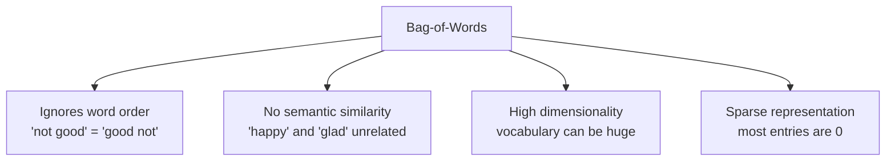
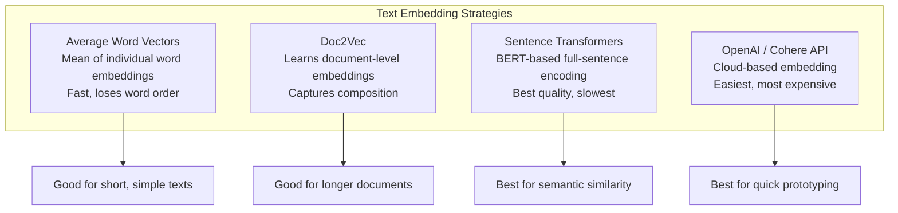
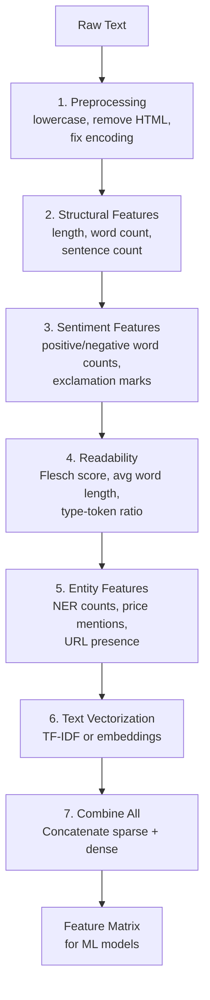

# Text Feature Engineering

Raw text is the richest and messiest data type. A single review contains information about sentiment, topic, writing quality, urgency, and specificity — but models cannot consume strings directly. This page covers the full progression from bag-of-words to embeddings, plus structural features like sentiment, readability, and named entity counts.

## The Dataset

We will use synthetic product reviews with labeled sentiment for end-to-end demonstration.

```python
import numpy as np
import pandas as pd
import matplotlib.pyplot as plt
import seaborn as sns
from sklearn.feature_extraction.text import CountVectorizer, TfidfVectorizer
from sklearn.model_selection import cross_val_score
from sklearn.linear_model import LogisticRegression
from sklearn.ensemble import GradientBoostingClassifier
import re

np.random.seed(42)

reviews = [
    "This product is absolutely amazing. Best purchase I have ever made. The quality is outstanding.",
    "Terrible quality. Broke after one day. Complete waste of money. Would not recommend.",
    "It is okay. Nothing special but it works. Average product for the price.",
    "I love this! Fast shipping, great packaging, and the product exceeded my expectations.",
    "Worst customer service ever. They refused to process my return. Never buying from here again.",
    "Good value for money. Not premium quality but does the job. Decent purchase.",
    "Five stars! This changed my life. I cannot believe how good this is. Highly recommended!",
    "Disappointed. The color was different from the pictures. Misleading product listing.",
    "Solid product. Arrived on time. Does what it says. Would buy again.",
    "Do not buy this. It stopped working after a week. Cheap materials. Total scam.",
] * 200  # Repeat to get 2000 samples

# Add noise and variation
np.random.shuffle(reviews)
sentiment_labels = []
for r in reviews:
    if any(w in r.lower() for w in ["amazing", "love", "best", "stars", "outstanding", "exceeded"]):
        sentiment_labels.append(1)
    elif any(w in r.lower() for w in ["terrible", "worst", "scam", "waste", "disappointed", "broke"]):
        sentiment_labels.append(0)
    else:
        sentiment_labels.append(np.random.choice([0, 1]))

df = pd.DataFrame({"text": reviews, "sentiment": sentiment_labels})
df = df.sample(frac=1, random_state=42).reset_index(drop=True)

print(f"Shape: {df.shape}")
print(f"Sentiment distribution: {df['sentiment'].value_counts().to_dict()}")
print(f"\nSample reviews:")
for i in range(3):
    print(f"  [{df['sentiment'].iloc[i]}] {df['text'].iloc[i][:80]}...")
```

## 1. Bag-of-Words (BoW)

The simplest text representation: count how many times each word appears.

```python
# Basic bag-of-words
bow = CountVectorizer(
    max_features=1000,       # Keep top 1000 words
    stop_words="english",    # Remove common words
    min_df=5,                # Minimum 5 documents
    max_df=0.95,             # Remove words in >95% of docs
    ngram_range=(1, 1),      # Unigrams only
)

X_bow = bow.fit_transform(df["text"])

print(f"BoW matrix shape: {X_bow.shape}")
print(f"Vocabulary size: {len(bow.vocabulary_)}")
print(f"Sparsity: {1 - X_bow.nnz / (X_bow.shape[0] * X_bow.shape[1]):.3%}")

# Top words by frequency
word_freq = pd.Series(X_bow.sum(axis=0).A1, index=bow.get_feature_names_out())
print(f"\nTop 15 words:")
print(word_freq.nlargest(15))

# BoW with n-grams
bow_ngram = CountVectorizer(
    max_features=2000,
    stop_words="english",
    ngram_range=(1, 3),  # Unigrams + bigrams + trigrams
    min_df=3,
)
X_bow_ngram = bow_ngram.fit_transform(df["text"])
print(f"\nBoW with n-grams: {X_bow_ngram.shape}")

# Evaluate
score = cross_val_score(LogisticRegression(max_iter=1000), X_bow, df["sentiment"],
                         cv=5, scoring="accuracy").mean()
print(f"\nBoW → Logistic Regression accuracy: {score:.4f}")
```

### BoW Limitations



## 2. TF-IDF (Term Frequency-Inverse Document Frequency)

TF-IDF weighs words by how important they are: common words get downweighted, rare-but-present words get boosted.

```python
tfidf = TfidfVectorizer(
    max_features=1000,
    stop_words="english",
    min_df=5,
    max_df=0.95,
    ngram_range=(1, 2),
    sublinear_tf=True,     # Apply log to term frequency
    norm="l2",             # L2 normalize each document vector
)

X_tfidf = tfidf.fit_transform(df["text"])

print(f"TF-IDF matrix shape: {X_tfidf.shape}")

# Most discriminative words (highest TF-IDF values)
tfidf_scores = pd.DataFrame(
    X_tfidf.toarray(),
    columns=tfidf.get_feature_names_out(),
)

# Average TF-IDF by sentiment
for sentiment in [0, 1]:
    mask = df["sentiment"] == sentiment
    avg_tfidf = tfidf_scores[mask].mean().nlargest(10)
    label = "Positive" if sentiment == 1 else "Negative"
    print(f"\nTop TF-IDF words for {label} reviews:")
    for word, score in avg_tfidf.items():
        print(f"  {word:20s} {score:.4f}")

# Evaluate
score_tfidf = cross_val_score(LogisticRegression(max_iter=1000), X_tfidf, df["sentiment"],
                                cv=5, scoring="accuracy").mean()
print(f"\nTF-IDF → Logistic Regression accuracy: {score_tfidf:.4f}")
```

### TF-IDF Formula

```
TF-IDF(t, d) = TF(t, d) × IDF(t)

TF(t, d) = count of term t in document d / total terms in d
IDF(t) = log(N / df(t))

Where:
  t = term (word)
  d = document
  N = total number of documents
  df(t) = number of documents containing term t
```

## 3. Word Embeddings

Pre-trained embeddings map words to dense vectors where semantic similarity corresponds to geometric proximity.

```python
# Method 1: Average word embeddings using pre-trained vectors
# (Simulated here for portability — in production use spaCy, Gensim, or sentence-transformers)

def create_simple_embeddings(texts, embedding_dim=50):
    """Create pseudo-embeddings using a hash-based approach.
    In production, use sentence-transformers or spaCy."""
    embeddings = np.zeros((len(texts), embedding_dim))

    for i, text in enumerate(texts):
        words = text.lower().split()
        word_vectors = []
        for word in words:
            # Deterministic pseudo-embedding from hash
            np.random.seed(hash(word) % (2**31))
            vec = np.random.randn(embedding_dim) * 0.1
            word_vectors.append(vec)
        if word_vectors:
            embeddings[i] = np.mean(word_vectors, axis=0)

    return embeddings

X_embed = create_simple_embeddings(df["text"].values, embedding_dim=50)
print(f"Embedding matrix shape: {X_embed.shape}")
print(f"Density: 100% (dense representation)")

# Production approach with sentence-transformers:
# from sentence_transformers import SentenceTransformer
# model = SentenceTransformer("all-MiniLM-L6-v2")
# X_embed = model.encode(df["text"].tolist(), show_progress_bar=True)
```

### Embedding Approaches Compared



## 4. Sentiment Features

Sentiment analysis produces numerical features from text tone.

```python
# Rule-based sentiment with VADER-like approach
positive_words = {"amazing", "love", "best", "great", "excellent", "outstanding",
                  "perfect", "fantastic", "wonderful", "recommend", "happy", "exceeded"}
negative_words = {"terrible", "worst", "bad", "awful", "horrible", "waste",
                  "disappointed", "broke", "scam", "refuse", "never", "cheap"}
negation_words = {"not", "no", "never", "neither", "nobody", "nothing",
                  "nowhere", "nor", "cannot", "without"}
intensifiers = {"very", "extremely", "absolutely", "completely", "totally",
                "incredibly", "highly"}

def compute_sentiment_features(text):
    """Extract sentiment-related features from text."""
    words = re.findall(r"\b\w+\b", text.lower())
    n_words = max(len(words), 1)

    n_positive = sum(1 for w in words if w in positive_words)
    n_negative = sum(1 for w in words if w in negative_words)
    n_negation = sum(1 for w in words if w in negation_words)
    n_intensifier = sum(1 for w in words if w in intensifiers)

    # Exclamation marks signal strong sentiment
    n_exclamation = text.count("!")
    n_question = text.count("?")
    n_caps_words = sum(1 for w in text.split() if w.isupper() and len(w) > 1)

    return {
        "n_positive_words": n_positive,
        "n_negative_words": n_negative,
        "n_negation_words": n_negation,
        "n_intensifiers": n_intensifier,
        "positive_ratio": n_positive / n_words,
        "negative_ratio": n_negative / n_words,
        "sentiment_balance": (n_positive - n_negative) / n_words,
        "n_exclamation": n_exclamation,
        "n_question": n_question,
        "n_caps_words": n_caps_words,
        "has_negation": int(n_negation > 0),
    }

sentiment_features = df["text"].apply(compute_sentiment_features).apply(pd.Series)
df = pd.concat([df, sentiment_features], axis=1)

print("Sentiment features by label:")
sentiment_cols = sentiment_features.columns.tolist()
print(df.groupby("sentiment")[sentiment_cols].mean().round(3).T)
```

## 5. Readability Features

Readability metrics quantify how complex the text is — useful for predicting credibility, expertise, and content type.

```python
def compute_readability_features(text):
    """Extract readability and structural features."""
    if not isinstance(text, str) or len(text.strip()) < 5:
        return {k: 0 for k in ["char_count", "word_count", "sentence_count",
                                "avg_word_length", "avg_sentence_length",
                                "flesch_reading_ease", "type_token_ratio",
                                "long_word_ratio", "short_word_ratio"]}

    words = re.findall(r"\b\w+\b", text)
    sentences = max(len(re.findall(r"[.!?]+", text)), 1)
    n_words = max(len(words), 1)
    chars = sum(len(w) for w in words)

    # Syllable approximation
    def syllables(word):
        word = word.lower()
        if len(word) <= 3:
            return 1
        word = re.sub(r"(?:es|ed|e)$", "", word)
        return max(1, len(re.findall(r"[aeiouy]+", word)))

    n_syllables = sum(syllables(w) for w in words)

    # Flesch Reading Ease
    fre = 206.835 - 1.015 * (n_words / sentences) - 84.6 * (n_syllables / n_words)

    return {
        "char_count": len(text),
        "word_count": n_words,
        "sentence_count": sentences,
        "avg_word_length": chars / n_words,
        "avg_sentence_length": n_words / sentences,
        "flesch_reading_ease": fre,
        "type_token_ratio": len(set(words)) / n_words,
        "long_word_ratio": sum(1 for w in words if len(w) > 6) / n_words,
        "short_word_ratio": sum(1 for w in words if len(w) <= 3) / n_words,
    }

readability_features = df["text"].apply(compute_readability_features).apply(pd.Series)
df = pd.concat([df, readability_features], axis=1)

read_cols = readability_features.columns.tolist()
print("Readability features:")
print(df[read_cols].describe().round(2))
```

## 6. Named Entity Recognition (NER) Counts

NER identifies mentions of people, organizations, locations, and other entities. The count of each entity type is a useful feature.

```python
# Simplified NER using regex patterns
# In production, use spaCy: nlp = spacy.load("en_core_web_sm")

def extract_ner_features(text):
    """Extract NER-like features using pattern matching."""
    # Price mentions
    prices = re.findall(r"\$\d+\.?\d*", text)
    # Numbers
    numbers = re.findall(r"\b\d+\b", text)
    # Email addresses
    emails = re.findall(r"\b[\w.]+@[\w.]+\.\w+\b", text)
    # URLs
    urls = re.findall(r"https?://\S+", text)
    # Capitalized sequences (potential names/brands)
    proper_nouns = re.findall(r"\b[A-Z][a-z]+(?:\s+[A-Z][a-z]+)*\b", text)
    # Time references
    time_refs = re.findall(r"\b(?:today|yesterday|tomorrow|last\s+\w+|next\s+\w+|\d+\s+(?:days?|weeks?|months?|years?))\b",
                           text.lower())

    return {
        "n_price_mentions": len(prices),
        "n_numbers": len(numbers),
        "n_emails": len(emails),
        "n_urls": len(urls),
        "n_proper_nouns": len(proper_nouns),
        "n_time_refs": len(time_refs),
        "has_price": int(len(prices) > 0),
        "has_url": int(len(urls) > 0),
    }

ner_features = df["text"].apply(extract_ner_features).apply(pd.Series)
df = pd.concat([df, ner_features], axis=1)

ner_cols = ner_features.columns.tolist()
print("NER features:")
print(df[ner_cols].describe().round(2))

# Production spaCy example:
# import spacy
# nlp = spacy.load("en_core_web_sm")
# doc = nlp("Apple is looking at buying a startup in San Francisco for $1 billion")
# for ent in doc.ents:
#     print(ent.text, ent.label_)
```

## Comprehensive Feature Benchmark

```python
from sklearn.pipeline import Pipeline
from sklearn.preprocessing import StandardScaler
from scipy.sparse import hstack, csr_matrix

y = df["sentiment"]

# Feature sets
feature_configs = {
    "BoW only": X_bow,
    "TF-IDF only": X_tfidf,
    "Sentiment only": csr_matrix(df[sentiment_cols].values),
    "Readability only": csr_matrix(df[read_cols].values),
    "NER only": csr_matrix(df[ner_cols].values),
    "TF-IDF + Sentiment": hstack([X_tfidf, csr_matrix(df[sentiment_cols].values)]),
    "TF-IDF + All meta": hstack([
        X_tfidf,
        csr_matrix(df[sentiment_cols].values),
        csr_matrix(df[read_cols].values),
        csr_matrix(df[ner_cols].values),
    ]),
}

print(f"{'Feature Set':<25s} {'LR Acc':>10s} {'GBM Acc':>10s} {'Dims':>8s}")
print("-" * 58)

for name, X in feature_configs.items():
    # Handle sparse or dense
    lr_score = cross_val_score(
        LogisticRegression(max_iter=1000), X, y, cv=5, scoring="accuracy"
    ).mean()
    # GBM needs dense
    X_dense = X.toarray() if hasattr(X, "toarray") else X
    gbm_score = cross_val_score(
        GradientBoostingClassifier(n_estimators=50, max_depth=3, random_state=42),
        X_dense, y, cv=5, scoring="accuracy"
    ).mean()
    dims = X.shape[1]
    print(f"{name:<25s} {lr_score:>10.4f} {gbm_score:>10.4f} {dims:>8d}")
```

## Text Feature Pipeline



## Key Takeaways

- TF-IDF outperforms raw bag-of-words in almost every setting. Use `sublinear_tf=True` and L2 normalization.
- N-grams (bigrams, trigrams) capture phrases like "not good" that unigrams miss.
- Sentence-transformer embeddings are the best text representation when semantic similarity matters. Use `all-MiniLM-L6-v2` as a fast default.
- Sentiment features (positive/negative word counts, exclamation marks) are cheap to compute and surprisingly predictive.
- Readability metrics capture text complexity, which correlates with review quality, user expertise, and credibility.
- NER counts (names, prices, locations) add entity-level information that bag-of-words cannot represent.
- Combining TF-IDF with handcrafted meta-features consistently outperforms either alone. Always build both.
