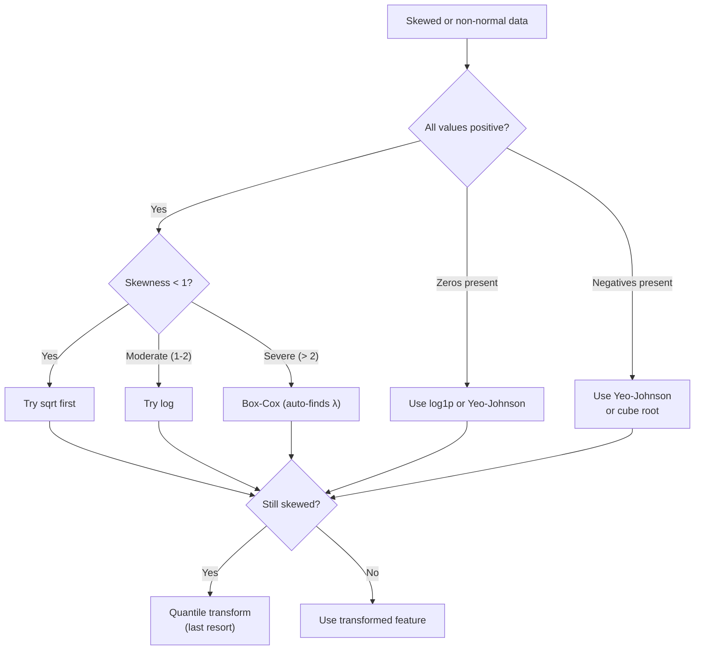

# Data Transformations

Many statistical methods and machine learning algorithms assume — or perform better with — normally distributed features, constant variance, or linear relationships. Real data rarely cooperates. Transformations reshape your data to meet these assumptions.

This page covers every major transformation, when to use each, visual before/after comparisons, and the practical implications for modeling.

## The Dataset

We will generate variables with known distribution issues that each transformation targets.

```python
import numpy as np
import pandas as pd
import matplotlib.pyplot as plt
import seaborn as sns
from scipy import stats
from sklearn.preprocessing import (
    PowerTransformer, QuantileTransformer, FunctionTransformer
)

np.random.seed(42)
n = 3000

# Right-skewed: income (lognormal)
income = np.random.lognormal(mean=11, sigma=0.6, size=n)
income = np.clip(income, 10000, 1000000)

# Right-skewed with zeros: insurance claims
claims = np.random.exponential(5000, n)
claims[np.random.random(n) < 0.3] = 0  # 30% zero claims

# Left-skewed: exam scores (beta)
scores = np.random.beta(5, 2, n) * 100

# Heavy-tailed: stock returns (t-distribution)
returns = np.random.standard_t(df=3, size=n) * 2

# Bimodal (cannot be fixed by transformation alone)
bimodal = np.concatenate([np.random.normal(30, 5, n//2), np.random.normal(70, 5, n//2)])

df = pd.DataFrame({
    "income": income,
    "claims": claims,
    "scores": scores,
    "returns": returns,
    "bimodal": bimodal,
})

print("Before transformation:")
print(df.describe().round(2))
print(f"\nSkewness:\n{df.skew().round(3)}")
print(f"\nKurtosis:\n{df.kurtosis().round(3)}")
```

## Transformation Comparison Visual

```python
def transformation_gallery(data, name, figsize=(20, 12)):
    """Apply all transformations and show before/after."""
    positive_data = data[data > 0]

    transforms = {}
    transforms["Original"] = data

    # Log transform (requires positive)
    if (data > 0).all():
        transforms["Log"] = np.log(data)
    elif (data >= 0).all():
        transforms["Log(1+x)"] = np.log1p(data)

    # Square root (requires non-negative)
    if (data >= 0).all():
        transforms["Sqrt"] = np.sqrt(data)

    # Cube root (works for all values)
    transforms["Cube root"] = np.sign(data) * np.abs(data) ** (1/3)

    # Box-Cox (requires strictly positive)
    if (data > 0).all():
        bc_data, bc_lambda = stats.boxcox(data)
        transforms[f"Box-Cox (λ={bc_lambda:.2f})"] = bc_data

    # Yeo-Johnson (works for all values)
    pt_yj = PowerTransformer(method="yeo-johnson")
    yj_data = pt_yj.fit_transform(data.values.reshape(-1, 1)).flatten()
    transforms["Yeo-Johnson"] = yj_data

    # Quantile (maps to normal)
    qt = QuantileTransformer(output_distribution="normal", random_state=42)
    q_data = qt.fit_transform(data.values.reshape(-1, 1)).flatten()
    transforms["Quantile → Normal"] = q_data

    # Rank transform
    from scipy.stats import rankdata
    transforms["Rank"] = rankdata(data) / len(data)

    n_transforms = len(transforms)
    n_cols = 4
    n_rows = (n_transforms + n_cols - 1) // n_cols
    fig, axes = plt.subplots(n_rows, n_cols, figsize=figsize)
    axes = axes.flatten()

    for i, (t_name, t_data) in enumerate(transforms.items()):
        ax = axes[i]
        t_series = pd.Series(t_data)

        ax.hist(t_data, bins=50, density=True, alpha=0.5, color="steelblue", edgecolor="black")
        sns.kdeplot(t_data, ax=ax, color="crimson", linewidth=2)

        skew = t_series.skew()
        kurt = t_series.kurtosis()
        _, shapiro_p = stats.shapiro(np.random.choice(t_data, min(5000, len(t_data)), replace=False))

        ax.set_title(f"{t_name}\nskew={skew:.2f}, kurt={kurt:.2f}\nShapiro p={shapiro_p:.4f}",
                     fontsize=10)

    # Hide unused axes
    for j in range(n_transforms, len(axes)):
        axes[j].set_visible(False)

    fig.suptitle(f"Transformation Gallery: {name}", fontsize=16, fontweight="bold")
    plt.tight_layout()
    plt.savefig(f"transform_{name}.png", dpi=150, bbox_inches="tight")
    plt.show()

transformation_gallery(df["income"], "Income (Right-Skewed)")
transformation_gallery(df["scores"], "Scores (Left-Skewed)")
transformation_gallery(df["returns"], "Returns (Heavy-Tailed)")
```

## Log Transform

The most common transformation. Compresses the right tail of positively skewed distributions.

```python
fig, axes = plt.subplots(2, 2, figsize=(14, 10))

# When log works well: right-skewed positive data
axes[0, 0].hist(df["income"], bins=50, density=True, alpha=0.5, color="steelblue", edgecolor="black")
axes[0, 0].set_title(f"Income: Original (skew={df['income'].skew():.2f})", fontsize=12)

log_income = np.log(df["income"])
axes[0, 1].hist(log_income, bins=50, density=True, alpha=0.5, color="steelblue", edgecolor="black")
axes[0, 1].set_title(f"Income: Log (skew={pd.Series(log_income).skew():.2f})", fontsize=12)

# Log1p for data with zeros
axes[1, 0].hist(df["claims"], bins=50, density=True, alpha=0.5, color="steelblue", edgecolor="black")
axes[1, 0].set_title(f"Claims: Original (skew={df['claims'].skew():.2f})", fontsize=12)

log_claims = np.log1p(df["claims"])
axes[1, 1].hist(log_claims, bins=50, density=True, alpha=0.5, color="steelblue", edgecolor="black")
axes[1, 1].set_title(f"Claims: Log(1+x) (skew={pd.Series(log_claims).skew():.2f})", fontsize=12)

plt.suptitle("Log Transform: Before and After", fontsize=16, fontweight="bold")
plt.tight_layout()
plt.savefig("log_transform.png", dpi=150, bbox_inches="tight")
plt.show()
```

| Variant | Formula | Use When |
|---------|---------|----------|
| `log(x)` | `np.log(x)` | All values strictly positive |
| `log(1+x)` | `np.log1p(x)` | Values include zeros |
| `log(x+c)` | `np.log(x+c)` | Need to shift to handle negatives (c makes all positive) |

::: warning Log transform with zeros and negatives
`log(0)` is undefined and `log(negative)` is complex. Use `log1p` for zero-inclusive data. For data with negatives, use Yeo-Johnson instead.
:::

## Square Root and Cube Root

```python
# Square root: gentler than log, good for count data
count_data = np.random.poisson(lam=5, size=3000)

fig, axes = plt.subplots(1, 3, figsize=(16, 4))
axes[0].hist(count_data, bins=range(0, 20), density=True, color="steelblue", edgecolor="black")
axes[0].set_title(f"Poisson Counts (skew={pd.Series(count_data).skew():.2f})")

sqrt_counts = np.sqrt(count_data)
axes[1].hist(sqrt_counts, bins=30, density=True, color="steelblue", edgecolor="black")
axes[1].set_title(f"Square Root (skew={pd.Series(sqrt_counts).skew():.2f})")

cbrt_counts = np.cbrt(count_data)
axes[2].hist(cbrt_counts, bins=30, density=True, color="steelblue", edgecolor="black")
axes[2].set_title(f"Cube Root (skew={pd.Series(cbrt_counts).skew():.2f})")

plt.suptitle("Root Transforms: Gentler Than Log", fontsize=14, fontweight="bold")
plt.tight_layout()
plt.savefig("root_transforms.png", dpi=150, bbox_inches="tight")
plt.show()
```

## Box-Cox Transform

Box-Cox finds the optimal power parameter lambda that makes data most normal. It generalizes log and sqrt as special cases.

```python
# Box-Cox: automatically finds optimal lambda
fig, axes = plt.subplots(2, 3, figsize=(18, 10))

test_data = {
    "Income": df["income"],
    "Claims (positive only)": df["claims"][df["claims"] > 0],
    "Scores (reflected)": 101 - df["scores"],  # reflect left-skew to right-skew
}

for i, (name, data) in enumerate(test_data.items()):
    # Find optimal lambda
    bc_data, bc_lambda = stats.boxcox(data)

    # Profile log-likelihood across lambda values
    lambdas = np.linspace(-3, 3, 200)
    llf = np.array([stats.boxcox_llf(lam, data) for lam in lambdas])

    # Before
    axes[0, i].hist(data, bins=50, density=True, alpha=0.5, color="steelblue", edgecolor="black")
    axes[0, i].set_title(f"Before: {name}\nskew={pd.Series(data).skew():.2f}", fontsize=11)

    # After
    axes[1, i].hist(bc_data, bins=50, density=True, alpha=0.5, color="steelblue", edgecolor="black")
    axes[1, i].set_title(f"After Box-Cox (λ={bc_lambda:.3f})\nskew={pd.Series(bc_data).skew():.2f}",
                          fontsize=11)

plt.suptitle("Box-Cox Transform: Optimal Power Parameter", fontsize=16, fontweight="bold")
plt.tight_layout()
plt.savefig("boxcox.png", dpi=150, bbox_inches="tight")
plt.show()

# Special cases of Box-Cox
print("Box-Cox special cases:")
print("  λ = 1.0  → no transform (linear)")
print("  λ = 0.5  → square root")
print("  λ = 0.0  → log transform")
print("  λ = -0.5 → reciprocal square root")
print("  λ = -1.0 → reciprocal")
```

## Yeo-Johnson Transform

Yeo-Johnson extends Box-Cox to handle zero and negative values. It should be your default when you do not know the sign of your data.

```python
from sklearn.preprocessing import PowerTransformer

fig, axes = plt.subplots(2, 3, figsize=(18, 10))

test_data_yj = {
    "Income (positive)": df["income"].values,
    "Returns (pos + neg)": df["returns"].values,
    "Scores (0-100)": df["scores"].values,
}

for i, (name, data) in enumerate(test_data_yj.items()):
    pt = PowerTransformer(method="yeo-johnson")
    transformed = pt.fit_transform(data.reshape(-1, 1)).flatten()
    lam = pt.lambdas_[0]

    axes[0, i].hist(data, bins=50, density=True, alpha=0.5, color="steelblue", edgecolor="black")
    axes[0, i].set_title(f"Before: {name}\nskew={pd.Series(data).skew():.2f}", fontsize=11)

    axes[1, i].hist(transformed, bins=50, density=True, alpha=0.5, color="steelblue", edgecolor="black")
    axes[1, i].set_title(f"After Yeo-Johnson (λ={lam:.3f})\nskew={pd.Series(transformed).skew():.2f}",
                          fontsize=11)

plt.suptitle("Yeo-Johnson: Works for Positive, Negative, and Zero Values",
             fontsize=16, fontweight="bold")
plt.tight_layout()
plt.savefig("yeo_johnson.png", dpi=150, bbox_inches="tight")
plt.show()
```

## Quantile Transform

The quantile transform maps any distribution to a target distribution (usually normal or uniform) by matching quantiles. It is the nuclear option — it will normalize anything.

```python
from sklearn.preprocessing import QuantileTransformer

fig, axes = plt.subplots(2, 3, figsize=(18, 10))

for i, (name, data) in enumerate([
    ("Income (right-skewed)", df["income"].values),
    ("Returns (heavy-tailed)", df["returns"].values),
    ("Bimodal", df["bimodal"].values),
]):
    # Quantile transform to normal
    qt = QuantileTransformer(output_distribution="normal",
                              n_quantiles=1000, random_state=42)
    transformed = qt.fit_transform(data.reshape(-1, 1)).flatten()

    axes[0, i].hist(data, bins=50, density=True, alpha=0.5, color="steelblue", edgecolor="black")
    axes[0, i].set_title(f"Before: {name}\nskew={pd.Series(data).skew():.2f}", fontsize=11)

    axes[1, i].hist(transformed, bins=50, density=True, alpha=0.5, color="steelblue", edgecolor="black")
    axes[1, i].set_title(f"After Quantile → Normal\nskew={pd.Series(transformed).skew():.2f}", fontsize=11)

plt.suptitle("Quantile Transform: Forces Any Distribution to Normal", fontsize=16, fontweight="bold")
plt.tight_layout()
plt.savefig("quantile_transform.png", dpi=150, bbox_inches="tight")
plt.show()
```

::: danger Quantile transform hides information
Quantile normalization forces any distribution to look normal — including bimodal distributions and distributions with genuine outliers. This can destroy real signal. Use it when you genuinely need normality and other transforms fail, but be aware you are sacrificing interpretability.
:::

## Rank Transform

Ranking is the simplest nonparametric transform. It replaces each value with its rank, eliminating outlier influence entirely.

```python
from scipy.stats import rankdata

data_with_outliers = np.concatenate([
    np.random.normal(50, 10, 990),
    np.array([500, 600, 700, 800, 900, 1000, -500, -600, -700, -800])
])

fig, axes = plt.subplots(1, 3, figsize=(16, 4))

axes[0].hist(data_with_outliers, bins=50, color="steelblue", edgecolor="black")
axes[0].set_title("Original (with extreme outliers)")

ranked = rankdata(data_with_outliers) / len(data_with_outliers)
axes[1].hist(ranked, bins=50, color="steelblue", edgecolor="black")
axes[1].set_title("Rank Transform (0-1)")

# Rank then inverse normal (rank-based inverse normal transform)
from scipy.stats import norm
rint = norm.ppf(rankdata(data_with_outliers) / (len(data_with_outliers) + 1))
axes[2].hist(rint, bins=50, color="steelblue", edgecolor="black")
axes[2].set_title("Rank-Based Inverse Normal")

plt.suptitle("Rank Transforms Eliminate Outlier Influence", fontsize=14, fontweight="bold")
plt.tight_layout()
plt.savefig("rank_transform.png", dpi=150, bbox_inches="tight")
plt.show()
```

## Decision Guide: Which Transform to Use



## Transformation Impact on Models

```python
from sklearn.model_selection import cross_val_score
from sklearn.linear_model import Ridge
from sklearn.ensemble import RandomForestRegressor

# Generate regression problem
np.random.seed(42)
n = 2000
X_raw = np.column_stack([
    np.random.lognormal(10, 0.5, n),       # right-skewed
    np.random.exponential(100, n),           # exponential
    np.random.normal(50, 10, n),             # normal (for comparison)
])
y = 0.3 * np.log(X_raw[:, 0]) + 0.5 * np.sqrt(X_raw[:, 1]) + 0.2 * X_raw[:, 2] + np.random.normal(0, 5, n)

# Compare raw vs transformed features
transforms = {
    "Raw": X_raw,
    "Log": np.column_stack([np.log(X_raw[:, 0]), np.log(X_raw[:, 1] + 1), X_raw[:, 2]]),
    "Box-Cox": PowerTransformer(method="box-cox").fit_transform(X_raw + 1),
    "Yeo-Johnson": PowerTransformer(method="yeo-johnson").fit_transform(X_raw),
    "Quantile": QuantileTransformer(output_distribution="normal").fit_transform(X_raw),
}

results = {}
for name, X in transforms.items():
    # Ridge (sensitive to distribution)
    ridge_scores = cross_val_score(Ridge(), X, y, cv=5, scoring="r2")
    # Random Forest (robust to distribution)
    rf_scores = cross_val_score(RandomForestRegressor(n_estimators=50, random_state=42),
                                 X, y, cv=5, scoring="r2")
    results[name] = {
        "Ridge R²": ridge_scores.mean(),
        "RF R²": rf_scores.mean(),
    }

results_df = pd.DataFrame(results).T
print("\nModel Performance: Raw vs Transformed Features")
print(results_df.round(4).to_string())
print("\nNote: Linear models benefit more from transformations than tree-based models.")
```

## Practical Checklist

1. **Always visualize before and after.** A histogram + QQ plot tells you if the transform worked.
2. **Check skewness quantitatively.** Target |skewness| < 0.5 after transformation.
3. **Handle zeros and negatives first.** Log(0) is undefined. Either use log1p, Yeo-Johnson, or add a constant.
4. **Preserve interpretability when possible.** Log income is still interpretable. Quantile-transformed income is not.
5. **Tree models do not care.** Decision trees, random forests, and gradient boosting are invariant to monotonic transformations. Save your effort for linear models, distance-based methods, and neural networks.

## Key Takeaways

- Log transform is the go-to for right-skewed positive data. Use log1p when zeros are present.
- Box-Cox automatically finds the optimal power parameter but requires strictly positive values.
- Yeo-Johnson extends Box-Cox to handle zeros and negatives — it should be your default power transform.
- Quantile transform forces any distribution to normal but destroys distributional information. Use as last resort.
- Rank transform is the most robust to outliers but reduces all distances to ordinal information.
- Linear models and distance-based methods benefit most from transformations. Tree-based models are largely unaffected.
