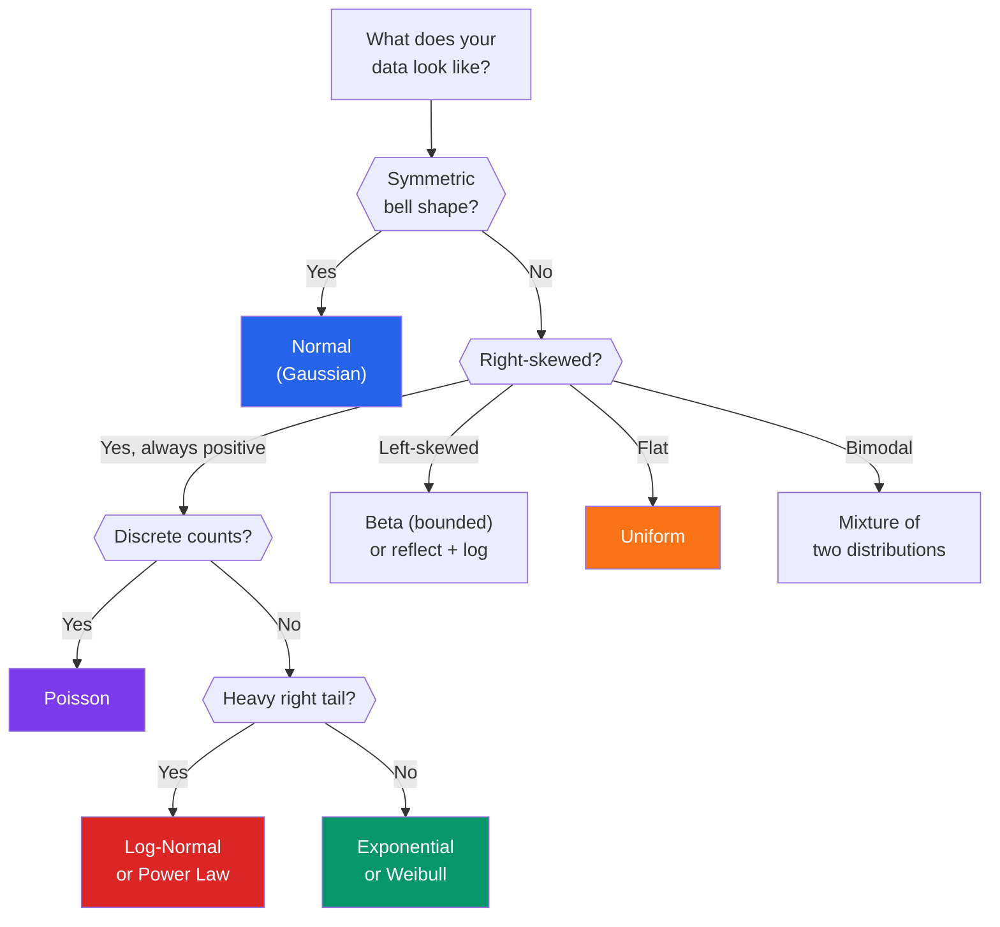

# Understanding Distributions

Every column in your dataset follows some distribution — whether you know it or not. Recognizing which distribution your data follows determines which summary statistics are valid, which models are appropriate, which transformations will help, and which outlier detection methods will work. Getting the distribution wrong means your entire analysis is built on a false assumption.

This page covers the distributions you will encounter most often in real data, how to identify them visually and statistically, and how to transform data when the distribution is inconvenient.

---

## Distribution Quick Reference



---

## The Normal Distribution

The most important distribution in statistics — not because data is usually normal, but because sampling distributions and central limit theorem rely on it.

```python
# normal_distribution.py — Identifying and testing normality
import numpy as np
import pandas as pd
from scipy import stats
import matplotlib.pyplot as plt

np.random.seed(42)

# Generate normally distributed data
n = 1000
heights = np.random.normal(loc=170, scale=10, size=n)  # cm

print("=== NORMAL DISTRIBUTION: Heights ===")
print(f"Mean: {heights.mean():.1f}")
print(f"Median: {heights.median() if hasattr(heights, 'median') else np.median(heights):.1f}")
print(f"Std: {heights.std():.1f}")
print(f"Skewness: {stats.skew(heights):.3f} (normal ≈ 0)")
print(f"Kurtosis: {stats.kurtosis(heights):.3f} (normal ≈ 0, excess kurtosis)")

# Properties of the normal distribution
within_1sd = np.mean(np.abs(heights - heights.mean()) < heights.std()) * 100
within_2sd = np.mean(np.abs(heights - heights.mean()) < 2 * heights.std()) * 100
within_3sd = np.mean(np.abs(heights - heights.mean()) < 3 * heights.std()) * 100
print(f"\nEmpirical rule check:")
print(f"  Within 1 SD: {within_1sd:.1f}% (expect ~68.3%)")
print(f"  Within 2 SD: {within_2sd:.1f}% (expect ~95.4%)")
print(f"  Within 3 SD: {within_3sd:.1f}% (expect ~99.7%)")

# Normality tests
print(f"\n--- Normality Tests ---")

# Shapiro-Wilk (best for n < 5000)
stat_sw, p_sw = stats.shapiro(heights[:5000])
print(f"Shapiro-Wilk: W={stat_sw:.4f}, p={p_sw:.4f} "
      f"{'(normal)' if p_sw > 0.05 else '(NOT normal)'}")

# D'Agostino-Pearson (good for larger samples)
stat_dp, p_dp = stats.normaltest(heights)
print(f"D'Agostino-Pearson: K²={stat_dp:.4f}, p={p_dp:.4f} "
      f"{'(normal)' if p_dp > 0.05 else '(NOT normal)'}")

# Anderson-Darling (gives critical values for multiple significance levels)
result_ad = stats.anderson(heights, dist='norm')
print(f"Anderson-Darling: A²={result_ad.statistic:.4f}")
for sl, cv in zip(result_ad.significance_level, result_ad.critical_values):
    status = 'PASS' if result_ad.statistic < cv else 'FAIL'
    print(f"  {sl}% significance: critical={cv:.4f} [{status}]")

# Visual normality assessment
fig, axes = plt.subplots(1, 3, figsize=(15, 4))

# Histogram with normal curve
axes[0].hist(heights, bins=40, density=True, alpha=0.7, edgecolor='black')
x = np.linspace(heights.min(), heights.max(), 100)
axes[0].plot(x, stats.norm.pdf(x, heights.mean(), heights.std()), 'r-', lw=2)
axes[0].set_title('Histogram + Normal Curve')

# Q-Q plot
stats.probplot(heights, dist="norm", plot=axes[1])
axes[1].set_title('Q-Q Plot')

# Box plot
axes[2].boxplot(heights, vert=True)
axes[2].set_title('Box Plot')

plt.tight_layout()
plt.savefig("normal_distribution.png", dpi=150)
plt.show()
```

::: tip Q-Q Plot Reading Guide
In a Q-Q plot, if data is normal, points fall on the diagonal line. Heavy tails curve UP at both ends. Right skew curves UP at the right end. Left skew curves DOWN at the left end. The Q-Q plot is the single most useful visual normality test.
:::

---

## The Log-Normal Distribution

Extremely common in real-world data: incomes, stock prices, city populations, file sizes, and response times.

```python
# lognormal_distribution.py — The distribution of "multiplicative" processes
import numpy as np
from scipy import stats
import matplotlib.pyplot as plt

np.random.seed(42)

# Income data is classically log-normal
incomes = np.random.lognormal(mean=10.5, sigma=0.8, size=5000)

print("=== LOG-NORMAL DISTRIBUTION: Incomes ===")
print(f"Mean:   ${incomes.mean():>10,.0f}")
print(f"Median: ${np.median(incomes):>10,.0f}")
print(f"Mode:   ~${np.exp(10.5 - 0.8**2):>9,.0f} (theoretical)")
print(f"Skewness: {stats.skew(incomes):.2f} (highly right-skewed)")
print(f"\nMean/Median ratio: {incomes.mean() / np.median(incomes):.2f}x")
print("When mean >> median, the distribution is right-skewed")

# Key insight: log of the data IS normal
log_incomes = np.log(incomes)
print(f"\n--- After Log Transform ---")
print(f"Mean of log(income): {log_incomes.mean():.2f}")
print(f"Std of log(income): {log_incomes.std():.2f}")
print(f"Skewness of log(income): {stats.skew(log_incomes):.3f} (approximately normal!)")

# Normality test on log-transformed data
stat, p = stats.normaltest(log_incomes)
print(f"Normality test on log(income): p={p:.4f} "
      f"{'(normal!)' if p > 0.05 else '(not quite normal)'}")

fig, axes = plt.subplots(1, 3, figsize=(15, 4))
axes[0].hist(incomes, bins=50, edgecolor='black', alpha=0.7)
axes[0].axvline(incomes.mean(), color='red', linestyle='--', label='Mean')
axes[0].axvline(np.median(incomes), color='blue', linestyle='--', label='Median')
axes[0].set_title('Raw Income (Log-Normal)')
axes[0].legend()

axes[1].hist(log_incomes, bins=40, edgecolor='black', alpha=0.7, color='green')
axes[1].set_title('Log(Income) (Normal!)')

stats.probplot(log_incomes, dist="norm", plot=axes[2])
axes[2].set_title('Q-Q Plot of Log(Income)')

plt.tight_layout()
plt.savefig("lognormal_distribution.png", dpi=150)
plt.show()
```

### How to Identify Log-Normal Data

| Signal | How to Check |
|--------|-------------|
| Mean >> Median | `df['col'].mean() / df['col'].median() > 1.5` |
| Right skew | `df['col'].skew() > 1.0` |
| All positive values | `df['col'].min() > 0` |
| Log transform normalizes it | `np.log(df['col']).skew()` close to 0 |
| Q-Q plot curves up at right | Visual check |

---

## The Exponential Distribution

Time between events: customer arrivals, server requests, component failures.

```python
# exponential_distribution.py — Waiting times and failure rates
import numpy as np
from scipy import stats

np.random.seed(42)

# Time between customer arrivals (minutes)
arrival_times = np.random.exponential(scale=5, size=2000)  # mean 5 minutes

print("=== EXPONENTIAL DISTRIBUTION: Arrival Times ===")
print(f"Mean: {arrival_times.mean():.2f} min")
print(f"Median: {np.median(arrival_times):.2f} min")
print(f"Std: {arrival_times.std():.2f} min")
print(f"Skewness: {stats.skew(arrival_times):.2f} (always right-skewed)")

# Key property: memoryless
print(f"\n--- Memoryless Property ---")
print(f"P(wait > 5 min): {(arrival_times > 5).mean():.3f}")
print(f"P(wait > 10 | wait > 5): "
      f"{(arrival_times > 10).sum() / (arrival_times > 5).sum():.3f}")
print("These should be approximately equal (memoryless property)")

# Fitting
loc, scale = stats.expon.fit(arrival_times, floc=0)
print(f"\nFitted parameters: scale (mean) = {scale:.2f}")
ks_stat, ks_p = stats.kstest(arrival_times, 'expon', args=(0, scale))
print(f"KS test: statistic={ks_stat:.4f}, p={ks_p:.4f} "
      f"{'(exponential)' if ks_p > 0.05 else '(NOT exponential)'}")
```

---

## The Poisson Distribution

Counts of events in a fixed interval: emails per hour, defects per batch, accidents per month.

```python
# poisson_distribution.py — Count data
import numpy as np
from scipy import stats

np.random.seed(42)

# Number of support tickets per day
tickets = np.random.poisson(lam=12, size=365)  # avg 12 tickets/day

print("=== POISSON DISTRIBUTION: Support Tickets/Day ===")
print(f"Mean: {tickets.mean():.2f}")
print(f"Variance: {tickets.var():.2f}")
print(f"Mean ≈ Variance? {abs(tickets.mean() - tickets.var()) < 2}: "
      f"{'YES — Poisson likely' if abs(tickets.mean() - tickets.var()) < 2 else 'NO — may be overdispersed'}")

# Distribution of counts
print(f"\nDistribution:")
from collections import Counter
counts = Counter(tickets)
for val in sorted(counts)[:15]:
    pct = counts[val] / len(tickets) * 100
    bar = '#' * int(pct)
    expected = stats.poisson.pmf(val, tickets.mean()) * 100
    print(f"  {val:3d} tickets: {counts[val]:3d} days ({pct:5.1f}%) "
          f"expected: ({expected:5.1f}%) {bar}")

# Key test: mean ≈ variance for Poisson
# If variance >> mean, data is overdispersed (use Negative Binomial instead)
print(f"\n--- Overdispersion Check ---")
dispersion = tickets.var() / tickets.mean()
print(f"Dispersion ratio (var/mean): {dispersion:.2f}")
print(f"If >> 1: overdispersed (try Negative Binomial)")
print(f"If ≈ 1: Poisson is appropriate")
print(f"If << 1: underdispersed (try Binomial)")
```

---

## The Binomial Distribution

Number of successes in N trials: conversion rate, pass/fail testing, coin flips.

```python
# binomial_distribution.py — Success/failure counts
import numpy as np
from scipy import stats

np.random.seed(42)

# Simulate: 100 website visitors per day, 5% conversion rate
n_trials = 100  # visitors per day
p_success = 0.05  # conversion rate
n_days = 365

daily_conversions = np.random.binomial(n=n_trials, p=p_success, size=n_days)

print("=== BINOMIAL DISTRIBUTION: Daily Conversions ===")
print(f"Trials per day: {n_trials}")
print(f"True conversion rate: {p_success:.1%}")
print(f"Observed mean: {daily_conversions.mean():.2f} (expected: {n_trials * p_success})")
print(f"Observed std: {daily_conversions.std():.2f} "
      f"(expected: {np.sqrt(n_trials * p_success * (1 - p_success)):.2f})")

# This is what A/B testing is based on
print(f"\n--- A/B Test Scenario ---")
# Control: 5% conversion, Treatment: 6% conversion
control = np.random.binomial(n=1000, p=0.05, size=30)  # 30 days
treatment = np.random.binomial(n=1000, p=0.06, size=30)  # 30 days

print(f"Control mean: {control.mean():.1f} conversions/day")
print(f"Treatment mean: {treatment.mean():.1f} conversions/day")
t_stat, p_val = stats.ttest_ind(control, treatment)
print(f"t-test p-value: {p_val:.4f}")
print(f"Significant at 5%? {'Yes' if p_val < 0.05 else 'No — need more data'}")
```

---

## Other Important Distributions

```python
# other_distributions.py — Uniform, Weibull, Beta, Power Law
import numpy as np
from scipy import stats

np.random.seed(42)
n = 5000

print("=== UNIFORM DISTRIBUTION ===")
uniform_data = np.random.uniform(0, 1, n)
print(f"Mean: {uniform_data.mean():.3f} (expected: 0.5)")
print(f"Std: {uniform_data.std():.3f} (expected: {1/np.sqrt(12):.3f})")
print(f"Skewness: {stats.skew(uniform_data):.3f} (expected: 0)")
print("Common in: random number generators, hash functions, p-values under null")

print(f"\n=== WEIBULL DISTRIBUTION ===")
# Used in reliability engineering / survival analysis
weibull_data = np.random.weibull(a=1.5, size=n) * 100  # scale by 100
print(f"Mean: {weibull_data.mean():.1f}")
print(f"Median: {np.median(weibull_data):.1f}")
print(f"Skewness: {stats.skew(weibull_data):.2f}")
print("Common in: time-to-failure, component lifetimes, wind speed")
print("Shape parameter a:")
print("  a < 1: decreasing failure rate (infant mortality)")
print("  a = 1: constant failure rate (exponential)")
print("  a > 1: increasing failure rate (wear-out)")

print(f"\n=== BETA DISTRIBUTION ===")
# Bounded between 0 and 1 — perfect for proportions and probabilities
beta_data = np.random.beta(a=2, b=5, size=n)
print(f"Mean: {beta_data.mean():.3f}")
print(f"Range: [{beta_data.min():.3f}, {beta_data.max():.3f}]")
print(f"Skewness: {stats.skew(beta_data):.2f}")
print("Common in: conversion rates, click-through rates, any proportion")
print("Parameters (a, b) control shape:")
print("  a=b=1: uniform    a>b: left-skewed    a<b: right-skewed")
print("  a=b>1: bell-shaped (symmetric, bounded)")

print(f"\n=== POWER LAW DISTRIBUTION ===")
# Generate power law data using inverse transform
alpha = 2.5  # exponent
x_min = 1.0
power_data = x_min * (1 - np.random.random(n)) ** (-1 / (alpha - 1))
print(f"Mean: {power_data.mean():.1f}")
print(f"Median: {np.median(power_data):.1f}")
print(f"Max: {power_data.max():.1f}")
print(f"Mean/Median ratio: {power_data.mean() / np.median(power_data):.1f}x")
print("Common in: city sizes, wealth, word frequencies, web page hits")
print("Key feature: a FEW values are MUCH larger than the rest")
print("Rule of thumb: if top 1% owns > 20% of total, suspect power law")
top_1pct_share = power_data[power_data >= np.percentile(power_data, 99)].sum() / power_data.sum()
print(f"Top 1% share: {top_1pct_share:.1%}")
```

---

## Distribution Comparison Table

| Distribution | Shape | Domain | Mean=Median? | Example |
|-------------|-------|--------|-------------|---------|
| Normal | Symmetric bell | (-inf, inf) | Yes | Heights, test scores |
| Log-Normal | Right-skewed | (0, inf) | Mean > Median | Income, file sizes |
| Exponential | Right-skewed | (0, inf) | Mean > Median | Wait times, lifetimes |
| Poisson | Right-skewed (discrete) | 0, 1, 2, ... | Mean = Variance | Event counts |
| Binomial | Symmetric-ish (discrete) | 0 to N | Near for large N | Success counts |
| Uniform | Flat | [a, b] | Yes | Random IDs, p-values |
| Weibull | Flexible skew | (0, inf) | Depends on shape | Failure times |
| Beta | Flexible, bounded | [0, 1] | Depends on params | Proportions |
| Power Law | Extreme right skew | [x_min, inf) | Mean >> Median | Wealth, web traffic |

---

## How to Identify a Distribution

```python
# identify_distribution.py — Systematic approach
import numpy as np
from scipy import stats

def identify_distribution(data, name="data"):
    """Identify the most likely distribution for a dataset."""
    data = np.array(data)
    data = data[~np.isnan(data)]

    print(f"\n=== DISTRIBUTION IDENTIFICATION: {name} ===")
    print(f"n={len(data)}, range=[{data.min():.2f}, {data.max():.2f}]")
    print(f"mean={data.mean():.2f}, median={np.median(data):.2f}, "
          f"std={data.std():.2f}")
    print(f"skewness={stats.skew(data):.2f}, kurtosis={stats.kurtosis(data):.2f}")

    # Step 1: Basic properties
    has_negative = data.min() < 0
    has_zero = (data == 0).any()
    is_integer = np.all(data == data.astype(int))
    is_bounded_01 = data.min() >= 0 and data.max() <= 1

    print(f"\nProperties: negative={has_negative}, zero={has_zero}, "
          f"integer={is_integer}, bounded[0,1]={is_bounded_01}")

    # Step 2: Fit candidate distributions and compare
    candidates = []

    if not has_negative:
        # Test log-normal
        if data.min() > 0:
            log_data = np.log(data)
            stat, p = stats.normaltest(log_data)
            candidates.append(('Log-Normal', p))

        # Test exponential
        stat, p = stats.kstest(data, 'expon', args=stats.expon.fit(data))
        candidates.append(('Exponential', p))

    # Test normal
    stat, p = stats.normaltest(data)
    candidates.append(('Normal', p))

    # Test uniform
    stat, p = stats.kstest(data, 'uniform',
                            args=(data.min(), data.max() - data.min()))
    candidates.append(('Uniform', p))

    if is_integer and not has_negative:
        # Test Poisson
        lam = data.mean()
        stat, p = stats.kstest(data, 'poisson', args=(lam,))
        candidates.append(('Poisson', p))

    # Sort by p-value (higher = better fit)
    candidates.sort(key=lambda x: x[1], reverse=True)

    print(f"\n--- Goodness of Fit (higher p = better fit) ---")
    for dist_name, p_val in candidates:
        fit = "GOOD" if p_val > 0.05 else "POOR"
        bar = '#' * int(min(p_val, 1) * 20)
        print(f"  {dist_name:>15}: p={p_val:.4f} [{fit}] {bar}")

    best = candidates[0]
    print(f"\nBest fit: {best[0]} (p={best[1]:.4f})")
    return best[0]

# Test with different data types
np.random.seed(42)
identify_distribution(np.random.normal(100, 15, 1000), "Heights")
identify_distribution(np.random.lognormal(10, 0.8, 1000), "Incomes")
identify_distribution(np.random.exponential(5, 1000), "Wait Times")
identify_distribution(np.random.poisson(10, 1000), "Event Counts")
```

---

## Transformations

```python
# transformations.py — When and how to transform
import numpy as np
from scipy import stats

np.random.seed(42)
right_skewed = np.random.lognormal(5, 1.5, 5000)

print("=== TRANSFORMATION GUIDE ===")
print(f"\nOriginal: skew={stats.skew(right_skewed):.2f}")

transformations = {
    'Log (strong)': np.log(right_skewed),
    'Square root (moderate)': np.sqrt(right_skewed),
    'Cube root (mild)': np.cbrt(right_skewed),
    'Box-Cox (auto)': stats.boxcox(right_skewed)[0],
    'Yeo-Johnson (handles zeros)': stats.yeojohnson(right_skewed)[0],
}

for name, transformed in transformations.items():
    skew = stats.skew(transformed)
    print(f"  {name:>30}: skew={skew:.3f}")

print(f"\n--- Transformation Selection Guide ---")
guide = [
    ("Log transform", "Right skew, all positive, multiplicative processes", "np.log1p(x)"),
    ("Square root", "Moderate right skew, count data", "np.sqrt(x)"),
    ("Box-Cox", "Right skew, need optimal transform, all positive", "stats.boxcox(x)"),
    ("Yeo-Johnson", "Any skew, handles zero and negative values", "stats.yeojohnson(x)"),
    ("Reciprocal", "Strong right skew", "1 / (x + epsilon)"),
    ("Rank transform", "Any distribution -> uniform", "stats.rankdata(x) / len(x)"),
]

for name, when, code in guide:
    print(f"\n  {name}")
    print(f"    When: {when}")
    print(f"    Code: {code}")
```

::: warning When NOT to Transform
Do not transform data just to make it normal. Tree-based models (Random Forest, XGBoost) do not need normal features. Only transform when a specific method requires it (linear regression, PCA, t-tests) or when it genuinely reveals structure. Document every transformation and keep the original data.
:::

---

## Summary

| Distribution | Key Identifier | Common Data Types | Transform to Normal |
|-------------|----------------|-------------------|-------------------|
| Normal | Symmetric, mean ≈ median | Heights, scores | Already normal |
| Log-Normal | Right skew, all positive, mean >> median | Income, prices | `np.log()` |
| Exponential | Memoryless, right skew | Wait times | `np.log()` |
| Poisson | Integer counts, mean ≈ variance | Event counts | `np.sqrt()` |
| Power Law | Extreme right skew, top 1% dominates | Wealth, web traffic | `np.log()` (partially) |
| Uniform | Flat, all values equally likely | Random IDs | Not needed |

---

## What's Next

| Page | What You'll Learn |
|------|------------------|
| [Understanding Scale](/eda/understanding-scale) | Log vs linear, when to log-transform, heavy tails |
| [Outlier Analysis](/eda/outlier-analysis) | IQR, Z-score, isolation forest |
| [Missing Data](/eda/missing-data) | MCAR/MAR/MNAR and imputation strategies |
