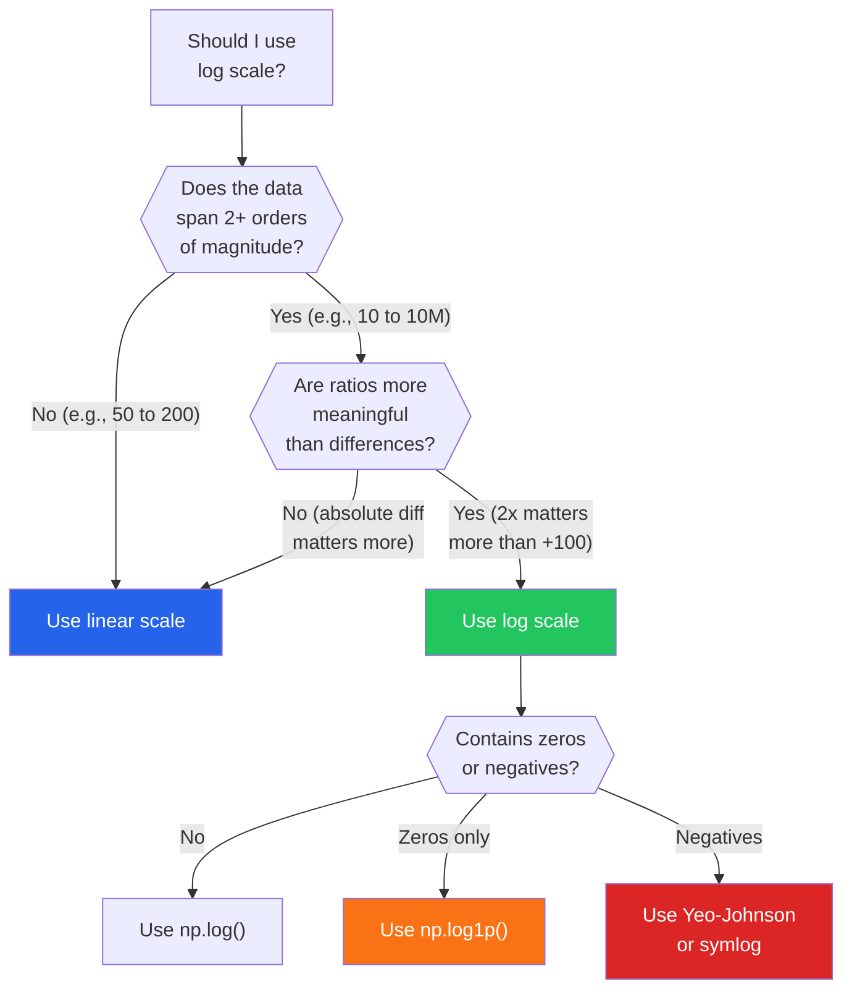
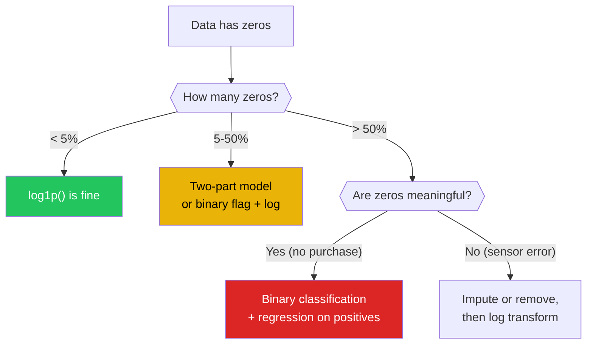
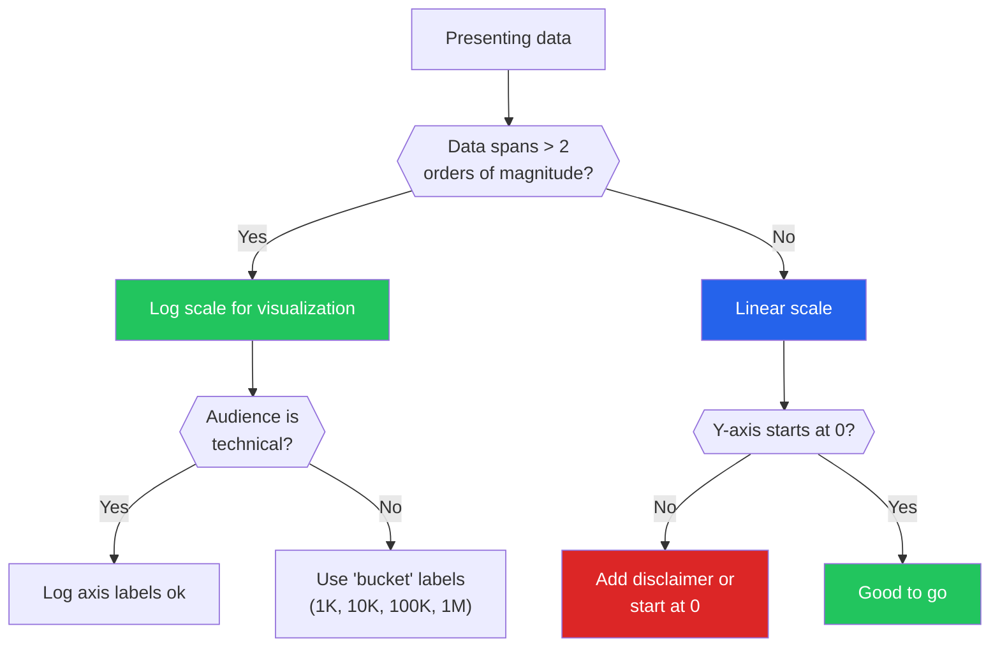

# Understanding Scale

Scale is one of the most underappreciated concepts in data analysis. When someone says "the average salary is $85,000" about a dataset with Jeff Bezos in it, they are making a scale mistake. When someone plots city populations on a linear axis and 95% of the data is squished into the bottom 10% of the chart, they are making a scale mistake. When someone uses the mean of response times instead of the median, they are making a scale mistake.

This page covers when and why to change scale (linear to log), how to handle the pathological cases (zero-inflated, heavy-tailed, multimodal), and the practical rules for choosing the right scale for your data.

---

## Linear vs Logarithmic Scale

```python
# linear_vs_log.py — When linear scale hides the story
import numpy as np
import matplotlib.pyplot as plt

np.random.seed(42)

# City populations: classic power-law distributed
populations = np.random.lognormal(mean=10, sigma=2.5, size=500)
populations = populations.astype(int)

print("=== CITY POPULATIONS ===")
print(f"Mean: {populations.mean():>15,.0f}")
print(f"Median: {np.median(populations):>15,.0f}")
print(f"Min: {populations.min():>15,.0f}")
print(f"Max: {populations.max():>15,.0f}")
print(f"Mean/Median ratio: {populations.mean() / np.median(populations):.1f}x")
print(f"Max/Min ratio: {populations.max() / populations.min():,.0f}x")

fig, axes = plt.subplots(1, 2, figsize=(14, 5))

# Linear scale: most cities are invisible
axes[0].hist(populations, bins=50, edgecolor='black', alpha=0.7)
axes[0].set_title('Linear Scale: 90% of cities crushed into first bin')
axes[0].set_xlabel('Population')
axes[0].set_ylabel('Count')

# Log scale: full distribution visible
axes[1].hist(np.log10(populations), bins=50, edgecolor='black',
             alpha=0.7, color='green')
axes[1].set_title('Log Scale: Full distribution visible')
axes[1].set_xlabel('Population (log10)')
axes[1].set_ylabel('Count')

# Add reference lines
for val, label in [(3, '1K'), (4, '10K'), (5, '100K'), (6, '1M')]:
    axes[1].axvline(val, color='red', alpha=0.3, linestyle='--')
    axes[1].text(val, axes[1].get_ylim()[1]*0.9, label, ha='center', color='red')

plt.tight_layout()
plt.savefig("linear_vs_log.png", dpi=150)
plt.show()
```

### The Decision Rule



---

## When to Log-Transform

```python
# when_to_log.py — Five clear signals that log scale is needed
import numpy as np
import pandas as pd
from scipy import stats

np.random.seed(42)

# Generate test datasets
datasets = {
    'Income (log-normal)': np.random.lognormal(10.5, 0.8, 5000),
    'Response time (exponential)': np.random.exponential(200, 5000),
    'Height (normal)': np.random.normal(170, 10, 5000),
    'Web traffic (power law)': np.random.pareto(1.5, 5000) * 100,
    'Temperature (symmetric)': np.random.normal(20, 5, 5000),
}

print("=== SHOULD YOU LOG-TRANSFORM? ===\n")
print(f"{'Dataset':>30} | {'Skewness':>8} | {'Mean/Med':>8} | "
      f"{'Max/Min':>10} | {'Log?':>5}")
print("-" * 80)

for name, data in datasets.items():
    data = np.abs(data) + 0.01  # Ensure positive for log
    skew = stats.skew(data)
    ratio_mean_med = data.mean() / np.median(data)
    ratio_max_min = data.max() / data.min()

    should_log = (
        skew > 1.0 and
        ratio_mean_med > 1.5 and
        ratio_max_min > 100
    )

    print(f"{name:>30} | {skew:>8.2f} | {ratio_mean_med:>8.2f} | "
          f"{ratio_max_min:>10.0f} | {'YES' if should_log else 'no':>5}")

print(f"\n--- Rules of Thumb ---")
rules = [
    ("Skewness > 1.0", "Right-skewed enough to distort means"),
    ("Mean/Median > 1.5", "Average is misleading"),
    ("Max/Min > 100", "Data spans multiple orders of magnitude"),
    ("All values positive", "Log is undefined for zero and negative"),
    ("Multiplicative process", "Growth rates, compounding, ratios"),
]
for rule, explanation in rules:
    print(f"  {rule:>25}: {explanation}")
```

---

## Zero-Inflated Data

The biggest practical problem with log transforms: `log(0) = -infinity`.

```python
# zero_inflated.py — Handling the zero problem
import numpy as np
import pandas as pd
from scipy import stats

np.random.seed(42)

# Common scenario: customer spending (many zeros = non-purchasers)
n = 5000
spending = np.zeros(n)
has_purchase = np.random.binomial(1, 0.3, n)  # 30% purchased
spending[has_purchase == 1] = np.random.lognormal(3, 1.5, has_purchase.sum())

print("=== ZERO-INFLATED DATA ===")
print(f"Total records: {n}")
print(f"Zeros: {(spending == 0).sum()} ({(spending == 0).mean():.1%})")
print(f"Non-zero mean: {spending[spending > 0].mean():.2f}")
print(f"Overall mean: {spending.mean():.2f}")
print(f"Overall median: {np.median(spending):.2f} (median is ZERO!)")

# Strategy 1: log1p (log of 1+x)
log1p_data = np.log1p(spending)
print(f"\n--- Strategy 1: log1p ---")
print(f"log1p(0) = {np.log1p(0):.1f} (not -inf!)")
print(f"Skewness after log1p: {stats.skew(log1p_data):.2f}")
print("Pros: Simple, handles zeros")
print("Cons: Distorts distribution near zero")

# Strategy 2: Two-part model
print(f"\n--- Strategy 2: Two-Part Model ---")
print(f"Part 1: P(purchase) = {has_purchase.mean():.2f} (logistic regression)")
print(f"Part 2: If purchase, amount ~ log-normal (linear regression on log)")
positive = spending[spending > 0]
print(f"Log of positive spending skewness: {stats.skew(np.log(positive)):.3f}")
print("This is the statistically correct approach")

# Strategy 3: Indicator variable + logged amount
print(f"\n--- Strategy 3: Binary flag + log amount ---")
df = pd.DataFrame({
    'spending': spending,
    'has_purchase': (spending > 0).astype(int),
    'log_spending': np.where(spending > 0, np.log(spending), 0),
})
print(df.describe().round(2))
print("Use both features in models: 'did they buy?' + 'how much?'")

# Strategy 4: Quantile/rank transform
print(f"\n--- Strategy 4: Rank Transform ---")
ranks = stats.rankdata(spending) / len(spending)
print(f"Rank transform skewness: {stats.skew(ranks):.3f}")
print("Maps any distribution to uniform [0, 1]")
print("Loses magnitude information but preserves order")
```



---

## Heavy Tails: Why Averages Lie

```python
# heavy_tails.py — When the mean is not just misleading, it is dangerous
import numpy as np
from scipy import stats

np.random.seed(42)

# Simulations showing instability of means for heavy-tailed data
def compare_mean_stability(dist_name, generator, n_samples=1000, n_reps=100):
    """Show how stable the sample mean is across repeated samples."""
    means = [generator(n_samples).mean() for _ in range(n_reps)]
    return {
        'distribution': dist_name,
        'true_theoretical': generator(100000).mean(),
        'sample_mean_mean': np.mean(means),
        'sample_mean_std': np.std(means),
        'cv': np.std(means) / np.mean(means) * 100,  # coefficient of variation
    }

results = [
    compare_mean_stability(
        "Normal (light-tailed)",
        lambda n: np.random.normal(100, 15, n)
    ),
    compare_mean_stability(
        "Log-Normal (heavy-tailed)",
        lambda n: np.random.lognormal(4.5, 1.0, n)
    ),
    compare_mean_stability(
        "Pareto (very heavy-tailed)",
        lambda n: np.random.pareto(2.5, n) * 100
    ),
]

print("=== MEAN STABILITY BY DISTRIBUTION ===")
print(f"\n{'Distribution':>30} | {'Pop Mean':>10} | {'Samp Mean':>10} | "
      f"{'Samp Std':>10} | {'CV%':>6}")
print("-" * 80)
for r in results:
    print(f"{r['distribution']:>30} | {r['true_theoretical']:>10.1f} | "
          f"{r['sample_mean_mean']:>10.1f} | {r['sample_mean_std']:>10.1f} | "
          f"{r['cv']:>6.1f}%")

print("\nCV% (coefficient of variation) measures how much the mean jumps around.")
print("Heavy-tailed distributions have UNSTABLE means.")
print("This is why one outlier can shift the mean by 50%.")

# Practical demonstration: response time monitoring
print(f"\n=== PRACTICAL EXAMPLE: Response Time SLAs ===")
# 95% of requests: 50-200ms (normal-ish)
# 5% of requests: 500-5000ms (heavy tail from retries, GC pauses)
normal_part = np.random.normal(100, 30, 950)
tail_part = np.random.exponential(1000, 50)
response_times = np.concatenate([normal_part.clip(10), tail_part])
np.random.shuffle(response_times)

print(f"Mean: {response_times.mean():.0f} ms (misleading!)")
print(f"Median: {np.median(response_times):.0f} ms (typical experience)")
print(f"P50: {np.percentile(response_times, 50):.0f} ms")
print(f"P90: {np.percentile(response_times, 90):.0f} ms")
print(f"P95: {np.percentile(response_times, 95):.0f} ms")
print(f"P99: {np.percentile(response_times, 99):.0f} ms")
print(f"\nThe mean says '149ms' but 5% of users wait > {np.percentile(response_times, 95):.0f}ms!")
print("Use PERCENTILES (p50, p95, p99) instead of means for latency data.")
```

### What to Report Instead of the Mean

| Data Type | Bad Metric | Good Metric | Why |
|-----------|-----------|-------------|-----|
| Response times | Mean | P50, P95, P99 | Tail latency matters for user experience |
| Income | Mean | Median, Gini coefficient | Billionaires skew the mean |
| File sizes | Mean | Median, total storage | A few huge files dominate the mean |
| Customer spend | Mean order value | Median + breakdown by segment | Bimodal spending patterns |
| Uptime | Mean uptime % | Number of incidents, MTTR | 99.9% uptime still means 8.76 hours of downtime |

---

## Scale Transforms for Different Data Types

```python
# scale_transforms.py — Choosing the right transform
import numpy as np
import pandas as pd
from scipy import stats
import seaborn as sns

# Load the tips dataset for practical examples
tips = sns.load_dataset('tips')

print("=== SCALE TRANSFORMS IN PRACTICE ===\n")

# Metric 1: Total bill (right-skewed continuous)
print("--- Total Bill (continuous, right-skewed) ---")
print(f"Raw skewness: {tips['total_bill'].skew():.2f}")
tips['log_bill'] = np.log1p(tips['total_bill'])
print(f"Log skewness: {tips['log_bill'].skew():.2f}")
tips['sqrt_bill'] = np.sqrt(tips['total_bill'])
print(f"Sqrt skewness: {tips['sqrt_bill'].skew():.2f}")
# Box-Cox
transformed, lam = stats.boxcox(tips['total_bill'])
print(f"Box-Cox (lambda={lam:.2f}) skewness: {stats.skew(transformed):.2f}")
print(f"Best transform: Box-Cox (auto-selects optimal lambda)\n")

# Metric 2: Party size (discrete, bounded)
print("--- Party Size (discrete, bounded 1-6) ---")
print(f"Skewness: {tips['size'].skew():.2f}")
print("Do NOT log-transform: discrete bounded data")
print("Treat as ordinal categorical or leave as-is\n")

# Metric 3: Tip percentage (derived, bounded-ish)
tips['tip_pct'] = tips['tip'] / tips['total_bill'] * 100
print("--- Tip Percentage (bounded ratio) ---")
print(f"Skewness: {tips['tip_pct'].skew():.2f}")
print(f"Range: [{tips['tip_pct'].min():.1f}%, {tips['tip_pct'].max():.1f}%]")
print("For percentage data, consider logit transform if bounded [0, 1]")
# Logit transform for proportions
tip_prop = tips['tip_pct'] / 100
tip_prop = tip_prop.clip(0.01, 0.99)  # Avoid log(0)
tips['logit_tip'] = np.log(tip_prop / (1 - tip_prop))
print(f"Logit skewness: {tips['logit_tip'].skew():.2f}\n")

# Summary of transform selection
print("=== TRANSFORM SELECTION MATRIX ===")
matrix = pd.DataFrame({
    'Data Type': ['Right-skewed positive', 'Right-skewed with zeros',
                  'Proportions/rates', 'Count data', 'Negative values',
                  'Already symmetric'],
    'Transform': ['log() or Box-Cox', 'log1p() or two-part',
                  'logit() or arcsine sqrt', 'sqrt() or Freeman-Tukey',
                  'Yeo-Johnson', 'None needed'],
    'Python Code': ['np.log(x) or stats.boxcox(x)', 'np.log1p(x)',
                    'np.log(x/(1-x))', 'np.sqrt(x)',
                    'stats.yeojohnson(x)', 'x'],
    'Reversible': ['exp()', 'expm1()', '1/(1+exp(-x))', 'x**2',
                   'inverse_yeojohnson()', 'N/A'],
})
print(matrix.to_string(index=False))
```

---

## Practical Scale Decisions

```python
# practical_scale.py — Real-world scale decision examples
import numpy as np

np.random.seed(42)

print("=== PRACTICAL SCALE DECISIONS ===\n")

scenarios = [
    {
        "scenario": "Dashboard showing company revenue by product",
        "data_range": "$1K to $50M",
        "correct": "Log scale y-axis or separate small/large product charts",
        "wrong": "Linear scale (small products invisible)",
        "reason": "Products span 5 orders of magnitude"
    },
    {
        "scenario": "Monitoring API response times",
        "data_range": "10ms to 30,000ms",
        "correct": "Report P50, P95, P99 separately. Log scale for histograms",
        "wrong": "Mean response time",
        "reason": "Mean hides the pain of the 99th percentile"
    },
    {
        "scenario": "Comparing team velocity in story points",
        "data_range": "20 to 45 points/sprint",
        "correct": "Linear scale, start y-axis at 0",
        "wrong": "Linear scale starting at 15 (makes small differences look huge)",
        "reason": "Narrow range; truncating axis exaggerates variation"
    },
    {
        "scenario": "Machine learning feature: user account age",
        "data_range": "1 day to 10 years",
        "correct": "Log transform as a feature",
        "wrong": "Raw days as feature (1 to 3650)",
        "reason": "Difference between day 1 and day 30 matters more than day 3000 vs 3030"
    },
    {
        "scenario": "Comparing COVID case counts across countries",
        "data_range": "0 to millions",
        "correct": "Per-capita rate (cases per 100K) on log scale",
        "wrong": "Raw counts on linear scale",
        "reason": "Raw counts confounded by population; log shows growth rates"
    },
]

for s in scenarios:
    print(f"Scenario: {s['scenario']}")
    print(f"  Data range: {s['data_range']}")
    print(f"  Correct: {s['correct']}")
    print(f"  Wrong: {s['wrong']}")
    print(f"  Reason: {s['reason']}\n")
```

---

## The Scale Checklist



::: tip The Newspaper Test
If your chart appeared in a newspaper and someone misinterpreted the scale, would it lead to a wrong conclusion? If yes, add explicit annotations: axis break markers, "Note: logarithmic scale" labels, or separate panels for different magnitude ranges.
:::

---

## Summary

| Concept | Key Takeaway |
|---------|-------------|
| Log vs linear | Use log when data spans 2+ orders of magnitude or ratios matter more than differences |
| Zero-inflated data | `log1p()` for few zeros; two-part model for many zeros |
| Heavy tails | Means are unstable and misleading; use percentiles (p50, p95, p99) |
| Averages lie | Mean/median divergence > 1.5x signals a skewed distribution |
| Transform selection | Match transform to data type: log for positive skew, logit for proportions |
| Scale in dashboards | Start y-axis at 0 unless there is a strong reason not to |

---

## What's Next

| Page | What You'll Learn |
|------|------------------|
| [Missing Data](/eda/missing-data) | MCAR/MAR/MNAR, imputation strategies |
| [Outlier Analysis](/eda/outlier-analysis) | When extreme values are errors vs insights |
| [Data Cleaning — Edge Cases](/eda/data-cleaning-edge-cases) | Floating point, NaN vs None, encoding |
