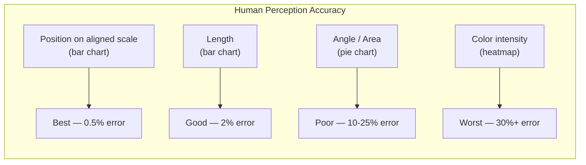
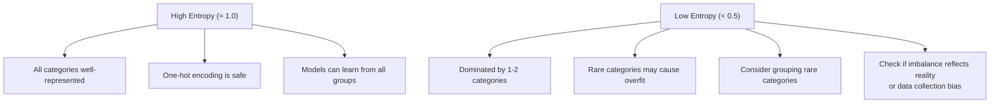
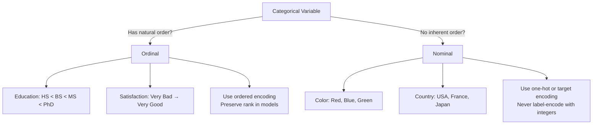

# Univariate Categorical Analysis

Categorical variables are everywhere — product types, customer segments, regions, status codes, error messages, survey responses. They look simple, but they hide traps that can wreck your models. A column with 5 clean categories and one with 10,000 typo-ridden free-text entries are both "categorical," but they demand completely different treatment.

This page covers every tool you need: value counts, frequency tables, bar plots, why pie charts lie, entropy as a measure of diversity, Pareto analysis for the vital few, and how to detect and handle category imbalance.

## The Dataset

We will use a synthetic e-commerce dataset with realistic categorical distributions.

```python
import numpy as np
import pandas as pd
import matplotlib.pyplot as plt
import seaborn as sns
from scipy import stats

np.random.seed(42)
n = 5000

# Product category: power-law distribution (few popular, many niche)
categories = [
    "Electronics", "Clothing", "Home & Garden", "Sports", "Books",
    "Toys", "Automotive", "Health", "Food", "Beauty",
    "Office", "Pet Supplies", "Music", "Software", "Crafts",
]
cat_probs = np.array([0.25, 0.18, 0.12, 0.10, 0.08, 0.06, 0.05, 0.04, 0.03,
                       0.025, 0.02, 0.015, 0.01, 0.008, 0.002])
cat_probs = cat_probs / cat_probs.sum()
product_category = np.random.choice(categories, size=n, p=cat_probs)

# Payment method: moderate imbalance
payment_methods = ["Credit Card", "Debit Card", "PayPal", "Apple Pay", "Crypto"]
pay_probs = [0.45, 0.25, 0.18, 0.10, 0.02]
payment = np.random.choice(payment_methods, size=n, p=pay_probs)

# Region: roughly balanced
regions = ["North America", "Europe", "Asia", "South America", "Africa", "Oceania"]
reg_probs = [0.30, 0.28, 0.22, 0.10, 0.05, 0.05]
region = np.random.choice(regions, size=n, p=reg_probs)

# Order status: heavily imbalanced
statuses = ["Delivered", "Shipped", "Processing", "Cancelled", "Returned", "Fraud"]
status_probs = [0.65, 0.15, 0.10, 0.05, 0.04, 0.01]
order_status = np.random.choice(statuses, size=n, p=status_probs)

# Satisfaction rating: ordinal
ratings = ["Very Dissatisfied", "Dissatisfied", "Neutral", "Satisfied", "Very Satisfied"]
rat_probs = [0.05, 0.10, 0.25, 0.35, 0.25]
satisfaction = np.random.choice(ratings, size=n, p=rat_probs)

df = pd.DataFrame({
    "product_category": product_category,
    "payment_method": payment,
    "region": region,
    "order_status": order_status,
    "satisfaction": satisfaction,
})

print(df.shape)
print(df.dtypes)
df.head()
```

## Value Counts: The Starting Point

Value counts are to categorical variables what `describe()` is to numerical ones. Always look at both absolute and relative frequencies.

```python
def detailed_value_counts(series, name="variable"):
    """Compute value counts with cumulative percentages."""
    vc = series.value_counts()
    result = pd.DataFrame({
        "count": vc,
        "pct": (vc / len(series) * 100).round(2),
        "cumulative_count": vc.cumsum(),
        "cumulative_pct": (vc.cumsum() / len(series) * 100).round(2),
    })
    print(f"\n{'='*60}")
    print(f"  Value Counts: {name}")
    print(f"  Unique values: {series.nunique()}")
    print(f"  Missing: {series.isna().sum()} ({series.isna().mean()*100:.1f}%)")
    print(f"  Mode: {series.mode().iloc[0]} ({vc.iloc[0]:,} / {vc.iloc[0]/len(series)*100:.1f}%)")
    print(f"{'='*60}")
    print(result.to_string())
    return result

for col in df.columns:
    detailed_value_counts(df[col], col)
```

## Bar Plots: The Right Way to Visualize Categories

Bar plots are the correct default for categorical data. Horizontal bars work better when category names are long.

```python
fig, axes = plt.subplots(2, 2, figsize=(16, 12))

# Vertical bar — good for few categories
vc = df["payment_method"].value_counts()
axes[0, 0].bar(vc.index, vc.values, color="steelblue", edgecolor="black")
axes[0, 0].set_title("Payment Method (Vertical Bar)", fontsize=13)
for i, (val, count) in enumerate(zip(vc.index, vc.values)):
    axes[0, 0].text(i, count + 20, f"{count:,}\n({count/n*100:.1f}%)",
                    ha="center", fontsize=9)

# Horizontal bar — better for many categories or long names
vc = df["product_category"].value_counts()
axes[0, 1].barh(vc.index[::-1], vc.values[::-1], color="steelblue", edgecolor="black")
axes[0, 1].set_title("Product Category (Horizontal Bar)", fontsize=13)
for i, (val, count) in enumerate(zip(vc.values[::-1], vc.index[::-1])):
    axes[0, 1].text(val + 10, i, f" {val:,}", va="center", fontsize=9)

# Ordered by frequency — always do this
vc = df["order_status"].value_counts()
colors = ["#2ecc71" if v > n*0.1 else "#e74c3c" if v < n*0.02 else "#f39c12" for v in vc.values]
axes[1, 0].bar(vc.index, vc.values, color=colors, edgecolor="black")
axes[1, 0].set_title("Order Status (Color-coded by frequency)", fontsize=13)
axes[1, 0].set_ylabel("Count")

# Percentage bar — often more informative than counts
vc_pct = df["region"].value_counts(normalize=True) * 100
axes[1, 1].barh(vc_pct.index[::-1], vc_pct.values[::-1], color="steelblue", edgecolor="black")
axes[1, 1].set_title("Region (Percentage)", fontsize=13)
axes[1, 1].set_xlabel("Percentage (%)")
for i, pct in enumerate(vc_pct.values[::-1]):
    axes[1, 1].text(pct + 0.2, i, f" {pct:.1f}%", va="center", fontsize=9)

plt.tight_layout()
plt.savefig("bar_plots.png", dpi=150, bbox_inches="tight")
plt.show()
```

## Why Pie Charts Are Almost Always Wrong

Pie charts are the most overused and least informative chart type. Human brains are terrible at comparing angles and areas.

```python
fig, axes = plt.subplots(1, 3, figsize=(18, 6))

# The same data shown three ways
vc = df["region"].value_counts()

# Pie chart — hard to compare similar-sized slices
axes[0].pie(vc.values, labels=vc.index, autopct="%1.1f%%", startangle=90)
axes[0].set_title("Pie Chart\n(Can you tell North America vs Europe?)", fontsize=12)

# Bar chart — easy to compare
axes[1].barh(vc.index[::-1], vc.values[::-1], color="steelblue", edgecolor="black")
axes[1].set_title("Bar Chart\n(Much easier to compare)", fontsize=12)

# Worst case: too many categories
vc_many = df["product_category"].value_counts()
axes[2].pie(vc_many.values, labels=vc_many.index, autopct="%1.1f%%",
            startangle=90, textprops={"fontsize": 7})
axes[2].set_title("Pie Chart with Many Categories\n(Completely unreadable)", fontsize=12)

plt.tight_layout()
plt.savefig("pie_vs_bar.png", dpi=150, bbox_inches="tight")
plt.show()
```

::: danger When are pie charts acceptable?
Almost never. The only defensible use case is showing that one category dominates (>60%) everything else. Even then, a stacked bar at 100% width is clearer. If you must use a pie chart, never use more than 5 slices and always add percentage labels.
:::

### The Perception Problem



## Frequency Tables and Cross-Tabulation

Beyond simple value counts, frequency tables let you compute marginal and joint distributions.

```python
# Frequency table with multiple aggregations
def frequency_table(series, name="variable"):
    """Build a detailed frequency table."""
    vc = series.value_counts().sort_index()
    total = len(series)

    table = pd.DataFrame({
        "count": vc,
        "relative_freq": vc / total,
        "percentage": (vc / total * 100).round(2),
        "cumulative_pct": (vc.cumsum() / total * 100).round(2),
    })

    # Add expected count under uniform distribution
    n_cats = series.nunique()
    table["expected_uniform"] = total / n_cats
    table["observed_vs_expected"] = (table["count"] / table["expected_uniform"]).round(3)

    return table

freq = frequency_table(df["product_category"], "product_category")
print(freq.sort_values("count", ascending=False).to_string())
```

## Entropy: Measuring Category Diversity

Entropy quantifies the "unpredictability" or "diversity" of a categorical distribution. Maximum entropy means all categories are equally likely. Minimum entropy (zero) means only one category exists.

```python
from scipy.stats import entropy as sp_entropy

def category_entropy(series, name="variable"):
    """Compute entropy and normalized entropy for a categorical variable."""
    vc = series.value_counts(normalize=True)
    n_cats = series.nunique()

    # Shannon entropy (base 2, in bits)
    h = sp_entropy(vc, base=2)

    # Maximum possible entropy (uniform distribution)
    h_max = np.log2(n_cats)

    # Normalized entropy (0 = single category, 1 = perfectly uniform)
    h_norm = h / h_max if h_max > 0 else 0

    print(f"\n--- Entropy Analysis: {name} ---")
    print(f"  Unique categories:    {n_cats}")
    print(f"  Shannon entropy:      {h:.4f} bits")
    print(f"  Maximum entropy:      {h_max:.4f} bits")
    print(f"  Normalized entropy:   {h_norm:.4f} (1.0 = perfectly balanced)")
    print(f"  Interpretation:       ", end="")
    if h_norm > 0.9:
        print("Very balanced — near-uniform distribution")
    elif h_norm > 0.7:
        print("Moderately balanced — some categories dominate")
    elif h_norm > 0.5:
        print("Imbalanced — few categories carry most of the data")
    else:
        print("Highly imbalanced — dominated by one or two categories")

    return {"entropy": h, "max_entropy": h_max, "normalized_entropy": h_norm}

# Compare entropy across all categorical columns
entropy_results = {}
for col in df.columns:
    entropy_results[col] = category_entropy(df[col], col)

# Visualize
ent_df = pd.DataFrame(entropy_results).T
fig, ax = plt.subplots(figsize=(10, 5))
bars = ax.barh(ent_df.index, ent_df["normalized_entropy"],
               color=["#e74c3c" if v < 0.7 else "#2ecc71" for v in ent_df["normalized_entropy"]],
               edgecolor="black")
ax.set_xlabel("Normalized Entropy (1.0 = perfectly balanced)")
ax.set_title("Category Balance by Variable", fontsize=14)
ax.set_xlim(0, 1.05)
for bar, val in zip(bars, ent_df["normalized_entropy"]):
    ax.text(val + 0.01, bar.get_y() + bar.get_height()/2, f"{val:.3f}",
            va="center", fontsize=10)
plt.tight_layout()
plt.savefig("entropy_comparison.png", dpi=150, bbox_inches="tight")
plt.show()
```

### Why Entropy Matters



## Pareto Analysis (The 80/20 Rule)

Pareto analysis tells you which categories carry most of the weight. In practice, you often find that 20% of categories account for 80% of observations.

```python
def pareto_chart(series, name="variable", figsize=(12, 6)):
    """Create a Pareto chart with cumulative line."""
    vc = series.value_counts()
    cumulative_pct = vc.cumsum() / vc.sum() * 100

    fig, ax1 = plt.subplots(figsize=figsize)

    # Bars
    bars = ax1.bar(range(len(vc)), vc.values, color="steelblue",
                   edgecolor="black", alpha=0.8)
    ax1.set_xticks(range(len(vc)))
    ax1.set_xticklabels(vc.index, rotation=45, ha="right")
    ax1.set_ylabel("Count", color="steelblue")
    ax1.tick_params(axis="y", labelcolor="steelblue")

    # Cumulative line
    ax2 = ax1.twinx()
    ax2.plot(range(len(vc)), cumulative_pct, color="crimson",
             marker="o", linewidth=2, markersize=6)
    ax2.set_ylabel("Cumulative %", color="crimson")
    ax2.tick_params(axis="y", labelcolor="crimson")
    ax2.set_ylim(0, 105)

    # 80% reference line
    ax2.axhline(y=80, color="gray", linestyle="--", alpha=0.7, label="80% line")

    # Find how many categories hit 80%
    n_80 = (cumulative_pct <= 80).sum() + 1
    ax1.axvspan(-0.5, n_80 - 0.5, alpha=0.1, color="crimson",
                label=f"Top {n_80} categories = ~80%")

    ax1.set_title(f"Pareto Chart: {name}\n"
                  f"Top {n_80} of {len(vc)} categories cover ~80% of data",
                  fontsize=14)
    ax1.legend(loc="upper left")
    plt.tight_layout()
    plt.savefig(f"pareto_{name}.png", dpi=150, bbox_inches="tight")
    plt.show()

    return n_80, len(vc)

n80, total = pareto_chart(df["product_category"], "Product Category")
print(f"\n80/20 Analysis: {n80} categories ({n80/total*100:.0f}%) cover ~80% of orders")
```

## Category Imbalance Detection

Imbalanced categories cause real problems in machine learning — minority classes get ignored, models optimize for the majority, and your precision/recall on rare classes tanks.

```python
def imbalance_report(series, name="variable"):
    """Detect and quantify category imbalance."""
    vc = series.value_counts()
    n_cats = series.nunique()
    expected = len(series) / n_cats

    # Imbalance ratio: majority count / minority count
    imbalance_ratio = vc.iloc[0] / vc.iloc[-1]

    # Chi-square goodness of fit (vs uniform)
    chi2, p_value = stats.chisquare(vc)

    # Gini impurity
    probs = vc / vc.sum()
    gini = 1 - (probs ** 2).sum()
    gini_max = 1 - 1/n_cats
    gini_normalized = gini / gini_max if gini_max > 0 else 0

    print(f"\n{'='*60}")
    print(f"  Imbalance Report: {name}")
    print(f"{'='*60}")
    print(f"  Categories:        {n_cats}")
    print(f"  Most common:       {vc.index[0]} ({vc.iloc[0]:,}, {vc.iloc[0]/len(series)*100:.1f}%)")
    print(f"  Least common:      {vc.index[-1]} ({vc.iloc[-1]:,}, {vc.iloc[-1]/len(series)*100:.1f}%)")
    print(f"  Imbalance ratio:   {imbalance_ratio:.1f}:1")
    print(f"  Gini impurity:     {gini:.4f} (normalized: {gini_normalized:.4f})")
    print(f"  Chi² vs uniform:   {chi2:.1f} (p={p_value:.2e})")

    # Flag severely underrepresented categories
    threshold = expected * 0.1  # less than 10% of expected
    rare = vc[vc < threshold]
    if len(rare) > 0:
        print(f"\n  WARNING: {len(rare)} categories have < 10% of expected count:")
        for cat, count in rare.items():
            print(f"    - {cat}: {count:,} (expected ~{expected:.0f})")

    return {
        "imbalance_ratio": imbalance_ratio,
        "gini": gini,
        "gini_normalized": gini_normalized,
    }

for col in df.columns:
    imbalance_report(df[col], col)
```

### Imbalance Severity Scale

| Imbalance Ratio | Severity | Impact on ML |
|----------------|----------|--------------|
| 1:1 to 3:1 | Mild | Usually fine without special treatment |
| 3:1 to 10:1 | Moderate | Use stratified sampling, consider class weights |
| 10:1 to 100:1 | Severe | SMOTE, cost-sensitive learning, specialized metrics |
| > 100:1 | Extreme | Anomaly detection framing may be better than classification |

## Handling Dirty Categories

Real-world categorical data is messy. The same category appears as "New York", "new york", "NY", "N.Y.", and "NewYork".

```python
# Simulate dirty data
dirty_categories = np.random.choice(
    ["Electronics", "electronics", "ELECTRONICS", "Electrnics",
     "Clothing", "clothing", "Clothng", "Clothes",
     "Home & Garden", "Home and Garden", "Home&Garden", "home garden"],
    size=500,
)
dirty_series = pd.Series(dirty_categories)

print("Before cleaning:")
print(dirty_series.value_counts())
print(f"Unique values: {dirty_series.nunique()}")

# Step 1: Normalize case and whitespace
cleaned = dirty_series.str.lower().str.strip()

# Step 2: Remove special characters
cleaned = cleaned.str.replace(r"[&+]", " and ", regex=True)
cleaned = cleaned.str.replace(r"\s+", " ", regex=True)

# Step 3: Fuzzy matching for typos
from difflib import get_close_matches

canonical = ["electronics", "clothing", "home and garden"]

def fuzzy_map(value, canonical_list, cutoff=0.7):
    matches = get_close_matches(value, canonical_list, n=1, cutoff=cutoff)
    return matches[0] if matches else value

cleaned = cleaned.apply(lambda x: fuzzy_map(x, canonical))

print("\nAfter cleaning:")
print(cleaned.value_counts())
print(f"Unique values: {cleaned.nunique()}")
```

## Complete Categorical Profile Function

```python
def categorical_profile(series, name="variable", top_n=15, figsize=(16, 10)):
    """Generate a complete categorical variable profile."""
    fig = plt.figure(figsize=figsize)

    vc = series.value_counts()
    vc_top = vc.head(top_n)
    pct = vc / len(series) * 100
    cumulative_pct = vc.cumsum() / len(series) * 100
    probs = vc / vc.sum()

    # Layout
    ax1 = fig.add_subplot(2, 2, 1)  # Bar plot
    ax2 = fig.add_subplot(2, 2, 2)  # Pareto
    ax3 = fig.add_subplot(2, 2, 3)  # Proportion with CI
    ax4 = fig.add_subplot(2, 2, 4)  # Stats text

    # 1. Horizontal bar
    ax1.barh(vc_top.index[::-1], vc_top.values[::-1],
             color="steelblue", edgecolor="black")
    ax1.set_title(f"Top {min(top_n, len(vc))} Categories", fontsize=12)
    ax1.set_xlabel("Count")

    # 2. Pareto (cumulative)
    ax2.bar(range(len(vc_top)), vc_top.values, color="steelblue",
            edgecolor="black", alpha=0.7)
    ax2_twin = ax2.twinx()
    ax2_twin.plot(range(len(vc_top)), cumulative_pct.head(top_n),
                  color="crimson", marker="o", linewidth=2)
    ax2_twin.axhline(80, color="gray", linestyle="--", alpha=0.5)
    ax2_twin.set_ylabel("Cumulative %")
    ax2.set_xticks(range(len(vc_top)))
    ax2.set_xticklabels(vc_top.index, rotation=45, ha="right", fontsize=8)
    ax2.set_title("Pareto (Cumulative %)", fontsize=12)

    # 3. Proportion with 95% confidence intervals
    n_total = len(series)
    for i, (cat, count) in enumerate(vc_top.items()):
        p = count / n_total
        se = np.sqrt(p * (1 - p) / n_total)
        ci_low = max(0, p - 1.96 * se)
        ci_high = min(1, p + 1.96 * se)
        ax3.barh(i, p, color="steelblue", edgecolor="black", alpha=0.7)
        ax3.errorbar(p, i, xerr=[[p - ci_low], [ci_high - p]],
                     fmt="none", color="black", capsize=4)
    ax3.set_yticks(range(len(vc_top)))
    ax3.set_yticklabels(vc_top.index)
    ax3.set_xlabel("Proportion (with 95% CI)")
    ax3.set_title("Proportions with Confidence Intervals", fontsize=12)

    # 4. Stats summary
    ax4.axis("off")
    h = sp_entropy(probs, base=2)
    h_max = np.log2(series.nunique())
    gini = 1 - (probs ** 2).sum()
    imb = vc.iloc[0] / vc.iloc[-1] if vc.iloc[-1] > 0 else float("inf")

    stats_text = (
        f"Total observations:   {len(series):,}\n"
        f"Unique categories:    {series.nunique()}\n"
        f"Missing values:       {series.isna().sum()}\n\n"
        f"Mode:                 {vc.index[0]}\n"
        f"Mode frequency:       {vc.iloc[0]:,} ({pct.iloc[0]:.1f}%)\n"
        f"Least common:         {vc.index[-1]}\n"
        f"Least common freq:    {vc.iloc[-1]:,} ({pct.iloc[-1]:.1f}%)\n\n"
        f"Imbalance ratio:      {imb:.1f}:1\n"
        f"Shannon entropy:      {h:.3f} bits\n"
        f"Normalized entropy:   {h/h_max:.3f}\n"
        f"Gini impurity:        {gini:.3f}"
    )
    ax4.text(0.05, 0.5, stats_text, transform=ax4.transAxes, fontsize=11,
             fontfamily="monospace", verticalalignment="center",
             bbox=dict(boxstyle="round", facecolor="lightyellow", alpha=0.8))
    ax4.set_title("Summary Statistics", fontsize=12)

    fig.suptitle(f"Categorical Profile: {name}", fontsize=16, fontweight="bold")
    plt.tight_layout()
    plt.savefig(f"cat_profile_{name}.png", dpi=150, bbox_inches="tight")
    plt.show()

for col in df.columns:
    categorical_profile(df[col], col)
```

## Ordinal vs. Nominal: It Matters



```python
# Ordinal encoding that preserves order
satisfaction_order = {
    "Very Dissatisfied": 1,
    "Dissatisfied": 2,
    "Neutral": 3,
    "Satisfied": 4,
    "Very Satisfied": 5,
}

df["satisfaction_ordinal"] = df["satisfaction"].map(satisfaction_order)

# Now you can meaningfully compute mean, median, etc.
print(f"Mean satisfaction: {df['satisfaction_ordinal'].mean():.2f}")
print(f"Median satisfaction: {df['satisfaction_ordinal'].median():.1f}")

# Distribution of ordinal variable
fig, ax = plt.subplots(figsize=(10, 5))
order = list(satisfaction_order.keys())
vc = df["satisfaction"].value_counts().reindex(order)
colors = plt.cm.RdYlGn(np.linspace(0.2, 0.8, len(order)))
ax.bar(order, vc.values, color=colors, edgecolor="black")
ax.set_title("Satisfaction Distribution (Ordered)", fontsize=14)
ax.set_ylabel("Count")
for i, (cat, count) in enumerate(zip(order, vc.values)):
    ax.text(i, count + 20, f"{count:,}\n({count/n*100:.1f}%)", ha="center", fontsize=9)
plt.tight_layout()
plt.savefig("ordinal_distribution.png", dpi=150, bbox_inches="tight")
plt.show()
```

## Rare Category Strategies

```python
def group_rare_categories(series, min_pct=2.0, other_label="Other"):
    """Group categories below a minimum percentage threshold."""
    vc = series.value_counts(normalize=True) * 100
    rare_cats = vc[vc < min_pct].index.tolist()

    grouped = series.copy()
    grouped[grouped.isin(rare_cats)] = other_label

    print(f"Grouped {len(rare_cats)} rare categories into '{other_label}':")
    for cat in rare_cats:
        print(f"  - {cat} ({vc[cat]:.2f}%)")
    print(f"\nBefore: {series.nunique()} categories")
    print(f"After:  {grouped.nunique()} categories")

    return grouped

grouped_category = group_rare_categories(df["product_category"], min_pct=3.0)
print("\nNew distribution:")
print(grouped_category.value_counts())
```

## Practical Checklist

Before moving on from univariate categorical analysis, verify the following for every categorical column:

1. **Cardinality**: How many unique values? Is it nominal, ordinal, or secretly high-cardinality?
2. **Frequency distribution**: Is it balanced, skewed, or dominated by one category?
3. **Rare categories**: Are there categories with very few observations? How will you handle them?
4. **Data quality**: Are there typos, inconsistent casing, or duplicate representations?
5. **Missing values**: Are they random or concentrated in certain categories?
6. **Entropy**: How diverse is the distribution? Is the imbalance expected or a data issue?
7. **Ordering**: If ordinal, have you encoded the order explicitly?

## Key Takeaways

- Always compute value counts with both absolute and cumulative percentages.
- Bar plots are the correct default visualization for categories. Pie charts fail at comparison.
- Use entropy to quantify category balance — a normalized entropy below 0.7 signals meaningful imbalance.
- Pareto analysis reveals the vital few categories that carry most of the data.
- Imbalance ratios above 10:1 require special treatment in ML pipelines (stratified splits, class weights, or resampling).
- Clean dirty categories before analysis: normalize case, trim whitespace, fix typos with fuzzy matching.
- Distinguish ordinal from nominal — encoding ordinal variables as unordered categories destroys information.
