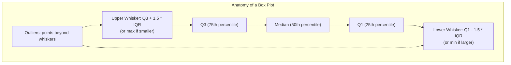
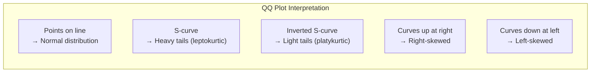
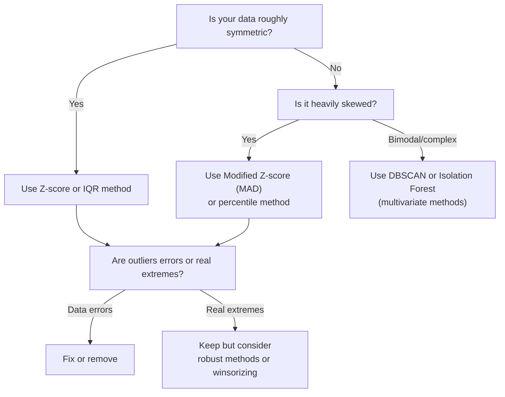
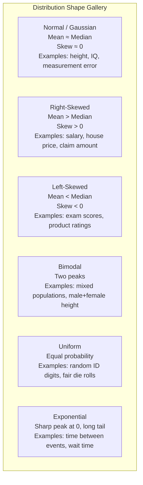

# Univariate Numerical Analysis

Every exploratory analysis starts with a single column. Before you build models, compute correlations, or engineer features, you need to understand each numerical variable in isolation. What is its center? How spread out is it? Is it symmetric or skewed? Are there outliers? Is it roughly normal, or does it follow some other distribution entirely?

This page covers every tool you need to answer those questions — histograms, kernel density estimates, box plots, violin plots, QQ plots, descriptive statistics, and formal normality tests — with real data and full Python code.

## The Dataset

We will use a synthetic but realistic dataset of 2,000 employee records throughout this page.

```python
import numpy as np
import pandas as pd
import matplotlib.pyplot as plt
import seaborn as sns
from scipy import stats

np.random.seed(42)
n = 2000

# Realistic salary distribution: right-skewed with a long tail
base_salary = np.random.lognormal(mean=11.0, sigma=0.4, size=n)
salary = np.clip(base_salary, 30_000, 500_000).astype(int)

# Age: roughly normal, bounded
age = np.random.normal(loc=38, scale=10, size=n).astype(int)
age = np.clip(age, 18, 70)

# Tenure in months: exponential (many short, few long)
tenure_months = np.random.exponential(scale=36, size=n).astype(int)
tenure_months = np.clip(tenure_months, 0, 360)

# Performance score: slightly left-skewed (most people score OK or above)
performance = np.random.beta(a=5, b=2, size=n) * 100

df = pd.DataFrame({
    "salary": salary,
    "age": age,
    "tenure_months": tenure_months,
    "performance_score": performance,
})

print(df.shape)
print(df.dtypes)
df.head(10)
```

## Descriptive Statistics: What Each Metric Means

Before any visualization, compute the summary statistics. But do not just glance at them — understand what each one tells you.

```python
desc = df.describe().T
desc["skewness"] = df.skew()
desc["kurtosis"] = df.kurtosis()  # excess kurtosis (normal = 0)
desc["iqr"] = desc["75%"] - desc["25%"]
desc["cv"] = desc["std"] / desc["mean"]  # coefficient of variation
print(desc.round(2))
```

### What Each Statistic Tells You

| Statistic | What It Measures | Watch For |
|-----------|-----------------|-----------|
| **Mean** | Arithmetic center of gravity | Sensitive to outliers. A single $10M salary drags the mean far right. |
| **Median** (50%) | The middle value when sorted | Robust to outliers. If median << mean, you have right skew. |
| **Std** | Average distance from the mean | Only meaningful for symmetric distributions. |
| **Min / Max** | Extremes | Check for impossible values (negative ages, 999999 placeholders). |
| **25% / 75%** | Quartile boundaries | The IQR (75% - 25%) captures the middle 50%. |
| **Skewness** | Asymmetry direction and degree | 0 = symmetric, >0 = right tail, <0 = left tail. |
| **Kurtosis** | Tail heaviness (excess) | 0 = normal tails, >0 = heavier tails, <0 = lighter tails. |
| **CV** | Relative variability (std/mean) | Allows comparing spread across different scales. |

::: warning Mean vs. Median
If the mean and median differ by more than 10-20%, your distribution is meaningfully skewed. In that case, the median is almost always a better measure of "typical." Report both, but lead with the median.
:::

```python
# Demonstrate the mean vs median gap on salary
print(f"Salary mean:   ${df['salary'].mean():,.0f}")
print(f"Salary median: ${df['salary'].median():,.0f}")
print(f"Gap:           {((df['salary'].mean() / df['salary'].median()) - 1) * 100:.1f}%")

# Compare with age (roughly symmetric)
print(f"\nAge mean:   {df['age'].mean():.1f}")
print(f"Age median: {df['age'].median():.1f}")
print(f"Gap:        {((df['age'].mean() / df['age'].median()) - 1) * 100:.1f}%")
```

## Histograms: The Foundation of Distribution Visualization

A histogram bins your data into intervals and counts how many observations fall into each bin. It is the single most important EDA plot.

### The Bin Size Problem

Bin size changes everything. Too few bins hide the shape. Too many bins create noise. There is no universally correct answer, but there are principled defaults.

```python
fig, axes = plt.subplots(2, 3, figsize=(18, 10))

# Different bin strategies for salary
bin_strategies = {
    "5 bins (too few)": 5,
    "Sturges": "sturges",
    "Scott": "scott",
    "Freedman-Diaconis": "fd",
    "50 bins": 50,
    "200 bins (too many)": 200,
}

for ax, (name, bins) in zip(axes.flat, bin_strategies.items()):
    ax.hist(df["salary"], bins=bins, edgecolor="black", alpha=0.7, color="steelblue")
    if isinstance(bins, int):
        actual_bins = bins
    else:
        actual_bins = len(np.histogram(df["salary"], bins=bins)[0])
    ax.set_title(f"{name} ({actual_bins} bins)", fontsize=12)
    ax.set_xlabel("Salary ($)")
    ax.set_ylabel("Count")

plt.suptitle("How Bin Count Changes Your Perception", fontsize=16, fontweight="bold")
plt.tight_layout()
plt.savefig("histogram_bins.png", dpi=150, bbox_inches="tight")
plt.show()
```

### Bin Selection Rules

| Rule | Formula | Best For |
|------|---------|----------|
| **Sturges** | `1 + log2(n)` | Small, roughly normal data. Underbins for large n. |
| **Scott** | `3.49 * std * n^(-1/3)` | Normal or near-normal data. |
| **Freedman-Diaconis** | `2 * IQR * n^(-1/3)` | Robust to outliers and skew. Best general default. |
| **Square root** | `sqrt(n)` | Simple, but no theoretical backing. |

```python
# Calculate each bin width explicitly for salary
n_obs = len(df["salary"])
salary_std = df["salary"].std()
salary_iqr = stats.iqr(df["salary"])

sturges_bins = int(np.ceil(1 + np.log2(n_obs)))
scott_width = 3.49 * salary_std * n_obs ** (-1/3)
fd_width = 2 * salary_iqr * n_obs ** (-1/3)
sqrt_bins = int(np.ceil(np.sqrt(n_obs)))

print(f"Sturges:           {sturges_bins} bins")
print(f"Scott:             width=${scott_width:,.0f} → ~{int((df['salary'].max() - df['salary'].min()) / scott_width)} bins")
print(f"Freedman-Diaconis: width=${fd_width:,.0f} → ~{int((df['salary'].max() - df['salary'].min()) / fd_width)} bins")
print(f"Square root:       {sqrt_bins} bins")
```

::: tip When in doubt, use Freedman-Diaconis
It uses the IQR instead of standard deviation, making it robust to outliers. For heavily skewed data (like salary), it usually gives better results than Scott or Sturges.
:::

## Kernel Density Estimation (KDE)

A histogram is a discrete approximation. KDE gives you a smooth, continuous estimate of the probability density function.

```python
fig, axes = plt.subplots(1, 3, figsize=(18, 5))

# KDE with different bandwidths
bandwidths = [0.5, 1.0, 3.0]
for ax, bw_adjust in zip(axes, bandwidths):
    ax.hist(df["salary"], bins="fd", density=True, alpha=0.3,
            color="steelblue", edgecolor="black", label="Histogram")
    sns.kdeplot(df["salary"], bw_adjust=bw_adjust, ax=ax,
                color="crimson", linewidth=2, label=f"KDE (bw_adjust={bw_adjust})")
    ax.set_title(f"Bandwidth adjust = {bw_adjust}", fontsize=12)
    ax.set_xlabel("Salary ($)")
    ax.legend()

plt.suptitle("KDE Bandwidth Controls Smoothness", fontsize=16, fontweight="bold")
plt.tight_layout()
plt.savefig("kde_bandwidth.png", dpi=150, bbox_inches="tight")
plt.show()
```

### When KDE Misleads

KDE can create phantom density where no data exists — particularly at boundaries and in gaps.

```python
# Demonstrate boundary artifact
bimodal = np.concatenate([
    np.random.normal(50, 5, 500),
    np.random.normal(80, 5, 500),
])

fig, ax = plt.subplots(figsize=(10, 5))
ax.hist(bimodal, bins=40, density=True, alpha=0.3, color="steelblue", edgecolor="black")
sns.kdeplot(bimodal, ax=ax, color="crimson", linewidth=2, label="Default KDE")
ax.axvspan(58, 72, alpha=0.1, color="red", label="Gap region — KDE invents density here")
ax.legend()
ax.set_title("KDE Can Hallucinate Density in Gaps", fontsize=14)
plt.tight_layout()
plt.savefig("kde_artifact.png", dpi=150, bbox_inches="tight")
plt.show()
```

## Box Plots and Violin Plots

Box plots summarize the five-number summary (min, Q1, median, Q3, max) plus outliers. Violin plots add a KDE on each side to show the full distribution shape.

```python
fig, axes = plt.subplots(1, 2, figsize=(16, 6))

# Box plots for all numeric columns
df_melted = df.melt(var_name="variable", value_name="value")
# Normalize for comparable display
from sklearn.preprocessing import StandardScaler
df_scaled = pd.DataFrame(
    StandardScaler().fit_transform(df),
    columns=df.columns,
)
df_scaled_melted = df_scaled.melt(var_name="variable", value_name="z_score")

# Box plot
sns.boxplot(data=df_scaled_melted, x="variable", y="z_score", ax=axes[0],
            palette="Set2", flierprops=dict(marker="o", markersize=3, alpha=0.5))
axes[0].set_title("Box Plots (Standardized)", fontsize=14)
axes[0].set_ylabel("Z-Score")

# Violin plot
sns.violinplot(data=df_scaled_melted, x="variable", y="z_score", ax=axes[1],
               palette="Set2", inner="quartile")
axes[1].set_title("Violin Plots (Standardized)", fontsize=14)
axes[1].set_ylabel("Z-Score")

plt.tight_layout()
plt.savefig("box_violin.png", dpi=150, bbox_inches="tight")
plt.show()
```

### Reading a Box Plot



### When to Use Which

| Plot | Best For | Limitations |
|------|----------|-------------|
| **Box plot** | Comparing distributions across groups, spotting outliers | Hides multimodality — two very different distributions can produce identical box plots |
| **Violin plot** | Seeing the full shape while comparing groups | Can be confusing for non-technical audiences |
| **Histogram** | Detailed shape of a single distribution | Hard to overlay many groups |
| **KDE** | Smooth comparison of 2-3 distributions | Bandwidth-sensitive, boundary artifacts |

```python
# Box plots HIDE multimodality — demonstration
bimodal_data = np.concatenate([np.random.normal(30, 5, 500), np.random.normal(70, 5, 500)])
unimodal_data = np.random.normal(50, 20, 1000)

fig, axes = plt.subplots(1, 2, figsize=(14, 5))

# Box plots look similar
box_df = pd.DataFrame({
    "Bimodal": bimodal_data,
    "Unimodal": unimodal_data,
})
sns.boxplot(data=box_df, ax=axes[0], palette=["coral", "steelblue"])
axes[0].set_title("Box Plots Look Similar", fontsize=14)

# But histograms reveal the truth
axes[1].hist(bimodal_data, bins=40, alpha=0.5, color="coral", label="Bimodal", density=True)
axes[1].hist(unimodal_data, bins=40, alpha=0.5, color="steelblue", label="Unimodal", density=True)
axes[1].set_title("Histograms Reveal the Difference", fontsize=14)
axes[1].legend()

plt.tight_layout()
plt.savefig("boxplot_trap.png", dpi=150, bbox_inches="tight")
plt.show()
```

## QQ Plots (Quantile-Quantile)

A QQ plot compares your data's quantiles against the theoretical quantiles of a reference distribution (usually normal). If the points fall on the diagonal line, your data matches that distribution.

```python
fig, axes = plt.subplots(2, 2, figsize=(14, 12))

columns = ["salary", "age", "tenure_months", "performance_score"]
titles = [
    "Salary (right-skewed — expect upward curve)",
    "Age (roughly normal — expect near-diagonal)",
    "Tenure (exponential — expect strong curve)",
    "Performance (left-skewed — expect downward curve at top)",
]

for ax, col, title in zip(axes.flat, columns, titles):
    stats.probplot(df[col], dist="norm", plot=ax)
    ax.set_title(title, fontsize=11)
    ax.get_lines()[0].set_markerfacecolor("steelblue")
    ax.get_lines()[0].set_alpha(0.5)
    ax.get_lines()[0].set_markersize(3)
    ax.get_lines()[1].set_color("crimson")

plt.suptitle("QQ Plots — How Departures from Normality Look", fontsize=16, fontweight="bold")
plt.tight_layout()
plt.savefig("qq_plots.png", dpi=150, bbox_inches="tight")
plt.show()
```

### Reading QQ Plot Patterns



## Normality Tests

Visual inspection is necessary but not sufficient. Formal tests give you a p-value.

```python
def test_normality(series, name):
    """Run multiple normality tests and return results."""
    results = {}

    # Shapiro-Wilk (best for n < 5000)
    if len(series) <= 5000:
        stat, p = stats.shapiro(series)
        results["Shapiro-Wilk"] = {"statistic": stat, "p_value": p}

    # D'Agostino-Pearson (requires n >= 20)
    stat, p = stats.normaltest(series)
    results["D'Agostino-Pearson"] = {"statistic": stat, "p_value": p}

    # Kolmogorov-Smirnov (against normal with sample mean/std)
    stat, p = stats.kstest(series, "norm", args=(series.mean(), series.std()))
    results["Kolmogorov-Smirnov"] = {"statistic": stat, "p_value": p}

    # Anderson-Darling
    result = stats.anderson(series, dist="norm")
    results["Anderson-Darling"] = {
        "statistic": result.statistic,
        "critical_values": dict(zip(result.significance_level, result.critical_values)),
    }

    # Jarque-Bera (tests skewness + kurtosis)
    stat, p = stats.jarque_bera(series)
    results["Jarque-Bera"] = {"statistic": stat, "p_value": p}

    return pd.DataFrame(results).T

for col in df.columns:
    print(f"\n{'='*60}")
    print(f"  Normality Tests: {col}")
    print(f"{'='*60}")
    result_df = test_normality(df[col], col)
    print(result_df.to_string())
```

### Which Normality Test to Use

| Test | Strengths | Weaknesses |
|------|-----------|------------|
| **Shapiro-Wilk** | Best overall power for n < 5000 | Computationally heavy for large n |
| **D'Agostino-Pearson** | Tests skewness and kurtosis specifically | Needs n >= 20 |
| **Kolmogorov-Smirnov** | Works for any reference distribution | Conservative; low power |
| **Anderson-Darling** | More sensitive to tails than KS | Only for specific distributions |
| **Jarque-Bera** | Fast, based on moments | Only detects skew/kurtosis deviations |

::: danger All normality tests reject at large n
With n > 1000, even trivial departures from normality become statistically significant. A p-value of 0.001 does not mean your data is "far from normal" — it means you have enough data to detect a tiny deviation. Always combine tests with QQ plots and common sense.
:::

## Outlier Detection Methods

```python
def detect_outliers(series, name="variable"):
    """Apply multiple outlier detection methods."""
    results = {}

    # 1. IQR method (Tukey's fences)
    q1, q3 = series.quantile([0.25, 0.75])
    iqr = q3 - q1
    lower_iqr = q1 - 1.5 * iqr
    upper_iqr = q3 + 1.5 * iqr
    iqr_outliers = ((series < lower_iqr) | (series > upper_iqr)).sum()
    results["IQR (1.5x)"] = {
        "lower_bound": lower_iqr,
        "upper_bound": upper_iqr,
        "n_outliers": iqr_outliers,
        "pct": f"{iqr_outliers / len(series) * 100:.1f}%",
    }

    # 2. Z-score method
    z_scores = np.abs(stats.zscore(series))
    z_outliers = (z_scores > 3).sum()
    results["Z-score (|z|>3)"] = {
        "lower_bound": series.mean() - 3 * series.std(),
        "upper_bound": series.mean() + 3 * series.std(),
        "n_outliers": z_outliers,
        "pct": f"{z_outliers / len(series) * 100:.1f}%",
    }

    # 3. Modified Z-score (using median absolute deviation)
    median = series.median()
    mad = np.median(np.abs(series - median))
    modified_z = 0.6745 * (series - median) / mad if mad != 0 else pd.Series([0] * len(series))
    mad_outliers = (np.abs(modified_z) > 3.5).sum()
    results["Modified Z (MAD)"] = {
        "lower_bound": median - 3.5 * mad / 0.6745,
        "upper_bound": median + 3.5 * mad / 0.6745,
        "n_outliers": mad_outliers,
        "pct": f"{mad_outliers / len(series) * 100:.1f}%",
    }

    # 4. Percentile method
    lower_p = series.quantile(0.01)
    upper_p = series.quantile(0.99)
    pct_outliers = ((series < lower_p) | (series > upper_p)).sum()
    results["Percentile (1-99%)"] = {
        "lower_bound": lower_p,
        "upper_bound": upper_p,
        "n_outliers": pct_outliers,
        "pct": f"{pct_outliers / len(series) * 100:.1f}%",
    }

    return pd.DataFrame(results).T

for col in df.columns:
    print(f"\n--- Outlier Detection: {col} ---")
    print(detect_outliers(df[col], col).to_string())
```

### Outlier Detection Decision Flow



## Putting It All Together: Full Univariate Profile

```python
def univariate_profile(series, name="variable", figsize=(18, 12)):
    """Generate a complete univariate profile for a numerical variable."""
    fig = plt.figure(figsize=figsize)

    # Layout: 2 rows, 3 columns
    ax1 = fig.add_subplot(2, 3, 1)  # Histogram + KDE
    ax2 = fig.add_subplot(2, 3, 2)  # Box plot
    ax3 = fig.add_subplot(2, 3, 3)  # QQ plot
    ax4 = fig.add_subplot(2, 3, 4)  # Violin plot
    ax5 = fig.add_subplot(2, 3, 5)  # ECDF
    ax6 = fig.add_subplot(2, 3, 6)  # Stats table

    # 1. Histogram + KDE
    ax1.hist(series, bins="fd", density=True, alpha=0.5, color="steelblue", edgecolor="black")
    sns.kdeplot(series, ax=ax1, color="crimson", linewidth=2)
    ax1.axvline(series.mean(), color="orange", linestyle="--", label=f"Mean: {series.mean():.1f}")
    ax1.axvline(series.median(), color="green", linestyle="-.", label=f"Median: {series.median():.1f}")
    ax1.legend(fontsize=9)
    ax1.set_title("Histogram + KDE")

    # 2. Box plot
    bp = ax2.boxplot(series, vert=True, patch_artist=True,
                     boxprops=dict(facecolor="steelblue", alpha=0.7),
                     flierprops=dict(marker="o", markersize=3, alpha=0.5))
    ax2.set_title("Box Plot")

    # 3. QQ plot
    stats.probplot(series, dist="norm", plot=ax3)
    ax3.set_title("QQ Plot (vs Normal)")

    # 4. Violin plot
    parts = ax4.violinplot(series, showmeans=True, showmedians=True)
    ax4.set_title("Violin Plot")

    # 5. ECDF
    sorted_data = np.sort(series)
    ecdf = np.arange(1, len(sorted_data) + 1) / len(sorted_data)
    ax5.plot(sorted_data, ecdf, color="steelblue", linewidth=1.5)
    ax5.set_xlabel(name)
    ax5.set_ylabel("Cumulative Probability")
    ax5.set_title("Empirical CDF")
    ax5.grid(True, alpha=0.3)

    # 6. Stats summary as text
    ax6.axis("off")
    stat_text = (
        f"Count:      {len(series):,}\n"
        f"Mean:       {series.mean():,.2f}\n"
        f"Median:     {series.median():,.2f}\n"
        f"Std Dev:    {series.std():,.2f}\n"
        f"Skewness:   {series.skew():.3f}\n"
        f"Kurtosis:   {series.kurtosis():.3f}\n"
        f"Min:        {series.min():,.2f}\n"
        f"Max:        {series.max():,.2f}\n"
        f"IQR:        {series.quantile(0.75) - series.quantile(0.25):,.2f}\n"
        f"CV:         {series.std() / series.mean():.3f}\n"
        f"Missing:    {series.isna().sum()}"
    )
    ax6.text(0.1, 0.5, stat_text, transform=ax6.transAxes, fontsize=12,
             fontfamily="monospace", verticalalignment="center",
             bbox=dict(boxstyle="round", facecolor="lightyellow", alpha=0.8))
    ax6.set_title("Summary Statistics")

    fig.suptitle(f"Univariate Profile: {name}", fontsize=16, fontweight="bold")
    plt.tight_layout()
    plt.savefig(f"profile_{name}.png", dpi=150, bbox_inches="tight")
    plt.show()

    # Normality test summary
    _, shapiro_p = stats.shapiro(series[:5000])
    _, dagostino_p = stats.normaltest(series)
    print(f"\nNormality Tests for {name}:")
    print(f"  Shapiro-Wilk p-value:      {shapiro_p:.6f}")
    print(f"  D'Agostino-Pearson p-value: {dagostino_p:.6f}")

# Run for each column
for col in df.columns:
    univariate_profile(df[col], col)
```

## Common Distribution Shapes and What They Mean



```python
# Generate each distribution shape for visual reference
fig, axes = plt.subplots(2, 3, figsize=(18, 10))
distributions = {
    "Normal": np.random.normal(50, 10, 5000),
    "Right-Skewed": np.random.lognormal(3.5, 0.5, 5000),
    "Left-Skewed": 100 - np.random.lognormal(3.0, 0.5, 5000),
    "Bimodal": np.concatenate([np.random.normal(30, 5, 2500), np.random.normal(70, 5, 2500)]),
    "Uniform": np.random.uniform(0, 100, 5000),
    "Exponential": np.random.exponential(20, 5000),
}

for ax, (name, data) in zip(axes.flat, distributions.items()):
    ax.hist(data, bins=50, density=True, alpha=0.5, color="steelblue", edgecolor="black")
    sns.kdeplot(data, ax=ax, color="crimson", linewidth=2)
    ax.set_title(f"{name}\nskew={pd.Series(data).skew():.2f}, kurt={pd.Series(data).kurtosis():.2f}",
                 fontsize=11)

plt.suptitle("Common Distribution Shapes", fontsize=16, fontweight="bold")
plt.tight_layout()
plt.savefig("distribution_shapes.png", dpi=150, bbox_inches="tight")
plt.show()
```

## Practical Checklist

Before you move on from univariate numerical analysis, make sure you can answer these questions for every numerical column:

1. **Center**: What is the typical value? Is mean or median more appropriate?
2. **Spread**: How variable is it? Is the spread large relative to the center (high CV)?
3. **Shape**: Is it symmetric, skewed, bimodal, or uniform?
4. **Outliers**: Are there extreme values? Are they data errors or genuine?
5. **Normality**: Does it approximate normal? Does it matter for your downstream analysis?
6. **Bounds**: Are there impossible values (negative counts, ages over 200)?
7. **Missing**: How many values are missing? Is missingness random or systematic?

::: tip Rule of thumb for transformations
If skewness > 1 (or < -1), consider a log or Box-Cox transform before modeling. If kurtosis > 3 (excess > 0), your data has heavier tails than normal — robust methods or outlier-aware models may be needed.
:::

## Key Takeaways

- Always start with `describe()` extended with skewness, kurtosis, IQR, and coefficient of variation.
- Use Freedman-Diaconis bins as your histogram default. Manually try 2-3 bin counts to confirm.
- Overlay KDE on histograms for smooth density estimation, but watch for boundary and gap artifacts.
- QQ plots reveal *how* your data departs from normality better than any hypothesis test.
- Formal normality tests are useful for small samples but over-reject at large n. Use them alongside visual evidence.
- Box plots are excellent for comparison but dangerously hide multimodality. Pair with violin plots or histograms.
- Outlier detection method should match your distribution shape: IQR/z-score for symmetric data, MAD for skewed data.
