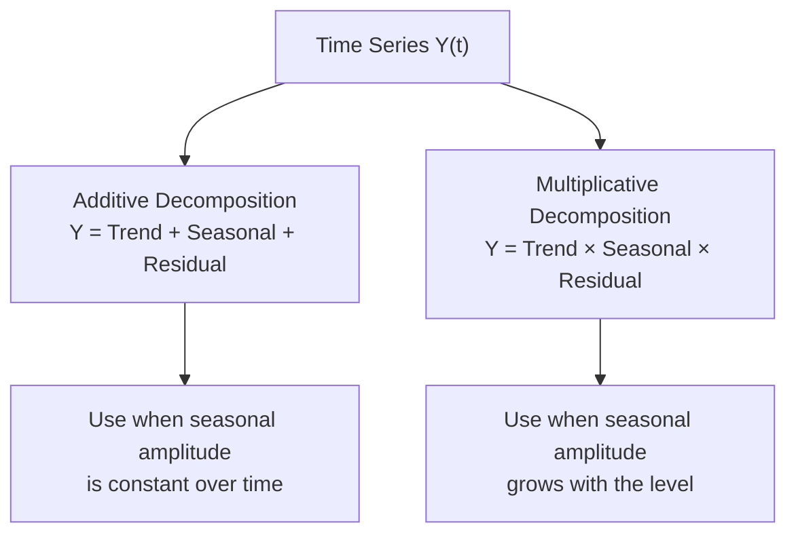
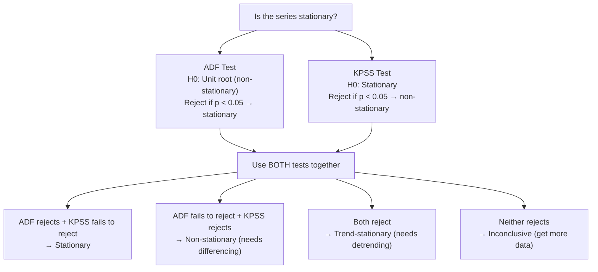
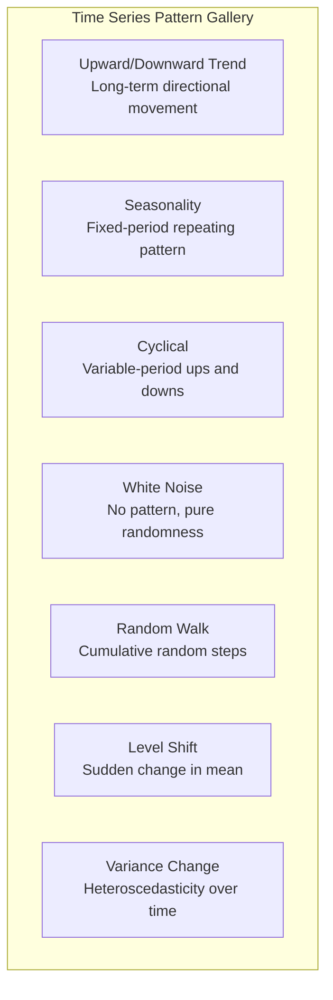

# Univariate Temporal Analysis

Time series data is different from every other kind of data because **order matters**. Shuffling rows destroys information. Observations are not independent — today's value depends on yesterday's. This dependency is simultaneously the greatest challenge and the greatest opportunity in time series analysis.

Before modeling, you need to answer: Is there a trend? Is there seasonality? Is the series stationary? Where are the change points? This page gives you the tools to answer all of those questions with real data and rigorous methods.

## The Dataset

We will generate three years of daily website traffic data with trend, seasonality, and anomalies.

```python
import numpy as np
import pandas as pd
import matplotlib.pyplot as plt
import seaborn as sns
from scipy import stats
from datetime import datetime, timedelta

np.random.seed(42)

# 3 years of daily data
dates = pd.date_range(start="2023-01-01", end="2025-12-31", freq="D")
n = len(dates)

# Components
t = np.arange(n)

# 1. Linear trend (growing site)
trend = 5000 + 3.5 * t

# 2. Yearly seasonality (higher in Q4 for e-commerce)
yearly = 1500 * np.sin(2 * np.pi * t / 365.25 + np.pi / 4)

# 3. Weekly seasonality (lower on weekends)
day_of_week = pd.Series(dates).dt.dayofweek
weekly = np.where(day_of_week >= 5, -800, 400)

# 4. Noise
noise = np.random.normal(0, 500, n)

# 5. Change point: marketing campaign bump at day 600
campaign = np.where(t > 600, 2000, 0)

# 6. A few anomalies
anomalies = np.zeros(n)
anomaly_idx = [100, 450, 800, 950]
for idx in anomaly_idx:
    anomalies[idx] = np.random.choice([-5000, 8000])

traffic = trend + yearly + weekly + noise + campaign + anomalies
traffic = np.maximum(traffic, 100).astype(int)

df = pd.DataFrame({"date": dates, "traffic": traffic})
df = df.set_index("date")

print(f"Shape: {df.shape}")
print(f"Date range: {df.index.min()} to {df.index.max()}")
print(df.describe())
```

## Visualizing the Raw Series

Always start by plotting the full series. Look for obvious trends, seasonal patterns, level shifts, and anomalies.

```python
fig, axes = plt.subplots(3, 1, figsize=(18, 12), sharex=True)

# Full series
axes[0].plot(df.index, df["traffic"], linewidth=0.5, color="steelblue")
axes[0].set_title("Daily Website Traffic (3 Years)", fontsize=14)
axes[0].set_ylabel("Visitors")

# Rolling mean and std
window = 30
rolling_mean = df["traffic"].rolling(window=window, center=True).mean()
rolling_std = df["traffic"].rolling(window=window, center=True).std()

axes[1].plot(df.index, rolling_mean, color="crimson", linewidth=2, label=f"{window}-day Rolling Mean")
axes[1].fill_between(df.index,
                      rolling_mean - 2 * rolling_std,
                      rolling_mean + 2 * rolling_std,
                      alpha=0.2, color="crimson", label="±2 Std Dev")
axes[1].set_title("Rolling Statistics", fontsize=14)
axes[1].set_ylabel("Visitors")
axes[1].legend()

# Month-over-month change
monthly = df["traffic"].resample("M").mean()
mom_change = monthly.pct_change() * 100
axes[2].bar(mom_change.index, mom_change.values,
            color=["green" if v >= 0 else "red" for v in mom_change.values],
            width=25)
axes[2].set_title("Month-over-Month Change (%)", fontsize=14)
axes[2].set_ylabel("% Change")
axes[2].axhline(0, color="black", linewidth=0.5)

plt.tight_layout()
plt.savefig("raw_series.png", dpi=150, bbox_inches="tight")
plt.show()
```

## Trend Analysis

A trend is a long-term increase or decrease in the level of the series. There are multiple ways to extract it.

```python
from numpy.polynomial import polynomial as P

fig, axes = plt.subplots(2, 2, figsize=(16, 10))

# 1. Linear regression trend
slope, intercept, r_value, p_value, std_err = stats.linregress(t, df["traffic"])
linear_trend = intercept + slope * t
axes[0, 0].plot(df.index, df["traffic"], alpha=0.3, linewidth=0.5, color="steelblue")
axes[0, 0].plot(df.index, linear_trend, color="crimson", linewidth=2,
                label=f"Linear: {slope:.2f}/day, R²={r_value**2:.3f}")
axes[0, 0].set_title("Linear Trend", fontsize=12)
axes[0, 0].legend()

# 2. Polynomial trend
for degree in [2, 3]:
    coeffs = np.polyfit(t, df["traffic"], degree)
    poly_trend = np.polyval(coeffs, t)
    axes[0, 1].plot(df.index, poly_trend, linewidth=2, label=f"Degree {degree}")
axes[0, 1].plot(df.index, df["traffic"], alpha=0.3, linewidth=0.5, color="steelblue")
axes[0, 1].set_title("Polynomial Trends", fontsize=12)
axes[0, 1].legend()

# 3. Moving average trend
for w in [7, 30, 90]:
    ma = df["traffic"].rolling(window=w, center=True).mean()
    axes[1, 0].plot(df.index, ma, linewidth=2, label=f"{w}-day MA")
axes[1, 0].plot(df.index, df["traffic"], alpha=0.2, linewidth=0.5, color="gray")
axes[1, 0].set_title("Moving Average Trends", fontsize=12)
axes[1, 0].legend()

# 4. LOWESS (locally weighted scatterplot smoothing)
from statsmodels.nonparametric.smoothers_lowess import lowess
smoothed = lowess(df["traffic"], t, frac=0.1, return_sorted=True)
axes[1, 1].plot(df.index, df["traffic"], alpha=0.3, linewidth=0.5, color="steelblue")
axes[1, 1].plot(df.index, smoothed[:, 1], color="crimson", linewidth=2, label="LOWESS (frac=0.1)")
axes[1, 1].set_title("LOWESS Trend", fontsize=12)
axes[1, 1].legend()

plt.suptitle("Trend Extraction Methods", fontsize=16, fontweight="bold")
plt.tight_layout()
plt.savefig("trend_methods.png", dpi=150, bbox_inches="tight")
plt.show()
```

## Seasonality Detection

Seasonality is a repeating pattern with a known period (daily, weekly, yearly). Multiple seasonal patterns can coexist.

```python
fig, axes = plt.subplots(2, 2, figsize=(16, 10))

# 1. Day-of-week pattern
dow = df.copy()
dow["dayofweek"] = dow.index.dayofweek
dow_avg = dow.groupby("dayofweek")["traffic"].agg(["mean", "std"])
day_names = ["Mon", "Tue", "Wed", "Thu", "Fri", "Sat", "Sun"]
axes[0, 0].bar(range(7), dow_avg["mean"], yerr=dow_avg["std"],
               color="steelblue", edgecolor="black", capsize=4)
axes[0, 0].set_xticks(range(7))
axes[0, 0].set_xticklabels(day_names)
axes[0, 0].set_title("Day-of-Week Pattern", fontsize=12)
axes[0, 0].set_ylabel("Mean Traffic")

# 2. Month-of-year pattern
moy = df.copy()
moy["month"] = moy.index.month
moy_avg = moy.groupby("month")["traffic"].agg(["mean", "std"])
axes[0, 1].bar(range(1, 13), moy_avg["mean"], yerr=moy_avg["std"],
               color="steelblue", edgecolor="black", capsize=4)
axes[0, 1].set_xticks(range(1, 13))
axes[0, 1].set_xticklabels(["Jan", "Feb", "Mar", "Apr", "May", "Jun",
                              "Jul", "Aug", "Sep", "Oct", "Nov", "Dec"])
axes[0, 1].set_title("Month-of-Year Pattern", fontsize=12)

# 3. Periodogram (frequency domain)
from scipy.signal import periodogram
freqs, power = periodogram(df["traffic"].values, fs=1.0)
axes[1, 0].semilogy(1/freqs[1:50], power[1:50], color="steelblue")
axes[1, 0].axvline(7, color="crimson", linestyle="--", label="7 days (weekly)")
axes[1, 0].axvline(365.25, color="orange", linestyle="--", label="365.25 days (yearly)")
axes[1, 0].set_xlabel("Period (days)")
axes[1, 0].set_ylabel("Power (log scale)")
axes[1, 0].set_title("Periodogram", fontsize=12)
axes[1, 0].legend()

# 4. Seasonal subseries plot
monthly_data = df.copy()
monthly_data["year"] = monthly_data.index.year
monthly_data["month"] = monthly_data.index.month
monthly_means = monthly_data.groupby(["year", "month"])["traffic"].mean().unstack(level=0)
monthly_means.plot(ax=axes[1, 1], marker="o", markersize=3)
axes[1, 1].set_title("Seasonal Subseries (Year Overlay)", fontsize=12)
axes[1, 1].set_xlabel("Month")
axes[1, 1].set_ylabel("Mean Daily Traffic")

plt.suptitle("Seasonality Detection", fontsize=16, fontweight="bold")
plt.tight_layout()
plt.savefig("seasonality.png", dpi=150, bbox_inches="tight")
plt.show()
```

## Time Series Decomposition

Decomposition separates a series into trend, seasonal, and residual components. There are two major approaches.



```python
from statsmodels.tsa.seasonal import seasonal_decompose, STL

fig, axes = plt.subplots(4, 2, figsize=(18, 16))

# Additive decomposition
result_add = seasonal_decompose(df["traffic"], model="additive", period=365)
result_add.observed.plot(ax=axes[0, 0], title="Observed", color="steelblue")
result_add.trend.plot(ax=axes[1, 0], title="Trend (Additive)", color="crimson")
result_add.seasonal.plot(ax=axes[2, 0], title="Seasonal (Additive)", color="green")
result_add.resid.plot(ax=axes[3, 0], title="Residual (Additive)", color="gray")

# STL decomposition (Seasonal-Trend using LOESS) — more robust
stl = STL(df["traffic"], period=7, seasonal=13, trend=365)
result_stl = stl.fit()
result_stl.observed.plot(ax=axes[0, 1], title="Observed", color="steelblue")
result_stl.trend.plot(ax=axes[1, 1], title="Trend (STL)", color="crimson")
result_stl.seasonal.plot(ax=axes[2, 1], title="Seasonal (STL, period=7)", color="green")
result_stl.resid.plot(ax=axes[3, 1], title="Residual (STL)", color="gray")

axes[0, 0].set_ylabel("")
axes[0, 1].set_ylabel("")
plt.suptitle("Classical vs STL Decomposition", fontsize=16, fontweight="bold")
plt.tight_layout()
plt.savefig("decomposition.png", dpi=150, bbox_inches="tight")
plt.show()

# Strength of trend and seasonality
def decomposition_strength(result):
    """Compute strength of trend and seasonality (Wang et al., 2006)."""
    var_resid = np.nanvar(result.resid)
    var_trend_resid = np.nanvar(result.resid + result.trend - np.nanmean(result.trend))
    var_season_resid = np.nanvar(result.resid + result.seasonal)

    f_trend = max(0, 1 - var_resid / var_trend_resid)
    f_season = max(0, 1 - var_resid / var_season_resid)

    return f_trend, f_season

ft, fs = decomposition_strength(result_stl)
print(f"Trend strength:      {ft:.3f} (1.0 = pure trend)")
print(f"Seasonality strength: {fs:.3f} (1.0 = pure seasonality)")
```

## Stationarity Tests

A stationary series has constant mean and variance over time. Most time series models require stationarity — or at least know what kind of non-stationarity they are dealing with.



```python
from statsmodels.tsa.stattools import adfuller, kpss

def stationarity_tests(series, name="series"):
    """Run ADF and KPSS stationarity tests."""
    print(f"\n{'='*60}")
    print(f"  Stationarity Tests: {name}")
    print(f"{'='*60}")

    # ADF Test
    adf_result = adfuller(series.dropna(), autolag="AIC")
    print(f"\n  Augmented Dickey-Fuller Test:")
    print(f"    Test Statistic:  {adf_result[0]:.4f}")
    print(f"    p-value:         {adf_result[1]:.6f}")
    print(f"    Lags used:       {adf_result[2]}")
    print(f"    Observations:    {adf_result[3]}")
    for key, value in adf_result[4].items():
        print(f"    Critical ({key}):  {value:.4f}")
    adf_stationary = adf_result[1] < 0.05

    # KPSS Test
    kpss_result = kpss(series.dropna(), regression="ct", nlags="auto")
    print(f"\n  KPSS Test (trend):")
    print(f"    Test Statistic:  {kpss_result[0]:.4f}")
    print(f"    p-value:         {kpss_result[1]:.4f}")
    print(f"    Lags used:       {kpss_result[2]}")
    for key, value in kpss_result[3].items():
        print(f"    Critical ({key}):  {value:.4f}")
    kpss_stationary = kpss_result[1] > 0.05

    # Combined interpretation
    print(f"\n  Combined Result:")
    if adf_stationary and kpss_stationary:
        print(f"    → STATIONARY (ADF rejects unit root, KPSS fails to reject stationarity)")
    elif not adf_stationary and not kpss_stationary:
        print(f"    → NON-STATIONARY (both tests agree: needs differencing)")
    elif adf_stationary and not kpss_stationary:
        print(f"    → TREND-STATIONARY (stationary around a deterministic trend)")
    else:
        print(f"    → INCONCLUSIVE (conflicting results)")

    return adf_stationary, kpss_stationary

# Test original series
stationarity_tests(df["traffic"], "Raw Traffic")

# Test differenced series
df["traffic_diff"] = df["traffic"].diff()
stationarity_tests(df["traffic_diff"].dropna(), "First Difference")

# Test seasonally differenced
df["traffic_seasonal_diff"] = df["traffic"].diff(7)
stationarity_tests(df["traffic_seasonal_diff"].dropna(), "Seasonal Difference (lag=7)")
```

## ACF and PACF

Autocorrelation Function (ACF) and Partial Autocorrelation Function (PACF) reveal the memory structure of your series.

```python
from statsmodels.graphics.tsaplots import plot_acf, plot_pacf
from statsmodels.tsa.stattools import acf, pacf

fig, axes = plt.subplots(3, 2, figsize=(16, 14))

# ACF of raw series
plot_acf(df["traffic"].dropna(), lags=60, ax=axes[0, 0],
         title="ACF: Raw Traffic")

# PACF of raw series
plot_pacf(df["traffic"].dropna(), lags=60, ax=axes[0, 1],
          title="PACF: Raw Traffic", method="ywm")

# ACF of first differenced
plot_acf(df["traffic_diff"].dropna(), lags=60, ax=axes[1, 0],
         title="ACF: First Difference")

# PACF of first differenced
plot_pacf(df["traffic_diff"].dropna(), lags=60, ax=axes[1, 1],
          title="PACF: First Difference", method="ywm")

# ACF of seasonal differenced
plot_acf(df["traffic_seasonal_diff"].dropna(), lags=60, ax=axes[2, 0],
         title="ACF: Seasonal Difference (lag=7)")

# PACF of seasonal differenced
plot_pacf(df["traffic_seasonal_diff"].dropna(), lags=60, ax=axes[2, 1],
          title="PACF: Seasonal Difference (lag=7)", method="ywm")

plt.suptitle("ACF / PACF Analysis", fontsize=16, fontweight="bold")
plt.tight_layout()
plt.savefig("acf_pacf.png", dpi=150, bbox_inches="tight")
plt.show()
```

### Reading ACF/PACF Patterns

| ACF Pattern | PACF Pattern | Suggested Model |
|-------------|--------------|-----------------|
| Exponential decay | Sharp cutoff at lag p | AR(p) |
| Sharp cutoff at lag q | Exponential decay | MA(q) |
| Exponential decay | Exponential decay | ARMA(p,q) |
| Slow decay | Significant at lag 1 | Needs differencing (ARIMA) |
| Spikes at seasonal lags (7, 14, 21...) | Spikes at seasonal lags | Seasonal component needed |

## Change Point Detection

Change points are moments where the statistical properties of the series shift abruptly — a new mean level, a different variance, or a changed trend slope.

```python
# Method 1: CUSUM (Cumulative Sum)
def cusum_detection(series, threshold=5.0):
    """Detect change points using CUSUM algorithm."""
    mean_val = series.mean()
    std_val = series.std()
    normalized = (series - mean_val) / std_val

    cusum_pos = np.zeros(len(series))
    cusum_neg = np.zeros(len(series))
    change_points = []

    for i in range(1, len(series)):
        cusum_pos[i] = max(0, cusum_pos[i-1] + normalized.iloc[i] - 0.5)
        cusum_neg[i] = max(0, cusum_neg[i-1] - normalized.iloc[i] - 0.5)

        if cusum_pos[i] > threshold or cusum_neg[i] > threshold:
            change_points.append(series.index[i])
            cusum_pos[i] = 0
            cusum_neg[i] = 0

    return change_points, cusum_pos, cusum_neg

cps, cusum_p, cusum_n = cusum_detection(df["traffic"])
print(f"CUSUM detected {len(cps)} change points:")
for cp in cps[:10]:
    print(f"  {cp}")

# Method 2: Pettitt test (rank-based)
def pettitt_test(series):
    """Pettitt test for a single change point."""
    n = len(series)
    values = series.values
    U = np.zeros(n)

    for t in range(n):
        for i in range(n):
            U[t] += np.sign(values[t] - values[i])
        if t > 0:
            U[t] = U[t-1] + U[t]

    K = np.max(np.abs(U))
    tau = np.argmax(np.abs(U))
    p_value = 2 * np.exp(-6 * K**2 / (n**3 + n**2))

    return tau, K, min(p_value, 1.0)

# Use monthly data for Pettitt (too slow for daily)
monthly = df["traffic"].resample("M").mean()
tau, K, p_val = pettitt_test(monthly)
print(f"\nPettitt test: change point at index {tau} ({monthly.index[tau].strftime('%Y-%m')})")
print(f"  K statistic: {K:.0f}, p-value: {p_val:.6f}")

# Method 3: Rolling window comparison
def rolling_change_detection(series, window=30, z_threshold=3.0):
    """Detect changes using rolling mean comparison."""
    left_mean = series.rolling(window=window).mean()
    right_mean = series[::-1].rolling(window=window).mean()[::-1]
    rolling_std = series.rolling(window=window).std()

    diff = (right_mean - left_mean) / rolling_std
    change_points = series.index[np.abs(diff) > z_threshold]

    return change_points, diff

rcp, rdiff = rolling_change_detection(df["traffic"], window=30)

# Visualization
fig, axes = plt.subplots(3, 1, figsize=(18, 12), sharex=True)

axes[0].plot(df.index, df["traffic"], linewidth=0.5, color="steelblue")
for cp in cps[:5]:
    axes[0].axvline(cp, color="red", alpha=0.5, linewidth=1)
axes[0].set_title("CUSUM Change Points", fontsize=14)

axes[1].plot(df.index, cusum_p, color="green", label="CUSUM+")
axes[1].plot(df.index, cusum_n, color="red", label="CUSUM-")
axes[1].axhline(5, color="gray", linestyle="--", alpha=0.5)
axes[1].legend()
axes[1].set_title("CUSUM Statistics", fontsize=14)

axes[2].plot(df.index, rdiff, color="steelblue", linewidth=0.8)
axes[2].axhline(3, color="red", linestyle="--", alpha=0.5, label="Threshold")
axes[2].axhline(-3, color="red", linestyle="--", alpha=0.5)
axes[2].set_title("Rolling Window Change Score", fontsize=14)
axes[2].legend()

plt.tight_layout()
plt.savefig("change_points.png", dpi=150, bbox_inches="tight")
plt.show()
```

## Complete Temporal Profile

```python
def temporal_profile(series, name="series", freq="D"):
    """Generate a full temporal EDA profile."""
    print(f"\n{'='*70}")
    print(f"  TEMPORAL PROFILE: {name}")
    print(f"{'='*70}")

    # Basic stats
    print(f"\n  Date range:     {series.index.min()} to {series.index.max()}")
    print(f"  Observations:   {len(series):,}")
    print(f"  Missing dates:  {series.isna().sum()}")
    print(f"  Mean:           {series.mean():,.1f}")
    print(f"  Std:            {series.std():,.1f}")
    print(f"  CV:             {series.std() / series.mean():.3f}")

    # Trend
    t = np.arange(len(series))
    slope, intercept, r_value, p_value, _ = stats.linregress(t, series)
    print(f"\n  Linear trend:   {slope:+.3f} per period (R²={r_value**2:.3f})")

    # Stationarity
    adf = adfuller(series.dropna(), autolag="AIC")
    print(f"\n  ADF p-value:    {adf[1]:.6f} ({'stationary' if adf[1] < 0.05 else 'non-stationary'})")

    # Seasonality strength
    stl = STL(series, period=7, seasonal=13)
    result = stl.fit()
    var_resid = np.nanvar(result.resid)
    var_sr = np.nanvar(result.resid + result.seasonal)
    f_season = max(0, 1 - var_resid / var_sr)
    print(f"  Seasonality:    {f_season:.3f} (weekly, 1.0 = pure seasonal)")

    # Autocorrelation at key lags
    acf_vals = acf(series.dropna(), nlags=30)
    print(f"\n  ACF at lag 1:   {acf_vals[1]:.3f}")
    print(f"  ACF at lag 7:   {acf_vals[7]:.3f}")

    return {
        "trend_slope": slope,
        "trend_r2": r_value**2,
        "adf_pvalue": adf[1],
        "seasonality_strength": f_season,
        "acf_lag1": acf_vals[1],
        "acf_lag7": acf_vals[7],
    }

profile = temporal_profile(df["traffic"], "Website Traffic")
```

## Common Temporal Patterns



## Practical Checklist

Before moving to time series modeling, confirm:

1. **Frequency**: Is the sampling regular? Are there gaps?
2. **Trend**: Is there a long-term directional movement? Linear or nonlinear?
3. **Seasonality**: At what periods? Daily, weekly, yearly? How strong?
4. **Stationarity**: Do ADF and KPSS agree? How many differences needed?
5. **ACF/PACF**: What is the memory structure? What model family is suggested?
6. **Change points**: Are there structural breaks? When and why?
7. **Outliers**: Are there anomalous spikes or dips? Isolated or clustered?

## Key Takeaways

- Always plot the raw series first. No statistical test replaces visual inspection.
- Use STL decomposition over classical decomposition — it handles outliers and nonlinear trends.
- Run both ADF and KPSS for stationarity. They test different null hypotheses and can give conflicting results that are informative.
- ACF/PACF patterns directly suggest ARIMA order parameters.
- Change point detection should combine multiple methods. CUSUM is fast for online detection; Pettitt is rigorous for offline analysis.
- Compute trend and seasonality strength metrics to decide whether explicit modeling of those components is worthwhile.
