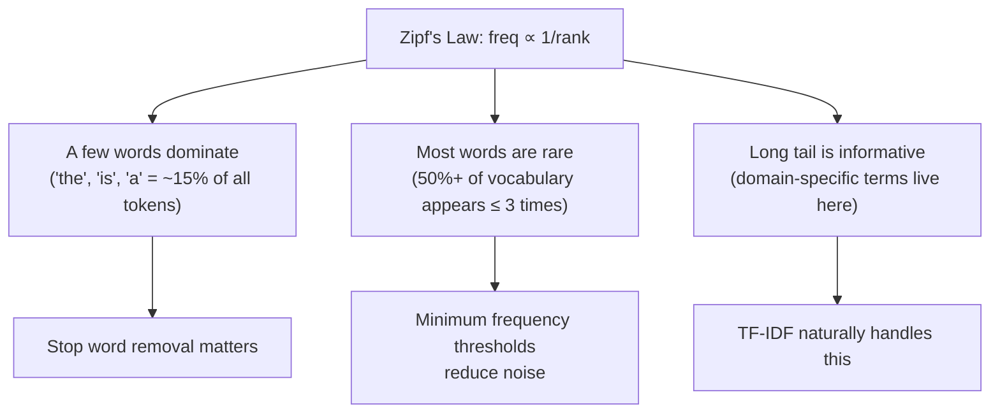
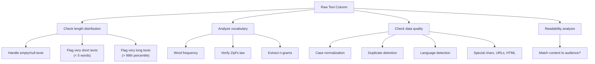

# Univariate Text Analysis

Text data is the messiest data type you will encounter. A single text column can contain anything: one-word answers, multi-paragraph essays, emojis, HTML tags, URLs, code snippets, or complete gibberish. Before you tokenize, embed, or model text, you need to understand its basic statistical properties.

This page covers the essential univariate EDA for text: length distributions, word frequencies, Zipf's law, n-grams, readability metrics, and language detection.

## The Dataset

We will use a synthetic product review dataset that mimics the messy reality of user-generated content.

```python
import numpy as np
import pandas as pd
import matplotlib.pyplot as plt
import seaborn as sns
from collections import Counter
import re
import string

np.random.seed(42)

# Generate synthetic product reviews
review_templates = {
    "short_positive": [
        "Great product!", "Love it!", "Works perfectly.", "Excellent quality.",
        "Five stars!", "Highly recommend.", "Best purchase ever.", "Amazing!",
    ],
    "medium_positive": [
        "This product exceeded my expectations. The build quality is fantastic and it arrived on time. Would definitely buy again.",
        "Really happy with this purchase. It does exactly what the description says. The price was fair and shipping was fast.",
        "I have been using this for a month now and I am very satisfied. It works as advertised and the customer service was helpful when I had a question.",
    ],
    "long_positive": [
        "I spent weeks researching before buying this product and I am glad I chose this one. The build quality is exceptional compared to competitors in the same price range. The packaging was well-designed and everything arrived in perfect condition. I have been using it daily for the past three months and have not encountered any issues. The battery life is impressive and the performance has been consistent. I would highly recommend this to anyone looking for a reliable option in this category. The company also has great customer support - they responded to my inquiry within hours.",
    ],
    "negative": [
        "Terrible product. Broke after one week. Complete waste of money. Do not buy this. Customer service was unhelpful and rude.",
        "Disappointing. The quality does not match the price at all. Returned it immediately.",
        "Would give zero stars if I could. Product arrived damaged and the seller refused a refund.",
    ],
    "mixed": [
        "The product itself is decent but the shipping took forever. Three weeks to arrive is unacceptable. The product works fine though.",
        "Good quality but overpriced. You can find similar products for half the cost. Not bad but not great either.",
    ],
}

reviews = []
for _ in range(3000):
    category = np.random.choice(
        list(review_templates.keys()),
        p=[0.25, 0.30, 0.10, 0.20, 0.15],
    )
    template = np.random.choice(review_templates[category])
    # Add some noise: typos, extra spaces, mixed case
    if np.random.random() < 0.1:
        template = template.upper()
    if np.random.random() < 0.05:
        template = "  " + template + "   "
    if np.random.random() < 0.08:
        # Inject a typo
        words = template.split()
        if len(words) > 3:
            idx = np.random.randint(1, len(words))
            word = words[idx]
            if len(word) > 3:
                pos = np.random.randint(1, len(word) - 1)
                words[idx] = word[:pos] + word[pos+1:]
            template = " ".join(words)
    reviews.append(template)

# Add some edge cases
reviews.extend([""] * 20)       # empty reviews
reviews.extend(["N/A"] * 15)    # placeholder text
reviews.extend(["..."] * 10)    # just punctuation

df = pd.DataFrame({"review": reviews})
df = df.sample(frac=1, random_state=42).reset_index(drop=True)

print(f"Shape: {df.shape}")
print(f"Sample reviews:")
for i in range(5):
    print(f"  [{i}] {df['review'].iloc[i][:80]}...")
```

## Text Length Distributions

The first thing to check about any text column: how long are the entries?

```python
# Compute multiple length metrics
df["char_count"] = df["review"].str.len()
df["word_count"] = df["review"].str.split().str.len().fillna(0).astype(int)
df["sentence_count"] = df["review"].str.count(r"[.!?]+")
df["avg_word_length"] = df["review"].apply(
    lambda x: np.mean([len(w) for w in str(x).split()]) if pd.notna(x) and len(str(x).split()) > 0 else 0
)

# Summary
length_stats = df[["char_count", "word_count", "sentence_count", "avg_word_length"]].describe()
print(length_stats.round(2))

fig, axes = plt.subplots(2, 2, figsize=(16, 10))

# Character count distribution
axes[0, 0].hist(df["char_count"], bins=50, color="steelblue", edgecolor="black", alpha=0.7)
axes[0, 0].axvline(df["char_count"].median(), color="crimson", linestyle="--",
                    label=f"Median: {df['char_count'].median():.0f}")
axes[0, 0].set_title("Character Count Distribution", fontsize=12)
axes[0, 0].set_xlabel("Characters")
axes[0, 0].legend()

# Word count distribution
axes[0, 1].hist(df["word_count"], bins=50, color="steelblue", edgecolor="black", alpha=0.7)
axes[0, 1].axvline(df["word_count"].median(), color="crimson", linestyle="--",
                    label=f"Median: {df['word_count'].median():.0f}")
axes[0, 1].set_title("Word Count Distribution", fontsize=12)
axes[0, 1].set_xlabel("Words")
axes[0, 1].legend()

# Sentence count distribution
axes[1, 0].hist(df["sentence_count"], bins=range(0, 15), color="steelblue",
                edgecolor="black", alpha=0.7, align="left")
axes[1, 0].set_title("Sentence Count Distribution", fontsize=12)
axes[1, 0].set_xlabel("Sentences")

# Average word length
axes[1, 1].hist(df["avg_word_length"][df["avg_word_length"] > 0], bins=30,
                color="steelblue", edgecolor="black", alpha=0.7)
axes[1, 1].set_title("Average Word Length Distribution", fontsize=12)
axes[1, 1].set_xlabel("Average Characters per Word")

plt.suptitle("Text Length Distributions", fontsize=16, fontweight="bold")
plt.tight_layout()
plt.savefig("text_lengths.png", dpi=150, bbox_inches="tight")
plt.show()
```

### Edge Cases to Catch

```python
# Find problematic texts
print("Empty or near-empty reviews:")
empty = df[df["char_count"] < 5]
print(f"  Count: {len(empty)} ({len(empty)/len(df)*100:.1f}%)")
print(f"  Examples: {empty['review'].head().tolist()}")

print(f"\nExtremely short reviews (< 20 chars):")
short = df[(df["char_count"] >= 5) & (df["char_count"] < 20)]
print(f"  Count: {len(short)} ({len(short)/len(df)*100:.1f}%)")

print(f"\nVery long reviews (> 500 chars):")
long_reviews = df[df["char_count"] > 500]
print(f"  Count: {len(long_reviews)} ({len(long_reviews)/len(df)*100:.1f}%)")

# Check for suspicious patterns
print(f"\nAll-caps reviews: {df['review'].str.match(r'^[A-Z\\s\\W]+$', na=False).sum()}")
print(f"Contains URLs: {df['review'].str.contains(r'https?://', na=False).sum()}")
print(f"Contains HTML: {df['review'].str.contains(r'<[^>]+>', na=False).sum()}")
print(f"Contains only punctuation: {df['review'].str.match(r'^[\\W\\s]+$', na=False).sum()}")
```

## Word Frequency Analysis

```python
def tokenize_simple(text):
    """Simple whitespace + punctuation tokenizer."""
    text = str(text).lower()
    text = re.sub(r"[^\w\s]", " ", text)
    tokens = text.split()
    return [t for t in tokens if len(t) > 1]  # drop single chars

# Build vocabulary
all_tokens = []
for review in df["review"]:
    all_tokens.extend(tokenize_simple(review))

word_freq = Counter(all_tokens)
vocab_size = len(word_freq)
total_tokens = len(all_tokens)

print(f"Total tokens: {total_tokens:,}")
print(f"Vocabulary size: {vocab_size:,}")
print(f"Type-token ratio: {vocab_size / total_tokens:.3f}")

# Top words
freq_df = pd.DataFrame(word_freq.most_common(30), columns=["word", "count"])
freq_df["pct"] = (freq_df["count"] / total_tokens * 100).round(2)
freq_df["cumulative_pct"] = freq_df["pct"].cumsum().round(2)

print(f"\nTop 30 words:")
print(freq_df.to_string(index=False))

# Visualize
fig, axes = plt.subplots(1, 2, figsize=(16, 6))

# Top 20 words bar chart
top20 = freq_df.head(20)
axes[0].barh(top20["word"][::-1], top20["count"][::-1],
             color="steelblue", edgecolor="black")
axes[0].set_title("Top 20 Most Frequent Words", fontsize=14)
axes[0].set_xlabel("Frequency")

# Word frequency distribution (how many words appear N times)
freq_of_freq = Counter(word_freq.values())
ff_df = pd.DataFrame(sorted(freq_of_freq.items()), columns=["frequency", "n_words"])
axes[1].loglog(ff_df["frequency"], ff_df["n_words"], "o-", color="steelblue", markersize=3)
axes[1].set_xlabel("Word Frequency (log)")
axes[1].set_ylabel("Number of Words with that Frequency (log)")
axes[1].set_title("Frequency Spectrum", fontsize=14)

plt.tight_layout()
plt.savefig("word_frequency.png", dpi=150, bbox_inches="tight")
plt.show()
```

## Zipf's Law

Zipf's law states that the frequency of a word is inversely proportional to its rank. The r-th most common word appears with frequency proportional to 1/r. This holds remarkably well across almost all natural languages.

```python
# Verify Zipf's law on our corpus
ranks = np.arange(1, vocab_size + 1)
frequencies = np.array([count for _, count in word_freq.most_common()])

# Theoretical Zipf: freq = C / rank^alpha
# In log-log space: log(freq) = log(C) - alpha * log(rank)
log_ranks = np.log(ranks[:200])
log_freqs = np.log(frequencies[:200])

slope, intercept, r_value, _, _ = stats.linregress(log_ranks, log_freqs)
zipf_theoretical = np.exp(intercept) * ranks[:200] ** slope

fig, axes = plt.subplots(1, 2, figsize=(16, 6))

# Log-log plot
axes[0].loglog(ranks[:200], frequencies[:200], "o", color="steelblue",
               markersize=3, alpha=0.7, label="Observed")
axes[0].loglog(ranks[:200], zipf_theoretical, "-", color="crimson",
               linewidth=2, label=f"Zipf fit: α={-slope:.2f}, R²={r_value**2:.3f}")
axes[0].set_xlabel("Rank (log)")
axes[0].set_ylabel("Frequency (log)")
axes[0].set_title("Zipf's Law Verification", fontsize=14)
axes[0].legend()

# Deviations from Zipf
deviation = frequencies[:200] / zipf_theoretical
axes[1].plot(ranks[:200], deviation, color="steelblue", linewidth=1)
axes[1].axhline(1.0, color="crimson", linestyle="--", linewidth=1, label="Perfect Zipf")
axes[1].set_xlabel("Rank")
axes[1].set_ylabel("Observed / Expected")
axes[1].set_title("Deviation from Zipf's Law", fontsize=14)
axes[1].legend()

plt.tight_layout()
plt.savefig("zipf_law.png", dpi=150, bbox_inches="tight")
plt.show()

print(f"Zipf exponent α = {-slope:.3f} (theoretical: 1.0)")
print(f"R² = {r_value**2:.4f}")
```

### Why Zipf's Law Matters for EDA



## N-gram Analysis

N-grams capture phrases and word patterns that single words miss. "not good" tells a different story than "not" and "good" separately.

```python
from itertools import islice

def extract_ngrams(tokens, n):
    """Extract n-grams from a token list."""
    return list(zip(*[islice(tokens, i, None) for i in range(n)]))

# Build bigrams and trigrams from the corpus
all_bigrams = Counter()
all_trigrams = Counter()

for review in df["review"]:
    tokens = tokenize_simple(review)
    if len(tokens) >= 2:
        all_bigrams.update(extract_ngrams(tokens, 2))
    if len(tokens) >= 3:
        all_trigrams.update(extract_ngrams(tokens, 3))

# Display top n-grams
fig, axes = plt.subplots(1, 2, figsize=(16, 7))

# Top bigrams
top_bi = all_bigrams.most_common(20)
bi_labels = [" ".join(bg) for bg, _ in top_bi]
bi_counts = [c for _, c in top_bi]
axes[0].barh(bi_labels[::-1], bi_counts[::-1], color="steelblue", edgecolor="black")
axes[0].set_title("Top 20 Bigrams", fontsize=14)

# Top trigrams
top_tri = all_trigrams.most_common(20)
tri_labels = [" ".join(tg) for tg, _ in top_tri]
tri_counts = [c for _, c in top_tri]
axes[1].barh(tri_labels[::-1], tri_counts[::-1], color="coral", edgecolor="black")
axes[1].set_title("Top 20 Trigrams", fontsize=14)

plt.tight_layout()
plt.savefig("ngrams.png", dpi=150, bbox_inches="tight")
plt.show()

# N-gram coverage
print(f"\nBigram vocabulary:  {len(all_bigrams):,}")
print(f"Trigram vocabulary: {len(all_trigrams):,}")
print(f"\nBigrams appearing once (hapax):  {sum(1 for c in all_bigrams.values() if c == 1)} "
      f"({sum(1 for c in all_bigrams.values() if c == 1)/len(all_bigrams)*100:.1f}%)")
print(f"Trigrams appearing once (hapax): {sum(1 for c in all_trigrams.values() if c == 1)} "
      f"({sum(1 for c in all_trigrams.values() if c == 1)/len(all_trigrams)*100:.1f}%)")
```

## Readability Metrics

Readability scores estimate how difficult text is to read. They are useful features for text classification and content analysis.

```python
def compute_readability(text):
    """Compute multiple readability metrics for a text."""
    if not isinstance(text, str) or len(text.strip()) < 10:
        return {k: np.nan for k in ["flesch_reading_ease", "flesch_kincaid_grade",
                                     "gunning_fog", "coleman_liau", "ari"]}

    # Count sentences, words, syllables
    sentences = max(1, len(re.findall(r"[.!?]+", text)))
    words_list = re.findall(r"\b\w+\b", text.lower())
    n_words = max(1, len(words_list))
    characters = sum(len(w) for w in words_list)

    # Simple syllable counter (English approximation)
    def count_syllables(word):
        word = word.lower()
        if len(word) <= 3:
            return 1
        word = re.sub(r"(?:es|ed|e)$", "", word)
        vowels = re.findall(r"[aeiouy]+", word)
        return max(1, len(vowels))

    n_syllables = sum(count_syllables(w) for w in words_list)
    n_complex = sum(1 for w in words_list if count_syllables(w) >= 3)

    # Flesch Reading Ease (higher = easier)
    fre = 206.835 - 1.015 * (n_words / sentences) - 84.6 * (n_syllables / n_words)

    # Flesch-Kincaid Grade Level
    fkgl = 0.39 * (n_words / sentences) + 11.8 * (n_syllables / n_words) - 15.59

    # Gunning Fog Index
    fog = 0.4 * ((n_words / sentences) + 100 * (n_complex / n_words))

    # Coleman-Liau Index
    L = (characters / n_words) * 100
    S = (sentences / n_words) * 100
    cli = 0.0588 * L - 0.296 * S - 15.8

    # Automated Readability Index
    ari = 4.71 * (characters / n_words) + 0.5 * (n_words / sentences) - 21.43

    return {
        "flesch_reading_ease": fre,
        "flesch_kincaid_grade": fkgl,
        "gunning_fog": fog,
        "coleman_liau": cli,
        "ari": ari,
    }

# Compute for all reviews
readability = df["review"].apply(compute_readability).apply(pd.Series)
df = pd.concat([df, readability], axis=1)

print("Readability Statistics:")
print(df[["flesch_reading_ease", "flesch_kincaid_grade", "gunning_fog",
          "coleman_liau", "ari"]].describe().round(2))
```

### Readability Scale Reference

| Flesch Reading Ease | Grade Level | Audience |
|--------------------|-------------|----------|
| 90-100 | 5th grade | Very easy — understood by 11-year-olds |
| 80-90 | 6th grade | Easy — conversational English |
| 70-80 | 7th grade | Fairly easy — most consumer content |
| 60-70 | 8th-9th grade | Standard — newspapers, business writing |
| 50-60 | 10th-12th grade | Fairly difficult — academic writing |
| 30-50 | College | Difficult — scholarly articles |
| 0-30 | Graduate | Very difficult — legal/medical texts |

```python
fig, axes = plt.subplots(1, 2, figsize=(16, 6))

# Flesch Reading Ease distribution
valid_fre = df["flesch_reading_ease"].dropna()
axes[0].hist(valid_fre, bins=40, color="steelblue", edgecolor="black", alpha=0.7)
axes[0].axvline(valid_fre.median(), color="crimson", linestyle="--",
                label=f"Median: {valid_fre.median():.0f}")
# Shade readability zones
axes[0].axvspan(90, 100, alpha=0.1, color="green", label="Very Easy")
axes[0].axvspan(60, 90, alpha=0.1, color="yellow")
axes[0].axvspan(0, 60, alpha=0.1, color="red", label="Difficult")
axes[0].set_title("Flesch Reading Ease Distribution", fontsize=14)
axes[0].legend()

# Grade level comparison
grade_metrics = ["flesch_kincaid_grade", "gunning_fog", "coleman_liau", "ari"]
medians = [df[m].median() for m in grade_metrics]
axes[1].barh(grade_metrics, medians, color="steelblue", edgecolor="black")
axes[1].set_title("Median Grade Level by Metric", fontsize=14)
axes[1].set_xlabel("Grade Level")

plt.tight_layout()
plt.savefig("readability.png", dpi=150, bbox_inches="tight")
plt.show()
```

## Language Detection

In multilingual datasets, detecting the language of each text is essential before any further NLP processing.

```python
# Lightweight language detection using character n-gram profiles
# In production, use langdetect or fasttext

def detect_language_simple(text):
    """Simple heuristic language detection based on common words."""
    if not isinstance(text, str) or len(text.strip()) < 5:
        return "unknown"

    text_lower = text.lower()
    words = set(text_lower.split())

    # Common word sets for major languages
    english_words = {"the", "is", "and", "to", "of", "in", "it", "for", "was", "that",
                     "this", "with", "not", "but", "are", "have", "from", "they", "been"}
    spanish_words = {"el", "la", "de", "en", "que", "es", "por", "los", "con", "una",
                     "del", "las", "para", "como", "pero", "todo"}
    french_words = {"le", "la", "de", "et", "les", "des", "est", "en", "que", "une",
                    "dans", "qui", "pour", "pas", "sur", "avec"}

    en_score = len(words & english_words)
    es_score = len(words & spanish_words)
    fr_score = len(words & french_words)

    scores = {"english": en_score, "spanish": es_score, "french": fr_score}
    best = max(scores, key=scores.get)

    if scores[best] == 0:
        return "unknown"
    return best

df["detected_lang"] = df["review"].apply(detect_language_simple)
print("Language Distribution:")
print(df["detected_lang"].value_counts())

# For production, use langdetect
# from langdetect import detect, DetectorFactory
# DetectorFactory.seed = 0
# df["lang"] = df["review"].apply(lambda x: detect(x) if len(str(x)) > 10 else "unknown")
```

## Complete Text Profile

```python
def text_profile(series, name="text_column"):
    """Generate a complete text EDA profile."""
    print(f"\n{'='*70}")
    print(f"  TEXT PROFILE: {name}")
    print(f"{'='*70}")

    # Basic stats
    valid = series.dropna()
    non_empty = valid[valid.str.len() > 0]
    char_counts = non_empty.str.len()
    word_counts = non_empty.str.split().str.len()

    print(f"\n  Total rows:         {len(series):,}")
    print(f"  Missing/null:       {series.isna().sum()}")
    print(f"  Empty strings:      {(valid.str.len() == 0).sum()}")
    print(f"  Non-empty:          {len(non_empty):,}")

    print(f"\n  Character count:")
    print(f"    Mean:   {char_counts.mean():.1f}")
    print(f"    Median: {char_counts.median():.1f}")
    print(f"    Min:    {char_counts.min()}")
    print(f"    Max:    {char_counts.max()}")

    print(f"\n  Word count:")
    print(f"    Mean:   {word_counts.mean():.1f}")
    print(f"    Median: {word_counts.median():.1f}")

    # Vocabulary stats
    all_words = Counter()
    for text in non_empty:
        all_words.update(tokenize_simple(text))

    total = sum(all_words.values())
    vocab = len(all_words)
    hapax = sum(1 for c in all_words.values() if c == 1)

    print(f"\n  Vocabulary:")
    print(f"    Total tokens:     {total:,}")
    print(f"    Unique words:     {vocab:,}")
    print(f"    Type-token ratio: {vocab/total:.4f}")
    print(f"    Hapax legomena:   {hapax:,} ({hapax/vocab*100:.1f}% of vocab)")

    # Data quality
    print(f"\n  Quality issues:")
    print(f"    All uppercase:    {non_empty.str.match(r'^[A-Z\\s\\W]+$').sum()}")
    print(f"    All lowercase:    {non_empty.str.match(r'^[a-z\\s\\W]+$').sum()}")
    print(f"    Contains digits:  {non_empty.str.contains(r'\\d').sum()}")
    print(f"    Duplicate texts:  {non_empty.duplicated().sum()}")

text_profile(df["review"], "Product Reviews")
```

## Text EDA Decision Flow



## Practical Checklist

Before moving to text modeling or feature engineering, verify:

1. **Length distribution**: What is the range? Are there empty or suspiciously short texts?
2. **Vocabulary**: How large? What is the type-token ratio? How many words appear only once?
3. **Zipf compliance**: Does word frequency follow the expected power law? Deviations suggest domain-specific or generated text.
4. **N-grams**: What are the most common phrases? Do they reveal data quality issues?
5. **Readability**: Is the text complexity consistent with the expected audience?
6. **Language**: Is the dataset monolingual? Are there unexpected languages?
7. **Duplicates**: What fraction of texts are exact or near duplicates?
8. **Special content**: URLs, HTML, code, emojis — do they need special handling?

## Key Takeaways

- Text length distributions are almost always right-skewed. Median is more informative than mean.
- Zipf's law is a sanity check: natural text follows it closely. Strong deviations suggest synthetic, template-generated, or heavily preprocessed text.
- N-gram analysis catches patterns that word frequency misses, especially negation and multi-word expressions.
- Readability metrics are cheap features that correlate with text quality, user expertise, and sentiment extremity.
- Language detection must happen before any language-specific NLP (tokenization, stopwords, lemmatization).
- Always check for duplicates — user-generated content often contains copy-pasted boilerplate that will inflate your training set.
