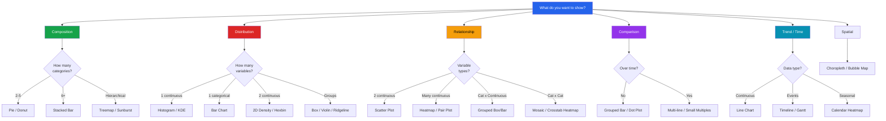

# Visualization Decision Tree

Choosing the wrong chart type is one of the most common EDA mistakes. This page provides a complete decision tree: given your data and your question, it tells you exactly which chart to use, with code for each.

---

## Master Decision Flowchart



---

## Chart Type Reference

### Distribution Charts

#### Histogram

**Use when**: Showing the distribution shape of a single continuous variable.

```python
import matplotlib.pyplot as plt
import seaborn as sns
import numpy as np
import pandas as pd

data = np.random.lognormal(4, 0.8, 5000)

fig, ax = plt.subplots(figsize=(10, 5))
ax.hist(data, bins=50, edgecolor='white', alpha=0.7, color='steelblue')
ax.axvline(np.mean(data), color='red', linestyle='--', label=f'Mean: {np.mean(data):.1f}')
ax.axvline(np.median(data), color='green', linestyle='--', label=f'Median: {np.median(data):.1f}')
ax.set_title('Histogram — Distribution of Values')
ax.legend()
plt.show()
```

| Good for | Bad for |
|----------|---------|
| Distribution shape | Comparing many groups |
| Detecting skewness | Small datasets (< 30) |
| Finding outliers | Categorical data |

#### KDE (Kernel Density Estimate)

**Use when**: Comparing distributions of the same variable across groups.

```python
fig, ax = plt.subplots(figsize=(10, 5))
for group, color in [('A', 'steelblue'), ('B', 'coral'), ('C', 'green')]:
    data = np.random.normal(np.random.uniform(40, 60), 10, 500)
    sns.kdeplot(data, fill=True, alpha=0.3, label=group, color=color, ax=ax)
ax.set_title('KDE — Comparing Group Distributions')
ax.legend()
plt.show()
```

#### Box Plot

**Use when**: Comparing distributions across categories, detecting outliers.

```python
data = pd.DataFrame({
    'value': np.concatenate([np.random.normal(m, 10, 200) for m in [40, 50, 45, 55]]),
    'group': np.repeat(['A', 'B', 'C', 'D'], 200)
})

fig, ax = plt.subplots(figsize=(10, 5))
sns.boxplot(data=data, x='group', y='value', ax=ax)
ax.set_title('Box Plot — Distribution Comparison')
plt.show()
```

#### Violin Plot

**Use when**: Full distribution shape comparison (richer than box plot).

```python
fig, ax = plt.subplots(figsize=(10, 5))
sns.violinplot(data=data, x='group', y='value', inner='quart', ax=ax)
ax.set_title('Violin Plot — Full Distribution Shape')
plt.show()
```

#### ECDF (Empirical Cumulative Distribution)

**Use when**: Comparing distributions precisely, reading percentiles.

```python
fig, ax = plt.subplots(figsize=(10, 5))
for group in data['group'].unique():
    subset = data[data['group'] == group]['value']
    sorted_data = np.sort(subset)
    ecdf = np.arange(1, len(sorted_data) + 1) / len(sorted_data)
    ax.step(sorted_data, ecdf, label=group)
ax.set_title('ECDF — Precise Distribution Comparison')
ax.set_ylabel('Cumulative Probability')
ax.legend()
plt.show()
```

#### Ridgeline (Joy Plot)

**Use when**: Comparing many distributions in a compact, visually striking way.

```python
# Using seaborn FacetGrid
groups = pd.DataFrame({
    'value': np.concatenate([np.random.normal(m, 8, 300) for m in range(30, 80, 5)]),
    'month': np.repeat([f'Month {i}' for i in range(1, 11)], 300),
})

g = sns.FacetGrid(groups, row='month', height=1.2, aspect=6)
g.map_dataframe(sns.kdeplot, x='value', fill=True, alpha=0.6)
g.set_titles("{row_name}")
g.fig.suptitle('Ridgeline — Many Distributions', y=1.02)
plt.show()
```

---

### Relationship Charts

#### Scatter Plot

**Use when**: Showing relationship between two continuous variables.

```python
x = np.random.randn(500)
y = 0.7 * x + np.random.randn(500) * 0.5

fig, ax = plt.subplots(figsize=(8, 8))
ax.scatter(x, y, alpha=0.4, s=20)
z = np.polyfit(x, y, 1)
ax.plot(np.sort(x), np.poly1d(z)(np.sort(x)), 'r-', linewidth=2)
ax.set_title(f'Scatter Plot (r = {np.corrcoef(x, y)[0,1]:.3f})')
plt.show()
```

#### Heatmap (Correlation Matrix)

**Use when**: Showing pairwise relationships among many variables.

```python
corr = pd.DataFrame(np.random.randn(1000, 6), columns=[f'Var{i}' for i in range(6)]).corr()

fig, ax = plt.subplots(figsize=(8, 7))
mask = np.triu(np.ones_like(corr, dtype=bool))
sns.heatmap(corr, mask=mask, annot=True, fmt='.2f', cmap='RdBu_r', center=0, ax=ax)
ax.set_title('Correlation Heatmap')
plt.show()
```

#### Pair Plot

**Use when**: Scanning all pairwise relationships in one view.

```python
# sns.pairplot(df[numeric_cols], hue='target', diag_kind='kde', corner=True)
```

#### Bubble Chart

**Use when**: Encoding a third dimension via bubble size on a scatter plot.

```python
n = 100
fig, ax = plt.subplots(figsize=(10, 7))
scatter = ax.scatter(
    np.random.randn(n), np.random.randn(n),
    s=np.random.uniform(50, 500, n),
    c=np.random.randn(n), cmap='RdYlBu',
    alpha=0.6, edgecolors='white'
)
plt.colorbar(scatter, label='Color Dimension')
ax.set_title('Bubble Chart — 4 Dimensions')
plt.show()
```

---

### Comparison Charts

#### Bar Chart (Vertical)

**Use when**: Comparing values across a small number of categories.

```python
categories = ['Alpha', 'Beta', 'Gamma', 'Delta', 'Epsilon']
values = [42, 38, 55, 28, 47]

fig, ax = plt.subplots(figsize=(10, 5))
ax.bar(categories, values, color='steelblue')
ax.set_title('Bar Chart — Category Comparison')
plt.show()
```

#### Horizontal Bar

**Use when**: Many categories (>7) or long category labels.

```python
fig, ax = plt.subplots(figsize=(10, 6))
sorted_idx = np.argsort(values)
ax.barh([categories[i] for i in sorted_idx], [values[i] for i in sorted_idx])
ax.set_title('Horizontal Bar — Sorted for Readability')
plt.show()
```

#### Grouped Bar

**Use when**: Comparing values across categories with sub-groups.

```python
x = np.arange(4)
fig, ax = plt.subplots(figsize=(10, 5))
ax.bar(x - 0.2, [10, 20, 15, 25], 0.4, label='Group A')
ax.bar(x + 0.2, [12, 18, 20, 22], 0.4, label='Group B')
ax.set_xticks(x)
ax.set_xticklabels(['Q1', 'Q2', 'Q3', 'Q4'])
ax.set_title('Grouped Bar — Sub-group Comparison')
ax.legend()
plt.show()
```

#### Dot Plot / Lollipop

**Use when**: Cleaner alternative to bar chart (less ink, easier to read).

```python
fig, ax = plt.subplots(figsize=(10, 5))
ax.hlines(y=categories, xmin=0, xmax=values, color='steelblue', linewidth=2)
ax.scatter(values, categories, color='steelblue', s=100, zorder=3)
ax.set_title('Lollipop Chart — Clean Comparison')
plt.show()
```

#### Dumbbell / Slope Chart

**Use when**: Showing before/after or two-point comparisons.

```python
cats = ['Alpha', 'Beta', 'Gamma', 'Delta']
before = [30, 45, 20, 55]
after = [38, 42, 35, 50]

fig, ax = plt.subplots(figsize=(10, 5))
for i, cat in enumerate(cats):
    ax.plot([before[i], after[i]], [i, i], 'o-', color='steelblue', markersize=10)
    ax.text(before[i] - 2, i, str(before[i]), ha='right', va='center')
    ax.text(after[i] + 2, i, str(after[i]), ha='left', va='center')
ax.set_yticks(range(len(cats)))
ax.set_yticklabels(cats)
ax.set_title('Dumbbell — Before vs After')
plt.show()
```

---

### Composition Charts

#### Pie Chart

**Use when**: Showing parts of a whole (max 5-6 categories).

```python
fig, ax = plt.subplots(figsize=(8, 8))
ax.pie([35, 28, 22, 15], labels=['A', 'B', 'C', 'D'],
       autopct='%1.1f%%', startangle=90)
ax.set_title('Pie — Parts of a Whole')
plt.show()
```

#### Stacked Bar

**Use when**: Showing composition that changes across categories or time.

```python
cats = ['Q1', 'Q2', 'Q3', 'Q4']
a = [20, 25, 30, 35]
b = [15, 20, 25, 20]
c = [10, 15, 10, 15]

fig, ax = plt.subplots(figsize=(10, 5))
ax.bar(cats, a, label='Product A')
ax.bar(cats, b, bottom=a, label='Product B')
ax.bar(cats, [a[i]+b[i] for i in range(4)], bottom=[0]*4, width=0, label='')
ax.bar(cats, c, bottom=[a[i]+b[i] for i in range(4)], label='Product C')
ax.set_title('Stacked Bar — Composition Over Time')
ax.legend()
plt.show()
```

#### Treemap

**Use when**: Hierarchical part-to-whole with nested categories.

```python
import plotly.express as px

tree = pd.DataFrame({
    'category': ['Electronics']*3 + ['Clothing']*2 + ['Home']*2,
    'product': ['Phones', 'Laptops', 'Tablets', 'Shirts', 'Pants', 'Furniture', 'Decor'],
    'revenue': [500, 400, 200, 300, 250, 350, 150],
})

fig = px.treemap(tree, path=['category', 'product'], values='revenue',
                  title='Treemap — Hierarchical Composition')
fig.show()
```

---

### Time Series Charts

#### Line Chart

**Use when**: Showing trends over time for one or more series.

```python
dates = pd.date_range('2024-01-01', periods=365, freq='D')
values = np.cumsum(np.random.randn(365) * 2 + 0.5) + 100

fig, ax = plt.subplots(figsize=(12, 5))
ax.plot(dates, values, linewidth=1.5)
ax.set_title('Line Chart — Time Series Trend')
fig.autofmt_xdate()
plt.show()
```

#### Area Chart

**Use when**: Emphasizing volume under a time series or composition over time.

```python
fig, ax = plt.subplots(figsize=(12, 5))
ax.fill_between(dates, 0, values, alpha=0.3, color='steelblue')
ax.plot(dates, values, color='steelblue', linewidth=1)
ax.set_title('Area Chart — Volume Emphasis')
fig.autofmt_xdate()
plt.show()
```

---

## Quick Selection Table

| Your Question | Chart Type | Library |
|---------------|-----------|---------|
| What is the shape of my data? | Histogram + KDE | matplotlib / seaborn |
| Are there outliers? | Box plot | seaborn |
| How do groups differ? | Violin / Box | seaborn |
| Are two variables related? | Scatter + regression | seaborn / plotly |
| Which features correlate? | Heatmap | seaborn |
| What is the trend over time? | Line chart | matplotlib |
| What is the composition? | Pie (few) / Stacked bar (many) | matplotlib |
| How does composition change over time? | Stacked area | matplotlib |
| Which category is biggest? | Horizontal bar (sorted) | matplotlib |
| What is the hierarchy? | Treemap / Sunburst | plotly |
| How do many features interact? | Pair plot | seaborn |
| Where are the dense regions? | 2D KDE / Hexbin | seaborn / matplotlib |
| What is the exact distribution? | ECDF | seaborn |
| How do many distributions compare? | Ridgeline | seaborn FacetGrid |
| What changed between two points? | Dumbbell / Slope | matplotlib |
| How does location affect values? | Choropleth / Bubble map | plotly |

---

## Anti-Patterns to Avoid

| Anti-Pattern | Problem | Better Alternative |
|-------------|---------|-------------------|
| Pie chart with 10+ slices | Unreadable | Horizontal bar |
| 3D bar chart | Distorts perception | 2D bar |
| Dual y-axis | Confusing correlation | Two separate charts |
| Truncated y-axis (not starting at 0) | Exaggerates differences | Start at 0 or use dot plot |
| Rainbow color palette | Not accessible, distracting | Sequential or diverging palette |
| Too many lines on one chart | Cluttered | Small multiples / FacetGrid |
| Default title ("Figure 1") | Uninformative | Descriptive title with key finding |

---

## Key Takeaways

- Start with **"What am I trying to show?"** not "What chart looks cool?"
- **Distribution**: histogram, KDE, box, violin, ECDF
- **Relationship**: scatter, heatmap, pair plot, bubble
- **Comparison**: bar (horizontal for many categories), dot/lollipop
- **Composition**: pie (max 5), stacked bar, treemap
- **Time**: line chart, area chart, calendar heatmap
- Always use **sorted horizontal bars** for ranked categorical data
- Use **small multiples** (FacetGrid) instead of overloaded single charts
- Choose **colorblind-friendly** palettes (viridis, cividis, or seaborn's colorblind)
