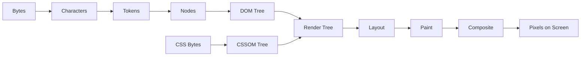
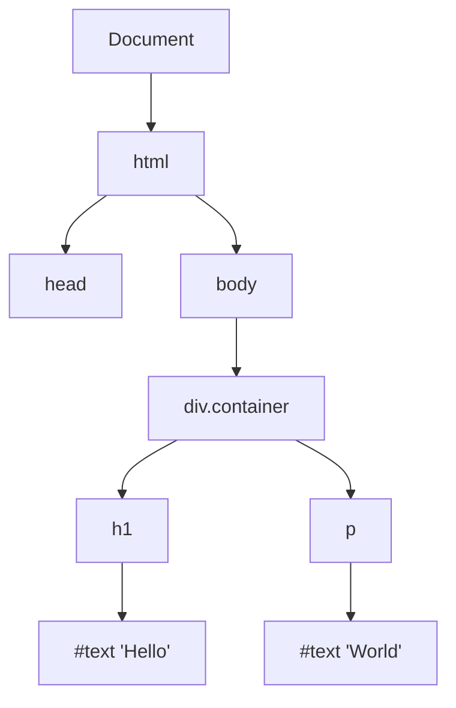
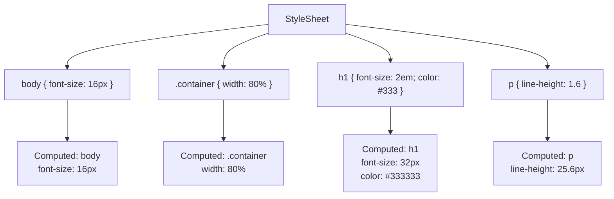
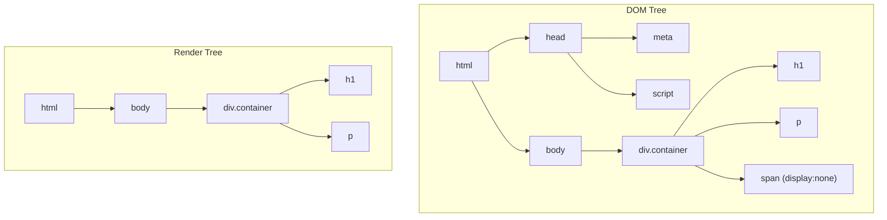
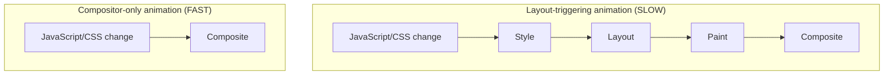

# Browser Rendering Pipeline

Every time a browser turns HTML, CSS, and JavaScript into pixels on a screen, it executes one of the most complex software pipelines in existence. Understanding this pipeline is not optional for frontend engineers — it is the difference between building fast applications and building slow ones while thinking they are fast.

This page walks through the entire rendering pipeline from first byte to first pixel, explains how each stage can become a bottleneck, and shows you how to write code that works with the pipeline instead of against it.

## The Pipeline Overview

When the browser receives an HTML document, it processes it through these stages:



Each stage has distinct performance characteristics, and changes at different stages trigger different amounts of downstream work.

## Stage 1: DOM Construction

The browser converts raw HTML bytes into the Document Object Model (DOM) through a multi-step process:

```
Bytes → Characters → Tokens → Nodes → DOM Tree
```

### The Tokenizer

The HTML tokenizer is a state machine defined by the [HTML Living Standard](https://html.spec.whatwg.org/multipage/parsing.html). It reads characters one at a time and emits tokens:

```html
<!-- Input HTML -->
<div class="container">
  <h1>Hello</h1>
  <p>World</p>
</div>
```

```
Token stream:
1. StartTag: div, attrs: [{name: "class", value: "container"}]
2. Character: "\n  "
3. StartTag: h1
4. Character: "Hello"
5. EndTag: h1
6. Character: "\n  "
7. StartTag: p
8. Character: "World"
9. EndTag: p
10. Character: "\n"
11. EndTag: div
```

### The Tree Builder

The tree builder takes tokens and constructs the DOM tree. This process handles error recovery, implicit tag closing, and foster parenting (misplaced table content):



::: warning DOM Construction Is Incremental
The browser does not wait for the entire HTML document to arrive before starting DOM construction. It processes HTML as it streams in, which is why `<script>` tags without `async` or `defer` block parsing — the parser must stop, execute the script (which might modify the DOM via `document.write()`), and then resume.
:::

### Parser-Blocking Resources

```html
<!-- This blocks DOM construction until the script downloads and executes -->
<script src="/app.js"></script>

<!-- This does NOT block parsing (downloads in parallel, executes after parsing) -->
<script defer src="/app.js"></script>

<!-- This does NOT block parsing (downloads in parallel, executes ASAP) -->
<script async src="/app.js"></script>

<!-- CSS is parser-blocking if a script follows it -->
<link rel="stylesheet" href="/styles.css">
<script src="/app.js"></script>
<!-- The script cannot execute until styles.css is loaded, because the script
     might query computed styles. This makes CSS effectively parser-blocking. -->
```

## Stage 2: CSSOM Construction

In parallel with DOM construction, the browser builds the CSS Object Model (CSSOM). Unlike the DOM, the CSSOM cannot be built incrementally — the browser must process the entire stylesheet before any styles can be applied, because later rules can override earlier ones through cascading and specificity.



### Why CSSOM Is Render-Blocking

The browser will **not** render any content until the CSSOM is complete. This is because rendering with incomplete styles would cause a flash of unstyled content (FOUC) followed by a layout shift when the remaining styles load — a worse experience than waiting.

**Implication:** Every CSS file in your `<head>` is render-blocking by default.

```html
<!-- Render-blocking: delays first paint -->
<link rel="stylesheet" href="/main.css">

<!-- Not render-blocking: only applies when printing -->
<link rel="stylesheet" href="/print.css" media="print">

<!-- Trick: load non-critical CSS without blocking render -->
<link rel="stylesheet" href="/non-critical.css" media="print" onload="this.media='all'">
```

### Style Calculation Cost

The browser must match every DOM element against every CSS rule to compute its final styles. This is an O(n * m) operation where n is the number of DOM elements and m is the number of CSS rules.

```css
/* SLOW: deeply nested, forces the engine to walk up the DOM tree */
.app .main-content .article-list .article-card .card-body .card-title span {
  color: red;
}

/* FAST: single class selector, direct match */
.card-title-text {
  color: red;
}
```

::: tip BEM and CSS Modules Exist for Performance
Naming conventions like BEM (`.block__element--modifier`) and CSS Modules produce flat, single-class selectors that are dramatically faster to match than deeply nested descendant selectors. This is not just an organizational benefit — it is a performance optimization.
:::

## Stage 3: Render Tree Construction

The render tree combines the DOM and CSSOM, containing only the nodes that will actually be painted:



**Elements excluded from the render tree:**
- `<head>`, `<meta>`, `<script>`, `<link>` (non-visual elements)
- Elements with `display: none` (not `visibility: hidden` — that still occupies space)
- Elements with `content-visibility: hidden`

::: warning visibility: hidden vs display: none
`visibility: hidden` keeps the element in the render tree and layout — it just does not paint it. The element still takes up space. `display: none` removes it from the render tree entirely. `opacity: 0` is the same as `visibility: hidden` for rendering purposes, but it creates a stacking context.
:::

## Stage 4: Layout (Reflow)

Layout calculates the exact position and size of every element in the render tree. This is where percentages are resolved to pixels, `em` units are computed, and the box model is applied.

### The Layout Algorithm

Layout is a recursive, top-down process. Each element's size depends on its parent's size, which creates a tree of dependencies:

```typescript
// Simplified layout algorithm (pseudocode)
function layout(node: RenderNode, parentWidth: number): void {
  // 1. Calculate width based on parent
  if (node.style.width === 'auto') {
    node.computedWidth = parentWidth - node.margins - node.padding - node.borders;
  } else if (node.style.width.endsWith('%')) {
    node.computedWidth = parentWidth * (parseFloat(node.style.width) / 100);
  }

  // 2. Layout children recursively
  let yOffset = 0;
  for (const child of node.children) {
    layout(child, node.computedWidth);
    child.y = yOffset;
    yOffset += child.computedHeight + child.margins;
  }

  // 3. Calculate height (often depends on children)
  if (node.style.height === 'auto') {
    node.computedHeight = yOffset;
  }
}
```

### What Triggers Layout (Reflow)

Layout is expensive. On a page with 1,000 DOM elements, a single reflow can take 10-30ms. These operations force a synchronous reflow:

```typescript
// DANGER ZONE: These properties/methods force synchronous layout
element.offsetTop;
element.offsetLeft;
element.offsetWidth;
element.offsetHeight;
element.scrollTop;
element.scrollLeft;
element.scrollWidth;
element.scrollHeight;
element.clientTop;
element.clientLeft;
element.clientWidth;
element.clientHeight;
window.getComputedStyle(element);
element.getBoundingClientRect();
element.focus(); // triggers layout to determine scroll position
```

### Layout Thrashing

The worst performance anti-pattern in DOM manipulation is **layout thrashing** — reading layout properties and writing styles in alternation, forcing the browser to reflow on every read:

```typescript
// BAD: Layout thrashing — forces reflow on every iteration
const elements = document.querySelectorAll('.item');
for (const el of elements) {
  const height = el.offsetHeight; // READ: forces reflow
  el.style.width = height * 2 + 'px'; // WRITE: invalidates layout
  // Next iteration's READ will force another reflow
}

// GOOD: Batch reads, then batch writes
const heights: number[] = [];
for (const el of elements) {
  heights.push(el.offsetHeight); // All reads first
}
elements.forEach((el, i) => {
  el.style.width = heights[i] * 2 + 'px'; // All writes after
});

// BEST: Use requestAnimationFrame for write phase
const heights2: number[] = [];
for (const el of elements) {
  heights2.push(el.offsetHeight); // Reads
}
requestAnimationFrame(() => {
  elements.forEach((el, i) => {
    el.style.width = heights2[i] * 2 + 'px'; // Writes in next frame
  });
});
```

## Stage 5: Paint

Paint fills in pixels. The browser records a list of draw calls (paint records) — "draw rectangle at (x, y) with color #333", "draw text 'Hello' at position (x, y) with font Brand 32px", etc.

### Paint Order

Elements are painted in a specific order defined by the CSS stacking context:

1. Background colors and images
2. Borders
3. Children (in DOM order, unless modified by `z-index`)
4. Outline
5. Stacking contexts (elements with `position`, `opacity < 1`, `transform`, etc.)

### What Triggers Repaint (Without Reflow)

Some CSS changes only trigger a repaint — no layout recalculation needed:

```css
/* Repaint only (no layout change) */
color: red;
background-color: blue;
visibility: hidden;
box-shadow: 0 2px 4px rgba(0,0,0,.2);
outline: 1px solid red;

/* Layout + repaint */
width: 200px;
height: 100px;
margin: 10px;
padding: 10px;
font-size: 16px;
top: 10px; /* on positioned elements */
```

## Stage 6: Compositing

The browser splits the page into layers, paints each layer independently, and then composites (combines) them together on the GPU. This is the key to achieving 60fps animations.

### Layer Promotion

Certain CSS properties cause an element to be promoted to its own compositor layer:

```css
/* These create a new compositor layer */
.animated-element {
  will-change: transform;     /* Explicit hint */
  transform: translateZ(0);   /* Hack (don't use unless needed) */
  opacity: 0.99;              /* Hack (really don't use this) */
}

/* Modern approach: let the browser decide */
.animated-element {
  will-change: transform, opacity;
}
```

### GPU-Accelerated Properties

Only four CSS properties can be animated purely on the compositor thread, without triggering layout or paint:

| Property | Triggers Layout | Triggers Paint | Compositor Only |
|----------|:-:|:-:|:-:|
| `transform` | No | No | **Yes** |
| `opacity` | No | No | **Yes** |
| `filter` | No | No | **Yes** |
| `backdrop-filter` | No | No | **Yes** |

```css
/* BAD: Animating 'left' triggers layout every frame */
.moving-box {
  position: absolute;
  transition: left 0.3s;
}
.moving-box.active {
  left: 200px;
}

/* GOOD: Animating 'transform' runs on compositor thread */
.moving-box {
  transition: transform 0.3s;
}
.moving-box.active {
  transform: translateX(200px);
}
```



::: danger will-change Is Not Free
Every compositor layer consumes GPU memory. A `will-change: transform` on 1,000 list items creates 1,000 GPU textures, potentially consuming hundreds of megabytes of VRAM. Use `will-change` only on elements you are actively animating, and remove it when the animation completes.
:::

## requestAnimationFrame and requestIdleCallback

### requestAnimationFrame (rAF)

`requestAnimationFrame` schedules a callback to run just before the next paint. It is the correct way to perform visual updates:

```typescript
// Smooth animation loop using rAF
function animate(timestamp: DOMHighResTimeStamp): void {
  // Calculate progress based on elapsed time, not frame count
  const elapsed = timestamp - startTime;
  const progress = Math.min(elapsed / duration, 1);

  // Apply eased progress
  const eased = easeOutCubic(progress);
  element.style.transform = `translateX(${eased * targetX}px)`;

  if (progress < 1) {
    requestAnimationFrame(animate);
  }
}

const startTime = performance.now();
const duration = 300;
const targetX = 200;
requestAnimationFrame(animate);

function easeOutCubic(t: number): number {
  return 1 - Math.pow(1 - t, 3);
}
```

### requestIdleCallback (rIC)

`requestIdleCallback` schedules work during the browser's idle periods — after the current frame is painted and before the next one begins:

```typescript
// Schedule non-critical work during idle periods
function processQueue(deadline: IdleDeadline): void {
  // Keep working as long as we have time remaining in this idle period
  while (queue.length > 0 && deadline.timeRemaining() > 5) {
    const task = queue.shift()!;
    task();
  }

  // If there's more work, schedule another idle callback
  if (queue.length > 0) {
    requestIdleCallback(processQueue, { timeout: 2000 });
  }
}

const queue: Array<() => void> = [];

// Enqueue non-critical work
queue.push(() => prefetchNextPage());
queue.push(() => loadAnalytics());
queue.push(() => precomputeSearchIndex());

requestIdleCallback(processQueue, { timeout: 5000 });
```

### The Frame Budget

At 60fps, each frame has a budget of 16.67ms. Here is how that budget is typically spent:

```
16.67ms frame budget:
├── JavaScript:         ~6ms
├── Style calculation:  ~2ms
├── Layout:             ~2ms
├── Paint:              ~2ms
├── Composite:          ~1ms
└── Browser overhead:   ~3.67ms
```

If any single phase exceeds its budget, the frame is dropped, and the user sees jank (visual stutter). On 120Hz displays, the budget shrinks to 8.33ms.

## Content Visibility and Containment

Modern CSS provides explicit ways to tell the browser what can be skipped:

### CSS Containment

```css
/* Tell the browser this element's internals don't affect the outside */
.card {
  contain: layout style paint;
  /* layout: element's layout is independent of the rest of the page */
  /* style: counters and quotes are scoped to this subtree */
  /* paint: children don't render outside this element's bounds */
}
```

### content-visibility

```css
/* Skip rendering for off-screen content entirely */
.article-section {
  content-visibility: auto;
  contain-intrinsic-size: auto 500px; /* Estimated height for scrollbar */
}
```

`content-visibility: auto` tells the browser to skip layout, paint, and compositing for elements that are off-screen. On a page with 100 articles, this can reduce initial rendering time by 90%+, because only the visible articles are fully rendered.

## Debugging the Rendering Pipeline

### Chrome DevTools

```
1. Performance tab → Record → interact → Stop
   - Look for long "Layout" (purple) or "Paint" (green) bars
   - Identify layout thrashing patterns

2. Rendering tab (Cmd+Shift+P → "Show Rendering")
   - Paint flashing: highlights areas being repainted
   - Layout Shift Regions: highlights CLS events
   - Layer borders: shows compositor layer boundaries
   - Frame rendering stats: shows GPU memory and FPS

3. Layers tab
   - Shows all compositor layers, their sizes, and memory usage
   - Helps identify unnecessary layer promotion
```

### Performance Observer API

```typescript
// Detect layout shifts in production
const observer = new PerformanceObserver((list) => {
  for (const entry of list.getEntries()) {
    if (entry.entryType === 'layout-shift' && !(entry as any).hadRecentInput) {
      console.warn('Layout shift detected:', {
        value: (entry as any).value,
        sources: (entry as any).sources?.map((s: any) => ({
          node: s.node,
          previousRect: s.previousRect,
          currentRect: s.currentRect,
        })),
      });
    }
  }
});

observer.observe({ type: 'layout-shift', buffered: true });
```

## Summary: What Triggers What

| Change Type | Style | Layout | Paint | Composite | Example |
|------------|:-----:|:------:|:-----:|:---------:|---------|
| DOM structure | Yes | Yes | Yes | Yes | `appendChild()` |
| Geometry | Yes | Yes | Yes | Yes | `width`, `height`, `margin` |
| Visual only | Yes | No | Yes | Yes | `color`, `background`, `box-shadow` |
| Compositor only | Yes | No | No | Yes | `transform`, `opacity` |

## Further Reading

- [Web Performance & Core Web Vitals](/frontend-engineering/web-performance) — Measure the user-facing impact of rendering performance
- [Bundle Optimization](/frontend-engineering/bundle-optimization) — Reduce JavaScript that blocks the main thread
- [UI & Design Systems > Animations](/ui-design-systems/animations/) — Animation patterns built on compositor-friendly properties
- [Performance Profiling > Browser Profiling](/performance/profiling/browser-profiling) — Advanced Chrome DevTools techniques
