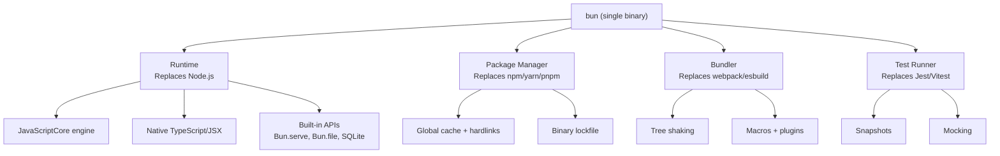
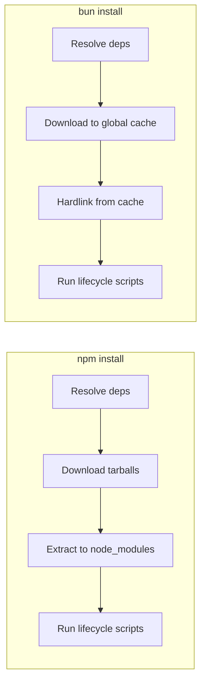
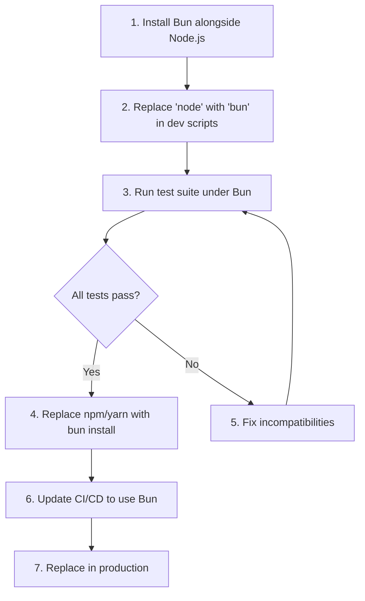

# Bun Runtime

Bun is an all-in-one JavaScript and TypeScript runtime built from scratch in Zig, using JavaScriptCore (the engine behind Safari) instead of V8. It ships as a single executable that replaces Node.js, npm/yarn/pnpm, webpack/esbuild, and Jest/Vitest — runtime, package manager, bundler, and test runner in one tool.

The performance claims are not marketing. Bun starts faster, installs packages faster, runs scripts faster, and bundles faster than the Node.js ecosystem equivalents. The reason is architectural: Zig gives manual memory control without GC pauses, JavaScriptCore compiles differently than V8, and the package manager uses hardlinks and a global cache instead of copying files.

Understanding Bun matters because it is reshaping how JavaScript tooling works, even if you never use Bun directly — Node.js is adopting features (built-in TypeScript support, native test runner) that Bun pioneered.

**Related**: [Bundle Optimization](/frontend-engineering/bundle-optimization) | [Web Performance](/frontend-engineering/web-performance) | [WebAssembly](/frontend-engineering/webassembly)

---

## What Bun Actually Is

Bun is four tools unified under one binary:



### Why It Exists

The JavaScript ecosystem has a fragmentation problem. A typical Node.js project requires:

| Concern | Typical Tools | Bun Equivalent |
|---------|--------------|----------------|
| **Runtime** | Node.js | `bun` |
| **Package manager** | npm, yarn, pnpm | `bun install` |
| **TypeScript compilation** | tsc, ts-node, tsx | Native (zero config) |
| **Bundling** | webpack, Vite, esbuild, Rollup | `bun build` |
| **Testing** | Jest, Vitest, Mocha | `bun test` |
| **Script running** | npx, tsx | `bunx` |
| **Environment variables** | dotenv | Built-in `.env` loading |
| **Watch mode** | nodemon, tsx --watch | `bun --watch` |

Bun collapses this into a single dependency-free binary.

---

## Bun vs Node.js vs Deno

### Architecture Comparison

| Feature | Bun | Node.js | Deno |
|---------|-----|---------|------|
| **Language** | Zig + C++ | C++ | Rust |
| **JS Engine** | JavaScriptCore | V8 | V8 |
| **TypeScript** | Native (no transpile step) | Experimental (v22.6+, strip-only) | Native |
| **Package Manager** | Built-in (`bun install`) | npm (separate) | Built-in (URL imports) |
| **Bundler** | Built-in (`bun build`) | None (third-party) | None (third-party) |
| **Test Runner** | Built-in (`bun test`) | Built-in (`node --test`, limited) | Built-in (`deno test`) |
| **node_modules** | Yes (compatible) | Yes | Optional (npm: specifier) |
| **Web APIs** | fetch, Request, Response, WebSocket | fetch (v18+), limited | Full Web API coverage |
| **Security Model** | No sandbox | No sandbox | Permissions-based sandbox |
| **Startup time** | ~5ms | ~30-40ms | ~20-30ms |

### Performance Benchmarks

These are approximate ranges from real-world benchmarks (2025-2026). Exact numbers vary by workload:

| Benchmark | Bun | Node.js | Speedup |
|-----------|-----|---------|---------|
| **HTTP server (req/s)** | ~110,000 | ~45,000 | ~2.5x |
| **Package install (clean, large project)** | ~1.5s | ~12s (npm) | ~8x |
| **TypeScript startup** | ~5ms | ~250ms (ts-node) | ~50x |
| **FFI calls** | ~3ns overhead | ~15ns (napi) | ~5x |
| **SQLite operations** | Native, ~2x faster | Better-sqlite3 via N-API | ~2x |
| **File I/O (read large file)** | ~1.2 GB/s | ~600 MB/s | ~2x |
| **WebSocket messages/s** | ~1.5M | ~300K (ws) | ~5x |
| **Bundling (large project)** | ~30ms | ~150ms (esbuild) | ~5x |

::: warning Benchmark Nuance
Bun's speed advantages are real but context-dependent. For CPU-bound JavaScript computation (tight loops, math), JavaScriptCore and V8 are comparable — V8 sometimes wins on sustained compute due to its tiered JIT compilation. Bun's advantages are most dramatic in I/O, startup, and tooling operations, not raw JS execution speed.
:::

---

## Installation

### macOS and Linux

```bash
# Official install script
curl -fsSL https://bun.sh/install | bash

# Homebrew
brew install oven-sh/bun/bun

# Verify
bun --version
```

### Windows

```powershell
# PowerShell
powershell -c "irm bun.sh/install.ps1 | iex"

# Or via npm (if Node.js is installed)
npm install -g bun

# Scoop
scoop install bun
```

### Version Management

```bash
# Upgrade to latest
bun upgrade

# Install specific version
bun upgrade --canary   # latest canary
```

### Project Initialization

```bash
# Create a new project
bun init

# Interactive — creates package.json, tsconfig.json, index.ts
# No templates, no bloat, just the minimum files
```

The `bun init` output is minimal:

```
bun init v1.2.x

package.json
tsconfig.json
index.ts

Done! Happy coding.
```

---

## Bun as a Runtime

### Running Files

```bash
# Run JavaScript
bun run index.js

# Run TypeScript directly — no tsc, no ts-node
bun run server.ts

# Run JSX/TSX directly
bun run app.tsx

# Watch mode (restarts on file changes)
bun --watch run server.ts

# Hot mode (HMR-like, preserves state)
bun --hot run server.ts
```

The difference between `--watch` and `--hot`:

| Mode | Behavior |
|------|----------|
| `--watch` | Restarts the entire process on file change |
| `--hot` | Reloads only changed modules, preserves global state |

### TypeScript and JSX: Zero Config

Bun natively understands TypeScript and JSX without any compilation step:

```typescript
// server.ts — just run it with `bun run server.ts`
interface User {
  id: number;
  name: string;
  email: string;
}

const users: User[] = [
  { id: 1, name: "Alice", email: "alice@example.com" },
  { id: 2, name: "Bob", email: "bob@example.com" },
];

const server = Bun.serve({
  port: 3000,
  fetch(req: Request): Response {
    const url = new URL(req.url);
    if (url.pathname === "/users") {
      return Response.json(users);
    }
    return new Response("Not Found", { status: 404 });
  },
});

console.log(`Server running at http://localhost:${server.port}`);
```

Bun does not type-check — it strips types and transpiles. Use `tsc --noEmit` in CI for type checking.

::: info TypeScript in Bun vs Node.js
Node.js added experimental `--experimental-strip-types` in v22.6 (2024), inspired by Bun's approach. As of Node.js v23+, it works for type stripping but does not support enums, decorators, or namespaces. Bun supports all TypeScript syntax including enums and decorators.
:::

### Environment Variables

Bun automatically loads `.env` files without any package:

```bash
# .env
DATABASE_URL=postgres://localhost:5432/mydb
API_KEY=sk-abc123
```

```typescript
// Bun auto-loads .env — no dotenv import needed
const db = Bun.env.DATABASE_URL;  // "postgres://localhost:5432/mydb"
const key = Bun.env.API_KEY;       // "sk-abc123"

// Priority order:
// 1. Process environment variables
// 2. .env.local
// 3. .env.development / .env.production (based on NODE_ENV)
// 4. .env
```

---

## Bun APIs

### Bun.serve() — HTTP Server

Bun's HTTP server is built on top of uWebSockets (written in C), making it one of the fastest HTTP servers available in JavaScript:

```typescript
const server = Bun.serve({
  port: 3000,
  hostname: "0.0.0.0",

  // Main request handler
  fetch(req: Request, server): Response | Promise<Response> {
    const url = new URL(req.url);

    // Routing
    if (url.pathname === "/") {
      return new Response("Hello, Bun!");
    }

    if (url.pathname === "/json") {
      return Response.json({ message: "Hello", timestamp: Date.now() });
    }

    if (url.pathname === "/stream") {
      // Streaming response
      const stream = new ReadableStream({
        start(controller) {
          controller.enqueue("chunk 1\n");
          controller.enqueue("chunk 2\n");
          controller.close();
        },
      });
      return new Response(stream);
    }

    if (req.method === "POST" && url.pathname === "/upload") {
      const formData = await req.formData();
      const file = formData.get("file") as File;
      await Bun.write(`./uploads/${file.name}`, file);
      return Response.json({ saved: file.name });
    }

    return new Response("Not Found", { status: 404 });
  },

  // Error handler
  error(error: Error): Response {
    return new Response(`Internal Error: ${error.message}`, { status: 500 });
  },
});

console.log(`Listening on ${server.url}`);
```

### Bun.serve() — WebSocket Support

WebSockets are first-class in Bun's server, not a bolt-on library:

```typescript
const server = Bun.serve({
  port: 3000,

  fetch(req, server) {
    // Upgrade HTTP to WebSocket
    if (req.url.endsWith("/ws")) {
      const success = server.upgrade(req, {
        data: { userId: crypto.randomUUID() },
      });
      if (success) return undefined; // Bun handles the response
    }
    return new Response("Use WebSocket at /ws");
  },

  websocket: {
    open(ws) {
      console.log(`Connected: ${ws.data.userId}`);
      ws.subscribe("chat"); // Pub/sub topic
    },

    message(ws, message) {
      // Broadcast to all subscribers
      ws.publish("chat", `${ws.data.userId}: ${message}`);
    },

    close(ws, code, reason) {
      console.log(`Disconnected: ${ws.data.userId}`);
      ws.unsubscribe("chat");
    },

    // Per-socket backpressure control
    drain(ws) {
      console.log("Socket ready to receive more data");
    },
  },
});
```

::: tip WebSocket Performance
Bun's WebSocket server handles ~1.5 million messages/second — roughly 5x faster than the popular `ws` package on Node.js. The difference comes from the native uWebSockets implementation and zero-copy message handling.
:::

### Bun.file() and Bun.write() — File I/O

```typescript
// Reading files — lazy, only reads when consumed
const file = Bun.file("./data.json");
console.log(file.size);       // File size in bytes
console.log(file.type);       // MIME type ("application/json")

// Read as various formats
const text = await file.text();         // string
const json = await file.json();         // parsed JSON
const bytes = await file.arrayBuffer(); // ArrayBuffer
const stream = file.stream();           // ReadableStream

// Writing files
await Bun.write("./output.txt", "Hello, World!");
await Bun.write("./data.json", JSON.stringify({ key: "value" }));
await Bun.write("./copy.bin", Bun.file("./original.bin")); // Copy file

// Write a Response body to a file
const response = await fetch("https://example.com/image.png");
await Bun.write("./image.png", response);

// Stdout/stderr as writable
await Bun.write(Bun.stdout, "Printed to stdout\n");
```

### Bun.spawn() — Child Processes

```typescript
// Simple command execution
const proc = Bun.spawn(["ls", "-la"]);
const output = await new Response(proc.stdout).text();
console.log(output);

// With stdin/stdout piping
const proc2 = Bun.spawn(["cat"], {
  stdin: "pipe",
  stdout: "pipe",
});
proc2.stdin.write("Hello from Bun!");
proc2.stdin.end();
const result = await new Response(proc2.stdout).text();

// Shell commands
const proc3 = Bun.spawn(["bash", "-c", "echo $HOME"]);
await proc3.exited; // Wait for completion

// Synchronous version
const { stdout, exitCode } = Bun.spawnSync(["echo", "hello"]);
console.log(stdout.toString()); // "hello\n"
```

### Built-in SQLite

Bun ships with a native SQLite3 driver — no npm package needed:

```typescript
import { Database } from "bun:sqlite";

// Open database (creates if not exists)
const db = new Database("myapp.db");

// Create tables
db.run(`
  CREATE TABLE IF NOT EXISTS users (
    id INTEGER PRIMARY KEY AUTOINCREMENT,
    name TEXT NOT NULL,
    email TEXT UNIQUE NOT NULL,
    created_at DATETIME DEFAULT CURRENT_TIMESTAMP
  )
`);

// Prepared statements (safe from SQL injection)
const insertUser = db.prepare(
  "INSERT INTO users (name, email) VALUES ($name, $email)"
);

// Insert
insertUser.run({ $name: "Alice", $email: "alice@example.com" });

// Query — returns plain objects
const allUsers = db.prepare("SELECT * FROM users").all();
// [{ id: 1, name: "Alice", email: "alice@example.com", created_at: "..." }]

// Single row
const user = db.prepare("SELECT * FROM users WHERE id = ?").get(1);

// Transactions (atomic)
const insertMany = db.transaction((users: { name: string; email: string }[]) => {
  for (const u of users) {
    insertUser.run({ $name: u.name, $email: u.email });
  }
});

insertMany([
  { name: "Bob", email: "bob@example.com" },
  { name: "Charlie", email: "charlie@example.com" },
]);

// WAL mode for better concurrent performance
db.exec("PRAGMA journal_mode = WAL");
```

::: info SQLite Performance
Bun's SQLite is ~2x faster than `better-sqlite3` on Node.js because it avoids N-API overhead — the binding is compiled directly into the Bun binary.
:::

### Hashing and Crypto

```typescript
// Password hashing (Argon2id built-in)
const hash = await Bun.password.hash("mypassword", {
  algorithm: "argon2id",
  memoryCost: 65536,  // 64 MB
  timeCost: 2,
});

const isValid = await Bun.password.verify("mypassword", hash); // true

// Fast hashing
const crc32 = Bun.hash.crc32("hello world");
const xxhash = Bun.hash("hello world");  // xxHash64 by default

// CryptoHasher (streaming)
const hasher = new Bun.CryptoHasher("sha256");
hasher.update("chunk1");
hasher.update("chunk2");
const digest = hasher.digest("hex");
```

### Bun.Glob — Pattern Matching

```typescript
const glob = new Bun.Glob("**/*.ts");

// Scan files
for await (const path of glob.scan({ cwd: "./src" })) {
  console.log(path); // "index.ts", "utils/helpers.ts", etc.
}

// Match test
glob.match("src/index.ts");  // true
glob.match("src/style.css"); // false
```

---

## Bun as a Package Manager

### Installation Speed

Bun's package manager is dramatically faster because of its architecture:



| Optimization | How It Works |
|-------------|-------------|
| **Global cache** | Packages downloaded once, stored in `~/.bun/install/cache` |
| **Hardlinks** | `node_modules` files are hardlinks to the cache (no file copying) |
| **Binary lockfile** | `bun.lockb` is binary (faster to read/write than JSON/YAML) |
| **Parallel resolution** | HTTP/2 multiplexing for concurrent package resolution |
| **Native code** | Resolver written in Zig, not JavaScript |

### Common Commands

```bash
# Install all dependencies
bun install

# Add a dependency
bun add express
bun add -d typescript          # devDependency
bun add -D @types/express      # devDependency (alias)
bun add --optional sharp       # optionalDependency

# Remove
bun remove express

# Update
bun update                     # Update all
bun update express             # Update specific

# Run scripts from package.json
bun run dev
bun run build
bun run test

# Shorthand — "run" is optional for package.json scripts
bun dev
bun build
bun test

# Execute packages (like npx)
bunx create-react-app my-app
bunx prisma migrate dev
bunx tsc --noEmit
```

### Lockfile

Bun uses a binary lockfile (`bun.lockb`) for speed, but you can generate a text version for diffing:

```bash
# Generate text lockfile for code review
bun install --yarn   # Generates yarn.lock format (human-readable)

# The binary lockfile is 10-100x faster to parse
# Always commit bun.lockb to version control
```

### Workspaces (Monorepo)

```json
{
  "name": "my-monorepo",
  "workspaces": [
    "packages/*",
    "apps/*"
  ]
}
```

```bash
# Install all workspace dependencies
bun install

# Run script in specific workspace
bun run --filter @myorg/api dev
bun run --filter @myorg/web build

# Add dependency to specific workspace
bun add zod --filter @myorg/api
```

### Compatibility with npm/yarn/pnpm

Bun reads `package.json` and `node_modules` in the same format as npm. Migration is usually:

```bash
# Replace npm/yarn/pnpm
rm -rf node_modules package-lock.json yarn.lock pnpm-lock.yaml
bun install

# That's it. bun.lockb is created.
```

---

## Bun as a Bundler

### Basic Bundling

```bash
# CLI
bun build ./src/index.ts --outdir ./dist

# With options
bun build ./src/index.ts \
  --outdir ./dist \
  --target browser \
  --minify \
  --sourcemap external \
  --splitting
```

### Programmatic API

```typescript
const result = await Bun.build({
  entrypoints: ["./src/index.ts", "./src/worker.ts"],
  outdir: "./dist",
  target: "browser",     // "browser" | "bun" | "node"
  format: "esm",         // "esm" | "cjs" | "iife"
  minify: true,
  sourcemap: "external",
  splitting: true,        // Code splitting
  naming: "[name]-[hash].[ext]",

  // Define compile-time constants
  define: {
    "process.env.NODE_ENV": JSON.stringify("production"),
  },

  // External packages (not bundled)
  external: ["express", "pg"],

  // Plugins
  plugins: [myPlugin],
});

if (!result.success) {
  console.error("Build failed:");
  for (const log of result.logs) {
    console.error(log);
  }
} else {
  for (const output of result.outputs) {
    console.log(`${output.path} — ${output.size} bytes`);
  }
}
```

### Bundler Plugins

```typescript
import type { BunPlugin } from "bun";

const yamlPlugin: BunPlugin = {
  name: "YAML loader",
  setup(build) {
    // Intercept .yaml imports
    build.onLoad({ filter: /\.yaml$/ }, async (args) => {
      const text = await Bun.file(args.path).text();
      // Convert YAML to JS (using a YAML parser)
      const { parse } = await import("yaml");
      const data = parse(text);
      return {
        contents: `export default ${JSON.stringify(data)}`,
        loader: "js",
      };
    });
  },
};

// Use in build
await Bun.build({
  entrypoints: ["./src/index.ts"],
  outdir: "./dist",
  plugins: [yamlPlugin],
});
```

### Macros (Compile-Time Code Execution)

Macros run at bundle time and inline the result:

```typescript
// src/macros.ts — this code runs at BUILD time
export function getGitHash(): string {
  const proc = Bun.spawnSync(["git", "rev-parse", "HEAD"]);
  return proc.stdout.toString().trim();
}

export function readConfig(): object {
  return JSON.parse(
    require("fs").readFileSync("./config.json", "utf-8")
  );
}
```

```typescript
// src/app.ts — imports with "with" clause
import { getGitHash, readConfig } from "./macros" with { type: "macro" };

// At build time, these calls are replaced with their return values:
const hash = getGitHash();     // becomes: const hash = "a1b2c3d4..."
const config = readConfig();   // becomes: const config = { ... }
```

---

## Bun as a Test Runner

### Writing Tests

```typescript
// math.test.ts
import { describe, it, expect, beforeAll, afterAll, mock } from "bun:test";

describe("math operations", () => {
  it("adds numbers", () => {
    expect(1 + 2).toBe(3);
  });

  it("handles floating point", () => {
    expect(0.1 + 0.2).toBeCloseTo(0.3);
  });

  it("throws on invalid input", () => {
    expect(() => {
      throw new Error("Invalid");
    }).toThrow("Invalid");
  });
});

// Async tests
describe("async operations", () => {
  it("fetches data", async () => {
    const response = await fetch("https://httpbin.org/json");
    expect(response.ok).toBe(true);

    const data = await response.json();
    expect(data).toHaveProperty("slideshow");
  });
});
```

### Mocking

```typescript
import { mock, spyOn } from "bun:test";

// Mock a function
const mockFn = mock((x: number) => x * 2);
mockFn(5);
expect(mockFn).toHaveBeenCalledWith(5);
expect(mockFn.mock.results[0].value).toBe(10);

// Mock a module
mock.module("./database", () => ({
  query: mock(() => [{ id: 1, name: "Alice" }]),
  connect: mock(() => Promise.resolve()),
}));

// Spy on existing methods
const consoleSpy = spyOn(console, "log");
console.log("hello");
expect(consoleSpy).toHaveBeenCalledWith("hello");
```

### Snapshot Testing

```typescript
import { it, expect } from "bun:test";

it("matches snapshot", () => {
  const user = {
    id: 1,
    name: "Alice",
    roles: ["admin", "user"],
  };

  expect(user).toMatchSnapshot();
});

// Update snapshots: bun test --update-snapshots
```

### Running Tests

```bash
# Run all tests
bun test

# Specific file
bun test math.test.ts

# Pattern match
bun test --grep "adds numbers"

# Watch mode
bun test --watch

# Coverage
bun test --coverage

# Timeout per test
bun test --timeout 10000
```

### Test Performance

Bun's test runner is fast because it runs tests in the same process (no worker spawning), natively understands TypeScript (no compilation step), and uses JavaScriptCore:

| Test Suite (1000 tests) | Bun | Vitest | Jest |
|------------------------|-----|--------|------|
| **Cold start** | ~50ms | ~500ms | ~2s |
| **Hot run** | ~30ms | ~300ms | ~1.5s |
| **Watch mode restart** | ~10ms | ~100ms | ~500ms |

---

## Node.js Compatibility

### What Works

Bun implements most of the Node.js API surface:

```typescript
// Node.js built-in modules — all work in Bun
import fs from "node:fs";
import path from "node:path";
import { Buffer } from "node:buffer";
import { EventEmitter } from "node:events";
import { createServer } from "node:http";
import { Readable, Writable } from "node:stream";
import crypto from "node:crypto";
import { Worker } from "node:worker_threads";
import { spawn } from "node:child_process";
import os from "node:os";
import url from "node:url";
import querystring from "node:querystring";
import assert from "node:assert";
import util from "node:util";
import zlib from "node:zlib";
import net from "node:net";
import tls from "node:tls";
import dns from "node:dns";
```

### npm Package Compatibility

Most npm packages work out of the box:

```bash
# These all work in Bun
bun add express           # Web framework
bun add prisma            # ORM
bun add zod               # Validation
bun add hono              # Lightweight web framework
bun add drizzle-orm       # ORM
bun add @trpc/server      # Type-safe APIs
bun add ws                # WebSockets (though Bun's native is faster)
bun add sharp             # Image processing
bun add bullmq            # Job queues
```

### What Does Not Work (or Has Limitations)

| Feature | Status |
|---------|--------|
| **Native addons (.node files)** | Partial — N-API works, but some C++ addons fail |
| **`vm` module** | Partial — `vm.runInNewContext` has limitations |
| **`cluster` module** | Not implemented (use workers or reverse proxy) |
| **`inspector` module** | Limited — Chrome DevTools debugging works but has gaps |
| **`domain` module** | Not implemented (deprecated in Node.js too) |
| **HTTP/2 server** | Partial — client works, server support is limited |
| **`dgram` (UDP)** | Works but less battle-tested than Node.js |

::: danger Check Before Migrating
Before migrating a production Node.js app to Bun, run your full test suite under Bun. Edge cases in stream handling, native addons, and obscure Node.js APIs can cause subtle bugs. Start by running development servers on Bun while keeping Node.js in production, then switch once you have confidence.
:::

---

## Building a Real Application with Bun

### REST API with Bun.serve()

```typescript
// server.ts — a complete REST API without Express
interface Todo {
  id: number;
  title: string;
  completed: boolean;
}

let todos: Todo[] = [];
let nextId = 1;

const server = Bun.serve({
  port: 3000,

  async fetch(req: Request): Promise<Response> {
    const url = new URL(req.url);
    const method = req.method;

    // CORS headers
    const headers = {
      "Access-Control-Allow-Origin": "*",
      "Access-Control-Allow-Methods": "GET, POST, PUT, DELETE",
      "Access-Control-Allow-Headers": "Content-Type",
    };

    if (method === "OPTIONS") {
      return new Response(null, { headers });
    }

    // GET /todos
    if (method === "GET" && url.pathname === "/todos") {
      return Response.json(todos, { headers });
    }

    // POST /todos
    if (method === "POST" && url.pathname === "/todos") {
      const body = await req.json() as { title: string };
      const todo: Todo = {
        id: nextId++,
        title: body.title,
        completed: false,
      };
      todos.push(todo);
      return Response.json(todo, { status: 201, headers });
    }

    // PUT /todos/:id
    const putMatch = url.pathname.match(/^\/todos\/(\d+)$/);
    if (method === "PUT" && putMatch) {
      const id = parseInt(putMatch[1]);
      const body = await req.json() as Partial<Todo>;
      const todo = todos.find((t) => t.id === id);
      if (!todo) {
        return Response.json({ error: "Not found" }, { status: 404, headers });
      }
      Object.assign(todo, body);
      return Response.json(todo, { headers });
    }

    // DELETE /todos/:id
    const delMatch = url.pathname.match(/^\/todos\/(\d+)$/);
    if (method === "DELETE" && delMatch) {
      const id = parseInt(delMatch[1]);
      todos = todos.filter((t) => t.id !== id);
      return new Response(null, { status: 204, headers });
    }

    return Response.json({ error: "Not Found" }, { status: 404, headers });
  },
});

console.log(`API running at http://localhost:${server.port}`);
```

### Using Hono with Bun

For more complex routing, Hono is the idiomatic choice for Bun:

```typescript
// server.ts
import { Hono } from "hono";
import { cors } from "hono/cors";
import { logger } from "hono/logger";

const app = new Hono();

app.use("*", cors());
app.use("*", logger());

app.get("/", (c) => c.json({ message: "Hello from Bun + Hono" }));

app.get("/users/:id", (c) => {
  const id = c.req.param("id");
  return c.json({ id, name: "Alice" });
});

app.post("/users", async (c) => {
  const body = await c.req.json();
  return c.json(body, 201);
});

export default app;  // Bun auto-detects the default export
```

---

## Migration from Node.js to Bun

### Step-by-Step Migration



### Package.json Changes

```json
{
  "scripts": {
    "dev": "bun --watch run src/server.ts",
    "start": "bun run src/server.ts",
    "test": "bun test",
    "build": "bun build ./src/index.ts --outdir ./dist --target node",
    "lint": "bunx eslint src/",
    "typecheck": "bunx tsc --noEmit"
  }
}
```

### Dockerfile for Bun

```dockerfile
# Use official Bun image
FROM oven/bun:1 AS base
WORKDIR /app

# Install dependencies
FROM base AS install
COPY package.json bun.lockb ./
RUN bun install --frozen-lockfile --production

# Build
FROM base AS build
COPY --from=install /app/node_modules node_modules
COPY . .
RUN bun build ./src/index.ts --outdir ./dist --target bun

# Production
FROM base AS release
COPY --from=install /app/node_modules node_modules
COPY --from=build /app/dist ./dist

USER bun
EXPOSE 3000
ENTRYPOINT ["bun", "run", "dist/index.js"]
```

### Common Migration Issues

| Issue | Solution |
|-------|----------|
| `require()` in ES modules | Bun supports both `require()` and `import` in the same file |
| `__dirname` / `__filename` | Bun supports these (unlike Deno), but prefer `import.meta.dir` / `import.meta.file` |
| Native addons | Test thoroughly — most N-API modules work, raw C++ addons may not |
| `cluster` module | Use a reverse proxy (Nginx, Caddy) for multi-process |
| `node:inspector` | Use `bun --inspect` for debugging, but Chrome DevTools integration is less mature |

---

## When to Use Bun vs Node.js

### Use Bun When

- **Starting a new project** — No migration cost, and you get faster installs, native TS, and a faster dev experience out of the box.
- **Tooling speed matters** — CI pipelines benefit massively from faster `bun install` and `bun test`.
- **You need a lightweight HTTP server** — `Bun.serve()` is faster than Express/Fastify and requires zero dependencies.
- **SQLite is your database** — The built-in SQLite driver is the fastest available in JavaScript.
- **WebSocket-heavy applications** — Bun's native WebSocket is 5x faster than the `ws` package.
- **Script runners and CLIs** — TypeScript scripts start instantly without compilation.

### Use Node.js When

- **You need maximum ecosystem compatibility** — Some packages with native addons or obscure Node.js APIs do not work on Bun.
- **Stability is paramount** — Node.js has 15+ years of battle-testing. Bun is rapidly improving but younger.
- **Your team has Node.js expertise** — The debugging, profiling, and APM ecosystem is richer for Node.js (New Relic, Datadog, Sentry all have mature Node.js agents).
- **You rely on `cluster` module** — For CPU-bound work requiring multi-process on a single machine.
- **Enterprise support contracts** — Node.js is backed by the OpenJS Foundation with LTS releases and corporate support.

### Use Deno When

- **Security sandboxing is critical** — Deno's permissions model (no file/network access unless granted) is useful for running untrusted code.
- **You want JSR compatibility** — Deno's registry (JSR) and URL imports offer a different dependency model.
- **Server-side rendering at the edge** — Deno Deploy offers a compelling edge runtime.

---

## Advanced Bun Features

### Foreign Function Interface (FFI)

Call native libraries directly from JavaScript without writing C/C++ bindings:

```typescript
import { dlopen, FFIType, suffix } from "bun:ffi";

// Load a shared library
const lib = dlopen(`libcrypto.${suffix}`, {
  // Declare function signatures
  RAND_bytes: {
    args: [FFIType.ptr, FFIType.i32],
    returns: FFIType.i32,
  },
});

// Call native function
const buf = new Uint8Array(32);
lib.symbols.RAND_bytes(buf, 32);
console.log(buf); // 32 random bytes from OpenSSL
```

### Bun Shell (Experimental)

Run shell commands with tagged templates:

```typescript
import { $ } from "bun";

// Run shell commands
const result = await $`ls -la`.text();

// Pipe commands
const count = await $`cat package.json | wc -l`.text();

// Variables are safely escaped
const filename = "my file with spaces.txt";
await $`cat ${filename}`;

// Conditional
const branch = await $`git branch --show-current`.text();
if (branch.trim() === "main") {
  await $`bun run build`;
}
```

### Workers

```typescript
// main.ts
const worker = new Worker(new URL("./worker.ts", import.meta.url));

worker.onmessage = (event) => {
  console.log("From worker:", event.data);
};

worker.postMessage({ type: "compute", payload: [1, 2, 3, 4, 5] });
```

```typescript
// worker.ts
self.onmessage = (event) => {
  const { type, payload } = event.data;
  if (type === "compute") {
    const sum = payload.reduce((a: number, b: number) => a + b, 0);
    self.postMessage({ result: sum });
  }
};
```

---

::: tip Key Takeaway
- Bun is not just a faster Node.js — it is a unified JavaScript toolchain that eliminates the need for separate package managers, bundlers, transpilers, and test runners.
- The speed advantages are real and architectural (Zig, JavaScriptCore, hardlinks, native implementations), not superficial optimizations on the same architecture.
- Bun's value is highest for new projects and developer tooling (install, test, dev server); for production workloads, the Node.js ecosystem's maturity still matters.
:::

::: warning Common Misconceptions
- **"Bun is always faster than Node.js for everything."** For raw CPU-bound JavaScript computation, V8 and JavaScriptCore are comparable. V8 sometimes wins on sustained compute due to its TurboFan optimizer. Bun's dramatic speed wins are in I/O, startup, and tooling, not in tight JS loops.
- **"Bun is a drop-in Node.js replacement."** While Bun implements most of the Node.js API, edge cases exist — especially around native addons, the `cluster` module, HTTP/2 server, and the `vm` module. Always run your test suite under Bun before migrating.
- **"Bun replaces Vite/Next.js/Remix."** Bun's bundler is lower-level than Vite's dev server or Next.js's build pipeline. You can use Bun as the runtime for Vite (`bun run vite`) or Next.js (`bun run next dev`), but Bun does not replace their framework-level features (HMR, routing, SSR).
- **"Binary lockfiles are bad because you cannot read them."** The binary format is an intentional trade-off: 10-100x faster parsing in exchange for human readability. Use `bun install --yarn` to generate a human-readable lockfile for code review when needed.
- **"Bun is not production-ready."** Companies like Vercel, Railway, Fly.io, and Render support Bun in production. The 1.x release (September 2023) marked stability commitments. That said, the Node.js ecosystem has 15 years of edge-case hardening that Bun is still accumulating.
- **"You have to choose Bun or Node.js."** Many teams use Bun for development (faster installs, faster tests) while deploying to Node.js in production. The two are compatible enough for this hybrid approach.
:::

## When NOT to Use Bun

- **Existing large Node.js applications with native C++ addons** — The migration risk is high. Native addons that bypass N-API may not compile or run correctly.
- **Applications relying on the `cluster` module** — Bun does not implement `cluster`. Use a reverse proxy or container orchestration for multi-process scaling.
- **Teams that need mature APM/debugging tooling** — New Relic, Datadog, and Sentry have deep Node.js integrations (async hooks, V8 profiling). Bun's observability story is younger.
- **When you need HTTP/2 server push** — Bun's HTTP/2 server support is limited. If your architecture depends on server push or multiplexed streams, stick with Node.js.
- **Regulatory environments requiring LTS guarantees** — Node.js offers formal LTS releases with defined support windows. Bun does not have an LTS policy.

::: tip In Production
- **Vercel** supports Bun as a runtime for serverless functions, and many of their internal tools use Bun for faster CI pipelines.
- **Railway** and **Fly.io** offer first-class Bun deployment, and several startups use Bun as their primary production runtime for API servers.
- **Jarred Sumner** (Bun's creator) built Bun at Oven, which uses Bun to power their own infrastructure — including the bun.sh package registry mirror.
- **Elk** (a Mastodon client) uses Bun in production for their API server, citing WebSocket performance as the primary driver.
- **Discord bot developers** are a significant Bun adoption cohort — the startup speed and WebSocket performance make it ideal for real-time bot applications.
:::

::: details Quiz

**1. What JavaScript engine does Bun use, and how does this differ from Node.js?**

::: details Answer
Bun uses JavaScriptCore (JSC), the engine developed by Apple for Safari. Node.js and Deno both use V8, developed by Google for Chrome. JSC and V8 have different JIT compilation strategies — JSC uses a three-tier compiler (LLInt, Baseline, DFG/FTL) while V8 uses Ignition + TurboFan. The choice of JSC is one reason Bun has faster startup times, as JSC's interpreter starts executing code faster.
:::

**2. Why is `bun install` faster than `npm install`?**

::: details Answer
Three reasons: (1) Bun uses a global cache and hardlinks — packages are downloaded once and hardlinked into `node_modules` instead of being copied. (2) The lockfile (`bun.lockb`) is binary, which is 10-100x faster to parse than JSON/YAML. (3) The dependency resolver is written in Zig (compiled native code) and uses HTTP/2 multiplexing for concurrent resolution, while npm's resolver is written in JavaScript.
:::

**3. What is the difference between `bun --watch` and `bun --hot`?**

::: details Answer
`--watch` restarts the entire process when any watched file changes — all state is lost. `--hot` performs hot module replacement: it reloads only the changed modules while preserving global state and connections. `--hot` is useful for development servers where you want to keep database connections and in-memory state alive across code changes. `--watch` is simpler and more predictable.
:::

**4. Can Bun fully replace Node.js in a production Express.js application?**

::: details Answer
In most cases, yes — Bun implements enough of the Node.js API that Express.js runs unmodified. However, edge cases exist: applications using native C++ addons (not N-API), the `cluster` module, or advanced `vm` module features may break. The recommended approach is to run the full test suite under Bun in a staging environment before switching production.
:::

**5. What is a Bun macro, and when would you use one?**

::: details Answer
A Bun macro is a function that runs at bundle time (not runtime) and has its return value inlined into the output. You import a function with `{ type: "macro" }` and the bundler executes that function during the build, replacing the call site with the result. Use cases include embedding git commit hashes, reading config files at build time, generating static data, or computing values that do not change at runtime. This eliminates runtime overhead for static computations.
:::

:::

::: details Exercise
**Build a Full-Stack Todo API with Bun**

Using only Bun built-in APIs (no npm packages):

1. Create an HTTP server with `Bun.serve()` that handles GET, POST, PUT, and DELETE for a `/todos` endpoint
2. Store todos in a SQLite database using `bun:sqlite`
3. Add password-protected routes using `Bun.password.hash()` and `Bun.password.verify()`
4. Write a comprehensive test suite using `bun:test` covering all CRUD operations
5. Benchmark your server with `bun run bench.ts` — aim for 50,000+ requests/second on a single core
6. Compare the cold start time against an equivalent Express.js + better-sqlite3 setup on Node.js

::: details Solution Outline
```typescript
// db.ts
import { Database } from "bun:sqlite";

const db = new Database("todos.db");
db.exec("PRAGMA journal_mode = WAL");
db.run(`
  CREATE TABLE IF NOT EXISTS todos (
    id INTEGER PRIMARY KEY AUTOINCREMENT,
    title TEXT NOT NULL,
    completed INTEGER DEFAULT 0
  )
`);
db.run(`
  CREATE TABLE IF NOT EXISTS users (
    id INTEGER PRIMARY KEY AUTOINCREMENT,
    username TEXT UNIQUE NOT NULL,
    password_hash TEXT NOT NULL
  )
`);

export const insertTodo = db.prepare("INSERT INTO todos (title) VALUES (?)");
export const getAllTodos = db.prepare("SELECT * FROM todos");
export const getTodo = db.prepare("SELECT * FROM todos WHERE id = ?");
export const updateTodo = db.prepare("UPDATE todos SET title = ?, completed = ? WHERE id = ?");
export const deleteTodo = db.prepare("DELETE FROM todos WHERE id = ?");
export const getUser = db.prepare("SELECT * FROM users WHERE username = ?");
export const insertUser = db.prepare("INSERT INTO users (username, password_hash) VALUES (?, ?)");

export default db;
```

```typescript
// server.ts
import { getAllTodos, getTodo, insertTodo, updateTodo, deleteTodo, getUser } from "./db";

async function authenticate(req: Request): Promise<boolean> {
  const auth = req.headers.get("Authorization");
  if (!auth?.startsWith("Basic ")) return false;
  const [username, password] = atob(auth.slice(6)).split(":");
  const user = getUser.get(username) as any;
  if (!user) return false;
  return Bun.password.verify(password, user.password_hash);
}

export default Bun.serve({
  port: 3000,
  async fetch(req) {
    const url = new URL(req.url);
    if (!(await authenticate(req))) {
      return new Response("Unauthorized", { status: 401 });
    }
    // ... route handlers using prepared statements
  },
});
```

Expected benchmark result: ~80,000-110,000 req/s for simple GET operations on modern hardware, with cold start under 10ms vs ~250ms+ for the Express equivalent.
:::

:::

> **One-Liner Summary:** Bun is a unified JavaScript toolchain written in Zig that replaces Node.js, npm, webpack, and Jest with a single binary — use it when speed and simplicity outweigh Node.js ecosystem maturity.

*Last updated: 2026-04-04*
