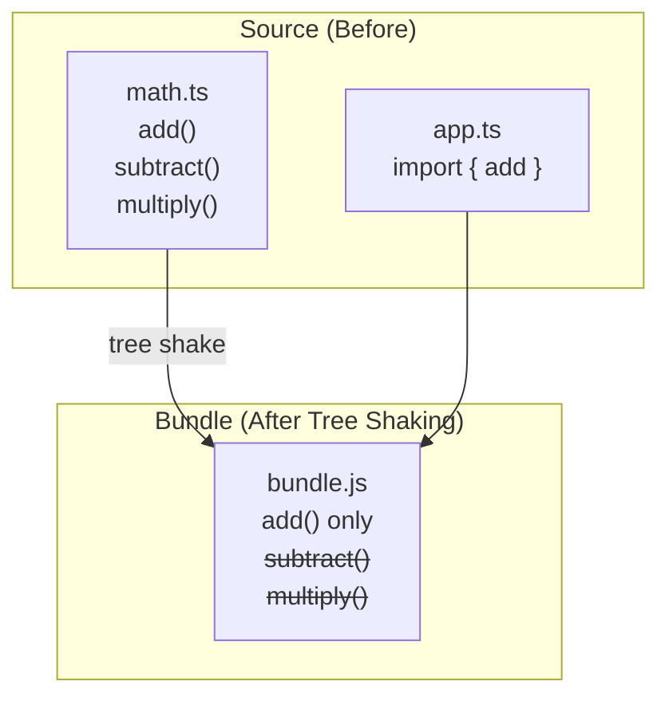
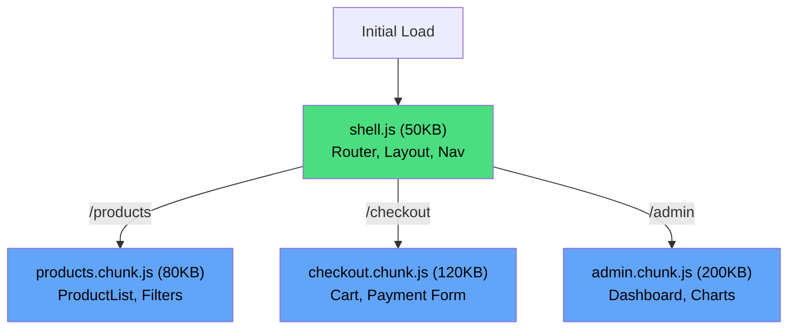

# Bundle Optimization

Every kilobyte of JavaScript you ship to the browser has a cost. It must be downloaded, decompressed, parsed, compiled, and executed — all on the user's device, using their battery and bandwidth. A 1MB JavaScript bundle takes ~4 seconds to process on a mid-range mobile device. For many users, that is the difference between using your app and closing the tab.

Bundle optimization is the discipline of shipping the minimum viable JavaScript to make each page work. This page covers the techniques from first principles — not just how to enable tree shaking or code splitting, but how they work internally and why they sometimes fail.

## Tree Shaking Deep Dive

Tree shaking is dead code elimination for ES modules. The bundler analyzes your import/export graph and removes any exported code that is never imported anywhere.

### How It Works

Tree shaking relies on the **static structure** of ES module `import`/`export` statements. Unlike CommonJS `require()`, ES module imports and exports can be analyzed at build time without executing the code:

```typescript
// math.ts — exports three functions
export function add(a: number, b: number): number {
  return a + b;
}

export function subtract(a: number, b: number): number {
  return a - b;
}

export function multiply(a: number, b: number): number {
  return a * b;
}

// app.ts — only uses add
import { add } from './math';
console.log(add(1, 2));

// After tree shaking:
// subtract and multiply are removed from the bundle
```



### Why Tree Shaking Fails

Tree shaking can only remove code that has **no side effects**. A side effect is any code that affects something outside its own scope when the module is loaded:

```typescript
// SIDE EFFECT: This runs when the module is imported, even if nothing is used
console.log('math module loaded');

export function add(a: number, b: number): number {
  return a + b;
}

// SIDE EFFECT: Modifies global state
window.MathUtils = { version: '1.0' };

export function multiply(a: number, b: number): number {
  return a * b;
}

// The bundler CANNOT remove multiply, because removing the module
// would also remove the side effects (console.log, window mutation),
// which might be intentional.
```

### The sideEffects Field

The `package.json` `sideEffects` field tells bundlers which files are safe to tree-shake:

```json
{
  "name": "my-library",
  "sideEffects": false
}
```

```json
{
  "name": "my-library",
  "sideEffects": [
    "*.css",
    "./src/polyfills.ts",
    "./src/register-globals.ts"
  ]
}
```

::: warning Barrel Files Kill Tree Shaking
Barrel files (`index.ts` that re-export everything) are the #1 reason tree shaking fails in practice:

```typescript
// components/index.ts (barrel file)
export { Button } from './Button';
export { Modal } from './Modal';      // 50KB
export { DataGrid } from './DataGrid'; // 200KB
export { Chart } from './Chart';       // 150KB

// app.ts — only needs Button
import { Button } from './components';
// Depending on the bundler and library, this might pull in
// ALL components because the barrel file is a single module
```

**Fix: Import directly from the source file:**
```typescript
import { Button } from './components/Button';
```
:::

### Verifying Tree Shaking

```typescript
// vite.config.ts — analyze tree shaking results
import { defineConfig } from 'vite';
import { visualizer } from 'rollup-plugin-visualizer';

export default defineConfig({
  plugins: [
    visualizer({
      filename: 'bundle-analysis.html',
      gzipSize: true,
      brotliSize: true,
    }),
  ],
  build: {
    rollupOptions: {
      output: {
        manualChunks: undefined, // Let Rollup optimize
      },
    },
  },
});
```

## Code Splitting Strategies

Code splitting divides your bundle into smaller chunks that are loaded on demand. Instead of one massive `bundle.js`, you ship a small initial chunk and load additional code as the user navigates.

### Route-Based Splitting

The most common and highest-impact strategy — each route gets its own chunk:

```typescript
// React with React.lazy
import { lazy, Suspense } from 'react';

// Each of these becomes a separate chunk
const HomePage = lazy(() => import('./pages/Home'));
const ProductsPage = lazy(() => import('./pages/Products'));
const CheckoutPage = lazy(() => import('./pages/Checkout'));
const AdminDashboard = lazy(() => import('./pages/admin/Dashboard'));

function App() {
  return (
    <Suspense fallback={<PageSkeleton />}>
      <Routes>
        <Route path="/" element={<HomePage />} />
        <Route path="/products" element={<ProductsPage />} />
        <Route path="/checkout" element={<CheckoutPage />} />
        <Route path="/admin/*" element={<AdminDashboard />} />
      </Routes>
    </Suspense>
  );
}
```



### Component-Based Splitting

Split individual heavy components, not just routes:

```typescript
import { lazy, Suspense, useState } from 'react';

// Heavy components loaded only when needed
const MarkdownEditor = lazy(() => import('./MarkdownEditor'));  // 300KB
const ImageCropper = lazy(() => import('./ImageCropper'));      // 150KB
const CodeHighlighter = lazy(() =>
  import('./CodeHighlighter').then((mod) => ({ default: mod.CodeHighlighter }))
);

function ArticleEditor() {
  const [showImageCropper, setShowImageCropper] = useState(false);

  return (
    <div>
      <Suspense fallback={<EditorSkeleton />}>
        <MarkdownEditor />
      </Suspense>

      <button onClick={() => setShowImageCropper(true)}>
        Add Image
      </button>

      {showImageCropper && (
        <Suspense fallback={<CropperSkeleton />}>
          <ImageCropper onComplete={(img) => {
            setShowImageCropper(false);
          }} />
        </Suspense>
      )}
    </div>
  );
}
```

### Vendor Splitting

Separate your code from third-party libraries. Your code changes frequently; vendor code rarely does, so it can be cached aggressively:

```typescript
// vite.config.ts
export default defineConfig({
  build: {
    rollupOptions: {
      output: {
        manualChunks(id) {
          // All node_modules in a vendor chunk
          if (id.includes('node_modules')) {
            // Split large libraries into their own chunks
            if (id.includes('chart.js') || id.includes('d3')) {
              return 'vendor-charts';
            }
            if (id.includes('@tanstack/react-query')) {
              return 'vendor-query';
            }
            if (id.includes('react') || id.includes('react-dom')) {
              return 'vendor-react';
            }
            return 'vendor'; // Everything else
          }
        },
      },
    },
  },
});
```

## Dynamic Imports and Lazy Loading

Dynamic `import()` is the mechanism that enables code splitting. It returns a Promise that resolves to the module:

```typescript
// Prefetching: load the chunk before the user needs it
function ProductCard({ product }: { product: Product }) {
  const handleMouseEnter = () => {
    // Prefetch the product detail page when user hovers
    import('./pages/ProductDetail');
  };

  return (
    <Link
      to={`/products/${product.id}`}
      onMouseEnter={handleMouseEnter}
      onFocus={handleMouseEnter}
    >
      <h3>{product.name}</h3>
    </Link>
  );
}

// Conditional loading based on feature flags
async function loadEditor(): Promise<typeof import('./RichEditor')> {
  const flags = await getFeatureFlags();

  if (flags.newEditor) {
    return import('./RichEditorV2');
  }
  return import('./RichEditor');
}

// Loading based on user interaction
document.getElementById('export-btn')!.addEventListener('click', async () => {
  const { exportToPDF } = await import('./pdf-exporter');
  await exportToPDF(document.getElementById('report')!);
});
```

### Prefetch and Preload Hints

```html
<!-- Prefetch: low-priority, load when browser is idle -->
<link rel="prefetch" href="/chunks/checkout.chunk.js">

<!-- Preload: high-priority, load immediately -->
<link rel="preload" href="/chunks/critical-above-fold.js" as="script">

<!-- Module preload: for ES modules specifically -->
<link rel="modulepreload" href="/chunks/app.js">
```

```typescript
// Vite automatically adds prefetch/preload for dynamic imports
// You can also add magic comments in webpack:

// webpack magic comments
const AdminPage = lazy(() =>
  import(
    /* webpackChunkName: "admin" */
    /* webpackPrefetch: true */
    './pages/Admin'
  )
);
```

## Bundle Analysis

You cannot optimize what you cannot see. Bundle analyzers visualize your dependency graph, showing exactly what is in your bundle and how large each piece is.

### Tools

| Tool | Bundler | What It Shows |
|------|---------|--------------|
| `rollup-plugin-visualizer` | Vite / Rollup | Interactive treemap of all modules |
| `webpack-bundle-analyzer` | Webpack | Treemap with raw/gzip/parsed sizes |
| `source-map-explorer` | Any (needs source maps) | Treemap from source maps |
| `bundle-buddy` | Any | Duplicated modules across chunks |
| `bundlephobia.com` | npm packages | Size impact of adding a dependency |
| `pkg-size.dev` | npm packages | Actual bundle size after tree shaking |

### Setting Up Analysis

```typescript
// Vite: rollup-plugin-visualizer
import { visualizer } from 'rollup-plugin-visualizer';

export default defineConfig({
  plugins: [
    visualizer({
      filename: 'stats.html',
      open: true,
      gzipSize: true,
      brotliSize: true,
      template: 'treemap', // or 'sunburst', 'network'
    }),
  ],
});
```

```typescript
// Webpack: webpack-bundle-analyzer
const { BundleAnalyzerPlugin } = require('webpack-bundle-analyzer');

module.exports = {
  plugins: [
    new BundleAnalyzerPlugin({
      analyzerMode: 'static',
      reportFilename: 'bundle-report.html',
      openAnalyzer: false,
    }),
  ],
};
```

### What to Look For

```
Common bundle analysis findings:

1. DUPLICATE DEPENDENCIES
   - lodash appears 3 times (different versions)
   - Fix: dedupe in package.json, or use lodash-es

2. UNUSED LARGE LIBRARIES
   - moment.js (300KB) imported for one date format call
   - Fix: replace with date-fns (tree-shakeable) or Intl.DateTimeFormat

3. ENTIRE LIBRARY IMPORTED
   - import _ from 'lodash' pulls in 70KB
   - Fix: import debounce from 'lodash/debounce' (4KB)

4. HEAVY POLYFILLS
   - core-js shipping 200KB of polyfills for features your targets support
   - Fix: configure browserslist, use useBuiltIns: 'usage'

5. DEV-ONLY CODE IN PRODUCTION
   - PropTypes, debug logging, or test utilities in the bundle
   - Fix: DefinePlugin / import.meta.env.PROD guards
```

## Module/Nomodule Pattern

The module/nomodule pattern serves modern JavaScript to modern browsers and transpiled JavaScript with polyfills to legacy browsers:

```html
<!-- Modern browsers: ES2020, no polyfills, smaller bundle -->
<script type="module" src="/app.modern.js"></script>

<!-- Legacy browsers (IE11, old Safari): ES5, polyfills, larger bundle -->
<script nomodule src="/app.legacy.js"></script>
```

Modern browsers understand `type="module"` and ignore `nomodule`. Legacy browsers ignore `type="module"` and load `nomodule`. The result: 85%+ of users get the smaller, faster bundle.

```typescript
// vite.config.ts — Vite handles this with @vitejs/plugin-legacy
import legacy from '@vitejs/plugin-legacy';

export default defineConfig({
  plugins: [
    legacy({
      targets: ['defaults', 'not IE 11'],
      // Generates both modern and legacy bundles automatically
    }),
  ],
});
```

### Size Impact

| | Modern Bundle | Legacy Bundle | Savings |
|---|---|---|---|
| **JavaScript** | 180 KB | 320 KB | 44% smaller |
| **Polyfills** | 0 KB | 85 KB | No polyfills |
| **Parse time** | ~40ms | ~110ms | 63% faster |
| **Users served** | 95%+ | 5% | Most users get fast bundle |

## Compression

The final optimization before bytes hit the wire is compression. All modern bundled assets should be served with either Brotli or gzip compression.

### Brotli vs Gzip

| | Brotli | Gzip |
|---|---|---|
| **Compression ratio** | 15-20% better than gzip | Baseline |
| **Compression speed** | Slower (use pre-compression) | Faster |
| **Decompression speed** | Same as gzip | Baseline |
| **Browser support** | 97%+ (HTTPS only) | Universal |
| **Best for** | Static assets (pre-compressed) | Dynamic responses |

### Pre-Compressing at Build Time

```typescript
// vite.config.ts — pre-compress during build
import viteCompression from 'vite-plugin-compression';

export default defineConfig({
  plugins: [
    // Generate .br files (Brotli)
    viteCompression({
      algorithm: 'brotliCompress',
      ext: '.br',
      threshold: 1024, // Only compress files > 1KB
    }),
    // Generate .gz files (gzip fallback)
    viteCompression({
      algorithm: 'gzip',
      ext: '.gz',
      threshold: 1024,
    }),
  ],
});
```

### Nginx Configuration

```nginx
# Serve pre-compressed files
location /assets/ {
    # Try Brotli first, then gzip, then uncompressed
    gzip_static on;
    brotli_static on;

    # Aggressive caching for hashed assets
    add_header Cache-Control "public, max-age=31536000, immutable";

    # Correct content types
    types {
        application/javascript js mjs;
        text/css css;
        image/svg+xml svg;
        application/wasm wasm;
    }
}
```

### Compression Impact

```
Typical compression results for a 500KB JavaScript bundle:

Uncompressed:     500 KB
Gzip (level 9):   145 KB  (71% reduction)
Brotli (level 11): 120 KB  (76% reduction)

Transfer time on 4G (15 Mbps):
Uncompressed:     267 ms
Gzip:              77 ms
Brotli:            64 ms
```

## Edge-Side Includes (ESI)

ESI allows you to compose pages at the CDN edge, serving cached fragments with dynamic pieces:

```html
<!-- The CDN assembles this page from cached fragments -->
<html>
<head>
  <title>Product Page</title>
  <!-- Cached for 1 year -->
  <esi:include src="/fragments/critical-css" />
</head>
<body>
  <!-- Cached for 1 hour -->
  <esi:include src="/fragments/header" />

  <!-- Cached for 5 minutes (product data changes) -->
  <esi:include src="/fragments/product/abc-123" />

  <!-- Not cached (personalized) -->
  <esi:include src="/fragments/recommendations?user=current" />

  <!-- Cached for 1 year (rarely changes) -->
  <esi:include src="/fragments/footer" />
</body>
</html>
```

ESI is supported by Varnish, Akamai, Fastly, and Cloudflare. It enables per-fragment caching — the header can be cached for a day while the product price fragment is cached for 5 minutes.

## Optimization Checklist

### Build Configuration

- [ ] Enable tree shaking (`sideEffects: false` in libraries)
- [ ] Configure route-based code splitting
- [ ] Set up vendor chunk splitting
- [ ] Enable Brotli and gzip pre-compression
- [ ] Configure `browserslist` targets to avoid unnecessary transpilation
- [ ] Add bundle analysis to CI pipeline

### Dependency Hygiene

- [ ] Audit dependencies with bundle analyzer quarterly
- [ ] Replace heavy libraries with lighter alternatives (moment -> date-fns, lodash -> lodash-es)
- [ ] Import only what you use (no barrel file imports for external libraries)
- [ ] Remove unused dependencies (`depcheck`, `knip`)
- [ ] Check for duplicate packages (`npm ls <package>`)

### Runtime Loading

- [ ] Lazy load below-the-fold components
- [ ] Prefetch likely next navigations
- [ ] Use `modulepreload` for critical dynamic chunks
- [ ] Implement the facade pattern for heavy third-party widgets
- [ ] Use Web Workers for CPU-intensive operations

## Further Reading

- [Web Performance & Core Web Vitals](/frontend-engineering/web-performance) — Measure the impact of bundle optimization on real users
- [Browser Rendering Pipeline](/frontend-engineering/browser-rendering) — Understand how JavaScript execution blocks rendering
- [Micro-Frontends](/frontend-engineering/micro-frontends) — Code splitting at the architectural level with Module Federation
- [Rendering Strategies](/frontend-engineering/rendering-strategies) — SSR and RSC reduce client-side JavaScript by moving work to the server
- [Infrastructure > CI/CD](/infrastructure/ci-cd/) — Enforce bundle budgets in your CI pipeline
