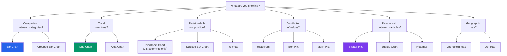
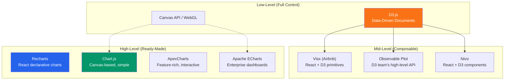
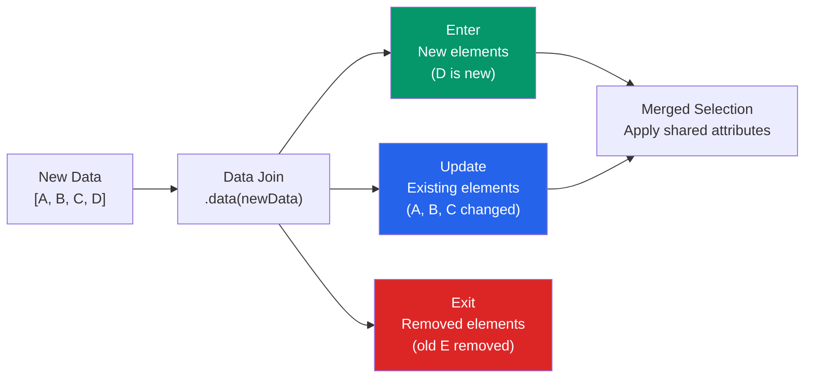
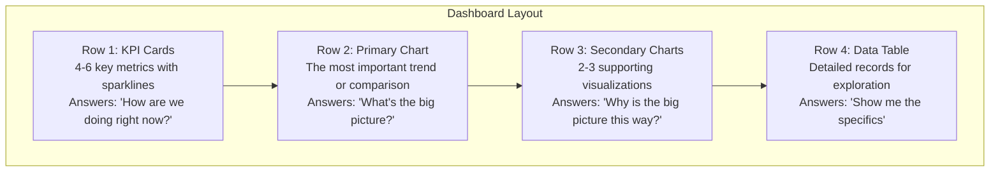

# Data Visualization Engineering

Data visualization is the art of making numbers tell stories. A well-designed chart reveals patterns that a spreadsheet hides. A poorly designed one misleads, confuses, or is simply ignored. As a frontend engineer, you will build dashboards, analytics views, monitoring panels, and reporting interfaces — all of which depend on choosing the right chart, the right library, and the right interaction model. This page covers the engineering of data visualization: which libraries to use, which chart types to choose, how to handle real-time data, and how to make charts accessible to everyone.

## Choosing the Right Chart Type

### The Decision Framework

The first question is always: **what relationship in the data are you showing?**



### Chart Type Reference

| Data Relationship | Best Chart Types | Avoid |
|------------------|-----------------|-------|
| **Comparison** (5-15 categories) | Bar chart (horizontal for long labels) | Pie chart (hard to compare angles) |
| **Comparison** (2-3 categories) | Bar chart, or just use numbers | Anything — three numbers don't need a chart |
| **Trend** (time series, single metric) | Line chart | Bar chart (implies discrete categories) |
| **Trend** (time series, stacked) | Stacked area chart | Stacked line chart (visually ambiguous) |
| **Part-to-whole** (2-5 parts) | Donut chart, stacked bar | Pie chart with > 5 slices |
| **Part-to-whole** (many parts) | Treemap, stacked bar | Pie chart (unusable with many slices) |
| **Distribution** (single variable) | Histogram, box plot | Bar chart (not the same as a histogram) |
| **Correlation** (two variables) | Scatter plot | Line chart (implies sequential relationship) |
| **Correlation** (three variables) | Bubble chart (x, y, size) | 3D charts (hard to read) |
| **Geographic** (density/value by region) | Choropleth map | Dot map for aggregated data |

::: warning
Avoid pie charts in almost all cases. Humans are bad at comparing angles and areas. A horizontal bar chart is almost always clearer. The only exception: showing a simple "X% vs the rest" relationship where the part-to-whole ratio is the primary message (e.g., "78% of users are on mobile").
:::

## Library Comparison

### The Landscape



### Detailed Comparison

| Library | Rendering | React? | Bundle Size | Learning Curve | Custom Charts | Best For |
|---------|-----------|--------|-------------|----------------|---------------|----------|
| **D3.js** | SVG/Canvas | No (manual) | ~80 KB | Steep | Unlimited | Fully custom, novel visualizations |
| **Visx** | SVG | Yes (native) | ~30 KB (tree-shakeable) | Medium | High | Custom React charts with D3 power |
| **Recharts** | SVG | Yes (native) | ~50 KB | Low | Medium | Standard business charts in React |
| **Chart.js** | Canvas | Via wrapper | ~60 KB | Low | Medium | Simple charts, any framework |
| **Nivo** | SVG/Canvas | Yes (native) | ~40 KB (per chart) | Low | Medium | Beautiful defaults, server rendering |
| **Apache ECharts** | Canvas/SVG | Via wrapper | ~300 KB | Medium | High | Complex dashboards, large datasets |
| **ApexCharts** | SVG | Via wrapper | ~120 KB | Low | Medium | Interactive charts, annotations |
| **Observable Plot** | SVG | No | ~40 KB | Low | Medium | Exploratory data analysis |

### When to Use What

| Scenario | Recommended Library |
|----------|-------------------|
| React app, standard business charts (bars, lines, pies) | **Recharts** |
| React app, custom/unique visualizations | **Visx** |
| Any framework, simple charts, need Canvas performance | **Chart.js** |
| Enterprise dashboard with 10+ chart types | **Apache ECharts** |
| Completely novel visualization (force graph, treemap, custom) | **D3.js** |
| Quick data exploration / notebook-style | **Observable Plot** |
| React app, beautiful out-of-box, server rendering needed | **Nivo** |

## D3.js Patterns

### Core Concepts

D3 is not a charting library — it is a set of utilities for binding data to DOM elements and applying data-driven transformations.

```typescript
import * as d3 from 'd3';

// The fundamental pattern: Data Join
// select elements → bind data → handle enter/update/exit

function renderBarChart(data: { label: string; value: number }[]) {
  const svg = d3.select('#chart')
    .attr('width', 600)
    .attr('height', 400);

  const margin = { top: 20, right: 20, bottom: 40, left: 60 };
  const width = 600 - margin.left - margin.right;
  const height = 400 - margin.top - margin.bottom;

  const g = svg.append('g')
    .attr('transform', `translate(${margin.left},${margin.top})`);

  // Scales: map data values to pixel positions
  const x = d3.scaleBand()
    .domain(data.map(d => d.label))
    .range([0, width])
    .padding(0.2);

  const y = d3.scaleLinear()
    .domain([0, d3.max(data, d => d.value)!])
    .nice()
    .range([height, 0]);

  // Axes
  g.append('g')
    .attr('transform', `translate(0,${height})`)
    .call(d3.axisBottom(x));

  g.append('g')
    .call(d3.axisLeft(y));

  // Data join: bars
  g.selectAll('.bar')
    .data(data)
    .join('rect')
      .attr('class', 'bar')
      .attr('x', d => x(d.label)!)
      .attr('y', d => y(d.value))
      .attr('width', x.bandwidth())
      .attr('height', d => height - y(d.value))
      .attr('fill', '#2563eb');
}
```

### The Enter-Update-Exit Pattern



```typescript
// Modern D3 (v7+): .join() simplifies enter-update-exit
function updateChart(data: number[]) {
  d3.select('#chart')
    .selectAll('circle')
    .data(data, (d, i) => i)  // Key function for identity
    .join(
      enter => enter.append('circle')   // New data points
        .attr('r', 0)
        .attr('fill', '#2563eb')
        .call(enter => enter.transition()
          .attr('r', 5)),
      update => update                   // Changed data points
        .call(update => update.transition()
          .attr('cx', (d, i) => i * 30)
          .attr('cy', d => 200 - d)),
      exit => exit                       // Removed data points
        .call(exit => exit.transition()
          .attr('r', 0)
          .remove())
    );
}
```

### Reusable Chart Pattern

```typescript
// The "reusable chart" pattern (Mike Bostock's convention)
function barChart() {
  // Configuration with defaults
  let width = 600;
  let height = 400;
  let color = '#2563eb';
  let xAccessor = (d: any) => d.label;
  let yAccessor = (d: any) => d.value;

  function chart(selection: d3.Selection<any, any, any, any>) {
    selection.each(function(data) {
      // Build chart using current configuration
      const svg = d3.select(this);
      // ... (full chart implementation using width, height, color, accessors)
    });
  }

  // Chainable setters
  chart.width = function(_: number) { width = _; return chart; };
  chart.height = function(_: number) { height = _; return chart; };
  chart.color = function(_: string) { color = _; return chart; };
  chart.x = function(_: (d: any) => string) { xAccessor = _; return chart; };
  chart.y = function(_: (d: any) => number) { yAccessor = _; return chart; };

  return chart;
}

// Usage
const myChart = barChart()
  .width(800)
  .height(300)
  .color('#059669');

d3.select('#container')
  .datum(data)
  .call(myChart);
```

## Recharts: Declarative Charts in React

```tsx
import {
  BarChart, Bar, XAxis, YAxis, CartesianGrid,
  Tooltip, Legend, ResponsiveContainer
} from 'recharts';

const data = [
  { month: 'Jan', revenue: 4000, costs: 2400 },
  { month: 'Feb', revenue: 3000, costs: 1398 },
  { month: 'Mar', revenue: 2000, costs: 9800 },
  { month: 'Apr', revenue: 2780, costs: 3908 },
  { month: 'May', revenue: 1890, costs: 4800 },
];

function RevenueChart() {
  return (
    <ResponsiveContainer width="100%" height={400}>
      <BarChart data={data} margin={​{ top: 20, right: 30, left: 20, bottom: 5 }​}>
        <CartesianGrid strokeDasharray="3 3" />
        <XAxis dataKey="month" />
        <YAxis />
        <Tooltip />
        <Legend />
        <Bar dataKey="revenue" fill="#2563eb" name="Revenue" />
        <Bar dataKey="costs" fill="#dc2626" name="Costs" />
      </BarChart>
    </ResponsiveContainer>
  );
}
```

## Dashboard Design Principles

### Layout Hierarchy



### Dashboard Design Rules

| Principle | Implementation |
|-----------|---------------|
| **5-second rule** | The dashboard's main message should be clear within 5 seconds |
| **Progressive disclosure** | Summary at top, details on demand (drill-down, hover) |
| **Consistent colors** | "Revenue" is always blue, "Costs" is always red — across ALL charts |
| **No chart junk** | Remove gridlines, borders, and decorations that don't encode data |
| **Proper aspect ratio** | Time series should be wider than tall (~3:1). Avoid square charts for trends. |
| **Meaningful zero** | Y-axis should start at zero for bar charts (truncated y-axis misleads) |
| **Data density** | Every pixel should earn its place. Remove anything that doesn't inform. |

::: tip
Edward Tufte's "data-ink ratio" principle: maximize the share of ink (pixels) used to present data, and minimize the share used for non-data elements (borders, gridlines, backgrounds, legend boxes). A chart is finished not when there is nothing more to add, but when there is nothing left to take away.
:::

### Color Palettes for Data

```typescript
// Categorical palette (for different categories)
const categorical = [
  '#2563eb', // Blue
  '#dc2626', // Red
  '#059669', // Green
  '#d97706', // Amber
  '#7c3aed', // Purple
  '#0891b2', // Cyan
  '#e11d48', // Rose
  '#65a30d', // Lime
];

// Sequential palette (for magnitude/intensity)
const sequential = [
  '#eff6ff', '#dbeafe', '#bfdbfe', '#93c5fd',
  '#60a5fa', '#3b82f6', '#2563eb', '#1d4ed8',
];

// Diverging palette (for positive/negative, above/below threshold)
const diverging = [
  '#dc2626', '#ef4444', '#f87171', '#fca5a5', // Negative
  '#f5f5f5',                                     // Neutral
  '#86efac', '#4ade80', '#22c55e', '#16a34a',  // Positive
];
```

::: warning
Never use red/green as the only differentiator — approximately 8% of men have red-green color blindness. Always combine color with another visual channel: pattern, shape, label, or position.
:::

## Real-Time Data Visualization

### WebSocket + Chart Update Pattern

```typescript
import { useEffect, useRef, useState } from 'react';

interface DataPoint {
  timestamp: number;
  value: number;
}

function useRealtimeData(wsUrl: string, maxPoints: number = 100) {
  const [data, setData] = useState<DataPoint[]>([]);
  const wsRef = useRef<WebSocket | null>(null);

  useEffect(() => {
    wsRef.current = new WebSocket(wsUrl);

    wsRef.current.onmessage = (event) => {
      const point: DataPoint = JSON.parse(event.data);

      setData(prev => {
        const updated = [...prev, point];
        // Keep only the last N points (sliding window)
        return updated.slice(-maxPoints);
      });
    };

    return () => wsRef.current?.close();
  }, [wsUrl, maxPoints]);

  return data;
}

// Usage with Recharts
function RealtimeMetricChart({ wsUrl }: { wsUrl: string }) {
  const data = useRealtimeData(wsUrl, 60); // Last 60 data points

  return (
    <ResponsiveContainer width="100%" height={300}>
      <LineChart data={data}>
        <XAxis
          dataKey="timestamp"
          tickFormatter={(ts) => new Date(ts).toLocaleTimeString()}
          domain={['dataMin', 'dataMax']}
        />
        <YAxis domain={['auto', 'auto']} />
        <Line
          type="monotone"
          dataKey="value"
          stroke="#2563eb"
          dot={false}
          isAnimationActive={false}  // Disable animation for real-time
        />
      </LineChart>
    </ResponsiveContainer>
  );
}
```

### Performance for Large Datasets

| Technique | When to Use | How |
|-----------|-------------|-----|
| **Canvas rendering** | > 1,000 data points | Use Chart.js or ECharts (Canvas-based) |
| **Data aggregation** | > 10,000 data points | Pre-aggregate on the server (1-min/5-min buckets) |
| **Viewport windowing** | Large time range with zoom | Only render visible data points |
| **Web Workers** | Heavy data processing | Move calculation off main thread |
| **RequestAnimationFrame** | Smooth real-time updates | Batch DOM updates to 60fps |
| **WebGL** | > 100,000 data points | Use deck.gl or regl for GPU-accelerated rendering |

```typescript
// Data decimation: reduce 10,000 points to ~500 for display
function decimateData(
  data: DataPoint[],
  targetPoints: number
): DataPoint[] {
  if (data.length <= targetPoints) return data;

  const step = Math.ceil(data.length / targetPoints);
  const result: DataPoint[] = [data[0]]; // Always include first point

  for (let i = step; i < data.length - 1; i += step) {
    // LTTB algorithm: pick point that creates largest triangle
    // with previous and next selected points
    const window = data.slice(i, Math.min(i + step, data.length));
    const prev = result[result.length - 1];
    const nextAvg = data.slice(i + step, i + 2 * step)
      .reduce((sum, p) => sum + p.value, 0) / step;

    // Pick the point that maximizes triangle area
    let maxArea = -1;
    let bestPoint = window[0];
    for (const point of window) {
      const area = Math.abs(
        (prev.timestamp - point.timestamp) * (nextAvg - prev.value) -
        (prev.timestamp - (point.timestamp + step)) * (point.value - prev.value)
      ) / 2;
      if (area > maxArea) {
        maxArea = area;
        bestPoint = point;
      }
    }
    result.push(bestPoint);
  }

  result.push(data[data.length - 1]); // Always include last point
  return result;
}
```

## Accessibility in Charts

### The Problem

Charts are inherently visual. Screen readers cannot interpret an SVG bar chart. Color-blind users cannot distinguish categories differentiated only by color. Keyboard users cannot interact with hover tooltips. Making charts accessible requires deliberate engineering.

### WCAG Requirements for Charts

| Requirement | Level | Implementation |
|------------|-------|----------------|
| **Text alternatives** | A | Provide `alt` text or `aria-label` describing the chart's key message |
| **Color not sole indicator** | A | Use patterns, shapes, or labels in addition to color |
| **Sufficient contrast** | AA | 3:1 ratio for graphical elements, 4.5:1 for text |
| **Keyboard accessible** | A | All interactive elements reachable via Tab and operable via Enter/Space |
| **Screen reader support** | A | Data table alternative or ARIA live regions for updates |

### Implementation Pattern

```tsx
function AccessibleBarChart({ data, title, description }: Props) {
  return (
    <figure role="figure" aria-label={title}>
      {/* Visual chart */}
      <div
        role="img"
        aria-label={description}
        aria-describedby="chart-data-table"
      >
        <ResponsiveContainer width="100%" height={400}>
          <BarChart data={data}>
            {/* ... chart components */}
          </BarChart>
        </ResponsiveContainer>
      </div>

      {/* Screen reader: data table alternative */}
      <table
        id="chart-data-table"
        className="sr-only"  /* Visually hidden, readable by screen readers */
      >
        <caption>{title}</caption>
        <thead>
          <tr>
            <th scope="col">Category</th>
            <th scope="col">Value</th>
          </tr>
        </thead>
        <tbody>
          {data.map(item => (
            <tr key={item.label}>
              <td>{item.label}</td>
              <td>{item.value}</td>
            </tr>
          ))}
        </tbody>
      </table>

      {/* Visible caption */}
      <figcaption>{title}</figcaption>
    </figure>
  );
}
```

### Color Blind Safe Palettes

```typescript
// Safe for protanopia, deuteranopia, and tritanopia
const colorBlindSafe = {
  // IBM Design Library color-blind safe palette
  palette: ['#648FFF', '#785EF0', '#DC267F', '#FE6100', '#FFB000'],

  // Or use patterns in addition to color
  patterns: [
    'solid',           // First series: solid fill
    'diagonal-stripe', // Second series: diagonal lines
    'dots',            // Third series: dot pattern
    'crosshatch',      // Fourth series: crosshatch
    'horizontal-line', // Fifth series: horizontal lines
  ],
};
```

::: tip
Test your charts with a color blindness simulator like Chrome DevTools' "Emulate vision deficiencies" (Rendering tab) or the Colorblindly browser extension. If your chart is unreadable with deuteranopia simulation, it is inaccessible to 6% of male users.
:::

## Common Mistakes

| Mistake | Problem | Fix |
|---------|---------|-----|
| **Truncated Y-axis** | Bar chart starting at 50 instead of 0 exaggerates differences | Always start bar chart Y-axis at 0; line charts can use auto-range |
| **Pie chart with 12 slices** | Impossible to compare thin slices | Use a bar chart instead |
| **3D charts** | Perspective distortion makes accurate reading impossible | Always use 2D |
| **Dual Y-axis** | Misleading — you can make any two trends look correlated | Use two separate charts |
| **Animation overuse** | 2-second entry animations hide data | Keep animations under 300ms or disable |
| **No axis labels** | "What does this number mean?" | Always label axes with units |
| **Too many colors** | Visual noise, impossible to decode | Max 6-8 categorical colors; group "Other" |

## Related Pages

- [Web Performance](/frontend-engineering/web-performance) — performance considerations for chart-heavy pages
- [Browser Rendering Pipeline](/frontend-engineering/browser-rendering) — understanding why Canvas outperforms SVG at scale
- [State Management](/frontend-engineering/state-management) — managing real-time data flow for live dashboards
- [WCAG Compliance Engineering](/ui-design-systems/accessibility/wcag-compliance) — the full accessibility standard behind chart accessibility
- [WebAssembly](/frontend-engineering/webassembly) — using WASM for heavy data processing before visualization

---

::: tip Key Takeaway
- The first question before choosing a chart type is always "what relationship in the data am I showing?" — comparison, trend, distribution, correlation, or part-to-whole each demand a specific chart type.
- Avoid pie charts in almost all cases — humans are bad at comparing angles, and a horizontal bar chart is clearer for virtually every comparison except simple "X% vs the rest."
- Accessibility is not optional: charts must have text alternatives, color-blind-safe palettes, keyboard navigation, and screen-reader-compatible data tables as fallbacks.
:::

::: warning Common Misconceptions
- **"D3.js is a charting library."** D3 is a set of low-level utilities for binding data to DOM elements. It does not provide pre-built charts — you build them from primitives (scales, axes, shapes). Use Recharts or Chart.js if you want ready-made charts.
- **"SVG is always the right rendering choice."** SVG performs well up to ~1,000 data points. Beyond that, Canvas (Chart.js, ECharts) or WebGL (deck.gl) is necessary because SVG creates a DOM node per element, and DOM manipulation does not scale to 10,000+ nodes.
- **"More data on the dashboard is better."** Dashboards should follow the 5-second rule: the main message should be clear within 5 seconds. Overloading a dashboard with 15 charts makes it impossible to extract insight. Prioritize 3-5 key visualizations.
- **"Dual Y-axes are useful."** Dual Y-axes let you make any two unrelated trends look correlated by adjusting the scales. They are actively misleading. Use two separate charts instead.
- **"3D charts add a dimension of information."** 3D perspective distortion makes accurate reading impossible. A bar that is "behind" another appears shorter due to perspective, not data. Always use 2D charts.
:::

## When NOT to Use Charts

- **Three or fewer numbers** — If you are comparing two or three values, just display the numbers with appropriate formatting. A bar chart for "Revenue: $1.2M, Costs: $800K" adds visual overhead without adding insight.
- **Data that changes every second** — Real-time dashboards with sub-second updates can cause motion sickness and cognitive overload. Aggregate to 5-second or 1-minute intervals unless the use case demands it (e.g., trading).
- **When a table is clearer** — If users need to look up specific values (exact prices, timestamps, IDs), a sortable/filterable data table is more useful than any chart. Charts show patterns; tables show specifics.
- **Decorative purposes** — A chart whose only purpose is to make a slide or dashboard look "data-driven" without conveying actionable information is chart junk. Remove it.

::: tip In Production
- **Airbnb** built Visx (an open-source library) to combine D3's power with React's component model, enabling their data teams to create custom visualizations for host analytics dashboards.
- **Spotify** uses D3.js for their "Wrapped" year-in-review visualizations, which require novel, highly custom chart types that no pre-built library supports.
- **Netflix** uses Apache ECharts for their internal operational dashboards, handling real-time metrics from thousands of microservices with Canvas rendering for performance.
- **Shopify** uses Polaris Viz (their open-source chart library built on D3) across their merchant admin, ensuring consistent visual language with their design system.
- **The New York Times** is famous for their D3.js-powered data journalism visualizations, often using custom interactive charts that D3's low-level primitives make possible.
:::

::: details Quiz

**1. When should you use a line chart vs a bar chart?**

::: details Answer
Line charts show trends over continuous time (sequential data where order matters). Bar charts show comparisons between discrete categories. A line chart for "revenue by country" implies a sequence between countries that does not exist. A bar chart for "daily revenue over 30 days" implies discrete buckets when the data is continuous. Match the chart to the data relationship.
:::

**2. Why is color alone insufficient for differentiating chart categories?**

::: details Answer
Approximately 8% of men have red-green color blindness (deuteranopia/protanopia). Using only red and green to differentiate categories makes the chart unreadable for them. Always combine color with another visual channel: patterns (stripes, dots), shapes (circles, squares for scatter plots), labels, or position.
:::

**3. What is the LTTB algorithm and when do you need it?**

::: details Answer
Largest Triangle Three Buckets (LTTB) is a data decimation algorithm that reduces thousands of data points to a visually representative subset. For each bucket of points, it selects the point that creates the largest triangle with the previous and next selected points, preserving the visual shape of the data. Use it when you have 10,000+ data points but only 500-1,000 pixels to render them.
:::

**4. How do you make a chart accessible to screen reader users?**

::: details Answer
Wrap the chart in a `<figure>` with `role="figure"` and `aria-label`. Mark the visual chart `div` with `role="img"` and a descriptive `aria-label`. Provide a visually hidden (`sr-only`) data table with the same data as the chart, referenced via `aria-describedby`. This gives screen reader users access to the underlying data in a structured format.
:::

**5. What is Edward Tufte's "data-ink ratio" principle?**

::: details Answer
The data-ink ratio is the share of ink (pixels) used to present actual data versus non-data elements (gridlines, borders, background fills, legend boxes, decorative elements). Maximizing this ratio means removing anything that does not directly encode data. A chart is finished not when there is nothing more to add, but when there is nothing left to take away.
:::

:::

::: details Exercise
**Dashboard Design Challenge**

Design a dashboard for a SaaS product's admin panel showing key business metrics. The dashboard should communicate the following:

1. Monthly Recurring Revenue (MRR) trend over 12 months
2. Customer acquisition by channel (organic, paid, referral, direct)
3. Churn rate vs industry benchmark
4. Top 10 customers by revenue
5. User activity heatmap (hour of day vs day of week)

For each metric:
- Choose the correct chart type and justify it
- Specify the chart library you would use
- Define the color palette (must be color-blind safe)
- Describe the accessibility implementation

::: details Solution
| Metric | Chart Type | Justification | Library |
|--------|-----------|---------------|---------|
| MRR trend | Line chart with area fill | Continuous time series showing trend | Recharts |
| Acquisition by channel | Horizontal bar chart | Comparing 4 discrete categories | Recharts |
| Churn rate | Line chart with reference line | Trend over time with benchmark comparison | Recharts |
| Top 10 customers | Horizontal bar chart (sorted) | Comparison between categories, long labels | Recharts |
| Activity heatmap | Heatmap (7x24 grid) | Two categorical axes with intensity | Visx or D3 |

**Color palette (IBM color-blind safe):**
```typescript
const palette = ['#648FFF', '#785EF0', '#DC267F', '#FE6100', '#FFB000'];
```

**Layout (top to bottom):**
1. Row 1: KPI cards (MRR, Total Customers, Churn Rate, NPS) with sparklines
2. Row 2: MRR line chart (full width, 3:1 aspect ratio)
3. Row 3: Acquisition bar chart (left half) + Churn line chart (right half)
4. Row 4: Top 10 customers bar chart (left half) + Activity heatmap (right half)

**Accessibility per chart:**
- Each chart wrapped in `<figure role="figure" aria-label="[description]">`
- Hidden data table with `class="sr-only"` containing the same data
- All charts use patterns (stripes, dots) in addition to color
- Keyboard-navigable tooltips on focus
:::

:::

> **One-Liner Summary:** Data visualization is making numbers tell stories — choose the chart type that matches the relationship in your data, and remove every pixel that does not encode information.
