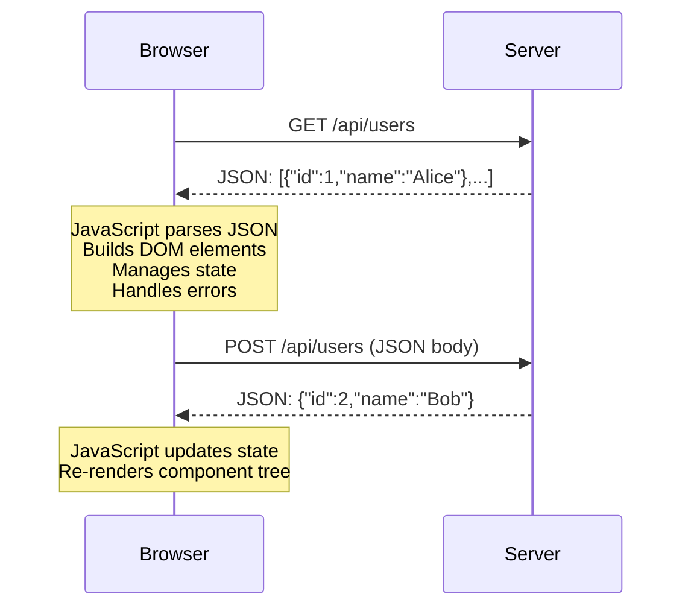
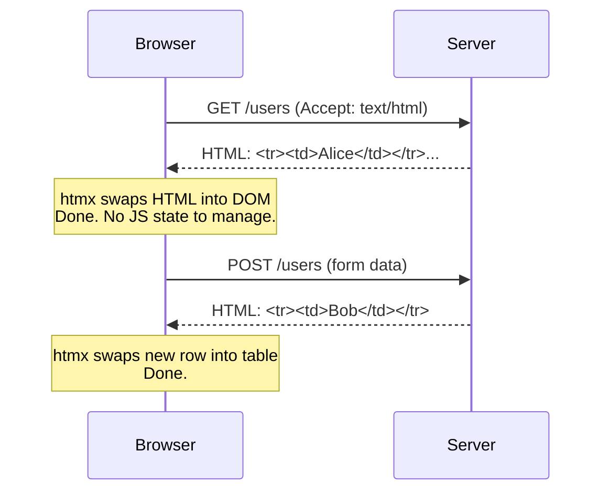
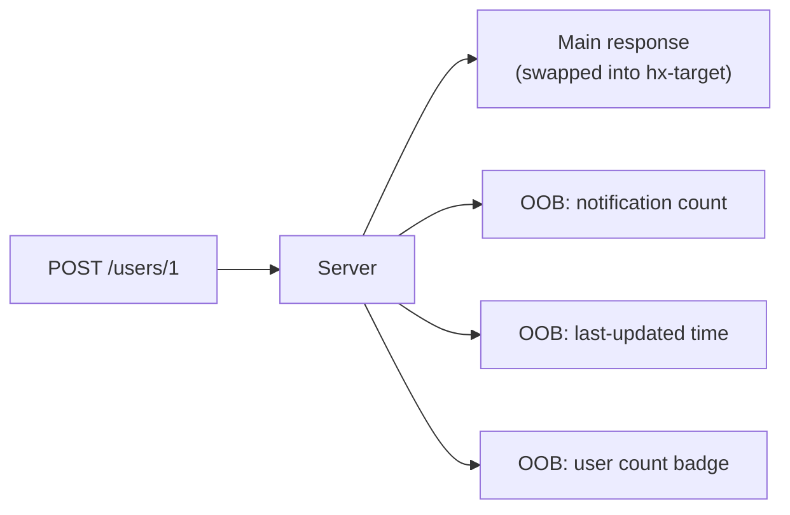

# htmx

htmx is a JavaScript library that gives HTML the ability to make HTTP requests, handle server responses, and update the DOM — all through HTML attributes, with no JavaScript required on your part. Instead of fetching JSON and rendering it client-side, htmx fetches HTML from the server and swaps it directly into the page.

This is not a step backward. It is a return to the hypermedia architecture that the web was built on, with modern capabilities (AJAX, WebSockets, SSE, CSS transitions) layered on top. The result is dramatically simpler applications: no client-side state management, no JSON serialization/deserialization, no component lifecycle, no build step.

htmx matters because it challenges the assumption that every web application needs a JavaScript framework. For many applications — admin panels, dashboards, CRUD apps, content sites with interactive elements — htmx with a server-side language produces the same UX with a fraction of the complexity.

**Related**: [Rendering Strategies](/frontend-engineering/rendering-strategies) | [Web Performance](/frontend-engineering/web-performance) | [State Management](/frontend-engineering/state-management)

---

## The Hypermedia Approach

### How Traditional SPAs Work



### How htmx Works



The key insight: **the server returns HTML, not JSON**. The server does the rendering. The client does the swapping. There is no client-side application state to synchronize.

### Why This Matters

| SPA Approach | htmx Approach |
|-------------|--------------|
| Server returns JSON | Server returns HTML |
| Client renders UI | Server renders UI |
| Client manages state | Server is the source of truth |
| Requires framework (React, Vue, etc.) | Requires HTML attributes |
| JSON serialization/deserialization | No serialization |
| Complex build pipeline | No build step (or optional) |
| Full page data in memory | Only visible DOM in memory |
| 50-500KB JS framework | 14KB htmx library |

---

## Getting Started

### Installation

```html
<!-- CDN (simplest) -->
<script src="https://unpkg.com/htmx.org@2.0.4"></script>

<!-- Or download and self-host -->
<script src="/static/htmx.min.js"></script>
```

No build step. No npm install. No webpack config. One script tag.

### Your First htmx Interaction

```html
<!-- A button that loads content from the server -->
<button hx-get="/greeting" hx-target="#output" hx-swap="innerHTML">
  Click me
</button>
<div id="output"></div>
```

When clicked, htmx:
1. Makes a GET request to `/greeting`
2. Takes the HTML response
3. Swaps it into `#output` as innerHTML

Server response for `/greeting`:
```html
<p>Hello! The time is 14:32:07</p>
```

That is the entire implementation. No JavaScript written.

---

## Core Attributes

### HTTP Method Attributes

```html
<!-- GET — fetch and display data -->
<button hx-get="/users">Load Users</button>

<!-- POST — create data -->
<form hx-post="/users">
  <input name="name" type="text" />
  <button type="submit">Create User</button>
</form>

<!-- PUT — update data -->
<form hx-put="/users/1">
  <input name="name" type="text" value="Alice" />
  <button type="submit">Update</button>
</form>

<!-- DELETE — remove data -->
<button hx-delete="/users/1">Delete User</button>

<!-- PATCH — partial update -->
<form hx-patch="/users/1">
  <input name="email" type="email" />
  <button type="submit">Update Email</button>
</form>
```

### hx-target — Where to Put the Response

```html
<!-- Default: replace the element that triggered the request -->
<button hx-get="/data">Replaces this button</button>

<!-- Target a specific element by CSS selector -->
<button hx-get="/users" hx-target="#user-list">Load Users</button>
<div id="user-list"></div>

<!-- Target the closest ancestor matching a selector -->
<button hx-get="/row" hx-target="closest tr">Update Row</button>

<!-- Target the next sibling -->
<button hx-get="/details" hx-target="next .details">Show Details</button>

<!-- Target the parent -->
<button hx-get="/content" hx-target="closest div">Replace Parent</button>

<!-- Target the body (full page swap) -->
<a hx-get="/page" hx-target="body">Navigate</a>
```

### hx-swap — How to Swap the Response

```html
<!-- innerHTML (default) — replace children -->
<div hx-get="/content" hx-swap="innerHTML">
  <!-- Response replaces everything inside this div -->
</div>

<!-- outerHTML — replace the entire element -->
<div hx-get="/content" hx-swap="outerHTML">
  <!-- This entire div is replaced by the response -->
</div>

<!-- beforebegin — insert before the element -->
<div hx-get="/item" hx-swap="beforebegin">
  <!-- Response HTML appears before this div -->
</div>

<!-- afterbegin — insert at start of children -->
<ul hx-get="/item" hx-swap="afterbegin">
  <!-- Response HTML inserted as first child -->
  <li>Existing item</li>
</ul>

<!-- beforeend — insert at end of children -->
<ul hx-get="/item" hx-swap="beforeend">
  <li>Existing item</li>
  <!-- Response HTML inserted as last child -->
</ul>

<!-- afterend — insert after the element -->
<div hx-get="/item" hx-swap="afterend">
  <!-- This div stays; response HTML appears after it -->
</div>

<!-- delete — remove the target element -->
<button hx-delete="/users/1" hx-swap="delete" hx-target="closest tr">
  Delete
</button>

<!-- none — make request but do not swap anything -->
<button hx-post="/analytics/click" hx-swap="none">
  Track Click
</button>
```

### Swap Modifiers

```html
<!-- Swap with transition (CSS animation) -->
<div hx-get="/content" hx-swap="innerHTML transition:true"></div>

<!-- Swap after a delay -->
<div hx-get="/content" hx-swap="innerHTML swap:300ms"></div>

<!-- Settle delay (time between swap and settling CSS classes) -->
<div hx-get="/content" hx-swap="innerHTML settle:500ms"></div>

<!-- Scroll behavior after swap -->
<div hx-get="/content" hx-swap="innerHTML scroll:top"></div>
<div hx-get="/content" hx-swap="innerHTML show:#target:top"></div>

<!-- Focus scroll — scroll to the focused element -->
<div hx-get="/content" hx-swap="innerHTML focus-scroll:true"></div>
```

### hx-trigger — When to Make the Request

```html
<!-- Default triggers: click for buttons/links, submit for forms, change for inputs -->
<button hx-get="/data">Click triggers GET</button>
<input hx-get="/search" hx-trigger="keyup" name="q" />

<!-- Custom events -->
<div hx-get="/data" hx-trigger="myEvent">Waiting for custom event</div>

<!-- Modifier: delay (debounce) -->
<input hx-get="/search" hx-trigger="keyup changed delay:300ms" name="q" />

<!-- Modifier: throttle -->
<div hx-get="/position" hx-trigger="mousemove throttle:100ms"></div>

<!-- Modifier: once (fire only once) -->
<button hx-get="/init" hx-trigger="click once">Initialize</button>

<!-- Multiple triggers -->
<input hx-get="/validate"
       hx-trigger="keyup changed delay:500ms, blur" name="email" />

<!-- Load trigger — fire on page load -->
<div hx-get="/dashboard-data" hx-trigger="load">
  Loading...
</div>

<!-- Revealed trigger — fire when element enters viewport -->
<div hx-get="/lazy-content" hx-trigger="revealed">
  <!-- Loads when scrolled into view -->
</div>

<!-- Intersect trigger — IntersectionObserver-based -->
<div hx-get="/content" hx-trigger="intersect threshold:0.5">
  <!-- Loads when 50% visible -->
</div>

<!-- Every N seconds (polling) -->
<div hx-get="/notifications" hx-trigger="every 5s">
  <!-- Polls every 5 seconds -->
</div>

<!-- From another element -->
<input id="search" name="q" type="text"
       hx-get="/search" hx-trigger="keyup changed delay:300ms"
       hx-target="#results" />
<div id="results"></div>
```

---

## Common Patterns

### Active Search

Live search that updates results as the user types:

```html
<input type="search"
       name="q"
       placeholder="Search users..."
       hx-get="/search"
       hx-trigger="input changed delay:300ms, search"
       hx-target="#results"
       hx-indicator="#spinner" />

<span id="spinner" class="htmx-indicator">Searching...</span>

<table>
  <thead>
    <tr><th>Name</th><th>Email</th><th>Role</th></tr>
  </thead>
  <tbody id="results">
    <!-- Server returns <tr> rows here -->
  </tbody>
</table>
```

Server (Python/Flask example):

```python
@app.route("/search")
def search():
    q = request.args.get("q", "")
    users = User.query.filter(User.name.ilike(f"%{q}%")).limit(20).all()
    return render_template("partials/user_rows.html", users=users)
```

```html
<!-- partials/user_rows.html -->

<tr>
  <td>{{ user.name }}</td>
  <td>{{ user.email }}</td>
  <td>{{ user.role }}</td>
</tr>

```

### Infinite Scroll

```html
<table>
  <tbody id="user-list">
    <!-- Initial rows loaded normally -->
    <tr><td>User 1</td></tr>
    <tr><td>User 2</td></tr>
    <!-- ... -->

    <!-- Sentinel row: triggers load when scrolled into view -->
    <tr hx-get="/users?page=2"
        hx-trigger="revealed"
        hx-swap="afterend"
        hx-target="this">
      <td>Loading more...</td>
    </tr>
  </tbody>
</table>
```

The server returns the next page of rows plus a new sentinel:

```html
<!-- Response from /users?page=2 -->
<tr><td>User 21</td></tr>
<tr><td>User 22</td></tr>
<!-- ... -->
<tr hx-get="/users?page=3"
    hx-trigger="revealed"
    hx-swap="afterend"
    hx-target="this">
  <td>Loading more...</td>
</tr>
```

When there are no more results, the server returns the last rows without a new sentinel, and scrolling stops.

### Click-to-Edit

```html
<!-- Display mode -->
<div id="user-1" hx-target="this" hx-swap="outerHTML">
  <p><strong>Alice Johnson</strong></p>
  <p>alice@example.com</p>
  <button hx-get="/users/1/edit">Edit</button>
</div>
```

When "Edit" is clicked, the server returns the edit form:

```html
<!-- Response from GET /users/1/edit -->
<form id="user-1" hx-put="/users/1" hx-target="this" hx-swap="outerHTML">
  <input name="name" value="Alice Johnson" />
  <input name="email" value="alice@example.com" />
  <button type="submit">Save</button>
  <button hx-get="/users/1" type="button">Cancel</button>
</form>
```

On save, the server validates and returns the display mode again:

```html
<!-- Response from PUT /users/1 -->
<div id="user-1" hx-target="this" hx-swap="outerHTML">
  <p><strong>Alice Johnson</strong></p>
  <p>alice@newmail.com</p>
  <button hx-get="/users/1/edit">Edit</button>
</div>
```

### Modal Dialogs

```html
<!-- Trigger -->
<button hx-get="/modals/confirm-delete"
        hx-target="#modal-container"
        hx-swap="innerHTML">
  Delete Account
</button>

<div id="modal-container"></div>
```

Server returns the modal HTML:

```html
<!-- Response from GET /modals/confirm-delete -->
<div class="modal-backdrop" _="on click remove me">
  <div class="modal" _="on click halt">
    <h2>Confirm Deletion</h2>
    <p>This action cannot be undone.</p>
    <button hx-delete="/users/current"
            hx-target="#modal-container"
            hx-swap="innerHTML">
      Confirm Delete
    </button>
    <button _="on click remove closest .modal-backdrop">
      Cancel
    </button>
  </div>
</div>
```

::: info The underscore attributes
The `_` attributes above use Hyperscript, an optional companion to htmx for small client-side behaviors. You can also use vanilla JavaScript event listeners or Alpine.js instead.
:::

### Inline Validation

```html
<form hx-post="/register">
  <label>
    Username
    <input name="username" type="text"
           hx-get="/validate/username"
           hx-trigger="blur changed"
           hx-target="next .error"
           hx-swap="innerHTML" />
    <span class="error"></span>
  </label>

  <label>
    Email
    <input name="email" type="email"
           hx-get="/validate/email"
           hx-trigger="blur changed"
           hx-target="next .error"
           hx-swap="innerHTML" />
    <span class="error"></span>
  </label>

  <button type="submit">Register</button>
</form>
```

Server validation endpoint:

```python
@app.route("/validate/username")
def validate_username():
    username = request.args.get("username", "")
    if len(username) < 3:
        return '<span class="error text-red">Username must be at least 3 characters</span>'
    if User.query.filter_by(username=username).first():
        return '<span class="error text-red">Username already taken</span>'
    return '<span class="error text-green">Username available</span>'
```

### Bulk Operations

```html
<form hx-delete="/users/bulk"
      hx-target="#user-list"
      hx-swap="innerHTML"
      hx-confirm="Delete selected users?">

  <button type="submit">Delete Selected</button>

  <table>
    <thead>
      <tr>
        <th><input type="checkbox" onclick="toggleAll(this)" /></th>
        <th>Name</th>
        <th>Email</th>
      </tr>
    </thead>
    <tbody id="user-list">
      <tr>
        <td><input type="checkbox" name="ids" value="1" /></td>
        <td>Alice</td>
        <td>alice@example.com</td>
      </tr>
      <tr>
        <td><input type="checkbox" name="ids" value="2" /></td>
        <td>Bob</td>
        <td>bob@example.com</td>
      </tr>
    </tbody>
  </table>
</form>
```

### Tabs

```html
<div class="tabs" hx-target="#tab-content" hx-swap="innerHTML">
  <button hx-get="/tabs/overview" class="active">Overview</button>
  <button hx-get="/tabs/settings">Settings</button>
  <button hx-get="/tabs/billing">Billing</button>
</div>

<div id="tab-content">
  <!-- Active tab content loaded here -->
</div>
```

---

## Request and Response Headers

### Request Headers (sent by htmx)

htmx adds headers so the server knows it is an htmx request:

| Header | Value |
|--------|-------|
| `HX-Request` | `true` (always present on htmx requests) |
| `HX-Target` | The `id` of the target element |
| `HX-Trigger` | The `id` of the triggered element |
| `HX-Trigger-Name` | The `name` of the triggered element |
| `HX-Current-URL` | The current browser URL |
| `HX-Prompt` | The user's response to `hx-prompt` |
| `HX-Boosted` | `true` if the request is via a boosted element |

```python
# Server-side: detect htmx requests
@app.route("/users")
def users():
    if request.headers.get("HX-Request"):
        # htmx request — return partial HTML
        return render_template("partials/user_list.html", users=get_users())
    else:
        # Regular request — return full page
        return render_template("users.html", users=get_users())
```

### Response Headers (sent by server)

The server can control htmx behavior through response headers:

```python
from flask import make_response

@app.route("/users", methods=["POST"])
def create_user():
    user = create_user_from_form(request.form)
    response = make_response(render_template("partials/user_row.html", user=user))

    # Trigger a client-side event
    response.headers["HX-Trigger"] = "userCreated"

    # Redirect (htmx will follow it)
    # response.headers["HX-Redirect"] = "/users"

    # Push a new URL to the browser history
    response.headers["HX-Push-Url"] = f"/users/{user.id}"

    # Retarget the response to a different element
    # response.headers["HX-Retarget"] = "#notification-area"

    # Reswap — change the swap method
    # response.headers["HX-Reswap"] = "afterbegin"

    return response
```

| Response Header | Effect |
|----------------|--------|
| `HX-Trigger` | Trigger a client-side event (e.g., to update other parts of the page) |
| `HX-Redirect` | Redirect to a new URL (full page navigation) |
| `HX-Push-Url` | Push a URL into the browser history |
| `HX-Replace-Url` | Replace the current URL in history (no new entry) |
| `HX-Retarget` | Change the swap target |
| `HX-Reswap` | Change the swap strategy |
| `HX-Refresh` | Refresh the full page |

---

## htmx with Server-Side Frameworks

### Python / Flask

```python
from flask import Flask, render_template, request

app = Flask(__name__)

@app.route("/")
def index():
    return render_template("index.html")

@app.route("/contacts")
def contacts():
    q = request.args.get("q", "")
    contacts = Contact.query.filter(Contact.name.ilike(f"%{q}%")).all()

    # Return partial for htmx, full page for normal requests
    if request.headers.get("HX-Request"):
        return render_template("partials/contact_list.html", contacts=contacts)
    return render_template("contacts.html", contacts=contacts)

@app.route("/contacts", methods=["POST"])
def create_contact():
    contact = Contact(
        name=request.form["name"],
        email=request.form["email"],
    )
    db.session.add(contact)
    db.session.commit()

    response = make_response(
        render_template("partials/contact_row.html", contact=contact)
    )
    response.headers["HX-Trigger"] = "contactCreated"
    return response
```

### Go / net/http

```go
package main

import (
    "html/template"
    "net/http"
)

var tmpl = template.Must(template.ParseGlob("templates/*.html"))

func usersHandler(w http.ResponseWriter, r *http.Request) {
    users := getUsers()

    // Check if htmx request
    if r.Header.Get("HX-Request") == "true" {
        tmpl.ExecuteTemplate(w, "user_list_partial", users)
        return
    }
    tmpl.ExecuteTemplate(w, "users_page", users)
}

func createUserHandler(w http.ResponseWriter, r *http.Request) {
    r.ParseForm()
    user := createUser(r.Form.Get("name"), r.Form.Get("email"))

    w.Header().Set("HX-Trigger", "userCreated")
    tmpl.ExecuteTemplate(w, "user_row", user)
}

func main() {
    http.HandleFunc("/users", usersHandler)
    http.HandleFunc("/users/create", createUserHandler)
    http.Handle("/static/", http.StripPrefix("/static/", http.FileServer(http.Dir("static"))))
    http.ListenAndServe(":8080", nil)
}
```

### Node.js / Express

```javascript
import express from "express";
import nunjucks from "nunjucks";

const app = express();
app.use(express.urlencoded({ extended: true }));

nunjucks.configure("views", { autoescape: true, express: app });

// Middleware to detect htmx requests
app.use((req, res, next) => {
  req.isHtmx = req.headers["hx-request"] === "true";
  next();
});

app.get("/todos", (req, res) => {
  const todos = getTodos();
  if (req.isHtmx) {
    return res.render("partials/todo_list.njk", { todos });
  }
  res.render("todos.njk", { todos });
});

app.post("/todos", (req, res) => {
  const todo = createTodo(req.body.title);
  res.set("HX-Trigger", "todoCreated");
  res.render("partials/todo_item.njk", { todo });
});

app.delete("/todos/:id", (req, res) => {
  deleteTodo(req.params.id);
  res.send(""); // Empty response — htmx swap:delete handles removal
});

app.listen(3000);
```

---

## WebSocket and SSE Support

### Server-Sent Events (SSE)

```html
<!-- htmx SSE extension -->
<script src="https://unpkg.com/htmx-ext-sse@2.2.2/sse.js"></script>

<div hx-ext="sse" sse-connect="/events">
  <!-- This div updates when the server sends a "notification" event -->
  <div sse-swap="notification"></div>

  <!-- Multiple event types -->
  <div sse-swap="user-update"></div>
  <div sse-swap="system-alert"></div>
</div>
```

Server (Node.js):

```javascript
app.get("/events", (req, res) => {
  res.setHeader("Content-Type", "text/event-stream");
  res.setHeader("Cache-Control", "no-cache");
  res.setHeader("Connection", "keep-alive");

  // Send notifications
  const interval = setInterval(() => {
    const count = getUnreadCount();
    res.write(`event: notification\n`);
    res.write(`data: <span class="badge">${count}</span>\n\n`);
  }, 5000);

  req.on("close", () => clearInterval(interval));
});
```

### WebSocket

```html
<!-- htmx WebSocket extension -->
<script src="https://unpkg.com/htmx-ext-ws@2.0.1/ws.js"></script>

<div hx-ext="ws" ws-connect="/chat">
  <!-- Messages appear here -->
  <div id="messages"></div>

  <!-- This form sends via WebSocket instead of HTTP -->
  <form ws-send>
    <input name="message" type="text" />
    <button type="submit">Send</button>
  </form>
</div>
```

Server response (sent via WebSocket) targets `#messages`:

```html
<div id="messages" hx-swap-oob="beforeend">
  <p><strong>Alice:</strong> Hello, world!</p>
</div>
```

---

## Out-of-Band Swaps

Out-of-band (OOB) swaps let a single response update multiple parts of the page:

```html
<!-- Main response (swapped into hx-target as usual) -->
<tr id="user-row-1">
  <td>Alice (updated)</td>
  <td>alice@newmail.com</td>
</tr>

<!-- OOB swap — also update the notification count -->
<span id="notification-count" hx-swap-oob="true">3</span>

<!-- OOB swap — also update the last-modified timestamp -->
<span id="last-updated" hx-swap-oob="true">Just now</span>
```

A single server response can update the main target PLUS any number of OOB elements. This is how you keep multiple page regions in sync without client-side state.



---

## Boosted Links and Forms

`hx-boost` turns regular links and forms into AJAX requests, giving SPA-like navigation without writing any JavaScript:

```html
<!-- Boost all links and forms within this container -->
<body hx-boost="true">
  <!-- These links now use AJAX + history push instead of full page loads -->
  <nav>
    <a href="/dashboard">Dashboard</a>
    <a href="/settings">Settings</a>
    <a href="/profile">Profile</a>
  </nav>

  <main id="content">
    <!-- Page content swapped here -->
  </main>

  <!-- This form submits via AJAX too -->
  <form action="/search" method="get">
    <input name="q" type="text" />
    <button type="submit">Search</button>
  </form>
</body>
```

Boosted links:
- Make an AJAX request to the link's `href`
- Swap the `<body>` content (or a custom target)
- Push the URL to browser history
- Merge `<head>` elements (CSS, meta tags)
- Fall back to full page navigation if JavaScript is disabled

This is progressive enhancement — the page works without htmx as a normal multi-page site, and htmx adds SPA-like transitions on top.

---

## CSS Transitions

htmx integrates with CSS transitions through class swapping:

```html
<style>
  .fade-in {
    opacity: 0;
    transition: opacity 0.3s ease-in;
  }
  .fade-in.htmx-settling {
    opacity: 1;
  }
</style>

<div hx-get="/content"
     hx-swap="innerHTML transition:true"
     hx-target="#content">
  Load Content
</div>
```

### htmx CSS Classes

| Class | When Applied |
|-------|-------------|
| `htmx-request` | During the AJAX request |
| `htmx-settling` | After the content is swapped, during the settle period |
| `htmx-swapping` | During the swap |
| `htmx-added` | Applied to new elements added to the DOM |
| `htmx-indicator` | Shown during requests (use with `hx-indicator`) |

### Loading Indicators

```html
<button hx-get="/slow-data"
        hx-indicator="#loading">
  Load Data
</button>

<!-- Hidden by default, shown during request -->
<span id="loading" class="htmx-indicator">
  <svg class="spinner" viewBox="0 0 50 50">
    <circle cx="25" cy="25" r="20" fill="none" stroke-width="5" />
  </svg>
  Loading...
</span>

<style>
  .htmx-indicator {
    display: none;
  }
  .htmx-request .htmx-indicator,
  .htmx-request.htmx-indicator {
    display: inline-block;
  }
</style>
```

---

## htmx + Alpine.js

Alpine.js is the perfect companion for htmx — htmx handles server communication, Alpine handles client-side interactivity:

```html
<!-- htmx for server data, Alpine for UI state -->
<div x-data="{ open: false }">
  <button @click="open = !open">Toggle Panel</button>

  <div x-show="open" x-transition>
    <!-- htmx loads content from server -->
    <div hx-get="/panel-content"
         hx-trigger="load"
         hx-target="this">
      Loading...
    </div>
  </div>
</div>

<!-- Alpine for client-only state (dropdown, accordion, etc.) -->
<!-- htmx for anything that needs server data -->
```

### When to Use Alpine vs htmx

| Behavior | Tool |
|----------|------|
| Toggle visibility, dropdowns, accordions | Alpine.js |
| Fetch data from server | htmx |
| Client-side form validation (before submit) | Alpine.js |
| Server-side form validation (on blur) | htmx |
| Drag and drop reordering | Alpine.js (or SortableJS) |
| Persist reorder to database | htmx |
| Animation/transitions | Alpine.js or CSS |
| Real-time updates (SSE/WS) | htmx |

---

## htmx vs React/Vue/Svelte

### Complexity Comparison

```mermaid
graph TD
    subgraph "React SPA Stack"
        R1["React"]
        R2["React Router"]
        R3["State manager (Zustand/Redux)"]
        R4["TanStack Query / SWR"]
        R5["Build tool (Vite/webpack)"]
        R6["TypeScript"]
        R7["Testing (Jest/Vitest)"]
        R8["API layer (REST/GraphQL)"]
        R1 --> R2 --> R3 --> R4 --> R5 --> R6 --> R7 --> R8
    end

    subgraph "htmx Stack"
        H1["htmx (14KB)"]
        H2["Server-side templates"]
        H3["Optional: Alpine.js"]
        H1 --> H2 --> H3
    end
```



### Feature-by-Feature Comparison

| Feature | React/Vue/Svelte | htmx |
|---------|-----------------|------|
| **Bundle size** | 40-150KB (framework) + app code | 14KB (htmx) |
| **Build step** | Required (webpack/Vite) | None |
| **State management** | Client-side (complex) | Server is the state |
| **SEO** | Requires SSR/SSG | Server-rendered by default |
| **Time to interactive** | Hydration delay | Instant (no hydration) |
| **Offline support** | Service Workers + state | Limited (server required) |
| **Real-time updates** | WebSocket + state sync | SSE/WS with OOB swaps |
| **Complex UI (drag-drop, charts)** | Excellent ecosystem | Weak (need JS libraries) |
| **Learning curve** | Steep (JSX, hooks, state, effects) | Shallow (HTML attributes) |
| **Team size for maintenance** | Needs frontend specialists | Full-stack devs can handle it |
| **Testing** | Unit + integration + E2E | Server tests + E2E (simpler) |

::: info Not a Binary Choice
You can use htmx for 80% of your app (CRUD, forms, lists, navigation) and React/Vue for the 20% that genuinely needs rich client-side interaction (data visualization, real-time collaboration, drag-and-drop). htmx and JS frameworks can coexist on the same page.
:::

---

## Progressive Enhancement

htmx embraces progressive enhancement — your app should work without JavaScript, and htmx enhances the experience:

```html
<!-- Without htmx: normal link navigation -->
<!-- With htmx: AJAX swap -->
<a href="/users"
   hx-get="/users"
   hx-target="#content"
   hx-push-url="true">
  Users
</a>

<!-- Without htmx: normal form submit + redirect -->
<!-- With htmx: AJAX submit + swap -->
<form action="/users" method="post"
      hx-post="/users"
      hx-target="#user-list"
      hx-swap="beforeend">
  <input name="name" required />
  <button type="submit">Add User</button>
</form>
```

The `action` and `href` attributes provide the fallback. If JavaScript is disabled or htmx fails to load, the page still works — just with full page navigations instead of AJAX swaps.

---

## Configuration and Extensions

### Global Configuration

```html
<meta name="htmx-config" content='{
  "defaultSwapStyle": "innerHTML",
  "defaultSettleDelay": 20,
  "includeIndicatorStyles": true,
  "historyCacheSize": 10,
  "refreshOnHistoryMiss": true,
  "selfRequestsOnly": true,
  "scrollBehavior": "instant"
}' />
```

### Useful Extensions

| Extension | Purpose |
|-----------|---------|
| `sse` | Server-Sent Events integration |
| `ws` | WebSocket integration |
| `json-enc` | Send request body as JSON instead of form-encoded |
| `loading-states` | Enhanced loading state management |
| `preload` | Preload links on hover for faster navigation |
| `head-support` | Merge `<head>` elements on boosted navigation |
| `response-targets` | Different targets for different HTTP status codes |

```html
<!-- json-enc: send JSON bodies -->
<form hx-post="/api/users" hx-ext="json-enc">
  <input name="name" />
  <input name="email" />
  <button type="submit">Create</button>
</form>
<!-- Sends: {"name": "Alice", "email": "alice@example.com"} -->

<!-- response-targets: handle errors differently -->
<form hx-post="/api/users"
      hx-ext="response-targets"
      hx-target-422="#form-errors"
      hx-target-500="#server-error">
  <!-- ... -->
</form>
<div id="form-errors"></div>
<div id="server-error"></div>

<!-- preload: prefetch on hover -->
<div hx-ext="preload">
  <a href="/page" preload="mousedown">Fast Link</a>
</div>
```

---

## Security Considerations

### CSRF Protection

```html
<!-- Include CSRF token in all htmx requests -->
<meta name="csrf-token" content="abc123xyz" />

<script>
  document.body.addEventListener("htmx:configRequest", function(evt) {
    evt.detail.headers["X-CSRF-Token"] =
      document.querySelector('meta[name="csrf-token"]').content;
  });
</script>
```

### Restricting Request Targets

```html
<!-- Only allow htmx to make requests to your own domain -->
<meta name="htmx-config" content='{"selfRequestsOnly": true}' />
```

### Content Security Policy

htmx does not use `eval()` or inline scripts, so it works with strict CSP policies:

```
Content-Security-Policy: default-src 'self'; script-src 'self' https://unpkg.com
```

---

::: tip Key Takeaway
- htmx returns web development to the hypermedia architecture: the server renders HTML, the client swaps it into the DOM, and there is no client-side application state to manage.
- For CRUD applications, admin panels, and content-driven sites, htmx + a server-side language produces equivalent UX to a React SPA with a fraction of the complexity, dependencies, and JavaScript shipped to the client.
- htmx is not an anti-JavaScript stance — it is a recognition that most web applications do not need the complexity of a client-side rendering framework, and that the server-rendered HTML model scales remarkably well when augmented with targeted AJAX.
:::

::: warning Common Misconceptions
- **"htmx is only for simple CRUD apps."** htmx handles infinite scroll, real-time updates (SSE/WebSocket), active search, drag-and-drop (with SortableJS), modals, tabs, inline editing, and complex multi-step wizards. Most "complex" UI patterns are simpler than people assume.
- **"htmx is slow because it makes more HTTP requests."** Each htmx request returns a small HTML fragment (not a full page), and the server does not need to serialize JSON + the client does not need to deserialize and render it. The total round-trip is often faster than a JSON API + client-side rendering.
- **"htmx cannot do real-time."** htmx supports Server-Sent Events and WebSockets through extensions, with out-of-band swaps enabling multiple DOM updates from a single server event.
- **"You cannot build large applications with htmx."** htmx is used in production at companies processing millions of requests. The constraint is not scale — it is application type. Collaborative real-time editors (Google Docs), complex data visualization dashboards, and offline-first apps are better served by client-side frameworks.
- **"htmx means writing no JavaScript at all."** htmx minimizes custom JavaScript but does not eliminate it entirely. Client-side interactions (tooltips, drag-drop, character counters, animations) still benefit from small amounts of JavaScript — Alpine.js or vanilla JS fills this gap.
- **"htmx is a framework."** htmx is a 14KB library with no dependencies, no build step, no CLI, no file-based routing, and no opinions about your server stack. It extends HTML's capabilities. Calling it a framework overstates its scope.
:::

## When NOT to Use htmx

- **Offline-first applications** — htmx requires a server for every interaction. If your users need the app to work without network connectivity (field workers, mobile apps in poor coverage), you need client-side state and a sync mechanism.
- **Real-time collaborative editing** — Google Docs-style applications need operational transforms or CRDTs with persistent WebSocket connections and complex conflict resolution. This is fundamentally a client-side problem.
- **Heavy data visualization** — D3.js charts, complex dashboards with client-side filtering/sorting across thousands of data points, and interactive maps require significant client-side JavaScript regardless of your architecture.
- **Native mobile apps** — If you are building for iOS/Android with React Native or Flutter, htmx is irrelevant. It is a web technology.
- **SEO is not a concern AND you need maximum interactivity** — For authenticated dashboards with complex drag-drop, real-time presence, and collaborative features, a React/Vue SPA may offer a better developer experience (with the understanding that the complexity cost is justified).

::: tip In Production
- **GitHub** — While not using htmx specifically, GitHub uses the same architectural pattern (server-rendered HTML fragments via Turbo/Hotwire) for their entire web application, proving that hypermedia-driven development scales to one of the largest web apps in the world.
- **Contexte** — A media monitoring platform that migrated from React to htmx, reporting 67% less code, faster page loads, and reduced infrastructure costs because they no longer needed a separate API layer.
- **MotherDuck** — The serverless DuckDB analytics platform uses htmx for their dashboard UI.
- **Talkiatry** — A behavioral health platform serving thousands of patients with htmx + Django, choosing it for its simplicity and the ability to have full-stack developers instead of separate frontend/backend teams.
- **The OpenUniversity** — Uses htmx for their learning platform, serving hundreds of thousands of students.
:::

::: details Quiz

**1. What does htmx return from the server, and how does this differ from a typical React SPA?**

::: details Answer
htmx returns HTML fragments from the server. A typical React SPA returns JSON data from an API, which the client-side JavaScript framework then renders into DOM elements. With htmx, the server does the rendering (using server-side templates), and htmx simply swaps the HTML into the correct location in the DOM. This eliminates client-side state management, JSON serialization/deserialization, and the need for a JavaScript framework.
:::

**2. What is the difference between `hx-swap="innerHTML"` and `hx-swap="outerHTML"`?**

::: details Answer
`innerHTML` replaces only the children of the target element — the target element itself remains in the DOM. `outerHTML` replaces the entire target element, including itself, with the response HTML. Use `innerHTML` when you want to update content within a container. Use `outerHTML` when you want to replace the entire element (common in click-to-edit patterns where a display div is replaced by a form, and vice versa).
:::

**3. How do out-of-band (OOB) swaps work, and when would you use them?**

::: details Answer
OOB swaps let a single server response update multiple parts of the page. Elements in the response with `hx-swap-oob="true"` are matched by their `id` attribute and swapped into the corresponding element on the page, independent of the main `hx-target`. Use them when a single action needs to update multiple UI regions — for example, adding a todo should update the todo list (main target) AND the total count badge (OOB swap) AND the "last updated" timestamp (another OOB swap).
:::

**4. How does `hx-boost` provide progressive enhancement?**

::: details Answer
`hx-boost="true"` converts regular `<a>` links and `<form>` elements into AJAX requests. The links and forms retain their standard `href` and `action` attributes, so they work as normal full-page navigations when JavaScript is disabled. When htmx is active, it intercepts the navigation, makes an AJAX request, swaps the body content, and pushes the URL to browser history — giving SPA-like navigation without any custom JavaScript.
:::

**5. When should you choose htmx over React, and when should you choose React over htmx?**

::: details Answer
Choose htmx when: building CRUD apps, admin panels, content sites, or any server-rendered application where interactions are primarily form submissions and data display. The benefits are less code, no build step, no client-side state, and full-stack developers can own the entire feature. Choose React when: building offline-first apps, real-time collaborative tools, heavy data visualization, complex drag-and-drop interfaces, or any application where significant computation and state management must happen on the client. The two are not mutually exclusive — you can use htmx for most of the app and embed React components for the parts that genuinely need it.
:::

:::

::: details Exercise
**Build a Contact Manager with htmx**

Using htmx and any server-side language (Python/Flask, Go, Node.js/Express, Ruby/Sinatra):

1. Create a contacts page with a searchable, sortable table of contacts
2. Implement active search: typing in a search box filters results with 300ms debounce
3. Add click-to-edit for each contact row (inline editing without page navigation)
4. Implement "Add Contact" as a modal that slides in from the right
5. Add bulk delete with checkbox selection and a confirmation dialog
6. Use SSE to show a "Last updated: X seconds ago" live counter
7. Ensure the app works (basic functionality) with JavaScript disabled (progressive enhancement)

::: details Solution Outline
```html
<!-- index.html -->
<body hx-boost="true">
  <h1>Contacts</h1>

  <input type="search" name="q" placeholder="Search..."
         hx-get="/contacts"
         hx-trigger="input changed delay:300ms"
         hx-target="#contact-table"
         hx-indicator="#search-spinner" />
  <span id="search-spinner" class="htmx-indicator">Searching...</span>

  <button hx-get="/contacts/new"
          hx-target="#modal"
          hx-swap="innerHTML">
    Add Contact
  </button>

  <div id="modal"></div>

  <form hx-delete="/contacts/bulk" hx-target="#contact-table"
        hx-confirm="Delete selected contacts?">
    <button type="submit">Delete Selected</button>
    <table>
      <thead>
        <tr>
          <th><input type="checkbox" onclick="toggleAll(this)" /></th>
          <th hx-get="/contacts?sort=name" hx-target="#contact-table">Name</th>
          <th hx-get="/contacts?sort=email" hx-target="#contact-table">Email</th>
          <th>Actions</th>
        </tr>
      </thead>
      <tbody id="contact-table">
        <!-- Server renders rows here -->
      </tbody>
    </table>
  </form>

  <div hx-ext="sse" sse-connect="/events">
    <span sse-swap="last-updated">Connected</span>
  </div>
</body>
```

Each server route returns HTML fragments. The contact row has a click-to-edit pattern: `hx-get="/contacts/1/edit"` returns a form, and `hx-put="/contacts/1"` returns the display row. The modal is an OOB-compatible HTML fragment. The SSE endpoint sends timestamped HTML every 5 seconds.
:::

:::

> **One-Liner Summary:** htmx returns web development to its hypermedia roots — the server renders HTML, the browser swaps it into the DOM, and the 90% of applications that do not need a client-side framework can finally stop pretending they do.

*Last updated: 2026-04-04*
