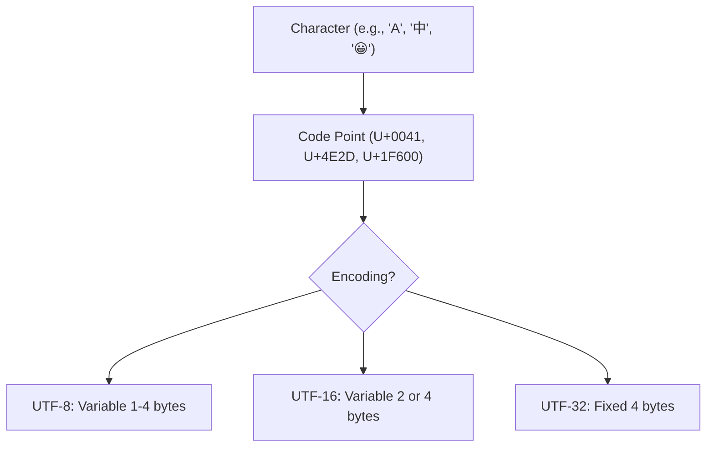
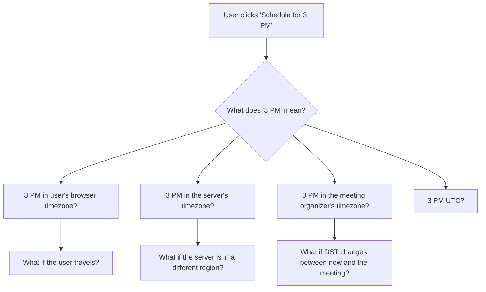

# Internationalization & Localization

Internationalization (i18n) is the process of designing software so it *can* support multiple languages and regions. Localization (l10n) is the process of actually adapting it for a specific locale. The distinction matters: i18n is an engineering concern, l10n is a content and cultural concern. You do i18n once. You do l10n for every locale you support.

Getting i18n wrong leads to garbled text, broken layouts, incorrect dates and currencies, and — in the worst cases — offensive or legally non-compliant content. Getting it right means your application works for the 75% of the world's population that does not speak English.

**Related**: [Browser Rendering Pipeline](/frontend-engineering/browser-rendering) | [Web Performance](/frontend-engineering/web-performance) | [State Management](/frontend-engineering/state-management)

---

## Unicode: The Foundation

Before you can display text in any language, you need to understand how text is encoded in bytes.

### The Encoding Landscape



### UTF-8 vs UTF-16 vs UTF-32

| Property | UTF-8 | UTF-16 | UTF-32 |
|----------|-------|--------|--------|
| **Bytes per character** | 1-4 | 2 or 4 | 4 |
| **ASCII compatible** | Yes | No | No |
| **Used by** | Web, Linux, modern APIs | JavaScript, Java, Windows | Internal processing |
| **Space for English** | 1 byte/char | 2 bytes/char | 4 bytes/char |
| **Space for CJK** | 3 bytes/char | 2 bytes/char | 4 bytes/char |
| **Space for emoji** | 4 bytes/char | 4 bytes/char | 4 bytes/char |

::: warning
**JavaScript strings are UTF-16 internally.** This means that emoji and many CJK characters are represented as **surrogate pairs** — two 16-bit code units for a single character. This is the source of countless bugs:

```javascript
const emoji = '😀';
console.log(emoji.length);        // 2 (NOT 1!)
console.log([...emoji].length);   // 1 (spread uses iterators, which handle surrogates)
console.log(emoji.slice(0, 1));   // '�' (broken surrogate)
```
:::

### String Length Gotchas

```javascript
// These all have "length 1" in human terms, but JavaScript disagrees:
'é'.length;      // 1 or 2, depending on normalization (e vs e + combining accent)
'👨‍👩‍👧‍👦'.length;  // 11 (family emoji is multiple code points joined by ZWJ)
'🇯🇵'.length;     // 4 (flag emoji is two regional indicator symbols)

// Safe way to count user-perceived characters (grapheme clusters):
const segmenter = new Intl.Segmenter('en', { granularity: 'grapheme' });
[...segmenter.segment('👨‍👩‍👧‍👦')].length; // 1
```

### Normalization

The same visual character can be represented multiple ways in Unicode:

```javascript
const a = 'é';       // U+00E9 (precomposed: single code point)
const b = 'é';       // U+0065 + U+0301 (decomposed: 'e' + combining accent)

a === b;             // false!
a.normalize('NFC') === b.normalize('NFC'); // true

// Always normalize user input before comparison or storage
```

| Form | Name | When to Use |
|------|------|-------------|
| **NFC** | Composed | Storage, comparison, most applications |
| **NFD** | Decomposed | Text processing, searching |
| **NFKC** | Compatibility composed | Identifiers, usernames |
| **NFKD** | Compatibility decomposed | Search indexing |

## The Horror of Timezones

Dates and times are the single most error-prone area in i18n. Timezones are not fixed offsets — they are political decisions that change regularly.

### Why Timezones Are Hard



::: danger
**Never store local times without timezone information.** Store timestamps as UTC (ISO 8601 with `Z` suffix) or as a pair of `(local_time, timezone_name)`. Using bare offsets like `+05:30` is insufficient because the offset for a given timezone changes with DST.

```javascript
// Bad: ambiguous
const bad = '2026-03-15T14:30:00';

// Good: UTC
const good = '2026-03-15T14:30:00Z';

// Good: explicit timezone
const alsoGood = '2026-03-15T14:30:00[America/New_York]';
```
:::

### Key Rules for Date/Time Handling

| Rule | Why |
|------|-----|
| **Store in UTC** | One canonical representation, no ambiguity |
| **Use IANA timezone names** | `America/New_York`, not `EST` (EST ignores DST) |
| **Display in user's locale** | Format dates, times, and calendars per locale |
| **Use Temporal API or libraries** | `Date` is broken; use `Temporal`, `date-fns`, or `Luxon` |
| **Test around DST transitions** | Clocks skip forward or repeat hours — edge cases abound |
| **Never compute timezone offsets yourself** | Use the IANA timezone database via your runtime |

### Common Pitfalls

```javascript
// Pitfall 1: Date parsing is locale-dependent
new Date('01/02/03'); // Jan 2, 2003? Feb 1, 2003? Depends on engine!

// Pitfall 2: Month is zero-indexed
new Date(2026, 2, 15); // March 15, 2026 (NOT February!)

// Pitfall 3: DST gaps
// March 8, 2026 at 2:30 AM ET does not exist (clocks spring forward)

// Pitfall 4: Day arithmetic across DST
const d = new Date('2026-03-07T12:00:00-05:00');
d.setDate(d.getDate() + 1);
// d is now March 8, but the time might be 13:00 instead of 12:00
```

## The Intl API

The `Intl` namespace provides locale-aware formatting without external libraries. It is built into every modern runtime and backed by the ICU library.

### Intl.NumberFormat

```javascript
// Currency
new Intl.NumberFormat('en-US', { style: 'currency', currency: 'USD' })
  .format(1234.5); // "$1,234.50"

new Intl.NumberFormat('de-DE', { style: 'currency', currency: 'EUR' })
  .format(1234.5); // "1.234,50 €"

new Intl.NumberFormat('ja-JP', { style: 'currency', currency: 'JPY' })
  .format(1234); // "￥1,234"

// Compact notation
new Intl.NumberFormat('en', { notation: 'compact' })
  .format(1500000); // "1.5M"

// Units
new Intl.NumberFormat('en', { style: 'unit', unit: 'kilometer-per-hour' })
  .format(120); // "120 km/h"
```

### Intl.DateTimeFormat

```javascript
const date = new Date('2026-03-20T15:30:00Z');

new Intl.DateTimeFormat('en-US', {
  dateStyle: 'full', timeStyle: 'long', timeZone: 'America/New_York'
}).format(date);
// "Friday, March 20, 2026 at 11:30:00 AM EDT"

new Intl.DateTimeFormat('ja-JP', {
  dateStyle: 'long', timeZone: 'Asia/Tokyo'
}).format(date);
// "2026年3月21日"

new Intl.DateTimeFormat('ar-EG', {
  dateStyle: 'full', timeZone: 'Africa/Cairo'
}).format(date);
// "الجمعة، ٢٠ مارس ٢٠٢٦"
```

### Intl.RelativeTimeFormat

```javascript
const rtf = new Intl.RelativeTimeFormat('en', { numeric: 'auto' });
rtf.format(-1, 'day');    // "yesterday"
rtf.format(3, 'hour');    // "in 3 hours"
rtf.format(-2, 'week');   // "2 weeks ago"

const rtfFr = new Intl.RelativeTimeFormat('fr', { numeric: 'auto' });
rtfFr.format(-1, 'day');  // "hier"
rtfFr.format(2, 'month'); // "dans 2 mois"
```

### Intl.Segmenter

```javascript
// Word segmentation for CJK languages (no spaces between words)
const segmenter = new Intl.Segmenter('ja', { granularity: 'word' });
const segments = [...segmenter.segment('東京都は日本の首都です')];
// Segments: 東京都 | は | 日本 | の | 首都 | です
```

## ICU Message Format & Pluralization

Pluralization rules vary wildly across languages. English has two forms (1 item, 2 items). Arabic has six. Polish has four. You cannot hard-code `count === 1 ? 'item' : 'items'`.

### ICU Message Syntax

```
// English
{count, plural,
  one {You have # item in your cart.}
  other {You have # items in your cart.}
}

// Polish (has 'few' and 'many' categories)
{count, plural,
  one {Masz # przedmiot w koszyku.}
  few {Masz # przedmioty w koszyku.}
  many {Masz # przedmiotów w koszyku.}
  other {Masz # przedmiotu w koszyku.}
}

// Select (gender)
{gender, select,
  male {He commented on your photo.}
  female {She commented on your photo.}
  other {They commented on your photo.}
}
```

### CLDR Plural Categories

| Category | Languages That Use It | Example (English) |
|----------|----------------------|-------------------|
| `zero` | Arabic, Latvian | 0 items |
| `one` | English, French, German | 1 item |
| `two` | Arabic, Hebrew, Slovenian | 2 items |
| `few` | Polish, Czech, Russian | 2-4 items |
| `many` | Polish, Russian, Arabic | 5-20 items |
| `other` | All languages (required) | Fallback |

::: tip
Always include the `other` category. It is the required fallback in every locale. If you only implement `one` and `other`, you will cover English and most Western European languages correctly.
:::

## RTL Layouts

Approximately 500 million people use right-to-left scripts (Arabic, Hebrew, Persian, Urdu). Supporting RTL is not just mirroring your CSS — it requires rethinking your entire layout model.

### CSS Logical Properties

Replace physical properties with logical ones so layouts automatically flip for RTL:

| Physical (avoid) | Logical (use) |
|----------|---------|
| `margin-left` | `margin-inline-start` |
| `margin-right` | `margin-inline-end` |
| `padding-left` | `padding-inline-start` |
| `text-align: left` | `text-align: start` |
| `float: left` | `float: inline-start` |
| `border-left` | `border-inline-start` |
| `left: 10px` | `inset-inline-start: 10px` |
| `width` | `inline-size` |
| `height` | `block-size` |

```css
/* Old: requires separate RTL overrides */
.sidebar {
  margin-left: 20px;
  padding-right: 16px;
  border-left: 2px solid #ccc;
}

/* New: works in both LTR and RTL automatically */
.sidebar {
  margin-inline-start: 20px;
  padding-inline-end: 16px;
  border-inline-start: 2px solid #ccc;
}
```

### Setting Document Direction

```html
<!-- Set direction on <html> based on locale -->
<html lang="ar" dir="rtl">

<!-- Or use CSS -->
<style>
:root[dir="rtl"] {
  /* RTL-specific overrides if logical properties aren't enough */
}
</style>
```

::: warning
**Icons and images often need mirroring for RTL.** A "forward" arrow should point left in RTL. A progress bar should fill from right to left. However, do NOT mirror icons that represent real-world objects (clocks, phones) or branded logos.
:::

### Bidirectional Text

When RTL and LTR text mix (e.g., an Arabic sentence containing an English brand name), the Unicode Bidirectional Algorithm (UBA) handles reordering. Sometimes it gets confused:

```html
<!-- Use <bdi> to isolate mixed-direction content -->
<p>المستخدم <bdi>@john_doe</bdi> أرسل رسالة</p>

<!-- Or use Unicode control characters -->
<!-- U+2066 (LRI) and U+2069 (PDI) for isolation -->
```

## i18n Libraries

### Comparison

| Library | Framework | Bundle Size | Key Feature |
|---------|-----------|------------|-------------|
| **react-intl** | React | ~40 KB | Full ICU, FormatJS ecosystem |
| **vue-i18n** | Vue | ~30 KB | Composition API support, SFC `<i18n>` blocks |
| **i18next** | Any | ~15 KB core | Plugin ecosystem, framework-agnostic |
| **@lingui/core** | React/Any | ~5 KB | Compile-time extraction, tiny runtime |
| **Paraglide** | Any | ~0 KB runtime | Fully compiled, tree-shaken per-message |

### i18next Example

```typescript
import i18next from 'i18next';

await i18next.init({
  lng: 'en',
  fallbackLng: 'en',
  resources: {
    en: {
      translation: {
        greeting: 'Hello, {​{name}}!',
        items: '{​{count}} item',
        items_plural: '{​{count}} items',
      }
    },
    ja: {
      translation: {
        greeting: 'こんにちは、{​{name}}さん！',
        items: '{​{count}}個のアイテム',
        // Japanese has no plural form — same string
      }
    }
  }
});

i18next.t('greeting', { name: 'Alice' }); // "Hello, Alice!"
i18next.t('items', { count: 5 });          // "5 items"
```

### vue-i18n Example

```vue
<template>
  <p>{​{ $t('greeting', { name: userName }) }}</p>
  <p>{​{ $t('items', itemCount) }}</p>
</template>

<i18n>
{
  "en": {
    "greeting": "Hello, {name}!",
    "items": "no items | one item | {count} items"
  },
  "fr": {
    "greeting": "Bonjour, {name} !",
    "items": "aucun élément | un élément | {count} éléments"
  }
}
</i18n>
```

## Translation Workflow

A production i18n pipeline is not just translating strings — it is a continuous workflow involving developers, translators, and automation.

### The Pipeline


### Translation Management Systems (TMS)

| TMS | Strengths | Integration |
|-----|-----------|-------------|
| **Crowdin** | GitHub/GitLab sync, in-context editing | CLI, CI/CD, over-the-air updates |
| **Lokalise** | Developer-friendly API, screenshot context | CLI, SDK, webhook-driven |
| **Phrase** | Enterprise features, branching | API, Figma plugin, GitHub Actions |
| **Transifex** | Open-source friendly, live editor | CLI, API, GitHub integration |

### Best Practices

| Practice | Why |
|----------|-----|
| **Never concatenate strings** | `"Hello " + name + "!"` breaks in languages with different word order |
| **Use ICU message format** | Handles plurals, gender, and nested selections properly |
| **Provide context for translators** | "Submit" as a button label vs "submit" as a verb have different translations in many languages |
| **Pseudo-localize in development** | Replace strings with accented versions (`Ĥéļļö`) to catch hardcoded text and layout issues |
| **Test with long strings** | German and Finnish words can be 30-40% longer than English equivalents |
| **Lazy-load locale data** | Do not bundle all 40 locale files; load the active one on demand |
| **Use namespaces** | Separate translations by feature (`auth.login`, `dashboard.title`) for incremental loading |

## Testing i18n

```typescript
// Pseudo-localization function for development
function pseudoLocalize(str: string): string {
  const map: Record<string, string> = {
    a: 'à', b: 'β', c: 'ç', d: 'ð', e: 'é', f: 'ƒ',
    g: 'ĝ', h: 'ĥ', i: 'î', j: 'ĵ', k: 'ķ', l: 'ļ',
    n: 'ñ', o: 'ö', p: 'þ', r: 'ŕ', s: 'š', t: 'ţ',
    u: 'û', w: 'ŵ', y: 'ý', z: 'ž',
  };
  return '[' + str.replace(/[a-z]/gi, c => map[c.toLowerCase()] || c) + ']';
}

// Use in development to spot untranslated strings
// Wrapped strings are translated; unwrapped ones are hardcoded
```

::: tip
**Pseudo-localization** is the single most effective testing technique for i18n. It makes every translated string visually distinct (accented, bracketed, ~30% longer) while remaining readable. Any text that is NOT pseudo-localized is hardcoded and will not translate.
:::

## Further Reading

- [Unicode CLDR](https://cldr.unicode.org/) — The definitive source for locale data (plural rules, date formats, currencies)
- [ICU Message Format](https://unicode-org.github.io/icu/userguide/format_parse/messages/) — The standard for parameterized, pluralized messages
- [CSS Logical Properties (MDN)](https://developer.mozilla.org/en-US/docs/Web/CSS/CSS_Logical_Properties) — Complete reference for bidirectional layouts
- [i18next documentation](https://www.i18next.com/) — The most popular framework-agnostic i18n library
- [Temporal API Proposal](https://tc39.es/proposal-temporal/) — The replacement for JavaScript's broken `Date` object
- [The Absolute Minimum Every Developer Must Know About Unicode](https://tonsky.me/blog/unicode/) — Tonsky's excellent Unicode primer
- [Falsehoods Programmers Believe About Time](https://gist.github.com/timvisee/fcda9bbdff88d45cc9061606b4b923ca) — Required reading before touching date/time code

---

::: tip Key Takeaway
- Internationalization (i18n) is an engineering concern you do once; localization (l10n) is a content concern you do for every locale — conflating them causes architectural mistakes.
- JavaScript strings are UTF-16 internally, which means emoji and many CJK characters are surrogate pairs — `'😀'.length` returns 2, not 1, and naively slicing strings can produce broken characters.
- The browser's `Intl` API (NumberFormat, DateTimeFormat, Segmenter, etc.) handles most locale-aware formatting without any external library.
:::

::: warning Common Misconceptions
- **"We'll add i18n later."** Retrofitting i18n into an existing application is 5-10x more expensive than building it in from the start. Hardcoded strings, concatenated sentences, and hardcoded date formats are scattered across hundreds of components.
- **"English has two plural forms, so we just need singular and plural."** Many languages have 3-6 plural categories (Arabic has six). Hardcoding `count === 1 ? 'item' : 'items'` breaks for Polish, Russian, Arabic, and dozens of other languages. Use ICU message format.
- **"RTL is just mirroring the CSS."** RTL support requires CSS logical properties, bidirectional text handling, icon mirroring decisions (arrows yes, clocks no), and testing every layout. It is a significant engineering effort, not a CSS find-and-replace.
- **"`string.length` gives you the character count."** JavaScript's `.length` counts UTF-16 code units, not user-perceived characters. The family emoji `'👨‍👩‍👧‍👦'` has `.length` of 11. Use `Intl.Segmenter` for grapheme-accurate counting.
- **"Timezones are fixed UTC offsets."** Timezones are political entities that change with DST, legislation, and historical decisions. `America/New_York` is `-05:00` in winter and `-04:00` in summer. Always use IANA timezone names, never bare offsets.
:::

## When NOT to Invest in i18n

- **Internal tools used by a single-language team** — If your admin dashboard is used by 10 people who all speak English, i18n adds unnecessary complexity. Hardcoded strings are fine.
- **Prototype or MVP stage** — Adding i18n infrastructure to an app that might pivot next month is premature. Ship in one language, validate the product, then internationalize.
- **Translating error messages and logs** — Backend error messages, stack traces, and system logs should remain in English for debuggability. Only translate user-facing text.
- **Full l10n without market validation** — Translating into 40 languages before confirming product-market fit in those markets wastes translation budget. Start with 2-3 high-value locales.

::: tip In Production
- **Airbnb** supports 62 languages and built a custom pseudo-localization pipeline that runs in development, automatically catching hardcoded strings by making translated text visually distinct (accented, lengthened, bracketed).
- **Shopify** uses the ICU message format across their admin and storefront, supporting complex plural rules for their global merchant base in 20+ languages.
- **Netflix** localizes not just text but entire UI layouts — their Arabic and Hebrew interfaces use full RTL layouts with mirrored animations and directionally-aware icons.
- **Vercel** open-sourced `next-intl` for Next.js, which supports ICU message format, per-page translation loading, and RSC-compatible i18n without shipping translation files to the client.
- **Spotify** uses Phrase (formerly Memsource) as their TMS, with automatic string extraction from their React codebase and in-context editing for translators who can see strings in the actual UI.
:::

::: details Quiz

**1. What is the difference between NFC and NFD Unicode normalization?**

::: details Answer
NFC (Composed) represents characters as single precomposed code points where possible (e.g., `e` is one code point `U+00E9`). NFD (Decomposed) splits characters into base + combining marks (e.g., `e` is `U+0065` + `U+0301`). Always normalize user input with NFC before storage or comparison, because the same visual character can have different byte representations.
:::

**2. Why should you never concatenate strings for translated text?**

::: details Answer
Different languages have different word orders, grammatical structures, and agreement rules. `"Hello " + name + "!"` assumes English word order. In Japanese, the greeting might be `name + "さん、こんにちは！"`. In Arabic, the name position differs entirely. Use parameterized messages like `t('greeting', { name })` so translators can reorder tokens.
:::

**3. What is pseudo-localization and why is it the most effective i18n testing technique?**

::: details Answer
Pseudo-localization replaces translated strings with accented, lengthened, bracketed versions (e.g., `"Hello"` becomes `"[Ĥéļļö]"`). It makes every translated string visually distinct while remaining readable. Any text that is NOT pseudo-localized is hardcoded and will not translate. It also tests layout with longer strings (German/Finnish are 30-40% longer than English).
:::

**4. Why is `Intl.Segmenter` necessary for counting characters in multilingual text?**

::: details Answer
JavaScript's `.length` counts UTF-16 code units, not user-perceived characters (grapheme clusters). Emoji like `'👨‍👩‍👧‍👦'` are 11 code units, flag emoji like `'🇯🇵'` are 4, and characters with combining diacritics can be 2+. `Intl.Segmenter` with `granularity: 'grapheme'` counts what humans perceive as single characters, which is essential for character limits, text truncation, and cursor positioning.
:::

**5. What are CSS logical properties and why are they essential for RTL support?**

::: details Answer
CSS logical properties replace physical directions (left/right) with flow-relative directions (inline-start/inline-end). `margin-inline-start` is `margin-left` in LTR and `margin-right` in RTL. Using logical properties means a single CSS codebase works correctly for both LTR and RTL without separate overrides. Physical properties require duplicating every directional style with `[dir="rtl"]` selectors.
:::

:::

::: details Exercise
**Build a Locale-Aware Date & Currency Formatter**

Create a utility module that:

1. Formats dates according to the user's locale using `Intl.DateTimeFormat`
2. Formats currencies with proper symbol placement using `Intl.NumberFormat`
3. Displays relative time ("2 hours ago", "yesterday") using `Intl.RelativeTimeFormat`
4. Handles edge cases: timezone conversion, zero-indexed months, DST transitions

Test with at least 4 locales: `en-US`, `de-DE`, `ja-JP`, `ar-EG`

::: details Solution
```typescript
class LocaleFormatter {
  constructor(private locale: string, private timezone: string = 'UTC') {}

  formatDate(date: Date, style: 'full' | 'long' | 'medium' | 'short' = 'long'): string {
    return new Intl.DateTimeFormat(this.locale, {
      dateStyle: style,
      timeZone: this.timezone,
    }).format(date);
  }

  formatDateTime(date: Date): string {
    return new Intl.DateTimeFormat(this.locale, {
      dateStyle: 'medium',
      timeStyle: 'short',
      timeZone: this.timezone,
    }).format(date);
  }

  formatCurrency(amount: number, currency: string): string {
    return new Intl.NumberFormat(this.locale, {
      style: 'currency',
      currency,
    }).format(amount);
  }

  formatRelativeTime(date: Date): string {
    const now = Date.now();
    const diffMs = date.getTime() - now;
    const diffSec = Math.round(diffMs / 1000);
    const diffMin = Math.round(diffSec / 60);
    const diffHour = Math.round(diffMin / 60);
    const diffDay = Math.round(diffHour / 24);

    const rtf = new Intl.RelativeTimeFormat(this.locale, { numeric: 'auto' });

    if (Math.abs(diffSec) < 60) return rtf.format(diffSec, 'second');
    if (Math.abs(diffMin) < 60) return rtf.format(diffMin, 'minute');
    if (Math.abs(diffHour) < 24) return rtf.format(diffHour, 'hour');
    return rtf.format(diffDay, 'day');
  }
}

// Test
const formatters = [
  new LocaleFormatter('en-US', 'America/New_York'),
  new LocaleFormatter('de-DE', 'Europe/Berlin'),
  new LocaleFormatter('ja-JP', 'Asia/Tokyo'),
  new LocaleFormatter('ar-EG', 'Africa/Cairo'),
];

const testDate = new Date('2026-03-20T15:30:00Z');
for (const fmt of formatters) {
  console.log(fmt.formatDate(testDate));
  console.log(fmt.formatCurrency(1234.5, 'USD'));
  console.log(fmt.formatRelativeTime(new Date(Date.now() - 7200000)));
}
```

Expected outputs:
- `en-US`: "March 20, 2026" / "$1,234.50" / "2 hours ago"
- `de-DE`: "20. Marz 2026" / "1.234,50 $" / "vor 2 Stunden"
- `ja-JP`: "2026年3月21日" / "$1,234.50" / "2 時間前"
- `ar-EG`: "٢٠ مارس ٢٠٢٦" / "١٬٢٣٤٫٥٠ US$" / "قبل ساعتين"
:::

:::

> **One-Liner Summary:** Internationalization is not translating strings — it is engineering your application so that language, script direction, date formats, number systems, and cultural conventions are never assumptions.
