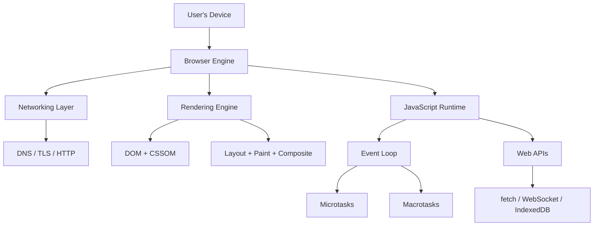
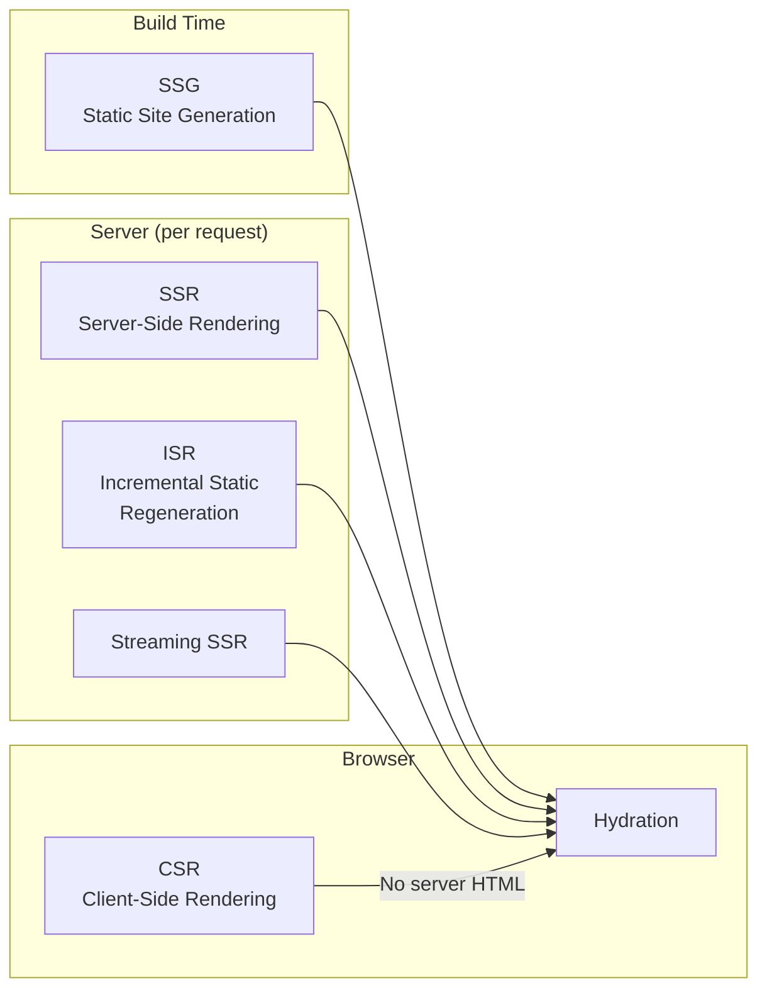
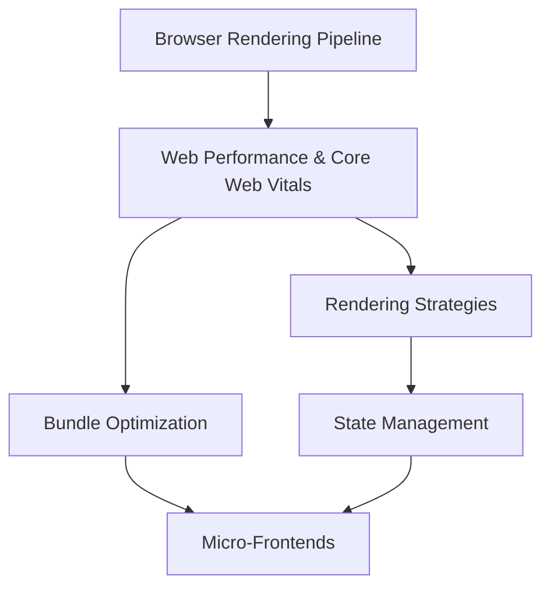

# Frontend Engineering

Frontend engineering has undergone a fundamental transformation. What was once the domain of jQuery plugins and hand-rolled AJAX calls is now a sophisticated discipline spanning compilers, virtual DOMs, streaming server rendering, and sub-millisecond interaction budgets. The browser is no longer just a document viewer — it is a full-fledged application runtime, and treating it as anything less produces slow, fragile, inaccessible experiences.

This section builds your understanding from the ground up. Not by listing frameworks and hoping one sticks, but by teaching the underlying principles that make every framework work — and the trade-offs that determine when each one fails.

## Why Frontend Engineering Is Hard

The frontend has constraints that no other layer of the stack shares:

1. **You ship code to an environment you do not control.** The user's browser, device, network connection, and OS are all unknowns. A backend engineer deploys to a known server. A frontend engineer deploys to a billion different computers.

2. **Performance is a user experience metric.** A 200ms API response is fast. A 200ms UI freeze is noticeable. Users perceive jank at 16ms frame boundaries. The tolerances are orders of magnitude tighter than backend work.

3. **The platform evolves underneath you.** Browser APIs ship, deprecate, and behave inconsistently. CSS specifications take years to stabilize. JavaScript proposals move through TC39 stages while your production bundle still ships polyfills for features that landed five years ago.

4. **State lives everywhere.** URL parameters, local storage, session storage, cookies, in-memory component state, server state, WebSocket connections, service worker caches — the frontend has more state sources than any backend service.



## The Modern Frontend Stack

### Build Tools

The build tool landscape has consolidated around speed. Webpack dominated for years, but its JavaScript-based architecture hit a performance ceiling. The current generation leverages native languages:

| Tool | Language | Primary Use Case | Cold Start |
|------|----------|-----------------|------------|
| **Vite** | Go (esbuild) + Rust (Rollup 4) | Dev server + production builds | ~300ms |
| **esbuild** | Go | Bundling, transpilation | ~50ms |
| **SWC** | Rust | Transpilation (Babel replacement) | ~20ms |
| **Turbopack** | Rust | Next.js bundler | ~200ms |
| **Rspack** | Rust | Webpack-compatible bundler | ~200ms |
| **Rollup** | Rust (v4) / JS (v3) | Library bundling | ~400ms |
| **Webpack** | JavaScript | Legacy, plugin ecosystem | ~2000ms |

::: tip Key Insight
The shift to Rust and Go for build tools is not a fad. JavaScript is fundamentally single-threaded and garbage-collected — two properties that make it poorly suited for CPU-intensive compilation work. Native tools are 10-100x faster because they can parallelize across cores and avoid GC pauses.
:::

### Frameworks

Frameworks are no longer just about rendering UI. They now own routing, data fetching, build optimization, and deployment:

| Framework | Rendering | Key Innovation |
|-----------|-----------|----------------|
| **React 19** | CSR, SSR, RSC | Server Components, Suspense boundaries |
| **Next.js 15** | SSR, SSG, ISR, RSC | App Router, partial prerendering |
| **Vue 3** | CSR, SSR, SSG | Composition API, reactive primitives |
| **Nuxt 4** | SSR, SSG, ISR | Auto-imports, server routes |
| **Svelte 5** | CSR, SSR, SSG | Runes (fine-grained reactivity), no virtual DOM |
| **SolidJS** | CSR, SSR | Fine-grained reactivity, no virtual DOM |
| **Astro** | SSG, SSR | Islands architecture, zero JS by default |
| **Qwik** | SSR | Resumability (no hydration) |

### Languages

TypeScript is no longer optional for production frontend work. The type system catches entire categories of bugs at compile time, enables superior IDE tooling, and serves as living documentation:

```typescript
// Without types: what does this return? What shape is `user`?
function getDisplayName(user) {
  return user.firstName + ' ' + user.lastName;
}

// With types: the contract is explicit and enforced
interface User {
  id: string;
  firstName: string;
  lastName: string;
  email: string;
  role: 'admin' | 'editor' | 'viewer';
}

function getDisplayName(user: Pick<User, 'firstName' | 'lastName'>): string {
  return `${user.firstName} ${user.lastName}`;
}
```

## Rendering Strategies at a Glance

How and where your HTML is generated is the single most impactful architectural decision in frontend engineering:



| Strategy | TTFB | FCP | TTI | SEO | Dynamic Data |
|----------|------|-----|-----|-----|-------------|
| CSR | Fast | Slow | Slow | Poor | Excellent |
| SSR | Slow | Fast | Medium | Excellent | Excellent |
| SSG | Fastest | Fastest | Fast | Excellent | Poor |
| ISR | Fast | Fast | Fast | Excellent | Good |
| Streaming SSR | Fast | Fastest | Fast | Excellent | Excellent |

Each strategy has deep trade-offs covered in the [Rendering Strategies](/frontend-engineering/rendering-strategies) page.

## What This Section Covers

### Core Concepts

- **[Web Performance & Core Web Vitals](/frontend-engineering/web-performance)** — LCP, INP, CLS explained from first principles. Performance budgets, image optimization, font loading, third-party script management, and measurement tools.

- **[Browser Rendering Pipeline](/frontend-engineering/browser-rendering)** — The critical rendering path: DOM construction, CSSOM, render tree, layout, paint, and compositing. Understanding reflows, repaints, and GPU acceleration.

- **[Rendering Strategies](/frontend-engineering/rendering-strategies)** — CSR, SSR, SSG, ISR, streaming SSR, and React Server Components. A decision matrix for choosing the right approach.

### Architecture

- **[State Management Patterns](/frontend-engineering/state-management)** — Local vs global vs server state. Redux Toolkit, Zustand, Jotai, Signals, TanStack Query, and XState. When you don't need a state library at all.

- **[Micro-Frontends](/frontend-engineering/micro-frontends)** — Module Federation, Web Components, import maps, and iframe-based approaches. Build-time vs runtime integration. When micro-frontends help and when they are organizational theater.

### Optimization

- **[Bundle Optimization](/frontend-engineering/bundle-optimization)** — Tree shaking, code splitting, dynamic imports, bundle analysis, compression, and the module/nomodule pattern.

## Learning Path

Start with the browser rendering pipeline — you cannot optimize what you do not understand. Then move to performance and Core Web Vitals, which give you the metrics to measure against. Rendering strategies and state management are architectural decisions that should be informed by your performance requirements. Bundle optimization and micro-frontends are scaling concerns that matter once your application reaches a certain size.



| Order | Topic | Difficulty | Estimated Time |
|-------|-------|------------|----------------|
| 1 | Browser Rendering Pipeline | Advanced | 2 hr |
| 2 | Web Performance & Core Web Vitals | Intermediate | 2.5 hr |
| 3 | Rendering Strategies | Intermediate | 2 hr |
| 4 | Bundle Optimization | Intermediate | 2 hr |
| 5 | State Management Patterns | Intermediate | 2.5 hr |
| 6 | Micro-Frontends | Advanced | 2 hr |

## Cross-References

This section connects deeply to other parts of Archon:

- **[Performance Engineering](/performance/)** — Backend profiling, V8 internals, and caching strategies complement frontend optimization
- **[UI & Design Systems](/ui-design-systems/)** — Component patterns, accessibility, and typography directly impact frontend architecture
- **[Infrastructure > CI/CD](/infrastructure/ci-cd/)** — Build pipelines, artifact management, and deployment strategies for frontend apps
- **[Security > API Security](/security/api-security/)** — CORS, CSP headers, and input validation on the client

---

> *"The best frontend code is the code you never ship to the browser."*
