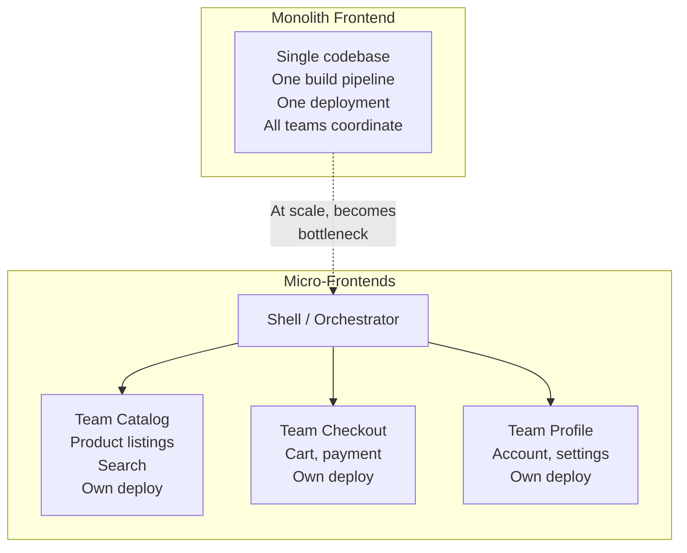
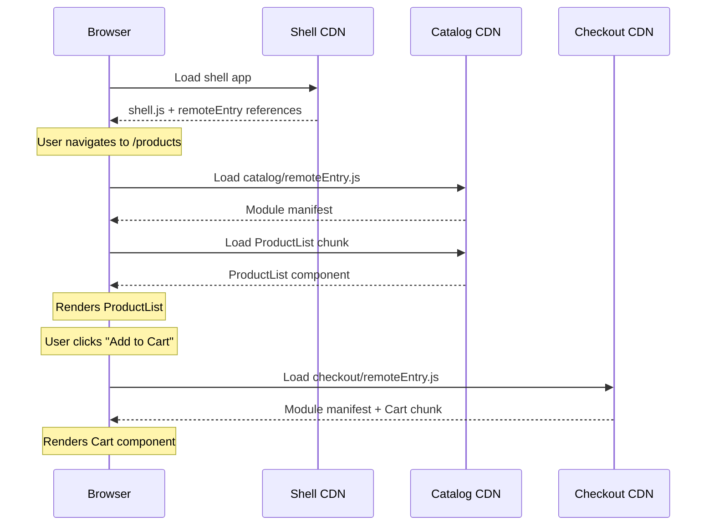
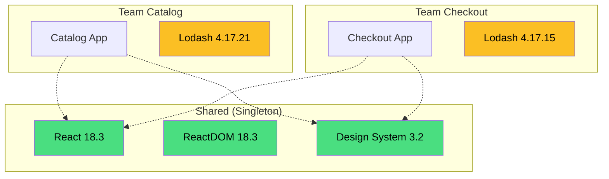
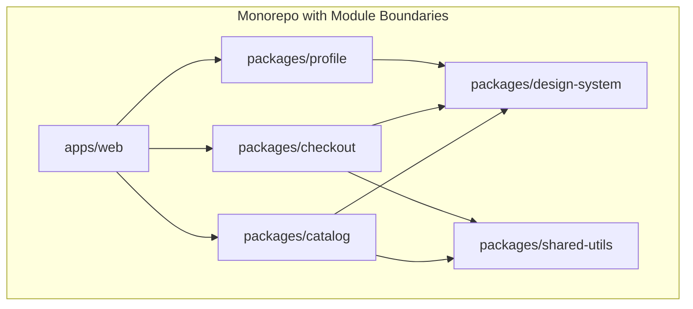

# Micro-Frontends

Micro-frontends extend the microservices philosophy to the frontend: instead of building a single monolithic frontend application, you compose the UI from independently developed, tested, and deployed pieces. Each piece is owned by a vertical team that controls everything from the database to the UI for their domain.

This sounds elegant in theory. In practice, micro-frontends introduce significant complexity that is only justified for specific organizational and technical contexts. This page covers the approaches, their trade-offs, and — critically — when you should **not** use them.

## Why Micro-Frontends Exist

Micro-frontends solve **organizational problems**, not technical ones. The motivation is always the same: multiple teams need to ship independently without stepping on each other.



### The Problems They Solve

| Problem | How Micro-Frontends Help |
|---------|------------------------|
| **Deployment coupling** | Team A's broken CSS no longer blocks Team B's critical feature release |
| **Tech stack lock-in** | Team C can migrate from Angular to React while others stay on Vue |
| **Team autonomy** | Teams own their full vertical slice — DB to UI — and deploy independently |
| **Build time scaling** | A 10-minute build for a monolith becomes 2-minute builds per micro-frontend |
| **Code ownership** | Clear boundaries prevent "shared component" ownership ambiguity |

## Integration Approaches

### 1. Build-Time Integration (NPM Packages)

Each micro-frontend is published as an npm package and composed at build time:

```typescript
// package.json of the shell application
{
  "dependencies": {
    "@acme/catalog-ui": "^2.3.0",
    "@acme/checkout-ui": "^1.8.0",
    "@acme/profile-ui": "^3.1.0"
  }
}

// Shell application
import { CatalogPage } from '@acme/catalog-ui';
import { CheckoutPage } from '@acme/checkout-ui';
import { ProfilePage } from '@acme/profile-ui';

function App() {
  return (
    <Router>
      <Route path="/catalog/*" element={<CatalogPage />} />
      <Route path="/checkout/*" element={<CheckoutPage />} />
      <Route path="/profile/*" element={<ProfilePage />} />
    </Router>
  );
}
```

| Advantage | Disadvantage |
|-----------|-------------|
| Type safety across boundaries | Requires shell rebuild + redeploy for any change |
| Tree shaking works perfectly | Version conflicts between packages |
| No runtime overhead | Tight coupling defeats the purpose |
| Simple mental model | Not truly independent deployments |

::: warning This Is Not Really Micro-Frontends
Build-time integration is just a well-organized monorepo with published packages. You lose the primary benefit of micro-frontends — independent deployments. If Team Checkout ships a new version, the shell must rebuild and redeploy. Use this approach for shared component libraries, not micro-frontends.
:::

### 2. Runtime Integration: Module Federation

Webpack Module Federation (and its successor in Rspack) allows applications to share code at runtime. Each micro-frontend is a separately deployed webpack build that exposes modules for others to consume:

```typescript
// Team Catalog's webpack config (remote)
// webpack.config.js
const { ModuleFederationPlugin } = require('webpack').container;

module.exports = {
  plugins: [
    new ModuleFederationPlugin({
      name: 'catalog',
      filename: 'remoteEntry.js',
      exposes: {
        './ProductList': './src/components/ProductList',
        './ProductDetail': './src/components/ProductDetail',
        './SearchBar': './src/components/SearchBar',
      },
      shared: {
        react: { singleton: true, requiredVersion: '^18.0.0' },
        'react-dom': { singleton: true, requiredVersion: '^18.0.0' },
      },
    }),
  ],
};

// Shell application's webpack config (host)
module.exports = {
  plugins: [
    new ModuleFederationPlugin({
      name: 'shell',
      remotes: {
        catalog: 'catalog@https://catalog.cdn.example.com/remoteEntry.js',
        checkout: 'checkout@https://checkout.cdn.example.com/remoteEntry.js',
      },
      shared: {
        react: { singleton: true, requiredVersion: '^18.0.0' },
        'react-dom': { singleton: true, requiredVersion: '^18.0.0' },
      },
    }),
  ],
};

// Shell application uses remote components
const ProductList = React.lazy(() => import('catalog/ProductList'));
const CheckoutCart = React.lazy(() => import('checkout/Cart'));

function App() {
  return (
    <Suspense fallback={<Loading />}>
      <Router>
        <Route path="/products" element={<ProductList />} />
        <Route path="/cart" element={<CheckoutCart />} />
      </Router>
    </Suspense>
  );
}
```



### 3. Import Maps (Native Browser Federation)

Import maps are a browser-native mechanism for controlling module resolution. Combined with ES modules served from different origins, they enable micro-frontends without a bundler plugin:

```html
<!-- Shell index.html -->
<script type="importmap">
{
  "imports": {
    "react": "https://esm.sh/react@18.3.1",
    "react-dom": "https://esm.sh/react-dom@18.3.1",
    "@acme/catalog": "https://catalog.cdn.example.com/index.js",
    "@acme/checkout": "https://checkout.cdn.example.com/index.js",
    "@acme/profile": "https://profile.cdn.example.com/index.js"
  }
}
</script>

<script type="module">
  // All micro-frontends share the same React instance
  // Each team deploys their module independently
  import { mount as mountCatalog } from '@acme/catalog';
  import { mount as mountCheckout } from '@acme/checkout';

  const route = window.location.pathname;
  if (route.startsWith('/catalog')) {
    mountCatalog(document.getElementById('app'));
  } else if (route.startsWith('/checkout')) {
    mountCheckout(document.getElementById('app'));
  }
</script>
```

### 4. Web Components

Web Components provide framework-agnostic encapsulation. Each micro-frontend registers custom elements that can be used in any host, regardless of framework:

```typescript
// Team Catalog: ProductCard Web Component
class ProductCard extends HTMLElement {
  static observedAttributes = ['product-id'];

  private shadow: ShadowRoot;

  constructor() {
    super();
    this.shadow = this.attachShadow({ mode: 'open' });
  }

  async connectedCallback() {
    const productId = this.getAttribute('product-id');
    const product = await this.fetchProduct(productId!);

    this.shadow.innerHTML = `
      <style>
        :host {
          display: block;
          border: 1px solid #e0e0e0;
          border-radius: 8px;
          padding: 16px;
          font-family: system-ui;
        }
        .price { color: #2563eb; font-size: 1.25rem; font-weight: 600; }
        button {
          background: #2563eb;
          color: white;
          border: none;
          padding: 8px 16px;
          border-radius: 4px;
          cursor: pointer;
        }
      </style>
      <h3>${product.name}</h3>
      <p>${product.description}</p>
      <p class="price">$${product.price}</p>
      <button>Add to Cart</button>
    `;

    this.shadow.querySelector('button')!.addEventListener('click', () => {
      this.dispatchEvent(new CustomEvent('add-to-cart', {
        bubbles: true,
        composed: true, // Crosses shadow DOM boundary
        detail: { productId: product.id, price: product.price },
      }));
    });
  }

  private async fetchProduct(id: string) {
    const res = await fetch(`/api/products/${id}`);
    return res.json();
  }
}

customElements.define('product-card', ProductCard);
```

```html
<!-- Shell: Works in React, Vue, Angular, or plain HTML -->
<product-card product-id="abc-123"></product-card>

<script>
  document.addEventListener('add-to-cart', (e) => {
    console.log('Product added:', e.detail);
  });
</script>
```

### 5. Iframes

The oldest and most isolated approach. Each micro-frontend runs in its own browsing context:

```html
<!-- Shell -->
<nav><!-- Shell-owned navigation --></nav>
<iframe
  src="https://catalog.example.com/products"
  title="Product Catalog"
  style="width: 100%; height: calc(100vh - 60px); border: none;"
  sandbox="allow-scripts allow-same-origin allow-forms"
></iframe>
```

| Advantage | Disadvantage |
|-----------|-------------|
| Complete isolation (CSS, JS, DOM) | No shared state, layout constraints |
| Security sandbox | Accessibility nightmare (nested documents) |
| Team can use any technology | Deep linking and routing are complex |
| Crashes are contained | Performance overhead (separate rendering pipeline) |
| Works with legacy apps | Mobile responsiveness is difficult |

## Shared Dependencies and Versioning

The biggest technical challenge in micro-frontends is managing shared dependencies. If Team A uses React 18.2 and Team B uses React 18.3, you need to either:

1. **Share a singleton** (both teams use the same instance)
2. **Ship duplicates** (larger bundle, potential conflicts)

### Module Federation Shared Strategy

```typescript
// Shared dependency configuration
const shared = {
  react: {
    singleton: true,         // Only one copy in the app
    requiredVersion: '^18.0.0',
    eager: false,            // Load lazily
  },
  'react-dom': {
    singleton: true,
    requiredVersion: '^18.0.0',
  },
  // Libraries that CAN have multiple versions
  lodash: {
    singleton: false,        // Allow multiple versions
    requiredVersion: '^4.17.0',
  },
  // Design system must be shared
  '@acme/design-system': {
    singleton: true,
    requiredVersion: '^3.0.0',
    strictVersion: true,     // Fail if version incompatible
  },
};
```

### Versioning Strategy



## Communication Between Micro-Frontends

Micro-frontends need to communicate — "product was added to cart," "user logged out," "locale changed." The key constraint: communication must be **loosely coupled**. Direct imports between micro-frontends defeat the purpose.

### Custom Events (Recommended)

```typescript
// Shared event contract (published as a types package)
interface MicroFrontendEvents {
  'cart:item-added': { productId: string; quantity: number };
  'cart:item-removed': { productId: string };
  'auth:logged-in': { userId: string };
  'auth:logged-out': {};
  'locale:changed': { locale: string };
}

// Type-safe event bus
class EventBus {
  emit<K extends keyof MicroFrontendEvents>(
    event: K,
    detail: MicroFrontendEvents[K]
  ): void {
    window.dispatchEvent(new CustomEvent(event, { detail }));
  }

  on<K extends keyof MicroFrontendEvents>(
    event: K,
    handler: (detail: MicroFrontendEvents[K]) => void
  ): () => void {
    const listener = (e: Event) => {
      handler((e as CustomEvent).detail);
    };
    window.addEventListener(event, listener);
    return () => window.removeEventListener(event, listener);
  }
}

export const eventBus = new EventBus();

// Team Catalog publishes
eventBus.emit('cart:item-added', { productId: 'abc-123', quantity: 1 });

// Team Checkout subscribes
const unsubscribe = eventBus.on('cart:item-added', ({ productId, quantity }) => {
  addToCart(productId, quantity);
});
```

### Shared State (via URL or Shared Store)

```typescript
// URL-based shared state (simplest, most portable)
// Each micro-frontend reads from and writes to URL parameters
function getSharedFilters(): Filters {
  const params = new URLSearchParams(window.location.search);
  return {
    category: params.get('category') ?? 'all',
    sort: params.get('sort') ?? 'relevance',
    page: parseInt(params.get('page') ?? '1', 10),
  };
}

function setSharedFilters(filters: Partial<Filters>): void {
  const params = new URLSearchParams(window.location.search);
  Object.entries(filters).forEach(([key, value]) => {
    if (value !== undefined) params.set(key, String(value));
  });
  window.history.replaceState({}, '', `?${params.toString()}`);
  window.dispatchEvent(new PopStateEvent('popstate'));
}
```

## When NOT to Use Micro-Frontends

::: danger Most Teams Should Not Use Micro-Frontends
Micro-frontends are an organizational scaling strategy, not a technical improvement. If you have fewer than 4-5 frontend teams, a well-structured monolith (monorepo with clear module boundaries) is simpler, faster, and more maintainable. The following are signs you do NOT need micro-frontends:
:::

### Anti-Indicators

| Signal | Why Micro-Frontends Won't Help |
|--------|-------------------------------|
| Small team (< 10 frontend devs) | Coordination cost is lower than integration complexity |
| Single framework | No framework interop needed — use a monorepo |
| Shared user journey | Checkout flow across 3 teams creates 3x the integration bugs |
| Performance-critical app | Runtime integration adds latency and bundle size |
| Early-stage startup | Premature architecture — you'll pivot before you scale |

### The Hidden Costs

1. **Duplicate infrastructure**: Each micro-frontend needs its own CI/CD pipeline, monitoring, error tracking, and CDN configuration.
2. **Consistent UX is hard**: Without a shared design system enforced at build time, visual inconsistencies creep in.
3. **Integration testing is complex**: Testing the full user journey requires running multiple apps simultaneously.
4. **Performance overhead**: Multiple frameworks, duplicate libraries, and runtime stitching add weight.
5. **Developer experience degrades**: Local development requires running multiple dev servers; debugging crosses process boundaries.

### The Better Alternative for Most Teams



A monorepo with clear package boundaries (using Turborepo, Nx, or pnpm workspaces) gives you:
- Module ownership and clear boundaries
- Shared type safety and design system
- Single build, single deploy, single CI pipeline
- Atomic cross-package refactoring
- No runtime integration overhead

## Further Reading

- [Architecture Patterns > Microservices](/architecture-patterns/microservices/) — Backend counterpart to micro-frontends
- [Bundle Optimization](/frontend-engineering/bundle-optimization) — Optimize shared dependencies and code splitting
- [Infrastructure > CI/CD](/infrastructure/ci-cd/) — Pipeline patterns for multi-app deployments
- [Rendering Strategies](/frontend-engineering/rendering-strategies) — How SSR/SSG interacts with micro-frontend composition
